# Architecture — Jim

*Last updated: 2026-06-02*

> This document is generated and maintained by `/jim:arch`. Edit via the skill to preserve consistency.

---

## Project Structure

```
jim/
├── .claude-plugin/
│   └── plugin.json          # Plugin manifest — name, version, description
├── .claude/
│   └── settings.local.json  # Local permission allowlists (WebFetch domains, etc.)
├── agents/                  # Agent definitions — one .md per agent persona
│   ├── pm.md                # @jim:pm — product manager
│   ├── architect.md         # @jim:architect — technical architect
│   ├── researcher.md        # @jim:researcher — codebase investigator
│   ├── coder.md             # @jim:coder — TDD implementer
│   ├── security.md          # @jim:security — design-time security analyst
│   └── meta.md              # @jim:meta — plugin developer (builds jim itself)
├── skills/                  # Skill definitions — one directory per skill
│   ├── spec/                # /jim:spec — collaborative spec creation
│   ├── spec-check/          # /jim:spec-check — Socratic DoD audit (invoked by /jim:spec Step 9)
│   ├── plan/                # /jim:plan — implementation planning
│   ├── research/            # /jim:research — codebase and landscape investigation
│   ├── build/               # /jim:build — TDD red-green-refactor execution
│   ├── debug/               # /jim:debug — structured failure diagnosis
│   ├── sec/                 # /jim:sec — design-time security analysis (016)
│   │   ├── SKILL.md
│   │   ├── assets/
│   │   │   └── security-template.md   # security.md output structure
│   │   └── references/
│   │       └── security-dod.md        # Validation checklist for reviews
│   ├── vision/              # /jim:vision — product vision and strategy
│   ├── roadmap/             # /jim:roadmap — execution milestones
│   ├── arch/                # /jim:arch — architecture document generation
│   ├── brainstorm/          # /jim:brainstorm — freeform ideation capture
│   ├── issue/               # /jim:issue — discovery-artifact capture (017)
│   │   ├── SKILL.md
│   │   └── assets/
│   │       └── issue-template.md      # YAML-frontmatter template
│   ├── issues/              # /jim:issues — trend view + INDEX.md generator (017)
│   │   ├── SKILL.md
│   │   └── scripts/
│   │       ├── index.sh                # Frontmatter scan → INDEX.md (atomic)
│   │       └── render.sh               # INDEX.md → trend view to stdout
│   ├── conf/                # /jim:conf — config inspector + shared resolver script
│   │   ├── SKILL.md
│   │   └── scripts/
│   │       └── jimconf.sh   # Shared bash resolver — !-injected by every consuming skill
│   ├── file/                # /jim:file — file/path operation surface (008)
│   │   ├── SKILL.md
│   │   └── scripts/
│   │       └── jimfile.sh   # exists/get/slug/date/next-id/path/glob; shells out to jimconf.sh
│   ├── meta-skill/          # /jim:meta-skill — create/update jim skills
│   ├── meta-agent/          # /jim:meta-agent — create/update jim agents
│   └── meta-test/           # /jim:meta-test — scaffold and run bash tests (007)
│       ├── SKILL.md
│       ├── assets/
│       │   └── test-file.sh.tmpl   # Per-script test scaffold template (__NAME__, __SCRIPT_PATH__)
│       └── scripts/
│           ├── testlib.sh          # Shared framework: globals, asserts, fixtures, reporter
│           ├── run.sh              # Aggregate runner: sources testlib + every tests/*.sh
│           └── metatest.sh         # Dispatcher: scaffold/add/run subcommands
├── tests/                   # Developer-only; not loaded by Claude Code (per-script test files only)
│   ├── jimconf.sh           # Per-script tests for skills/conf/scripts/jimconf.sh (executable)
│   ├── jimfile.sh           # Per-script tests for skills/file/scripts/jimfile.sh (executable)
│   ├── issues.sh            # Per-script tests for skills/issues/scripts/{index,render}.sh (executable)
│   └── metatest.sh          # Per-script tests for skills/meta-test/scripts/metatest.sh (executable)
├── docs/
│   ├── specs/               # Spec groups with numbered spec directories
│   │   └── jim/             # Specs for jim's own development (001–017)
│   ├── issues/              # Discovery-artifact capture (per spec 017)
│   │   ├── INDEX.md         # Auto-generated index — regenerated on every /jim:issue write
│   │   └── YYYYMMDD-slug.md # One markdown file per issue
│   ├── prior-art/           # Reference material from other projects (gitignored downloads)
│   └── notes/               # Personal development notes
├── VISION.md                # Product vision — problem, solution, audience, north star
├── ROADMAP.md               # Execution sequence
├── WORKFLOW.md              # The SDLC process definition — commands, artifacts, philosophy
├── CLAUDE.md                # Claude Code project instructions
├── jimconf.toml.example     # Example project-level path overrides; users copy to jimconf.toml
└── README.md                # Project readme
```

## High-Level System Diagram

```mermaid
flowchart TD
    subgraph User
        U[Developer via Claude Code]
    end

    subgraph "Strategic Skills"
        VIS["/jim:vision"]
        ROAD["/jim:roadmap"]
        ARCH["/jim:arch"]
        BRAIN["/jim:brainstorm"]
    end

    subgraph "SDLC Skills"
        SPEC["/jim:spec"]
        RES["/jim:research"]
        PLAN["/jim:plan"]
        BUILD["/jim:build"]
        DEBUG["/jim:debug"]
        SEC["/jim:sec"]
    end

    subgraph "Discovery Skills"
        ISSUE["/jim:issue"]
        ISSUES["/jim:issues"]
    end

    subgraph "Meta Skills"
        MS["/jim:meta-skill"]
        MA["/jim:meta-agent"]
        MT["/jim:meta-test"]
    end

    subgraph Agents
        PM["@jim:pm"]
        ARCHITECT["@jim:architect"]
        RESEARCHER["@jim:researcher"]
        CODER["@jim:coder"]
        SECURITY["@jim:security"]
        META["@jim:meta"]
    end

    subgraph Artifacts
        VDOC["VISION.md"]
        RDOC["ROADMAP.md"]
        ADOC["ARCHITECTURE.md"]
        SDOC["spec.md"]
        PDOC["plan.md"]
        RESDOC["research.md"]
        CODE["Tests + Code"]
        BDOC["brainstorm.md"]
        DDOC["debug report"]
        SECDOC["security.md"]
        IDOC["docs/issues/* + INDEX.md"]
    end

    U --> VIS & ROAD & ARCH & BRAIN
    U --> SPEC & RES & PLAN & BUILD & DEBUG & SEC
    U --> ISSUE & ISSUES
    U --> MS & MA & MT

    VIS & ROAD & BRAIN --> PM
    ARCH --> ARCHITECT
    SPEC --> PM
    RES --> RESEARCHER
    PLAN --> ARCHITECT
    BUILD & DEBUG --> CODER
    SEC --> SECURITY
    ISSUE --> PM
    MS & MA & MT --> META

    PM --> VDOC & RDOC & SDOC & BDOC & IDOC
    ARCHITECT --> ADOC & PDOC
    RESEARCHER --> RESDOC
    CODER --> CODE & DDOC
    SECURITY --> SECDOC
    ISSUES -.->|reads| IDOC

    ARCHITECT -.->|spawns| RESEARCHER
    META -.->|delegates| PM & ARCHITECT & RESEARCHER
```



## Core Components

### Agents

Agents are markdown files (`agents/*.md`) that define personas with frontmatter metadata. Each agent declares its name, description, skill bindings, tool permissions, and model preference.

- **Purpose:** Define the persona, responsibilities, and boundaries for each specialized role in the SDLC
- **Location:** `agents/` — `pm.md` (L1–75), `architect.md` (L1–81), `researcher.md` (L1–84), `coder.md` (L1–84), `security.md` (L1–86), `meta.md` (L1–64)
- **Interfaces:** Frontmatter fields: `name`, `description`, `skills` (list), `tools` (list), `model` (string). Body contains persona instructions, context paths, core principles, process delegation, and constraints.
- **Dependencies:** Each agent references its bound skills in `skills/`. Agents may spawn other agents via the `Agent()` tool declaration (e.g., architect and PM can spawn researcher; meta can spawn PM, architect, researcher).
- **Key Constraints:** Agents do not cross domain boundaries — PM does not write code, coder does not modify specs, researcher does not make design decisions. All agents stop after producing an artifact and wait for human approval.

### Skills

Skills are SKILL.md files inside `skills/{name}/` directories, optionally accompanied by `assets/` (templates) and `references/` (methodology docs).

- **Purpose:** Provide the detailed process instructions that agents follow when a `/jim:{verb}` command is invoked
- **Location:** `skills/` — 15 SDLC + strategic + discovery skill directories (spec, spec-check, plan, research, build, debug, sec, vision, roadmap, arch, brainstorm, issue, issues, meta-skill, meta-agent) plus supporting skills (`conf/`, `file/`, `meta-test/`, `review/`, and the `meta-matrix*` probe family)
- **Interfaces:** Frontmatter fields: `name`, `description`, `agent` (which agent runs this skill), `argument-hint`. Body contains step-by-step process, argument routing, validation checklists.
- **Dependencies:** Skills reference their `assets/` templates and `references/` docs. Skills are bound to agents via the `agent` frontmatter field (documentation convention, not runtime routing).
- **Key Constraints:** SKILL.md stays under 500 lines (progressive disclosure). Templates live in `assets/`, methodology in `references/`.

The post-build arch-feedback loop closes the gap between code changes and the locked-constraint architecture document. `/jim:build` step 5.2 reads the configured architecture path; if it exists, `/jim:build` invokes `/jim:arch` via the Skill tool to refresh ARCHITECTURE.md against the just-built code. The trigger is existence-conditioned — when no architecture document is configured, the step is silently skipped. `/jim:arch` step 6 then branches on the `auto_arch_feedback` config flag (default `"false"`): `"true"` writes the update directly and summarizes changes; `"false"` runs the existing diff-and-confirm flow.

A second canonical `Skill(jim:<name>)` invocation site is `/jim:spec` Step 9, which calls `Skill(jim:spec-check)` to run the Socratic DoD audit on the just-written `spec.md`. The audit returns structured outcomes (deflections, retained external constraints, orphan-AC flags) which `/jim:spec` applies inline under a bounded-retry cap of 3 iterations before surfacing a deflection summary at Step 10. The pattern matches `/jim:build` → `/jim:arch`: namespaced permission token in `allowed-tools`, Skill tool in body, target path passed explicitly as `args` because `$ARGUMENTS` does not auto-forward.

The design-time security review (spec 016) introduces a third pair of `Skill(jim:<name>)` invocation sites at workflow gates: `/jim:plan` Step 2 and `/jim:build` Step 2. When `require_security` or `auto_security` is set in `jimconf.toml`, the gate at each phase reads `security.md` from the spec directory and checks the `reviewed_phases:` frontmatter array. `/jim:plan` requires `spec` in the array; `/jim:build` requires `plan`. When coverage is absent, the gate invokes `Skill(jim:sec)` with the spec directory as `args`. The called skill runs analysis (data classification → freeform expert review → STRIDE sweep → conditional LINDDUN sweep when PII / credentials / session data is present), routes findings (developer in the loop under `require_security`; auto-Edit under `auto_security`), and optionally loops via `require_security_loop` until `require_security_loop_sev` is clear or `auto_security_loop_limit` is reached. If the loop hits the limit with unresolved findings at the configured severity, `/jim:sec` exits non-zero with a structured halt-error block, and the calling phase halts cleanly. In default mode (neither flag set), `/jim:spec` and `/jim:plan` instead emit a conversational pre-approval offer at end of flow; the developer chooses whether to run `/jim:sec`, and findings are advisory. As of spec 018, `/jim:sec` findings accept `Issue` as a third `Route:` value alongside `Spec` and `Plan`; findings so routed materialize as candidates in the end-of-phase batch (severity → priority mapping: Critical→critical, Notable→high, Advisory→medium), and a `### Candidate issues` subsection in `security.md`'s `## Routing Recommendations` records which findings became issues.

Spec 018 also wires issue capture into the SDLC chain across seven skills. Each of `/jim:spec`, `/jim:research`, `/jim:plan`, `/jim:build`, `/jim:brainstorm`, `/jim:debug`, and `/jim:sec` carries an "end-of-phase candidate batch" step at the conclusion of its primary work, before its final approval / stop. The step is gated by `issue_capture` (default `"true"`); when enabled, the skill materializes candidates from out-of-scope discoveries surfaced during the run, and `auto_issue_file` (default `"false"`) selects between an interactive batch confirm UI (per-row file/edit/skip with bulk `file all` / `skip all`) and a quiet auto-file path that writes all candidates and emits a one-line summary. The per-row `edit` action inlines the spec 017 AC-C2 confirm-or-edit narrative with its sensitive-content scrub reminder. `/jim:build`'s batch runs as administrative housekeeping after the final TDD task commit and after Step 6.2's `/jim:arch` refresh (which writes `ARCHITECTURE.md` but does not commit it); filed issue files coexist with the pending arch-refresh as administrative working-tree artifacts the developer commits in a follow-up step. Candidate text drawn from non-user-prompt sources (tool results, file reads, web fetches, prior-issue body content) is treated as untrusted at accumulation time, extending spec 017 AC-S2's `<untrusted-issue-content>` discipline (canonical wording at `skills/issue/SKILL.md` Step 7).

### Plugin Manifest

- **Purpose:** Declares jim as a Claude Code plugin with name, version, and metadata
- **Location:** `.claude-plugin/plugin.json` (L1–16)
- **Interfaces:** Standard Claude Code plugin JSON: `name`, `version`, `description`, `author`, `keywords`
- **Dependencies:** None — consumed by Claude Code's plugin loader
- **Key Constraints:** `name` must be `"jim"` — all skills and agents are namespaced under this

### WORKFLOW.md

- **Purpose:** Defines the entire SDLC process — command reference, artifact locations, agent-skill composition, lifecycle details, and philosophy
- **Location:** `WORKFLOW.md` (L1–431)
- **Interfaces:** Referenced by agents and skills as the canonical process definition
- **Dependencies:** None — upstream reference document
- **Key Constraints:** Single source of truth for the SDLC process. All agents and skills must be consistent with this document.

### Spec Archive

- **Purpose:** Living development artifacts — specs, research, and plans organized by group and sequential ID
- **Location:** `docs/specs/{group}/{00X}-{name}/` — currently `docs/specs/jim/001-meta/` through `017-issue-tracking/`
- **Interfaces:** Each spec directory contains up to three files: `spec.md`, `research.md`, `plan.md`
- **Dependencies:** Produced by PM (spec), researcher (research), and architect (plan) agents
- **Key Constraints:** IDs are 3-digit zero-padded, sequential within each group. Groups are noun-based directories. Specs must be `approved` before plans can be created.

## Data Stores

| Store | Type | Location | Purpose | Owned By |
| :--- | :--- | :--- | :--- | :--- |
| Spec Archive | Markdown files | `docs/specs/` | Persistent development artifacts — specs, research, plans | PM, Architect, Researcher |
| Strategic Docs | Markdown files | Project root (`VISION.md`, `ROADMAP.md`, `ARCHITECTURE.md`) | Project-level strategy and constraints | PM, Architect |
| Brainstorms | Markdown files | `docs/brainstorms/` | Freeform ideation capture | PM |
| Debug Reports | Markdown files | `docs/debug/` | Structured failure diagnosis | Coder |
| Issue Collection | Markdown files | `docs/issues/` (configurable via `issues_path`) | Discovery-artifact capture per spec 017; one file per issue plus auto-generated `INDEX.md` regenerated on every write | PM via `/jim:issue` (ad-hoc); the 7 surfacing skills (`/jim:spec`, `/jim:research`, `/jim:plan`, `/jim:build`, `/jim:brainstorm`, `/jim:debug`, `/jim:sec`) via their end-of-phase candidate batch per spec 018; `/jim:issues` for read view |

## External Integrations

| Integration | Type | Auth Method | Rate Limits | Failure Mode |
| :--- | :--- | :--- | :--- | :--- |
| Claude Code | Host platform | N/A (plugin loaded by Claude Code) | N/A | Plugin not available if not installed |
| WebFetch/WebSearch | Claude Code tools | Domain allowlist in `.claude/settings.local.json` | Subject to provider limits | Stop and ask user to fetch manually (per CLAUDE.md policy) |

## Deployment & Infrastructure

- **Runtime:** Claude Code plugin — no standalone runtime. Requires Claude Code CLI with plugin support.
- **Entry point:** `.claude-plugin/plugin.json` — Claude Code discovers and loads the plugin from this manifest
- **Configuration:** `.claude/settings.local.json` for permission allowlists. Optional `jimconf.toml` at the project root for path overrides (see Plugin Conventions → Scripting Layer).
- **Distribution:** Git repository. Users install by cloning/adding the repo as a Claude Code plugin.
- **Environment requirements:** Claude Code CLI plus a POSIX shell (`bash`) for the resolver in `skills/conf/scripts/`. The plugin is markdown-first with a minimal scripting layer; no build step, no package manager, no third-party dependencies.

## Security Considerations

- **Trust boundary:** All input comes from the human developer via Claude Code. Agents do not accept external input. WebFetch/WebSearch results are the only external data — handled by stopping on failure per CLAUDE.md policy.
- **Secrets management:** No secrets are stored or managed. `.claude/settings.local.json` contains domain allowlists only.
- **File system access:** Agents declare tool permissions in frontmatter. Coder agent has Bash access. All agents are prohibited from writing to `.git/`, `~/.ssh/`, `node_modules/`, `.venv/`, `.env`, `.env-*`. The `.gitignore` excludes `docs/prior-art/github.com/` (downloaded references) and `Z_*` files (personal notes).
- **Auth:** None — the plugin runs within the user's Claude Code session with their permissions.
- **Known risks:** No automated validation that agents respect their declared tool boundaries — enforcement depends on Claude Code's agent tool declarations and the model following instructions.

## Development & Testing

- **Setup:** Clone the repository and configure it as a Claude Code plugin
- **Run tests:** `bash skills/meta-test/scripts/run.sh` runs every case across every test file. Per-script files are also runnable standalone: `bash tests/jimconf.sh`, `bash tests/jimfile.sh`, `bash tests/issues.sh`. Substring filter preserved: `bash skills/meta-test/scripts/run.sh defaults`. Zero third-party dependencies.
- **Test framework:** Hand-rolled multi-file bash framework. `tests/testlib.sh` holds shared infrastructure (globals, asserts, fixtures, reporter); each per-script test file (`tests/jimconf.sh`, `tests/jimfile.sh`, …) sources it and contributes `case_*` functions. The reporter discovers cases by function-name convention (`declare -F | awk '$3 ~ /^case_/'`) — no `TESTS=()` registration array. Inline heredoc fixtures, per-runner `mktemp` sandbox, single trap-based cleanup.
- **Adding tests:** To add cases for a new script, create `tests/<name>.sh` (executable), source `testlib.sh`, define a `run_<name>` invoker plus `case_<name>_*` functions, and append the standalone-runnable tail. The aggregate runner picks it up automatically. Full 3-step recipe in `tests/run.sh` header.
- **Test conventions:** Tests live under `tests/` and are not loaded by Claude Code (which reads only `skills/` and `agents/`). LLM-interpreted skill prompts are validated by checklist; deterministic scripts are validated by the test suite.
- **Linting / formatting:** N/A — markdown + bash. Consistency enforced by templates in `skills/*/assets/` and the documentation discipline rules at the top of `tests/testlib.sh`, `tests/run.sh`, and `skills/conf/scripts/jimconf.sh`.

## Plugin Conventions

Conventions that govern how jim's agents, skills, and tools interact with Claude Code's runtime. These are easy to get wrong because some are jim-specific conventions layered on top of Claude Code mechanics.

### Naming

- **Skills:** `name` in frontmatter must match the directory name exactly (kebab-case). Enforced by the agentskills.io open standard.
- **Agents:** `name` in frontmatter must match the filename exactly (kebab-case, without `.md`).
- **Namespacing:** All skills appear as `/jim:{name}`, all agents as `@jim:{name}`. The `jim` prefix comes from the plugin name in `plugin.json`.

### Skill Invocation

- **Description is the trigger surface.** Skill descriptions are always in Claude's context. The full SKILL.md body loads only when the skill is invoked. Write descriptions that answer *what* and *when* — vague descriptions cause undertriggering.
- **`$ARGUMENTS` substitution.** When a user types `/jim:spec my-feature`, the string `my-feature` replaces `$ARGUMENTS` in the SKILL.md body. Skills use the `argument-hint` frontmatter field to document expected arguments.
- **The `agent:` field in skill frontmatter is a Claude Code routing mechanism that activates only when paired with `context: fork`.** Jim omits `context: fork`, so at runtime the field is a no-op and serves only as documentation — the skill body runs inline in the main thread, and routing into a subagent happens because the skill's instructions (and the named agent's `description` examples) direct Claude to spawn `@jim:<agent>` via the Agent tool.
- **Skill-to-skill invocation uses the `Skill(name)` permission token in `allowed-tools` and the Skill tool in the body** — e.g., `/jim:build` declares `Skill(jim:arch)` and invokes `/jim:arch` from step 5.2. The called skill's body runs inline in the same main thread (no fork), so the caller's `allowed-tools` covers nested tool calls inside the invoked skill. Use the namespaced form (`Skill(jim:<name>)`) for least-privilege; bare `Skill` is a wildcard and is avoided. The parent's `$ARGUMENTS` does **not** auto-forward to the called skill — the child's `$ARGUMENTS` is empty unless explicitly passed via the Skill tool's args parameter (empirically established by spec 014's S3 probe; see `docs/specs/jim/014-meta-matrix/plan.md` → Verification Log). **First-invocation trust prompt (empirical, 2026-05-14).** On the *first* invocation of a never-before-seen plugin skill in a workspace, Claude Code shows a "Use skill 'X'?" consent prompt regardless of `allowed-tools`. The "Yes, don't ask again for X in `<workspace>`" option persists workspace-scoped acceptance; subsequent invocations auto-approve. Confirmed empirically by spec 014's S4 probe. Whether the trigger is `context: fork` specifically or any new plugin skill is undetermined — see `docs/research/20260514-context-fork-permission-gate.md`.

### Agent Invocation

- **Agent markdown body = full system prompt.** Agents receive only their markdown body plus basic environment details. They do NOT inherit the parent Claude Code system prompt or conversation context. Agent definitions must be self-contained.
- **`model` defaults to `inherit`, not `sonnet`.** Must explicitly set `model: sonnet` (or `opus`, `haiku`) in agent frontmatter — omitting it inherits the parent's model.
- **`skills` field preloads full content.** Skills listed in an agent's `skills` frontmatter are injected into the agent's context at startup. Agents do NOT inherit skills from the parent conversation.
- **Plugin agents have lowest priority (4).** Project-level `.claude/agents/` overrides plugin agents of the same name. This means users can customize or override any jim agent locally.

### Subagent Delegation

- **`Agent(name1, name2)` syntax** in the `tools` field restricts which subagents an agent can spawn. Example: `tools: [Read, Write, Edit, Glob, Grep, Agent(pm, architect, researcher)]`.
- **One level only.** Subagents cannot nest — parent → child works, parent → child → grandchild does not. This is a Claude Code platform constraint.
- **Fresh context.** Subagents start with only the prompt passed via the Agent tool, not the parent's conversation history.

### Scripting Layer

Jim is markdown-first, but a minimal bash scripting layer at `skills/conf/scripts/jimconf.sh` resolves project-level path overrides for jim's strategic and SDLC documents. A second script — `skills/file/scripts/jimfile.sh` — extends the layer with deterministic file/path operations.

- **Single resolver, many consumers.** Every consuming skill (`vision`, `roadmap`, `arch`, `plan`, `spec`, `research`, `brainstorm`, `debug`, `meta-skill`, `meta-agent`, `build`) references the resolver via Claude Code's `!`-injection primitive: ``!`bash ${CLAUDE_PLUGIN_ROOT}/skills/file/scripts/jimfile.sh get vision` ``. The output replaces the placeholder in the skill body before the LLM reads it, so the resolved path lands in the prompt deterministically. **Skills and agents always call `jimfile.sh`, never `jimconf.sh` directly** — `jimfile.sh` chains internally to `jimconf.sh` for any operation that needs a configured path.
- **`${CLAUDE_PLUGIN_ROOT}` is the documented plugin-root substitution** — see `code.claude.com/docs/en/plugins-reference#environment-variables`. It resolves to the plugin's installation directory regardless of which skill consumes the script.
- **The `/jim:conf` skill** (`skills/conf/SKILL.md`) is a thin user-facing wrapper around the same script for human introspection (`/jim:conf list`, `/jim:conf get specs`, etc.). It carries no `agent:` binding because there is no LLM reasoning to delegate.
- **Config file:** optional `jimconf.toml` at the project root. Flat `KEY = "value"` lines for twenty configurable keys: ten paths (`specs_path`, `architecture_path`, `vision_path`, `roadmap_path`, `brainstorms_path`, `debug_path`, `pre_commit_path`, `pre_completion_path`, `security_adhoc_path`, `issues_path`), four enforcement / behavior flags from prior specs (`require_pre_commit`, `require_pre_completion`, `auto_arch_feedback`), five security-gate flags from spec 016 (`require_security`, `auto_security`, `require_security_loop`, `require_security_loop_sev`, `auto_security_loop_limit`), and the spec 018 workflow-integration knobs `issue_capture` (default `"true"`) and `auto_issue_file` (default `"false"`). Path keys append `_path` to the CLI key when looked up; `auto_*`/`require_*`-prefixed keys map to the same TOML name without a suffix; and `issue_capture` is the first bare-name boolean — its CLI key is also its TOML key, with no prefix and no `_path` suffix. The three dispatch arms share the `resolve()` convention. The bare-name convention signals "human-in-the-loop default": the `auto_` prefix is reserved for keys that *remove* a human step (e.g., `auto_arch_feedback`, `auto_security`, `auto_issue_file`), while `issue_capture` enables a workflow that still presents a choice to the developer. Missing file or missing keys silently fall through to defaults — zero-config is preserved. As of spec 017, `resolve()` also trims leading/trailing whitespace from parsed values and treats all-whitespace as empty, so configured whitespace-only values fall through to the documented default (defense against silent empty-path writes — `security.md` Finding 13). The resolver never `source`s the file (security model: user config is data, not code). The `pre_commit_path` and `pre_completion_path` defaults (`./pre-commit.sh`, `./pre-completion.sh`) are the *path-where-it-would-live*; consumers wrap calls in an existence gate at the skill layer, so a missing file is silently skipped unless the corresponding `require_*` flag is `"true"`. The security-loop flags use enum/integer values rather than booleans: `require_security_loop_sev` defaults to `"critical"` (one of `"critical"` / `"notable"` / `"advisory"`), and `auto_security_loop_limit` defaults to `"5"` — conservative caps that prevent runaway loops while preserving the developer's intent when looping is enabled.
- **File/path operations (`jimfile.sh`).** Sibling script under `skills/file/scripts/` exposing existence checks, configured-path resolution (`get <key>`, delegates to `jimconf.sh`), slug normalization, today's date, next spec ID, canonical artifact paths (spec/plan/research/debug/brainstorm/issue), glob discovery, and the valid-kinds list. Skills consume it via the same `!`-injection pattern: ``!`bash ${CLAUDE_PLUGIN_ROOT}/skills/file/scripts/jimfile.sh path debug "$ARGUMENTS"` ``. `jimfile.sh` shells out to `jimconf.sh` internally to honor `/jim:conf` overrides — the call uses a `BASH_SOURCE`-relative path (`../../conf/scripts/jimconf.sh`) so the inter-script composition travels with the plugin tree across cross-agent install scopes (e.g., `.agents/skills/`) where `${CLAUDE_PLUGIN_ROOT}` does not apply. The `/jim:file` skill (`skills/file/SKILL.md`) is the user-facing wrapper, mirroring `/jim:conf`'s shape (no `agent:` binding). As of spec 017, `jimfile.sh` carries `export LC_ALL=C` in its preamble (locale-independent behavior for `tr`, regex, and `date` operations — `security.md` Finding 11), an `is_valid_slug` validator for AC-C7-conformant inputs, and the `issue` kind with two operations: `path issue <slug>` (pure path composition against `issues_path`, slug must pass AC-C7 validation) and `next-id issue <subject>` (returns `YYYYMMDD-<normalized-slug>`).
- **Issue collection scripts (`skills/issues/scripts/`).** Two deterministic scripts own the issue-tracking write/read split. `index.sh` reads `<issues_dir>/*.md`, parses frontmatter line-orientedly (frontmatter-bounded scan; nested `relations:` parsed via `awk` 2-space-indent state machine; bidirectional integrity checks via `RELATION_INVERSE`), extracts validated wikilinks from issue bodies, and writes `INDEX.md` atomically via `tmp + mv` with `trap`-based cleanup. Failure preserves the previous `INDEX.md` unchanged. As of spec 018, `index.sh` runs a second pass between the main file scan and the bidirectional integrity check that validates each issue's `origin:` field: entries containing `/` are treated as path-shaped and `test -e` against the script's invoking CWD (PWD-relative resolution, matching the rest of jim's bash conventions); non-resolving paths surface as integrity warnings naming the slug, the broken path, and the issue's `created:` date; non-path tokens (`conversation`, `external`, etc.) are silently exempt; broken origins never block the file from being indexed or rendered. `render.sh` defensively re-invokes `index.sh`, then parses the resulting `INDEX.md` to emit a human-friendly trend view (Open/Closed summary, clusters by origin and label, top-N blocking by outgoing `blocks` edges, integrity-warnings passthrough). Both scripts use `set -uo pipefail; export LC_ALL=C` and resolve their target dir from `jimconf.sh get issues` when no argument is passed. `/jim:issue` invokes `index.sh` post-write (eager regen, AC-I2); the spec 018 candidate-batch step in the 7 surfacing skills invokes `index.sh` once at the batch boundary (after all candidate writes, never per-row, to keep `INDEX.md` regen O(1) per user action regardless of batch size); `/jim:issues` invokes `render.sh` (which calls `index.sh` defensively).
- **Tests:** Per-script test files at `tests/jimconf.sh`, `tests/jimfile.sh`, and `tests/metatest.sh` cover each script's CLI surface, defaults, parse robustness, and (where applicable) the `-c <path>` flag. The shared framework lives at `skills/meta-test/scripts/testlib.sh` and the aggregate runner at `skills/meta-test/scripts/run.sh`, so the meta-test skill owns its toolchain (per spec 007). Per-script files source the relocated lib via a `BASH_SOURCE`-relative path (`source "$(cd "$HERE/../skills/meta-test/scripts" && pwd)/testlib.sh"`). Run all via `bash skills/meta-test/scripts/run.sh` (or `/jim:meta-test run`), run a single script standalone via `bash tests/jimconf.sh` / `bash tests/jimfile.sh` / `bash tests/metatest.sh`. Filter by name substring still works: `bash skills/meta-test/scripts/run.sh jimfile` (or `/jim:meta-test run jimfile`).
- **Test scaffolding (`metatest.sh`).** Third script under `skills/meta-test/scripts/`. Three subcommands — `scaffold <name>` (create `tests/<name>.sh` from `assets/test-file.sh.tmpl`), `add <name> <case>` (append a `case_<name>_<case>()` stub), `run [name]` (invoke runner, standalone path preferred for one-file). The user-facing `/jim:meta-test` skill (`skills/meta-test/SKILL.md`) wraps the dispatcher with per-action gating: scaffold requires an approved spec+plan for the script-under-test (mirrors `meta-skill`/`meta-agent`); add and run are ungated.

### Bash-vs-Prompt Decision Rule

When deciding whether logic should live in a bash script or in a skill/agent prompt, apply the following heuristic. Bash is jim's canonical scripting language — confirmed as the genuine LCD across coding-agent platforms (see `docs/specs/jim/001-meta/research.md` → "Scripting Layer in jim plugin components"). Bash needs no runtime declaration; anything else (Python, JS) would require declaring `compatibility:` and would fail in environments lacking the runtime — including Anthropic's own default Claude Code devcontainer.

| Use a bash script when… | Use a prompt when… |
|---|---|
| The task is **deterministic** (same input → same output, no judgment). | The task requires **judgment, synthesis, or rationale** (interview, design tradeoff, validation reasoning). |
| The cost in tokens or latency through the LLM would be 10–1000× higher than a script. | Tokens/latency are dominated by the LLM's reasoning, not the mechanical step. |
| The result is **verifiable** by exit code or string compare. | The result is qualitative ("is this spec well-scoped?"). |
| The operation can fail loudly and recoverably (exit 1, empty string). | The operation needs graceful degradation or a conversational fallback. |

Examples that fit the rule (anchors): `skills/conf/scripts/jimconf.sh` (config parsing), `skills/file/scripts/jimfile.sh` (existence checks, slug, next-id, glob, path resolution), `skills/meta-test/scripts/*.sh` (deterministic test execution), `skills/issues/scripts/index.sh` and `render.sh` (frontmatter scan + atomic write, INDEX.md parse + trend view rendering). Counter-examples that rightly stay in prompts: the `/jim:spec` interview, the `/jim:issue` confirm-or-edit moment with scrub reminder, the `meta-skill`/`meta-agent` 7-point research spot-check, design tradeoff reasoning in `/jim:plan`.

### Logic-Flow Conventions

In-prompt existence/absence gates around `!`-injected paths use a sentinel-based vocabulary. The resolver (`jimfile.sh get <key>`) returns the literal string `NOT_FOUND` when a path-typed key resolves to a missing file. Gate logic binds the slot with `SET` first, then compares the bound name against `"NOT_FOUND"` in a paren-free `IF` block. The `!`-injection slot only ever appears as the right-hand side of a `SET` assignment — never inside `(...)`, never inside a predicate. This convention is forced by the wrapper-sensitivity rule in Substitution Conventions; see `docs/debug/20260512-skill-bash-substitution-wrappers.md` for the original silent-substitution defect and `docs/brainstorms/20260513-directive-vocab-exists-trap.md` for the EXISTS-trap defect that prompted the move to the sentinel form.

| Form                                                            | Meaning                                                                                                                                                              |
| --------------------------------------------------------------- | -------------------------------------------------------------------------------------------------------------------------------------------------------------------- |
| `SET <name> = !\`bash …\``                                      | bind the resolver's output (path-or-`NOT_FOUND`, or a raw value string for value keys) to a name for use in subsequent `IF` predicates                               |
| `IF <name> != "NOT_FOUND" THEN` *(indented body)* `ENDIF`       | body runs if the bound path-typed name resolved to a real on-disk path                                                                                                |
| `IF <name> == "true" THEN` *(indented body)* `ENDIF`            | body runs if the bound boolean-typed name is the string `"true"`                                                                                                     |
| `ELSE IF <name> == "value" THEN` *(indented body)*              | mirror branch; chain after the leading `IF` for either string-equality predicate                                                                                      |
| `ELSE` *(indented body)*                                        | optional fall-through; omit to make fall-through implicit (no branch fires = nothing happens)                                                                          |
| `ENDIF`                                                         | one word; closes the chain                                                                                                                                            |

Indentation under each keyword is the block delimiter. No loops, no `WHILE`, no `RETURN`. Bodies are natural-language imperatives — the *control flow* is the only shorthand. The `!`-injection slot in a `SET` line is always a resolver call such as `` !`bash ${CLAUDE_PLUGIN_ROOT}/skills/file/scripts/jimfile.sh get vision` ``.

**Single-action read:**

```
SET vision_doc = !`bash ${CLAUDE_PLUGIN_ROOT}/skills/file/scripts/jimfile.sh get vision`
IF vision_doc != "NOT_FOUND" THEN
  Read vision_doc — locked constraint. Do not re-litigate strategic decisions.
ENDIF
```

If absence carries its own instruction, lift it to a standalone sentence below the `ENDIF` (it runs unconditionally — the LLM reads it whether the file existed or not, and the wording carries "if absent, …" naturally):

```
SET arch_doc = !`bash ${CLAUDE_PLUGIN_ROOT}/skills/file/scripts/jimfile.sh get architecture`
IF arch_doc != "NOT_FOUND" THEN
  Read arch_doc — locked constraint. Technical invariants are not negotiable.
ENDIF
If absent, note the gap in the Constitution Check section and proceed without constraints.
```

**Multi-step gate with a real two-branch decision (data-loss-relevant cases):**

```
SET vision_doc = !`bash ${CLAUDE_PLUGIN_ROOT}/skills/file/scripts/jimfile.sh get vision`

IF vision_doc != "NOT_FOUND" THEN
  This is a differential update. Read the file and walk each section with the user.
ELSE
  Fresh creation. Proceed to interview.
ENDIF
```

The multi-step variant indents a numbered list under `THEN`; chain `ELSE IF <name> == "value" THEN` for value comparisons; no `DO:` / `DONE` markers, no fall-through prose — implicit when no branch fires:

```
SET pre_commit = !`bash ${CLAUDE_PLUGIN_ROOT}/skills/file/scripts/jimfile.sh get pre_commit`
SET require_pre_commit = !`bash ${CLAUDE_PLUGIN_ROOT}/skills/conf/scripts/jimconf.sh get require_pre_commit`

IF pre_commit != "NOT_FOUND" THEN
  1. Run the script via Bash and show the full output.
  2. STOP and wait for human guidance if the exit code is non-zero.
ELSE IF require_pre_commit == "true" THEN
  STOP with: "Required pre-commit script not found (configured path absent)."
ENDIF
```

**Where the sentinel vocabulary helps:**
- Existence-gated reads (most common — strategic doc lookups, optional config files).
- Existence-gated executes (e.g., a `pre_commit` script that's absent in most projects).
- Either/or branches based on file presence or boolean config flags.

**Where it does *not* help (revert to English):**
- Multi-condition logic (and/or chains).
- Loops over globbed results — use English + a `jimfile.sh glob` call.
- Branches that aren't string-equality comparisons.

**Markdown rendering:** `SET` lines substitute correctly as bare lines, indented under numbered steps (3-space indent — matrix Z ✅), and inside fenced or 4-space-indented code blocks (matrix N, O ✅). They do **not** substitute inside inline backticks (matrix P ❌). Keep `SET` lines outside inline-code.

This idiom is enforced by `meta-skill` and `meta-agent` validation checklists — invented variants (`WHEN ... PRESENT`, `IF FILE ... DO`, `ASSERT_EXISTS`, `STOP_IF_MISSING`, etc.) are a validation failure.

#### Anti-patterns

Two retired shapes — both must be rewritten to the sentinel form above.

**Tier 1: BASIC `IF (X) EXISTS THEN` paren-wrap** (silent substitution failure). The original convention wrapped `!`-injection slots in `IF (` … `) EXISTS THEN`. Claude Code's preprocessor does not recognize an `!`-injection slot when the slot is wrapped in `(...)` on the same line — the literal text reaches the LLM with backticks intact, no bash runs, and the gate evaluates against the unresolved substitution string rather than the real path. No error, no permission prompt, no log line — only wrong behavior downstream. See `docs/debug/20260512-skill-bash-substitution-wrappers.md` for the inventory of twelve production sites this defect produced.

**Tier 2: EXISTS-family directive vocabulary** (semantic-layer leak; EXISTS-trap). The interim convention used `READ_IF_EXISTS <slot> — note`, `RUN_IF_EXISTS`, `DO_IF_EXISTS <slot>:` + numbered list, and `IF <name> EXISTS THEN … ENDIF`. The substitution layer worked (matrix U–Z, AA, BB ✅), but the literal word "EXISTS" in directive names primed the executing agent to defensively `test -e` / `test -f` on already-resolved paths — observed empirically on 2026-05-13 in both `/jim:build` and `/jim:spec` runs. The empty-RHS readback under D2's path-or-empty resolver (`SET pre_commit = ` with nothing after the `=`) compounded the issue by reading as syntactically incomplete. See `docs/brainstorms/20260513-directive-vocab-exists-trap.md` for the defect record. Any line matching `^(READ|RUN|DO)_IF_EXISTS`, `IF <name> EXISTS THEN`, or `IF (!\`bash …\`) EXISTS THEN` is a regression. The heavier interim shape (`DO:` / `DONE` block markers, two-word `END IF`, explicit `Otherwise, skip silently` fall-through prose, verbose `When X resolves to "true"` comparisons) is also superseded.

### Substitution Conventions

Three sigils, three meanings. Mixing them is a validation failure.

| Sigil | Resolved by | Where it appears | Example |
| --- | --- | --- | --- |
| `<lower>` | LLM, before running the command | fenced bash blocks in SKILL.md | `path plan <group> <id> <name>` |
| `{lower}` | template generator | `assets/*.md` body | `title: "{title}"` |
| `$UPPER` / `${UPPER}` | shell, eagerly | inside `` !`…` `` injection | `"$ARGUMENTS"`, `${CLAUDE_PLUGIN_ROOT}` |

**Rules:**

- `<lower>` placeholders **must** live in a fenced code block, never inside `` !`…` ``. The `!`-injection primitive tokenizes the bash for permission checks at load time, and unquoted angle brackets fail the parser with "Unrecognized redirect shape". The hard-fail-on-load is intentional — it surfaces misuse immediately. Canonical call-site shape: see `skills/spec/SKILL.md`.
- `$UPPER` is reserved for real shell expansion. Only `$ARGUMENTS`, `$CLAUDE_PLUGIN_ROOT`, and `$CLAUDE_SKILL_DIR` are recognized; do not invent new shell-style names for LLM substitution (they would silently expand to empty inside `!`-injection).
- `{lower}` is for static template files under `assets/`; the SKILL.md prose tells the LLM how to fill them when rendering the template.
- **Script integrity:** every script referenced by an `` !`bash …` `` block must exist at the cited path. Eager injection runs the command at slash-command load time; a missing script breaks loading before the LLM sees the body.
- **Eager vs. deferred timing.** `!`-injection runs once, at slash-command load. Its inputs must be known at that point — stable paths from config, `$ARGUMENTS` when the skill *requires* one. If a value is only known after the LLM reads the body (because it asks the user, dispatches to one of several sub-actions, etc.), the call belongs in a fenced bash block instead — the LLM substitutes the value and runs the bash itself. Examples: `skills/brainstorm/SKILL.md` step 3 (topic gathered from user), `skills/meta-test/SKILL.md` (subcommand chosen at runtime).
- **Wrapper sensitivity.** An `!`-injection slot must not appear inside `(...)` on the same line — the preprocessor silently leaves the literal text in place, the bash never fires, and the LLM sees the raw backticks. This is a third failure mode of `!`-injection alongside the angle-bracket parser error and the missing-script load fault, but unlike those two it surfaces **no** error at load time. See `docs/debug/20260512-skill-bash-substitution-wrappers.md` for the source defect record. The retired BASIC `IF (X) EXISTS THEN` idiom is the canonical offender; it is replaced by the directive vocabulary documented in Logic-Flow Conventions. Manual regression fixture: the matrix skill family (dispatcher `skills/meta-matrix/` plus category sub-skills `skills/meta-matrix-bash-invocation/`, `skills/meta-matrix-variable-setting/`, `skills/meta-matrix-conditional-evaluation/`, `skills/meta-matrix-skill-invocation/`) — quit and relaunch Claude Code from the repo root so the matrix skill is discovered at session start, then invoke `/jim:meta-matrix` (no arg for chain-all, or `/jim:meta-matrix <category>` for one surface) and scan each sentinel for substitution vs. literal.
- **Fence / inline-code substitution behavior.** `!`-injection fires inside ` ``` ` fenced code blocks and 4-space indented code blocks (matrix N, O ✅). Only inline backticks (`` ` ``) suppress (matrix P ❌). Authors wanting to display a literal `!`-injection slot in documentation prose must use inline-code, never a fence. Source: `docs/debug/20260512-skill-bash-substitution-wrappers.md` §Expanded Test Matrix.

### Permission Conventions

Every `skills/*/SKILL.md` `allowed-tools` clause must name the exact script path(s) the skill `!`-injects or runs via fenced bash blocks — never a bare `Bash(bash *)` wildcard. The path uses the same sigil the body uses for that call: `${CLAUDE_PLUGIN_ROOT}` for cross-skill invocations, `${CLAUDE_SKILL_DIR}` for own-skill invocations.

**Cross-skill example** (skill body calls `${CLAUDE_PLUGIN_ROOT}/skills/file/scripts/jimfile.sh`):

```yaml
allowed-tools: Bash(bash ${CLAUDE_PLUGIN_ROOT}/skills/file/scripts/jimfile.sh *)
```

**Own-skill example** (skill body calls `${CLAUDE_SKILL_DIR}/scripts/jimconf.sh`):

```yaml
allowed-tools: Bash(bash ${CLAUDE_SKILL_DIR}/scripts/jimconf.sh *)
```

Frontmatter sigil substitution runs at the same load-time pass as body `!`-injection, so the `allowed-tools` clause must mirror each skill's actual call sites verbatim. A skill with two distinct call shapes (e.g. `meta-test` injects `jimfile.sh` cross-skill *and* runs `metatest.sh` own-skill via fenced blocks) needs two space-separated `Bash(...)` clauses, one per shape. The space between `bash` and the script path inside each clause is load-bearing — it anchors the word boundary that makes the prefix match script-specific instead of any `bash …` invocation. Adding a new `!`-injection or fenced bash call site to an existing SKILL.md body is also a frontmatter change — extend `allowed-tools` in the same edit. The `/jim:meta-skill` validation checklist enforces this on skill creation; refactors that bypass that flow must check by inspection. See Anti-Patterns → Permission Creep for the failure mode this convention prevents.

**Scope of skill `allowed-tools`: main-thread execution only.** Skill `allowed-tools` grants apply to the skill body's execution in the conversation that invoked it (the main thread when a slash command fires). They do not propagate to subagents spawned by the skill via the Agent tool — subagents have independent permission scopes (per `code.claude.com/docs/en/sub-agents.md`: "Each subagent runs in its own context window with a custom system prompt, specific tool access, and independent permissions"). So `Read(...)` clauses in skill frontmatter only suppress prompts for reads that happen in the main thread; reads that happen inside a spawned subagent still surface a permission prompt regardless of what the skill declared.

**Verified non-mechanisms (do not try):**

- Subagent frontmatter has no `allowed-tools` field (sub-agents frontmatter table lists `tools`, `disallowedTools`, `permissionMode`, etc. — not `allowed-tools`).
- The subagent `tools:` field accepts only bare tool names (`Read`, `Write`, `Bash`), not parameterized patterns like `Read(/path/**)`.
- For plugin subagents specifically, the `permissionMode`, `hooks`, and `mcpServers` frontmatter fields are silently ignored (`sub-agents.md` L227–228: "For security reasons, plugin subagents do not support…"), so `permissionMode: bypassPermissions` cannot be used to silence prompts from a plugin-shipped agent.
- The plugin manifest (`plugin.json` / `.claude-plugin/plugin.json`) does not accept a `permissions` field.
- Plugin-shipped `settings.json` honors only the `agent` and `subagentStatusLine` keys; `permissions.allow` entries inside a plugin's settings are ignored.
- The `${CLAUDE_PLUGIN_ROOT}` and `${CLAUDE_SKILL_DIR}` sigils substitute inside hooks, monitors, MCP, and LSP configs — but **not** inside `permissions.allow` patterns.
- Agent `skills:` preload injects the rendered SKILL.md body only; it does not include the skill's `assets/` or `references/` files.

**The only working cross-boundary path: user-side `.claude/settings.json`.** Permission rules in the user's project-level (or user-level) `.claude/settings.json` are inherited by subagents (`sub-agents.md` L388: "Subagents inherit the permission context from the main conversation"). Plugin authors cannot ship these rules — each user must add them locally if they want to suppress the per-session subagent Read prompt. See `README.md` → Permissions for the snippet jim recommends.

**Implication for jim's `allowed-tools` clauses:** the Bash narrowing above is fully effective (main-thread `!`-injection and fenced bash blocks run in the spawning thread, where skill `allowed-tools` applies). Read clauses for skills that delegate work to a subagent are **not** declared — they would be misleading documentation suggesting a working grant where there is none. See Anti-Patterns → Permission Creep.

### Progressive Disclosure

- **SKILL.md ≤ 500 lines.** Templates go in `assets/`, methodology docs in `references/`.
- **Agent body ≤ 800 tokens.** Keep agent definitions tight — delegate detail to preloaded skills.
- **`references/` files > 300 lines should have a ToC** at the top to help Claude find relevant sections without loading everything.
- **Inlined-methodology exception.** The default is `skills/{name}/references/{name}-dod.md` (see `research-dod.md`). When the methodology has a single consumer *and* per-invocation permission-prompt friction on plugin-relative reference reads outweighs the standalone-reference benefit, inline it into the skill body instead — `skills/spec-check/SKILL.md` (per spec 015 DD#9) documents the canonical case. Combined size must still respect the 500-line ceiling. `research-dod.md` retains the standard pattern.

### Anti-Patterns

These are documented failure modes from prior art research (`docs/specs/jim/001-meta/research.md`):

- **Personality Soup:** "I am an AI assistant here to help" — use direct second-person voice instead ("You are the technical architect for jim").
- **Permission Creep:** Write/Bash in a read-only agent's tool list, or bare `Bash(bash *)` in a SKILL.md `allowed-tools` clause when the skill only injects a specific script — follow least privilege. See Permission Conventions for the narrowed shape. Conversely, do not declare `Read(${CLAUDE_SKILL_DIR}/...)` clauses in skill frontmatter for skills that delegate work to a subagent — those grants do not propagate across the skill→subagent boundary (verified scope, see Permission Conventions) and the clause is misleading documentation suggesting authorization where there is none.
- **Instruction Shadowing:** Repeating rules already in CLAUDE.md — agents don't inherit CLAUDE.md, but skills that run in the main context do.
- **Duplicate Logic:** Same instructions in 3+ agents — extract to a shared skill instead.

## Glossary

| Term | Definition |
| :--- | :--- |
| Skill | A `/jim:{verb}` command defined in `skills/{name}/SKILL.md` — provides process instructions for an agent |
| Agent | A `@jim:{role}` persona defined in `agents/{name}.md` — executes one or more skills |
| Spec | A structured work definition (feature, bug, or refactor) in `docs/specs/` |
| Phase gate | A human approval checkpoint between SDLC phases (e.g., spec → plan → build) |
| Tidy First | Commit discipline where structural changes are separated from behavioral changes |
| Differential update | Reading an existing artifact before modifying it — never overwrite blindly |
| Progressive disclosure | Keeping SKILL.md concise (<500 lines) by delegating detail to `assets/` and `references/` |
| Meta | Jim developing Jim — using `@jim:meta` agent with `/jim:meta-skill` and `/jim:meta-agent` to build plugin components |
