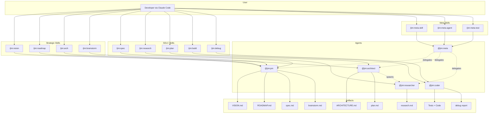

# Architecture — Jim

*Last updated: 2026-03-16*

> This document is generated and maintained by `/jim:arch`. Edit via the skill to preserve consistency.

---

## Project Structure

```
jim/
├── .claude-plugin/
│   └── plugin.json          # Plugin manifest — name, version, description
├── .claude/
│   └── settings.local.json  # Local permission allowlists (WebFetch domains, etc.)
├── agents/                  # Agent definitions — one .md per agent persona
│   ├── pm.md                # @jim:pm — product manager
│   ├── architect.md         # @jim:architect — technical architect
│   ├── researcher.md        # @jim:researcher — codebase investigator
│   ├── coder.md             # @jim:coder — TDD implementer
│   └── meta.md              # @jim:meta — plugin developer (builds jim itself)
├── skills/                  # Skill definitions — one directory per skill
│   ├── spec/                # /jim:spec — collaborative spec creation
│   ├── plan/                # /jim:plan — implementation planning
│   ├── research/            # /jim:research — codebase and landscape investigation
│   ├── build/               # /jim:build — TDD red-green-refactor execution
│   ├── debug/               # /jim:debug — structured failure diagnosis
│   ├── vision/              # /jim:vision — product vision and strategy
│   ├── roadmap/             # /jim:roadmap — execution milestones
│   ├── arch/                # /jim:arch — architecture document generation
│   ├── brainstorm/          # /jim:brainstorm — freeform ideation capture
│   ├── conf/                # /jim:conf — config inspector + shared resolver script
│   │   ├── SKILL.md
│   │   └── scripts/
│   │       └── jimconf.sh   # Shared bash resolver — !-injected by every consuming skill
│   ├── file/                # /jim:file — file/path operation surface (008)
│   │   ├── SKILL.md
│   │   └── scripts/
│   │       └── jimfile.sh   # exists/get/slug/date/next-id/path/glob; shells out to jimconf.sh
│   ├── meta-skill/          # /jim:meta-skill — create/update jim skills
│   ├── meta-agent/          # /jim:meta-agent — create/update jim agents
│   └── meta-test/           # /jim:meta-test — scaffold and run bash tests (007)
│       ├── SKILL.md
│       ├── assets/
│       │   └── test-file.sh.tmpl   # Per-script test scaffold template (__NAME__, __SCRIPT_PATH__)
│       └── scripts/
│           ├── testlib.sh          # Shared framework: globals, asserts, fixtures, reporter
│           ├── run.sh              # Aggregate runner: sources testlib + every tests/*.sh
│           └── metatest.sh         # Dispatcher: scaffold/add/run subcommands
├── tests/                   # Developer-only; not loaded by Claude Code (per-script test files only)
│   ├── jimconf.sh           # Per-script tests for skills/conf/scripts/jimconf.sh (executable)
│   ├── jimfile.sh           # Per-script tests for skills/file/scripts/jimfile.sh (executable)
│   └── metatest.sh          # Per-script tests for skills/meta-test/scripts/metatest.sh (executable)
├── docs/
│   ├── specs/               # Spec groups with numbered spec directories
│   │   └── jim/             # Specs for jim's own development (001–009)
│   ├── prior-art/           # Reference material from other projects (gitignored downloads)
│   └── notes/               # Personal development notes
├── VISION.md                # Product vision — problem, solution, audience, north star
├── ROADMAP.md               # Execution sequence
├── WORKFLOW.md              # The SDLC process definition — commands, artifacts, philosophy
├── CLAUDE.md                # Claude Code project instructions
├── jimconf.toml.example     # Example project-level path overrides; users copy to jimconf.toml
└── README.md                # Project readme
```

## High-Level System Diagram



## Core Components

### Agents

Agents are markdown files (`agents/*.md`) that define personas with frontmatter metadata. Each agent declares its name, description, skill bindings, tool permissions, and model preference.

- **Purpose:** Define the persona, responsibilities, and boundaries for each specialized role in the SDLC
- **Location:** `agents/` — `pm.md` (L1–75), `architect.md` (L1–81), `researcher.md` (L1–84), `coder.md` (L1–84), `meta.md` (L1–64)
- **Interfaces:** Frontmatter fields: `name`, `description`, `skills` (list), `tools` (list), `model` (string). Body contains persona instructions, context paths, core principles, process delegation, and constraints.
- **Dependencies:** Each agent references its bound skills in `skills/`. Agents may spawn other agents via the `Agent()` tool declaration (e.g., architect and PM can spawn researcher; meta can spawn PM, architect, researcher).
- **Key Constraints:** Agents do not cross domain boundaries — PM does not write code, coder does not modify specs, researcher does not make design decisions. All agents stop after producing an artifact and wait for human approval.

### Skills

Skills are SKILL.md files inside `skills/{name}/` directories, optionally accompanied by `assets/` (templates) and `references/` (methodology docs).

- **Purpose:** Provide the detailed process instructions that agents follow when a `/jim:{verb}` command is invoked
- **Location:** `skills/` — 11 skill directories (spec, plan, research, build, debug, vision, roadmap, arch, brainstorm, meta-skill, meta-agent)
- **Interfaces:** Frontmatter fields: `name`, `description`, `agent` (which agent runs this skill), `argument-hint`. Body contains step-by-step process, argument routing, validation checklists.
- **Dependencies:** Skills reference their `assets/` templates and `references/` docs. Skills are bound to agents via the `agent` frontmatter field (documentation convention, not runtime routing).
- **Key Constraints:** SKILL.md stays under 500 lines (progressive disclosure). Templates live in `assets/`, methodology in `references/`.

### Plugin Manifest

- **Purpose:** Declares jim as a Claude Code plugin with name, version, and metadata
- **Location:** `.claude-plugin/plugin.json` (L1–16)
- **Interfaces:** Standard Claude Code plugin JSON: `name`, `version`, `description`, `author`, `keywords`
- **Dependencies:** None — consumed by Claude Code's plugin loader
- **Key Constraints:** `name` must be `"jim"` — all skills and agents are namespaced under this

### WORKFLOW.md

- **Purpose:** Defines the entire SDLC process — command reference, artifact locations, agent-skill composition, lifecycle details, and philosophy
- **Location:** `WORKFLOW.md` (L1–431)
- **Interfaces:** Referenced by agents and skills as the canonical process definition
- **Dependencies:** None — upstream reference document
- **Key Constraints:** Single source of truth for the SDLC process. All agents and skills must be consistent with this document.

### Spec Archive

- **Purpose:** Living development artifacts — specs, research, and plans organized by group and sequential ID
- **Location:** `docs/specs/{group}/{00X}-{name}/` — currently `docs/specs/jim/001-meta/` through `006-coder/`
- **Interfaces:** Each spec directory contains up to three files: `spec.md`, `research.md`, `plan.md`
- **Dependencies:** Produced by PM (spec), researcher (research), and architect (plan) agents
- **Key Constraints:** IDs are 3-digit zero-padded, sequential within each group. Groups are noun-based directories. Specs must be `approved` before plans can be created.

## Data Stores

| Store | Type | Location | Purpose | Owned By |
| :--- | :--- | :--- | :--- | :--- |
| Spec Archive | Markdown files | `docs/specs/` | Persistent development artifacts — specs, research, plans | PM, Architect, Researcher |
| Strategic Docs | Markdown files | Project root (`VISION.md`, `ROADMAP.md`, `ARCHITECTURE.md`) | Project-level strategy and constraints | PM, Architect |
| Brainstorms | Markdown files | `docs/brainstorms/` | Freeform ideation capture | PM |
| Debug Reports | Markdown files | `docs/debug/` | Structured failure diagnosis | Coder |

## External Integrations

| Integration | Type | Auth Method | Rate Limits | Failure Mode |
| :--- | :--- | :--- | :--- | :--- |
| Claude Code | Host platform | N/A (plugin loaded by Claude Code) | N/A | Plugin not available if not installed |
| WebFetch/WebSearch | Claude Code tools | Domain allowlist in `.claude/settings.local.json` | Subject to provider limits | Stop and ask user to fetch manually (per CLAUDE.md policy) |

## Deployment & Infrastructure

- **Runtime:** Claude Code plugin — no standalone runtime. Requires Claude Code CLI with plugin support.
- **Entry point:** `.claude-plugin/plugin.json` — Claude Code discovers and loads the plugin from this manifest
- **Configuration:** `.claude/settings.local.json` for permission allowlists. Optional `jimconf.toml` at the project root for path overrides (see Plugin Conventions → Scripting Layer).
- **Distribution:** Git repository. Users install by cloning/adding the repo as a Claude Code plugin.
- **Environment requirements:** Claude Code CLI plus a POSIX shell (`bash`) for the resolver in `skills/conf/scripts/`. The plugin is markdown-first with a minimal scripting layer; no build step, no package manager, no third-party dependencies.

## Security Considerations

- **Trust boundary:** All input comes from the human developer via Claude Code. Agents do not accept external input. WebFetch/WebSearch results are the only external data — handled by stopping on failure per CLAUDE.md policy.
- **Secrets management:** No secrets are stored or managed. `.claude/settings.local.json` contains domain allowlists only.
- **File system access:** Agents declare tool permissions in frontmatter. Coder agent has Bash access. All agents are prohibited from writing to `.git/`, `~/.ssh/`, `node_modules/`, `.venv/`, `.env`, `.env-*`. The `.gitignore` excludes `docs/prior-art/github.com/` (downloaded references) and `Z_*` files (personal notes).
- **Auth:** None — the plugin runs within the user's Claude Code session with their permissions.
- **Known risks:** No automated validation that agents respect their declared tool boundaries — enforcement depends on Claude Code's agent tool declarations and the model following instructions.

## Development & Testing

- **Setup:** Clone the repository and configure it as a Claude Code plugin
- **Run tests:** `bash tests/run.sh` runs every case across every test file. Per-script files are also runnable standalone: `bash tests/jimconf.sh`, `bash tests/jimfile.sh`. Substring filter preserved: `bash tests/run.sh defaults`. Zero third-party dependencies.
- **Test framework:** Hand-rolled multi-file bash framework. `tests/testlib.sh` holds shared infrastructure (globals, asserts, fixtures, reporter); each per-script test file (`tests/jimconf.sh`, `tests/jimfile.sh`, …) sources it and contributes `case_*` functions. The reporter discovers cases by function-name convention (`declare -F | awk '$3 ~ /^case_/'`) — no `TESTS=()` registration array. Inline heredoc fixtures, per-runner `mktemp` sandbox, single trap-based cleanup.
- **Adding tests:** To add cases for a new script, create `tests/<name>.sh` (executable), source `testlib.sh`, define a `run_<name>` invoker plus `case_<name>_*` functions, and append the standalone-runnable tail. The aggregate runner picks it up automatically. Full 3-step recipe in `tests/run.sh` header.
- **Test conventions:** Tests live under `tests/` and are not loaded by Claude Code (which reads only `skills/` and `agents/`). LLM-interpreted skill prompts are validated by checklist; deterministic scripts are validated by the test suite.
- **Linting / formatting:** N/A — markdown + bash. Consistency enforced by templates in `skills/*/assets/` and the documentation discipline rules at the top of `tests/testlib.sh`, `tests/run.sh`, and `skills/conf/scripts/jimconf.sh`.

## Plugin Conventions

Conventions that govern how jim's agents, skills, and tools interact with Claude Code's runtime. These are easy to get wrong because some are jim-specific conventions layered on top of Claude Code mechanics.

### Naming

- **Skills:** `name` in frontmatter must match the directory name exactly (kebab-case). Enforced by the agentskills.io open standard.
- **Agents:** `name` in frontmatter must match the filename exactly (kebab-case, without `.md`).
- **Namespacing:** All skills appear as `/jim:{name}`, all agents as `@jim:{name}`. The `jim` prefix comes from the plugin name in `plugin.json`.

### Skill Invocation

- **Description is the trigger surface.** Skill descriptions are always in Claude's context. The full SKILL.md body loads only when the skill is invoked. Write descriptions that answer *what* and *when* — vague descriptions cause undertriggering.
- **`$ARGUMENTS` substitution.** When a user types `/jim:spec my-feature`, the string `my-feature` replaces `$ARGUMENTS` in the SKILL.md body. Skills use the `argument-hint` frontmatter field to document expected arguments.
- **The `agent:` field in skill frontmatter is a jim documentation convention, not a Claude Code routing mechanism.** Claude Code only uses `agent:` natively when paired with `context: fork`. Jim uses it as metadata to record which agent runs the skill — routing happens because the skill's instructions direct Claude to the right agent.

### Agent Invocation

- **Agent markdown body = full system prompt.** Agents receive only their markdown body plus basic environment details. They do NOT inherit the parent Claude Code system prompt or conversation context. Agent definitions must be self-contained.
- **`model` defaults to `inherit`, not `sonnet`.** Must explicitly set `model: sonnet` (or `opus`, `haiku`) in agent frontmatter — omitting it inherits the parent's model.
- **`skills` field preloads full content.** Skills listed in an agent's `skills` frontmatter are injected into the agent's context at startup. Agents do NOT inherit skills from the parent conversation.
- **Plugin agents have lowest priority (4).** Project-level `.claude/agents/` overrides plugin agents of the same name. This means users can customize or override any jim agent locally.

### Subagent Delegation

- **`Agent(name1, name2)` syntax** in the `tools` field restricts which subagents an agent can spawn. Example: `tools: [Read, Write, Edit, Glob, Grep, Agent(pm, architect, researcher)]`.
- **One level only.** Subagents cannot nest — parent → child works, parent → child → grandchild does not. This is a Claude Code platform constraint.
- **Fresh context.** Subagents start with only the prompt passed via the Agent tool, not the parent's conversation history.

### Scripting Layer

Jim is markdown-first, but a minimal bash scripting layer at `skills/conf/scripts/jimconf.sh` resolves project-level path overrides for jim's strategic and SDLC documents. A second script — `skills/file/scripts/jimfile.sh` — extends the layer with deterministic file/path operations.

- **Single resolver, many consumers.** Every consuming skill (`vision`, `roadmap`, `arch`, `plan`, `spec`, `research`, `brainstorm`, `debug`, `meta-skill`, `meta-agent`, `build`) references the resolver via Claude Code's `!`-injection primitive: ``!`bash ${CLAUDE_PLUGIN_ROOT}/skills/file/scripts/jimfile.sh get vision` ``. The output replaces the placeholder in the skill body before the LLM reads it, so the resolved path lands in the prompt deterministically. **Skills and agents always call `jimfile.sh`, never `jimconf.sh` directly** — `jimfile.sh` chains internally to `jimconf.sh` for any operation that needs a configured path.
- **`${CLAUDE_PLUGIN_ROOT}` is the documented plugin-root substitution** — see `code.claude.com/docs/en/plugins-reference#environment-variables`. It resolves to the plugin's installation directory regardless of which skill consumes the script.
- **The `/jim:conf` skill** (`skills/conf/SKILL.md`) is a thin user-facing wrapper around the same script for human introspection (`/jim:conf list`, `/jim:conf get specs`, etc.). It carries no `agent:` binding because there is no LLM reasoning to delegate.
- **Config file:** optional `jimconf.toml` at the project root. Flat `KEY = "value"` lines for ten configurable keys: eight paths (`specs_path`, `architecture_path`, `vision_path`, `roadmap_path`, `brainstorms_path`, `debug_path`, `pre_commit_path`, `pre_completion_path`) and two enforcement flags (`require_pre_commit`, `require_pre_completion`). Path keys append `_path` to the CLI key when looked up; flag keys (CLI keys starting with `require_`) map directly to the same TOML name without a suffix — the prefix is the dispatch convention in `resolve()`. Missing file or missing keys silently fall through to defaults — zero-config is preserved. The resolver never `source`s the file (security model: user config is data, not code). The `pre_commit_path` and `pre_completion_path` defaults (`./pre-commit.sh`, `./pre-completion.sh`) are the *path-where-it-would-live*; consumers wrap calls in an existence gate at the skill layer, so a missing file is silently skipped unless the corresponding `require_*` flag is `"true"`.
- **File/path operations (`jimfile.sh`).** Sibling script under `skills/file/scripts/` exposing existence checks, configured-path resolution (`get <key>`, delegates to `jimconf.sh`), slug normalization, today's date, next spec ID, canonical artifact paths (spec/plan/research/debug/brainstorm), glob discovery, and the valid-kinds list. Skills consume it via the same `!`-injection pattern: ``!`bash ${CLAUDE_PLUGIN_ROOT}/skills/file/scripts/jimfile.sh path debug "$ARGUMENTS"` ``. `jimfile.sh` shells out to `jimconf.sh` internally to honor `/jim:conf` overrides — the call uses a `BASH_SOURCE`-relative path (`../../conf/scripts/jimconf.sh`) so the inter-script composition travels with the plugin tree across cross-agent install scopes (e.g., `.agents/skills/`) where `${CLAUDE_PLUGIN_ROOT}` does not apply. The `/jim:file` skill (`skills/file/SKILL.md`) is the user-facing wrapper, mirroring `/jim:conf`'s shape (no `agent:` binding).
- **Tests:** Per-script test files at `tests/jimconf.sh`, `tests/jimfile.sh`, and `tests/metatest.sh` cover each script's CLI surface, defaults, parse robustness, and (where applicable) the `-c <path>` flag. The shared framework lives at `skills/meta-test/scripts/testlib.sh` and the aggregate runner at `skills/meta-test/scripts/run.sh`, so the meta-test skill owns its toolchain (per spec 007). Per-script files source the relocated lib via a `BASH_SOURCE`-relative path (`source "$(cd "$HERE/../skills/meta-test/scripts" && pwd)/testlib.sh"`). Run all via `bash skills/meta-test/scripts/run.sh` (or `/jim:meta-test run`), run a single script standalone via `bash tests/jimconf.sh` / `bash tests/jimfile.sh` / `bash tests/metatest.sh`. Filter by name substring still works: `bash skills/meta-test/scripts/run.sh jimfile` (or `/jim:meta-test run jimfile`).
- **Test scaffolding (`metatest.sh`).** Third script under `skills/meta-test/scripts/`. Three subcommands — `scaffold <name>` (create `tests/<name>.sh` from `assets/test-file.sh.tmpl`), `add <name> <case>` (append a `case_<name>_<case>()` stub), `run [name]` (invoke runner, standalone path preferred for one-file). The user-facing `/jim:meta-test` skill (`skills/meta-test/SKILL.md`) wraps the dispatcher with per-action gating: scaffold requires an approved spec+plan for the script-under-test (mirrors `meta-skill`/`meta-agent`); add and run are ungated.

### Bash-vs-Prompt Decision Rule

When deciding whether logic should live in a bash script or in a skill/agent prompt, apply the following heuristic. Bash is jim's canonical scripting language — confirmed as the genuine LCD across coding-agent platforms (see `docs/specs/jim/001-meta/research.md` → "Scripting Layer in jim plugin components"). Bash needs no runtime declaration; anything else (Python, JS) would require declaring `compatibility:` and would fail in environments lacking the runtime — including Anthropic's own default Claude Code devcontainer.

| Use a bash script when… | Use a prompt when… |
|---|---|
| The task is **deterministic** (same input → same output, no judgment). | The task requires **judgment, synthesis, or rationale** (interview, design tradeoff, validation reasoning). |
| The cost in tokens or latency through the LLM would be 10–1000× higher than a script. | Tokens/latency are dominated by the LLM's reasoning, not the mechanical step. |
| The result is **verifiable** by exit code or string compare. | The result is qualitative ("is this spec well-scoped?"). |
| The operation can fail loudly and recoverably (exit 1, empty string). | The operation needs graceful degradation or a conversational fallback. |

Examples that fit the rule (anchors): `skills/conf/scripts/jimconf.sh` (config parsing), `skills/file/scripts/jimfile.sh` (existence checks, slug, next-id, glob, path resolution), `skills/meta-test/scripts/*.sh` (deterministic test execution). Counter-examples that rightly stay in prompts: the `/jim:spec` interview, the `meta-skill`/`meta-agent` 7-point research spot-check, design tradeoff reasoning in `/jim:plan`.

### Logic-Flow Conventions

In-prompt existence/absence gates around `!`-injected paths use a small directive vocabulary. Each directive is one line; the `!`-injection slot lives at the rightmost token of the line, outside any `(...)`. Genuine branching binds the slot with `SET` first, then uses a paren-free `IF` block — the slot never appears inside parens. This convention is forced by the wrapper-sensitivity rule in Substitution Conventions; see `docs/debug/20260512-skill-bash-substitution-wrappers.md` for the defect that prompted it.

| Directive                                       | Meaning                                                                                                                     |
| ----------------------------------------------- | --------------------------------------------------------------------------------------------------------------------------- |
| `READ_IF_EXISTS <slot> — note`                  | one-line conditional read of a single path; trailing `— note` is plain prose explaining what to do with the file            |
| `RUN_IF_EXISTS <slot> — note`                   | one-line conditional run of an executable gate; same shape as `READ_IF_EXISTS`, semantics differ                            |
| `DO_IF_EXISTS <slot>:` + numbered list          | multi-step run gate; the directive line ends with `:` and the following lines are an indented numbered list                 |
| `SET <name> = <slot>`                           | bind the `!`-injection result to a name for reuse on subsequent lines (the only way to reference a slot value twice)        |
| `IF <name> EXISTS THEN … ENDIF`                 | branch on a previously-bound `SET <name>`; **paren-free** — no slot inside `(...)`; indentation under `THEN` is the block body; chain with `ELSE IF <name> == "value" THEN` for value comparisons; `ENDIF` (one word) terminates |

No loops, no `WHILE`, no `RETURN`. The body of each block is natural-language imperatives — the *control flow* is the only shorthand. The `<slot>` token is always an `!`-injection slot such as `` !`bash ${CLAUDE_PLUGIN_ROOT}/...` ``.

**Single-action read with optional fallback prose:**

```
READ_IF_EXISTS !`bash ${CLAUDE_PLUGIN_ROOT}/skills/file/scripts/jimfile.sh get vision` — locked constraint. Do not re-litigate strategic decisions.
```

If absence carries its own instruction, lift it to a standalone sentence underneath (it runs unconditionally — the LLM reads it whether the file existed or not, and the wording carries "if absent, …" naturally):

```
READ_IF_EXISTS !`bash ${CLAUDE_PLUGIN_ROOT}/skills/file/scripts/jimfile.sh get architecture` — locked constraint. Technical invariants are not negotiable.
If absent, note the gap in the Constitution Check section and proceed without constraints.
```

**Multi-step gate with a real two-branch decision (data-loss-relevant cases):**

```
SET vision_doc = !`bash ${CLAUDE_PLUGIN_ROOT}/skills/file/scripts/jimfile.sh get vision`

IF vision_doc EXISTS THEN
  This is a differential update. Read the file and walk each section with the user.
ELSE
  Fresh creation. Proceed to interview.
ENDIF
```

The multi-step variant indents a numbered list under `THEN`; chain `ELSE IF <name> == "value" THEN` for value comparisons; no `DO:` / `DONE` markers, no fall-through prose — implicit when no branch fires:

```
SET pre_commit = !`bash ${CLAUDE_PLUGIN_ROOT}/skills/file/scripts/jimfile.sh get pre_commit`
SET require_pre_commit = !`bash ${CLAUDE_PLUGIN_ROOT}/skills/file/scripts/jimfile.sh get require_pre_commit`

IF pre_commit EXISTS THEN
  1. Run the script via Bash and show the full output.
  2. STOP and wait for human guidance if the exit code is non-zero.
ELSE IF require_pre_commit == "true" THEN
  STOP with: "Required pre-commit script not found at pre_commit."
ENDIF
```

**Where the directive vocabulary helps:**
- Existence-gated reads (most common — strategic doc lookups, optional config files).
- Existence-gated executes (e.g., a `pre_commit` script that's absent in most projects).
- Either/or branches based on file presence (use `SET` + paren-free `IF`).

**Where it does *not* help (revert to English):**
- Multi-condition logic (and/or chains).
- Loops over globbed results — use English + a `jimfile.sh glob` call.
- Branches that aren't existence checks.

**Markdown rendering:** directives substitute correctly as bare lines, indented under numbered steps (3-space indent), and at the right-hand side of `SET` assignments. They do **not** substitute inside fenced code blocks (` ``` `, indented 4-space) or inline backticks — those wrappers suppress `!`-injection. Keep directives outside fences.

This idiom is enforced by `meta-skill` and `meta-agent` validation checklists — invented variants (`WHEN ... PRESENT`, `IF FILE ... DO`, `ASSERT_EXISTS`, `STOP_IF_MISSING`, etc.) are a validation failure.

#### Anti-pattern: retired `IF (X) EXISTS THEN` BASIC idiom

The earlier convention wrapped `!`-injection slots in `IF (` … `) EXISTS THEN`. This shape silently fails: Claude Code's preprocessor does not recognize an `!`-injection slot when the slot is wrapped in `(...)` on the same line. The literal text reaches the LLM with backticks intact, no bash runs, and the gate evaluates against the unresolved substitution string rather than the real path. There is no error, no permission prompt, no log line — only wrong behavior downstream. See `docs/debug/20260512-skill-bash-substitution-wrappers.md` for the inventory of twelve production sites this defect produced and the matrix that characterized the wrapper-sensitivity boundary.

Any line matching `IF (!\`bash …\`) EXISTS THEN` (or its `THEN DO:` variant) is a regression and must be rewritten to one of the directive forms above. The heavier interim form (`DO:` / `DONE` block markers, two-word `END IF`, explicit `Otherwise, skip silently` fall-through prose, verbose `When X resolves to "true"` comparisons) is also superseded — use the lean form: `ENDIF` (one word), indentation as block delimiter, `ELSE IF <name> == "value" THEN` chained branches, and implicit fall-through.

### Substitution Conventions

Three sigils, three meanings. Mixing them is a validation failure.

| Sigil | Resolved by | Where it appears | Example |
| --- | --- | --- | --- |
| `<lower>` | LLM, before running the command | fenced bash blocks in SKILL.md | `path plan <group> <id> <name>` |
| `{lower}` | template generator | `assets/*.md` body | `title: "{title}"` |
| `$UPPER` / `${UPPER}` | shell, eagerly | inside `` !`…` `` injection | `"$ARGUMENTS"`, `${CLAUDE_PLUGIN_ROOT}` |

**Rules:**

- `<lower>` placeholders **must** live in a fenced code block, never inside `` !`…` ``. The `!`-injection primitive tokenizes the bash for permission checks at load time, and unquoted angle brackets fail the parser with "Unrecognized redirect shape". The hard-fail-on-load is intentional — it surfaces misuse immediately. Canonical call-site shape: see `skills/spec/SKILL.md`.
- `$UPPER` is reserved for real shell expansion. Only `$ARGUMENTS`, `$CLAUDE_PLUGIN_ROOT`, and `$CLAUDE_SKILL_DIR` are recognized; do not invent new shell-style names for LLM substitution (they would silently expand to empty inside `!`-injection).
- `{lower}` is for static template files under `assets/`; the SKILL.md prose tells the LLM how to fill them when rendering the template.
- **Script integrity:** every script referenced by an `` !`bash …` `` block must exist at the cited path. Eager injection runs the command at slash-command load time; a missing script breaks loading before the LLM sees the body.
- **Eager vs. deferred timing.** `!`-injection runs once, at slash-command load. Its inputs must be known at that point — stable paths from config, `$ARGUMENTS` when the skill *requires* one. If a value is only known after the LLM reads the body (because it asks the user, dispatches to one of several sub-actions, etc.), the call belongs in a fenced bash block instead — the LLM substitutes the value and runs the bash itself. Examples: `skills/brainstorm/SKILL.md` step 3 (topic gathered from user), `skills/meta-test/SKILL.md` (subcommand chosen at runtime).
- **Wrapper sensitivity.** An `!`-injection slot must not appear inside `(...)` on the same line — the preprocessor silently leaves the literal text in place, the bash never fires, and the LLM sees the raw backticks. This is a third failure mode of `!`-injection alongside the angle-bracket parser error and the missing-script load fault, but unlike those two it surfaces **no** error at load time. See `docs/debug/20260512-skill-bash-substitution-wrappers.md` for the source defect record. The retired BASIC `IF (X) EXISTS THEN` idiom is the canonical offender; it is replaced by the directive vocabulary documented in Logic-Flow Conventions. Manual regression fixture: `.claude/skills/meta-matrix/` — quit and relaunch Claude Code from the repo root so the matrix skill is discovered at session start, then scan each A–Z sentinel for substitution vs. literal.
- **Fence / inline-code substitution behavior.** `!`-injection fires inside ` ``` ` fenced code blocks and 4-space indented code blocks (matrix N, O ✅). Only inline backticks (`` ` ``) suppress (matrix P ❌). Authors wanting to display a literal `!`-injection slot in documentation prose must use inline-code, never a fence. Source: `docs/debug/20260512-skill-bash-substitution-wrappers.md` §Expanded Test Matrix.

### Progressive Disclosure

- **SKILL.md ≤ 500 lines.** Templates go in `assets/`, methodology docs in `references/`.
- **Agent body ≤ 800 tokens.** Keep agent definitions tight — delegate detail to preloaded skills.
- **`references/` files > 300 lines should have a ToC** at the top to help Claude find relevant sections without loading everything.

### Anti-Patterns

These are documented failure modes from prior art research (`docs/specs/jim/001-meta/research.md`):

- **Personality Soup:** "I am an AI assistant here to help" — use direct second-person voice instead ("You are the technical architect for jim").
- **Permission Creep:** Write/Bash in a read-only agent's tool list — follow least privilege.
- **Instruction Shadowing:** Repeating rules already in CLAUDE.md — agents don't inherit CLAUDE.md, but skills that run in the main context do.
- **Duplicate Logic:** Same instructions in 3+ agents — extract to a shared skill instead.

## Glossary

| Term | Definition |
| :--- | :--- |
| Skill | A `/jim:{verb}` command defined in `skills/{name}/SKILL.md` — provides process instructions for an agent |
| Agent | A `@jim:{role}` persona defined in `agents/{name}.md` — executes one or more skills |
| Spec | A structured work definition (feature, bug, or refactor) in `docs/specs/` |
| Phase gate | A human approval checkpoint between SDLC phases (e.g., spec → plan → build) |
| Tidy First | Commit discipline where structural changes are separated from behavioral changes |
| Differential update | Reading an existing artifact before modifying it — never overwrite blindly |
| Progressive disclosure | Keeping SKILL.md concise (<500 lines) by delegating detail to `assets/` and `references/` |
| Meta | Jim developing Jim — using `@jim:meta` agent with `/jim:meta-skill` and `/jim:meta-agent` to build plugin components |
