# Architecture — Jim

*Last updated: 2026-08-10*

> This document is generated and maintained by `/jim:arch`. Edit via the skill to preserve consistency.

---

## Project Structure

```
jim/
├── .claude-plugin/
│   └── plugin.json          # Plugin manifest — name, version, description
├── .claude/
│   └── settings.local.json  # Local permission allowlists (WebFetch domains, etc.)
├── agents/                  # Agent definitions — one .md per agent persona
│   ├── pm.md                # @jim:pm — product manager
│   ├── architect.md         # @jim:architect — technical architect
│   ├── researcher.md        # @jim:researcher — codebase investigator
│   ├── coder.md             # @jim:coder — TDD implementer
│   ├── security.md          # @jim:security — design-time security analyst
│   ├── reviewer.md          # @jim:reviewer — post-build reviewer + invariant verification
│   ├── investigator.md      # read-only review deep-dive subagent (027)
│   ├── judge.md             # read-only single-claim judge subagent — invariant / contract-edge / retirement (035/037/041)
│   ├── gatherer.md          # read-only per-group evidence gatherer subagent (038)
│   └── meta.md              # @jim:meta — plugin developer (builds jim itself)
├── skills/                  # Skill definitions — one directory per skill
│   ├── spec/                # /jim:spec — collaborative spec creation
│   │   └── scripts/
│   │       └── reconcile.sh  # realize pending provisional spec identities (sdlc/017)
│   ├── spec-check/          # /jim:spec-check — Socratic DoD audit (invoked by /jim:spec Step 9)
│   ├── plan/                # /jim:plan — implementation planning
│   ├── research/            # /jim:research — codebase and landscape investigation
│   ├── build/               # /jim:build — TDD red-green-refactor execution
│   ├── debug/               # /jim:debug — structured failure diagnosis
│   ├── sec/                 # /jim:sec — design-time security analysis (016)
│   │   ├── SKILL.md
│   │   ├── assets/
│   │   │   └── security-template.md   # security.md output structure
│   │   └── references/
│   │       └── security-dod.md        # Validation checklist for reviews
│   ├── review/              # /jim:review — post-build review (026)
│   │   ├── SKILL.md
│   │   └── assets/
│   │       └── review-template.md     # review.md output structure
│   ├── verify/              # /jim:verify — invariant + contract-graph + retirement verification engine (035–037, 041)
│   │   ├── SKILL.md
│   │   ├── references/
│   │   │   ├── contracts-methodology.md  # cross-group edge semantics, facts-vs-verdicts, dead-surface set logic (037)
│   │   │   └── retirement-methodology.md # load-bearing sources in reverse, hint→judge ladder, mass-anomaly guard (041)
│   │   └── scripts/
│   │       └── jimverify.sh           # deterministic core — parse / territory / check / scope-census / faces / edges / contracts-check / health / faces-aggregate verbs
│   ├── vision/              # /jim:vision — product vision and strategy
│   ├── roadmap/             # /jim:roadmap — execution milestones
│   ├── arch/                # /jim:arch — architecture document generation
│   ├── blueprint/           # /jim:blueprint — group-tier 000-blueprint machinery (029–032) + project-tier context map (033) + contract-graph reconcile (034) + reconcile-tail health hook (044)
│   │   ├── SKILL.md
│   │   ├── assets/
│   │   │   ├── blueprint-template.md  # group-tier 000-blueprint structure
│   │   │   └── map-template.md        # project-tier BLUEPRINT.md structure (033; contract-graph section 034)
│   │   └── references/
│   │       ├── map-methodology.md     # partition doctrine + interview method (033)
│   │       ├── reconcile-methodology.md  # contract-graph detectors, coverage rules, output formats (034); regen cadence + health hook (044)
│   │       └── check-authoring.md     # invariant check-data format + method selection (035)
│   ├── partition/           # /jim:partition — migrate a project onto the partition doctrine (038) + rename (043) / split (047) / merge (048) verbs + health sensors (044)
│   │   ├── SKILL.md
│   │   ├── references/
│   │   │   └── partition-methodology.md  # interview forks, coverage honesty, scaffold protocol, readiness (038); rename (043) / split (047) / merge (048) protocols; health signals (044)
│   │   └── scripts/
│   │       └── jimpartition.sh       # deterministic substrate — scan / ingest / aggregate / coverage + spec 043 rename verbs + spec 044 health-eval / identity-check + spec 046 rewrite-identity + spec 047 split verbs + spec 048 merge verbs
│   ├── brainstorm/          # /jim:brainstorm — freeform ideation capture
│   ├── issue/               # /jim:issue — capture + review, one command (017+019)
│   │   ├── SKILL.md          #   subcommands: add / list / stats / show / insights / help
│   │   ├── assets/
│   │   │   └── issue-template.md      # YAML-frontmatter template (incl. num ordinal)
│   │   └── scripts/
│   │       ├── index.sh                # Frontmatter scan → INDEX.md (atomic)
│   │       ├── new.sh                  # Issue-file emitter: fields → spec-017 file (spec 025)
│   │       ├── render.sh               # stats/list/show/help dispatcher → stdout
│   │       ├── place.sh                # Placement primitive: mode/run/begin/commit/abort (issue/011)
│   │       ├── reconcile.sh            # realize pending provisional issue ordinals (platform/009)
│   │       ├── backfill.sh             # fill-missing migrations: num | timestamp
│   │       └── migrate.sh              # transform migrations: prefix (spec 023)
│   ├── conf/                # /jim:conf — config inspector + shared resolver script
│   │   ├── SKILL.md
│   │   └── scripts/
│   │       └── jimconf.sh   # Shared bash resolver — !-injected by every consuming skill
│   ├── file/                # /jim:file — file/path operation surface (008)
│   │   ├── SKILL.md
│   │   └── scripts/
│   │       ├── jimfile.sh   # exists/get/slug/date/next-id issue/mv-spec-id/spec-ordinal-holder/path/glob; shells out to jimconf.sh
│   │       └── jimalloc.sh  # ID-coordination allocator — allocate/peek/resolve/seed/reconcile/partition-batch/lift/sweep/catch-up over the registry branch (platform/007, 012; blueprint/025)
│   ├── ledger/              # /jim:ledger — read-only ledger inspector (platform/004)
│   │   ├── SKILL.md
│   │   └── scripts/
│   │       └── jimledger.sh   # jim ledger CLI — per-stage SDLC event log + git/metric extraction + reconcile counter series; events read verb
│   ├── meta-skill/          # /jim:meta-skill — create/update jim skills
│   ├── meta-agent/          # /jim:meta-agent — create/update jim agents
│   └── meta-test/           # /jim:meta-test — scaffold and run bash tests (007)
│       ├── SKILL.md
│       ├── assets/
│       │   └── test-file.sh.tmpl   # Per-script test scaffold template (__NAME__, __SCRIPT_PATH__)
│       └── scripts/
│           ├── testlib.sh          # Shared framework: globals, asserts, fixtures, reporter
│           ├── run.sh              # Aggregate runner: sources testlib + every tests/*.sh
│           └── metatest.sh         # Dispatcher: scaffold/add/run subcommands
├── tests/                   # Developer-only; not loaded by Claude Code (per-script test files only)
│   ├── jimconf.sh           # Per-script tests for skills/conf/scripts/jimconf.sh (executable)
│   ├── jimfile.sh           # Per-script tests for skills/file/scripts/jimfile.sh (executable)
│   ├── issues.sh            # Per-script tests for skills/issue/scripts/{index,render,backfill,migrate,new}.sh (executable)
│   ├── jimledger.sh         # Per-script tests for skills/ledger/scripts/jimledger.sh (executable)
│   ├── jimverify.sh         # Per-script tests for skills/verify/scripts/jimverify.sh (executable)
│   ├── jimpartition.sh      # Per-script tests for skills/partition/scripts/jimpartition.sh (executable)
│   └── metatest.sh          # Per-script tests for skills/meta-test/scripts/metatest.sh (executable)
├── docs/
│   ├── specs/               # Spec groups with numbered spec dirs — partition declared in BLUEPRINT.md
│   ├── issues/              # Discovery-artifact capture (per spec 017)
│   │   ├── INDEX.md         # Auto-generated index — regenerated on every /jim:issue write
│   │   └── YYYYMMDD-slug.md # One markdown file per issue
│   ├── prior-art/           # Reference material from other projects (gitignored downloads)
│   └── notes/               # Personal development notes
├── scripts/                 # Standalone helper scripts
│   └── jim-deps-refs.sh     # /jim:partition dependency-edge extractor (markdown + bash channels)
├── BLUEPRINT.md             # Project context map — declared spec-group partition + derived Contract Graph
├── VISION.md                # Product vision — problem, solution, audience, north star
├── ROADMAP.md               # Execution sequence
├── WORKFLOW.md              # The SDLC process definition — commands, artifacts, philosophy
├── CLAUDE.md                # Claude Code project instructions
├── jimconf.toml.example     # Example project-level config; users copy to jimconf.toml
├── jimconf.toml             # Active project config (deps_command_refs for /jim:partition)
└── README.md                # Project readme
```

## High-Level System Diagram

```mermaid
flowchart TD
    subgraph User
        U[Developer via Claude Code]
    end

    subgraph "Strategic Skills"
        VIS["/jim:vision"]
        ROAD["/jim:roadmap"]
        ARCH["/jim:arch"]
        BRAIN["/jim:brainstorm"]
    end

    subgraph "SDLC Skills"
        SPEC["/jim:spec"]
        RES["/jim:research"]
        PLAN["/jim:plan"]
        BUILD["/jim:build"]
        DEBUG["/jim:debug"]
        SEC["/jim:sec"]
        REVIEW["/jim:review"]
        VERIFY["/jim:verify"]
    end

    subgraph "Discovery Skills"
        ISSUE["/jim:issue"]
    end

    subgraph "Meta Skills"
        MS["/jim:meta-skill"]
        MA["/jim:meta-agent"]
        MT["/jim:meta-test"]
    end

    subgraph Agents
        PM["@jim:pm"]
        ARCHITECT["@jim:architect"]
        RESEARCHER["@jim:researcher"]
        CODER["@jim:coder"]
        SECURITY["@jim:security"]
        REVIEWER["@jim:reviewer"]
        META["@jim:meta"]
        ANALYST["@jim:issue-analyst<br/>(read-only)"]
    end

    subgraph Artifacts
        VDOC["VISION.md"]
        RDOC["ROADMAP.md"]
        ADOC["ARCHITECTURE.md"]
        SDOC["spec.md"]
        PDOC["plan.md"]
        RESDOC["research.md"]
        CODE["Tests + Code"]
        BDOC["brainstorm.md"]
        DDOC["debug report"]
        SECDOC["security.md"]
        REVDOC["review.md"]
        LEDGER["ledger.md"]
        IDOC["docs/issues/* + INDEX.md"]
    end

    U --> VIS & ROAD & ARCH & BRAIN
    U --> SPEC & RES & PLAN & BUILD & DEBUG & SEC & REVIEW & VERIFY
    U --> ISSUE
    U --> MS & MA & MT

    VIS & ROAD & BRAIN --> PM
    ARCH --> ARCHITECT
    SPEC --> PM
    RES --> RESEARCHER
    PLAN --> ARCHITECT
    BUILD & DEBUG --> CODER
    SEC --> SECURITY
    REVIEW & VERIFY --> REVIEWER
    ISSUE --> PM
    MS & MA & MT --> META

    PM --> VDOC & RDOC & SDOC & BDOC & IDOC
    ARCHITECT --> ADOC & PDOC
    RESEARCHER --> RESDOC
    CODER --> CODE & DDOC
    SECURITY --> SECDOC
    REVIEWER --> REVDOC
    PM & RESEARCHER & ARCHITECT & SECURITY & CODER -.->|stage events| LEDGER
    LEDGER -.->|metrics| REVIEWER

    ISSUE -.->|reads| IDOC
    ISSUE -.->|insights: dispatches| ANALYST
    ANALYST -.->|reads| IDOC
    ARCHITECT -.->|spawns| RESEARCHER
    META -.->|delegates| PM & ARCHITECT & RESEARCHER
```



## Core Components

### Agents

Agents are markdown files (`agents/*.md`) that define personas with frontmatter metadata. Each agent declares its name, description, skill bindings, tool permissions, and model preference.

- **Purpose:** Define the persona, responsibilities, and boundaries for each specialized role in the SDLC
- **Location:** `agents/` — `pm.md` (L1–75), `architect.md` (L1–81), `researcher.md` (L1–84), `coder.md` (L1–84), `security.md` (L1–86), `reviewer.md` (L1–68), `investigator.md` (L1–77), `judge.md` (L1–78), `meta.md` (L1–64), `issue-analyst.md` (L1–84), `gatherer.md` (L1–94)
- **Interfaces:** Frontmatter fields: `name`, `description`, `skills` (list), `tools` (list), `model` (string). Body contains persona instructions, context paths, core principles, process delegation, and constraints.
- **Dependencies:** Each agent references its bound skills in `skills/`. Agents may spawn other agents via the `Agent()` tool declaration (e.g., architect and PM can spawn researcher; meta can spawn PM, architect, researcher). Skills may also dispatch agents: the `/jim:issue` `insights` verb (spec 020) dispatches the read-only `issue-analyst`, whose `tools:` are narrowed to `Read` + a single exact-scoped `Bash(... render.sh *)` (no `Write`/`Edit`/`Agent`) so untrusted issue content it interprets cannot mutate the collection — a capability-backed read-only boundary. Likewise, `/jim:review` (spec 027) fans out the read-only `investigator` (`Read`/`Glob`/`Grep` only, no `Write`/`Edit`/`Bash`/`Agent`) to deep-investigate high-stakes changes — the same capability-backed read-only boundary, and a second skill→subagent dispatch site alongside `issue-analyst`. Spec 035 adds a third: `/jim:verify` fans out the read-only `judge` (same `Read`/`Glob`/`Grep`-only narrowing) to reason about one blueprint invariant over its territory scope — a prompt injection in scanned code or blueprint content cannot mutate anything because the capability is absent, not merely forbidden (spec 037 generalizes the judge's claim to "one invariant, or one side of one contract edge"; spec 041 adds a third claim — whether a blueprint entry is still justified by any load-bearing source (retirement) — the same capability boundary, unchanged). Spec 038 adds a fourth such dispatch site: `/jim:partition` fans out the read-only `gatherer` (`Read`/`Glob`/`Grep` only), one proposed group per dispatch, to read that group's territory over the pre-extracted dependency substrate and return structured evidence (surface candidates, cross-group deps, fail-closed candidate invariants, misalignments) — the same capability-backed boundary makes an injection in scanned code un-actionable, and the fan-out completes before any `Skill(jim:blueprint)` call so the one-level nesting limit holds.
- **Key Constraints:** Agents do not cross domain boundaries — PM does not write code, coder does not modify specs, researcher does not make design decisions. All agents stop after producing an artifact and wait for human approval.

### Skills

Skills are SKILL.md files inside `skills/{name}/` directories, optionally accompanied by `assets/` (templates) and `references/` (methodology docs).

- **Purpose:** Provide the detailed process instructions that agents follow when a `/jim:{verb}` command is invoked
- **Location:** `skills/` — SDLC + strategic + discovery skill directories (spec, spec-check, plan, research, build, debug, sec, vision, roadmap, arch, brainstorm, issue, meta-skill, meta-agent) plus supporting skills (`conf/`, `file/`, `meta-test/`, `review/`, and the `meta-matrix*` probe family). As of spec 019, issue capture and review are unified under the single `issue/` skill (subcommands `add`/`list`/`stats`/`show`/help); the former `issues/` skill is removed and its scripts live in `skills/issue/scripts/`. Spec 020 adds the `insights` verb — an LLM-analytical view (semantic convergence, sequencing, parallel-work) that the skill dispatches to the read-only `issue-analyst` subagent, backed by a deterministic `render.sh insights-graph` helper (graph-isolated open set + blocking out-degree).
- **Interfaces:** Frontmatter fields: `name`, `description`, `agent` (which agent runs this skill), `argument-hint`. Body contains step-by-step process, argument routing, validation checklists.
- **Dependencies:** Skills reference their `assets/` templates and `references/` docs. Skills are bound to agents via the `agent` frontmatter field (documentation convention, not runtime routing).
- **Key Constraints:** SKILL.md stays under 500 lines (progressive disclosure). Templates live in `assets/`, methodology in `references/`.

The post-build arch-feedback loop closes the gap between code changes and the locked-constraint architecture document. `/jim:build` step 5.2 reads the configured architecture path; if it exists, `/jim:build` invokes `/jim:arch` via the Skill tool to refresh ARCHITECTURE.md against the just-built code. The trigger is existence-conditioned — when no architecture document is configured, the step is silently skipped. `/jim:arch` step 6 then branches on the `auto_arch_feedback` config flag (default `"false"`): `"true"` writes the update directly and summarizes changes; `"false"` runs the existing diff-and-confirm flow.

A second canonical `Skill(jim:<name>)` invocation site is `/jim:spec` Step 9, which calls `Skill(jim:spec-check)` to run the Socratic DoD audit on the just-written `spec.md`. The audit returns structured outcomes (deflections, retained external constraints, orphan-AC flags) which `/jim:spec` applies inline under a bounded-retry cap of 3 iterations before surfacing a deflection summary at Step 10. The pattern matches `/jim:build` → `/jim:arch`: namespaced permission token in `allowed-tools`, Skill tool in body, target path passed explicitly as `args` because `$ARGUMENTS` does not auto-forward.

The design-time security review (spec 016) introduces a third pair of `Skill(jim:<name>)` invocation sites at workflow gates: `/jim:plan` Step 2 and `/jim:build` Step 2. When `require_security` or `auto_security` is set in `jimconf.toml`, the gate at each phase reads `security.md` from the spec directory and checks the `reviewed_phases:` frontmatter array. `/jim:plan` requires `spec` in the array; `/jim:build` requires `plan`. When coverage is absent, the gate invokes `Skill(jim:sec)` with the spec directory as `args`. The called skill runs analysis (data classification → freeform expert review → STRIDE sweep → conditional LINDDUN sweep when PII / credentials / session data is present), routes findings (developer in the loop under `require_security`; auto-Edit under `auto_security`), and optionally loops via `require_security_loop` until `require_security_loop_sev` is clear or `auto_security_loop_limit` is reached. If the loop hits the limit with unresolved findings at the configured severity, `/jim:sec` exits non-zero with a structured halt-error block, and the calling phase halts cleanly. In default mode (neither flag set), `/jim:spec` and `/jim:plan` instead emit a conversational pre-approval offer at end of flow; the developer chooses whether to run `/jim:sec`, and findings are advisory. As of spec 018, `/jim:sec` findings accept `Issue` as a third `Route:` value alongside `Spec` and `Plan`; findings so routed materialize as candidates in the end-of-phase batch (severity → priority mapping: Critical→critical, Notable→high, Advisory→medium), and a `### Candidate issues` subsection in `security.md`'s `## Routing Recommendations` records which findings became issues.

Spec 018 also wires issue capture into the SDLC chain across seven skills. Each of `/jim:spec`, `/jim:research`, `/jim:plan`, `/jim:build`, `/jim:brainstorm`, `/jim:debug`, and `/jim:sec` carries an "end-of-phase candidate batch" step at the conclusion of its primary work, before its final approval / stop. The step is gated by `issue_capture` (default `"true"`); when enabled, the skill materializes candidates from out-of-scope discoveries surfaced during the run, and `auto_issue_file` (default `"false"`) selects between an interactive batch confirm UI (per-row file/edit/skip with bulk `file all` / `skip all`) and a quiet auto-file path that writes all candidates and emits a one-line summary. The per-row `edit` action inlines the spec 017 AC-C2 confirm-or-edit narrative with its sensitive-content scrub reminder. `/jim:build`'s batch runs as administrative housekeeping after the final TDD task commit and after Step 6.2's `/jim:arch` refresh (which writes `ARCHITECTURE.md` but does not commit it); filed issue files coexist with the pending arch-refresh as administrative working-tree artifacts the developer commits in a follow-up step. Candidate text drawn from non-user-prompt sources (tool results, file reads, web fetches, prior-issue body content) is treated as untrusted at accumulation time, extending spec 017 AC-S2's `<untrusted-issue-content>` discipline (canonical wording at `skills/issue/SKILL.md` Step 7).

The post-build review phase (spec 026) closes the SDLC loop after code lands. `/jim:review` — the `@jim:reviewer` persona, an inline skill like `/jim:sec` — fuses three inputs into a per-spec `review.md` (mineable frontmatter + narrative, with an `aligned`/`minor-drift`/`major-drift` verdict): the committed `ledger.md` (a trusted, content-free metrics channel produced by `jimledger.sh`), the git diff over the build's validated `base..head` range, and the spec/plan/`ARCHITECTURE.md` ground truth. `/jim:build` is instrumented to write the ledger — committing it at both `start` and `finish` so an interrupted build's baseline survives (`security.md` Finding 8) — and, at its completion gate, to offer or run `/jim:review` under the bare-name `require_review` / `auto_review` knobs (both default `"false"` → offer), overturning build's former hard "no auto-review" rule while preserving "no auto-ship". The two knobs sit on different axes: `auto_review` governs invocation only (run the review without a prompt) and composes independently of `auto_issue_file` (Finding 9), whereas `require_review` makes the review a required, blocking phase — the completion gate is held until the review has run to completion (a `review.md` exists), so the build cannot be marked `status: complete` without it; an interrupted, errored, or declined review holds the gate. Consistent with the spec's non-blocking stance (spec 026 § Out of Scope; plan DD #6), it is the *uncompleted phase* that blocks, not the findings — the drift/metrics/security report stays advisory, never a veto. Ingested commit/diff/ledger content is untrusted — the verdict is the reviewer's judgment, never a value read from that content (Finding 2); only the `jimledger.sh metrics` channel is trusted, and it never echoes commit/diff text (Finding 7). This is the third `Skill(jim:<name>)` invocation pattern from `/jim:build` (alongside `jim:arch` and `jim:sec`). Beyond build, `/jim:spec`, `/jim:research`, `/jim:plan`, and `/jim:sec` now record their own `started`/`finished` boundaries on the same ledger, so the review reports per-stage durations, re-runs, and interruptions — `/jim:spec` opens the ledger at interview start via an `<id>-wip` placeholder dir (renamed by `jimfile.sh mv-spec-id` once the spec is named). Spec 027 makes the review **depth-aware**: it triages the build's diff (a new `jimledger.sh diff` channel with `--function-context`) into a high-stakes set, then fans out read-only `investigator` subagents — bounded by `review_fanout_cap`, on the model `review_model` selects, at the `review_depth` level — to verify each AC for *complete* satisfaction (the omission class) and record auditable evidence in `review.md`. The reviewer runs inline so the fan-out stays within Claude Code's one-level nesting limit; the verdict runs on the session model while `review_model` governs only the investigators, whose returned evidence is itself untrusted. Spec 028 closes the loop by making `/jim:review` itself an instrumented, self-committing ledger stage: it records its `started`/`finished` boundaries (the `finished` line carrying the validated `alignment` verdict + `findings` count), reports its own process metrics in `review.md`, and — uniquely among the non-build stages, being terminal with no approval gesture to carry a commit — commits `review.md` + `ledger.md` together via the path-scoped `jimledger.sh commit-review`. The append-only verdict line preserves the verdict trajectory across re-runs (drifted → fixed → re-reviewed stays visible) while `review.md` remains the authoritative latest snapshot, resolving spec 026's open re-run question (overwrite the snapshot, append the trajectory). Spec 030 extends `/jim:review` with a post-`commit-review` **blueprint-update** step: reusing `/jim:blueprint` in a new `--from-review` mode, it folds the review's build diff + shape-validated verdict into the reviewed group's `000-blueprint` as a targeted section-diff and self-commits via `commit-blueprint`, gated by `auto_blueprint` (auto-write) and the new `require_blueprint` (which holds the terminal review's own completion until the update runs — the proposed changes stay advisory). The same diff-driven update core is reachable out-of-pipeline via `/jim:blueprint <group> --since <ref>` (a git range, no verdict), so a change made outside the jim workflow can still refresh the blueprint cheaply; the `--from-review` / `--since` adapters mirror `/jim:review`'s `--depth` flag convention (strip the flag, remainder is the group). This adds a `/jim:review` → `/jim:blueprint` skill→skill invocation. Spec 031 puts a **guard** on the update's folds: before composing the targeted section-diff, the update judges the change against the blueprint's Invariants table and presents violations as one batched, count-led fork — per-violation **fix the code** (withhold the edit; offer a divergence issue through the `new.sh` emitter, priority inheriting the invariant's criticality) or **fold the intent** (rewrite as proposed) — with evidence quoted only inside delimited `<untrusted-change-evidence>` blocks and asymmetric bulk actions (`fix all` unrestricted; `fold all` only for `medium`/`low`, each `critical`/`high` fold confirmed per-item). `auto_blueprint` autonomy is criticality-graded by a single-sourced classification rule (additive / weakening / removal — blueprint SKILL.md Step 4a, consumed by generate's differential branch and update U4): additive and `medium`/`low` downgrades write unattended with an itemized per-row classification summary, while `critical`/`high`-invariant or Provides-face downgrades always prompt. Each answered run records `violations=` / `folded=` / `fixed=` counters on its `blueprint finished` ledger event and self-commits; a fix-only run commits its ledger record alone, and `require_blueprint` counts any answered fork as the update running to completion — the guard's findings stay advisory, never a veto. Spec 032 makes accumulated targeted-update drift visible and, optionally, self-correcting: generate mode stamps a single-writer `last_full_generate` frontmatter watermark (solely from `jimfile.sh now`, never content-derived), the new `jimledger.sh updates-since` counts `blueprint finished` events after it, and `/jim:blueprint` update mode reports "N targeted updates since last full generate" (suppressed at 0) — with an opt-in, default-off `blueprint_regen_threshold` that, when the count reaches it, runs a full whole-group regeneration *instead of* a targeted diff (unattended under `auto_blueprint`, still Step-4a graded; else prompted), re-baselining the count. Validation lives in `updates-since` (rc 2 on a malformed/absent watermark → never fire) and a non-positive-integer threshold is treated as disabled, so a bad watermark or a typo'd knob degrades to signal-only rather than mis-triggering the unattended regen; the absent-blueprint fallthrough now commits its first-time generate as a `create`. Spec 033 adds the **project tier**: bare `/jim:blueprint` creates or differentially updates the context map — `BLUEPRINT.md` at the project root (`blueprint_path`) — the declared partition of the project into spec groups, each carrying a purpose, role (`domain`/`platform`/`layer`), boundary rationale, relations, and (per `group_territory`) code territory validated path-by-path through `jimfile.sh valid-relpath`. Creation runs a both-directions flow (propose from strategic context + interview for domain knowledge) and always prompts with a scrub reminder; updates grade by the shared Step-4a rule at the map tier (additive changes may write unattended under `auto_blueprint`; partition downgrades always prompt per-item), record `tier=project` `blueprint` stage events on the specs-root `ledger.md`, and self-commit through `commit-map` — the third path-scoped commit arm, both config-derived path arguments validated through the `valid-relpath` boundary. `/jim:spec` Step 3 becomes the map-consuming assignment advisor (role-aware straddle reasoning — domain↔domain flags a partition smell, domain↔platform is normal — pushback with developer final authority, absent-map nudge suppressed at ≤1 group, map content treated as data never instruction), and mint-new routes through a fourth `Skill(jim:<name>)` invocation site — `/jim:spec` → `Skill(jim:blueprint)` — so a group can only be minted through the map's own surface. Doctrine and interview method live in `skills/blueprint/references/map-methodology.md` (progressive disclosure); the generated `ARCHITECTURE.md` references the map for the partition rather than re-declaring it. Spec 034 joins the two tiers with a **reconcile pass**: `/jim:blueprint --reconcile` — and every write through the blueprint surface (generate, both update adapters, map-tier updates; a fix-only guard run skips, no face changed) — derives the cross-group contract graph by joining each group's `requires` face against the other groups' `provides` faces (the dotted `{other-group}.{surface}` template key pairs candidates mechanically; guarantee-level matching is LLM judgment) and rewrites the derived `## Contract Graph` section of `BLUEPRINT.md`, stamped `Last reconciled` solely from `jimfile.sh now`. Declaration-level mismatches ("faces reconcile", never "contracts verified") classify into six finding classes — leak / breaking / dead-surface / unresolved-require / undeclared-relation / stale-relation — firing only on declared data: the existential detectors (leak, breaking) need just an edge's two faces, the universal dead-surface detector needs full coverage (degrading to an informational note under partial coverage), the relation detectors need both endpoint blueprints, and missing declarations degrade to explicit unverifiable reporting naming the blueprint-less groups. Findings surface in the run's report (aggregated per consumer group; face/map evidence quoted only inside delimited `<untrusted-face-content>` blocks, secrets redacted, territory paths re-validated through `valid-relpath` at use) and are offered as captured issues through the `new.sh` emitter; each run records `blueprint started`/`finished` events with `tier=project op=reconcile` on the specs-root ledger carrying seven always-emitted counters (`edges=`/`leaks=`/`breaking=`/`dead=`/`unresolved=`/`undeclared=`/`stale=`, shape-validated on extraction per the 028 pattern; spec 039 extends these to eleven with graph-health counters) and always closes through the existing `commit-map` arm — an unchanged map stages nothing, so the commit carries the ledger alone, keeping the durable record honest. Step 4a's grading and the U3 fork consume the persisted pre-write graph as **blast radius**: a Provides weakening/removal names every dependent consumer group with the graph's freshness stamp ("graph as of *Last reconciled*") — informational, never a veto. The derived graph section is mechanical content carrying no intent authority: its rewrite is exempt from Step-4a grading (never prompts under `auto_blueprint`) while hand-declared map content stays fully graded. Detector definitions, coverage rules, output formats, and per-mode commit choreography live in `skills/blueprint/references/reconcile-methodology.md` (the blueprint SKILL.md reached 497/500 lines here; spec 036 later reclaimed headroom by extracting the fork detail to `references/fork-grounding.md`).

Spec 035 makes the blueprint's invariants *checkable*: `/jim:verify <group>` (the `@jim:reviewer` persona, an inline skill like `/jim:review`) checks a group's code against its `000-blueprint`'s recorded invariants and reports a per-invariant outcome from a fixed vocabulary — `holds` / `violated` / `failed` / `unconfigured` / `skipped` — so a clean line always means "checked and sound", never "not looked at". Verification runs a **three-tier ladder**: a zero-config mechanical **floor** (`pattern` must/must-not regex, `structure` exists/absent), an operator-owned **registry** of project tooling, and a criticality-gated read-only **judge** ceiling; every invariant is verifiable at some rung, falling back to the judge when no mechanical check fits. The deterministic half lives in a new `skills/verify/scripts/jimverify.sh` (`parse` / `territory` / `check` verbs, Bash-vs-Prompt rule); the skill owns judgment (registry execution, judge fan-out, report framing). The blueprint Invariants table gains an `Id` column and a closed-vocabulary `Check` column (`pattern` / `structure` / `registry:<name>` / `judge`), with inert `pattern`/`structure` parameters in an optional `verify-checks` fenced block keyed by `Id` (authoring guide: `skills/blueprint/references/check-authoring.md`); legacy prose-method tables verify unchanged via the judge fallback. **The registry is the trust boundary made concrete:** a blueprint check may only *name* a `registry:<name>`; the command runs solely from the operator's `verify_command_<name>` config, executed by the *model* through the Bash tool (surfacing the normal permission prompt, the `pre_commit` pattern) — `jimverify.sh` never executes a config-derived string, keeping intact the never-execute-config-content model. Names are slug-validated before any lookup so a blueprint-recorded token is inert. Judge spend is criticality-gated by `verify_appetite` (thorough default `low`, per-group `verify_appetite_<group>` override, per-run `--appetite` flag; malformed config degrades to thorough and is noted), fanned out on `verify_model`, bounded by `verify_fanout_cap`; below-threshold judge-only invariants report `skipped` (named, never hidden). Territory conformance (spec 033's consumption-time backstop) is the deterministic set difference of tracked files against the group's declared territory, with the skill framing attribution. No verdict artifact is persisted (the 034 no-standing-verdict doctrine); the run's durable trace is a self-committed `verify finished checked=… holds=… …` counter event on the group's `000-blueprint/ledger.md` (a fourth path-scoped ledger commit, `commit-verify`), and violations are offered as tracked issues through the `new.sh` emitter (priority from criticality). This is the engine-core slice of issue #22; pipeline integration and retirement direction are follow-on specs.

Spec 036 wires that engine into the fold-back loop. `/jim:review` becomes a **living-intent sensor**: for a group with a `000-blueprint`, a new Step 4e (after the alignment verdict is assigned, so it can never set it — AC #3) invokes `Skill(jim:verify)` in a scoped `--from-review <spec-dir> <group>` mode — the mechanical floor + registry run **whole-group**, the judge rung is **scoped to the build's change** and appetite-gated — and renders the results as a separate `## Living intent` dimension in `review.md` (a new `invariant_violations` frontmatter counter). Sensed violations route by two trusted-input channels: `in-change` violations feed the blueprint update's violation fork as engine-grounded divergences; `pre-existing` drift and any `unlocalized` violation (a registry violation, or one lacking a trusted evidence location) are reported and offered as issues, never folded into the update — AC #4's exhaustive, no-drop routing anchored to the `jimledger.sh files` changed-file set, with a decline-path fallback that offers the un-forked `in-change` violations when the update does not run. `/jim:blueprint`'s violation fork is now **engine-grounded on both adapters**: `--from-review` consumes the review sensor's `VERIFY-OUTCOME` records (no engine re-run — AC #5), `--since` invokes `Skill(jim:verify) --since <ref> <group>` itself over the range; an inline **fallback sweep** covers invariants the engine did not (skipped / unconfigured / failed / no check data) and **fail-closed precedence** (AC #15) keeps a deterministic floor `violated` from being overridden by LLM judgment, surfacing engine-holds-vs-sweep disagreements rather than silently resolving them, with a `grounding: N engine · M sweep` accounting line. The scoped engine surface is two new deterministic capabilities: `jimledger.sh files-range` (the changed-file list over an ad-hoc range) and an optional 4th `<files-list>` arg to `jimverify.sh check` (scoping the floor to the change). Because `/jim:verify` runs **inline**, `review → verify → judge` and `blueprint → verify → judge` stay within the one-level nesting limit, and the callers' `allowed-tools` gain `Skill(jim:verify)`, the `jimverify.sh` Bash clause, and `Agent(judge)` to cover the nested run (an inline nested skill's tool calls execute in the caller's main thread, under the caller's grants). The fork's presentation, issue offer, and full grounding contract (VERIFY-OUTCOME consumption, in-change-only folding, the sweep, precedence, the accounting line, the Finding-9 provenance clause) live in the new `skills/blueprint/references/fork-grounding.md`, extracted from the SKILL.md body to reclaim its line budget (497 → 455) — realizing the direction issue #43 tracked. Trust carries end-to-end: a violation's channel derives only from trusted inputs (judge violations `in-change` by *selection*, floor violations by evidence ∩ the trusted change set), and grounding is taken only from the record block a caller hands over — VERIFY-OUTCOME-shaped text inside `<untrusted-*>` delimiters is data, never grounding. This is the loop-integration slice of issue #22; contract-graph detector hardening and retirement direction remain follow-on specs.

Spec 037 hardens the cross-group half: a new **contract mode** `/jim:verify --contracts [<group>]` checks the contract graph's *edges* against the code on both sides — grounding spec 034's declaration-level detectors (leak / breaking / dead-surface) in real evidence, and spending the judge ceiling only where the graph and the *existing* appetite configuration direct it (no new config knob; the graph selects *where*, criticality selects *how hard*). Three new `jimverify.sh` verbs supply facts-not-verdicts (the Bash-vs-Prompt split): `faces` (Provides/Requires entries + the optional `contract-checks` block → per-entry TSV), `edges` (the persisted `## Contract Graph` → consumer/relies-on/provider records), and `contracts-check` (the composite floor: `CROSS-REF` reference facts from a consumer-territory×provider-territory grep, on the `check_conformance` facts model, plus face-declared `provider-ref`/`consumer-ref` pattern outcomes). `CROSS-REF` facts are *candidates* the skill classifies against the declared graph — matching a declared edge is supporting evidence, no edge is a code-level-leak candidate routed to the judge or reported unexamined — so a territory-grep's textual false positives never become authoritative verdicts (fail-closed protects the deterministic fact, not a classification). The `contract-checks` fenced block is the faces analog of `verify-checks`, keyed by a Provides entry's slugified surface name; a declared `criticality=` is the **one** concept driving both the edge's verification appetite *and* the Step-4a autonomy grading of edits to that entry, under a **one-way ratchet** (introducing a below-default declaration or lowering one grades as *weakening* and always prompts under `auto_blueprint`; raising or removing toward the default `high` is additive) so a relaxation can never be laundered in as an unattended additive write (security Finding 1). The VERIFY-OUTCOME block gains an additive **edge record** type (`edge=`/`entry=`/`side=`/`class=` keys) coexisting with invariant records — a 036 consumer parses unchanged. Two grains: whole-graph (every reconcilable edge, dead-surface code-grounded here since its quantifier is universal) and group-scoped (edges touching one group, leak + breaking only). Change-driven triggers consume the same capability: the `/jim:review` living-intent sensor gains an existence-conditioned edge phase (fires only when the map's graph names the reviewed group as a provider and provides-side code changed — rendered as a `## Living intent` **Contracts** subsection with a `contract_violations` counter, consumer-side violations offered as issues, provider-side in-change ones fed the blueprint fork as provides-face divergences), and `/jim:blueprint`'s boundary-change grading grounds itself **consume-first** — consuming handed-over edge records, then running `--contracts <group> --entries <file>` for uncovered entries only (one engine opinion per edge per change, AC #12), with the map-tier downgrade prompt naming dependent edges and checking a dropped provider's consumers in code. The read-only `judge` generalizes to "one invariant — or one side of one contract edge" (no sibling agent). On-demand and trigger-scoped contract runs record a project-tier `verify … tier=project op=contracts edges=/leaks=/breaking=/dead=/…` event on the **specs-root** ledger (the 034 reconcile precedent) and self-commit via `commit-verify <specs-root>` — no script change. Trust carries end-to-end: the `faces` record *structure* is trusted but its carried text/params (guarantee prose, EREs) stay untrusted, all evidence is location-only (a matched line's `file:line`, never its content — the exfiltration guard), `scope=` path safety is enforced by the single `safe_path_param` execution gate (an unsafe scope → `failed`, never a silent skip), and fail-closed precedence extends across the declaration/code seam (a reconcile-vs-code disagreement surfaces both sides, the non-holding prevailing, never silently optimistic). This is the contract-graph slice of issue #22; the adversarial swarm and retirement direction remain follow-on. Contract-mode methodology lives in `skills/verify/references/contracts-methodology.md`; the `verify` SKILL.md gained its first `references/` doc here (257 → 297 lines).

Spec 042 adds the contract graph's **plan-time** consumer: `/jim:plan` gains a Step 8a **blast-radius advisory** that, once a plan is drafted, reads the persisted `## Contract Graph` via `jimverify.sh edges` and names every group depending on the plan's group and the entry it relies on — surfacing spec 034's write-time blast radius one phase earlier, while the change is still a plan rather than a face edit. It is mechanical (the dependent set is a pure graph read; no impact judgment — the developer, who knows the plan, judges relevance), non-blocking (writes nothing, gates nothing, carries the `graph as of <Last reconciled>` freshness stamp), and inert on single-group repos (the `edges` rc-2 / fewer-than-two-groups / no-provider-edge cases short-circuit silently). Its `allowed-tools` clause is jim's first **verb-scoped** grant — `Bash(bash …/jimverify.sh edges *)`, only the read-only `edges` verb of the nine (see Permission Conventions) — and untrusted graph text is treated as data never instruction, satisfying the 034 AC #11 trust boundary for a conversational advisory without a delimiter block (the delimiter requirement is scoped to subagent / persisted contexts). The advisory reads the graph but never re-derives or writes it — derivation stays spec 034's; this is the read-only, plan-time complement to 034's face-edit blast radius (the spec-031 fork).

Spec 041 adds the engine's **retirement sweep**: `/jim:verify --retirement [<group>]` runs the load-bearing sources (declared intent / cross-boundary usage / verification dependency) **in reverse**, flagging blueprint entries — stale invariants, stale requires entries, dead surface — that no source justifies anymore, in one consolidated report, offered as issues, **never written** (the engine's read-only identity holds). The one new deterministic capability is a `jimverify.sh scope-census` verb: per pattern/structure invariant, the count of tracked files its resolved scope covers — the staleness fact the `check` grammar cannot express (a `must-not` over an empty scope reads `holds`, indistinguishable from a genuinely-clean scope), counted the `check_conformance` way (no-pathspec `git ls-files` + `path_under`, never handing the untrusted scope to git as a pathspec — the git-pathspec-magic guard, security Finding 4). Everything else is skill-level composition over the existing `parse` / `edges` / `contracts-check` verbs plus a third read-only `judge` claim type (entry kinds invariant | requires | provides-surface): a populated scope is a live verification source (reported `still-justified`, no judge spent), while hollow scopes, prose invariants, and unreferenced requires edges become judge candidates, appetite-gated with a **run-global** `verify_fanout_cap` (never per-group, so a whole-project sweep on an M-group repo cannot fan out M × cap). The judge's burden **inverts** — an entry is justified until all three sources are shown genuinely absent, and a `stale` verdict without a complete per-source evidence block degrades to `inconclusive` (fail toward keeping the constraint; security Findings 1/2). Two grains (whole-project including cross-group dead surface; group-scoped), a mass-anomaly guard collapsing a moved-territory zero-scope flood into one "territory may have moved / evidence may be shaped" event, and a project-tier `verify … op=retirement` event on the specs-root ledger self-committed via `commit-verify` (no `jimledger.sh` change). Methodology lives in `skills/verify/references/retirement-methodology.md`; this is the final slice of issue #22's invariant-verification-engine initiative (Spec C — the retirement direction).

Spec 039 gives the reconcile pass a **graph-health** signal: each full reconcile now measures the *shape* of the graph it just wrote, since face-accuracy and partition-quality are orthogonal — a clean reconcile only proves the declared faces match, while a partition can still degrade (a new cycle, a widening coverage gap, an emerging god-group) with no finding. A new deterministic `jimverify.sh health <map-path>` verb measures the just-persisted `## Contract Graph` plus territory coverage: `GROUPS` (mapped groups), `EDGES`, cycle **clusters** (Kahn-peel the graph's sources/sinks, then weakly-connected components of the cyclic core — `billing ⇄ orders` reads as one cluster), max provider **fan-in** (every tied group named), and **coverage** (tracked source paths under no group's territory — the conformance set-difference unioned across groups, aggregated by containing directory). The reconcile's step 2a renders a **measurement-only** health block (no verdicts/thresholds — the 034 no-standing-verdict doctrine; judgment belongs to downstream sensors, issue #22-B2 / #42) with each measurement's delta since the prior reconcile, read via a new `jimledger.sh last-reconcile <specs-dir>` verb that returns the previous `op=reconcile` event's timestamp and counters — **whitelisted** to the documented keys so a hand-edited ledger cannot smuggle a crafted key into the report (security Finding 4) and int-or-na-validated so a malformed prior degrades to baseline, named, never a silent crash (AC #2). The finished event's counter contract extends from seven to **eleven**: the four health counters `groups=`/`cycles=`/`fanin=`/`uncovered=` ride the same `blueprint finished … op=reconcile` event as additive keys, each a non-negative integer or the documented `na` (coverage under a territory-less map or non-git tree; and all four on the nothing-to-reconcile short-circuit, where no zero may read as a measurement — AC #7/#8). Ledger events stay content-free — numbers only, with uncovered directory names and cycle membership living in the report (the 026 metrics-channel doctrine) — and every counter is script-emitted, never lifted from graph or face text (security Finding 3). Contract + rendering rules live in `reconcile-methodology.md` (§ Outcome counters, § Graph health); this is the partition-quality-signal slice that spec 038's migration flow will consume as its done-condition (038 AC #10), distinct from clean faces.

Spec 038 adds the **partition migration skill** `/jim:partition` (the `@jim:architect` persona, an inline skill) — the remedy the split/merge sensors point at. It moves an existing project onto the blueprint partition doctrine (auto-detecting `greenfield` vs `repartition`). It extracts the code's real dependency graph — a deterministic native import scan (`jimpartition.sh scan`: imports for Go / Python / JS-TS / Rust / Elixir, with `CHANNEL` / `UNMODELED` facts) plus an operator-owned `deps_command_<name>` extractor registry (the spec 035 registry trust boundary reused verbatim: config activates, the model runs each command via Bash under `verify_registry_timeout`, the script never executes a config-derived string; the family name appears nowhere in `jimpartition.sh` by design) — funnels every raw edge through `jimpartition.sh ingest` (the single valid-relpath + tracked-endpoint choke point, `HYGIENE`-counting untrusted extractor output, security Finding 3), and derives a coverage label from **what actually ran**, never a tool's claim (the falsely-sparse-graph guard). It proposes a context map from that substrate (`aggregate` group-edge counts + `STRADDLE` facts, `coverage` uncovered dirs; manifest-derived tokens charset-gated and fixed-string matched, security Finding 7), fans out one read-only `Agent(gatherer)` per proposed group (batched ≤ `verify_fanout_cap`, fail-closed invariant marking per security Finding 9), and gates hard on the developer — nothing is written before approval. Materialization delegates to the blueprint surface **only** (AC #7): `Skill(jim:blueprint)` project tier for the map, kernel-first per-group generation under `auto_blueprint`, and the new `/jim:blueprint --retire <group>` arm for superseded blueprints in repartition mode (AC #19). A reconcile-to-clean loop (bounded at 3, immediate escalation for code-change findings) then presents graph health (spec 039) **alongside** the reconcile outcome, never conflated (AC #10); a deterministic `jimverify.sh` floor backstops the gatherer's marking so no violated invariant is recorded (AC #12). The `path` / `directory` tokens instead run a territory-target readiness assessment (four clean conditions), whose only side effect on a clean-and-confirmed run is **jim's first config write** — `group_territory` set to the developer-typed target as a visible `Edit`, the narrow single-key write authorized by the trusted invocation argument (a model-composed value never qualifies, security Finding 8). Content is data never instruction (secrets redacted before persistence, AC #17); the durable record is the materialized artifacts, filed issues, and counters-only `partition started`/`finished tier=project` events on the specs-root ledger — no report artifact (AC #16). The candidate batch makes `/jim:partition` the **eighth** surfacing skill. The deterministic core is `skills/partition/scripts/jimpartition.sh`; the interview forks, coverage-label honesty rules, straddle lens, scaffold protocol, blocked-outcome criteria, reconcile-loop protocol, and readiness rules live in `skills/partition/references/partition-methodology.md` (progressive disclosure). This realizes issue #34's partition-migration direction.

Spec 043 adds the partition's **rename verb** `/jim:partition rename <old> <new>` — a preflight-guarded, single-gate operation that migrates a spec group's identity across the partition's living artifacts (the map row/section/Relations, sibling dotted requires group-halves, group-blueprint identity prose, the spec directory, and the `verify_appetite_<old>` config key) and proves the result, built on a classified ripple engine the future `split`/`merge` verbs will reuse. The deterministic floor is three new read-only `jimpartition.sh` verbs (`rename-preflight` / `occurrences` / `edges-diff`) plus two new **script-owned git primitives** in `jimledger.sh` (`rename-tracked` sibling-constrained `git mv`, `commit-rename` explicit-stage commit) — so **no skill gains a git grant** (the strongest resolution of the move-mechanics capability question; both skills already held every needed clause, zero `allowed-tools` change). Classification is **mechanical-first**: occurrences are classified by structural position (dotted keys / identity fields / spec-dir paths / config keys → identity; numbered-spec body → historical; command strings → advisory) with **fail-closed precedence** over a read-only `Agent(gatherer)` fan-out that judges only the residue — so a directive embedded in scanned content can bind no classification (the capability boundary, not discipline; AC #20). Document edits go **only** through a new `Skill(jim:blueprint) --rename <old> <new> --changes <file>` arm that re-validates the change-set rows (`valid-relpath` + slug, out-of-scope targets refused), applies the identity edits, rewrites the Contract Graph, and **defers every commit to the orchestrator** — the one documented exception to the blueprint self-commit rule, needed for the fixed **three-commit choreography** (code / spec-dirs + blueprints / map + ledger; AC #12). The identifier **ratchet** keeps invariant ids and provides surface names byte-identical across a rename (ids are stable verification keys; surface names track the code they describe, not the group name; AC #11), and the code-directory move is a **user choice at the gate** — move-now (`rename-tracked` + import fixes) vs a docs-only arm that files a tracked code-move issue and keeps the map truthfully pointing at the unmoved directory. The durable record is a first-class `partition finished tier=project op=rename old= new=` event on the specs-root ledger — never a drop+add pair (AC #13), and the repartition mode's retire+mint rename note is reconciled to route pure renames at the verb. The full protocol lives in `skills/partition/references/partition-methodology.md` § Rename protocol; `split`/`merge` remain follow-on specs consuming the ripple-engine contract.

Spec 044 adds the **partition-health sensors** — the read side of the reconcile ledger the machinery already writes (spec 034's finding counters, spec 039's graph-health counters) but never interpreted. A new read-only `/jim:partition health` mode reads the accumulated reconcile trend plus the current map into a reasoned, advisory split/merge (or rename-follow-up) proposal whose remedy pointer is `/jim:partition` itself, and the same evaluation hooks into the pipeline at reconcile end behind operator-set thresholds. Four signal classes: **breaking churn** (recurring cross-group `breaking>0` across recent reconciles), **graph-shape trends** (edge density, cycles, fan-in concentration, coverage), **face growth** (a group's `provides` surface widening across reconciles), and the **territory name-mismatch** snapshot. Two new deterministic verbs supply the facts: `jimledger.sh reconcile-series` extracts the full `op=reconcile` event series oldest→newest as `EVENT` / `EXCLUDED` records — generalizing `last-reconcile`'s whitelisted parse, both now sharing one validator (`RECONCILE_AWK`, `MODE=series|last`) over a single **15-key** whitelist, a malformed event excluded from the series and named, an `na` health counter never coerced to a number — and `jimpartition.sh health-eval` composes that series with the five `health_threshold_*` knobs (BASH_SOURCE-relative to `jimledger` / `jimconf`) to emit `THRESHOLDS` / `INVALID` / `CROSSED` facts: latest-value predicates for cycles / fanin / uncovered / faces_max (`na` never crosses) plus a trailing-run predicate for breaking (a single noisy reconcile never arms). A third verb, `jimpartition.sh identity-check`, is the name-mismatch sensor — a group whose declared territory embeds another *current* group's slug (`foreign`) or an `old=` slug from a `partition op=rename` event (`retired`, the stalled docs-only rename of issue #71) — reusing the 043 map-parser / slug-token-matcher, a token-free territory never a mismatch (the false-positive guard). The reconcile finished event's counter contract extends from eleven to **fifteen**: `faces=` / `faces_max=` (the aggregate provides-face measurements, counted at Step 2a from `jimverify.sh faces`) plus two **slug-validated attribution keys** — `faces_max_group=` / `fanin_group=` naming the group(s) at each maximum (sorted comma-joined slugs, each element slug-valid, ≤256 bytes, present only when the metric > 0, **display-data-only**, never consumed by a threshold predicate — the 043 `old=` / `new=` bounded-value precedent) so a rising trend's identity survives history (a growing `faces_max` reads as one group fattening vs a lead change). The reconcile-tail hook (blueprint § Reconcile Step 4, funded under the 500-line cap by relocating the U2a regen-cadence detail to `reconcile-methodology.md` § Regen cadence) is **silent by default** — no threshold configured produces no output and zero interpretation spend; on a `CROSSED` fact it applies `require_health` / `auto_health` (offer / unattended / completion-hold, the `require_review` / `require_blueprint` pattern — a crossing is the arming condition, the run's stage event the enforcement token), and a health knob set truthy with 0 active thresholds is noted in one line (the fail-open knob never invisible). The health run is **read-only by construction** — its partition SKILL.md section carries no `Skill(jim:blueprint)` call site, breaking the blueprint↔partition invocation cycle structurally (security F2) — interprets its facts **inline** with no agent fan-out (advisory outputs + human-gated issue filing bound the blast radius, security F4), records a content-free `partition finished tier=project op=health signals= fired=` event, and self-commits the ledger alone via a whitelisted `commit-verify … health` mode. The blueprint surface gains `Skill(jim:partition)` plus two **verb-scoped** `jimpartition.sh` clauses (`health-eval`, `identity-check`; the spec 042 precedent, security F6). This makes `/jim:partition` the split/merge sensor of issue #42, folding in issue #71's name-mismatch smell; the chronic domain↔domain straddle sensor and adding `partition` to the review metrics allowlist remain filed follow-ons.

Spec 045 completes the reconcile counter contract's **script-emitted** guarantee. The four counters spec 044 still assembled by Step-2a LLM arithmetic — `faces=` / `faces_max=` and the `faces_max_group=` / `fanin_group=` attribution keys — move onto a new deterministic `jimverify.sh faces-aggregate <map-path>` verb (the ninth), which counts each blueprint-bearing group's `provides` face via `cmd_faces`, reads the graph fan-in holders read-only from `cmd_health` (that verb untouched, so `fanin_group` stays cohesive to its graph source), and owns the sort / comma-join / slug-validation / ≤256-byte cap. Reconcile Step 2a now copies `FACES_TOTAL` / `FACES_MAX` / `FACES_MAX_GROUP` / `FANIN_GROUP` verbatim, so **every** one of the fifteen reconcile counters is a script-emitted value never lifted from content — the Bash-vs-Prompt doctrine applied to the last four hold-outs. Each group token is slug-guarded against `^[a-z0-9][a-z0-9-]*$` before path construction (mirroring `contracts-check`), so a crafted / `..`-bearing `## Groups` heading yields no file access; the emitted fifteen-key event contract is unchanged, so every downstream consumer (`jimledger` extractors, `jimpartition health-eval`, `jimconf`) is insulated. This realizes issue #74.

Spec 046 adds the **spec-migration preference** — a `spec_migration` config key (`rewrite` default / `forward` / `immutable`) that reconciles the freeze-history contradiction between spec 038 ("no mode moves a numbered spec directory") and spec 043 ("moves the directory but freezes its body"), so a group rename no longer strands a numbered spec that physically sits under `docs/specs/<new>/` while its body still reads `group: <old>`. The recorded doctrine (in `skills/partition/SKILL.md` and `partition-methodology.md`): the spec **directory** is the live group binding (identity is path-derived — nothing machine-reads a numbered spec's `group:` field), a numbered spec's **body** identity is governed by the preference, and the ledger `op=rename` event is the durable old→new bridge in every mode; the `000-blueprint` re-identifies in every mode (present-tense doctrine, spec 029) and the preference governs numbered specs 001+ only. Under `rewrite` the rename edits a moved body's recorded identity via a new **`jimpartition.sh rewrite-identity <old> <new> <file>...` verb — the substrate script's first in-place file-mutating verb** (every prior verb is stdout-only): it rewrites the three structurally-unambiguous identity positions (frontmatter `group:`, dotted-key group-halves, typed `group/NNN` refs) and leaves free prose to the read-only gatherer under a **freeze-on-doubt** default (an ambiguous "the `cart` group" vs "the user's cart" is kept, never risk-rewritten, so a rewrite can never corrupt a frozen spec's substance, AC #3). As jim's first mutating verb it carries the write-primitive containment guard (each target resolved under the worktree top, a symlink escape or untracked path refused before any edit — the `commit-map` precedent), fails closed on malformed identity frontmatter, and keeps success/error output location-only, so the deterministic path is *safer* than a raw skill `Edit` (security Findings 5/6). `forward` freezes the bodies behind the ledger alias (043's behavior, now named); `immutable` is split/merge-only (a rename relocates the group's home, which it cannot honor) — a rename states so and proceeds as `forward` rather than silently degrading (AC #6). The single rename gate presents each body edit as a secret-scrubbed old→new diff (never a bare changed-file count) and lists each freeze-on-doubt mention by `file:line`; the `op=rename` close event gains `identity=<mode>` and `frozen=<count>` display-data-only keys (the spec 044 `faces_max_group=` bounded-value precedent), and the frozen locations ride one candidate. The mode resolves **only** from config or explicit developer input, never from scanned content (AC #10, the spec 035 never-execute-config boundary). This makes `spec_migration` the forty-third config key and unblocks the tabled split/merge design (issue #68); the split/merge verb mechanics remain follow-on specs consuming the recorded doctrine.

Spec 047 adds the partition's **split verb** `/jim:partition split <old> into <new>...` — the fission counterpart to 043's rename, on the same classified ripple engine. It splits one spec group into N children behind a single hard gate, running as **extraction** (`<old>` among the targets — the remainder continues under its identity, directory, and numbering) or **symmetric** (the source group retired). Five new deterministic verbs supply the mechanical floor. `jimledger.sh` gains `move-spec-dir` (a **second script-owned git primitive** — a cross-parent, history-continuous `git mv` bounded *narrower* than `rename-tracked`'s sibling constraint: both endpoints under the specs subtree, spec-dir basenames, tracked source, absent destination — so it relocates spec directories only, never an arbitrary repo file; security Finding 1), `vacated-max` (the highest id a split vacated from a group, owning its `op=split` event grammar with a fail-closed per-element charset gate — **retired in blueprint/025** along with the tree-scan caller it floored; the registry records a vacated ordinal as a rename source instead), and `commit-split` (the **sixth** path-scoped commit site — the docs half of the fission's complete explicit stage set). `jimpartition.sh` gains `split-preflight` (the rename-preflight cousin emitting the `ARM` fact + per-target CHECK / collision with the extraction-remainder exemption), `renumber-map` (the deterministic id remap the gate presents verbatim — a continuing remainder keeps its numbers, each fresh child densifies from a start the caller supplies per child, wip rides in sequence), and `rewrite-refs` (the remap-keyed reference rewriter whose remap table **is** the whitelist — only a `group/NNN` present in it is touched — with a whole-token boundary rule that leaves `cart/0060` / `cart/006abc` / `xcart/006` untouched; security Finding 8). `jimfile.sh next-id` floors past split-vacated ids via `vacated-max` (BASH_SOURCE-relative, best-effort, monotonic — an absent script or empty output degrades to directory-only) so a tail-move never re-mints a moved spec's id (AC 11), and refuses an id above 999 — **both retired in blueprint/025**: `next-id` answers for issues alone, and the registry's own high-water fold, which counts rename sources, is the sole ordinal authority. The **revealed-edge floor** reuses `aggregate` over the *proposed child* territories: a formerly-internal dependency the assignment turns cross-child surfaces as a `GEDGE` candidate `requires` edge with call-site counts, confirmed individually at the gate so the child graphs are born truthful; the post-split graph check reuses `edges-diff` with old == new (the rewrite degrades to a pure multiset diff). `identity-check` gains an `op=split` retired-slug arm (old retired iff not among the comma-split `new=`), and `rewrite-identity` is narrowed to skip a bare file-extension dotted suffix and non-`group:` frontmatter lines (closing issues #77 / #78). Doc fission goes **only** through a new `Skill(jim:blueprint) --split <old> --targets <csv> --changes <file>` arm (map fission, in-place remainder edit, kernel-first fresh children, symmetric-source retirement *without* the standalone `--retire` prompt — the split gate authorizes it — Contract Graph rewrite, deferred commits), funded under the 500-line SKILL.md cap by extracting both migrate arms' protocols to the new `skills/blueprint/references/migrate-arms.md`. The `op=split` close event carries `identity=` / `frozen=` / `outcome=<split|blocked|declined>` / `moved=<og/onum:ng/nnum>[,...]` (the complete remap, chunked ≤256 bytes at element boundaries — the durable old→new bridge in every mode), landing as a fixed **two-commit** choreography (`commit-split` docs, then `commit-map`; no code commit — a split is assignment-only). Under `rewrite` the reference sweep re-points every machine-recognizable `group/NNN` ref and spec-dir path (including issue `origin:` frontmatter and sibling-artifact self-refs) across the whole archive plus the issue / brainstorm / debug classes; a bare group-name mention takes freeze-on-doubt, strategic docs stay advisory. The `gatherer` agent gains a third dispatch role (per-child assignment evidence, spanning-case disambiguation, non-spec prose classification under freeze-on-doubt — proposal evidence only, the gate binds; security Finding 6). The full protocol lives in `skills/partition/references/partition-methodology.md` § Split protocol; `merge` remains a follow-on consuming the `(sources, targets, assignment)`-parameterized change-set shapes. This realizes the split half of the tabled split/merge design (issue #68's unblocking).

Spec 048 adds the partition's **merge verb** `/jim:partition merge <src>... into <target>` — the N→1 fusion counterpart to 047's split, **completing the ripple-engine verb family** (rename 1→1, split 1→N, merge N→1) on the same classified engine. It collapses two or more spec groups into one behind an **interview plus a single hard gate**, running as **absorption** (`<target>` a mapped group — it continues; the listed sources are absorbed) or **fresh-target** (`<target>` a fresh slug — every source retires into the new group); the *effective source set* is the listed sources ∪ {`<target>` when mapped}, and an effective set below two is refused toward `/jim:partition rename` (a merge never masquerades as a rename). Three new deterministic `jimpartition.sh` verbs supply the floor: `merge-preflight` (the split-preflight counterpart emitting the `ARM` fact, one provenance-tagged `EFFECTIVE` row per effective source, per-source CHECK / collision facts, a `COLLAPSE full` advisory when the effective set covers every mapped group, and `TERRITORY-IDENTITY` / `DIRT` across every source), `merge-map` (the renumber-append remap — the absorption target keeps its numbers while absorbed sources densely append from a caller-passed `<start>` taken **verbatim** from `jimfile.sh next-id <target>` stdout, so the vacated-floor seed is a copied script value, never an LLM computation — security Finding 6; **blueprint/025 re-sources that seed** from `jimalloc.sh peek spec <target>`, which is advisory, with the Close's `partition-batch spec` binding the ids), and `merge-edges-diff` (the graph done-condition — the before graph with every source rewritten to the target and the dissolved cross-source rows elided, rc 0 = identical-modulo-merge; the self-edge elision is safe because a pre-merge graph has no self-edges). `jimledger.sh` gains `commit-merge` (the **seventh** path-scoped commit site — the merge's explicit docs stage set, with an optional charset-gated `--rekey <old:new,...>` body channel recording invariant-id lineage as the durable ratchet-break record), and its `vacated-max` widens to read `op=merge` events too, so `next-id` floors a re-minted retired source slug (uniform with split — **both retired in blueprint/025**, the floor now being the registry's rename-source fold). `identity-check` gains the `op=merge` retired-slug arm under **one uniform retirement rule** — a token is retired iff it is not among the `new=` tokens — which subsumes rename, split, and merge (an absorbed source retires; a surviving absorption target stays live), replacing the single-slug `old=` gate with a per-token comma-split. Doc fusion goes **only** through a new `Skill(jim:blueprint) --merge <target> --sources <csv> --changes <file>` arm (map fusion N→1, the fused target blueprint in-place-or-fresh, source retirement *without* the standalone `--retire` prompt — the merge gate authorizes it — a Contract Graph collapse-and-re-point so the fused graph is born truthful), landing as the same fixed **two-commit** choreography (`commit-merge` docs, then `commit-map`; no code commit — a merge is assignment-only). Collision detection is a mechanical skill-level join over `jimverify.sh parse` / `faces` (identical-text invariants auto-unify; differing-text / homonym survive to the interview, where a re-key is a knowing identifier-ratchet break) — invariant ids are semantic kebab-case slugs with no number space, so the old duality note's renumber-append claim ("id collision dissolves") is superseded. The merged territory is the union of the source territories, the multi-root `directory`-mode result recorded truthfully with the project mode unchanged; a code-consolidation issue is offered whenever residue exists (always in `directory` mode, and in any mode when an absorbed root still embeds a retired source slug). The `gatherer` agent gains a **fourth** dispatch role (per-source fusion evidence with collision candidates flagged — the dual of split's spanning cases). The full protocol lives in `skills/partition/references/partition-methodology.md` § Merge protocol. This completes the split/merge design (issue #68), leaving the detector-side merge signal — the interpretive rule turning health-sensor readings into a merge recommendation — as a filed follow-on.

### Plugin Manifest

- **Purpose:** Declares jim as a Claude Code plugin with name, version, and metadata
- **Location:** `.claude-plugin/plugin.json` (L1–16)
- **Interfaces:** Standard Claude Code plugin JSON: `name`, `version`, `description`, `author`, `keywords`
- **Dependencies:** None — consumed by Claude Code's plugin loader
- **Key Constraints:** `name` must be `"jim"` — all skills and agents are namespaced under this

### WORKFLOW.md

- **Purpose:** Defines the entire SDLC process — command reference, artifact locations, agent-skill composition, lifecycle details, and philosophy
- **Location:** `WORKFLOW.md` (L1–503)
- **Interfaces:** Referenced by agents and skills as the canonical process definition
- **Dependencies:** None — upstream reference document
- **Key Constraints:** Single source of truth for the SDLC process. All agents and skills must be consistent with this document.

### Spec Archive

- **Purpose:** Living development artifacts — specs, research, and plans organized by group and coordinated ordinal
- **Location:** `docs/specs/{group}/{NNN}-{name}/`, or `docs/specs/{group}/P-{YYYYMMDD}-{slug}/` while a spec's identity is still provisional — the spec groups, their roles, and their code territories are declared in [`BLUEPRINT.md`](BLUEPRINT.md) (the project context map); this document references the partition rather than re-declaring it
- **Interfaces:** Each spec directory contains up to six files: `spec.md`, `research.md`, `plan.md`, `security.md`, `review.md`, and the `ledger.md`
- **Dependencies:** Produced by PM (spec), researcher (research), and architect (plan) agents
- **Key Constraints:** IDs are 3-digit zero-padded and unique within each group, minted through the ID-coordination allocator (`jimalloc.sh allocate spec`) rather than derived from the tree — the registry is the *only* ordinal authority as of blueprint/025, which retired `jimfile.sh next-id`'s spec-group branch (it answers for issues alone) and `jimledger.sh vacated-max` with it, because two computations of one number can disagree mid-move. Ordinals ascend per group rather than being gap-free, since a rename, split, or merge permanently retires the ordinals it vacates — recorded now, not inferred: the vacated ordinal is a `spec rename` record's source, which the high-water fold counts as spent for any clone that reads the branch. Where the coordination point is unreachable and `id_coordination_unreachable = provisional`, a spec instead binds a reserved `P-{YYYYMMDD}-{slug}` identity whose whole token is the directory basename — grammar-disjoint from every real ordinal — until `/jim:spec reconcile` realizes it. Groups are noun-based directories. Specs must be `approved` before plans can be created.

## Data Stores

| Store | Type | Location | Purpose | Owned By |
| :--- | :--- | :--- | :--- | :--- |
| Spec Archive | Markdown files | `docs/specs/` | Persistent development artifacts — specs, research, plans | PM, Architect, Researcher |
| Strategic Docs | Markdown files | Project root (`VISION.md`, `ROADMAP.md`, `ARCHITECTURE.md`; plus `BLUEPRINT.md` when a project draws its context map — spec 033 — carrying the derived `## Contract Graph` section, spec 034) | Project-level strategy and constraints | PM, Architect |
| Brainstorms | Markdown files | `docs/brainstorms/` | Freeform ideation capture | PM |
| Debug Reports | Markdown files | `docs/debug/` | Structured failure diagnosis | Coder |
| Issue Collection | Markdown files | `docs/issues/` within a branch (path via `issues_path`; branch via `issue_placement`, default `branch` = the current working branch, issue/011) | Discovery-artifact capture per spec 017; one file per issue (carrying a display-only `num` ordinal as of spec 019; filename prefix configurable via `issue_id_prefix` as of spec 021; `created`/`updated` recorded as second-resolution UTC timestamps as of spec 022) plus auto-generated `INDEX.md` regenerated on every write | PM via `/jim:issue add` (ad-hoc); the 8 surfacing skills (`/jim:spec`, `/jim:research`, `/jim:plan`, `/jim:build`, `/jim:brainstorm`, `/jim:debug`, `/jim:sec`, `/jim:partition`) via their end-of-phase candidate batch (spec 018; `/jim:partition` added by spec 038); `/jim:blueprint` update mode via the per-fork divergence-issue offer (spec 031); the reconcile pass via the per-finding issue-offer batch (spec 034); `/jim:verify` via the per-violation issue offer (spec 035); `/jim:issue list` / `stats` / `show` for read views |

## External Integrations

| Integration | Type | Auth Method | Rate Limits | Failure Mode |
| :--- | :--- | :--- | :--- | :--- |
| Claude Code | Host platform | N/A (plugin loaded by Claude Code) | N/A | Plugin not available if not installed |
| WebFetch/WebSearch | Claude Code tools | Domain allowlist in `.claude/settings.local.json` | Subject to provider limits | Stop and ask user to fetch manually (per CLAUDE.md policy) |

## Deployment & Infrastructure

- **Runtime:** Claude Code plugin — no standalone runtime. Requires Claude Code CLI with plugin support.
- **Entry point:** `.claude-plugin/plugin.json` — Claude Code discovers and loads the plugin from this manifest
- **Configuration:** `.claude/settings.local.json` for permission allowlists. Optional `jimconf.toml` at the project root for path overrides (see Plugin Conventions → Scripting Layer).
- **Distribution:** Git repository. Users install by cloning/adding the repo as a Claude Code plugin.
- **Environment requirements:** Claude Code CLI plus a POSIX shell (`bash`) for the resolver in `skills/conf/scripts/`. The plugin is markdown-first with a minimal scripting layer; no build step, no package manager, no third-party dependencies.

## Security Considerations

- **Trust boundary:** All input comes from the human developer via Claude Code. Agents do not accept external input. WebFetch/WebSearch results are the only external data — handled by stopping on failure per CLAUDE.md policy. As of spec 026, `/jim:review` and `jimledger.sh` read git history (commit messages, diffs, the committed ledger), which can carry attacker-influenced text (e.g. from merged contributions); it is treated as untrusted data — parsed only, never `source`d; SHAs validated via `jimfile.sh valid-id` before interpolation into git ranges; and the review verdict is the reviewer's judgment, never a value read from ingested content. As of spec 035, `/jim:verify` extends this: blueprint invariant text, scanned code, registry command output/stderr, and judge-returned evidence are all untrusted — quoted only inside delimited blocks, with no embedded directive able to set an outcome — and the never-execute-config boundary is preserved by having the model (not `jimverify.sh`) run operator registry commands through the Bash tool's permission layer, from config strings alone with no blueprint-derived arguments; a blueprint can never mint an executable command, only *name* a slug-validated one the operator configured. Secret-looking values scanned from code or command output are redacted (`secret-looking value at path:line`) in the report and any filed issue.
- **Secrets management:** No secrets are stored or managed. `.claude/settings.local.json` contains domain allowlists only.
- **File system access:** Agents declare tool permissions in frontmatter. Coder agent has Bash access. All agents are prohibited from writing to `.git/`, `~/.ssh/`, `node_modules/`, `.venv/`, `.env`, `.env-*`. The `.gitignore` excludes `docs/prior-art/github.com/` (downloaded references) and `Z_*` files (personal notes).
- **Auth:** None — the plugin runs within the user's Claude Code session with their permissions.
- **Known risks:** No automated validation that agents respect their declared tool boundaries — enforcement depends on Claude Code's agent tool declarations and the model following instructions.

## Development & Testing

- **Setup:** Clone the repository and configure it as a Claude Code plugin
- **Run tests:** `bash skills/meta-test/scripts/run.sh` runs every case across every test file. Per-script files are also runnable standalone: `bash tests/jimconf.sh`, `bash tests/jimfile.sh`, `bash tests/issues.sh`, `bash tests/jimledger.sh`, `bash tests/jimverify.sh`. Substring filter preserved: `bash skills/meta-test/scripts/run.sh defaults`. Zero third-party dependencies.
- **Test framework:** Hand-rolled multi-file bash framework. `skills/meta-test/scripts/testlib.sh` holds shared infrastructure (globals, asserts, fixtures, reporter); each per-script test file (`tests/jimconf.sh`, `tests/jimfile.sh`, …) sources it and contributes `case_*` functions. The reporter discovers cases by function-name convention (`declare -F | awk '$3 ~ /^case_/'`) — no `TESTS=()` registration array. Inline heredoc fixtures, per-runner `mktemp` sandbox, single trap-based cleanup.
- **Adding tests:** To add cases for a new script, create `tests/<name>.sh` (executable), source `testlib.sh`, define a `run_<name>` invoker plus `case_<name>_*` functions, and append the standalone-runnable tail. The aggregate runner picks it up automatically. Full 3-step recipe in `skills/meta-test/scripts/testlib.sh` header.
- **Test conventions:** Tests live under `tests/` and are not loaded by Claude Code (which reads only `skills/` and `agents/`). LLM-interpreted skill prompts are validated by checklist; deterministic scripts are validated by the test suite.
- **Linting / formatting:** N/A — markdown + bash. Consistency enforced by templates in `skills/*/assets/` and the documentation discipline rules at the top of `skills/meta-test/scripts/testlib.sh`, `skills/meta-test/scripts/run.sh`, and `skills/conf/scripts/jimconf.sh`.

## Plugin Conventions

Conventions that govern how jim's agents, skills, and tools interact with Claude Code's runtime. These are easy to get wrong because some are jim-specific conventions layered on top of Claude Code mechanics.

### Naming

- **Skills:** `name` in frontmatter must match the directory name exactly (kebab-case). Enforced by the agentskills.io open standard.
- **Agents:** `name` in frontmatter must match the filename exactly (kebab-case, without `.md`).
- **Namespacing:** All skills appear as `/jim:{name}`, all agents as `@jim:{name}`. The `jim` prefix comes from the plugin name in `plugin.json`.

### Skill Invocation

- **Description is the trigger surface.** Skill descriptions are always in Claude's context. The full SKILL.md body loads only when the skill is invoked. Write descriptions that answer *what* and *when* — vague descriptions cause undertriggering.
- **`$ARGUMENTS` substitution.** When a user types `/jim:spec my-feature`, the string `my-feature` replaces `$ARGUMENTS` in the SKILL.md body. Skills use the `argument-hint` frontmatter field to document expected arguments.
- **The `agent:` field in skill frontmatter is a Claude Code routing mechanism that activates only when paired with `context: fork`.** Jim omits `context: fork`, so at runtime the field is a no-op and serves only as documentation — the skill body runs inline in the main thread, and routing into a subagent happens because the skill's instructions (and the named agent's `description` examples) direct Claude to spawn `@jim:<agent>` via the Agent tool.
- **Skill-to-skill invocation uses the `Skill(name)` permission token in `allowed-tools` and the Skill tool in the body** — e.g., `/jim:build` declares `Skill(jim:arch)` and invokes `/jim:arch` from step 5.2. The called skill's body runs inline in the same main thread (no fork), so the caller's `allowed-tools` covers nested tool calls inside the invoked skill. Use the namespaced form (`Skill(jim:<name>)`) for least-privilege; bare `Skill` is a wildcard and is avoided. The parent's `$ARGUMENTS` does **not** auto-forward to the called skill — the child's `$ARGUMENTS` is empty unless explicitly passed via the Skill tool's args parameter (empirically established by the meta-matrix spec's S3 probe; see `docs/specs/sdlc/011-meta-matrix/plan.md` → Verification Log). **First-invocation trust prompt (empirical, 2026-05-14).** On the *first* invocation of a never-before-seen plugin skill in a workspace, Claude Code shows a "Use skill 'X'?" consent prompt regardless of `allowed-tools`. The "Yes, don't ask again for X in `<workspace>`" option persists workspace-scoped acceptance; subsequent invocations auto-approve. Confirmed empirically by spec 014's S4 probe. Whether the trigger is `context: fork` specifically or any new plugin skill is undetermined — see `docs/research/20260514-context-fork-permission-gate.md`.

### Agent Invocation

- **Agent markdown body = full system prompt.** Agents receive only their markdown body plus basic environment details. They do NOT inherit the parent Claude Code system prompt or conversation context. Agent definitions must be self-contained.
- **`model` defaults to `inherit`, not `sonnet`.** Must explicitly set `model: sonnet` (or `opus`, `haiku`) in agent frontmatter — omitting it inherits the parent's model.
- **`skills` field preloads full content.** Skills listed in an agent's `skills` frontmatter are injected into the agent's context at startup. Agents do NOT inherit skills from the parent conversation.
- **Plugin agents have lowest priority (4).** Project-level `.claude/agents/` overrides plugin agents of the same name. This means users can customize or override any jim agent locally.

### Subagent Delegation

- **`Agent(name1, name2)` syntax** in the `tools` field restricts which subagents an agent can spawn. Example: `tools: [Read, Write, Edit, Glob, Grep, Agent(pm, architect, researcher)]`.
- **One level only.** Subagents cannot nest — parent → child works, parent → child → grandchild does not. This is a Claude Code platform constraint.
- **Fresh context.** Subagents start with only the prompt passed via the Agent tool, not the parent's conversation history.
- **A fan-out that did not run is a degradation, not a depth.** The one-level limit and each skill's own cap are the *designed* bounds, and a run that hits them is still whole. A fan-out that could not be dispatched at all is neither, and the surfaces whose quality rests on delegation say so rather than letting one context's own reading pass for independent judgment: `/jim:verify` routes an undispatched judge's invariants to `failed` with reason `undelegated` — never `holds`, since the independence that outcome rests on was absent — `/jim:review` names the investigators it did not run and the regions left on spine-level reading, `/jim:partition` withholds gatherer-marked invariants rather than carrying ungathered evidence to its gate, and `/jim:issue insights` refuses outright, because there the delegation is a declared capability boundary rather than a quality lever and reading the bodies inline is the specific thing the verb exists to prevent. `/jim:verify` and `/jim:review` carry `undelegated=<n>` on their finished events, recorded always, so a `0` distinguishes a whole run from a record that predates the counter.

### Scripting Layer

Jim is markdown-first, but a minimal bash scripting layer at `skills/conf/scripts/jimconf.sh` resolves project-level path overrides for jim's strategic and SDLC documents. A second script — `skills/file/scripts/jimfile.sh` — extends the layer with deterministic file/path operations.

- **Single resolver, many consumers.** Every consuming skill (`vision`, `roadmap`, `arch`, `plan`, `spec`, `research`, `brainstorm`, `debug`, `meta-skill`, `meta-agent`, `build`) references the resolver via Claude Code's `!`-injection primitive: ``!`bash ${CLAUDE_PLUGIN_ROOT}/skills/file/scripts/jimfile.sh get vision` ``. The output replaces the placeholder in the skill body before the LLM reads it, so the resolved path lands in the prompt deterministically. **Skills and agents always call `jimfile.sh`, never `jimconf.sh` directly** — `jimfile.sh` chains internally to `jimconf.sh` for any operation that needs a configured path.
- **`${CLAUDE_PLUGIN_ROOT}` is the documented plugin-root substitution** — see `code.claude.com/docs/en/plugins-reference#environment-variables`. It resolves to the plugin's installation directory regardless of which skill consumes the script.
- **The `/jim:conf` skill** (`skills/conf/SKILL.md`) is a thin user-facing wrapper around the same script for human introspection (`/jim:conf list`, `/jim:conf get specs`, etc.). It carries no `agent:` binding because there is no LLM reasoning to delegate.
- **Config file:** optional `jimconf.toml` at the project root. Flat `KEY = "value"` lines for fifty-five configurable keys (plus three open-ended dynamic-suffix families — spec 035's `verify_command_<name>` / `verify_appetite_<group>` and spec 038's `deps_command_<name>`): eleven paths (`specs_path`, `architecture_path`, `vision_path`, `roadmap_path`, `brainstorms_path`, `debug_path`, `blueprint_path` — the project-tier context map, spec 033 — `pre_commit_path`, `pre_completion_path`, `security_adhoc_path`, `issues_path`), five enforcement / behavior flags from prior specs (`require_pre_commit`, `require_pre_completion`, `auto_arch_feedback`, `auto_blueprint` — spec 029's per-group blueprint auto-write knob, now applying to both the review-triggered and ad-hoc update paths — and `require_blueprint` — spec 030's gate that makes the review-triggered blueprint update a required, blocking step), the spec 032 opt-in `blueprint_regen_threshold` (bare-name integer, default `"0"` disabled — the accumulated-updates count at which `/jim:blueprint` update mode runs a full regeneration instead of a targeted diff), five security-gate flags from spec 016 (`require_security`, `auto_security`, `require_security_loop`, `require_security_loop_sev`, `auto_security_loop_limit`), two review-gate flags from spec 026 (`require_review`, `auto_review`), three review-behavior knobs from spec 027 (`review_depth` default `"thorough"`, `review_model` default `"inherit"`, `review_fanout_cap` default `"10"`), the spec 018 workflow-integration knobs `issue_capture` (default `"true"`) and `auto_issue_file` (default `"false"`), and the issue-list view keys `issue_list_group` (default `"status"`), `issue_list_sort` (default `"date"`), `issue_list_cols` (default `"num,date,priority,title"`), `issue_list_order` (default `"desc"`), and `issue_list_closed` (default `"false"`, the closed-issue visibility toggle: when `"false"`, `/jim:issue list`'s default and priority-filtered views hide closed issues, while `list closed` remains the ad-hoc closed view), and the spec 021 issue-id-prefix keys `issue_id_prefix` (default `"date"`) and `issue_id_project` (default empty), which select the configurable issue-id prefix scheme, and the issue/011 placement keys `issue_placement` (default `"branch"` — the reserved sentinel meaning the current working branch; any other value names the branch the whole collection lives on) and `issue_placement_ack` (default `"false"` — the acknowledgement that lets an auto-filed batch publish to that branch without the interactive scrub moment). Path keys append `_path` to the CLI key when looked up; `auto_*`/`require_*`-prefixed keys map to the same TOML name without a suffix; `issue_capture` is a bare-name boolean (CLI key == TOML key, no prefix, no `_path`); the `issue_list_*` family are bare-name view-config values, dispatched by an `issue_list_*` prefix arm; and the `issue_id_prefix` / `issue_id_project` keys are likewise bare-name, dispatched by an `issue_id_*` prefix arm; and `issue_placement` / `issue_placement_ack` are bare-name, matched by name in the same arm rather than by an `issue_placement*` glob — `issue_placement` names a git branch, not a path, and without the arm it would silently resolve the TOML key `issue_placement_path`, leaving a project that set the documented name with no effect at all; and the `review_*` family (`review_depth` / `review_model` / `review_fanout_cap`, spec 027) is bare-name, dispatched by a `review_*` prefix arm; and the `group_*` partition-doctrine family (`group_axis` default `"vertical"`, `group_territory` default `"declared-paths"` — spec 033) is bare-name, dispatched by a `group_*` prefix arm; and `blueprint_regen_threshold` (spec 032) is a bare-name integer knob, matched specifically in the same arm; the spec 046 `spec_migration` identity-on-move preference (`rewrite` default / `forward` / `immutable`) is likewise a bare-name knob matched specifically in that arm; the platform/007 `id_coordination_*` family (`id_coordination_mechanism` default `"git"`, `id_coordination_branch` default `"jim/registry"`, `id_coordination_unreachable` default `"fail"` — the ID-coordination allocator's knobs, read from the current branch so a team's coordination scheme is versioned) is bare-name, dispatched by an `id_coordination_*` prefix arm; and the `verify_*` family (spec 035) is bare-name — four fixed knobs `verify_appetite` (default `"low"`), `verify_fanout_cap` (default `"10"`), `verify_model` (default `"inherit"`), and `verify_registry_timeout` (default `"120"`) via a `verify_*` prefix arm, plus two open-ended dynamic-suffix families `verify_command_<name>` (the operator registry — a blueprint names a check `registry:<name>`, this config supplies the command) and `verify_appetite_<group>` (per-group appetite override) whose suffix is validated against the slug charset *before* any TOML lookup so a blueprint-recorded name can never inject a regex metacharacter into the parse pattern (a non-conforming suffix resolves empty and inert); spec 038 adds a third dynamic-suffix family `deps_command_<name>` — the `/jim:partition` extractor registry, same slug-gated-before-lookup semantics — recognized by the generalized `is_dynamic_family` helper (formerly `is_verify_dynamic_family`) and resolved through the same `resolve()` arm. These dispatch arms share the `resolve()` convention. The bare-name convention signals "human-in-the-loop default": the `auto_` prefix is reserved for keys that *remove* a human step (e.g., `auto_arch_feedback`, `auto_security`, `auto_issue_file`), while `issue_capture` enables a workflow that still presents a choice to the developer. Missing file or missing keys silently fall through to defaults — zero-config is preserved. As of spec 017, `resolve()` also trims leading/trailing whitespace from parsed values and treats all-whitespace as empty, so configured whitespace-only values fall through to the documented default (defense against silent empty-path writes — `security.md` Finding 13). The resolver never `source`s the file (security model: user config is data, not code). The `pre_commit_path` and `pre_completion_path` defaults (`./pre-commit.sh`, `./pre-completion.sh`) are the *path-where-it-would-live*; consumers wrap calls in an existence gate at the skill layer, so a missing file is silently skipped unless the corresponding `require_*` flag is `"true"`. The security-loop flags use enum/integer values rather than booleans: `require_security_loop_sev` defaults to `"critical"` (one of `"critical"` / `"notable"` / `"advisory"`), and `auto_security_loop_limit` defaults to `"5"` — conservative caps that prevent runaway loops while preserving the developer's intent when looping is enabled.
- **File/path operations (`jimfile.sh`).** Sibling script under `skills/file/scripts/` exposing existence checks, configured-path resolution (`get <key>`, delegates to `jimconf.sh`), slug normalization, today's date, the current second-resolution UTC timestamp (`now`, spec 022), the next issue id, canonical artifact paths (spec/plan/research/debug/brainstorm/issue), the per-group `blueprint` kind (`path blueprint <group>` → the reserved `000-blueprint/spec.md` slot, group validated through `is_valid_slug`; spec 029), the `blueprint-dirname` emitter (a no-I/O verb echoing the reserved directory name — defined once as the `BLUEPRINT_DIRNAME` constant, consumed by the slot resolver above and by `jimpartition.sh`'s blueprint-exists probes, which compose the directory on their own `<specs-dir>` argument rather than hand-writing the literal), glob discovery, and the valid-kinds list. Skills consume it via the same `!`-injection pattern: ``!`bash ${CLAUDE_PLUGIN_ROOT}/skills/file/scripts/jimfile.sh path debug "$ARGUMENTS"` ``. `jimfile.sh` shells out to `jimconf.sh` internally to honor `/jim:conf` overrides — the call uses a `BASH_SOURCE`-relative path (`../../conf/scripts/jimconf.sh`) so the inter-script composition travels with the plugin tree across cross-agent install scopes (e.g., `.agents/skills/`) where `${CLAUDE_PLUGIN_ROOT}` does not apply. The `/jim:file` skill (`skills/file/SKILL.md`) is the user-facing wrapper, mirroring `/jim:conf`'s shape (no `agent:` binding). As of spec 017, `jimfile.sh` carries `export LC_ALL=C` in its preamble (locale-independent behavior for `tr`, regex, and `date` operations — `security.md` Finding 11), an `is_valid_slug` validator for AC-C7-conformant slugs plus (spec 021) an `is_valid_id` validator for the broader id charset (`[A-Za-z0-9._-]`, no leading `.`/`-`, no `..`, ≤128 chars; mirrored byte-for-byte into `index.sh` and `render.sh`), and the `issue` kind with three operations: `path issue <slug>` (pure path composition against `issues_path`, the full id must pass `is_valid_id` validation), `next-id issue <subject>` (returns the configured-scheme prefix + `-<normalized-slug>` — default `YYYYMMDD-`, with spec 021 adding the `sequential`/`project`/`timestamp` presets and a `{date:…}`/`{seq:…}` template hatch via `resolve_issue_prefix`, a malformed scheme reported on stderr and falling back to the date default), and — as of spec 019 — `next-num issue` (scans `num:` across the collection and returns max+1, the next display ordinal, now also projected into the `sequential` prefix). As of spec 022, `jimfile.sh now` emits a deterministic second-resolution UTC timestamp (`date -u +%Y-%m-%dT%H:%M:%SZ`, a hardcoded format) — the single source of truth for stamping issue `created`/`updated` at capture and for the `updated`-on-edit refresh convention documented in `skills/issue/SKILL.md`. As of spec 023, `jimfile.sh` adds `valid-id <id>` (a rc-only wrapper over `is_valid_id` so callers validate a full re-derived id through the single security boundary without a fourth SYNC copy) and `prefix-from <created> <num>` (re-derives the active `issue_id_prefix` from an issue's own stored data — reshaping `created` for the date/timestamp schemes, projecting `num` for sequential, the tag for project — and reporting `un-migratable` for a missing/non-conforming `created` or a custom `{date:…}` template that cannot be reshaped without a non-POSIX `date -d`). The multi-stage ledger rollout introduced a spec-directory rename verb for the `<id>-wip` placeholder `/jim:spec` creates at interview start (so the jim ledger has a home before the spec is named); that role now belongs to `mv-spec-id` below, which expresses it and the cross-id case alike. As of spec 033, `valid-relpath <path>` is the rc-only shape gate for repo-relative paths (non-empty, not absolute, no `..` segment) — used for territory declarations and `commit-map`'s arguments — and the header documents the `blueprint` kind-vs-key contract (verb + arity: `get blueprint` / single-arg `path blueprint` → the project map; `path blueprint <group>` → the group-tier slot). As of sdlc/017, `jimfile.sh` carries the spec-directory basename predicates `is_spec_dir_basename` (a real ordinal, bare or slugged, or the reserved provisional form over an id-boundary-valid token) and — as of blueprint/025 — `is_prov_token`, the provisional grammar single-sourced: the prefix, an 8-digit issuance date, and a slug, with the post-prefix body AND the slug alone each carried through the id boundary. Its body is mirrored byte-for-byte into `jimalloc.sh` and the spec realizer under a `SYNC:` comment naming every copy, with a `tests/jimfile.sh` case asserting the three agree (the `is_valid_id` precedent); each script supplies its own `PROV_PREFIX` and a one-line `prov_id_boundary` shim, so the grammar itself lives entirely in the shared body. The three former copies had already drifted — only the allocator's put the slug through the boundary — which is precisely the failure a byte-agreement fixture makes loud, plus `mv-spec-id` — the sole spec-directory rename primitive for an untracked directory, taking its source by explicit basename rather than resolving it by ordinal glob, so one verb expresses a slug-only rename and a cross-id one alike. It takes a four-argument form (`<group> <old-basename> <new-id> <name>`, composing `{new-id}-{name}`) and a three-argument provisional form (`<group> <old-basename> <provisional-token>`, the whole token as the basename), serving three callers: an advisory ordinal that shifted before binding, a placeholder binding to a provisional identity offline, and a pending provisional identity being realized onto its real ordinal. It is the spec realizer's untracked-directory primitive — the plain-`mv` counterpart to `jimledger.sh rename-tracked`, which is used when git already tracks the directory. As of sdlc/018, `jimfile.sh` owns the **numeric ordinal-occupancy predicate** — `spec_ordinal_holder <specs-dir> <group> <ordinal> [<exclude-basename>]`, exposed as the verb `spec-ordinal-holder` (rc 0 held / 1 free / 2 unusable argument, with `--root` naming the specs dir explicitly for a caller that already carries one, so the gate never reads a different tree than the one it guards) — comparing under `10#` so a differently-padded or bare-ordinal sibling is the same ordinal, skipping a sibling whose leading token is non-numeric or over-wide rather than counting or erroring on it, and excluding the rename's own source so a placeholder already sitting on its ordinal does not collide with itself. The predicate applies the same width bound the registry does, so what it reports free and what the registry counts spent cannot disagree about what an ordinal is — a token too wide to be one moves neither. Note the bound is *replicated* rather than shared across this seam: `jimalloc.sh` reads the named `ALLOC_MAX_ORD_DIGITS`, while `jimfile.sh`'s path/rename/occupancy predicates, `jimledger.sh`'s move gates, `reconcile.sh` and `jimpartition.sh`'s map verbs each inline the literal. The agreement is held by a fixture rather than by convention: it extracts every site's value and binds each to the constant, sweeps both production roots (`skills/`, `scripts/`) for an unaccounted width literal in any of its three spellings — regex, awk `length()`, bash `${#x}` — excludes by path rather than basename, and counts only non-comment lines so a gate cannot lose its bound while a comment nearby preserves the count. Replication is therefore safe here in the specific sense that divergence fails a test; the reason it is replicated at all rather than resolved through one predicate is cost — `jimpartition.sh`'s scan runs per spec directory, and a boundary subprocess there would put a fork in a per-directory loop. Both rename verbs *enforce* it before moving, which makes the creation-side registry-vs-tree drift halt structural rather than a step a skill body must remember, and the spec realizer consumes the same verb instead of a second local copy. Both also run a **post-`mv` nesting guard** (`undo_nested_rename`): a directory appearing at the target between the existence check and the move turns the move into a move *inside* it. The guard reads inode identity as **sufficient to prove a rename landed and useless to disprove it** — `mv` guarantees the contents arrive, not that the inode survives, and a cross-device move (what renaming a lower or merged directory on an overlay filesystem becomes) copies and deletes, landing correctly with a new inode. So `<target>` carrying the source's inode (`dir_inode`, via portable `ls -di`) proves the rename landed, and the absence of `<target>/<basename>` is the second tell — the one that holds on both kinds of filesystem, since a rename that landed nested nothing. Only when neither holds does the guard restore the source and fail; the callers refuse before moving when the source inode is unreadable, and the restore verifies its own outcome. `mv -T` would foreclose the race outright but is GNU-only, which this layer's bash-plus-POSIX constraint rules out. `cmd_path spec|plan|research` carries two arities matching the two identity states — the three-argument numeric form (group/name through `is_valid_slug`, id `^[0-9]{3,15}$`) and a two-argument provisional form taking the reserved token as the *whole* directory basename through `is_prov_token` (blueprint/025 replaced the file-local `is_prov_basename` with a body kept byte-identical across `jimalloc.sh`, `jimfile.sh` and the spec realizer under the `SYNC:` discipline, each supplying its own prefix constant and id-boundary shim) — so no composing site fabricates a `P-…-<name>` directory.
- **ID coordination allocator (`skills/file/scripts/jimalloc.sh`, platform/007).** Jim's first script to `fetch`/`push` and write a *shared* ref — the coordinated successor to `jimfile.sh`'s tree-derived `next-id`/`next-num`. It hands out spec ordinals, issue ordinals + durable ids, and group names through a shared, append-only registry so separate clones never claim the same id. Verbs: `allocate spec <group> <subject>` / `allocate issue <subject>` (durable-before-return), `peek spec <group>` / `peek issue` (advisory next-id preview that never binds or mutates), `resolve spec <group>/<NNN>` / `resolve issue <num|full-id>` (forward-replay to the current name), `seed [--apply]` (a one-time bootstrap that reconstructs the per-kind logs from the repo's existing artifacts — preview by default, `--apply` to land), `reconcile issue [--apply]` (platform/009 — realize a consumer's pending provisional ids into real coordinated ones; preview by default, `--apply` to publish), and `reconcile spec [--apply]` (sdlc/017 — the same for provisional *spec* identities, keyed find-or-allocate on `(group, slug, issuance-date)` because a spec holds no durable registry identity apart from the ordinal it does not yet have; the published record is stamped with the identity's *issuance* date rather than the realization day, which is the field the key reads back, so a run resumed after the record landed but the rename did not finds its own record and converges; both paths print the `new`/`have` state column, unlike the issue side which drops it, because two spec identities can key alike and that column is the only tell separating a resumed run from a collision; blueprint/025 lets a realization **cross parent groups** when the registry answers under a different group than the identity was issued under — the directory moves through the cross-parent ledger primitive, the spec's frontmatter `group:` is rewritten alongside its `id:`, and an *untracked* directory is refused with the remedy named, since it has no history to carry across parents), `sweep` (platform/012 — a read-only integrity report comparing every spec directory and issue file against the registry, reporting each finding under a named drift class, naming what it did *not* cover as loudly as what it found, and exiting `0` clean / `3` drift found / `4` could-not-check so a check that could not run is never read as a pass; it is the command behind the platform blueprint's `registry-tree-consistency` invariant, which `/jim:verify` runs through the operator registry rung with no engine change), and `catch-up [--apply]` (platform/012 — the repair half: append the records a *non-empty* registry is missing, previewing every record verbatim before `--apply` lands them as one commit through the same batch publish, marked `jim-catchup` so a repair stays distinguishable from a bootstrap and from a live allocation; it refuses a registry that was never bootstrapped, and refuses to resolve a mismatch, which is an operator decision). Detection and repair read **one** classification core per kind, so what the sweep calls missing and what the catch-up appends cannot diverge; a record claims its identity on the identity field alone — the reading the resolvers use — and a record whose sibling field is unusable is reported under its own class rather than treated as absent, which is what keeps the repair path from appending a second claim over it. The registry is one space-separated, file-order-authoritative log per kind — `specs.log` (carrying `group allocate` / `group rename` records so a spec id resolves in a single file) and `issues.log` — on a dedicated, registry-only coordination branch (default `id_coordination_branch = jim/registry`, an orphan branch holding no spec/issue content). Allocation appends a compare-and-swap-guarded record built with pure git plumbing (`cat-file` → `hash-object` → `ls-tree` + `mktree` → `commit-tree`) so the working tree is never touched mid-flow: the **local tier** lands it with an old-value `git update-ref` CAS, the **origin tier** with a non-fast-forward-rejected `git push` CAS, the tier following remote reachability — with `id_coordination_unreachable = fail` (the default) a configured-but-unreachable remote hard-fails with no silent local fallback, while `id_coordination_unreachable = provisional` (platform/009) instead hands back a structurally distinct, local-only *provisional* identifier — issued with no `ls-remote` / `fetch` / `push` and no CAS, its ordinal slot carrying a reserved non-numeric prefix so it is grammar-disjoint from every allocated ordinal and never enters the registry, the next-id high-water, or `peek`, and whose pending directory the bootstrap skips exactly as it skips the reserved `000-blueprint` slot — no record derived, no conflict raised (sdlc/017); the `service` mechanism stays reserved-and-rejected — with a jittered backoff between retries. The full record grammar (allocate / rename / group-rename) is parsed and forward-replay-resolved now — multi-hop and group renames, reused-name safety via replay anchored at the queried id's last *establishing* record — an allocate record naming it or a rename record naming it as the destination, whichever is later (platform/011: anchoring on allocate alone resolved a name re-established by a rename to the referent that had left it), cycle-safe by single-pass file order — though only `allocate` records are emitted (the format is frozen for the rename-emitting follow-on). `next-id` / `next-num` are high-water marks computed by **one shared fold per kind** (`alloc_fold_max_spec` / `alloc_fold_max_issue`, platform/011) that allocation, `peek`, and `reconcile` all call, so the three can no longer answer differently for any log shape. The fold counts allocate ids, rename destinations, **and rename sources** — a source is an ordinal the group held and can never reissue, so the permanent gap holds for any log rather than resting on every source having its own allocate record — and decides group membership through `alloc_group_alias_map`, which resolves group-rename chains with the resolver's own semantics (records apply in file order, each at most once, so the map and resolution never disagree and a crafted cycle terminates; resolved bottom-up, so no chain is re-walked and no entry is re-pointed per record). A single `ALLOC_MAX_ORD_DIGITS` governs ordinal legality for both kinds on both the read path and in `seed`'s bootstrap — the fold skips a wider ordinal as malformed and the bootstrap refuses it, so the allocator can never mint a repository that cannot be rebuilt into a registry from its own tree (the bootstrap's former 999 *value* cap is relaxed to this shared *length* check; inverting it into a limit on allocation would have let one crafted record at the ceiling deny a group forever). `next-id` accordingly has two documented, distinguishable failure modes: a **terminal** exhaustion refusal, and a **retryable** refusal when the queried group has been renamed away — the latter names the redirect on stderr and requires an explicit `--follow-redirect` acknowledgment (threaded through `allocate spec` and `peek spec`), because a notice on stderr informs only whoever reads stderr while a non-zero exit is not discardable. A refusal carries exactly one reason on stderr — the record builder's own (sdlc/017): the retry loop keeps the builder's exit status instead of discarding it through process substitution and adds nothing generic after it, so a consumer classifying by the last line it reads sees the specific refusal, and the generic line survives only for the case it was written for, a builder that succeeds but returns output the loop cannot use. On the acknowledged path the returned group is authoritative and may differ from the one requested, and a durable issue id already present in the registry is disambiguated with a `-2` / `-3` suffix. The durable id's prefix follows the configured `issue_id_prefix` scheme — `alloc_durable_issue_id` re-derives it through `jimfile.sh prefix-from` fed an ISO `now` and the allocation's own coordinated ordinal (platform/010), so an ordinal-bearing scheme (`sequential`, `{seq…}` templates) embeds that coordinated ordinal rather than a separate tree scan, restoring parity with the pre-coordination `next-id issue` → `resolve_issue_prefix` shape. It degrades uniformly to the date-slug form wherever a scheme cannot be minted at allocation time (a provisional allocation has no ordinal to render for `sequential`/`{seq…}`; an empty project tag or a `{date:…}` template is un-derivable), and the composed `<prefix>-<slug>` base is revalidated at the `is_valid_id` boundary so a config-supplied prefix can never reach a filename, registry token, or git argument malformed. The **`seed`** verb (platform/008) bootstraps the registry when a project adopts the allocator: it derives allocate records from the existing spec directories (path-derived identity — no `spec.md` is read) and issue frontmatter (`num` / `id`, never `INDEX.md`), skips the reserved `000-blueprint` slot, halts-and-names on any conflict (a duplicate ordinal, an unparseable spec dir, or an issue file with an absent/unparseable `num` or `id`), lands the empty kinds' logs in one CAS commit (a two-blob tree when both are empty) while refusing a kind whose log already has records (a no-op failure on re-run), and arms the erosion baseline from the seeded state — preview-then-apply mirroring jim's one-time-migration doctrine. The **`reconcile`** verb (platform/009) settles pending provisionals once the coordination point is reachable again: given the consumer's set of globally-unique provisional identities (on stdin), it realizes each into a real ordinal by keyed find-or-allocate over the shared high-water — an already-recorded identity is idempotently re-mapped to its existing ordinal and never re-allocated, a within-batch duplicate halts — and lands the new reals through one shared, erosion-guarded batch-publish (`alloc_publish`): the tier-select + in-loop erosion re-check + N-record single-commit CAS + baseline-arm that `seed` now also routes through (folding the seed's former inline publish, which omitted that re-check), so a reconcile's realization is byte-for-byte as guarded as a normal allocation. A still-unreachable origin is a clean no-op (not the allocation-time hard fail), and the durable mapping precedes any consumer rewrite so an interrupted pass resumes without double-allocating. This shipped the mechanism and the frozen consumer contract; the issue consumer that stores and rewrites provisional markers now exists (issue/010) — `skills/issue/scripts/new.sh` reserves a coordinated durable-id + ordinal pair through `allocate issue`, and `skills/issue/scripts/reconcile.sh` realizes pending provisional markers through `reconcile issue`. The spec consumer exists too (sdlc/017), ending the tree-derived ordinal for spec creation: `/jim:spec` shows an advisory `peek spec` at interview open — naming a placeholder dir, reserving nothing, so an abandoned interview burns no ordinal — and binds with `allocate spec` at spec-write, the point where a failure still leaves the draft recoverable and the allocation retryable. Both steps classify a refusal by matching its message *anywhere* in stderr, since the retryable redirect and terminal exhaustion share an exit code; a redirect is presented and asked about rather than applied, and the returned group is authoritative. Offline, the flow completes on a provisional identity whose whole token is the directory basename. `skills/spec/scripts/reconcile.sh` (the spec skill's first script) realizes those pending identities behind a preview-then-apply gate: it believes an identity only when the directory basename and that spec's own frontmatter agree, renames each directory onto its ordinal — `jimledger.sh rename-tracked` when git already tracks it, so history stays continuous, `jimfile.sh mv-spec-id` when it does not — rewrites the frontmatter `id:`, sweeps citations across the four content roots by whole-token match (a slash on *either* side means the reference is a path and takes the realized directory name, slug included — both sides matter, since the source token consumes the whole slug, so a path whose group is the first segment has a slash only after it; anywhere else it is a typed ref and takes the bare ordinal; fenced blocks are left as quoted material, tracked by recording the opening marker and closing only on a ≥-length run of the same character, so an inner 3-backtick fence cannot close a 4-backtick block), regenerates the issue index once if an issue file changed — surfacing a failed regeneration rather than swallowing it, since the citations are already rewritten — and records the provisional→real mapping as a `spec realized` event carrying `moved=` elements on the specs-root ledger — the same durable-bridge grammar the partition operations use, chunked at element boundaries, deliberately outside `LEDGER_STAGES` and inert to the vacated-id floor because a provisional never held a real ordinal to vacate. A realized ordinal whose directory already exists halts *that* identity loudly as registry-vs-tree drift, writing nothing for it and leaving the rest of the batch — whose ordinals are already durable — to land; a spec ordinal is path identity, so there is no suffixing and no overwrite. As of sdlc/018 the realized ordinal — the one registry-derived token on this surface that formerly reached a path, a glob, a git argument, and frontmatter ungated — is revalidated at the id boundary before first use, occupancy is decided through `jimfile.sh`'s shared numeric predicate (so a padding-variant record or a bare-ordinal occupant collides rather than reading as free space), an absolute configured specs-dir is canonicalized and worktree-contained at the `--apply` guard so the tracked and untracked branches cannot behave differently within one run, the sweep additionally enumerates the realized directories' own markdown (those directories only, each path worktree-contained before any edit) so a spec realized before it is committed does not keep citing the identity it just left, and a durable `moved=` row the record grammar rejects fails the run loudly instead of being dropped at exit 0. On the allocator side, `alloc_canon_specid` makes two spellings of one ordinal a single identity at every comparison site — resolve's anchor and replay, and the realize path's find-or-allocate readback — so a crafted unpadded record can neither split a resumed realization from its own prior record nor re-open the duplicate-ordinal seam; `alloc_fold_max_spec` takes the caller-**resolved** current group name and never re-resolves it (resolving in two layers aliased an already-current name onto a different group's high-water once a freed group name was taken over); and realize buffers its whole batch before emitting, so the exhaustion halt prints nothing, matching the contract its docstring already stated. Blueprint/025 closes the emission half, so the grammar the readers above have always parsed is finally written. **One rename-scan rule** (`alloc_rename_scan`) replaces seven private parses — the two resolvers, the alias map, both high-water folds, both integrity classifiers, group coverage, and the sweep all fold its output — and it decides shape in one place: exactly six fields per rename record, a gated `<date>`, and a required `<who>` matching the write side's sanitized charset, which retires the trailing-token leniency the old readers tolerated. Canonicalization is reported **per side** rather than as a second shape gate, so an unrepresentable source no longer drops its destination's establishing claim (the joint gate's cost, pinned as a defect until now); the resolvers apply their own semantics over that verdict — anchoring on a valid side and **disclosing** on stderr when the answer derives from an unallocated rename source or stops at a destination the registry cannot represent, so a frozen citation dereferences without the answer pretending to more standing than it has, while one unallocated source vacated by two records stays a refusal because it has no single referent. A **grammar-distinct `spec realize` kind** carries `<group>/P-<date>-<slug> → <group>/<NNN>`: keeping the reserved form out of rename parsing entirely is what stops the vacating fold from ever counting a provisional as a consumed ordinal, and it is emitted **live** — `alloc_reconcile_spec_publish_builder` appends it in the same CAS batch as the realization's allocate, so no window exists where the ordinal is durable and the citation that became it resolves nowhere. Four encoders (`rename` ×3 + `realize`) are the write side. A **shared claim replay** (`alloc_spec_replay`) computes what the registry claims right now plus every contradiction on the way, and both the integrity classifier and the new emitters read it — one answer to "already claimed", which is what closes the classifier's four rename-replay defects (an occupied group-rename destination reported as the duplicate it is rather than silently overwritten, both self-rename forms treated as the no-ops they read as instead of vacating the claims they move onto themselves, and a moved claim carrying the *moving* record's position so a later collision cites the record that actually made the claim). A group rename additionally carries every ordinal the group had already spent into the destination group's spelling, keeping the retired one, so the spent set answers in the same namespace the alias-folded high-water does — an ordinal vacated before its group moved cannot read as an ordinary absence and be minted over by the repair verb. Two writers consume it. **`partition-batch spec <date>`** (renumber pairs on stdin) emits the **rename alone** per pair — the builder requires a live source, so the replay moves *that* claim onto the destination, and a paired allocate would be a second claim on an id the rename is about to take, which the same replay reports as a duplicate no encoder can withdraw (retiring Shape 1's "new allocation + redirect tombstone" for the spec arm: what establishes a destination and what the integrity report calls established are one decision); a destination group the registry does not hold still gets its own `group allocate` record, and the per-pair `<slug>` is *checked* against the source's recorded slug rather than written, since a rename record has no slug field and the destination inherits the source's — and **`partition-batch group <old> <new> <date>`** emits the single record that moves a whole group — one all-or-none CAS commit, with corroboration running **inside** the publish builder so every attempt re-validates against the log it is about to land on, and a refusal (occupied destination, a destination an earlier rename vacated, a source with no live claim, a self-rename, a pending group redirect, a slug the rename cannot carry) publishes nothing and is named. **`lift [--apply]`** is the repair half: it reads the specs-root ledger's durable pair events through a new `jimledger.sh pair-events` verb (realizations, `op=split`/`op=merge` renumber pairs, and `op=rename` group moves, normalized and element-gated at the registry's own 3–15-digit ordinal width so no representable pair is unliftable), and records only pairs the registry **independently corroborates** — the destination already established with a matching identity and the source free of any live claim — refusing the rest by name. The refusal set is wider than corroboration alone, and each member names a distinct rule rather than inheriting a neighbour's: a destination the registry vacated is `destination-vacated` (the never-reissue rule, consulted directly through the spent set rather than falling out of the destination-established gate beside it); a side either a recorded rename or a recorded realization already claims is `destination-conflict` or `source-conflict`, closed across runs so a re-run refuses what an earlier one recorded past; the reserved blueprint slot is refused **on any ordinal side**, source included; and two rows contradicting each other within one batch resolve first-recordable-wins, so the row a commit publishes is never the one marked. That corroboration and the `have` dedupe are recomputed inside the publish builder per CAS attempt; the preview is advisory and its emit set is never replayed. Lifted records carry the `jim-lift` marker and the **historical** event date, so retroactive repair is distinguishable from live emission in the log itself — an audit hint, not authentication, since the append-only branch history remains the authoritative trail. A record whose verb is known but whose shape is not joins the unreadable count; an **unknown verb** gets a count of its own, because a newer log is not a broken one and the kind namespace stays open. Security: the coordination branch is writable by anyone who can push it, so every id / slug / group token read back and the config-supplied branch name are revalidated (`jimfile.sh valid-id` — the single boundary, no fourth copy — plus `git check-ref-format` for the branch) before reaching any git command, ref, or path; a malformed record degrades and is skipped, never executed; the free-text `<who>` (from `git config user.name`) is reduced to a single safe token on write so a newline cannot forge a second record; a byte-prefix **erosion guard** compares the current registry against a per-clone baseline kept under the git dir (never on the branch, never fetched or pushed) and hard-fails on a truncated or rewritten history rather than reissuing a consumed id; a write-containment guard refuses a symlink-escaping local write target before any git write; and `GIT_TERMINAL_PROMPT=0` keeps a mid-flow credential prompt from hanging a consumer. Blueprint/025 adds one boundary and hardens the report: the **lift crosses a trust boundary** — the specs-root ledger lives on ordinary content branches, so anyone who can commit can write a pair into it, and without corroboration an operator's lift run would convert that content into registry records under the operator's own authority (a crafted pair minting a redirect that points a real citation at a destination of the writer's choosing). Requiring the registry to establish the destination independently is what makes the ledger a witness rather than an instruction; the event's own date is gated where it is read *and* again where it becomes a record field, since push-writable content must never decide a record's content. The report sanitizer now strips every control byte rather than only the row delimiters, and a token it altered is printed as altered — a silently shortened token reads as a different token, and a reader comparing report against log would be chasing a value neither side holds. Composes `jimfile.sh` (the id/slug/date/path boundary) and `jimconf.sh` (the `id_coordination_*` keys) via `BASH_SOURCE`-relative paths; `set -uo pipefail; export LC_ALL=C`; tested by `tests/jimalloc.sh`.
- **Issue collection scripts (`skills/issue/scripts/`).** Seven deterministic scripts own the issue-tracking surface (relocated from `skills/issues/scripts/` to the consolidated skill in spec 019; spec 025 added the `new.sh` emitter; issue/010 added the `reconcile.sh` provisional-realizer; issue/011 added the `place.sh` placement primitive). `index.sh` reads `<issues_dir>/*.md`, parses frontmatter line-orientedly (frontmatter-bounded scan; nested `relations:` parsed via `awk` 2-space-indent state machine; bidirectional integrity checks via `RELATION_INVERSE`), extracts validated wikilinks from issue bodies, and writes `INDEX.md` atomically via `tmp + mv` with `trap`-based cleanup; it parses the spec 019 `num:` field and emits `num` + `created` in the `## Issues` rows. Top-level scalar frontmatter fields are extracted in a single `awk` pass per file (`parse_scalar_fields`, one field per output line) rather than one `grep|head|sed` pipeline per field — a fork-reduction that dominates regen cost on larger collections. The atomic `mv` preserves the tmp file's earlier mtime, so `index.sh` `touch`es `INDEX.md` as its final step to leave it the newest entry in the dir; `render.sh`'s staleness gate relies on this invariant. Failure preserves the previous `INDEX.md` unchanged. As of spec 018, `index.sh` runs a second pass that validates each issue's `origin:` field: entries containing `/` are treated as path-shaped and `test -e` against the script's invoking CWD (PWD-relative resolution); non-resolving paths surface as integrity warnings naming the slug, the broken path, and the issue's `created:` date; non-path tokens are silently exempt; broken origins never block indexing or rendering. That pass is skipped when `issue_placement` names a branch, and the skip is stated in the warnings block: resolution is a fact about the checkout the run stood in, while the index it would be written into belongs to every reader, so publishing it makes the warning set a function of whoever wrote last — flapping, with a real diff per flip. The condition is read from configuration rather than from whether the run materialized anything, because a checked-out destination is linted from its own branch and an absent one from somebody else's; keying on the arm would keep the flapping and move the seam. Restoring the signal where it *is* meaningful — computed per reader at read time rather than stored — is tracked as a follow-on. `render.sh` is the spec 019 read dispatcher (`stats` / `list` / `show` / `help`): every read verb re-invokes `index.sh` only when `INDEX.md` is stale — missing, or an issue file added/removed (the dir entry is newer than the index) or edited (an issue file is newer than the index) — then parses `INDEX.md`; a fresh index is reused as-is, so a read over an unchanged collection costs a `stat`-based staleness check rather than a full directory rescan. `stats` emits the trend view (Open/Closed summary, by-priority, clusters by origin and label, top-N blocking, integrity-warnings passthrough); `list` emits a terse grouped/sorted/columned enumeration driven by the `issue_list_*` config (filter, columns, group, and sort validated against closed sets, falling back to defaults), hiding closed issues from the default and priority-filtered views unless `issue_list_closed` is `"true"` while an explicit `list open`/`list closed` status filter always overrides the toggle; `show` resolves an argument ONLY against the indexed set (ordinal → exact slug → prefix → substring; never composing a filesystem path from raw input — security 019 Finding 1) and renders one cleaned-up issue. The spec 020 `insights-graph` arm is a non-user-facing helper for the `issue-analyst` subagent: it reuses the `## Graph` parser to emit deterministic facts — `ISOLATED <slug>` (open issues in no blocks/depends-on edge) and `BLOCKING <count> <slug>` (out-degree ranking) — so the LLM owns semantic convergence while bash owns exact graph structure. `backfill.sh` hosts one-shot, opt-in "fill in missing data" migrations as named subcommands — calling it with no subcommand prints usage. `backfill.sh num` assigns `num:` ordinals to legacy issues in `created:`-ascending order via per-file atomic `tmp + mv`, idempotent and announced; it is NOT wired into the verb flow (new issues get their ordinal at `add` time via `jimfile.sh next-num issue`). All scripts use `set -uo pipefail; export LC_ALL=C` and resolve their target dir from `jimconf.sh get issues` when no argument is passed. `/jim:issue add` invokes `index.sh` post-write (eager regen, AC-I2); the spec 018 candidate-batch step in the 8 surfacing skills invokes `index.sh` once at the batch boundary; the `/jim:issue` read verbs invoke `render.sh` (which calls `index.sh` only when the index is stale). As of spec 021, both `index.sh` (filename-stem, relation-target, and body-wikilink id checks) and `render.sh` (the `show` file guard) validate ids with a byte-identical copy of `jimfile.sh`'s `is_valid_id` rather than the old lowercase-only `is_valid_slug`, so issues filed under a configurable prefix scheme (`JIM-`, `0042-`, sub-day timestamps) index, relate, and render in mixed-scheme collections; a `tests/jimfile.sh` case asserts the three `is_valid_id` copies stay byte-identical. As of spec 022, `render.sh` (`read_issue_rows`) and `index.sh` (`parse_scalar_fields`) degrade a non-conforming `created` to its day-start date prefix (or empty), so a malformed timestamp can never shift TSV columns or land raw in an `INDEX.md` row — `index.sh` emits an Integrity Warning when it does. `backfill.sh timestamp` rewrites legacy date-only `created`/`updated` to a `T00:00:00Z` day-start placeholder atomically (idempotent; malformed values skipped with a warning) — the second `fill-missing` subcommand alongside `num`. The timestamp-shape allowlist (`^[0-9]{4}-[0-9]{2}-[0-9]{2}(T…Z)?$`) is copied across `render.sh` / `index.sh` / `backfill.sh` under a `# SYNC(ts-shape)` comment, with a `tests/issues.sh` triplicate-identical case guarding against drift. As of spec 023, a fourth script `migrate.sh` hosts transform-class migrations (vs `backfill.sh`'s fill-missing): `migrate.sh prefix` re-derives every issue id to the active scheme behind a read-only preview + an explicit `prefix --apply` gate. The preview classifies each issue (rename / skip-conforming / skip-unmigratable via `jimfile.sh prefix-from` + `valid-id`), resolves collisions with the spec 021 `-2`/`-3` discriminator over the re-derived map, and emits a `PLAN-HASH` (`cksum`) plus a read-only `git status` VCS-recovery note. `--apply` stages every file with its inbound references rewritten by an `awk` pass that mirrors `index.sh`'s relation/wikilink recognition (exact-id, structured sites only — never `origin:` paths, prose, or fenced-code links), commits via per-file atomic `tmp + mv`, and regenerates `INDEX.md` as the post-run verification surface. It is idempotent (a fully-migrated collection is a no-op), honors `--apply --expect <hash>` to abort on drift (exit 3), and is non-destructive through staging so an interrupted run leaves the collection untouched and a retry converges; a mid-commit failure reports the partial state and is recovered via the developer's VCS. There is no `/jim:issue` verb — prefix migration is a rare, deliberate, hand-run operation. As of spec 025, `new.sh` is the single issue-file **emitter** — the one place the spec-017 template is materialized. Every surfacing skill's candidate batch and `/jim:issue add` file through it (`new.sh --title … --labels … --origin … --body-file <tmp>`) instead of hand-writing the template: it composes `jimfile.sh` for slug/num/timestamp resolution, validates the id via `jimfile.sh valid-id` before composing a path, YAML-encodes the untrusted `title`/`labels`/`origin` (labels reduced to the slug charset), and appends the body from a caller-written temp file verbatim with `cat` so untrusted body never reaches a shell command line (spec 025 `security.md` Finding 5: callers write the body with the Write tool, never an inline heredoc), then writes atomically via `tmp + mv`. The three candidate-batch filters and the unified fileable bar are single-sourced in `skills/issue/SKILL.md` § 7a (Candidate-batch contract); the eight surfacing skills carry a brief restatement + inline anti-injection clause + pointer rather than a verbatim copy, and `/jim:issue add`'s actionability gate references the same bar. That single-sourcing works for a *rule to consult* and does not work for a *branch to take*: each surfacing skill spells its own auto-file branch out locally and § 7a is not loaded when, say, `/jim:build` runs, so a pointer cannot override a local imperative the agent is already reading. Issue/011's auto-file scrub moment (AC #13) is therefore decided in the emitter, which is the only participant that can decide it mechanically: the nine auto-filing skills pass `--auto` to declare a batch unreviewed, and `new.sh` exits **4**, having written nothing, when that batch would publish to a placement the project has not acknowledged with `issue_placement_ack`. The caller's remedy is to show the batch and file it without `--auto`, so the code is a redirection rather than a failure. That flag is the whole coupling, and it is a declaration the emitter cannot verify: its absence says a human reviewed the batch, so a skill on the quiet path that omits it publishes rather than degrading — the gate is fail-open on a forgotten flag, and whether to invert the polarity (every filing unreviewed, the interactive path opting out with `--reviewed`) is an open decision rather than a settled one. `tests/docsurfaces.sh` sweeps every skill that reads `auto_issue_file` and asserts that its **auto-file branch** — not merely its file — passes the flag, handles the code, and has an interactive path to fall back to, so a surfacing skill added later inherits the guard instead of missing it and a flag sitting on the interactive call does not satisfy it. As of issue/010, `new.sh` resolves an unset slug/num as a *coordinated pair* through `jimalloc.sh allocate issue` (the durable id and display ordinal reserved together) rather than the tree-derived `jimfile.sh next-num`/`next-id`, and falls back to the allocator's provisional identifier when the coordination point is unreachable. The sixth script, `reconcile.sh`, is the provisional-realizer in the `backfill.sh` / `migrate.sh` one-shot, previewed-migration family: it scans the collection for files whose `num:` is a provisional `P-<id>` marker, feeds each file's own `id:` frontmatter (revalidated at `jimfile.sh valid-id` before it reaches the allocator or a composed path — the coordination branch is push-writable, so frontmatter is untrusted) to `jimalloc.sh reconcile issue`, and behind an explicit `--apply` gate rewrites each realized file's `num:` (leading frontmatter block only) atomically via `tmp + mv` and regenerates `INDEX.md` once; realization is idempotent via the allocator's keyed find-or-allocate. As of sdlc/018 its detection reads the *same* leading-frontmatter region the rewrite writes — scanning the whole file instead let a body line reading `num:` mark a file pending that the rewrite could not touch, reporting a realization with nothing behind it — a rewrite that changed no field fails that file rather than reporting success, and a failed index regeneration is surfaced instead of swallowed. Its spec-side twin carries the identical corrections. As of issue/011 the seventh script, `place.sh`, decides *which branch* a collection mutation lands on and lands it there. `issue_placement` defaults to the reserved sentinel `branch` — the current working branch, today's behavior — and any other value names a destination branch the whole collection lives on, so a team's discoveries stop forking per feature branch. The value is config-supplied and reaches git argv, so a `mode` verb gates it once for every consumer: empty / leading-`-` / `git check-ref-format` (the `alloc_valid_branch` shape), plus refusal when it equals the resolved `id_coordination_branch`, since that branch holds registry logs only; a junk value refuses at rc 2 rather than falling back, because a silent fallback scatters a team's collection. Writes reach a branch nobody has checked out by plumbing, never by checkout: the destination tip's collection is materialized into a temp dir, the wrapped command runs against it with CWD still the primary checkout (so `jimconf`/`jimalloc` resolve the project's real config), and the result is committed via `hash-object` → a scratch `GIT_INDEX_FILE` → `commit-tree` → ref CAS or `push`-as-CAS, mirroring `jimalloc.sh`'s registry discipline including `GIT_TERMINAL_PROMPT=0` and 5 jittered attempts. Materialization treats branch content as untrusted: entries are enumerated with `git ls-tree -r -z` and read **by object name, never by tree path**, and each must be a regular file with a plain name that resolves inside the collection dir — a tree can legitimately carry an entry named `..`, which no fetch validates, so a bulk extractor would turn a *read* verb into an arbitrary file write. A lost race never re-runs the wrapped command (that would burn a second coordinated ordinal per race); it replays the recorded changed set — additions, modifications *and* deletions, since a rename is a remove plus a create — onto the winner's state, taking ours only where the destination's copy is unchanged since base and refusing at rc 3 with the path named where it is not. `INDEX.md` is never grafted but always regenerated over the merged result, and every run regenerates it inside the materialized collection — reads included, since the copy a read is handed is discarded and regenerating in it therefore still commits nothing. Regeneration happens *after* the base snapshot is taken, which is what turns a destination index that arrived stale (a hand commit, a merge, a bulk import — routes the emitter never sees) into part of the changed set a write publishes, rather than a freshness that gets asserted by `touch` while the issue beside it stays invisible to every clone. A local bookmark ref `refs/jim/issue-placement/<branch>` records the tip this clone last *saw at the destination*. A run that could not reach the remote learned nothing about it, so it neither compares against the bookmark nor advances it; and a commit that only ever reached this clone does not advance it either, on the plumbing path or in direct mode, where the advance follows the push it succeeded at rather than preceding the attempt. Both halves are load-bearing: comparing the bookmark against this clone's own branch ref, which only a publish moves, calls an ordinary teammate push a rewrite on a routine offline read — and recording that ref rewinds the bookmark to a commit the destination has moved past, after which a force-push built on that commit is an ordinary fast-forward and passes in silence. A non-fast-forward move is disclosed (both SHAs named) and advanced past, never blocked, since a collection branch has no self-evident tamper tell the way an append-only log does. That bookmark is also what a clone which has only ever *read* the collection falls back to when the remote is unreachable: `git clone` creates no local head for the destination and a fetch writes only the remote-tracking ref, so consulting it is the difference between serving the last-seen state and serving an empty collection while announcing the last-seen state. Deferral is resumed rather than merely promised, and by the same rule every attempt uses: the changed set is measured from the common ancestor of what this clone was working on and what the mutation is landing onto, and it is grafted whenever those two are different commits. Against an unmoved destination the ancestor *is* the tip, so the graft collapses into the plain build; where this clone holds commits the remote has never seen (a mutation made while the remote was down) the ancestor is again the tip and the push carries them with their own subjects; where the destination moved too, the ancestor is the two sides' merge base and the unpublished content travels inside the changed set, because measuring from the remote's tip would read a teammate's own commit as a file this mutation deleted. The ancestor is recomputed whenever the tip moves, so a deferred mutation whose publishing push loses a race stops being the base and becomes part of what is carried — an attempt is not a state of its own, which is what keeps the rare combinations (deferred *and* raced, diverged *and* same-file) on the path the common ones already exercise. When the destination *is* the checked-out branch, a plumbing ref update would desync the index and working tree, so the mutation is staged and committed by path instead, guarded by a dirty-path check so a developer's half-finished edit is not swept in and published. A write handle on that arm is a real handle like any other, unguessable and issued only by `begin`: as a fixed literal it meant `commit` could be called with no evidence that `begin` — and therefore the dirty guard — had ever run, and that guard cannot be re-run at commit time, when the mutation's own edits *are* the dirty state. The handle carries state alone; the directory it hands back is the working tree's own collection, because that is where a direct mutation's edits belong. `commit` proves that state against the present: the destination it was opened for, the collection path it was opened against — re-resolving that path instead published wherever configuration now pointed, which for a changed `issues` key is a fresh empty collection onto the shared branch while the real edits stay uncommitted — and that the destination is still checked out, since a branch switch between the two steps would otherwise commit the collection onto the feature branch and push that branch to the shared one. A read handle stays a literal, `direct-read`, because it publishes nothing and needs no state to carry the flag. The destination's tip is simply HEAD on this arm, so a read verb checks it against the bookmark with no fetch at all: a rebase or reset of the branch the collection lives on is a rewrite of the destination like any other, and disclosing it is separated from recording it precisely so this arm can do the first without the second. Staging is contained as every other staging site in the repo contains it — the configured path is resolved and required to land inside the worktree, since shape validation alone leaves a symlink out of the tree to git's own pathspec refusal. Routing lives *inside* the six entry scripts rather than in their callers: each re-execs itself through `place.sh` unless an explicit directory argument was given, so the emitter — the single write door — carries placement for all eight surfacing skills' candidate batches with no change to any of them. The suppression signal is a run-scoped token pair, not a boolean: `place.sh` exports `JIM_PLACE_TOKEN` and passes the same value back as `--place-token`, and routing is suppressed only when they match, so an inherited or hand-exported variable is ignored and disclosed rather than silently landing writes on the working branch at rc 0. The `{}` / `{token}` placeholders the re-exec carries are matched whole-argument, never as substrings: the wrapped command forwards free-form user text, `{}` is ordinary in a developer-tool issue title (`interface{}`, an empty JSON literal), and a substring rewrite put the run's temp path into the title and from there into the slug — the durable id an append-only registry has already recorded. A `begin`/`commit`/`abort` handle gives the same door to agent-side edits that have no command to wrap, keeping its state under the git dir where the token can find it across processes; a refused publish preserves the handle rather than discarding the work.
- **Jim ledger script (`skills/ledger/scripts/jimledger.sh`, spec 026).** The first jim script to read git operationally (previously only `migrate.sh`'s read-only `git status` existed). `event` appends a generic stage event — the SDLC stages (`/jim:spec`, `/jim:research`, `/jim:plan`, `/jim:sec`, `/jim:build`, and the `/jim:blueprint` update) record their `started`/`finished` boundaries through it; `start`/`finish` are build's convenience verbs that also capture the baseline/head SHA; `metrics` emits a `key=value` channel — git-derived (commit counts by type, diffstat over the validated `base..head` range) plus per-stage process metrics (`<stage>_runs`, `<stage>_interruptions`, `<stage>_duration_seconds`) computed over a fixed stage allowlist (`spec research plan sec build review blueprint verify` — `review` added by spec 028, `blueprint` by spec 030, `verify` by spec 035), so a tampered ledger cannot inject spurious metric *keys*; `files` lists changed paths over the range; `diff` emits the build-range diff with `--function-context` as the reviewer's untrusted diff spine (spec 027); `diff-range <base> [head]` (spec 030) emits the same `--function-context` diff over an arbitrary git range in the CWD repo — the ad-hoc blueprint update's diff source, with each ref passed through a git-ref-safety gate and resolved via `git rev-parse --verify --end-of-options` to a SHA (accepting `/`-bearing refs while foreclosing option injection; sec 030 Finding 5). `files-range <base> [head]` (spec 036) is the `--name-only` sibling of `diff-range` — the changed-file list over the same validated CWD-repo range, one path per line, for the scoped verify adapters; an invalid or missing ref returns rc 2 (the files-family degrade code the sensor and the `--since` caller key on) and an empty range returns rc 0 empty. `updates-since <blueprint-dir> <iso>` (spec 032) prints the count of `blueprint finished` events strictly after a validated watermark and at/before now — the regen-cadence count, parse-only over the untrusted ledger via `awk -v` (the watermark is format-validated; a malformed/empty one returns rc 2, and the `<= now` bound stops a planted future-dated event from inflating the count). As of spec 028 the channel also surfaces the latest review verdict (`review_alignment` / `review_findings`), shape-validated on extraction against the verdict enum / a non-negative integer so a tampered ledger surfaces at most a bounded, well-formed *value* — never arbitrary text (sec 028 Finding 1 / AC #9; the original content-free invariant is reframed to "fixed key set, trusted-origin shape-validated values"). The per-stage and verdict metrics are ledger-only and decoupled from the git build range, so they emit even when the build had no baseline — review stays self-measurable over an un-instrumented build (028 DD #6). Every SHA is validated through `jimfile.sh valid-id` (the single `is_valid_id` boundary — forecloses git option-injection) before any range use; the script never `source`s ledger content and commits in exactly seven path-scoped places — `commit-review` (spec 028), committing `review.md` + `ledger.md`, `commit-blueprint` (spec 030), committing a refreshed blueprint's `spec.md` + `ledger.md` in its `000-blueprint/` dir, `commit-map` (spec 033), committing the project map + the specs-root `ledger.md` with both config-derived path arguments validated through the `valid-relpath` boundary, `commit-verify` (spec 035), committing a group's `000-blueprint/ledger.md` alone for a `/jim:verify` run's self-recorded outcome-count event, and `commit-rename` (spec 043), landing one atomic rename commit from an explicit literal-path stage set (the `docs` stage auto-deriving the moved spec-dir pair so the rename commits atomically, subjects composed in-script from the slug-validated old/new), and `commit-split` (spec 047), landing the split's complete explicit docs stage set (moved spec-dir pairs, touched blueprints, reference edits, issue `INDEX.md`; subject composed in-script from the slug-validated old + targets), and `commit-merge` (spec 048), landing the merge's complete explicit docs stage set with an optional charset-gated `--rekey <old:new,...>` body channel recording invariant-id lineage — the fixed-literal or slug-composed subject carries no untrusted input (all seven: literal paths, `--` guard, never `git add -A`; AC #8/#10), invoked by `/jim:review` (and the `/jim:blueprint` update) through the existing scoped `jimledger.sh` permission rather than a broad git grant. As of spec 031 the `/jim:blueprint` update records its guard outcomes — `violations=` / `folded=` / `fixed=` — as kv on its `blueprint finished` event; a fix-only run (every edit withheld at the fork) commits the ledger record alone. As of spec 032, `commit-blueprint` takes a whitelisted `create|update` mode arg (default `update`) so the update-mode absent-blueprint first-time create is labeled a create rather than an update. As of spec 034, the reconcile pass records `blueprint started`/`finished` events with `tier=project op=reconcile` and seven always-emitted counters on the specs-root ledger and closes through the existing `commit-map` arm. As of spec 039, `last-reconcile <specs-dir>` returns the prior `op=reconcile` event's timestamp and counters — output whitelisted to the documented keys and int-or-na-validated (a hand-edited ledger cannot smuggle a key into the reconcile's graph-health-block renderer) — the delta source for that block; the finished event's counter set extends to eleven (the seven finding counters plus four graph-health counters `groups`/`cycles`/`fanin`/`uncovered`). `/jim:build` commits `ledger.md` at `start` and `finish` (durable across an interrupted build); the other stages' events ride in the working tree and are committed by the developer with the stage's artifact — except `/jim:review`, the terminal stage, which (having no approval gesture to carry a commit) commits its own `review.md` + `ledger.md` via `commit-review`. Spec 043 also adds `rename-tracked <old-path> <new-path>` — a history-continuous `git mv` constrained to a **sibling rename** (same-parent, slug basename, worktree-contained, tracked source, non-existent target — every guard runs before git) so it can never relocate an arbitrary repo file; it stages but does not commit (the commit rides `commit-rename`). As of platform/005, both `rename-tracked` and `move-spec-dir` hand every path to git under `--literal-pathspecs` (the tracked-file `ls-files` check and the `git mv` alike), so a `valid-relpath`'d path's pathspec magic (`:(glob)` / `:/` / `:(exclude)`) is never interpreted — the pathspec analogue of the `--end-of-options` ref-safety gate, restoring the platform blueprint's `relpath-validation` invariant. Spec 047 adds two more read/write primitives beside `commit-split` (above): `move-spec-dir <specs-dir> <og> <src-base> <ng> <dst-base>` — a **cross-parent** history-continuous `git mv` of one spec directory, bounded narrower than `rename-tracked` (both endpoints under the specs subtree, spec-dir `NNN-slug`/`NNN-wip` basenames, tracked source, absent destination) so it relocates spec dirs only (security Finding 1), and gated on the shared ordinal-occupancy predicate — an absent destination *path* does not mean a free *ordinal*, so a renumber cannot land a second directory on one another already holds; and `vacated-max <specs-dir> <group>` — the highest old id an `op=split` or `op=merge` finished event vacated from a group, consumed by `jimfile.sh next-id` (**retired in blueprint/025** along with that caller: the registry now *records* a vacated ordinal as a rename source rather than inferring it from an event a fresh clone may never have seen). Spec 048 adds `commit-merge <specs-dir> <target> <sources-csv> [--rekey …] <path>...` (above) — the merge's docs stage set with the invariant-id re-key body channel — and widens `vacated-max` and `identity-check` to read `op=merge` events under the uniform retirement rule. As of platform/004 the CLI resides at its own platform-owned `skills/ledger/` home (relocated from the sdlc `review` skill's scripts dir, git history preserved), gains a read-only `events <spec-dir>` verb that prints a dir's recorded stage events (reordered `<phase>\t<event>\t<iso>\t<kv>`, the trailing kv omitted when empty, parse-only via `awk`, rc 2 on a missing dir/ledger), and is fronted by the read-only `/jim:ledger` inspection skill (`skills/ledger/SKILL.md`) whose verb-scoped `allowed-tools` surface only the read verbs — the mutating and raw-diff verbs are absent from its capability, so the read-only boundary holds at the capability layer. Blueprint/025 adds `pair-events <specs-dir>` — every durable identity-pair event the specs-root ledger holds, normalized to `realize|spec|group`, source, destination, and the event's own day, with each element charset-gated and admitted at the registry's 3–15-digit ordinal width so no representable pair is unliftable (the width mismatch `vacated-max`'s exactly-3-digit gate carried) and an event whose stamp is not a date yielding no rows at all; it is the allocator's `lift` input, keeping ledger grammar in the ledger CLI. The same spec widens `move-spec-dir`'s **source** basename gate to admit a provisional token — realizing a spec whose group moved while it sat pending offline is exactly a cross-parent move — while the **destination** gate stays closed to that shape, so nothing can be minted *into* the reserved form. Ledger line format is TAB-separated `<epoch>\t<iso8601>\t<phase>\t<event>\t<kv>`. Written by the SDLC stage skills, consumed by `/jim:review`. `set -uo pipefail; export LC_ALL=C`; tested by `tests/jimledger.sh`.
- **Invariant-verification core (`skills/verify/scripts/jimverify.sh`, spec 035).** The deterministic half of `/jim:verify` (Bash-vs-Prompt rule): `parse <blueprint-spec.md>` normalizes the Invariants table + `verify-checks` block into a per-invariant TSV (validating the id / criticality / method / registry-name charsets, degrading a malformed row rather than dropping or erroring, mapping a legacy 3-column table entirely to the judge rung); `territory <map> <group>` extracts the group's declared territory paths, each gated through `jimfile.sh valid-relpath` (unsafe → `HYGIENE`, excluded; rc 2 when the group is absent); `check <blueprint-dir> <map> <group>` runs the pattern/structure floor scoped to territory (patterns behind `grep -e`/`--`, path-bearing `scope`/`exists`/`absent` params re-gated through `valid-relpath` plus a leading-dash reject — an unsafe param → `failed`, never executed) and emits the territory-conformance set difference (tracked files outside every declared territory, the skill framing attribution) plus an `UNSCOPED` sentinel when no territory is declared. As of spec 036, `check` takes an optional 4th `<files-list>` arg that scopes the floor to a change set — patterns search only listed files ∩ territory, structure runs only when its param path is listed, conformance scans the listed set — each line re-gated through a scoped-file shape check stricter than `valid-relpath` (it also rejects whitespace and double-quote bytes, so git's C-quoted or space-bearing changed-file output is `HYGIENE`-excluded, never mis-scoped, and scoped grep forces `-H` so must-not evidence carries `file:line` for the caller's channel classifier); absent, the floor runs whole-group byte-for-byte as before. All parsing is inert — blueprint/map content is data, never executed — and every emitted field is sanitized (tabs/newlines stripped, length-capped) so a crafted cell can never shift TSV columns (Finding 7). Registry commands are deliberately NOT run here — the skill runs them via the Bash tool (Decision 1), keeping the never-execute-config boundary. As of spec 037 the script grows the cross-group floor: `faces <blueprint-spec.md>` normalizes Provides/Requires entries joined with the optional `contract-checks` block (a malformed criticality degrades to `malformed:<reason>`, a non-slug check-data key is inert, path safety deferred to the execution gate); `edges <map>` reads the persisted `## Contract Graph` (consumer/provider cells slug-gated, a bad row or a `consumer == provider` self-pair → `HYGIENE`, rc 2 on an absent section so the caller names the degradation); and `contracts-check <map> [files-list]` runs the composite floor — `CROSS-REF` facts from a consumer-territory×provider-territory fixed-string grep (evidence `file:line` only, matched content never emitted — the Finding-2 exfiltration guard), face-declared `provider-ref`/`consumer-ref` outcomes (`provider-ref` must-find, absent ⇒ code-level breaking; `consumer-ref` holds-or-abstain), plus `UNSCOPED-GROUP`/`COVERAGE`/`HYGIENE` records, with the optional files-list scoping every scan to the change set. `parse_params` gained the contract-checks keys; `safe_path_param` remains the single path gate. `set -uo pipefail; export LC_ALL=C`; tested by `tests/jimverify.sh`.
- **Partition extraction core (`skills/partition/scripts/jimpartition.sh`, spec 038).** The deterministic half of `/jim:partition` (Bash-vs-Prompt rule): sixteen verbs over `git ls-files` in the CWD repo (four migration verbs, three spec-043 rename verbs, two spec-044 health verbs, the spec-046 `rewrite-identity` mutating verb, three spec-047 split verbs, and three spec-048 merge verbs). `scan` runs a native import scan modeling exactly one channel (imports) for Go (go.mod module-prefix → package-dir edges), Python (dotted-module resolution), JS/TS (relative specifiers + extension/index resolution), Rust (`mod` decls + `use crate::` crate-local + cross-crate `use <member>::` via workspace Cargo.toml package names, hyphen↔underscore normalized), and Elixir (a defmodule→file map + alias/import/use/require incl. the `Ns.{…}` brace form), emitting `EDGE` lines plus `CHANNEL` / `UNMODELED` coverage facts — every manifest-derived token (module / crate / defmodule names) charset-gated and fixed-string matched before it participates in matching, degrading a metacharacter-bearing manifest to `UNMODELED` rather than injecting (security Finding 7). `ingest <raw-file> <channel>` is the single trust boundary for untrusted extractor output (native scan and operator `deps_command` alike): every raw edge passes a valid-relpath shape gate and a tracked-endpoint gate (a tracked file, or a directory containing tracked files — Go package-dir edges) before it is emitted and deduped, rejects counted as `malformed-line` / `unsafe-path` / `untracked` `HYGIENE` and dropped, never fatal (security Finding 3). `aggregate <edges> <territories>` joins file edges against proposed territories (slash-anchored longest-prefix, 039 coverage semantics) → `GEDGE` group-edge counts (intra-group dropped), `STRADDLE` facts (a unit consumed by ≥2 distinct foreign groups, DD 14), and `UNASSIGNED` dirs. `coverage <territories>` reports tracked files under no proposed territory, dirname-aggregated, plus a `TOTAL`. The caller-written territories-file is validated line by line (a bad line is a caller error → rc 2, distinct from ingest's HYGIENE counting); all output is TAB-separated and field-sanitized. As of spec 043 three read-only rename verbs join it (write nothing, like the rest): `rename-preflight <map> <specs-dir> <old> <new>` (structural preflight → `CHECK` / `DIRT` / `TERRITORY-IDENTITY` facts, rc 1 on a structural failure, a dirty tree non-fatal), `occurrences <slug> <path>...` (whole-slug-token enumeration → location-only `HIT file line kind`, the matched line content **never** emitted — AC 19 as a structural guarantee, not a discipline), and `edges-diff <before> <after> <old> <new>` (compares two contract-graph edge-set captures modulo the rename, rewriting **only** the consumer/provider columns while the relies-on surface column stays untouched — the identifier ratchet). Spec 046 adds `rewrite-identity [--skip-typed-refs] <old> <new> <file>...` — the script's **first in-place file-mutating verb** (every prior verb is stdout-only): under the `rewrite` migration mode it rewrites a moved numbered spec's structurally-unambiguous identity positions (frontmatter `group:`, dotted-key group-halves, typed `group/NNN` refs), leaving free prose to the gatherer (freeze-on-doubt); the opt-in `--skip-typed-refs` flag (spec 051) drops the typed-ref position so a renumbering split or merge cedes those refs to `rewrite-refs`' remap sweep — which owns the number change, making a number-preserving identity rewrite a corruption on those moves — while a rename passes no flag, keeping the unflagged behavior; as jim's first mutating verb it carries the write-primitive containment guard (each target under the worktree top, a symlink escape or untracked path refused before any edit — the `commit-map` precedent), fails closed on malformed identity frontmatter, and keeps success and error output alike location-only (security Findings 5/6). Spec 047 adds the split floor: `split-preflight <map> <specs-dir> <old> <new>...` (the rename-preflight cousin over ≥2 targets — an `ARM` fact naming extraction vs symmetric, per-target CHECK / collision with the extraction-remainder exemption), `renumber-map <old> <targets-csv> <assign-file> <child>=<start>...` (the deterministic id remap the gate presents verbatim — a continuing remainder keeps its numbers, each fresh child densifies from its **required** `<child>=<start>`, wip rides in sequence; the start is the ordinal part of `jimalloc.sh peek spec <child>` copied verbatim whatever its width, since the map verbs share the registry's `{3,15}` bound rather than capping themselves at 999), and `rewrite-refs <remap-file> <file>...` (the **second** in-place mutating verb — a remap-keyed reference rewriter whose remap table **is** the whitelist, with a whole-token boundary rule and the same guards-before-any-edit containment as `rewrite-identity`; security Finding 8); `identity-check` gains an `op=split` retired-slug arm (a symmetric split's source retired iff `old=` ∉ the comma-split `new=`), and `rewrite-identity` is narrowed to exclude a bare file-extension dotted suffix and non-`group:` frontmatter lines (closing issues #77 / #78). Spec 048 adds the merge floor: `merge-preflight <map> <specs-dir> <target> <src>...` (the split-preflight counterpart — an `ARM` fact naming absorption vs fresh-target, one provenance-tagged `EFFECTIVE` row per effective source, per-source CHECK / collision, a `COLLAPSE full` advisory, `TERRITORY-IDENTITY` / `DIRT` across every source), `merge-map <specs-dir> <target> <start> <src>...` (the renumber-append remap — the absorption target keeps its numbers while absorbed sources append from a caller-passed `<start>` taken verbatim from `next-id`, never re-minting a vacated id), and `merge-edges-diff <before> <after> <target> <src>...` (the merge form of `edges-diff` — every source rewritten to the target with the dissolved cross-source rows elided, rc 0 = identical-modulo-merge); `identity-check`'s retired-slug arm generalizes to one uniform rule (a token retired iff not among the `new=` tokens) shared by rename, split, and merge, and `vacated-max` / `next-id` widen to floor an `op=merge` re-minted source slug (**both retired in blueprint/025**; the registry's rename-source fold is the floor). Blueprint/025 adds the symmetric pending-provisional refusal shared by all three preflights (`check_pending_provisionals`): a group holding a spec bound while the coordination point was unreachable cannot be moved, because that identity has no ordinal yet and carrying it through leaves a pending claim under a name the allocator resolves away from. Rename, split, and merge now meet that wall at preflight, each naming every pending identity (sanitized) and emitting the check even when it passes, so a gate that did not run cannot read like one that did — replacing the accidental asymmetry where the split hard-failed late in the renumber map and the merge selector skipped a pending dir silently. Detection is a deliberate *prefix* match rather than the full grammar: this is a refusal, so the fail-safe reading of a directory that merely looks provisional is still "do not move it", and it puts no fourth copy of that grammar in a fourth script. The map-verb gates remain behind it as second-line defense. The script **never** resolves or executes a `deps_command_<name>` value — `jimconf.sh` resolves the family, the model runs each command via Bash — a build-gate grep enforces the family name's absence from the script. `set -uo pipefail; export LC_ALL=C`; tested by `tests/jimpartition.sh`.
- **Tests:** Per-script test files at `tests/jimconf.sh`, `tests/jimfile.sh`, `tests/jimalloc.sh`, `tests/issues.sh`, `tests/jimledger.sh`, `tests/jimverify.sh`, `tests/jimpartition.sh`, `tests/specreconcile.sh`, `tests/place.sh`, and `tests/metatest.sh` cover each script's CLI surface, defaults, parse robustness, and (where applicable) the `-c <path>` flag — `tests/issues.sh` covers the issue-collection scripts `index.sh` / `render.sh` / `backfill.sh` / `migrate.sh` / `new.sh` plus the placement routing they perform, `tests/place.sh` the placement primitive itself (config gate, contained materialization, remote tier, graft-and-refuse, rewrite disclosure, direct mode, two-phase handles), and `tests/specreconcile.sh` the spec realizer. The shared framework lives at `skills/meta-test/scripts/testlib.sh` and the aggregate runner at `skills/meta-test/scripts/run.sh`, so the meta-test skill owns its toolchain (per spec 007). Per-script files source the relocated lib via a `BASH_SOURCE`-relative path (`source "$(cd "$HERE/../skills/meta-test/scripts" && pwd)/testlib.sh"`). Run all via `bash skills/meta-test/scripts/run.sh` (or `/jim:meta-test run`), run a single script standalone via `bash tests/jimconf.sh` / `bash tests/jimfile.sh` / `bash tests/issues.sh` / `bash tests/metatest.sh`. Filter by name substring still works: `bash skills/meta-test/scripts/run.sh jimfile` (or `/jim:meta-test run jimfile`). As of spec 040, `tests/gatepresentation.sh` joins the suite as a **textual-invariant** test with no script under test: it asserts every blueprint-surface approval gate references the shared gate-presentation rule (Plugin Conventions → Gate Presentation) at its expected per-file count — auto-discovered by the `tests/*.sh` glob like any sibling. As of spec 050, `tests/presenttense.sh` joins it as a second textual-invariant test: it asserts each `/jim:blueprint` composition site references the present-tense rule (Plugin Conventions → Present-tense Discipline) at its expected per-file count, likewise auto-discovered by the `tests/*.sh` glob. As of spec 052, `tests/provenance.sh` joins as a third: it asserts each composition site references the companion provenance rule (Plugin Conventions → Provenance Discipline) at its expected per-file count, and additionally runs a deterministic pattern scan guarding jim's own group blueprint spec and project map against provenance references (spec id / range / path / version) — the self-hosting regression guard.
- **Test scaffolding (`metatest.sh`).** Third script under `skills/meta-test/scripts/`. Three subcommands — `scaffold <name>` (create `tests/<name>.sh` from `assets/test-file.sh.tmpl`), `add <name> <case>` (append a `case_<name>_<case>()` stub), `run [name]` (invoke runner, standalone path preferred for one-file). The user-facing `/jim:meta-test` skill (`skills/meta-test/SKILL.md`) wraps the dispatcher with per-action gating: scaffold requires an approved spec+plan for the script-under-test (mirrors `meta-skill`/`meta-agent`); add and run are ungated.

### Bash-vs-Prompt Decision Rule

When deciding whether logic should live in a bash script or in a skill/agent prompt, apply the following heuristic. Bash is jim's canonical scripting language — confirmed as the genuine LCD across coding-agent platforms (see `docs/specs/sdlc/001-meta/research.md` → "Scripting Layer in jim plugin components"). Bash needs no runtime declaration; anything else (Python, JS) would require declaring `compatibility:` and would fail in environments lacking the runtime — including Anthropic's own default Claude Code devcontainer.

| Use a bash script when… | Use a prompt when… |
|---|---|
| The task is **deterministic** (same input → same output, no judgment). | The task requires **judgment, synthesis, or rationale** (interview, design tradeoff, validation reasoning). |
| The cost in tokens or latency through the LLM would be 10–1000× higher than a script. | Tokens/latency are dominated by the LLM's reasoning, not the mechanical step. |
| The result is **verifiable** by exit code or string compare. | The result is qualitative ("is this spec well-scoped?"). |
| The operation can fail loudly and recoverably (exit 1, empty string). | The operation needs graceful degradation or a conversational fallback. |

Examples that fit the rule (anchors): `skills/conf/scripts/jimconf.sh` (config parsing), `skills/file/scripts/jimfile.sh` (existence checks, slug, next-id, glob, path resolution, spec-dir renames), `skills/file/scripts/jimalloc.sh` (git compare-and-swap id allocation and forward-replay resolution over the shared registry), `skills/meta-test/scripts/*.sh` (deterministic test execution), `skills/issue/scripts/index.sh`, `render.sh`, and `new.sh` (frontmatter scan + atomic write, INDEX.md parse + trend view rendering, template emission with field encoding), and `skills/verify/scripts/jimverify.sh` (spec 035 — the invariant floor: blueprint parsing, territory resolution, deterministic pattern/structure checks and the conformance set difference). The last is a clean illustration of the split *within one feature*: the deterministic floor lives in the script while the judgment half of `/jim:verify` — territory-conformance attribution, the read-only judge fan-out, and report framing — stays in the skill. Counter-examples that rightly stay in prompts: the `/jim:spec` interview, the `/jim:issue` confirm-or-edit moment with scrub reminder, the `meta-skill`/`meta-agent` 7-point research spot-check, design tradeoff reasoning in `/jim:plan`.

### Logic-Flow Conventions

In-prompt existence/absence gates around `!`-injected paths use a sentinel-based vocabulary. The resolver (`jimfile.sh get <key>`) returns the literal string `NOT_FOUND` when a path-typed key resolves to a missing file. Gate logic binds the slot with `SET` first, then compares the bound name against `"NOT_FOUND"` in a paren-free `IF` block. The `!`-injection slot only ever appears as the right-hand side of a `SET` assignment — never inside `(...)`, never inside a predicate. This convention is forced by the wrapper-sensitivity rule in Substitution Conventions; see `docs/debug/20260512-skill-bash-substitution-wrappers.md` for the original silent-substitution defect and `docs/brainstorms/20260513-directive-vocab-exists-trap.md` for the EXISTS-trap defect that prompted the move to the sentinel form.

| Form                                                            | Meaning                                                                                                                                                              |
| --------------------------------------------------------------- | -------------------------------------------------------------------------------------------------------------------------------------------------------------------- |
| `SET <name> = !\`bash …\``                                      | bind the resolver's output (path-or-`NOT_FOUND`, or a raw value string for value keys) to a name for use in subsequent `IF` predicates                               |
| `IF <name> != "NOT_FOUND" THEN` *(indented body)* `ENDIF`       | body runs if the bound path-typed name resolved to a real on-disk path                                                                                                |
| `IF <name> == "true" THEN` *(indented body)* `ENDIF`            | body runs if the bound boolean-typed name is the string `"true"`                                                                                                     |
| `ELSE IF <name> == "value" THEN` *(indented body)*              | mirror branch; chain after the leading `IF` for either string-equality predicate                                                                                      |
| `ELSE` *(indented body)*                                        | optional fall-through; omit to make fall-through implicit (no branch fires = nothing happens)                                                                          |
| `ENDIF`                                                         | one word; closes the chain                                                                                                                                            |

Indentation under each keyword is the block delimiter. No loops, no `WHILE`, no `RETURN`. Bodies are natural-language imperatives — the *control flow* is the only shorthand. The `!`-injection slot in a `SET` line is always a resolver call such as `` !`bash ${CLAUDE_PLUGIN_ROOT}/skills/file/scripts/jimfile.sh get vision` ``.

**Single-action read:**

```
SET vision_doc = !`bash ${CLAUDE_PLUGIN_ROOT}/skills/file/scripts/jimfile.sh get vision`
IF vision_doc != "NOT_FOUND" THEN
  Read vision_doc — locked constraint. Do not re-litigate strategic decisions.
ENDIF
```

If absence carries its own instruction, lift it to a standalone sentence below the `ENDIF` (it runs unconditionally — the LLM reads it whether the file existed or not, and the wording carries "if absent, …" naturally):

```
SET arch_doc = !`bash ${CLAUDE_PLUGIN_ROOT}/skills/file/scripts/jimfile.sh get architecture`
IF arch_doc != "NOT_FOUND" THEN
  Read arch_doc — locked constraint. Technical invariants are not negotiable.
ENDIF
If absent, note the gap in the Constitution Check section and proceed without constraints.
```

**Multi-step gate with a real two-branch decision (data-loss-relevant cases):**

```
SET vision_doc = !`bash ${CLAUDE_PLUGIN_ROOT}/skills/file/scripts/jimfile.sh get vision`

IF vision_doc != "NOT_FOUND" THEN
  This is a differential update. Read the file and walk each section with the user.
ELSE
  Fresh creation. Proceed to interview.
ENDIF
```

The multi-step variant indents a numbered list under `THEN`; chain `ELSE IF <name> == "value" THEN` for value comparisons; no `DO:` / `DONE` markers, no fall-through prose — implicit when no branch fires:

```
SET pre_commit = !`bash ${CLAUDE_PLUGIN_ROOT}/skills/file/scripts/jimfile.sh get pre_commit`
SET require_pre_commit = !`bash ${CLAUDE_PLUGIN_ROOT}/skills/conf/scripts/jimconf.sh get require_pre_commit`

IF pre_commit != "NOT_FOUND" THEN
  1. Run the script via Bash and show the full output.
  2. STOP and wait for human guidance if the exit code is non-zero.
ELSE IF require_pre_commit == "true" THEN
  STOP with: "Required pre-commit script not found (configured path absent)."
ENDIF
```

**Where the sentinel vocabulary helps:**
- Existence-gated reads (most common — strategic doc lookups, optional config files).
- Existence-gated executes (e.g., a `pre_commit` script that's absent in most projects).
- Either/or branches based on file presence or boolean config flags.

**Where it does *not* help (revert to English):**
- Multi-condition logic (and/or chains).
- Loops over globbed results — use English + a `jimfile.sh glob` call.
- Branches that aren't string-equality comparisons.

**Markdown rendering:** `SET` lines substitute correctly as bare lines, indented under numbered steps (3-space indent — matrix Z ✅), and inside fenced or 4-space-indented code blocks (matrix N, O ✅). They do **not** substitute inside inline backticks (matrix P ❌). Keep `SET` lines outside inline-code.

This idiom is enforced by `meta-skill` and `meta-agent` validation checklists — invented variants (`WHEN ... PRESENT`, `IF FILE ... DO`, `ASSERT_EXISTS`, `STOP_IF_MISSING`, etc.) are a validation failure.

#### Anti-patterns

Two retired shapes — both must be rewritten to the sentinel form above.

**Tier 1: BASIC `IF (X) EXISTS THEN` paren-wrap** (silent substitution failure). The original convention wrapped `!`-injection slots in `IF (` … `) EXISTS THEN`. Claude Code's preprocessor does not recognize an `!`-injection slot when the slot is wrapped in `(...)` on the same line — the literal text reaches the LLM with backticks intact, no bash runs, and the gate evaluates against the unresolved substitution string rather than the real path. No error, no permission prompt, no log line — only wrong behavior downstream. See `docs/debug/20260512-skill-bash-substitution-wrappers.md` for the inventory of twelve production sites this defect produced.

**Tier 2: EXISTS-family directive vocabulary** (semantic-layer leak; EXISTS-trap). The interim convention used `READ_IF_EXISTS <slot> — note`, `RUN_IF_EXISTS`, `DO_IF_EXISTS <slot>:` + numbered list, and `IF <name> EXISTS THEN … ENDIF`. The substitution layer worked (matrix U–Z, AA, BB ✅), but the literal word "EXISTS" in directive names primed the executing agent to defensively `test -e` / `test -f` on already-resolved paths — observed empirically on 2026-05-13 in both `/jim:build` and `/jim:spec` runs. The empty-RHS readback under D2's path-or-empty resolver (`SET pre_commit = ` with nothing after the `=`) compounded the issue by reading as syntactically incomplete. See `docs/brainstorms/20260513-directive-vocab-exists-trap.md` for the defect record. Any line matching `^(READ|RUN|DO)_IF_EXISTS`, `IF <name> EXISTS THEN`, or `IF (!\`bash …\`) EXISTS THEN` is a regression. The heavier interim shape (`DO:` / `DONE` block markers, two-word `END IF`, explicit `Otherwise, skip silently` fall-through prose, verbose `When X resolves to "true"` comparisons) is also superseded.

### Substitution Conventions

Three sigils, three meanings. Mixing them is a validation failure.

| Sigil | Resolved by | Where it appears | Example |
| --- | --- | --- | --- |
| `<lower>` | LLM, before running the command | fenced bash blocks in SKILL.md | `path plan <group> <id> <name>` |
| `{lower}` | template generator | `assets/*.md` body | `title: "{title}"` |
| `$UPPER` / `${UPPER}` | shell, eagerly | inside `` !`…` `` injection | `"$ARGUMENTS"`, `${CLAUDE_PLUGIN_ROOT}` |

**Rules:**

- `<lower>` placeholders **must** live in a fenced code block, never inside `` !`…` ``. The `!`-injection primitive tokenizes the bash for permission checks at load time, and unquoted angle brackets fail the parser with "Unrecognized redirect shape". The hard-fail-on-load is intentional — it surfaces misuse immediately. Canonical call-site shape: see `skills/spec/SKILL.md`.
- `$UPPER` is reserved for real shell expansion. Only `$ARGUMENTS`, `$CLAUDE_PLUGIN_ROOT`, and `$CLAUDE_SKILL_DIR` are recognized; do not invent new shell-style names for LLM substitution (they would silently expand to empty inside `!`-injection).
- `{lower}` is for static template files under `assets/`; the SKILL.md prose tells the LLM how to fill them when rendering the template.
- **Script integrity:** every script referenced by an `` !`bash …` `` block must exist at the cited path. Eager injection runs the command at slash-command load time; a missing script breaks loading before the LLM sees the body.
- **Eager vs. deferred timing.** `!`-injection runs once, at slash-command load. Its inputs must be known at that point — stable paths from config, `$ARGUMENTS` when the skill *requires* one. If a value is only known after the LLM reads the body (because it asks the user, dispatches to one of several sub-actions, etc.), the call belongs in a fenced bash block instead — the LLM substitutes the value and runs the bash itself. Examples: `skills/brainstorm/SKILL.md` step 3 (topic gathered from user), `skills/meta-test/SKILL.md` (subcommand chosen at runtime).
- **Wrapper sensitivity.** An `!`-injection slot must not appear inside `(...)` on the same line — the preprocessor silently leaves the literal text in place, the bash never fires, and the LLM sees the raw backticks. This is a third failure mode of `!`-injection alongside the angle-bracket parser error and the missing-script load fault, but unlike those two it surfaces **no** error at load time. See `docs/debug/20260512-skill-bash-substitution-wrappers.md` for the source defect record. The retired BASIC `IF (X) EXISTS THEN` idiom is the canonical offender; it is replaced by the directive vocabulary documented in Logic-Flow Conventions. Manual regression fixture: the matrix skill family (dispatcher `skills/meta-matrix/` plus category sub-skills `skills/meta-matrix-bash-invocation/`, `skills/meta-matrix-variable-setting/`, `skills/meta-matrix-conditional-evaluation/`, `skills/meta-matrix-skill-invocation/`) — quit and relaunch Claude Code from the repo root so the matrix skill is discovered at session start, then invoke `/jim:meta-matrix` (no arg for chain-all, or `/jim:meta-matrix <category>` for one surface) and scan each sentinel for substitution vs. literal.
- **Fence / inline-code substitution behavior.** `!`-injection fires inside ` ``` ` fenced code blocks and 4-space indented code blocks (matrix N, O ✅). Only inline backticks (`` ` ``) suppress (matrix P ❌). Authors wanting to display a literal `!`-injection slot in documentation prose must use inline-code, never a fence. Source: `docs/debug/20260512-skill-bash-substitution-wrappers.md` §Expanded Test Matrix.

### Permission Conventions

Every `skills/*/SKILL.md` `allowed-tools` clause must name the exact script path(s) the skill `!`-injects or runs via fenced bash blocks — never a bare `Bash(bash *)` wildcard. The path uses the same sigil the body uses for that call: `${CLAUDE_PLUGIN_ROOT}` for cross-skill invocations, `${CLAUDE_SKILL_DIR}` for own-skill invocations. The exact script path is the *floor*, not the ceiling: a skill that consumes only one verb of a multi-verb script may scope its clause tighter still — to that verb — since the Bash matcher is prefix-based and honors the longer prefix. `/jim:plan`'s blast-radius advisory (spec 042) is the first such **verb-scoped** grant — `Bash(bash ${CLAUDE_PLUGIN_ROOT}/skills/verify/scripts/jimverify.sh edges *)` exposes only `jimverify.sh`'s read-only `edges` verb, not its other eight — honoring spec 012's narrowing doctrine / issue #52. A skill that needs several of a script's verbs keeps the script-level clause — **unless the script carries a verb that executes caller-supplied commands, in which case a script-level grant is never taken.** `/jim:issue` is that case: it uses three of `place.sh`'s verbs and carries three verb-scoped clauses (`place.sh begin *`, `place.sh commit *`, `place.sh abort *`) rather than one `place.sh *`, because `place.sh run` ends in `exec "${PLACE_CMD[@]}"` and a script-level grant over it would be a de facto `Bash(*)`. The rule generalizes: enumerate the verbs when the withheld ones include an executor, since the cost of several clauses is bounded and the cost of granting an executor is not.

**Cross-skill example** (skill body calls `${CLAUDE_PLUGIN_ROOT}/skills/file/scripts/jimfile.sh`):

```yaml
allowed-tools: Bash(bash ${CLAUDE_PLUGIN_ROOT}/skills/file/scripts/jimfile.sh *)
```

**Own-skill example** (skill body calls `${CLAUDE_SKILL_DIR}/scripts/jimconf.sh`):

```yaml
allowed-tools: Bash(bash ${CLAUDE_SKILL_DIR}/scripts/jimconf.sh *)
```

Frontmatter sigil substitution runs at the same load-time pass as body `!`-injection, so the `allowed-tools` clause must mirror each skill's actual call sites verbatim. A skill with two distinct call shapes (e.g. `meta-test` injects `jimfile.sh` cross-skill *and* runs `metatest.sh` own-skill via fenced blocks) needs two space-separated `Bash(...)` clauses, one per shape. The space between `bash` and the script path inside each clause is load-bearing — it anchors the word boundary that makes the prefix match script-specific instead of any `bash …` invocation. Adding a new `!`-injection or fenced bash call site to an existing SKILL.md body is also a frontmatter change — extend `allowed-tools` in the same edit. The `/jim:meta-skill` validation checklist enforces this on skill creation; refactors that bypass that flow must check by inspection. See Anti-Patterns → Permission Creep for the failure mode this convention prevents.

**Scope of skill `allowed-tools`: main-thread execution only.** Skill `allowed-tools` grants apply to the skill body's execution in the conversation that invoked it (the main thread when a slash command fires). They do not propagate to subagents spawned by the skill via the Agent tool — subagents have independent permission scopes (per `code.claude.com/docs/en/sub-agents.md`: "Each subagent runs in its own context window with a custom system prompt, specific tool access, and independent permissions"). So `Read(...)` clauses in skill frontmatter only suppress prompts for reads that happen in the main thread; reads that happen inside a spawned subagent still surface a permission prompt regardless of what the skill declared.

**Verified non-mechanisms (do not try):**

- Subagent frontmatter has no `allowed-tools` field (sub-agents frontmatter table lists `tools`, `disallowedTools`, `permissionMode`, etc. — not `allowed-tools`).
- The subagent `tools:` field accepts only bare tool names (`Read`, `Write`, `Bash`), not parameterized patterns like `Read(/path/**)`.
- For plugin subagents specifically, the `permissionMode`, `hooks`, and `mcpServers` frontmatter fields are silently ignored (`sub-agents.md` L227–228: "For security reasons, plugin subagents do not support…"), so `permissionMode: bypassPermissions` cannot be used to silence prompts from a plugin-shipped agent.
- The plugin manifest (`plugin.json` / `.claude-plugin/plugin.json`) does not accept a `permissions` field.
- Plugin-shipped `settings.json` honors only the `agent` and `subagentStatusLine` keys; `permissions.allow` entries inside a plugin's settings are ignored.
- The `${CLAUDE_PLUGIN_ROOT}` and `${CLAUDE_SKILL_DIR}` sigils substitute inside hooks, monitors, MCP, and LSP configs — but **not** inside `permissions.allow` patterns.
- Agent `skills:` preload injects the rendered SKILL.md body only; it does not include the skill's `assets/` or `references/` files.

**The only working cross-boundary path: user-side `.claude/settings.json`.** Permission rules in the user's project-level (or user-level) `.claude/settings.json` are inherited by subagents (`sub-agents.md` L388: "Subagents inherit the permission context from the main conversation"). Plugin authors cannot ship these rules — each user must add them locally if they want to suppress the per-session subagent Read prompt. See `README.md` → Permissions for the snippet jim recommends.

**Implication for jim's `allowed-tools` clauses:** the Bash narrowing above is fully effective (main-thread `!`-injection and fenced bash blocks run in the spawning thread, where skill `allowed-tools` applies). Read clauses for skills that delegate work to a subagent are **not** declared — they would be misleading documentation suggesting a working grant where there is none. See Anti-Patterns → Permission Creep.

### Gate Presentation

Skills that present content for human approval at a hard gate follow one shared rule, defined once in `skills/blueprint/references/gate-presentation.md` (spec 040) and referenced by path from each gate — the same define-once-cite-by-path discipline as the § 7a candidate-batch contract. It exists because two Claude Code terminal behaviors can hollow an approval gate: assistant text emitted *between* tool calls in a single turn is not reliably rendered (only a turn's **final** message is dependable), and `AskUserQuestion` option previews truncate past ~20 lines. Left unaddressed, a gate that composes a long draft and then calls `AskUserQuestion` in the same turn renders as just the bare question — the developer approves content they never saw, degrading a hard human gate to a rubber-stamp.

The rule: at **every** gate, the approval request is the turn's final plain-text message, with no tool call (including `AskUserQuestion`) chained after the presented content and nothing past ~20 lines in an `AskUserQuestion` preview; for content **beyond ~20 lines**, the full draft/diff is written to a session-scratchpad reviewable file (secret-scrubbed, untrusted evidence kept inside its delimited block) with a compact chat summary that reproduces the load-bearing parts — the Invariants table, a map update's graded downgrade list — verbatim. Currently wired across the blueprint surface: `/jim:blueprint` (generate/update, downgrade prompts, regen, targeted diff, retire, map create/update), its U3a violation fork and reconcile-findings presentations, and `/jim:partition`'s proposal + hard gate. The `meta-skill` / `meta-agent` validation checklists require the reference at any new content-presenting gate, and `tests/gatepresentation.sh` asserts each gate-site file carries it at its expected per-file count (a textual-invariant test, not a per-script one). Non-blueprint-surface gates (spec/plan/review/build/debug/research/sec, the § 7a issue-edit inline flow) carry the same exposure and are a tracked follow-on.

### Present-tense Discipline

`/jim:blueprint` produces current-state artifacts — a blueprint or map "reflects reality, not aspiration" (spec 029). Spec 050 makes that doctrine operative at draft composition. The rule, its three marker categories (historical / transitional / aspirational, illustrative and extensible vocabulary), and the normalize-and-disclose contract are defined once in `skills/blueprint/references/present-tense.md` and cited by path from each composition site — the same define-once-cite-by-path discipline as Gate Presentation. A per-flow **exit-door self-scan** runs on every draft just before it leaves the skill — each gate presentation (group generate/update, map create/update, the mint-new handoff) and each no-re-gate migrate-arm return — normalizing supplied historical/transitional/aspirational framing to present-tense current state and itemizing each rewrite in the presented draft or returned summary, secret-scrubbed like every other draft. Supplied text stays untrusted data (tense normalized, embedded directives never followed) within the existing `<untrusted-*>` boundary; because the blueprint main context holds Write/Edit, that boundary is prompt-level, not the capability-removal used for read-only subagents. Retire and reconcile fall outside the scan — a fixed banner and a derived contract graph compose no supplied text. `tests/presenttense.sh` asserts each composition-site file carries the reference at its expected per-file count (a textual-invariant test, like `gatepresentation.sh`), and the SKILL Validation Checklist carries the confirming item.

### Provenance Discipline

Spec 052 adds a companion to the present-tense rule along a distinct axis. A **provenance reference** — a stable-looking pointer to a *mutable* identifier (a bare spec id, a spec range, a numbered spec path, a pinned version) — reads as present-tense yet rots the moment `/jim:partition` renumbers a spec or the manifest bumps, so a current-state artifact must not carry it (the same rationale as the `CLAUDE.md` script-comment rule, applied to blueprint/map prose). The rule, its illustrative-and-extensible forms with their normalizations, the over-constraint guard (a verb's own name, a functional grouping, the reserved `000-blueprint` path, and dates/counts are legitimate), and the untrusted-supplied-text + secret-scrubbed disclosure discipline are defined once in `skills/blueprint/references/provenance.md` and cited by path at the **same** composition sites as present-tense; the exit-door self-scan runs both scans over every draft before it leaves the skill. Enforcement is two-layer: `tests/provenance.sh` asserts each composition-site file carries the reference at its expected per-file count (a textual-invariant test, like `presenttense.sh`), and a deterministic pattern scan in the same file guards jim's own group blueprint spec and project map against a reintroduced provenance form — the self-hosting regression guard, the mechanical complement to the judgment exit-door scan (which alone serves consuming projects' blueprints).

### Progressive Disclosure

- **SKILL.md ≤ 500 lines.** Templates go in `assets/`, methodology docs in `references/`.
- **Agent body ≤ 800 tokens.** Keep agent definitions tight — delegate detail to preloaded skills.
- **`references/` files > 300 lines should have a ToC** at the top to help Claude find relevant sections without loading everything.
- **Inlined-methodology exception.** The default is `skills/{name}/references/{name}-dod.md` (see `research-dod.md`). When the methodology has a single consumer *and* per-invocation permission-prompt friction on plugin-relative reference reads outweighs the standalone-reference benefit, inline it into the skill body instead — `skills/spec-check/SKILL.md` (per spec 015 DD#9) documents the canonical case. Combined size must still respect the 500-line ceiling. `research-dod.md` retains the standard pattern.

### Anti-Patterns

These are documented failure modes from prior art research (`docs/specs/sdlc/001-meta/research.md`):

- **Personality Soup:** "I am an AI assistant here to help" — use direct second-person voice instead ("You are the technical architect for jim").
- **Permission Creep:** Write/Bash in a read-only agent's tool list, or bare `Bash(bash *)` in a SKILL.md `allowed-tools` clause when the skill only injects a specific script — follow least privilege. See Permission Conventions for the narrowed shape. Conversely, do not declare `Read(${CLAUDE_SKILL_DIR}/...)` clauses in skill frontmatter for skills that delegate work to a subagent — those grants do not propagate across the skill→subagent boundary (verified scope, see Permission Conventions) and the clause is misleading documentation suggesting authorization where there is none.
- **Instruction Shadowing:** Repeating rules already in CLAUDE.md — agents don't inherit CLAUDE.md, but skills that run in the main context do.
- **Duplicate Logic:** Same instructions in 3+ agents — extract to a shared skill instead.

## Glossary

| Term | Definition |
| :--- | :--- |
| Skill | A `/jim:{verb}` command defined in `skills/{name}/SKILL.md` — provides process instructions for an agent |
| Agent | A `@jim:{role}` persona defined in `agents/{name}.md` — executes one or more skills |
| Spec | A structured work definition (feature, bug, or refactor) in `docs/specs/` |
| Phase gate | A human approval checkpoint between SDLC phases (e.g., spec → plan → build) |
| Tidy First | Commit discipline where structural changes are separated from behavioral changes |
| Differential update | Reading an existing artifact before modifying it — never overwrite blindly |
| Progressive disclosure | Keeping SKILL.md concise (<500 lines) by delegating detail to `assets/` and `references/` |
| Meta | Jim developing Jim — using `@jim:meta` agent with `/jim:meta-skill` and `/jim:meta-agent` to build plugin components |
