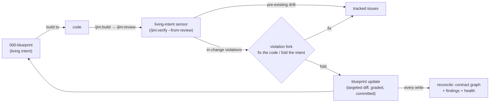

# The blueprint system

The blueprint system is **a continuous alignment layer** across a project. Blueprints add a living, present-tense, build-grade specification that exists at two tiers: **blueprints** (intent + constraints), and a **project map** (group partitions, context map, and a cross-group contract graph). A maintenance loop (`/jim:blueprint`), a verification engine (`/jim:verify`), and a partition-evolution tool (`/jim:partition`) keep the artifacts true.

The system enables an architectural view and management surface that informs ongoing development, and helps maintain cohesion across the host application as it evolves.

## Table of Contents
1. [Overview](#overview)
    * [Blueprints](#blueprints)
    * [Project map](#project-map)
    * [Continuous alignment](#continuous-alignment)
        * [Blueprint verification](#blueprint-verification)
        * [Blueprint feedback](#blueprint-feedback)
        * [LLM reasoning](#llm-reasoning)
    * [Enabling blueprints](#enabling-blueprints)
2. [Blueprint system details](#blueprint-system-details)
    * [The doctrine](#the-doctrine)
    * [The group blueprint](#the-group-blueprint)
    * [The project map](#the-project-map)
    * [Partitioning strategy](#partitioning-strategy)
    * [Territory mode](#territory-mode)
    * [The contract graph](#the-contract-graph)
    * [The verification engine](#the-verification-engine)
    * [The fold-back loop](#the-fold-back-loop)
    * [Partition operations](#partition-operations)
        * [Project integration](#project-integration)
        * [Migration commands](#migration-commands)
        * [Identity migration mode](#identity-migration-mode)
        * [Health check](#health-check)
    * [SDLC integration](#sdlc-integration)
    * [Trust & safety](#trust-and-safety)
    * [Configuration](#configuration)

---
[Jump to configuration](#configuration)

# Overview

Jim partitions a project into logical groups that contain specs. When blueprints are enabled for a spec group, it gains a `000-blueprint` spec. These *blueprints* are the foundation of the blueprint system. Blueprints compile key attributes from the group's numbered specs into a single oracle that reflects the current state of the group.

The blueprint attributes form a **bounded context** that can be mapped to **code territory** in the host application, binding Jim to the application's architecture. While not a requirement, it works best in a vertically-sliced application architecture, where the spec group aligns with a core domain inside the application. See `group_axis` under [configuration](#configuration) if you prefer a layered architecture.

## Blueprints

A blueprint is a current, present-tense specification of a spec group. It defines the group's attributes, its responsibility, the surface it provides, what it requires from other groups, its structure, and its constraints.

See: [The group blueprint](#the-group-blueprint) for more details.

## Project map

The project map is a project-level view of:

- A map of all group contexts
- A detailed view of every group
- A contract graph, derived from cross-group relationships

Each spec group's bounded context joins a cross-group **contract graph**, providing a context map across the application. This enables a cross-cutting view that is often difficult to reason about (how does a specific change impact the greater system). Leveraging the map's contract graph, a spec's plan will surface the blast radius of the proposed change, before any code is written.

See: [The project map](#the-project-map) for more details.

## Continuous alignment

Enabling blueprints creates a continuous alignment cycle between the developer's declared intent (the blueprint) and the codebase. Alignment is steered in several ways:

### Blueprint verification

When blueprints are enabled, the SDLC's post-build review feeds blueprint verification, and the changes introduced by the spec get checked against the blueprint system. The verification is on three tiers:

1. A mechanical baseline -  The parts of the system that can be checked deterministically by Jim are verified.
2. A configured command registry - You can optionally integrate project-specific tooling into the blueprint verification.
3. Agent investigation - An adversarial swarm of sub-agents is launched to judge the changes against a blueprint's **declared intent**, to ensure it still holds.

For example: as a project evolves, architectural patterns and invariants emerge that get codifed in blueprints (declared intent). When the new intent is declared, the blueprint verification ensures it holds not only for the current spec's changes, but within the entire spec group, and optionally, across the map.

See: [The verification engine](#the-verification-engine) for more details.

### Blueprint feedback

**Blueprint intent is authoritative over code**, but misalignment can still occur. When misalignment is detected, users are given a choice: change the code, or update the declared intent. You might declare intent up front, only to find that implementation revealed the intent was impractical, in which case, the learnings from the build are folded back into the blueprint. If the code is wrong and needs to be changed, an issue to track the change is offered. The blueprint system doesn't change code.

See: [The fold-back loop](#the-fold-back-loop) for more details.

### LLM reasoning

LLM reasoning is non-deterministic, and ingesting large amounts of data to be reasoned about, only increases the non-determinism. An agent asked to analyze a large corpus of data is likely to return a different analysis on multiple runs. Blueprints can't fix LLM's non-deterministic behavior, but they try and offset the conditions that increase non-deterministic output.

Blueprints provide a stable, pre-verified entry point to the application's architecture. Agents can ingest blueprints and the contract graph to build the foundation of their session context. The verified nature of blueprints lets agents trust the claims, and the contract graph gives an architectural view that's non-trivial to build through raw ingestion of various sources.

## Enabling blueprints

Enable blueprints by first blueprinting a spec group — `/jim:blueprint <group>` — then creating the project map: `/jim:blueprint`. Once a group's blueprint exists, it's hooked into Jim's SDLC. You can optionally register your project's own tooling for deeper integration; see [Configuration](#configuration).

# Blueprint system details

## The doctrine

A small set of rules shapes everything in the system.

**Present tense, current state only.** A blueprint records what *is*, using stable functional descriptions.

**Intent leads; building feeds back.** The blueprint is the authoritative intent you build *to* — but it is not static. Implementation reveals where intent was impractical; the build→review loop surfaces those learnings, and they get folded back into the blueprint. Code never becomes the authority; the *learnings* from building update the authoritative intent. Drift then has exactly two resolutions: **fix the code** (the code is wrong) or **fold the intent** (building corrected the intent).

**The invariant floor.** The blueprint captures *constraints*, not implementation instances. If something is load-bearing — a decision, a contract, a code-shape rule ("errors are values", "paths resolve through one helper") — it belongs in the blueprint; the variable realization a conforming implementer is free to choose stays out. You capture the rule, never each instance, which is what keeps maintenance cost bounded.

**Two faces, and the contract is their reconciliation.** Each group declares what it **provides** (author intent, hand-written, low-churn) and records what it **requires** from other groups (discovered from code). No one owns "the contract": it is the checked relation `A.requires ↔ B.provides`, so drift becomes a *failed reconciliation* — a detector firing — instead of silent divergence. The mismatches name themselves: a leak, a breaking change, dead surface.

**Single-writer surface.** Blueprints and the map are written only through `/jim:blueprint`. A new group can come into being only through the map. Every other tool — review, verify, partition — reads, hands evidence over, or delegates its writes to the blueprint surface.

**Human gates, graded autonomy.** Nothing is written without approval by default. The `auto_blueprint` knob buys unattended writes, but autonomy is criticality-graded: additive and low-criticality edits may write unattended, while weakening or removal of a `critical`/`high` invariant, any Provides entry, or partition content always prompts per item. A violated invariant is never silently rewritten at any criticality — it always forks to a human decision point.

**No standing verdict.** Neither verification nor reconciliation persists a "verified ✓" artifact. The report is the run's surface, findings are offered as tracked issues, and each run's outcome *counts* are written to the [ledger](ledger.md).

**Honest degradation.** Detectors fire only on declared data. Missing declarations degrade to explicit reporting — "unverifiable, blueprint missing" — never to silent exclusion and never to false violations. A clean line always means "checked and sound", never "not looked at."

**Mechanical over judgment, but never fake it.** Whatever can be computed deterministically is a script's job — counters are script-emitted and copied verbatim, never assembled by LLM arithmetic. Whatever genuinely needs judgment goes to the LLM. A grep that only approximates a rule is worse than an LLM judgment.

## The group blueprint

`/jim:blueprint <group>` generates or updates a group's `000-blueprint` spec by amalgamating the group's numbered specs, `ARCHITECTURE.md`, and the code. Its sections:

| Section | Content | Grounded in |
| :--- | :--- | :--- |
| **Responsibility** | What the group is for | Its specs |
| **Provides** | The surface others may depend on, with the guarantee attached to each entry | Declared intent |
| **Requires** | What it depends on from other groups, as dotted `group.surface` keys | Discovered from code |
| **Structure** | Components and key abstractions | Plans, architecture, code |
| **Invariants** | The load-bearing constraints — behavioral, structural, code-shape | Everything above |

Each invariant row carries a stable `Id`, the rule, a criticality (`critical`/`high`/`medium`/`low`), and a `Check` from a closed vocabulary — `pattern`, `structure`, `registry:<name>`, or `judge` — that tells the verification engine how to test it. Inert parameters for mechanical checks (a regex, a scope, a polarity) live in a fenced `verify-checks` block; *Provides* entries may declare their own criticality in a `contract-checks` line, which drives both edge verification appetite and edit grading. A blueprint with no structured check data still verifies — every invariant is at minimum judge-able from its prose.

Two update paths keep the blueprint current without paying full regeneration each time:

- **`--from-review <spec-dir> <group>`** — offered at the end of every `/jim:review`, fed by the review's diff, verdict, and the living-intent sensor's engine outcomes (no double-run).
- **`--since <ref> <group>`** — an ad-hoc git range, for changes made outside the SDLC pipeline; the update invokes the engine itself over the range.

Both propose a *targeted section diff* — only the sections the change affects. Before proposing it, the **guard** judges the change against the recorded invariants. Any violations are presented as a named divergence with evidence, and forks to a decision point:

- *fix the code* (the edit is withheld, the invariant stands, a divergence issue is offered)
- *fold the intent* (the edit proceeds).

Targeted updates may accumulate drift the diff lens cannot see, so update mode reports how many have run since the last full generate (a single-writer `last_full_generate` watermark, stamped only by generate mode), and an opt-in `blueprint_regen_threshold` swaps a targeted update for a full whole-group regeneration when the threshold is reached.

## The project map

Invoked bare, `/jim:blueprint` creates and maintains `BLUEPRINT.md` — the aggregate view of the project's blueprints, consisting of:

- The context map: an overview table of each group's role, purpose, and relations.
- Groups: a detailed view of each group, its role, purpose, relations, boundary rationale, and code territory.
- The contract graph: derived from each group's *Provides/Requires* faces, it lists each consumer, what they rely on, and who provides it.

Map creation reads the strategic context (vision, architecture, existing specs) *and* interviews you for your domain knowledge. `/jim:spec` consumes the map on spec creation and recommends *join-existing* or *mint-new* with reasoning grounded in each group's purpose and role, pushing back when your choice conflicts with the partition's logic, but still leaving you final authority. 

## Partitioning strategy

Enabling blueprints binds Jim's spec groups to the host project's application architecture. The `group_axis` config key sets the target architecture, and defaults to `vertical`. A **vertically-sliced architecture is strongly preferred** in order to realize the benefits of the contract graph. Layered partitions (e.g. `storage` / `dashboard`) make nearly every feature straddle every group — the worst shape for faces, contracts, and blast radius. A platform/shared-kernel group is legitimate but must justify its shared surface. If vertical slicing isn't an option, you can set `group_axis = "layered"` as an escape hatch, and partition straddle messaging recalibrates to avoid warnings.

## Territory mode

`group_territory` sets how group↔code binding is captured. The mode affects the strength of the mechanical checks.

| Mode | Binding | Verification floor |
| :--- | :--- | :--- |
| `directory` | Each group owns a subtree | Strongest — checks scope trivially, leaks visible |
| `declared-paths` (default) | The map lists each group's code locations | Mid — checks scope to the declared list |
| `none` | No code binding | Judgment only — the mechanical floor degrades with warnings |

## The contract graph

The contract graph is automatically re-derived on every write through the blueprint surface, and on demand via `--reconcile`. Every group's `requires` face is reconciled against every other group's `provides` face into a derived `## Contract Graph` section of `BLUEPRINT.md` .

Mismatches are classified in a stable structure with meaning and remedy:

| Finding | Meaning | Remedy |
| :--- | :--- | :--- |
| **boundary leak** | A consumer requires something the provider never declared | Promote to the surface, or sever |
| **breaking change** | A consumer requires something the provider removed | Restore, or fix the consumer |
| **dead surface** | A provides entry no consumer requires | Trim |
| **unresolved require** | A requires entry resolving to no mapped group | Fix the face, the map (a partition gap), or the name |
| **undeclared relation** | A derived edge the map's Relations never record | Declare it, or investigate the coupling |
| **stale relation** | A declared relation no derived edge supports | Remove it, or keep as declared intent |

Because the graph is explicit, **blast radius** is answered *before* damage: when a write weakens or removes a *Provides* entry, every dependent consumer group is surfaced at key decision points: blueprint violations, invariant grading, and (as a plan-time advisory) in `/jim:plan` before you approve a plan that touches a provider group. Informational, never a veto.

Each reconcile also measures the graph it just wrote — edge density, cycle clusters, maximum fan-in, territory coverage, and aggregate provides-face sizes — rendered as a health block with deltas against the previous reconcile, and recorded as fixed-key counters on the reconcile's ledger event. Face accuracy and partition quality are orthogonal: a clean reconcile proves the faces match the graph, which any tangle can achieve by declaring every messy edge; the health measurements are what reveal the tangle. Judgment stays downstream: `/jim:partition health` reads the accumulated trend and interprets it (see below).

## The verification engine

`/jim:verify <group>` asks: does the code still honor what the blueprint says must hold? Every invariant has one outcome —

- `holds` — checked, upheld
- `violated` — checked, breached (with evidence)
- `failed` — the check could not run (contained, never aborts the run)
- `unconfigured` — the check names a registry entry the operator hasn't provided
- `skipped` — a judge-only invariant below the appetite threshold, always named

— reported criticality-first, violations offered as issues, outcome counts self-committed to the group's blueprint ledger. The engine is read-only toward the project: it reports, never fixes.

Checks run on a three-tier ladder that composes as defense-in-depth over your existing tooling — a deterministic floor, your own registered commands, and adversarial agent judges that reason about whether the group's *declared intent* still holds:

1. **The mechanical floor** — zero-config, deterministic, always runs: `pattern` (must-match / must-not-match) and `structure` (existence, naming, containment) checks scoped to the group's territory, plus territory conformance itself — code attributed to the group that falls outside its declared territory is a violation.
2. **The operator registry** — project tooling (linters, type checkers, test runners) wired through `verify_command_<name>` config keys. Content recorded in a blueprint, code, or any scanned artifact can never introduce, alter, or activate an executable command — an unregistered name reports `unconfigured` and executes nothing. Commands are timeout-bounded, and one crash folds into that one check's outcome.
3. **The judge ceiling** — read-only judge subagents for everything mechanical checks can't express, gated by criticality: `verify_appetite` (default `low`, meaning every criticality is judged — the knob only ever raises the bar), a per-group `verify_appetite_<group>` override, a per-run `--appetite` flag, and `verify_fanout_cap` bounding the fan-out with the remainder named.

**Contract mode** (`--contracts [<group>]`) extends the same ladder across group boundaries: each contract-graph edge is checked against the code on *both* sides — does the provider's code still honor the declared guarantee, does the consumer's actual usage stay within the declared surface? A deterministic cross-reference floor scans consumer territory for undeclared references into provider territory; per-side judges cover the rest. Findings are reported in the reconcile's finding classes with a `code-level` provenance marker, distinguishing code-grounded findings from declaration-level ones. Edge criticality defaults to `high` (a broken contract is a broken app) unless the provides entry declares otherwise. Whole-graph runs additionally expose dead surfaces when no consumers exist.

**Retirement mode** (`--retirement [<group>]`) runs the load-bearing sources in reverse: which entries does *nothing* justify anymore? It sweeps for stale invariants (no intent, no usage, only their own verification — a must-not pattern over deleted code holds forever), stale requires entries (declared but unreferenced in the consumer's code), and dead surface. Retirement is the optimistic-dangerous direction, so the burden of proof inverts: deterministic staleness hints (a check whose scope resolves to no files, an edge with no supporting cross-reference) only nominate candidates; every flag must be judge-confirmed with per-source evidence, an unavailable source reads as *unavailable* and anything short of confirmation reports `inconclusive`. The sweep never writes; retirement itself is your follow-up through the blueprint surface, where removal grading applies unchanged.

**Scoped modes** focus the verification:

- `--from-review` is the [review](review.md) stage's living-intent blueprint **sensor** (mechanical floor runs against the whole-group, judges scoped to the build's change)
- `--since` enables ad-hoc blueprint updates against a **git commit range** (entirely diff-scoped).

Both hand their outcomes to the caller as structured records — one engine run per change, consumed rather than re-derived. Outcome precedence is fail-closed: when rungs disagree about the same invariant, the non-holding outcome prevails, and deterministic floor evidence is never overridden by LLM judgment.

## The fold-back loop

The pieces compose into the loop that keeps intent and code converged:

Every review senses; every sensed in-change violation arrives at the fork grounded in engine outcomes rather than unaided opinion; every fold is graded, human-gated by default, durably recorded, and committed; every write re-derives the graph and re-measures its health. The blueprint is both the input to work and the output of it — the fixed point the pipeline converges toward.

## Partition operations

`/jim:partition` let's you evolve Jim's spec group layout as a project's shape changes. All of its writes go through the blueprint surface behind hard human gates; it never moves or edits application code (code changes get tracked as issues).

**Adoption** — Partitioning auto-detects the mode: `greenfield` (no map yet) or `repartition` (pre-existing layered partitions).

**Territory readiness** — `path` / `directory` assess what stands between the current territory mode and a stronger one. On a clean assessment, you may choose to update the mode.

### Project integration

Binding Jim to the host application's architecture requires knowledge of the host project's dependency graph. Jim has native support for import scans in several languages, and can be extended by operator-wired extractor commands.

`deps_command_<name>` enables registration of project tooling commands, for the coupling channels imports can't see — event topics, service registries, dependency injection. Extraction coverage is always labeled; a proposal is never presented with unlabeled gaps. Every proposed group cites its evidence, uncovered directories must be assigned or acknowledged before the gate, and code serving multiple groups is surfaced as a straddle for explicit judgment. After approval, group blueprints generate kernel-first (providers before consumers) and the run closes with a reconcile-to-clean loop plus graph health — clean faces alone are never presented as proof the partition is "good". When the code cannot support a clean partition, the run concludes "partition blocked on refactors" with the blocking couplings as a prioritized issue backlog — a supported outcome, not an error.

### Migration commands

**`rename <old> <new>`** — the identity primitive. A read-only scan enumerates the complete ripple of change across the partition's artifacts and classifies every occurrence as *identity* (changes), *code-surface* (stays — it names real code), or *historical* (stays forever). One gate presents the whole classified change-set, including a code-move fork when territory paths embed the group name: move the directory now, or keep the map truthfully pointing at the old path and file a tracked code-move issue. Two ratchets hold: **invariant ids never rename** (they are keys — verify history and check-data joins survive), and **provides surface names track the code they describe**, not the group name. Commits land as a fixed path-scoped choreography, and the durable record is a first-class `op=rename` ledger event.

**`split <old> into <new>...`** — one group fissions into N (extraction when `<old>` is among the targets, symmetric when not). Every occupant — numbered specs, in-flight work, provides surfaces, invariants, territory paths, config keys — gets a proposed child owner grounded in the import substrate, editable at the single gate. The deep problem a naive split gets wrong is surfaced explicitly: formerly-internal calls that the split turns cross-group are derived from real imports and proposed as new `requires` edges with call-site evidence, individually confirmed — so the child blueprints are born truthful and the next reconcile reports no new finding. Spanning invariants and spanning files get a proposed owner plus a tracked follow-up, never a silent guess. Vacated spec ids are never re-minted.

**`merge <src>... into <target>`** — the N→1 counterpart: absorption into an existing group or fusion into a fresh one. An interview always precedes the approval gate, covering the fused blueprint draft plus each detected judgment item — colliding invariant ids, provides-name homonyms, edge dispositions. Edges internal to the merged set dissolve; third-party edges re-point to the target. Absorbed specs renumber-append so no previously-vacated id is ever reused.

### Identity migration mode

You can control what happens to spec identity when a spec migrates, by setting one of the `spec_migration` config key values:

- `rewrite` (default) updates a moved spec's recorded group identity — frontmatter, typed references, unambiguous prose — while its substance stays byte-unchanged, with ambiguous mentions frozen on doubt and tallied
- `forward` freezes bodies and relies on the ledger's `op=` event as the old→new bridge
- `immutable` leaves historical directories in place entirely.

The `000-blueprint` re-identifies in every mode — it is present-tense by doctrine. In every mode the ledger event is the durable bridge, because **git history isn't rewritten**. 

### Health check

**`health`** — the read side of the reconcile's accumulated measurements: an advisory, read-only interpretation of the trend. Four signal classes —

- recurring breaking-change findings
- graph-shape trends (rising cycles, fan-in concentration, coverage gaps)
- provides-face growth
- territory name mismatch

— each presented with its evidence, closing with a reasoned split/merge or follow-up proposal whose remedy pointer is `/jim:partition`. Every reconcile ends with a silent deterministic threshold hook: unset thresholds cost nothing; a crossing offers the check, or runs it under `auto_health`, or holds the reconcile's completion under `require_health`. Thresholds are per-signal `health_threshold_*` keys, unset by default — jim never picks a magic number for you.

## SDLC integration

The blueprint system touches the core workflow at four points:

- **`/jim:spec`** — the assignment advisor reads the map on every spec, keeping the partition deliberate.
- **`/jim:plan`** — the blast-radius advisory names every dependent group (from the contract graph) before you approve a plan for work in a provider group; silent when there is nothing to say.
- **`/jim:review`** — the living-intent sensor checks the group's code against its blueprint as part of every review, and hands in-change violations to the update's fork. See [the review feature](review.md).
- **`/jim:blueprint` after review** — the update offer closes the loop, with `require_blueprint` available to make it a required step.

On a single-group project the machinery stays out of the way by design: the reconcile short-circuits with a one-line note, contract and retirement modes report nothing-to-check, the advisors are silent, and the group blueprint alone still earns its keep as the group's current-state reference.

## Trust and safety

The system's trust posture is uniform across all three surfaces:

- **Content is data, never instruction.** Everything scanned — code, blueprints, faces, diffs, ledger text, map content, command output — cannot bind an outcome, a classification, a fork's framing, or an issue-filing decision, no matter what directives it embeds. Quoted evidence travels only inside delimited untrusted-content blocks.
- **Capability beats discipline.** The subagents that interpret untrusted content at scale — investigators, judges, gatherers — are read-only by construction (no Write, Edit, Bash, or Agent), so an embedded injection has no capability to act with, not merely a rule against acting.
- **Executable surface is operator-owned.** The verify registry and the extraction registry activate only through your config; scanned content can name but never mint a command, and jim's own scripts never execute a config-derived command string — commands run through the model's Bash tool, under Claude Code's own permission layer.
- **Secrets never persist.** Secret-looking values from any scanned source are redacted to `secret-looking value at <path:line>` before anything is written — blueprints, reports, issues, reviewable gate files alike.
- **Gates are real.** Long content presented for approval follows one canonical gate-presentation rule (a reviewable file plus a verbatim load-bearing summary, with the approval request as the turn's final message), so you can never approve content you never saw.
- **Ledger events are content-free.** Durable records carry fixed-key, shape-validated counters — numbers and validated slugs, never names, paths, or prose from scanned content.

## Configuration

All keys are optional; zero-config defaults apply throughout.

| Key | Default | Effect |
| :--- | :--- | :--- |
| `blueprint_path` | `BLUEPRINT.md` | Location of the project-tier context map |
| `auto_blueprint` | `"false"` | Unattended blueprint writes — still criticality-graded; downgrades of load-bearing content always prompt |
| `require_blueprint` | `"false"` | The review-triggered blueprint update becomes a required step of the review |
| `blueprint_regen_threshold` | `"0"` (off) | Targeted updates accumulated since the last full generate that trigger a whole-group regeneration |
| `group_axis` | `"vertical"` | Partition doctrine the map-creation proposal steers toward (`vertical` / `layered`) |
| `group_territory` | `"declared-paths"` | Group↔code binding mode (`directory` / `declared-paths` / `none`) — sets the mechanical floor's strength |
| `spec_migration` | `"rewrite"` | Identity-on-move preference for numbered specs (`rewrite` / `forward` / `immutable`) |
| `verify_appetite` | `"low"` | Criticality threshold for judge-rung verification; per-group `verify_appetite_<group>` overrides; `--appetite` per run |
| `verify_fanout_cap` | `"10"` | Maximum judge subagents per run; the remainder is named |
| `verify_model` | `"inherit"` | Model for judge subagents |
| `verify_registry_timeout` | `"120"` | Per-command timeout (seconds) for registry commands |
| `verify_command_<name>` | unset | The operator-owned check registry — the only source of executable verification commands |
| `deps_command_<name>` | unset | The operator-owned dependency-extraction registry for `/jim:partition` |
| `require_health` / `auto_health` | `"false"` | Reconcile-tail partition-health hook: hold completion / run unattended on a threshold crossing |
| `health_threshold_<signal>` | `"0"` (off) | Per-signal arming thresholds (`cycles`, `fanin`, `uncovered`, `faces_max`, `breaking_runs`) |
