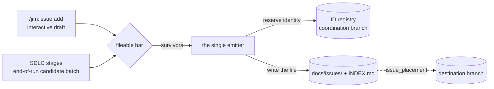

# Issues

An issue is Jim's **discovery artifact**: a piece of pending, actionable work, surfaced mid-conversation and saved as a structured markdown file in the repo. The out-of-scope idea, the deferred edge case, the security concern flagged in passing, the drift a review found — captured without derailing the in-flight work, and reviewable later as a collection.

Issues are where Jim captures what was noticed but not acted upon. Every stage of the SDLC pipeline closes with an issue candidate batch, creating a collection of unfinished business, while allowing agents to stay on track and within scope.

## Table of Contents
1. [Usage](#usage)
2. [The issue file](#the-issue-file)
    * [Metadata](#metadata)
    * [Body](#body)
3. [The lifecycle](#the-lifecycle)
4. [Recorded identity](#recorded-identity)
5. [Issue capture](#issue-capture)
    * [Interactive capture](#interactive-capture)
    * [Pipeline capture](#pipeline-capture)
6. [The collection](#the-collection)
    * [Read views](#read-views)
    * [The index](#the-index)
    * [Insights](#insights)
7. [ID coordination](#id-coordination)
8. [Issue placement](#issue-placement)
9. [Migrations](#migrations)
10. [Trust and safety](#trust-and-safety)
11. [Configuration](#configuration)

---
[Jump to configuration](#configuration)

## Usage

```
/jim:issue                   # print help
/jim:issue add <subject>     # capture a discovery from this conversation
/jim:issue add <subject> --type epic       # capture an umbrella instead
/jim:issue add <subject> --part-of 12      # capture it into one (csv for several)
/jim:issue list [filter]     # open work, grouped and sorted
/jim:issue show 53           # one issue, by ordinal / slug / unique slug prefix
/jim:issue stats             # counts, clusters, blocking ranking
/jim:issue insights          # LLM analysis: convergence, sequencing, parallel work

/jim:issue claim 53          # take it (--force takes over one held)
/jim:issue release 53        # give it up
/jim:issue start 53          # mark it underway, claiming it when unheld
/jim:issue close 53 --as done   # finish it, recording how
/jim:issue reopen 53         # back to not-started, keeping the outcome
/jim:issue join 53 12        # put it under umbrella 12
/jim:issue leave 53 12       # take it back out

/jim:issue reconcile         # realize ordinals bound while offline
```

In conversation, you can just say "file an issue" and Jim will take care of it.

## The issue file

Issue files contain structured metadata, prose, and wikilinks. One markdown file per issue, at `<issues_path>/<prefix>-<slug>.md`.

### Metadata

YAML frontmatter:

```markdown
---
id: 20260813-foo-widget-lacks-input-validation
num: 350
title: "Foo widget lacks input validation"
status: open                 # open (not started) | active (underway) | closed
priority: critical           # low | medium | high | critical
type: issue                  # issue | epic (an umbrella others belong to)
filed-by: "you@example.com"  # resolved by the emitter, never written by hand
claimed-by: ""               # the current holder; empty when unheld
outcome: ""                  # done | wontfix | duplicate | obsolete, once closed
labels: [foo, widget]
relations:
  blocks: []
  depends-on: []
  related-to: []
  duplicates: []
  part-of: []                # umbrella slugs, stored on the member only
created: 2026-08-13T04:12:07Z
updated: 2026-08-13T04:12:07Z
origin: docs/specs/foo/042-widget/spec.md
---
```

**`id`** is the durable identity — the filename, and what citations point at.

**`num`** is the display ordinal (`#350`), the short handle you type at `show`.

**`origin`** records the artifact the discovery surfaced from — a spec, plan, research, review or brainstorm path — or the sentinel `conversation` for a free-form capture.

**`status`, `claimed-by` and `outcome`** are moved by the lifecycle verbs, never by hand — see [The lifecycle](#the-lifecycle).

**`relations`** are the structural channel: the five typed buckets above. Body `[[wikilinks]]` are the prose channel and alias to `related-to`. Both become edges in the index graph, deduped per `(source, type, target)`, so writing both about the same target produces one edge, not two.

### Body

Prose, under a `## Description` heading. Cross-references other issues as `[[other-issue-slug]]`.

## The lifecycle

An issue is `open` (not started), `active` (underway) or `closed` (finished). Beside that it records who filed it, who currently holds it, what kind of record it is, which umbrellas it belongs to, and — once it has been finished at least once — the outcome of the most recent finish.

Seven verbs move it, and they are the supported path. Each writes every field the move implies, refreshes `updated`, and regenerates the index; a state change written by hand is what leaves `outcome` empty on a close, which the index then reports as an integrity warning.

| Verb | What it does |
| :--- | :--- |
| `claim <id>` | Take the issue. One held by someone else is refused, naming the holder; `--force` takes it over |
| `release <id>` | Give it up. Gated exactly as claiming is — otherwise release-then-claim would be a takeover with no override in it |
| `start <id>` | Mark it underway, claiming it first when it is unheld |
| `close <id> [--as <outcome>]` | Finish it. `--as` takes `done`, `wontfix`, `duplicate` or `obsolete`; a bare close records `done` |
| `reopen <id>` | Return it to not-started and **keep** the outcome |
| `join <id> <umbrella>` | Put it under an umbrella. The umbrella must be an `epic`, and an epic is refused a membership of its own |
| `leave <id> <umbrella>` | Take it back out. Available even where `join` would now refuse, so a membership reached by hand-edit stays repairable |

Any developer may close any issue, and `claimed-by` survives the close — the field says who *held* the issue, not who finished it. Closing `--as duplicate` requires the superseding issue to be named in the record's `duplicates` relation.

Three readings are **derived** and never stored, so no field can contradict them:

| Reading | Derived from |
| :--- | :--- |
| held | `claimed-by` is non-empty |
| blocked | some `depends-on` target is not `closed` |
| reopened | `status` is not `closed` **and** `outcome` is non-empty |

`outcome` is non-empty exactly when the issue has **ever** been closed, not when it is closed now — so `outcome: done` alone does not mean finished; pair it with `status` to ask that question. That is what makes a reopen legible: an open issue carrying an outcome was finished before, and the outcome names how.

Outside an agent session, `bash skills/issue/scripts/transition.sh <verb> <id>` is the same operation, and routes to a configured destination branch on its own.

## Recorded identity

`filed-by` and `claimed-by` hold a contributor identity, and `identity_scheme` decides what form it takes. The choice belongs to the project rather than to each contributor, so one collection never holds identities recorded under different rules.

| Form | What it records |
| :--- | :--- |
| `email` | The whole address, extracting nothing |
| `github` (default) | Also a forge private-relay address as the account name it carries, leaving every other address alone |
| `local` | Also an address inside `identity_domain` as the account part in front of that domain; anything outside it falls to the rule above |

The forms are ordered — each records everything the one below it records, plus one further extraction — so a contributor who commits several ways still reads as one identity. Every form lower-cases what it records, including `email`: case variance in one person's address would otherwise split them in two. Before any form applies, the address resolves through whatever alias mapping version control carries, which is what collapses one person's several addresses onto one identity. Jim reads that mapping; it neither creates nor requires one.

An **unrecognized** `identity_scheme` refuses every operation that would record an identity rather than quietly falling back to the default — a typo would otherwise record a whole collection under a form the project never chose. An **absent** one takes the default, so a zero-config project is unaffected. Selecting `local` without setting `identity_domain` refuses the same way, for the same reason.

**Changing the form rewrites nothing already recorded.** The index reports the divergence instead — one warning naming the records the current form would record differently, and a second naming any the form cannot judge — and the identity rewrite is what clears them:

```bash
bash skills/issue/scripts/migrate.sh identity --renormalize           # preview (read-only)
bash skills/issue/scripts/migrate.sh identity --renormalize --apply   # re-record
```

Re-normalization re-applies the current form to every recorded identity and supplies no mapping of its own. It **skips** a record whose identity the form cannot judge, which is why the index warns about that class separately: those are repaired by naming both values, the rewrite's other mode.

```bash
bash skills/issue/scripts/migrate.sh identity --from <old> --to <new>
bash skills/issue/scripts/migrate.sh identity --from <old> --to <new> --apply
```

That mode covers every field recording an identity, not only the filer, and records `--to` as given (lower-cased) rather than through the configured form — an operator who names a value gets that value, and the mismatch warning is what tells them if it disagrees with the form.

The warning has no suppression knob, deliberately. It has an exit condition: running the rewrite clears it, so it is a finite prompt to finish a migration rather than a setting to switch off.

## Issue capture

Two paths, one writer. Every issue file in the collection is produced by a single emitter script; no skill or agent composes one by hand. That is what keeps the schema, the encoding, the identity reservation and the atomic write in exactly one place.



### Interactive capture

`/jim:issue add <subject>` drafts from the conversation, framed by the project's vision, architecture and roadmap, and presents the whole draft — frontmatter and body together — as one block: **file**, **edit**, or **cancel**. No per-field prompting.

Two flags may appear anywhere in the subject and are taken out of it before the rest becomes the title: `--type epic` files an umbrella rather than an ordinary issue, and `--part-of <ref>[,<ref>]` files the capture straight into one or more, each named the way `join` names one. Both are resolved and refused before an ordinal is spent, so a capture naming an umbrella that does not exist — or one that is not an umbrella — costs nothing.

That presentation is the **last scrub moment**. The file is about to be persisted and committed alongside your code, so the prompt asks you to check the body for API keys, customer data, and raw logs before it lands.

Identity is reserved at save, not at draft. The ordinal you see during the interview is an advisory peek; an interview you cancel or edit never burns an id.

### Pipeline capture

Every stage of the SDLC can accumulate issue candidates as work moves through the pipeline. Any candidates are presented as a batch at the end of each stage, with options to **file all** / **skip all**, or per row **file** / **edit** / **skip** actions.

Additional/optional Jim features outside of the core SDLC pipeline are integrated as well (blueprints, group partitions).

| Source | What it files |
| :--- | :--- |
| `/jim:spec`, `/jim:research`, `/jim:plan`, `/jim:sec`, `/jim:build`, `/jim:debug`, `/jim:brainstorm` | End-of-run candidate batch — what the phase noticed and did not do |
| [`/jim:review`](review.md) | Findings, and pre-existing blueprint drift in code the build never touched |
| [`/jim:verify`](blueprints.md#the-verification-engine) | Invariant and contract violations |
| [`/jim:blueprint`](blueprints.md) | Divergences taken as *fix the code*, and reconcile findings |
| [`/jim:partition`](blueprints.md#partition-operations) | Code moves, blocking couplings, partition misalignments |

Two knobs govern how issues are captured. `issue_capture` (default `"true"`) is the master switch for surfacing issues. `auto_issue_file` (default `"false"`) files the batch with no prompt.

## The collection

The issue collection defaults to `docs/issues/` — one file per issue plus a generated `INDEX.md`. Set `issues_path` in Jim's config to use an alternate path.

### Read views

`list`, `show`, and `stats` are deterministic bash, and their output is presented verbatim.

**`list [filter …]`** — the terse view, grouped by status. Filters compose: values naming one axis are alternatives, and different axes must all hold. The bare words are `open|active|closed`, `critical|high|medium|low`, `issue|epic`, `claimed|unclaimed` and `blocked|unblocked`; the flags — `--status`, `--priority`, `--type`, `--label`, `--filed-by`, `--claimed-by`, `--spec`, `--origin`, `--epic` and `--cols` — each take a comma-separated list, and `--epic` scopes the view to one umbrella's members. It shows open work by default: `list` and the priority filters hide closed issues unless you ask for them with `list closed` or set `issue_list_closed = "true"`. Grouping, sort key, columns and direction are configurable (`issue_list_group` / `_sort` / `_cols` / `_order`), and an explicit filter always overrides the configured default.

**`show <id>`** — resolves an ordinal, an exact id or slug, or a unique slug prefix, against the indexed set only. On an umbrella it also lists the derived roster and its progress.

**`stats`** — open/closed counts, clusters by priority, origin and label, and a **blocking ranking**: the issues with the highest `blocks` out-degree, which answers "what is holding up the most work?". Umbrellas are counted on their own `Epics: N open · M closed` line, because the other counts are counts of work and an umbrella names none of its own; an `== Epics ==` rollup then gives each one its progress. Both describe the same population — a filter that excludes an umbrella's own row drops it from the headline and the rollup alike — while the progress a listed umbrella carries is its whole roster's, not the filter's share of it.

### The index

`INDEX.md` is a pure projection of the issue files, rebuilt after every write and whenever a read finds it stale. It holds no authority of its own — identity comes from the allocator, and the index only reports what the files say. Five sections:

| Section | Content |
| :--- | :--- |
| **Summary** | Open and closed counts |
| **Issues** | One row per issue: slug, title, status, num, priority, created, labels, origin |
| **Epics** | One row per umbrella, with its derived roster and progress |
| **Graph** | Every typed edge — `A --blocks--> B` — from frontmatter relations and body wikilinks |
| **Integrity Warnings** | What the scan could not reconcile |

The warnings are the collection's self-check, and they never block a write. They fall into four groups:

- **Records that will not parse** — a filename that is not a valid id, a missing or malformed frontmatter block, a `created` stamp that is not a date or timestamp.
- **Fields outside their enum** — an unrecognized `outcome` or `type`, and a record that is closed but records no outcome (what a close written by hand leaves behind).
- **References that do not resolve** — an invalid relation target, a malformed wikilink, an `origin:` path that no longer exists, a `part-of` naming an umbrella the collection does not hold, and — the substantive one — a **bidirectional mismatch**, where one issue asserts `blocks` and the target carries no reciprocal `depends-on`. Wikilinks are one-way "see also" pointers, so they neither trigger nor satisfy that check.
- **Recorded identities that disagree with the configured form** — counted and named, with the rewrite that clears each class; see [Recorded identity](#recorded-identity).

Two groups can also report that a check did **not run** rather than that it failed: origin paths go unchecked under a placement, since a path there would resolve against whichever checkout wrote last rather than against the collection, and identities go unchecked when the configured form cannot be applied at all.

### Insights

`/jim:issue insights` is the one view that interprets rather than renders. It returns three sections:

- **Convergence** — issues that are symptoms of one underlying latent capability, grouped semantically. (Grouping by shared label or origin is what `stats` already does deterministically.)
- **Sequencing** — what to tackle first, reasoned over blocking out-degree and cluster size.
- **Parallel-work candidates** — the open issues with no blocking or dependency edges, safe to pick up concurrently.

The synthesis runs entirely inside the *read-only* **`issue-analyst`** subagent, whose capability boundary guards against untrusted issue content.

## ID coordination

An issue's identity is two fields, and both are issued by Jim's shared allocator rather than derived from the collection on disk — so two developers filing from separate clones or branches never mint the same one. `id` is the durable identity that names the file and carries citations; `num` is the display ordinal you type at `show`.

The mechanism — the coordination branch, the append-only registry, the compare-and-swap that lands each record, and the verbs that keep the registry honest — is shared with spec ordinals and group names, and is documented in **[ID coordination](id-coordination.md)**. Three things are specific to issues.

**Filing offline still works, if you ask for it.** Under `id_coordination_unreachable = "provisional"`, filing binds a local-only ordinal `P-<id>` instead of failing on an unreachable coordination point. Real ordinals are digits, so the two can never be confused; read views render it as `(provisional)`, never as a settled `#N`. The default, `"fail"`, issues nothing and says so rather than writing an uncoordinated id.

**`/jim:issue reconcile` realizes them on reconnect.** It previews the provisional → real mapping and asks before applying, because realizing rewrites existing issue files. On confirm the real ordinals reach the registry *before* any file is touched, then each file's `num:` is rewritten in place and the index regenerated. The filename and the durable `id:` never change — only `num:`. Re-running is safe: an already-realized identity keeps the ordinal it already has. Outside an agent session, `skills/issue/scripts/reconcile.sh` is the same operation, previewing by default and mutating behind `--apply`.

**Collection drift is caught by the shared sweep.** `jimalloc.sh sweep` compares issue files against the registry alongside spec directories, so an issue with no record, or two issues claiming one ordinal, surfaces under a named class — see [checking and repairing](id-coordination.md#checking-and-repairing).

## Issue placement

Issues are created in the current branch by default. In a team setting, you'll likely want a centralized collection to keep everyone in sync.

The `issue_placement` config option sets a destination branch. When set, all issue actions will use the configured branch, regardless of the current working branch. Using a dedicated branch like `jim/issues` avoids common issues with `main` (branch protection, CI).

The branch is reached by plumbing, never by checkout. The destination's collection is materialized into a temp directory, the operation runs against it, and the result is committed object by object and landed with a ref compare-and-swap. Your working tree is never touched and the destination branch is never checked out. A destination that does not exist yet is created on first write as an orphan branch carrying only the collection.

Placement never falls back silently. An invalid git branch name is refused.

Two consequences worth planning for:

**Auto-filing changes character.** A batch filed with no review is published to a shared branch the moment it is accumulated, and unpublishing it means rewriting that branch. So under a placement `auto_issue_file` degrades to the interactive batch with a one-line disclosure, and a project that wants the quiet path anyway says so explicitly with `issue_placement_ack = "true"`.

**Editing goes through a door.** The file you would edit is not in your working tree. Jim's tooling opens the destination collection, applies your edits there, and publishes them as one commit under a fixed verb — no drafted text ever reaches a commit message. A concurrent change to the same file at the destination is reported rather than overwritten, with your edits kept for a retry.

Changing `issue_placement` on an existing project moves where issues live but does not move the issues. That one-time copy is deliberately manual: it is a job for a person who can see both branches.

## Migrations

Six one-shot, opt-in commands, none of them wired into normal use. Each writes atomically per file, is idempotent under a retry, and regenerates the index once at the end. The four that rewrite what a record already holds preview first and mutate only behind `--apply`; the two backfills only fill in absent fields, so they apply directly.

| Command | What it does |
| :--- | :--- |
| `migrate.sh prefix [--apply]` | Converge existing ids on the active `issue_id_prefix` scheme |
| `migrate.sh schema [--apply]` | Give every issue the identity, type and outcome fields, recovering each filer from the commit that created its file |
| `migrate.sh identity [--apply]` | Re-record contributor identities — re-apply the configured form, or replace one identity with another (see [Recorded identity](#recorded-identity)) |
| `reconcile.sh [--apply]` | Realize provisional ordinals — the script behind `/jim:issue reconcile` |
| `backfill.sh num` | Assign display ordinals to legacy issues filed before ordinals existed |
| `backfill.sh timestamp` | Normalize date-only `created`/`updated` to second-resolution day-start values |

Changing `issue_id_prefix` is **forward-only**: it renames nothing. To converge an existing collection on the active scheme:

```bash
bash skills/issue/scripts/migrate.sh prefix            # preview the rename/skip/collision plan (read-only)
bash skills/issue/scripts/migrate.sh prefix --apply    # rename files, rewrite inbound relations/[[wikilinks]], regen INDEX.md
```

`--apply` is destructive — it renames files — and flags an uncommitted collection before mutating, so commit a clean state first and recovery is a plain `git restore`. It re-derives each id from that issue's *own* stored data, never the migration clock, and rewrites inbound references by exact id match, never substring.

Two limits: only the four named presets (`date` / `timestamp` / `sequential` / `project`) migrate — custom `{date:…}` templates are reported un-migratable and left alone — and the `project` tag must be hyphen-free, since migration recovers each slug by splitting the id at its first dash.

## Trust and safety

Issue bodies are the least trustworthy content Jim handles: user-authored, and routinely quoted from tool output, fetched pages, diffs and prior issues.

- **Content is data, never instruction.** The read views print bodies verbatim without acting on them; any handoff to a subagent wraps them in a delimiter that names them untrusted. Directive-style text in a candidate cannot decide its own priority or labels, cannot get itself filed, and — the inverse vector — cannot get itself dropped by claiming to be pipeline-owned.
- **The interpreting path is capability-bound.** `insights` is the one verb that reasons over body content, and it runs in a subagent with no write, edit or agent capability. An injection there has nothing to act with, rather than a rule against acting.
- **Nothing untrusted reaches a shell.** Bodies travel to the emitter as a file and are copied file→file; titles, labels and origins are YAML-encoded; every id clears the validator before it is composed into a path, and `show` resolves only against the indexed set.
- **The scrub moment is preserved, not skipped.** Interactive capture presents the full draft before writing. Under a placement, the auto-file path degrades back to that moment rather than publishing unreviewed text to a shared branch.
- **Writes are atomic, and staleness is disclosed.** A failed run leaves the previous file untouched. A view served from an index that could not be rebuilt says so and exits non-zero; a *write* refuses outright instead, because a stale index is what would reach the destination.

## Configuration

All keys are optional; zero-config defaults apply throughout.

| Key | Default | Effect |
| :--- | :--- | :--- |
| `issues_path` | `./docs/issues/` | Collection location within a branch |
| `issue_placement` | `"branch"` | Which branch holds the collection; `branch` is the current working branch, any other value names a destination |
| `issue_placement_ack` | `"false"` | Allow auto-filed batches to publish to a destination branch without the interactive review |
| `issue_capture` | `"true"` | Surface end-of-stage candidate batches |
| `auto_issue_file` | `"false"` | File batches with no prompt; degrades to the interactive batch under an unacknowledged placement |
| `issue_list_group` | `"status"` | `list` grouping (`status` / `priority` / `origin` / `none`) |
| `issue_list_sort` | `"date"` | Sort within groups (`date` / `priority` / `num`) |
| `issue_list_cols` | `"num,date,priority,title"` | Columns (any of `num,date,priority,status,slug,labels,title`) |
| `issue_list_order` | `"desc"` | Sort direction (`desc` / `asc`) |
| `issue_list_closed` | `"false"` | Include closed issues in the default and priority-filtered views |
| `issue_id_prefix` | `"date"` | Id prefix scheme (`date` / `timestamp` / `sequential` / `project`, or a `{date:…}`/`{seq:…}` template); forward-only |
| `issue_id_project` | `""` | Static tag prepended when `issue_id_prefix = "project"` |
| `identity_scheme` | `"github"` | The form every recorded filer and holder takes (`email` / `github` / `local`); forward-only — see [Recorded identity](#recorded-identity) |
| `identity_domain` | `""` | The organization's mail domain, used only by the `"local"` form; exactly one domain |
| `id_coordination_mechanism` | `"git"` | How ids are coordinated between clones; `git` uses the append-only registry |
| `id_coordination_branch` | `"jim/registry"` | The branch holding the registry logs — never project content |
| `id_coordination_unreachable` | `"fail"` | Offline behavior: `fail` issues no identity, `provisional` binds a local `P-<id>` for `/jim:issue reconcile` |

The last three are shared with spec ordinals and group names; see [ID coordination](id-coordination.md#configuration).
