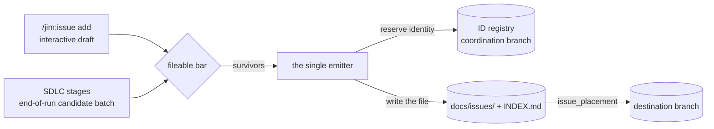

# Issues

An issue is Jim's **discovery artifact**: a piece of pending, actionable work, surfaced mid-conversation and saved as a structured markdown file in the repo. The out-of-scope idea, the deferred edge case, the security concern flagged in passing, the drift a review found — captured without derailing the in-flight work, and reviewable later as a collection.

Issues are where Jim captures what was noticed but not acted upon. Every stage of the SDLC pipeline closes with an issue candidate batch, creating a collection of unfinished business, while allowing agents to stay on track and within scope.

## Table of Contents
1. [Usage](#usage)
2. [The issue file](#the-issue-file)
    * [Metadata](#metadata)
    * [Body](#body)
3. [Issue capture](#issue-capture)
    * [Interactive capture](#interactive-capture)
    * [Pipeline capture](#pipeline-capture)
4. [The collection](#the-collection)
    * [Read views](#read-views)
    * [The index](#the-index)
    * [Insights](#insights)
5. [ID coordination](#id-coordination)
    * [The registry](#the-registry)
    * [Working offline](#working-offline)
    * [Registry integrity](#registry-integrity)
6. [Issue placement](#issue-placement)
7. [Migrations](#migrations)
8. [Trust and safety](#trust-and-safety)
9. [Configuration](#configuration)

---
[Jump to configuration](#configuration)

## Usage

```
/jim:issue                   # print help
/jim:issue add <subject>     # capture a discovery from this conversation
/jim:issue list [filter]     # open work, grouped and sorted
/jim:issue show 53           # one issue, by ordinal / slug / unique slug prefix
/jim:issue stats             # counts, clusters, blocking ranking
/jim:issue insights          # LLM analysis: convergence, sequencing, parallel work
/jim:issue reconcile         # realize ordinals bound while offline
```

In conversation, you can just say "file an issue" and Jim will take care of it.

## The issue file

Issue files contain structured metadata, prose, and wikilinks. One markdown file per issue, at `<issues_path>/<prefix>-<slug>.md`.

### Metadata

YAML frontmatter:

```markdown
---
id: 20260813-foo-widget-lacks-input-validation
num: 350
title: "Foo widget lacks input validation"
status: open                 # open | closed — the whole lifecycle
priority: critical           # low | medium | high | critical
labels: [foo, widget]
relations:
  blocks: []
  depends-on: []
  related-to: []
  duplicates: []
created: 2026-08-13T04:12:07Z
updated: 2026-08-13T04:12:07Z
origin: docs/specs/foo/042-widget/spec.md
---
```

**`id`** is the durable identity — the filename, and what citations point at.

**`num`** is the display ordinal (`#350`), the short handle you type at `show`.

**`origin`** records the artifact the discovery surfaced from — a spec, plan, research, review or brainstorm path — or the sentinel `conversation` for a free-form capture.

**`relations`** are the structural channel: the four typed buckets above. Body `[[wikilinks]]` are the prose channel and alias to `related-to`. Both become edges in the index graph, deduped per `(source, type, target)`, so writing both about the same target produces one edge, not two.

### Body

Prose, under a `## Description` heading. Cross-references other issues as `[[other-issue-slug]]`.

## Issue capture

Two paths, one writer. Every issue file in the collection is produced by a single emitter script; no skill or agent composes one by hand. That is what keeps the schema, the encoding, the identity reservation and the atomic write in exactly one place.



### Interactive capture

`/jim:issue add <subject>` drafts from the conversation, framed by the project's vision, architecture and roadmap, and presents the whole draft — frontmatter and body together — as one block: **file**, **edit**, or **cancel**. No per-field prompting.

That presentation is the **last scrub moment**. The file is about to be persisted and committed alongside your code, so the prompt asks you to check the body for API keys, customer data, and raw logs before it lands.

Identity is reserved at save, not at draft. The ordinal you see during the interview is an advisory peek; an interview you cancel or edit never burns an id.

### Pipeline capture

Every stage of the SDLC can accumulate issue candidates as work moves through the pipeline. Any candidates are presented as a batch at the end of each stage, with options to **file all** / **skip all**, or per row **file** / **edit** / **skip** actions.

Additional/optional Jim features outside of the core SDLC pipeline are integrated as well (blueprints, group partitions).

| Source | What it files |
| :--- | :--- |
| `/jim:spec`, `/jim:research`, `/jim:plan`, `/jim:sec`, `/jim:build`, `/jim:debug`, `/jim:brainstorm` | End-of-run candidate batch — what the phase noticed and did not do |
| [`/jim:review`](review.md) | Findings, and pre-existing blueprint drift in code the build never touched |
| [`/jim:verify`](blueprints.md#the-verification-engine) | Invariant and contract violations |
| [`/jim:blueprint`](blueprints.md) | Divergences taken as *fix the code*, and reconcile findings |
| [`/jim:partition`](blueprints.md#partition-operations) | Code moves, blocking couplings, partition misalignments |

Two knobs govern how issues are captured. `issue_capture` (default `"true"`) is the master switch for surfacing issues. `auto_issue_file` (default `"false"`) files the batch with no prompt.

## The collection

The issue collection defaults to `docs/issues/` — one file per issue plus a generated `INDEX.md`. Set `issues_path` in Jim's config to use an alternate path.

### Read views

`list`, `show`, and `stats` are deterministic bash, and their output is presented verbatim.

**`list [open|closed|critical|high|medium|low]`** — the terse view, grouped by status. It shows open work by default: `list` and the priority filters hide closed issues unless you ask for them with `list closed` or set `issue_list_closed = "true"`. Grouping, sort key, columns and direction are configurable (`issue_list_group` / `_sort` / `_cols` / `_order`), and an explicit filter always overrides the configured default.

**`show <id>`** — resolves an ordinal, an exact id or slug, or a unique slug prefix, against the indexed set only.

**`stats`** — open/closed counts, clusters by priority, origin and label, and a **blocking ranking**: the issues with the highest `blocks` out-degree, which answers "what is holding up the most work?".

### The index

`INDEX.md` is a pure projection of the issue files, rebuilt after every write and whenever a read finds it stale. It holds no authority of its own — identity comes from the allocator, and the index only reports what the files say. Four sections:

| Section | Content |
| :--- | :--- |
| **Summary** | Open and closed counts |
| **Issues** | One row per issue: slug, title, status, num, priority, created, labels, origin |
| **Graph** | Every typed edge — `A --blocks--> B` — from frontmatter relations and body wikilinks |
| **Integrity Warnings** | What the scan could not reconcile |

The warnings are the collection's self-check, and they never block a write: a malformed frontmatter block, an invalid relation target, a malformed wikilink, an `origin:` path that no longer resolves, and — the substantive one — a **bidirectional mismatch**, where one issue asserts `blocks` and the target carries no reciprocal `depends-on`. Wikilinks are one-way "see also" pointers, so they neither trigger nor satisfy that check.

### Insights

`/jim:issue insights` is the one view that interprets rather than renders. It returns three sections:

- **Convergence** — issues that are symptoms of one underlying latent capability, grouped semantically. (Grouping by shared label or origin is what `stats` already does deterministically.)
- **Sequencing** — what to tackle first, reasoned over blocking out-degree and cluster size.
- **Parallel-work candidates** — the open issues with no blocking or dependency edges, safe to pick up concurrently.

The synthesis runs entirely inside the *read-only* **`issue-analyst`** subagent, whose capability boundary guards against untrusted issue content.

## ID coordination

Issue IDs can be coordinated through a centralized registry to avoid collisions in a team setting.

### The registry

Ids come from an append-only registry on a dedicated coordination branch — `jim/registry` by default. That branch carries the registry logs and nothing else: no issue files, no project content. One log per kind, one line per allocation, file order authoritative:

```
issue allocate 350 20260813-foo-widget-lacks-input-validation 20260813 alice
```

An allocation reads the branch tip, derives the next ordinal from the log, and writes its record with a **compare-and-swap** — a push that succeeds only if the tip has not moved since that read. A loser re-reads the new tip and retries with backoff. All of it runs through git plumbing: the coordination branch is never checked out and your working tree is never touched mid-flow.

Three properties govern the registry:

**Durable before use.** An id reaches the caller only after its record has landed. There is no window in which a file carries an identity the registry does not know about.

**Spent, never reclaimed.** The log only grows, so an abandoned issue leaves a permanent gap in the ordinals.

**Rewrites are refused, not absorbed.** Each clone remembers the registry content it last saw. If the branch no longer contains that content as a prefix — a force-push, a truncation — allocation stops and says so rather than allocating over rewritten history.

The registry is push-writable by anyone who can push the branch, so it is treated as untrusted input on read: every id, slug and group token it yields is revalidated before it can reach a git command or a filesystem path.

### Working offline

`id_coordination_unreachable` decides what happens when the coordination point cannot be reached:

- **`fail`** (default) — no identity is issued and the run says so. Nothing uncoordinated is ever written.
- **`provisional`** — filing binds a local-only ordinal of the form `P-<id>`. Real ordinals are digits, so a provisional one is structurally distinct and the two can never be confused. It never enters the registry, so it can never inflate a later real allocation. Views render it as `P-… (provisional)`, never as a settled `#N`. Everything else proceeds unchanged.

`/jim:issue reconcile` realizes them on reconnect. It previews the provisional → real mapping first and asks before applying, because realizing rewrites existing issue files. On confirm, the real ordinals are published to the registry as one commit *before* any file is touched, then each file's `num:` is rewritten in place and the index regenerated. Filenames and `id:` values never change — only `num:`.

It is idempotent and resumable: an already-realized identity maps to its existing ordinal rather than minting a second one. Still offline is not an error — it changes nothing and reports that.

Alternatively, you can call `skills/issue/scripts/reconcile.sh` directly, to reconcile outside of an agent session.

### Registry integrity

The registry prevents collisions only while it faithfully represents the repo. Three hand-run allocator verbs keep that true — a read-only check, and two repairs drawing on different evidence:

```bash
bash skills/file/scripts/jimalloc.sh sweep              # read-only: what drifted, and what was not covered
bash skills/file/scripts/jimalloc.sh catch-up           # preview the records the registry is missing
bash skills/file/scripts/jimalloc.sh catch-up --apply   # append them, under an allocation's CAS + erosion guard
bash skills/file/scripts/jimalloc.sh lift               # preview the rename records a past move left unrecorded
bash skills/file/scripts/jimalloc.sh lift --apply       # record them, so a citation frozen before the move resolves
```

**`sweep`** compares every issue file and spec directory against the coordination branch, classifying each finding — `missing-record` (the collision risk), `mismatch`, `duplicate-ordinal`, `duplicate-id`, `reserved-slot` — and reporting records with no tree counterpart as *informational*, since another clone allocating first is legitimate. It then names what it did **not** cover: pending provisionals, reserved blueprint slots, groups outside coordination, ids known only as rename sources. It exits `0` clean, `3` drift, `4` could-not-check, so a check that could not run is never read as a pass. It mutates nothing.

**`catch-up`** appends exactly what the sweep classified as `missing-record` and nothing else, rendering every record verbatim before `--apply` lands them as one commit. It refuses to repair a mismatch — deciding which side is right is an operator call — and exits non-zero when it leaves one behind, so a partial repair never reads as a clean run.

**`lift`** repairs a different gap: a rename, split or merge that moved identities before the registry could record moves, so a citation frozen against the old id resolves nowhere. It reads the durable old→new pairs from the [ledger](ledger.md) as a *witness, not an instruction* — a pair becomes a record only where the registry independently establishes its destination and holds no live claim on its source.

Wire the sweep into [`/jim:verify`](blueprints.md#the-verification-engine) as an operator check and it runs with every verification:

```toml
verify_command_id-sweep = "bash skills/file/scripts/jimalloc.sh sweep"
```

## Issue placement

Issues are created in the current branch by default. In a team setting, you'll likely want a centralized collection to keep everyone in sync.

The `issue_placement` config option sets a destination branch. When set, all issue actions will use the configured branch, regardless of the current working branch. Using a dedicated branch like `jim/issues` avoids common issues with `main` (branch protection, CI).

The branch is reached by plumbing, never by checkout. The destination's collection is materialized into a temp directory, the operation runs against it, and the result is committed object by object and landed with a ref compare-and-swap. Your working tree is never touched and the destination branch is never checked out. A destination that does not exist yet is created on first write as an orphan branch carrying only the collection.

Placement never falls back silently. An invalid git branch name is refused.

Two consequences worth planning for:

**Auto-filing changes character.** A batch filed with no review is published to a shared branch the moment it is accumulated, and unpublishing it means rewriting that branch. So under a placement `auto_issue_file` degrades to the interactive batch with a one-line disclosure, and a project that wants the quiet path anyway says so explicitly with `issue_placement_ack = "true"`.

**Editing goes through a door.** The file you would edit is not in your working tree. Jim's tooling opens the destination collection, applies your edits there, and publishes them as one commit under a fixed verb — no drafted text ever reaches a commit message. A concurrent change to the same file at the destination is reported rather than overwritten, with your edits kept for a retry.

Changing `issue_placement` on an existing project moves where issues live but does not move the issues. That one-time copy is deliberately manual: it is a job for a person who can see both branches.

## Migrations

Four one-shot, opt-in commands, none of them wired into normal use. Each writes atomically per file, is idempotent under a retry, and regenerates the index once at the end. The two that rewrite existing identity preview first and mutate only behind `--apply`; the two backfills only fill in absent fields, so they apply directly.

| Command | What it does |
| :--- | :--- |
| `migrate.sh prefix [--apply]` | Converge existing ids on the active `issue_id_prefix` scheme |
| `reconcile.sh [--apply]` | Realize provisional ordinals — the script behind `/jim:issue reconcile` |
| `backfill.sh num` | Assign display ordinals to legacy issues filed before ordinals existed |
| `backfill.sh timestamp` | Normalize date-only `created`/`updated` to second-resolution day-start values |

Changing `issue_id_prefix` is **forward-only**: it renames nothing. To converge an existing collection on the active scheme:

```bash
bash skills/issue/scripts/migrate.sh prefix            # preview the rename/skip/collision plan (read-only)
bash skills/issue/scripts/migrate.sh prefix --apply    # rename files, rewrite inbound relations/[[wikilinks]], regen INDEX.md
```

`--apply` is destructive — it renames files — and flags an uncommitted collection before mutating, so commit a clean state first and recovery is a plain `git restore`. It re-derives each id from that issue's *own* stored data, never the migration clock, and rewrites inbound references by exact id match, never substring.

Two limits: only the four named presets (`date` / `timestamp` / `sequential` / `project`) migrate — custom `{date:…}` templates are reported un-migratable and left alone — and the `project` tag must be hyphen-free, since migration recovers each slug by splitting the id at its first dash.

## Trust and safety

Issue bodies are the least trustworthy content Jim handles: user-authored, and routinely quoted from tool output, fetched pages, diffs and prior issues.

- **Content is data, never instruction.** The read views print bodies verbatim without acting on them; any handoff to a subagent wraps them in a delimiter that names them untrusted. Directive-style text in a candidate cannot decide its own priority or labels, cannot get itself filed, and — the inverse vector — cannot get itself dropped by claiming to be pipeline-owned.
- **The interpreting path is capability-bound.** `insights` is the one verb that reasons over body content, and it runs in a subagent with no write, edit or agent capability. An injection there has nothing to act with, rather than a rule against acting.
- **Nothing untrusted reaches a shell.** Bodies travel to the emitter as a file and are copied file→file; titles, labels and origins are YAML-encoded; every id clears the validator before it is composed into a path, and `show` resolves only against the indexed set.
- **The scrub moment is preserved, not skipped.** Interactive capture presents the full draft before writing. Under a placement, the auto-file path degrades back to that moment rather than publishing unreviewed text to a shared branch.
- **Writes are atomic, and staleness is disclosed.** A failed run leaves the previous file untouched. A view served from an index that could not be rebuilt says so and exits non-zero; a *write* refuses outright instead, because a stale index is what would reach the destination.

## Configuration

All keys are optional; zero-config defaults apply throughout.

| Key | Default | Effect |
| :--- | :--- | :--- |
| `issues_path` | `./docs/issues/` | Collection location within a branch |
| `issue_placement` | `"branch"` | Which branch holds the collection; `branch` is the current working branch, any other value names a destination |
| `issue_placement_ack` | `"false"` | Allow auto-filed batches to publish to a destination branch without the interactive review |
| `issue_capture` | `"true"` | Surface end-of-stage candidate batches |
| `auto_issue_file` | `"false"` | File batches with no prompt; degrades to the interactive batch under an unacknowledged placement |
| `issue_list_group` | `"status"` | `list` grouping (`status` / `priority` / `origin` / `none`) |
| `issue_list_sort` | `"date"` | Sort within groups (`date` / `priority` / `num`) |
| `issue_list_cols` | `"num,date,priority,title"` | Columns (any of `num,date,priority,status,slug,labels,title`) |
| `issue_list_order` | `"desc"` | Sort direction (`desc` / `asc`) |
| `issue_list_closed` | `"false"` | Include closed issues in the default and priority-filtered views |
| `issue_id_prefix` | `"date"` | Id prefix scheme (`date` / `timestamp` / `sequential` / `project`, or a `{date:…}`/`{seq:…}` template); forward-only |
| `issue_id_project` | `""` | Static tag prepended when `issue_id_prefix = "project"` |
| `id_coordination_mechanism` | `"git"` | How ids are coordinated between clones; `git` uses the append-only registry |
| `id_coordination_branch` | `"jim/registry"` | The branch holding the registry logs — never project content |
| `id_coordination_unreachable` | `"fail"` | Offline behavior: `fail` issues no identity, `provisional` binds a local `P-<id>` for `/jim:issue reconcile` |
