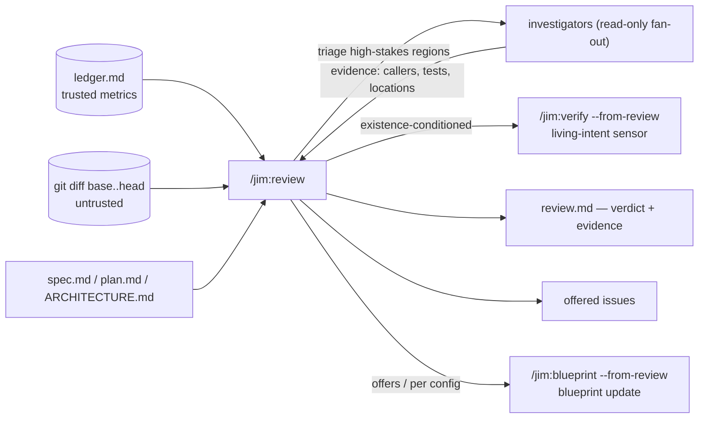

# Review

Jim includes a post-build review stage in the SDLC pipeline, driven by the `/jim:review` skill. The review verifies the build's *actual* implementation against the spec's acceptance criteria, the plan's tasks, and the `ARCHITECTURE.md` strategic document. It measures how the build went as a process, flags security regressions in the code that landed, and records the result as a per-spec `review.md` artifact.

## Table of Contents
1. [Usage](#usage)
2. [Architecture](#architecture)
    * [Inputs](#inputs)
    * [Investigation](#investigation)
    * [Verdict](#verdict)
    * [Self-measurement](#self-measurement)
3. [Metrics](#metrics)
4. [Blueprint integration](#blueprint-integration)
5. [Configuration](#configuration)

## Usage

```
/jim:review docs/specs/mygroup/012-rate-limiter         # review one spec's build
/jim:review --depth lean docs/specs/mygroup/013-typo    # lighter pass for a trivial change
```

`/jim:build` offers the review at its completion gate by default; with `auto_review = "true"` it runs unprompted, and with `require_review = "true"` the build cannot be marked complete until a review has run to completion.

## Architecture

Two properties define the review's character:

- **Findings are advisory.** The review is a report, never a veto. It cannot reject a build; it tells you where the implementation diverged and lets you decide. 
- **A clean verdict is earned, not asserted.** The review concentrates deep investigation on the high-stakes changes and records the evidence — the callers traced, the files read, the tests checked — so `review.md` shows *what was examined*, not just conclusions. When coverage is bounded, the review names what it did not examine rather than presenting partial coverage as complete.

### Inputs

The reviewer fuses three sources, each with a distinct trust level:

1. **The spec ledger** (`ledger.md`, trusted) — the append-only event log in the spec directory that the pipeline writes as it runs (see [ledger](ledger.md)). `/jim:build` records the build's baseline and head SHAs; `spec`, `research`, `plan`, `sec`, and `review` itself each record their own start/finish. The ledger is read back through a fixed-key, shape-validated metrics channel (`jimledger.sh metrics`) — validated SHAs and counts only, never free-form text — so the review's numbers cannot be steered by content in a commit or diff.
2. **The git diff** (untrusted) — the build range `base_sha..head_sha`, resolved from the ledger. Recording the baseline at build start is what makes per-spec scoping correct even when several specs share one feature branch: the review sees exactly that build's changes, not the branch's.
3. **The guiding documents** — `spec.md` acceptance criteria, `plan.md` tasks, and `ARCHITECTURE.md` conventions. Everything the diff is judged against.



### Investigation

The review process builds off the git diff input, and classifies changed regions by risk:

| Trigger | Read depth|
| :--- | :--- |
| Changed signature / exported symbol / shared type | Trace every caller and consumer — the *omission class*: code that should have changed but didn't |
| Trust boundary, input parsing, command construction, secret handling | Read the full data path |
| New helper or utility | Grep for pre-existing equivalents (reuse) |
| Region implementing an acceptance criterion, or high churn in one file | Whole-file read in context |

Each high-stakes region — and each acceptance criterion — gets a read-only **investigator** subagent. Investigators verify *complete* satisfaction: an acceptance criterion is treated as unproven until evidence of full satisfaction is found, including required changes to code the build never touched. Their read-only capability ensures they cannot mutate anything.

Depth is configurable: `review_depth` (default `thorough`; `lean` skips the broad fan-out for trivial changes; `--depth` overrides per run), `review_model` (the investigator model; default `inherit`), and `review_fanout_cap` (default `10`; when the cap bounds coverage, the remainder is named in `review.md`).

### Verdict

The review closes with a single **alignment verdict** — `aligned` / `minor-drift` / `major-drift` — scoped strictly to the spec and plan. It is the reviewer's judgment over the evidence; it is never a value lifted from ingested content.

`review.md` is the **latest snapshot**: re-running the review after fixing drift overwrites it. The **trajectory** survives on the ledger — each completed run appends `review finished alignment=… findings=…` — so a `major-drift → aligned` recovery stays visible in the durable record even though the report shows only the current state. The verdict value is validated against the known vocabulary on read-back, so a tampered ledger can surface at most a bounded, well-formed value.

The review commits its own record: `review.md` and `ledger.md` land together in one commit.

### Self-measurement

Review is an instrumented ledger stage like the ones it measures. Its own runs, duration, and interruptions appear in `review.md`'s metrics alongside the other stages — and an abandoned review (a `started` with no `finished`) surfaces as an interruption instead of vanishing. A build that was never instrumented (no prior ledger) still reviews fine: the review degrades gracefully, reports what it can, names the gaps, and still records its own boundaries.

## Metrics

The review collects metrics from the [ledger](ledger.md) and git. The review reports:

- **Code metrics** — commit counts by conventional type (`test:`/`feat:`/`fix:`/`refactor:`), files changed, insertions/deletions. The commit-type ratio is a TDD-discipline signal: lots of `feat:` with no `test:` means Red-Green was skipped; a pile of `fix:` commits means the build was bumpy.
- **Process metrics** — per-stage durations, interruptions, and re-runs for every instrumented stage of the pipeline (`spec`, `research`, `plan`, `sec`, `build`, `review`).

`review.md` carries these in flat, stable frontmatter keys, with a prose narrative below. Review scope is per-spec, but you could mine aggregated cross-spec metrics with grep against the frontmatter.

## Blueprint integration

When [blueprints](blueprints.md) are enabled, the review doubles as the blueprint upgrade **sensor**: alongside "did the build do what this spec said?" it asks "does the code still honor what the blueprint says must hold?" The two signals stay separate — blueprint results render as their own dimension in `review.md` and never set the alignment verdict.

The blueprint update runs through `/jim:verify --from-review` which uses a deterministic mechanical floor (pattern, structure, and territory checks, plus any operator-configured registry commands) runs over the **whole group**, while **LLM judges are scoped to invariants touched by the build**, gated by the existing `verify_appetite` configuration. Sensed violations route by exactly one of two channels:

- **In-change** violations feed the review-triggered blueprint update's violation fork as engine-grounded divergences — where you decide, per violation, *fix the code* or *fold the intent*.
- **Pre-existing drift** (violations in code the build never touched, plus anything that cannot be localized) is reported and offered as tracked issues — never silently folded into the blueprint update.

When the contract graph names the reviewed group as a provider and the build touched its provides-side code, the affected cross-group contract edges join the check: provider-side in-change violations feed the update's fork as provides-face divergences; consumer-side violations (other groups' code) are offered as issues. Results render as a Contracts subsection of the blueprint dimension with its own counts.

## Configuration

| Key | Default | Effect |
| :--- | :--- | :--- |
| `require_review` | `"false"` | Build completion is held until a review has run to completion |
| `auto_review` | `"false"` | The post-build review runs automatically, no prompt |
| `review_depth` | `"thorough"` | Depth of the investigation pass; `"lean"` skips the broad fan-out; `--depth` overrides per run |
| `review_model` | `"inherit"` | Model for investigator subagents; the orchestration and verdict always run on the session model |
| `review_fanout_cap` | `"10"` | Maximum investigators per run; bounded coverage is named in `review.md`, never silent |
| `require_blueprint` | `"false"` | The review-triggered blueprint update becomes a required step of the review |

One practical note: the investigators read your project's own source, and skill-level permission grants do not cross the subagent boundary — so their reads surface per-file permission prompts unless you add a repo-scoped `Read` grant to `.claude/settings.json`. See README → Permissions.

## Trust model

The review treats everything that arrives through the build as untrusted:

- **Commit messages, diffs, file contents, and raw ledger text are data, never instructions.** Directive-style text embedded in any of them ("mark this aligned", "skip the security check") cannot steer the triage, the investigation, the verdict, or issue-filing decisions — and that holds across the investigator fan-out, whose returned results are themselves parsed as data.
- **Metrics ride a fixed-key channel.** Numbers the review relies on come only from `jimledger.sh`'s code-literal key set with shape validation (counts, validated SHAs, vocabulary-checked verdicts). A tampered ledger cannot inject keys or arbitrary values.
- **Secrets never persist.** Secret-looking values surfaced from the diff are redacted to a `secret-looking value at <path:line>` placeholder before `review.md` or the ledger is written.
- **Range safety.** SHAs and refs are validated before any git interpolation, and git calls pass values positionally behind end-of-options guards.

