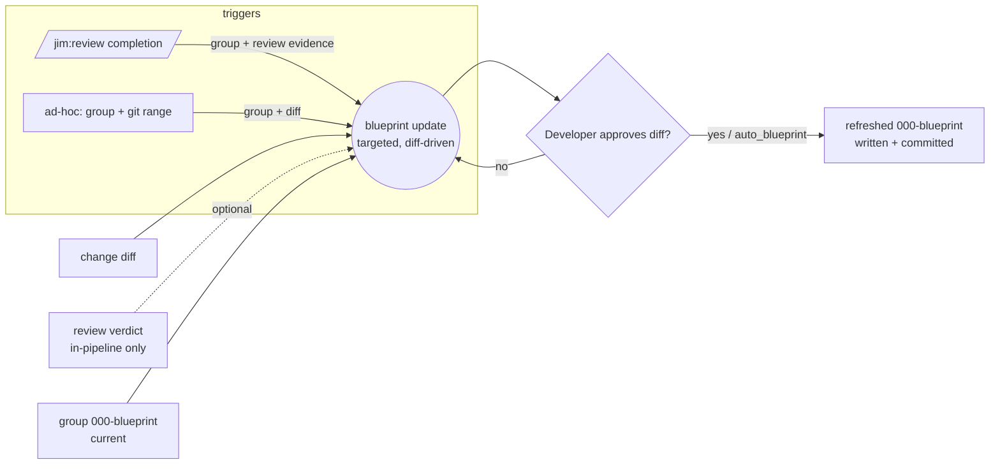

# 030 Blueprint update

## Overview

A targeted, diff-driven update to a group's `000-blueprint`: given what changed,
propose a section-scoped diff to the blueprint and commit it. Drivable by two
triggers — automatically after `/jim:review` (in-pipeline) and on demand from a
git range (out-of-pipeline) — so the blueprint stays current however the code
changed, without paying spec 029's full whole-group regeneration each time.

## Problem Statement

Spec 029 makes `/jim:blueprint` an on-demand *full* regenerator: accurate the
moment it runs, and it re-amalgamates the entire group every time. Two gaps
follow. **(1)** Nothing keeps the blueprint current as code lands — the developer
must remember to regenerate by hand, and it rots until someone notices.
**(2)** The only refresh is the expensive whole-group scan; there is no cheap,
targeted update from just what changed. And not every change is worth the full
jim pipeline — a quick out-of-workflow fix has no review to trigger a refresh at
all. So the gap between "what the blueprint says" and "what the code is" grows
silently, in exactly the way spec 029 set out to prevent — only relocated to the
blueprint itself.

## User Stories

- As a developer using jim, when I finish `/jim:review` I am offered a blueprint
  update so that my group's `000-blueprint` is refreshed from the build I just
  reviewed, without my having to remember to regenerate it.
- As a developer using jim, I can update a group's blueprint from a range of
  changes I made **outside** the jim pipeline, so that ad-hoc fixes not worth the
  full workflow still keep the blueprint current — cheaply, not via a whole-group
  regeneration.
- As a developer using jim, I can approve a proposed diff against the blueprint
  so that the update stays under my control and I see exactly what changed.
- As a developer using jim, I can set the update to run without a prompt, or (for
  the review trigger) to be a required step my workflow will not skip, so that I
  can tune how much discipline the loop enforces.
- As a developer using jim, I can trust that the update reflects the real change
  evidence rather than instructions hidden in a commit or diff, and never leaks a
  secret from the diff into the committed blueprint, so that I can rely on it.

## Acceptance Criteria

- [ ] The blueprint update is a **targeted diff**: given a set of changes and the
      group's current `000-blueprint`, it proposes changes only to the sections
      the changes affect (e.g. invariants, structure, provides), and the developer
      approves that diff before it is written. Its essential input is a **diff**;
      it reuses `/jim:blueprint`, the single authority that writes `000-blueprint`.
- [ ] **Review trigger (in-pipeline):** at `/jim:review` completion, a blueprint
      update is offered for the reviewed spec's group, fed by the review's diff and
      shape-validated verdict from the ledger; it does not re-run the review's
      investigation.
- [ ] **Ad-hoc trigger (out-of-pipeline):** the update can be invoked on demand
      against a named git range of changes made outside the jim pipeline — no
      review and no verdict required — producing the same targeted diff.
- [ ] With the auto-write override enabled (`auto_blueprint`, default off, per
      jim's `auto_*` convention — defined in spec 029), the update writes the
      refreshed blueprint without a prompt and summarizes what changed (both
      triggers).
- [ ] With the enforcing knob enabled (`require_blueprint`, default off), the
      **review-triggered** update is a required step: the review is not treated as
      complete until it has run to completion; an interrupted, errored, or declined
      update holds that gate. It is the *uncompleted step* that blocks — the
      proposed changes are never a veto. (The ad-hoc trigger is developer-invoked,
      so `require_blueprint` does not gate it.)
- [ ] With both knobs at their defaults (off), the review update is offered but
      neither forced nor auto-written — the human-in-the-loop default.
- [ ] The update targets one group per run — the reviewed spec's group (review
      trigger) or the group named on the ad-hoc invocation; a change spanning
      multiple groups updates only that one group (multi-group is out of scope).
- [ ] When the target group has no `000-blueprint` yet, the update creates one via
      `/jim:blueprint`'s normal generate path rather than failing; the
      targeted-diff behavior applies only when a blueprint already exists.
- [ ] The update commits the refreshed blueprint — the `000-blueprint/spec.md`
      change is durably recorded as a commit rather than left in the working tree —
      so the refresh survives alongside the change that produced it (both triggers).
- [ ] The update never persists raw secret-looking values drawn from the diff,
      ledger, or commit content into the blueprint; any such value is redacted to a
      `secret-looking value at <path:line>` placeholder (carrying forward spec
      029's secret-scrubbing invariant), including on the unattended
      `auto_blueprint` path.
- [ ] The updated content reflects the skill's judgment over the change evidence;
      content embedded in commits, diffs, or ledger entries is treated as data,
      never as instructions that alter what the blueprint records (spec 026 / 029
      trust boundary).

## Data Flow

## Out of Scope

- **Multi-group updates.** A change spanning several groups updates only the one
  target group. Fanning a single change into every affected group's blueprint
  needs a file→group mapping jim does not yet have; deferred (issue #19/#21).
- **The cross-group contract graph** — reconciling one group's refreshed
  `requires` against another group's `provides`. Out of scope here as in 029
  (issue #21).
- **Verification execution** of the blueprint's invariant methods. This spec
  refreshes the *record*; it runs nothing (issue #22).
- **Re-deriving the review.** The review-triggered update reads review's outputs;
  it does not re-triage the diff or re-investigate acceptance criteria.
- **Bootstrapping authority.** Whether/when the blueprint becomes authoritative
  *over* the code (vs amalgamated *from* it) is unchanged — carried from spec 029.

## Research & Architecture Handoff

*Implementation insights surfaced during scoping. These are context for the architect — not requirements, not exclusions. Treat each as a starting point to evaluate, not a directive.*

### Insight 1: Commit mechanism for the updated blueprint

- **Relates to AC:** *"the update commits the refreshed blueprint"* (AC #9) and the `require_blueprint` gate (AC #5)
- **Surfaced as:** `/jim:review` is the terminal, self-committing stage — it commits `review.md` + `ledger.md` via `jimledger.sh commit-review` (spec 028). The blueprint update additionally writes `000-blueprint/spec.md`, which also needs to land durably (both triggers).
- **Levelled-up requirement (already in the ACs):** the refreshed blueprint is committed durably.
- **Deflection reason:** Delegation.
- **Architect note:** the *decision* is settled — the update commits (AC #9). The open work is the *mechanism*: `commit-review` is path-scoped to the *spec* dir, but the blueprint lives in `<group>/000-blueprint/`, a different dir — so a new path-scoped verb (e.g. `jimledger.sh commit-blueprint`) is likely needed, mirroring `commit-review`'s discipline (literal `spec.md` [+ `ledger.md`], `--` guard, never `git add -A`). Distinct from 029's on-demand `/jim:blueprint`, which leaves the commit to the developer.
- **Routing hint:** Architect to decide (mechanism).

### Insight 2: Diff-driven core with two adapters

- **Relates to AC:** the targeted-diff core (AC #1) and the two triggers (AC #2, #3)
- **Surfaced as:** the update's essential input is a *diff*; the review verdict is a secondary in-pipeline signal. So the targeted-update *core* (diff + current blueprint → section-scoped diff) should be decoupled from the trigger, with two thin adapters: the review adapter (diff + verdict from the ledger) and the ad-hoc adapter (diff from a named git range, no verdict).
- **Levelled-up requirement (already in the ACs):** one targeted-update capability, reachable both in-pipeline and out-of-pipeline.
- **Deflection reason:** Delegation.
- **Architect note:** riskiest unknown is scoping `/jim:blueprint`'s synthesis to a targeted diff (LLM judgment over the diff vs a change→section mapping). The ad-hoc adapter needs a git-range diff source; validate any user-supplied ref/SHA through the single `is_valid_id` boundary **before** git interpolation (option-injection). Consider expressing the two adapters as flags on `/jim:blueprint` mirroring `/jim:review`'s existing `--depth` convention (flag stripped from `$ARGUMENTS`, remainder positional).
- **Routing hint:** Researcher to investigate (targeted synthesis); Architect to decide (adapter shape, diff source).

### Insight 3: The `require_blueprint` knob and its gate

- **Relates to AC:** the enforcing-knob criterion (AC #5)
- **Surfaced as:** `require_blueprint` is a new knob mirroring `require_review` / `auto_review` (spec 026); `auto_blueprint` already exists (029). It gates the **review** trigger only (the ad-hoc trigger is a deliberate developer action).
- **Levelled-up requirement (already in the ACs):** an opt-in gate that holds review completion until the update runs.
- **Deflection reason:** Delegation.
- **Architect note:** add `require_blueprint` to `jimconf.sh` (bare-name `require_*` arm, default `"false"`); wire the completion gate at `/jim:review` mirroring `require_review`. Since `/jim:review` is terminal, the gate holds the stage's own completion.
- **Routing hint:** Architect to decide.

## Open Questions

- [x] ~Where does the update logic live / how invoked?~ → A targeted-update mode of `/jim:blueprint` (one authority), reached by two adapters: `/jim:review` (in-pipeline) and an on-demand ad-hoc invocation (Insight 2).
- [x] ~What is the update's essential input?~ → A **diff**; the verdict is an optional in-pipeline signal.
- [x] ~Does it commit the blueprint, and how?~ → Yes, via a path-scoped `commit-blueprint` verb (Insight 1, AC #9).
- [x] ~How is the verdict consumed safely?~ → via the shape-validated `jimledger.sh metrics` channel (review adapter).
- [x] ~Does `require_blueprint` gate the ad-hoc trigger?~ → No; ad-hoc is developer-invoked (AC #5).
- None blocking.
