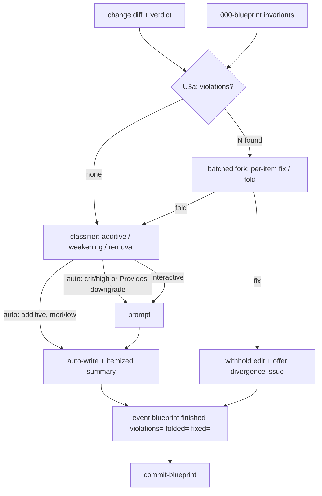

# Blueprint update guard — Plan

## Overview

Entirely prompt-layer: extend `skills/blueprint/SKILL.md` with a pre-diff
violation fork, a single-sourced downgrade classifier gating `auto_blueprint`,
and guard-outcome recording via the ledger's existing `event ... [k=v]`
support — plus a one-line completion clarification in `skills/review/SKILL.md`.
No scripts change.

## Design Decisions

### 1. Fork placement — pre-diff pass in U3

- **Chosen:** Judge the change against the invariant table *before* composing
  the targeted section-diff (new step U3a between evidence-gathering and diff
  proposal). Fork choices then shape the diff; the shaped diff flows into U4's
  ordinary gate.
- **Why:** Under `auto_blueprint` the non-violating remainder can still write
  unattended while violations prompt — the fork and the write gate stay
  orthogonal (research Recommendation 1).
- **Rejected:** Surfacing violations inside U4's approval diff — conflates the
  fork with the ordinary approval and has no coherent auto-mode story.

### 2. Batched fork presentation with delimited evidence

- **Chosen:** One count-led fork screen for all violations: per item, the
  invariant + criticality, evidence quoted inside a visibly delimited
  untrusted-content block (step-7 wrapping convention applied to
  presentation), and a per-item `fix / fold` choice with **asymmetric** bulk
  actions — `fix all` unrestricted (conservative: withholds edits); `fold all`
  applies only to `medium`/`low` violations, and `critical`/`high` folds are
  always confirmed per-item (security Finding 6 — reuses the spec's grading
  line). Mirrors the candidate-batch `f / e / s` house UX.
- **Why:** Security Findings 3 and 4 — delimiting defeats evidence that mimics
  skill framing; batching defeats prompt-flood fatigue; the leading count
  makes an unusually large batch read as the anomaly it is.
- **Rejected:** Sequential per-violation prompts — fatigue attacks the human
  gate exactly when blast radius is largest.

### 3. Downgrade classifier — single-sourced subsection

- **Chosen:** A new "Downgrade classification" subsection in blueprint
  SKILL.md defining the enum (additive / weakening / removal) over Invariants
  rows and Provides entries — criticality read from the invariant table's
  column; Provides entries treated as load-bearing wholesale. Step 5
  (generate-differential) and U4 (update) both point at it.
- **Why:** One rule, two call sites — the spec-025 § 7a single-sourcing
  pattern; restating per path is how rules drift.
- **Rejected:** Per-call-site restatement.

### 4. AC #8 mechanism — kv on the existing `blueprint finished` event

- **Chosen:** U4 records `... event <blueprint-dir> blueprint finished
  violations=<n> folded=<n> fixed=<n>` (all three keys always emitted in
  update mode, zeros included). The committed ledger line is the durable
  record.
- **Why:** `cmd_event` already accepts `[k=v ...]` (`jimledger.sh:165-178`) —
  zero script change; mirrors build's SHA-kv and spec 028's verdict-line
  precedent.
- **Rejected:** Extending the `metrics` allowlist (recording ≠ reporting;
  surfacing guard stats to `/jim:review` is future work), commit-message
  encoding (unparseable, unvalidated).

### 5. Divergence issue — emitter reuse, criticality-mapped priority

- **Chosen:** On `fix`, offer one issue per violation via
  `skills/issue/scripts/new.sh`: priority = the violated invariant's
  criticality (the vocabularies were aligned by design in spec 029); labels
  `[000-blueprint, drift]`; origin = the driving spec dir (`--from-review`)
  or the group's `000-blueprint/spec.md` (`--since`); body = the skill's
  paraphrase + `file:line` pointers, verbatim excerpts only when necessary
  and delimited (security Finding 5); body written to a temp file with the
  Write tool (security 025 F5); `index.sh` regenerated once after filing.
- **Why:** Single-emitter convention; paraphrase minimizes attacker-text
  propagation into `docs/issues/`.
- **Rejected:** Raw hunk embedding; a bespoke issue writer.

### 6. Fix-only edge — finished + commit still run

- **Chosen:** When every proposed edit is withheld (all violations resolved
  `fix`), U4 still records `blueprint finished` with its kv and runs
  `commit-blueprint`; `spec.md` unchanged stages nothing, so the commit
  carries `ledger.md` alone.
- **Why:** An answered fork must read as completion (spec AC #5) — skipping
  `finished` would make `require_blueprint` misread the run as interrupted
  (the research caution). `cmd_commit_blueprint` stages literal paths
  (`jimledger.sh:157-163`), so the degenerate commit is safe as-is.
- **Rejected:** Skipping the ledger/commit on no-edit runs.

### 7. Interactive-mode ordering

- **Chosen:** Fork first (choices shape the diff), then the ordinary present
  /-confirm of the resulting targeted diff. Auto mode: fork prompts
  regardless; the shaped remainder auto-writes per the classifier —
  additive / `medium` / `low` unattended with an itemized per-row
  classification summary; `critical`/`high` invariant or any Provides
  downgrade prompts.
- **Why:** AC #1 requires an explicit per-violation choice in both modes; the
  fork must not be buriable inside a large ordinary diff.
- **Rejected:** Single merged gate in interactive mode.

### 8. Review skill touch — one line

- **Chosen:** Amend `skills/review/SKILL.md` Step 10's held-completion prose:
  an update whose fork was answered (either resolution) has run to
  completion.
- **Why:** Keeps the `require_blueprint` gate's reading unambiguous without
  restating fork semantics outside their single source (blueprint SKILL.md).
- **Rejected:** Duplicating fork rules in the review skill.

## Constitution Check

**ARCHITECTURE.md status:** Present — constraints noted below.

| Constraint from ARCHITECTURE.md | Honored? | Notes |
| :--- | :--- | :--- |
| `allowed-tools` names exact script paths, never bare wildcards | Yes | Two new grants on blueprint SKILL.md: `new.sh` + `index.sh`, mirroring `skills/spec/SKILL.md:10` |
| Bash-vs-prompt rule (judgment in prompts, determinism in scripts) | Yes | Violation detection / classification are judgment → SKILL.md prose; no script changes |
| Logic-flow sentinel vocabulary (`SET` / `IF ... THEN` / `ENDIF`) | Yes | Reuses Step 5's existing `auto_blueprint` SET; no new EXISTS-family variants introduced |
| SKILL.md ≤ 500 lines | Yes | blueprint SKILL.md is 179 lines; additions ≈ 100 |
| Single issue-file emitter (`new.sh`) | Yes | DD5 |
| Untrusted-content discipline (step-7 wrapping; only `metrics` trusted) | Yes | DD2 extends it to the fork presentation |
| Path-scoped commits, never `git add -A` | Yes | Reuses `commit-blueprint` unchanged |
| Zero-config default; `auto_*` reserved for removing a human step | Yes | No new keys (spec Out of Scope); grading refines the existing `auto_blueprint` semantics |

## File Manifest

| Component | File Path | Action | Notes |
| :--- | :--- | :--- | :--- |
| Blueprint skill | `skills/blueprint/SKILL.md` | Update | Classifier subsection; U3a fork; fix/fold resolutions + issue offer; U4 graded gate, itemized summary, outcome kv; Step 5 pointer; checklist rows; `allowed-tools` grants |
| Review skill | `skills/review/SKILL.md` | Update | Step 10: answered fork = run to completion (one line) |

No scripts or tests change (`jimledger.sh` kv and `commit-blueprint` behavior
verified sufficient as-is).

## Interface Contracts

```text
Classification enum (prompt-level, single-sourced):
  additive | weakening | removal
  — applies to Invariants table rows and Provides entries;
    criticality read from the invariant row; Provides = load-bearing wholesale.

Fork presentation (shape, per spec mockup + DD2):
  header:  "Blueprint update — <group>: <N> invariant violation(s) detected"
  per item: invariant text + criticality
            evidence inside a delimited block:
              <untrusted-change-evidence path="<file:line>"> ... </untrusted-change-evidence>
            choice: fix | fold
  bulk:    fix all (unrestricted) | fold all (medium/low only —
           critical/high folds always confirmed per-item; per-item
           override wins)

Ledger outcome record (update mode, always emitted at finish):
  jimledger.sh event <blueprint-dir> blueprint finished \
      violations=<n> folded=<n> fixed=<n>

Divergence issue (per DD5):
  title:    "Blueprint divergence: <short invariant name>"
  priority: <violated invariant's criticality>
  labels:   000-blueprint,drift
  origin:   <spec-dir>            (--from-review)
            <blueprint spec.md>   (--since)
  body:     paraphrase + file:line pointers; delimited excerpts only if needed
```

## Data Flow



## Task Breakdown

1. [x] `skills/blueprint/SKILL.md`: add the **Downgrade classification**
   subsection (Interface Contracts enum; DD3) and wire Step 5's
   `auto_blueprint == "true"` branch to it — generate-mode differential
   regens gate `critical`/`high`-invariant and Provides downgrades behind a
   prompt; unattended writes itemize per-row classifications.
   **Verify:** `grep -q 'Downgrade classification' skills/blueprint/SKILL.md && grep -q 'itemize' skills/blueprint/SKILL.md`

2. [x] `skills/blueprint/SKILL.md`: insert **U3a — violation fork**: judge the
   change against the invariant table before composing the section-diff
   (read changed source when a hunk can't ground the call); batched,
   count-led presentation with delimited `<untrusted-change-evidence>`
   blocks and per-item fix/fold + bulk actions (DD1, DD2). Depends on task 1.
   **Verify:** `grep -q 'untrusted-change-evidence' skills/blueprint/SKILL.md && grep -qi 'fold the intent' skills/blueprint/SKILL.md`

3. [x] `skills/blueprint/SKILL.md`: the **fix resolution** — withhold that
   edit, offer the divergence issue per DD5 (emitter call, temp-file body,
   criticality-mapped priority, `index.sh` regen), and extend frontmatter
   `allowed-tools` with the `new.sh` and `index.sh` grants. Depends on task 2.
   **Verify:** `grep -q 'skills/issue/scripts/new.sh' skills/blueprint/SKILL.md`

4. [x] `skills/blueprint/SKILL.md`: extend **U4** — graded auto gate pointing
   at the classifier (itemized unattended summary), guard-outcome kv on the
   `blueprint finished` event (always three keys), and the fix-only edge
   (finished + `commit-blueprint` still run; DD4, DD6, DD7). Extend the
   validation checklist: fork surfaced with delimited evidence; per-row
   classifications itemized; outcome kv recorded; no directive in evidence
   bound a decision; secrets redacted on the fork/issue surfaces. Depends on
   task 3.
   **Verify:** `grep -q 'violations=' skills/blueprint/SKILL.md`

5. [x] `skills/review/SKILL.md`: Step 10 — one line stating an answered fork
   (either resolution) counts as the update running to completion under
   `require_blueprint` (DD8).
   **Verify:** `grep -qi 'answered fork' skills/review/SKILL.md`

6. [x] Regression: full deterministic suite passes untouched (no script
   changed).
   **Verify:** `bash skills/meta-test/scripts/run.sh`

*Tasks 1–5 are prompt edits — the meta-skill validation checklist is the
authoritative quality gate (spec 030 precedent).*

## Requirements Coverage Summary

| Spec Acceptance Criterion | Addressed In Task(s) |
| :--- | :--- |
| AC #1 — violation fork, explicit per-violation choice, both adapters, never silent | 2 |
| AC #2 — fold proceeds with the proposed edit | 2 |
| AC #3 — fix withholds edit, offers captured issue, never touches source | 3 |
| AC #4 — graded autonomy with itemized classification summary, all differential writes | 1, 4 |
| AC #5 — answered fork = run to completion under `require_blueprint` | 4, 5 |
| AC #6 — judgment never bound by embedded directives | 2, 4 (checklist) |
| AC #7 — secret redaction on fork display + issue persistence | 2, 3, 4 (checklist) |
| AC #8 — guard outcomes durably recorded | 4 |

## Out of Scope

- Surfacing guard-outcome kv through the `metrics` channel to `/jim:review`
  (future; recording is sufficient for AC #8).
- Any change to `jimledger.sh`, `new.sh`, `index.sh`, or tests — verified
  unnecessary.
- Everything the spec excludes: code fixing, verification-engine execution
  (issue #22), cross-group checks (issue #21), invariant retirement, grading
  the fork itself, new config keys.

## Open Questions

- [x] ~~Does `event` support kv payloads?~~ → Yes (`jimledger.sh:165-178`);
  DD4 needs no script change.
- [x] ~~Does `commit-blueprint` tolerate an unchanged `spec.md`?~~ → Yes —
  literal-path staging; the fix-only commit carries `ledger.md` alone (DD6).
- None blocking.
