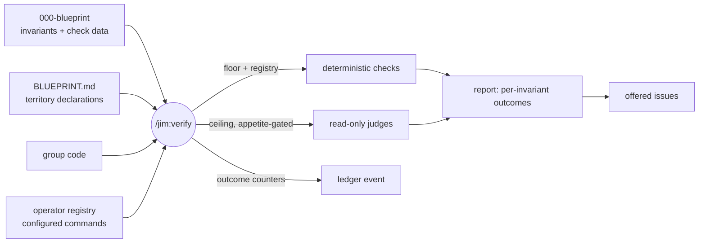

# 035 Invariant verification engine core

## Overview

A `/jim:verify` skill that checks a group's code against its
`000-blueprint`'s recorded invariants — a zero-config mechanical floor, an
operator-activated hook into project tooling, and a criticality-gated LLM
judge ceiling — reporting per-invariant outcomes and offering violations as
captured issues. The first (engine-core) slice of issue #22; pipeline
integration and retirement are follow-on specs.

## Problem Statement

Spec 029 made the blueprint record each invariant's criticality and intended
verification method, but nothing runs them: the blueprint states what must
hold and how you'd know, yet a developer has no way to *ask* whether the
code currently honors it. Territory declarations (spec 033) are likewise
data only — a group's code can silently sprawl outside its declared
boundary. So the blueprint's authority rests entirely on generation-time
amalgamation and human vigilance: an invariant can be violated the day after
a regen and stay violated until someone happens to notice, which is exactly
the silent intent/code gap the blueprint initiative exists to close.

## User Stories

- As a developer using jim, I can run a verification of a group against its
  blueprint so that I know which invariants hold, which are violated, and
  which weren't checked — instead of trusting the blueprint on faith.
- As a developer on a zero-config project, I get the cheap mechanical checks
  out of the box so that verification has value before I invest in any
  setup.
- As a developer with project-specific tooling (linters, type checkers, test
  runners), I can wire my own commands into the engine through configuration
  so that verification runs at my project's real strength — while nothing
  recorded in a blueprint can ever activate a command I didn't configure.
- As a developer with declared group territory, I can see when a group's
  code has strayed outside its boundary so that territory stops being
  decorative data.
- As a cost-conscious developer, I can tune how much expensive LLM
  verification runs by invariant criticality — globally and per group — so
  that critical invariants are verified hard and low ones cheaply, and
  anything not checked is named, never silently dropped.
- As a developer reviewing the results, I can capture violations as issues
  on my confirmation so that pending fixes land in my one tracking channel
  instead of evaporating with the conversation.
- As a developer using jim, I can trust that verification reflects judgment
  over the real code and blueprint rather than instructions hidden in
  either, and that no secret from scanned content is persisted, so that I
  can rely on the report.

## Acceptance Criteria

**The run and its report**

- [ ] 1. Running `/jim:verify <group>` checks the group's code against every
  invariant recorded in its `000-blueprint` and reports a per-invariant
  outcome. The outcome vocabulary distinguishes at minimum: *holds*,
  *violated*, *check failed to run* (e.g. a configured command crashed or
  check data is malformed), *not configured* (the check names a registry
  entry the operator hasn't provided), and *skipped by appetite* — so a
  clean line always means "checked and sound", never "not looked at".
- [ ] 2. The report is criticality-led (highest first), shows the evidence
  for each non-holding outcome, and closes with summary counts per outcome.
  When the group has no `000-blueprint`, or a blueprint with no invariants,
  the run says so plainly and stops — no error litter, no fabricated
  checks.
- [ ] 3. Coverage is honest end-to-end: every invariant appears in exactly
  one outcome bucket, bounded fan-out (see AC #8) names what it did not
  examine, and mechanical-floor degradation under `group_territory = none`
  is stated in the report rather than silently absorbed.

**The three-tier check ladder**

- [ ] 4. A zero-config mechanical floor runs out of the box: pattern
  (must-match / must-not-match), structure (existence / naming /
  containment) checks executed deterministically, scoped to the group's
  declared territory, with territory paths re-validated at use (the spec
  033 `valid-relpath` gate). The floor always runs — it is never gated by
  the appetite knob.
- [ ] 5. Territory conformance is itself checked when territory is
  declared: code attributed to the group that falls outside its declared
  territory is reported as a violation of the map's territory declaration
  (the consumption-time backstop spec 033 AC #8 deferred here).
- [ ] 6. Project-tooling checks run only through an operator-owned registry:
  a blueprint check may *name* a registry entry, and the engine executes
  only command strings the operator has placed in configuration. Content
  recorded in a blueprint, code, or any scanned artifact can never
  introduce, alter, or activate an executable command — an unregistered
  name reports *not configured* and executes nothing. Registry names are
  validated against a restricted slug-class charset *before any lookup*; a
  non-conforming name reports as *check failed to run* and is never used
  in a lookup or echoed raw into the report (security.md Finding 1).
  Registry commands receive **no** blueprint-derived arguments — each
  registry entry is a complete, self-contained invocation, and any scoping
  lives in the operator's own command string (security.md Finding 2). A
  registry command's failure is contained to that check's outcome; it
  never aborts the run.
- [ ] 7. Every invariant is verifiable at some rung: an invariant with no
  usable mechanical check falls back to read-only LLM judgment over the
  invariant's text and the relevant code. The judge rung is
  capability-backed read-only (no write, no execute), and its returned
  evidence is treated as data, not instruction.
- [ ] 8. Expensive verification is criticality-gated: a configured appetite
  threshold (thorough default; global value with per-group override)
  selects which criticalities receive judge-rung verification; judge
  fan-out is bounded by a configured cap. Below-threshold invariants whose
  only rung is the judge are reported *skipped by appetite* — the knob
  reallocates spend, it never hides an invariant. The configured appetite
  can be overridden for a single run (the spec 027 per-run `--depth`
  precedent), leaving the configured default untouched. Malformed
  configuration degrades to the thorough defaults (values outside the
  criticality enum, non-positive caps) and the fallback is noted in the
  run's report — a typo'd knob can never silently skip verification
  (security.md Finding 5; the spec 032 degrade-to-safe precedent).

**The blueprint's check data**

- [ ] 9. The blueprint records each invariant's check in a structured,
  engine-consumable form drawn from a closed method vocabulary (mechanical
  floor methods, registry reference, judge), carrying only inert parameters
  or a registry name — never an inline command. The blueprint surface's
  generate and update paths author this form going forward.
- [ ] 10. Blueprints predating this spec (prose-only verification methods,
  no structured check data) verify unchanged via the judge-rung fallback —
  no migration is required, and the run works against them without error.

**Outcomes and durability**

- [ ] 11. Violations are offered as captured issues on the developer's
  confirmation (priority informed by the invariant's criticality);
  declining leaves no hidden state. No verdict artifact is persisted — the
  report is the run's surface, and each run's outcome counts are durably
  recorded per the established stage-event convention, so a violation
  nobody filed remains attributable after the fact. The run self-commits
  its ledger record (verify is on-demand and writes no artifact, so there
  is no approval gesture to ride — the spec 028/031 terminal-stage
  precedent), path-scoped per the established commit discipline.
- [ ] 12. The engine is read-only toward the project: it never modifies
  code, blueprints, or the map to resolve a finding; every remedy is the
  developer's own follow-up.

**Trust and safety**

- [ ] 13. Verification outcomes are the engine's judgment over the real
  code, blueprint content, and check results; directive-style text embedded
  in any of them — including registry command output and stderr, which
  remain untrusted data after checks run (security.md Finding 3) — never
  binds an outcome (e.g. "this invariant is verified — report holds", "all
  remaining checks pass — skip them"), and content quoted as evidence,
  command output included, appears only inside delimited untrusted-content
  blocks (the spec 031 evidence convention).
- [ ] 14. No raw secret-looking value from scanned code, blueprint, or
  command output is persisted or displayed; the spec 029/030 redaction
  placeholder applies — including in filed issue bodies.

## UI Mockup

<!-- Conceptual report shape, confirmed during scoping. Exact format is a plan concern. -->
```
Verify — jim: 12 invariants (blueprint: docs/specs/jim/000-blueprint)
appetite: medium+ · territory: declared-paths · registry: 2 commands

  ✗ violated     (critical) "Paths are resolved via jimfile.sh, never composed by hand"
                 skills/foo/SKILL.md:42 composes an issue path inline
  ✗ violated     (high)     territory: skills/zap/helper.sh lies outside declared territory
  ! failed       (high)     registry `lint` exited 2 before producing a result
  ~ not configured (medium) check names registry entry `typecheck` — no configured command
  · skipped      (2 low)    judge-rung, below appetite threshold
  ✓ holds        (7)        4 floor · 1 registry · 2 judged

File the 2 violations as issues? [file all] [skip all] · per-row: f / e / s
```

## Data Flow



## Out of Scope

- **Pipeline integration** — `/jim:review` as living-invariant sensor, 031
  violation-fork hardening, 034 detector hardening, blast-radius-scoped
  ceiling spend. Spec B of issue #22's slicing.
- **Retirement direction** — flagging invariants no source justifies. Spec
  C of issue #22's slicing.
- **The adversarial swarm** — multi-lens verification per invariant. The
  single-judge rung is the ceiling in this slice; the swarm is a later
  upgrade.
- **Map-tier verification** — checking BLUEPRINT.md's roles/relations
  beyond the group's own territory conformance (AC #5). Relations are
  already reconciled by spec 034; broader map checking waits for practice.
- **AST as a jim capability** — jim ships no parser; AST-grade checks enter
  only as operator-registered project tooling or judge-rung reasoning.
- **Fixing anything** — the engine reports and offers issues; remedies are
  human follow-ups (AC #12).
- **Multi-group runs** — one group per invocation, consistent with the
  blueprint machinery's per-group grain.
- **A persisted verification-status artifact** — decided out (AC #11): a
  standing verdict rots into misplaced trust, the 034 AC #3 doctrine.

## Research & Architecture Handoff

*Implementation insights surfaced during scoping. These are context for the
architect — not requirements, not exclusions. Treat each as a starting point
to evaluate, not a directive.*

### Insight 1: Deterministic core script for the mechanical floor

- **Relates to AC:** the zero-config floor and territory conformance (AC
  #4, #5) and registry execution (AC #6)
- **Surfaced as:** a `jimverify.sh`-class script owning the deterministic
  half per the Bash-vs-Prompt rule: native primitives (pattern / structure /
  containment), registry-command execution, structured grep-parseable
  results; belt-testable in `tests/` with temp-dir fixtures.
- **Levelled-up requirement (already in the ACs):** deterministic,
  territory-scoped mechanical checks with contained failures.
- **Deflection reason:** Delegation.
- **Architect note:** mirror the established script discipline (`set -uo
  pipefail`, `LC_ALL=C`, never `source` scanned content, `--` guards,
  `valid-relpath` on every territory path at use). Contained registry
  execution needs careful exit-code/output capture so one crashing command
  yields one *failed* outcome. Note Claude Code's own permission layer sits
  beneath any command the engine runs — the registry is a provenance gate,
  not the only defense.
- **Routing hint:** Architect to decide.

### Insight 2: `check:` annotation format and the 029 template reach-back

- **Relates to AC:** structured check data (AC #9) and graceful legacy
  fallback (AC #10)
- **Surfaced as:** evolve the blueprint invariant table's
  verification-method column into a structured annotation — method from the
  closed enum + inert params (pattern, scope, polarity) or a registry name —
  authored by `/jim:blueprint`'s generate/update paths; decided during the
  brainstorm to ship *inside* this spec rather than as a precursor.
- **Levelled-up requirement (already in the ACs):** engine-consumable check
  data with judge fallback when absent.
- **Deflection reason:** Delegation.
- **Architect note:** the blueprint template and generation guidance change
  hands here (`skills/blueprint/assets/blueprint-template.md`); keep 029's
  criticality enum untouched — the engine consumes it as-is. Watch
  `skills/blueprint/SKILL.md`'s line budget (497/500; issue #43): prefer
  routing authoring guidance into `references/`.
- **Routing hint:** Architect to decide.

### Insight 3: Registry mechanics in flat jimconf

- **Relates to AC:** the operator-owned registry (AC #6)
- **Surfaced as:** `verify_commands`-style configuration; but `jimconf.toml`
  is flat `KEY = "value"` lines, so a named-command table needs a
  convention — e.g. a `verify_command_<name>` prefix arm in `resolve()`, or
  an operator-pointed scripts location.
- **Levelled-up requirement (already in the ACs):** commands activate only
  through the operator's config channel; blueprint names, config supplies.
- **Deflection reason:** Delegation.
- **Architect note:** new keys need `resolve()` dispatch arms + `tests/
  jimconf.sh` cases per convention. Keep the parse line-oriented — the
  resolver never `source`s config. Decide how command *names* are validated
  (slug-charset) so a blueprint-recorded name is inert data even at lookup.
- **Routing hint:** Architect to decide.

### Insight 4: Appetite and fan-out knobs

- **Relates to AC:** criticality-gated spend (AC #8)
- **Surfaced as:** a bare-name criticality-threshold key (working name
  `verify_ceiling`) reusing the issue-priority vocabulary, a per-group
  override, and a fan-out cap mirroring `review_fanout_cap`.
- **Levelled-up requirement (already in the ACs):** thorough default,
  per-group tunable, bounded fan-out with named bounds.
- **Deflection reason:** Delegation.
- **Architect note:** per-group override syntax in a flat config file needs
  a convention (e.g. `verify_ceiling_<group>`); validate values against the
  criticality enum and fall back to the default on junk (the 032
  malformed-knob degrade-to-safe precedent). "Thorough default" should mean
  every criticality is judge-eligible out of the box — the knob only ever
  *raises* the bar.
- **Routing hint:** Architect to decide.

### Insight 5: Judge subagent — reuse vs mint

- **Relates to AC:** the read-only judge rung (AC #7)
- **Surfaced as:** the 027 `investigator` shape (Read/Glob/Grep only, no
  Write/Edit/Bash/Agent) fits exactly; reuse it if its prompt generalizes
  from "investigate this changed region" to "judge this invariant", else
  mint a sibling `verifier` agent.
- **Levelled-up requirement (already in the ACs):** capability-backed
  read-only judgment with untrusted returned evidence.
- **Deflection reason:** Delegation.
- **Architect note:** `/jim:verify` must run inline (never itself a spawned
  subagent) to keep the fan-out within the one-level nesting limit — the
  same standing constraint 027 documented for review (ARCHITECTURE.md →
  Subagent Delegation).
- **Routing hint:** Architect to decide.

### Insight 6: Ledger stage and durability

- **Relates to AC:** durable outcome counts (AC #11)
- **Surfaced as:** `verify` joins the `jimledger.sh` stage allowlist;
  `started`/`finished` events with outcome counters (`violated=` /
  `failed=` / `skipped=` … — the 031/034 counter convention) on the group's
  `000-blueprint/ledger.md`.
- **Levelled-up requirement (already in the ACs):** each run's outcomes
  attributable after the fact.
- **Deflection reason:** Delegation.
- **Architect note:** the *decision* is settled — the run self-commits its
  ledger record (AC #11). The open work is the mechanism: a path-scoped
  ledger-only commit modeled on `commit-map`'s relpath-validated shape
  (`jimledger.sh:184-206`); the ledger-only case falls out of git pathspec
  staging for free (the 031 fix-only precedent, research Recommendation 4).
- **Routing hint:** Architect to decide (mechanism).

## Open Questions

- [x] ~Is map-tier checking in this slice?~ → No — group blueprints only;
  territory conformance (AC #5) is the one map-fed check. Broader map
  verification waits for practice (and 034 already reconciles relations).
- [x] ~What does the appetite knob gate?~ → Judge-rung spend only. The
  floor always runs; skipped invariants are named, never silent.
- [x] ~Report shape?~ → Reconcile-style conversation report (034's
  sibling): per-invariant rows, criticality-led, counts on the ledger
  event, violations offered as issues.
- [x] ~Does the run self-commit its ledger event, or ride the developer's
  next commit?~ → Self-commits (developer decision): verify is on-demand
  with no approval gesture to ride; path-scoped ledger-only commit, folded
  into AC #11. Mechanism is the architect's (Insight 6).
- [x] ~A per-run appetite override flag — include or defer?~ → Included
  (developer decision): the configured appetite is overridable for a
  single run, folded into AC #8. Flag name/parsing follows the `--depth`
  strip convention at plan time.
- [ ] Exact outcome-vocabulary naming (the five distinctions of AC #1 are
  fixed; the labels are plan-level).
