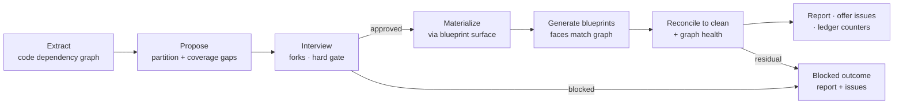

# 038 Partition migration skill

## Overview

A migration skill that moves an existing project onto the blueprint
partition doctrine — proposing a context map grounded in the code's real
dependency graph, materializing it through the blueprint surface after a
hard human gate, and surfacing every code-vs-partition misalignment as
tracked issues.

## Problem Statement

Projects that predate the blueprint doctrine have no supported path onto
it. Some grew layered partitions (`foundation` / `storage` / `dashboard`)
before groups became load-bearing context boundaries; others — jim adopted
on an existing codebase — have no partition at all. Drawing the partition
by hand is high-effort and error-prone: a full manual dry-run (2026-07-06,
recorded in issue #34) hit six undeclared real dependencies and found its
most valuable structural gap (a package seven groups imported but no group
owned) only by luck. Meanwhile every blueprint invested in a bad seam
calcifies the wrong partition and raises the cost of eventually fixing it.
The territory-mode ladder (`none` → `declared-paths` → `directory`) has the
same gap: nothing today tells a developer what stands between their current
mode and a stronger mechanical verification floor.

## User Stories

- As a developer adopting jim on an existing codebase with no partition, I
  can get a proposed context map grounded in the code's real dependency
  graph so that day-one boundaries reflect actual coupling instead of
  guesswork.
- As a developer with a pre-blueprint layered partition, I can re-partition
  onto the vertical-first doctrine so that the living artifacts migrate
  while numbered spec history stays frozen in place.
- As a developer whose codebase is too tangled to partition cleanly, I can
  receive the blocking couplings as a prioritized issue backlog instead of
  a forced map so that I can refactor toward partitionability with the work
  tracked.
- As a developer at a weak territory mode, I can ask what stands between me
  and the next rung so that the mechanical verification floor strengthens
  as soon as the code allows it.

## Acceptance Criteria

- [ ] Invoked on a project with no context map, the skill enters
      `greenfield` mode; with an existing `BLUEPRINT.md`, `repartition`
      mode; an explicit mode argument overrides detection, and the active
      mode is named in the run's opening output.
- [ ] The partition proposal presented for approval is grounded in a
      code-derived dependency graph, and the proposal states which coupling
      channels the extraction modeled and which it did not — a proposal is
      never presented with unlabeled extraction coverage. Each proposed
      group and territory cites its extracted evidence (edge counts,
      representative references), so an unsupported boundary suggestion
      stands out at the gate.
- [ ] With no extraction tooling configured by the operator, the skill
      still produces a labeled, degraded graph from its own scanning and
      says so — it neither blocks on missing tooling nor presents a
      silently sparse graph as complete.
- [ ] When a path-bearing territory mode is proposed, every source
      directory belonging to no proposed group's territory is presented for
      explicit assignment or acknowledgment before the map gate — the gate
      cannot be passed with unmentioned uncovered directories.
- [ ] The pre-gate interview explicitly covers the three recurring forks —
      how much of the codebase to partition now, kernel granularity, and
      shared-kernel placement — and recommends `declared-paths` as the
      default territory mode for retrofits.
- [ ] Neither the context map nor any group blueprint is created or
      modified before the developer explicitly approves the proposed
      partition; after approval, group-blueprint generation proceeds
      without per-group prompting under the existing graded-autonomy
      convention (`auto_blueprint`, per specs 031/033).
- [ ] All map and group-blueprint writes happen through the existing
      blueprint surface with its grading, commit, and ledger conventions —
      this skill never writes those artifacts directly (the map changes
      only through its own surface, per spec 033).
- [ ] Generated blueprints' provides/requires faces agree with the
      extracted graph: after the run's closing reconcile loop, the
      undeclared / unresolved / stale counters (the spec 034 reconcile
      counters) are zero, or the run has escalated per the bounded-loop
      criterion below.
- [ ] The reconcile-to-clean loop escalates to the developer with the
      residual findings after 3 iterations; a finding that cannot close
      without a code change escalates immediately instead of consuming
      iterations.
- [ ] The run's closing report presents partition quality (graph health)
      alongside the reconcile outcome; a clean reconcile is never presented
      alone as evidence that the partition is good.
- [ ] When the code does not support a clean partition, the run concludes
      as "partition blocked on refactors": no map or blueprints are
      materialized, the blocking couplings are reported, and the unblocking
      work is offered as prioritized tracked issues — a supported
      completion, not an error.
- [ ] No map or blueprint produced by a migration run records an invariant
      the code currently violates; each wanted-but-violated boundary rule
      is offered as a tracked issue instead, keeping blueprints
      present-tense (the current-state-only doctrine, per spec 029).
- [ ] Every misalignment surfaced during a run is offered as a tracked
      issue through the standard end-of-run candidate batch (the spec 018
      candidate-batch contract; developer confirms, declining leaves no
      hidden state); a run that surfaces nothing offers nothing.
- [ ] No mode of this skill moves, renumbers, or edits a numbered spec
      directory (freeze-history: numbered specs are point-in-time
      artifacts, per the spec 029 blueprint doctrine).
- [ ] Invoked to upgrade the territory mode, the skill reports readiness —
      the remaining blocker issues and current conformance state — and only
      on a clean assessment plus explicit confirmation updates the
      territory declarations through the blueprint surface and sets
      `group_territory` to the invocation's named target — the sole config
      key this skill may write, to a developer-typed value only; it never
      moves or edits application code, and a `directory`-mode gap is
      framed as "resolve these N issues first."
- [ ] A migration run's durable record is the materialized artifacts, the
      filed issues, and start/finish ledger events carrying outcome
      counters; no separate migration-report artifact is written (the
      no-standing-verdict doctrine, per specs 034/035).
- [ ] Extracted code content, graph data, and existing spec/blueprint prose
      are treated as data, never instruction: directive-looking text inside
      them does not bind proposals, priorities, or drop decisions, and
      secret-looking values are redacted before any evidence is persisted
      (per spec 018 § Security and Safety and the spec 034 evidence
      discipline).
- [ ] Extraction and assessment tooling is activated only from
      operator-owned configuration: a tool name, command string, or
      directive encountered in scanned artifacts (code, docs, an existing
      map or blueprint) never selects, parameterizes, or executes a command
      (the never-execute-config-content model, per spec 035).
- [ ] In `repartition` mode, materialization explicitly marks each
      superseded group's `000-blueprint` as retired — pointing at the new
      map, through the blueprint surface — so exactly one partition
      authority exists after migration.
- [ ] The proposal presented at the map gate includes straddle facts —
      each territory unit whose extracted edges arrive from two or more
      proposed groups other than its owner, named with its owner group —
      so code serving multiple groups is surfaced for explicit assignment
      judgment rather than silently listed under one group; a straddle is
      gate evidence or an offered issue, never recorded in a map or
      blueprint.
- [ ] When the extraction coverage label names a material gap (an
      unmodeled dominant language or coupling channel), the run offers
      assisted extractor scaffolding — jim authors the adapter in the
      project's own repo, validates its output against the edge
      contract, and prints the registry configuration line — and a
      scaffolded command is never activated except by the operator's own
      configuration entry.

## Data Flow

## Out of Scope

- **Graph-health metric computation** — consumed from the reconcile layer
  (issue #63), not built here; this skill reads the signal.
- **Split/merge partition sensors** (issue #42) — detecting *when* a
  partition has gone bad is the sensor's job; this skill is the remedy it
  points at.
- **Performing code moves or refactors** — including applying a
  `directory`-mode layout. The skill assesses, proposes, and files issues;
  code changes go through the normal spec → plan → build workflow.
- **Re-homing or renumbering historical specs**, and any reference
  rewriting — numbered specs are point-in-time artifacts and stay put.
- **A new AST engine inside jim** — extraction leans on operator-wired
  tooling plus native scanning (see Handoff), consistent with the existing
  "AST is a hook, not a jim capability" doctrine.
- **A persisted migration-report artifact** — the durable trace is
  artifacts + issues + ledger events.
- **Day-one map creation for projects without meaningful code** — the
  blueprint skill's creation flow remains that surface; this skill exists
  for projects where code is the dominant signal.
- **Batch or multi-project migration** — one project per invocation.

## Research & Architecture Handoff

*Implementation insights surfaced during scoping. These are context for the
architect — not requirements, not exclusions. Treat each as a starting
point to evaluate, not a directive.*

### Insight 1: Registry-model extraction substrate

- **Relates to AC:** *"proposal grounded in a code-derived dependency graph
  with labeled coupling-channel coverage"* (AC #2, #3)
- **Surfaced as:** per-language extraction commands wired through an
  operator-owned registry (the spec 035 `verify_command_<name>` pattern),
  with a jim-native grep-scan fallback; coupling channels to model:
  imports, event pub/sub topics, service-registry provide/consume, DI,
  reflection.
- **Levelled-up requirement (already in the ACs):** proposals grounded in a
  labeled graph; zero-config degradation that never lies about coverage.
- **Deflection reason:** Delegation — the extraction mechanism is the
  architect's choice; the spec fixes only the honesty properties.
- **Architect note:** the dangerous failure mode is a *falsely sparse*
  graph — in the dry-run, most real inter-module edges were event topics
  and registry lookups, not imports, so an import-only extractor looks
  clean while lying. Coverage labels are the honesty mechanism. The 035
  registry trust boundary (operator config activates commands, the model
  executes via Bash, scripts never execute config-derived strings) is the
  natural pattern to reuse.
- **Routing hint:** Architect to decide; Researcher to investigate
  per-language extraction tooling.

### Insight 2: Materialization delegates to the blueprint skill

- **Relates to AC:** *"all map and blueprint writes happen through the
  existing blueprint surface"* (AC #7)
- **Surfaced as:** the migration skill invoking `Skill(jim:blueprint)` the
  way `/jim:spec` mint-new does, reusing the map/blueprint commit arms,
  Step-4a grading, and ledger events.
- **Levelled-up requirement (already in the ACs):** through-surface writes
  with existing conventions.
- **Deflection reason:** Delegation.
- **Architect note:** the blueprint SKILL.md sits near its line budget —
  migration must be its own skill body, not a blueprint mode. Watch the
  one-level subagent nesting limit if evidence-gathering fans out while
  blueprint generation also fans out judges.
- **Routing hint:** Architect to decide.

### Insight 3: Kernel-first generation over a per-group evidence fan-out

- **Relates to AC:** *"faces agree with the extracted graph; reconcile
  validates rather than discovers"* (AC #8)
- **Surfaced as:** order blueprint generation by dependency depth
  (providers before consumers) so graph coverage grows monotonically; fan
  out read-only per-group evidence gatherers that sit on the deterministic
  extraction substrate instead of re-grepping.
- **Levelled-up requirement (already in the ACs):** faces that match the
  extracted graph, converging to a clean reconcile.
- **Deflection reason:** Delegation — process mechanics.
- **Architect note:** validated in the dry-run (~7 parallel read-only
  gatherers); the read-only subagent boundary matches the
  investigator/judge precedent.
- **Routing hint:** Architect to decide.

### Insight 4: Ledger counter shape

- **Relates to AC:** *"start/finish ledger events carrying outcome
  counters"* (AC #16)
- **Surfaced as:** counters like `groups=` / `edges=` / `gaps=` /
  `misalignments=` / `filed=` on the migration's ledger events,
  shape-validated on extraction per the spec 028 pattern.
- **Levelled-up requirement (already in the ACs):** a durable counter-based
  trace with no standing report artifact.
- **Deflection reason:** Delegation.
- **Routing hint:** Architect to decide.

## Open Questions

- [ ] Minimum coupling-channel coverage for the native fallback extractor,
      per language — which channels must the zero-config scan model before
      the degraded graph is honest enough to propose from? (Researcher to
      ground against real project shapes.)
- [x] ~Skill verb name — leaning `/jim:migrate`; settle at plan time.~ →
      `/jim:partition`, with direct-named territory-target tokens
      (`path`|`directory`) in place of a movement-verb mode; settled at
      plan review 2026-07-07 (plan DD 1/2).
- [x] ~Migration-report artifact or issues-only?~ → No report artifact;
      run-time report + issues + ledger counters (034/035 doctrine).
- [x] ~What materializes in the blocked terminal state?~ → Nothing;
      report + prioritized unblocking issues only.
- [x] ~Reconcile-to-clean iteration bound?~ → 3, then escalate; genuine
      code-move gaps escalate immediately.
- [x] ~One skill or two for repartition vs greenfield?~ → One skill, two
      auto-detected entry modes with explicit override.
- [x] ~Graph health (AC #10) consumes issue #63, which is unbuilt?~ →
      #63 is sequenced as a build prerequisite ahead of this spec
      (research Peer Feedback, resolved 2026-07-07); AC #10 stands
      unsoftened.
