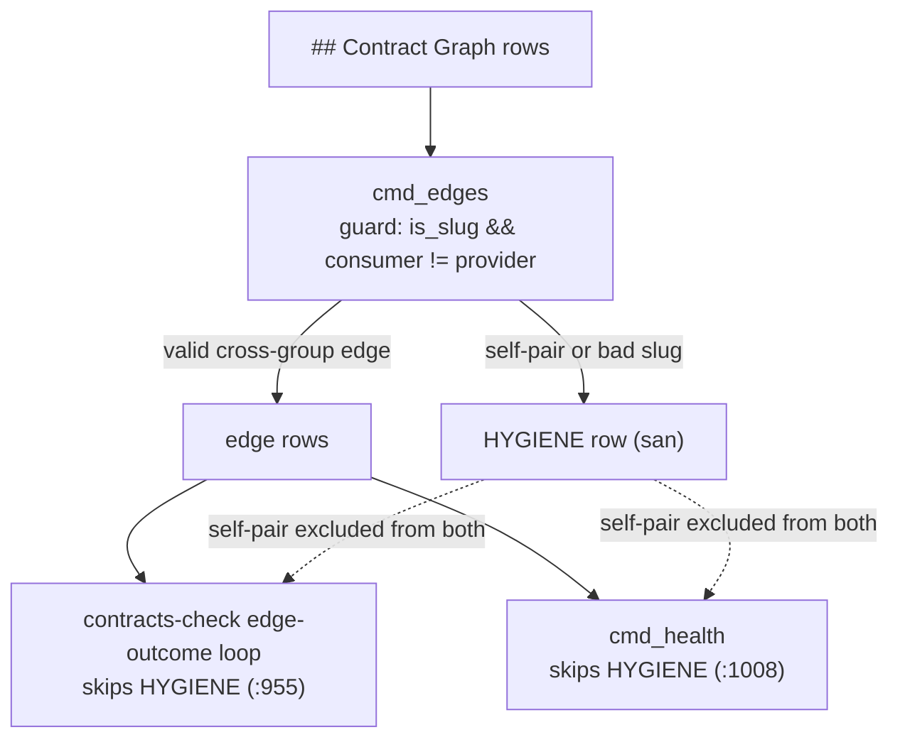

# Harden contracts-check — Plan

## Overview

Route the three hand-derived `000-blueprint` paths through `jimfile.sh path
blueprint` and drop the `<specs-root>` arg that routing strands, add a one-token
self-pair guard at the shared `cmd_edges` root (both consumers inherit it via
their existing HYGIENE skips), and pin the affected behaviors with six tests.

## Design Decisions

### 1. Self-edge guard at the shared `cmd_edges` root

- **Chosen:** Add `&& c1 != c3` to the edge-emit condition at
  `cmd_edges:786`, so a valid-slug self-pair (`consumer == provider`) falls to
  the **existing** `else` branch — `printf "HYGIENE\t%s\n", san(trim($0))`.
- **Why:** Both consumers of `cmd_edges` already skip HYGIENE rows — the
  edge-outcome loop (`:955`) and `cmd_health` (`:1008`) — so this single edit
  satisfies AC #4 (no contract outcome), AC #5 (surfaced as HYGIENE), and AC #6
  (excluded from health) at once. Reusing the existing `else` reuses the `san()`
  sanitization the security Advisory (security.md Finding 1) requires: one
  sanitized HYGIENE path, never a parallel echo.
- **Rejected:** Per-consumer guards — duplicates logic across two sites and
  re-introduces the duplication this spec removes. The CROSS-REF loop's own
  self-skip (`:929`) stays untouched — it iterates groups directly and never
  reads `cmd_edges`.

### 2. Route the slot through the resolver AND drop the stranded `<specs-root>` arg

- **Chosen:** Replace the three hand-composed `$specs_root/…/000-blueprint/spec.md`
  strings (`:912`, `:958`, `:1167`) with `bash "$JIMFILE" path blueprint
  "<group>"`, and **remove** the `<specs-root>` positional from
  `cmd_contracts_check` / `cmd_faces_aggregate` (drop the param, its `-z`
  validation, and shift `files-list` to the 2nd positional). Update the callers:
  the verify SKILL.md invocation, `contracts-methodology.md`,
  `retirement-methodology.md`, and every test invocation, and adjust the
  `missing-args` arity assertion (only `<map>` is now required).
- **Why:** The arg is provably redundant — in every call path it equals the
  config specs-root (production passes `jimfile.sh get specs`; tests pass the
  default `docs/specs`). Once the slot routes through the config-sourced
  resolver (the `blueprint-slot-reserved` invariant demands it), the arg carries
  no information the resolver lacks. Removing it is the root fix: no dead
  required parameter, and no backlog item to undo part of this same spec.
- **Rejected:** Keep-but-unused — leaves a required vestigial positional and
  launders self-inflicted debt into a follow-on issue. Resolver-override
  (`path blueprint <group> [specs-root]`) — the override would receive a value
  identical to config in every path, relocating the vacuous arg into the shared
  resolver.

### 3. No `cmd_health` or edge-outcome-loop code change

- **Chosen:** Leave `cmd_health` and the edge-outcome loop untouched; they
  inherit the self-edge exclusion through their existing HYGIENE skips.
- **Why:** Keeps the guard a single point of truth and the surface minimal.
- **Rejected:** A self-loop check inside `cmd_health`'s peel — redundant with the
  root guard and re-introduces duplicated self-pair logic.

## Constitution Check

**ARCHITECTURE.md status:** Present — constraints noted below.

| Constraint from ARCHITECTURE.md | Honored? | Notes |
| :--- | :--- | :--- |
| `blueprint-slot-reserved` — the `000-blueprint` slot is resolved only via `jimfile.sh path blueprint` | Yes | DD 2 routes all three sites through the resolver; no hand-composed slot string remains. |
| Sanitize every emitted field / column-shift guard (`:385`) | Yes | DD 1 reuses the existing `san(trim($0))` HYGIENE emission. |
| Location-only evidence, matched content never emitted (`:385`) | Yes | AC #8 (location-only) adds a regression test; no code path emits matched content. |
| Measurement-only health, no standing verdict (`:262`) | Yes | AC #6 corrects a *mismeasurement*; no verdict/threshold added. |
| `contracts-check`/`faces-aggregate` signature documented in ARCHITECTURE.md (`:385`) | Yes (pipeline-owned) | The signature drop makes `:385`'s text stale; the `/jim:build` completion gate refreshes it via `/jim:arch` — not a manual edit. |

## File Manifest

| Component | File Path | Action | Notes |
| :--- | :--- | :--- | :--- |
| Verify engine | `skills/verify/scripts/jimverify.sh` | Update | Self-pair guard at `cmd_edges:786`; resolver routing at `:912`/`:958`/`:1167`; drop `<specs-root>` from `cmd_contracts_check`/`cmd_faces_aggregate`. |
| Verify tests | `tests/jimverify.sh` | Update | Update all invocations to the new signatures + `missing-args` arity; six new `case_*` functions. |
| Verify skill | `skills/verify/SKILL.md` | Update | `contracts-check <map> [files-list]` / `faces-aggregate <map>` invocation text. |
| Contracts methodology | `skills/verify/references/contracts-methodology.md` | Update | Invocation signature. |
| Retirement methodology | `skills/verify/references/retirement-methodology.md` | Update | Invocation signature. |

## Interface Contracts

CLI verb signatures — **changed**:

```text
# jimverify contracts-check <map> [files-list]     (was <map> <specs-root> [files-list])
# jimverify faces-aggregate <map>                   (was <map> <specs-root>)
#   <specs-root> removed; blueprint paths come from the resolver. files-list is now the 2nd positional.
#   Arity: only <map> is required (missing <map> -> rc 2).

# jimverify edges <map>   — output grammar:
#     <consumer>\t<relies-on>\t<provider>   when is_slug(consumer) && is_slug(provider) && consumer != provider
#     HYGIENE\t<san(row)>                    otherwise  (CHANGED: a valid-slug self-pair now takes this branch)

# Resolver call (replaces the hand-composed string at the three sites):
#   bash "$JIMFILE" path blueprint "<group>"  ->  stdout: {specs}/<group>/000-blueprint/spec.md ; rc 0 for a valid slug
#   (callers pre-validate <group>, so rc is always 0 here; an empty result fails the existing `[[ -f ]]` guard safely)
```

## Data Flow

One guard at the shared root; two consumers inherit the exclusion:



## Task Breakdown

*Refactor: structural/interface changes first; every task's Verify runs the suite
(`bash skills/meta-test/scripts/run.sh jimverify`, from the repo root, exits 0),
so existing behavior is confirmed green.*

1. [x] **Route the three blueprint-path composals through the resolver.** In
   `jimverify.sh`, replace the hand-composed `$specs_root/$g|$P/000-blueprint/spec.md`
   at `:912`, `:958`, `:1167` with `bash "$JIMFILE" path blueprint "<group>"`.
   Leave the `<specs-root>` param in place for now (it becomes unused). (DD 2; AC #1/#2)
   **Verify:** `cd /mnt/src/jim && ! grep -q 'specs_root/\$' skills/verify/scripts/jimverify.sh && bash skills/meta-test/scripts/run.sh jimverify; echo rc=$?` (no hand-composed string; suite exits 0).

2. [x] **Drop the stranded `<specs-root>` arg and update all callers.** Remove the
   `specs_root` param and its `-z` validation from `cmd_contracts_check` and
   `cmd_faces_aggregate`; shift `files-list` to `${2:-}` in `cmd_contracts_check`.
   Update the invocation text in `skills/verify/SKILL.md`,
   `contracts-methodology.md`, `retirement-methodology.md`; update every
   `contracts-check`/`faces-aggregate` invocation in `tests/jimverify.sh`; and
   change the `missing-args` assertion to require only `<map>`. (DD 2; new AC, AC #3)
   **Verify:** `cd /mnt/src/jim && bash skills/meta-test/scripts/run.sh jimverify && ! grep -rEq 'contracts-check <map> <specs-root>|faces-aggregate <map> <specs-root>' skills/verify; echo rc=$?` (suite green; old signatures gone from docs).

3. [x] **[RED] Add the self-pair edges tests.** Add `case_jimverify_edges_self_pair_hygiene`
   (a map row `| a | x | a |` emits `^HYGIENE\t` and **no** `^a\tx\ta` edge) and
   `case_jimverify_edges_self_pair_sanitized` (a self-pair row bearing an embedded
   tab/control char emits a single sanitized HYGIENE row — no column shift),
   mirroring `case_jimverify_edges_crafted_cell_hygiene` (`:791`) with `hmap`.
   (Security Finding 1; AC #5)
   **Verify:** `cd /mnt/src/jim && bash skills/meta-test/scripts/run.sh self_pair; test $? -ne 0` (new cases fail against current code — red).

4. [x] **[GREEN] Apply the self-pair guard.** Add `&& c1 != c3` to the edge-emit
   condition at `cmd_edges:786`. (DD 1; AC #4/#5/#6)
   **Verify:** `cd /mnt/src/jim && bash skills/meta-test/scripts/run.sh self_pair && bash skills/meta-test/scripts/run.sh jimverify; echo rc=$?` (task-3 cases pass; full suite exits 0).

5. [x] **Pin health self-loop exclusion.** Add `case_jimverify_health_self_loop_excluded`
   — an `hmap` with a self-loop `| a | x | a |` asserts `CYCLES` = 0, no
   `^CYCLE\t…\ta` line, and the self-loop is not counted in `EDGES`. (AC #6)
   **Verify:** `cd /mnt/src/jim && bash skills/meta-test/scripts/run.sh self_loop && bash skills/meta-test/scripts/run.sh jimverify; echo rc=$?`

6. [x] **Pin self-edge → no contract outcome.** Add
   `case_jimverify_contracts_self_edge_no_outcome` — a `contracts_repo` variant
   whose graph carries a self-edge (`| accounts | … | accounts |`) asserts no
   `accounts>accounts#…` provider/consumer outcome row and no self CROSS-REF. (AC #4)
   **Verify:** `cd /mnt/src/jim && bash skills/meta-test/scripts/run.sh self_edge && bash skills/meta-test/scripts/run.sh jimverify; echo rc=$?`

7. [x] **Pin consumer-ref abstain.** Add `case_jimverify_contracts_consumer_abstain`
   — a `contracts_repo` variant whose consumer (`billing/invoice.js`) omits the
   declared `getIdentity` usage asserts the `$2=="consumer"` edge row is **absent**
   (neither `violated` nor `failed`), keyed like `case_jimverify_contracts_consumer_holds`
   (`:922`). (AC #7)
   **Verify:** `cd /mnt/src/jim && bash skills/meta-test/scripts/run.sh consumer_abstain && bash skills/meta-test/scripts/run.sh jimverify; echo rc=$?`

8. [x] **Pin edge-outcome location-only evidence.** Add
   `case_jimverify_contracts_edge_outcome_locationonly` — assert a `holds`
   provider/consumer outcome row's evidence is `file:line` only and the matched
   source token is never emitted (`grep -c 'function\|getIdentity' == 0` over the
   outcome rows), mirroring `case_jimverify_contracts_coverage_crossref_locationonly`
   (`:872`) but for `emit_edge` evidence. (AC #8)
   **Verify:** `cd /mnt/src/jim && bash skills/meta-test/scripts/run.sh edge_outcome_locationonly && bash skills/meta-test/scripts/run.sh jimverify; echo rc=$?`

## Requirements Coverage Summary

| Spec Acceptance Criterion | Addressed In Task(s) |
| :--- | :--- |
| AC #1 — every blueprint path via the single resolver; no hand-composed string | 1 |
| AC #2 — engine output unchanged by the resolver switch | 1 (existing tests pass) |
| AC #3 — `<specs-root>` removed; callers use the new signatures | 2 |
| AC #4 — self-edge produces no outcome and no CROSS-REF | 4 (guard), 6 (test) |
| AC #5 — self-edge surfaced as a HYGIENE row, not silent | 4 (guard), 3 (test) |
| AC #6 — self-edge excluded from health edge count and cycle clustering | 4 (guard), 5 (test) |
| AC #7 — consumer lacking the usage emits no edge record | 7 |
| AC #8 — edge-outcome evidence is location-only | 8 |
| AC #9 — behavior preserved; only signatures + `missing-args` arity change | 1, 2 (and every task's suite Verify) |
| security.md Finding 1 — self-pair drop reuses `san()`; control-char test | 4 (guard), 3 (sanitized test) |

## Out of Scope

- #64's duplicate-row concern (stays in #64, per spec Out of Scope).
- Self-edge handling beyond the exact `consumer == provider` case.
- **ARCHITECTURE.md refresh** (including the stale `contracts-check` signature at
  `:385`) — *not a deferral*: the `/jim:build` completion gate regenerates it via
  `/jim:arch`. Pipeline-owned, not a human follow-on.

## Open Questions

- [x] ~~Where does the self-edge guard live?~~ → Shared `cmd_edges` root (DD 1).
- [x] ~~What happens to the vestigial `$specs_root` arg?~~ → **Dropped** — 049
  widened to remove it and update all callers (DD 2), rather than leave a dead
  parameter or backlog it.
- [x] ~~Does routing through the config-sourced resolver break existing tests?~~ →
  No — default `specs` = `docs/specs` matches the fixtures' arg and production (verified).

None outstanding.
