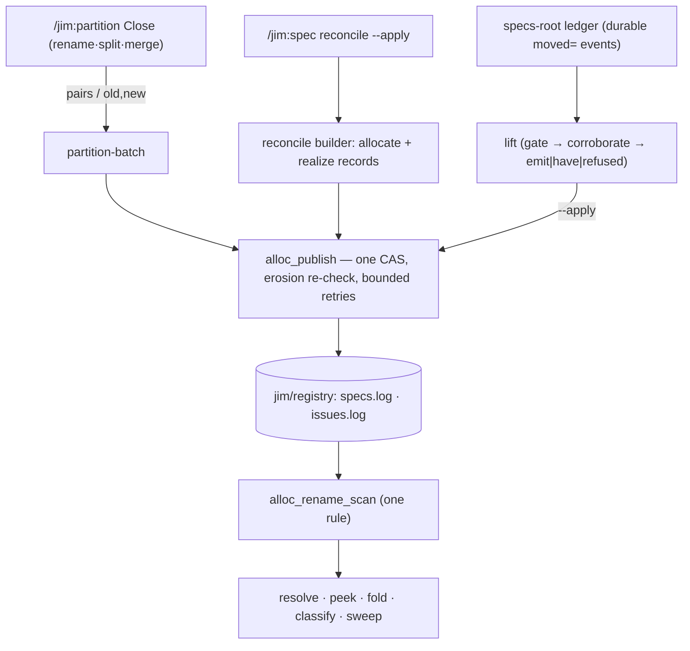

# Rename/redirect record emission — Plan

## Overview

Extract one shared rename-record scan rule and hang every reader and the new
writers off it: three rename encoders plus a grammar-distinct realize record,
a partition batch verb and an operator lift verb both publishing through the
existing one-CAS `alloc_publish` template, while the tree-scan next-id path
and `vacated-max` retire because the registry becomes the one ordinal
authority.

## Design Decisions

### 1. One shared rename scan rule

- **Chosen:** A single internal reader (`alloc_rename_scan`) that emits
  normalized, shape-validated rename tuples with **per-side**
  canonicalization verdicts; the resolver (spec+issue), alias map, both
  high-water folds, both classifiers, group coverage, and the sweep all fold
  from its output.
- **Why:** Seven readers carry private rename parses today; platform/012
  paid two criticals for readers-of-one-structure-with-different-rules
  (practice 9). Strict field counts (AC 1) and per-side width gating (AC 8)
  then change in exactly one place — including retiring the current
  trailing-token leniency research found live in a fixture.
- **Rejected:** Editing each reader's parse in place — recreates the drift
  class this cluster keeps paying for.

### 2. Record shapes: required `<who>`, grammar-distinct realize

- **Chosen:** All three rename kinds gain a required trailing `<who>`
  (Interface Contracts); a new `spec realize` kind carries
  `<group>/P-<date>-<slug> → <group>/<NNN>`. Exact field counts; a record
  matching a known verb with the wrong count or a failing field routes to
  the unreadable class; an **unknown verb** is reported distinctly, keeping
  the record-kind namespace open (the #200 design decision).
- **Why:** Symmetry with allocate's `<date> <who>` tail (fork 1 ruling);
  grammar-distinctness keeps `P-` out of rename parsing entirely, so the
  vacating fold can never count a provisional source (AC 2, #143's
  fold-safety).
- **Rejected:** Optional `<who>` — dual-shape parsing forever for zero
  benefit pre-emission. Widening rename's source token class to admit `P-` —
  puts the provisional grammar inside the vacating fold.

### 3. Realize records emit live; the lift is repair-only

- **Chosen:** `alloc_reconcile_spec_publish_builder` appends the
  `spec realize` record in the same CAS batch as the realization's allocate;
  the lift covers only history that predates emission.
- **Why:** No stale window between realization and dereferenceability; the
  record and its allocate land atomically or not at all; the lift's
  idempotency sharpens into its primary contract (AC 12). Resolves security
  review consideration and research Recommendation 1.
- **Rejected:** Lift-only steady state — every realization waits on an
  operator run to dereference.

### 4. The lift verb: `jimalloc.sh lift [--apply]`

- **Chosen:** An operator verb beside `sweep`/`catch-up`, preview by
  default. It reads the specs-root ledger through `jimledger.sh`
  (`BASH_SOURCE` composition), consumes both durable event families
  (`spec realized moved=` pairs; `partition finished op=split|merge moved=`
  pairs; `op=rename old=/new=` for group renames), gates every element with
  its own 3–15-digit ordinal bounds (AC 17), corroborates per AC 12, and
  publishes one batch with `<who>` = `jim-lift` and `<date>` = the event's
  own historical date.
- **Why:** Registry writes belong to the registry writer; preview/apply
  mirrors the established operator discipline; historical dates are the
  identity-relevant fact while the marker carries repair-time (security
  review Finding 4, resolved here).
- **Rejected:** A one-time backfill script — the lift run over existing
  history *is* the backfill (fork 6). A separate `jim-backfill` marker —
  one mechanism, one marker; branch history distinguishes runs.

### 5. Partition emission is Shape 1: allocate + tombstone per pair

- **Chosen:** A `jimalloc.sh partition-batch` verb taking renumber pairs on
  stdin: per pair it emits `spec allocate <new> …` **and**
  `spec rename <old> <new> …`; group mode emits one `group rename` record.
  Corroboration runs inside the publish builder, so each CAS attempt
  re-validates against fresh registry content (occupied destination /
  already-vacated source / self-rename refused by name).
- **Why:** Shape 1 (the charter): every rename destination is established
  and the log self-describing; builder-in-publish gives AC 4's all-or-none
  and AC 5's freshness from the existing erosion-re-check + retry loop with
  no new machinery.
- **Rejected:** Rename-only records — leaves live destinations resting on
  the resolver's source-known gate, which exists for history, not for
  operations that can afford full records.

### 6. Converge: the registry is the one ordinal authority

- **Chosen:** Partition instructions seed from `peek spec <group>`
  (advisory) and bind through `partition-batch` (authoritative); retire
  `jimfile.sh next-id`'s spec-group branch **and** `jimledger.sh
  vacated-max` (its only production consumer); their tests migrate to the
  registry fold.
- **Why:** #123 (kind/group collision) and #84 (rename floor) die
  structurally — the registry never forgets a rename; a retired verb with
  no caller would otherwise linger half-alive (research Recommendation 2).
- **Rejected:** Keeping the tree-scan path patched (`next-id spec` form +
  `maxid=` rename arm) — two ordinal authorities that can disagree mid-move
  is the exact window #113 constraint 2 names.

### 7. Pending provisionals refuse at preflight

- **Chosen:** A shared detection helper in `jimpartition.sh`; rename,
  split, and merge preflights refuse when an affected group holds a `P-`
  spec dir, naming each pending identity (sanitized); map-verb gates stay
  as second-line defense; `/jim:blueprint` synthesis discloses pending
  provisionals it excludes.
- **Why:** Fork 5 ruling — refusal is fail-safe, symmetric, and loud; the
  realizer keeps its correct halt for the concurrent-offline case.
- **Rejected:** Carrying provisionals through the move — leaves a pending
  identity under a name the allocator resolves away from.

### 8. Cross-parent realization via the widened move gate

- **Chosen:** Widen `move-spec-dir`'s **source** basename gate to accept
  `P-` shapes (destination stays `NNN-slug`); `apply_pending` routes a
  tracked cross-group realization through it; the frontmatter `group:`
  field is rewritten on every realization alongside `id:`; the untracked
  cross-group case refuses with "commit the directory first".
- **Why:** #152's four points with the smallest primitive change; the
  destination gate unchanged means no provisional shape can be minted as a
  move target.
- **Rejected:** A new cross-parent plain-move verb in `jimfile.sh` — power
  the flow needs only in the tracked case.

### 9. Provisional grammar: SYNC discipline, not a new verb

- **Chosen:** Refactor the three provisional predicates
  (`jimalloc.sh`/`jimfile.sh`/spec `reconcile.sh`) to byte-identical
  bodies with `SYNC:` comments naming every copy, plus a byte-agreement
  fixture (the `is_valid_id` precedent).
- **Why:** Zero runtime cost on paths that shell out per token; the
  precedent already proves the discipline holds under test enforcement.
- **Rejected:** A `jimfile.sh` verb — one more subprocess per candidate for
  the same guarantee.

### 10. Occupied-destination and self-rename semantics, decided once

- **Chosen:** Destination-occupied and source==destination are
  contradictions: the emitter (batch verb and lift) refuses them
  pre-publish by name; the classifier treats an arriving occupied
  group-rename as a duplicate finding (mirroring the spec-rename branch), a
  self-rename as an inert no-op (claims intact, no false DUP), and
  duplicate provenance cites the rename record's own position (#202's four
  shapes).
- **Why:** AC 6 — one semantics for writer and reader; no-op classification
  is the fail-safe reading of a record the emitter can never produce.
- **Rejected:** Classifying self-renames as unreadable — they parse fine;
  the defect was replay behavior, not shape.

## Constitution Check

**ARCHITECTURE.md status:** Present — constraints noted below.

| Constraint from ARCHITECTURE.md | Honored? | Notes |
| :--- | :--- | :--- |
| Single `is_valid_id` boundary; no new validator copy | Yes | New parsing delegates to existing gates; the prov-grammar SYNC (DD 9) extends the documented discipline |
| Untrusted git/ledger/registry content — parse, never `source`; validate before interpolation | Yes | Scan rule + lift element gates; outputs sanitized (AC 18) |
| No third-party dependencies; bash + POSIX only | Yes | All new code in existing scripts' idiom |
| Ordinals minted only through the coordination allocator | Yes | DD 6 completes this for partition |
| Scripting-layer conventions (`set -uo pipefail`, `BASH_SOURCE` composition, no IDs in comments) | Yes | Lift reads the ledger via `jimledger.sh` composition |
| Tests via meta-test framework conventions | Yes | All fixtures through `testlib.sh` |

## File Manifest

| Component | File Path | Action | Notes |
| :--- | :--- | :--- | :--- |
| Allocator | `skills/file/scripts/jimalloc.sh` | Update | Grammar header, shared scan rule, encoders (rename ×3 + realize), realize parse arm, resolver disclosure + per-side gating, classifier fixes, `partition-batch` verb, `lift` verb, reconcile-builder realize append, output sanitization |
| Ledger CLI | `skills/ledger/scripts/jimledger.sh` | Update | `move-spec-dir` source-gate widening; `vacated-max` retirement (verb + dispatch) |
| Path/ID CLI | `skills/file/scripts/jimfile.sh` | Update | Retire spec-group `next-id` branch; prov-predicate SYNC body |
| Spec realizer | `skills/spec/scripts/reconcile.sh` | Update | Cross-parent routing, `group:` rewrite, untracked refusal; prov-predicate SYNC body |
| Partition CLI | `skills/partition/scripts/jimpartition.sh` | Update | Pending-provisional detection helper + preflight refusals |
| Partition skill | `skills/partition/SKILL.md` | Update | Close steps emit via `partition-batch`; seeds via `peek`; redirect-vs-exhaustion consumer rule |
| Partition methodology | `skills/partition/references/partition-methodology.md` | Update | Seed guidance follows the allocator |
| Blueprint skill | `skills/blueprint/SKILL.md` | Update | Synthesis discloses excluded pending provisionals |
| File skill doc | `skills/file/SKILL.md` | Update | `next-id` documented as issue-kind only |
| Readme | `README.md` | Update | `next-id` example touchup |
| Allocator tests | `tests/jimalloc.sh` | Update | Fixtures to 6-token; strictness, per-side, realize, batch, lift, classifier, sanitization cases |
| Ledger tests | `tests/jimledger.sh` | Update | Widened move gate; `vacated-max` cases removed |
| File tests | `tests/jimfile.sh` | Update | Spec-group next-id cases removed; SYNC agreement fixture |
| Partition tests | `tests/jimpartition.sh` | Update | Preflight refusal cases |
| Realizer tests | `tests/specreconcile.sh` | Update | Cross-parent realize, `group:` rewrite, live realize record |

## Interface Contracts

```text
# Registry record grammar (post-B; exact field counts, one shape per kind)
spec  allocate <group>/<NNN> <slug> <date> <who>          (unchanged)
group allocate <group> <date> <who>                        (unchanged)
issue allocate <num> <slug> <date> <who>                   (unchanged)
spec  rename  <group>/<NNN> <newgroup>/<NNN> <date> <who>  (was: ended <date>)
group rename  <old-group> <new-group> <date> <who>         (was: ended <date>)
issue rename  <NNN> <newNNN> <date> <who>                  (was: ended <date>)
spec  realize <group>/P-<date>-<slug> <group>/<NNN> <date> <who>   (new kind)
# Known verb + wrong field count, or a field failing its gate → unreadable
# (classified, never half-parsed). Unknown verb → reported distinctly; the
# kind namespace stays open (#200 DD).

# Shared scan rule (internal; stdin = log)
alloc_rename_scan <spec|group|issue>
#   → kind \t src \t src_ok \t dst \t dst_ok \t date \t who \t pos
# Shape-invalid records never appear; *_ok carries the per-side width
# verdict so consumers apply their own semantics (fold counts valid sides;
# resolver anchors on a valid side and discloses a dropped one).

# Partition batch verb
jimalloc.sh partition-batch spec <date>  < pairs   # rows: old-id \t new-id \t slug
jimalloc.sh partition-batch group <old> <new> <date>
# Per pair: allocate(new) + rename(old→new), one CAS, all-or-none.
# Refusals (rc 1, nothing published, named on stderr): occupied destination,
# already-vacated source, self-rename, group redirect pending
# (retryable, names the current group) vs ordinal exhaustion (terminal).

# Lift verb (operator; preview default)
jimalloc.sh lift [--apply]
# Preview rows: event-kind \t src \t dst \t date \t emit|have|refused:<reason>
# --apply publishes rows in state `emit` as one batch; <who>=jim-lift,
# <date>=the event's own date. rc 1 when any row refused. Idempotent: a
# re-run reports `have` for everything already present.
# Corroboration (AC 12): destination establishment present and matching;
# source conflict-free; failures refused by name, never emitted.
# Corroboration and the have-dedupe run INSIDE the publish builder on each
# CAS attempt against fresh log content — the preview is advisory and the
# emit set is recomputed at publish, never replayed.

# Resolver disclosure (source-known)
jimalloc.sh resolve spec <id>   # stdout: current id (rc 0)
# stderr note when the answer derives from an unallocated or width-dropped
# side: `note: <id> derives from an unallocated rename source (record <pos>)`

# move-spec-dir gates (source widened, destination unchanged)
src: ^([0-9]{3}(-[a-z0-9][a-z0-9-]*|-wip)|P-[0-9]{8}-[a-z0-9][a-z0-9-]*)$
dst: ^[0-9]{3}-[a-z0-9][a-z0-9-]*$

# Partition preflight refusal (rename/split/merge, symmetric)
error: pending provisional spec(s) in <group>: <P-…> [<P-…> …] — realize
them first (/jim:spec reconcile), then re-run
```

## Data Flow



## Task Breakdown

1. [x] SYNC the provisional-grammar predicates (Tidy First): byte-identical
   bodies + `SYNC:` comments across `jimalloc.sh` / `jimfile.sh` / spec
   `reconcile.sh`, plus a byte-agreement fixture.
   **Verify:** `bash tests/jimfile.sh prov && bash skills/meta-test/scripts/run.sh | tail -1`

2. [x] Add `alloc_rename_scan` and migrate the resolver (spec+issue), alias
   map, both folds, and group coverage onto it; extend the grammar header;
   update every existing rename fixture to the 6-token shape; add 5-token /
   7-token / unknown-verb strictness fixtures.
   **Verify:** `bash tests/jimalloc.sh rename`

3. [x] Per-side width gating + source-known disclosure in the resolver
   (anchor on the representable side; stderr note per Interface Contracts;
   phantom and incoherent-log fixtures stay loud). Depends on task 2.
   **Verify:** `bash tests/jimalloc.sh resolve`

4. [x] Migrate both classifiers onto the scan rule and fix #202's four
   shapes (occupied group-rename → duplicate finding; self-renames → inert
   no-op; provenance cites the rename record's position); malformed shapes
   route to unreadable; sweep names unknown verbs distinctly. Depends on 2.
   **Verify:** `bash tests/jimalloc.sh classify`

5. [x] Add the four encoders (`rename` ×3, `realize`) and the realize parse
   arm: `resolve spec <P-token>` answers the real ordinal; the folds ignore
   realize sources (explicit high-water fixture); realize records never
   enter rename parsing. Depends on 2.
   **Verify:** `bash tests/jimalloc.sh realize`

6. [x] Live realize emission: `alloc_reconcile_spec_publish_builder`
   appends the realize record beside each `new` identity's allocate;
   registry-readback fixture on the realize path. Depends on 5.
   **Verify:** `bash tests/jimalloc.sh reconcile && bash tests/specreconcile.sh`

7. [x] `partition-batch` verb (spec-pairs and group modes) with in-builder
   corroboration refusals — including the group-mode occupied-destination
   case, fixtured on the same shape the classifier reports — and the
   retryable-redirect vs terminal-exhaustion stderr contract; all-or-none
   and refusal-leaves-registry-untouched fixtures. Depends on 5.
   **Verify:** `bash tests/jimalloc.sh partition_batch`

8. [x] `lift` verb: preview/apply, both event families via `jimledger.sh`
   composition, 3–15 element bounds, corroboration and the `have` dedupe
   recomputed inside the publish builder on every CAS attempt (the preview
   is advisory; the emit set is never replayed), `jim-lift` marker +
   historical dates; tampered-event refusal, stale-preview
   re-corroboration, and jim-split-shaped backfill fixtures asserting the
   peek floor. Depends on 5.
   **Verify:** `bash tests/jimalloc.sh lift`

9. [x] Retire the tree-scan path: remove `jimfile.sh next-id`'s spec-group
   branch and `jimledger.sh vacated-max` (verb + dispatch); migrate or
   remove their tests; update `skills/file/SKILL.md` and `README.md`.
   **Verify:** `bash tests/jimfile.sh && bash tests/jimledger.sh`

10. [x] Partition preflight refusals: shared pending-provisional detection;
    rename/split/merge refuse symmetrically naming each identity
    (sanitized). Depends on nothing; independent of 2–9.
    **Verify:** `bash tests/jimpartition.sh provisional`

11. [x] Cross-parent realization: widen `move-spec-dir`'s source gate;
    route tracked cross-group realizations through it; rewrite `group:` on
    every realization; untracked cross-group refusal names the remedy.
    Depends on 1 (SYNC'd predicate).
    **Verify:** `bash tests/specreconcile.sh cross && bash tests/jimledger.sh move_spec`

12. [ ] Instruction-layer convergence: partition SKILL.md + methodology
    Close steps emit through `partition-batch`, seeds via `peek spec` with
    the redirect/exhaustion distinction spelled out; blueprint SKILL.md
    synthesis discloses excluded pending provisionals. Depends on 7, 9, 10.
    **Verify:** `grep -n 'partition-batch' skills/partition/SKILL.md && grep -n 'pending provisional' skills/blueprint/SKILL.md`

13. [ ] Output-hygiene audit (AC 18): every new stdout/stderr path echoing
    a registry or ledger token prints it gated + sanitized/truncation-noted
    (`alloc_sanitize_who` and the sweep idiom); hostile-token fixtures for
    disclosure, batch refusal, preflight, and lift outputs. Depends on
    3, 7, 8, 10.
    **Verify:** `bash tests/jimalloc.sh sanitize && bash tests/jimpartition.sh sanitize`

14. [ ] Execute the backfill (AC 13): run `lift` preview then `--apply`
    against the repo's own specs-root ledger (local registry tier); the
    2026-07-25 split's pairs land with `jim-lift`/historical dates; the
    realize event from this spec's own realization lands as a `have`/`emit`
    row. Depends on 8, 9.
    **Verify:** `bash skills/file/scripts/jimalloc.sh peek spec jim && bash skills/file/scripts/jimalloc.sh sweep`

15. [ ] Full-suite closure: entire suite green; sweep clean with the
    retired group covered.
    **Verify:** `bash skills/meta-test/scripts/run.sh`

## Requirements Coverage Summary

| Spec Acceptance Criterion | Addressed In Task(s) |
| :--- | :--- |
| 1 — required `<who>`, one shape, unreadable fall-through | 2, 13 |
| 2 — grammar-distinct realize kind; no high-water raise; P-token resolves | 5, 6 |
| 3 — group rename record; old name resolves; allocation refuses w/ redirect | 7, 12 |
| 4 — all-or-none batch publish | 7 |
| 5 — fresh-state validation, conflicts refused pre-merge | 7 |
| 6 — occupied-destination decided once; #202's four shapes fixtured | 4, 7 |
| 7 — source-known resolution with disclosure | 3 |
| 8 — per-side width gating | 2, 3 |
| 9 — allocator convergence; tree-scan path retired | 9, 12 |
| 10 — symmetric preflight refusals; blueprint synthesis disclosure | 10, 12 |
| 11 — cross-parent realization; `group:` rewrite; untracked remedy | 11 |
| 12 — the lift: gated, corroborated, idempotent | 8 |
| 13 — backfill executed; peek floor holds; sweep clean | 14, 15 |
| 14 — distinct provenance marker class; hint-not-authentication | 8 |
| 15 — provisional grammar single-sourced / SYNC-fixtured | 1 |
| 16 — redirect-refusal vs exhaustion distinguished by new consumers | 7, 12 |
| 17 — ledger parser and registry width bounds agree | 8 |
| 18 — output hygiene on every new token-echoing path | 13 |

## Out of Scope

- The `ARCHITECTURE.md` refresh — handled by the `/jim:build` completion
  gate via `/jim:arch` (pipeline-owned, not a deferral).
- The blueprint-group `000-blueprint` face update — handled by the review's
  blueprint gate (pipeline-owned). The `sdlc` face's missing `jimalloc`
  entry is already filed as its own issue (#204).
- `#200`'s repair path, issue-rename producers, ad-hoc rename workflows,
  retroactive provenance — excluded by the spec's Out of Scope; unchanged
  here.
- A broader `WORKFLOW.md`/`README.md` refresh beyond the `next-id`
  touchups in tasks 9/12 — checked at ship time per working convention.

## Open Questions

None — every question raised during design is resolved:

- [x] ~~Live vs lift for new realizations~~ → live in the realize batch;
  lift is repair-only (DD 3).
- [x] ~~Lifted-record date semantics~~ → historical event date; marker
  carries repair-time (DD 4; security review Finding 4).
- [x] ~~`vacated-max` after convergence~~ → retires with its consumer
  (DD 6).
- [x] ~~Self-rename classification~~ → inert no-op for the classifier,
  refused by the emitter (DD 10).
