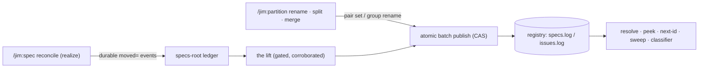

# 025 Rename/redirect record emission

## Overview

Add the registry's write path: partition operations and provisional
realization record every identity change as atomic rename/redirect records
with required provenance, the resolver dereferences vacated citations with
disclosure, and one untrusted-input-hardened lift turns the ledger's durable
pair events into registry records — including the backfill of the split that
predates emission. Home group `blueprint`; declared cross-group writes:
`platform` (allocator grammar, encoders, and readers; the ledger's
cross-parent move gate) and `sdlc` (the spec realize path).

## Problem Statement

Every identity-changing operation jim performs — a partition rename, split,
or merge, and the realization of an offline-scoped provisional spec —
rewrites identities in the tree while the registry hears nothing. The rename
read path is complete (resolution, high-water, group aliasing, integrity
classification), but the grammar it parses is emitted by nothing.

The cost is live, not theoretical. The 2026-07-25 split of the `jim` group
rewrote 52 identities and wrote no record, so the entire group fell out of
coordination: `peek spec jim` offers `jim/001` — a spent ordinal — while the
tree-scan floor answers `053`. A commit trailer citing a pre-split identity
no longer dereferences through the registry at all. Until emission exists,
every future partition operation repeats this silently, vacated-ordinal
safety rests on ledger data a fresh clone does not share, two independent
next-id computations can disagree mid-move, and a concurrent edit-vs-rename
conflict surfaces as a git merge failure instead of a named refusal.

## User Stories

- As a developer dereferencing a commit trailer frozen before a rename,
  split, merge, or realization, I can resolve it to the identity's current
  name so that project history stays navigable indefinitely.
- As a developer running a partition operation, I can rely on every identity
  change landing atomically at the coordination point so that no concurrent
  clone is ever handed an identity the operation moved or retired.
- As a developer realizing offline-scoped specs, I can realize an identity
  whose group moved since issuance so that offline work lands without manual
  surgery.
- As an operator auditing the registry, I can distinguish live emission from
  retroactive repair by each record's provenance so that the log tells its
  own history.

## Acceptance Criteria

- [ ] 1. All three rename record kinds (`spec rename`, `group rename`,
  `issue rename`) end `<date> <who>` with `<who>` required — symmetric with
  allocate records (wire-format constraint: platform/007's record grammar,
  extended per the fork ruling below). Every registry reader accepts exactly this one shape; a
  rename record missing `<who>` surfaces through the sweep's
  unreadable-record class rather than being half-parsed.
- [ ] 2. A grammar-distinct record kind expresses provisional→real
  realization (constraint source: the fold-safety analysis on #143). A
  `P-` token remains illegal on either side of `spec rename`;
  a realization record never raises any group's ordinal high-water
  (fixtured, not assumed); once a realization is recorded, resolving the
  provisional identity answers the real ordinal.
- [ ] 3. Completing a partition group rename writes one `group rename`
  record; afterwards, resolving an id issued under the old name answers
  under the new name, and allocation into the old name refuses with the
  redirect named until acknowledged.
- [ ] 4. A split or merge's complete renumber pair set publishes as one
  all-or-none registry commit: a failed publish leaves no partial batch
  visible, and the operation reports the failure before its Close completes.
- [ ] 5. Emission validates against freshly fetched registry state: a
  conflicting concurrent record (occupied destination, already-vacated
  source) refuses with the conflict named, before any git-level
  rename/modify conflict can land at merge.
- [ ] 6. Occupied-destination semantics is decided once: the emitter refuses
  a rename whose destination identity is already claimed, and the integrity
  classifier reports the same shape in a pushed log as a duplicate citing
  the rename record that created it. The classifier's four rename-replay
  defects (occupied group rename, group self-rename, spec self-rename,
  duplicate provenance citation) are closed, fixtured per shape.
- [ ] 7. An id whose only registry appearance is as a rename source resolves
  to its current referent, and the output discloses that the answer derives
  from an unallocated source; an id no record mentions still errors.
- [ ] 8. Ordinal-width gating is per side: an over-wide source no longer
  drops its destination's establishing claim, and an unapplied over-wide
  destination is disclosed rather than answered over confidently.
- [ ] 9. Partition operations obtain ordinals and floors from the
  coordination allocator; the tree-scan spec-group next-id path is retired
  (constraint source: #113's two-next-id-surfaces constraint, ruled below).
  With it, the group/kind name collision and the rename-floor gap cease to
  exist rather than being patched (#123, #84).
- [ ] 10. Rename, split, and merge preflights each refuse when an affected
  group holds a pending provisional spec, naming every pending identity;
  blueprint generate-mode synthesis discloses any pending provisional it
  excludes rather than omitting it silently.
- [ ] 11. Realizing an identity whose group moved since issuance relocates
  the tracked spec directory across parent groups and succeeds; the
  frontmatter `group:` field is rewritten on every realization; the
  untracked cross-parent case refuses with the remedy named.
- [ ] 12. One lift mechanism turns the ledger's durable pair events
  (realization mappings and partition renumber maps) into registry records,
  treating ledger content as untrusted: every element is charset-gated on
  read and corroborated against registry state — a pair is emitted only
  when its destination is already established in the registry with an
  identity matching the event's, and its source conflicts with no live
  claim; a pair failing corroboration is refused by name, never emitted —
  so a tampered event can never mint a redirect to an attacker-chosen
  target (constraint source: sdlc/017's spec-phase security review
  Finding 5, carried by #143; corroboration defined per this spec's
  security review Finding 1). The lift is idempotent — re-running it emits
  nothing already present.
- [ ] 13. Running the lift over jim's existing specs-root ledger backfills
  the 2026-07-25 split's pair list; afterwards the retired group's registry
  answers agree with the tree-scan floor (`peek spec jim` no longer offers a
  spent ordinal) and the sweep runs clean.
- [ ] 14. Lifted and backfilled records carry a distinct provenance marker
  class, as seed and catch-up records do, so retroactive repair is
  distinguishable from live emission in the log itself. In-record
  provenance is an audit hint — the append-only coordination-branch history
  remains the authoritative trail, and no consumer makes a trust decision
  from `<who>` alone.
- [ ] 15. With `P-` tokens entering the registry parser, the
  provisional-identity grammar has one authoritative rule shared by every
  reader — or byte-agreement-fixtured copies — so a loosened copy fails a
  test rather than silently widening a boundary (constraint source: the
  documented `is_valid_id` SYNC-discipline convention; #155).
- [ ] 16. Every surface this spec teaches to call the allocator
  distinguishes the retryable group-redirect refusal from terminal ordinal
  exhaustion and treats the returned group as authoritative; fixtured for
  the partition consumer.
- [ ] 17. The ledger pair-event parser and the registry accept the same
  ordinal width bounds, so every representable registry ordinal is liftable.
- [ ] 18. Every new output path that echoes a registry or ledger token —
  disclosure lines, emission and preflight refusals, lift reports — prints
  it only after the same field gating applied at parse time (the `<who>`
  slot included), sanitized and truncation-noted per the sweep's
  established output discipline (constraint source: this spec's security
  review Finding 2; ARCHITECTURE.md → Security Considerations).

## Data Flow

## Out of Scope

- The repair path for registry-internal contradictions (#200) — this spec
  records only the design decision that its grammar work does not foreclose
  a future precedence/tombstone record kind; the procedure and any repair
  verbs stay #200's.
- Issue-rename emission. The grammar carries the kind (shape symmetry and
  provenance), but no producer exists today and none is added.
- An ad-hoc operator rename workflow. The emission surfaces are the
  partition lifecycle and the lift; a hand-run rename outside them stays
  unsupported.
- Retroactive provenance for records that predate this spec — existing
  allocate records keep the `<who>` they have.
- The broad "every ID consumer becomes resolution-aware" clause. Citation
  normalization is already carried by the realize citation sweep and the
  partition reference rewriter; this spec verifies coverage where its
  operations touch citations and adds no new consumer-side machinery.
- General registry drift repair beyond the one backfill named here — the
  sweep and catch-up verbs own that.
- Batch-CAS candidate-batch allocation (Spec D) and issue content placement
  (Spec F).

## Research & Architecture Handoff

*Implementation insights surfaced during scoping. These are context for the
architect — not requirements, not exclusions. Treat each as a starting point
to evaluate, not a directive.*

### Insight 1: The batch publish template exists

- **Relates to AC:** *"complete renumber pair set publishes as one
  all-or-none registry commit"* (AC #4)
- **Surfaced as:** `alloc_publish` (one commit, all-or-none CAS, erosion
  re-check, baseline arming, bounded retries, local tier when no remote) and
  the reconcile publish builders as the pattern to copy for a partition
  batch builder.
- **Levelled-up requirement (already in the ACs):** batch atomicity and
  pre-publish freshness as observable registry behavior.
- **Deflection reason:** Delegation — the plan chooses how to compose the
  builder.
- **Architect note:** the partition Close steps already print `old → new`
  pairs in the record's shape; the emission hook is composing those into one
  builder call, not re-deriving them.
- **Routing hint:** Architect to decide.

### Insight 2: One rule per structure (the platform/012 lesson)

- **Relates to AC:** *"every registry reader accepts exactly this one
  shape"* (AC #1); *"decided once"* (AC #6); *"one authoritative rule"*
  (AC #15)
- **Surfaced as:** `alloc_spec_claim_keys` as the precedent — one extracted
  rule that realize folds and the sweep counts.
- **Levelled-up requirement (already in the ACs):** shared-rule discipline
  stated as observable agreement between readers.
- **Deflection reason:** Constraint-Sourcing — practice 9 in the cluster
  note; platform/012 paid two criticals for three readers with three rules.
- **Architect note:** the grammar extension touches every parser in the
  allocator; extract the rename-record parse rule once rather than editing
  each reader's private copy in place.
- **Routing hint:** Architect to decide.

### Insight 3: Lift sources and the width mismatch

- **Relates to AC:** *"one lift mechanism"* (AC #12); *"backfills the
  2026-07-25 split's pair list"* (AC #13); *"same ordinal width bounds"*
  (AC #17)
- **Surfaced as:** the realize path already appends `spec realized
  moved=<group>/P-<token>:<group>/<NNN>` events built for this lift; the
  specs-root ledger holds the split's complete `moved=` pair list; the
  ledger's existing `moved=` consumer charset-gates every element before
  use (the pattern to mirror) but gates ordinals at exactly three digits
  while the registry accepts 3–15; `op=rename` ledger events carry
  `old=`/`new=` and no pair list.
- **Levelled-up requirement (already in the ACs):** untrusted-input
  handling, idempotency, and width-bound agreement as observable behavior.
- **Deflection reason:** Delegation.
- **Architect note:** group-rename lifting derives from `old=`/`new=`
  tokens, not pairs — the lift has two event shapes to consume, not one.
- **Routing hint:** Researcher to investigate current event grammar
  coverage, then architect.

### Insight 4: The gate-widening sites are known and asymmetric

- **Relates to AC:** *"preflights each refuse … naming every pending
  identity"* (AC #10); *"relocates the tracked spec directory across parent
  groups"* (AC #11)
- **Surfaced as:** the ledger's cross-parent move verb refuses a `P-`
  source basename; the split map verb hard-fails the whole map on a `P-`
  source while the merge map verb silently skips one — an asymmetry neither
  side chose deliberately.
- **Levelled-up requirement (already in the ACs):** symmetric refusal with
  named identities; cross-parent realization succeeding.
- **Deflection reason:** Delegation.
- **Architect note:** widening the move verb's *source* gate only — the
  destination stays `NNN-slug` — was already traced in the rider issue; the
  preflight refusal makes the map-verb gates a second line of defense, not
  the user-facing surface.
- **Routing hint:** Architect to decide.

### Insight 5: Live-vs-lift for new realizations

- **Relates to AC:** *"once a realization is recorded, resolving the
  provisional identity answers the real ordinal"* (AC #2)
- **Surfaced as:** realization already publishes an allocate batch at
  realize time; the realization record could ride that same CAS, leaving
  the lift for events that predate emission.
- **Levelled-up requirement (already in the ACs):** the AC requires the
  mapping to be recorded and resolvable, not which path records it.
- **Deflection reason:** Razor — the observable is identical either way.
- **Architect note:** if new realizations emit live, the lift's steady-state
  job narrows to backfill and repair, which sharpens its idempotency
  requirement (AC #12) into its primary contract.
- **Routing hint:** Architect to decide.

### Insight 6: Provenance markers have a naming precedent

- **Relates to AC:** *"distinct provenance marker class"* (AC #14)
- **Surfaced as:** `jim-seed` / `jim-catchup` as the existing marker class
  for non-live records; live emission takes `<who>` from the same source
  allocate records use.
- **Levelled-up requirement (already in the ACs):** repair distinguishable
  from live emission in the log.
- **Deflection reason:** Delegation — the plan names the marker.
- **Routing hint:** Architect to decide.

### Insight 7: Convergence retires a caller, not just a bug

- **Relates to AC:** *"tree-scan spec-group next-id path is retired"*
  (AC #9)
- **Surfaced as:** the partition merge seed is the last consumer of the
  tree-scan path and passes its stdout verbatim; the group/kind collision
  and the rename-floor gap are both defects of that path, not of the
  allocator.
- **Levelled-up requirement (already in the ACs):** one ordinal authority,
  stated as which surface partition consults.
- **Deflection reason:** Razor — patching two defects in a path the
  registry now supersedes is work the retirement deletes.
- **Architect note:** the registry never forgets a rename, so the
  rename-floor question dies structurally; verify no other caller of the
  tree-scan spec-group form survives before deleting it.
- **Routing hint:** Researcher to investigate remaining callers.

## Open Questions

None — every interview fork is resolved:

- [x] ~Do rename records carry provenance?~ → Extend the frozen shape: all
  three rename kinds end `<date> <who>`, required, no dual-shape parsing.
  Pre-emission (zero rename records live) is when this is free; the
  backfill is where anonymity would have hurt.
- [x] ~Resolver semantics for source-only ids~ → Source-known **with
  disclosure**, plus per-side width gating, taken together.
- [x] ~Realize-lift record kind~ → New grammar-distinct kind; `P-` stays
  out of `spec rename`; single-sourcing the provisional grammar becomes
  load-bearing and rides this spec (AC #15).
- [x] ~Two next-id surfaces~ → Converge partition onto the allocator and
  retire the tree-scan spec-group path; #84 and #123 close at the root.
- [x] ~Provisional under a moving group~ → Refuse at preflight, symmetric
  across rename/split/merge; the realize-side cross-parent fix ships
  regardless (the halt stays reachable from a concurrent offline binding);
  `group:` frontmatter rewrite on every realization.
- [x] ~Backfill shape~ → One lift mechanism over the ledger's durable pair
  events; the backfill is that mechanism run over existing history, not
  one-time scaffolding.
- [x] ~Home group~ → One spec (splitting grammar from emission recreates
  the three-readers failure), home `blueprint`, platform and sdlc writes
  declared.
- [x] ~Coordination with the repair-path design (#200)~ → Design decision:
  this grammar work must not foreclose a future precedence/tombstone record
  kind — readers reject an unknown record verb loudly rather than
  misparsing it — and the repair path itself stays #200's.
- [x] ~Untracked directory in the cross-parent realize case~ → Refuse and
  name the remedy (commit first); no new plain-move verb.
