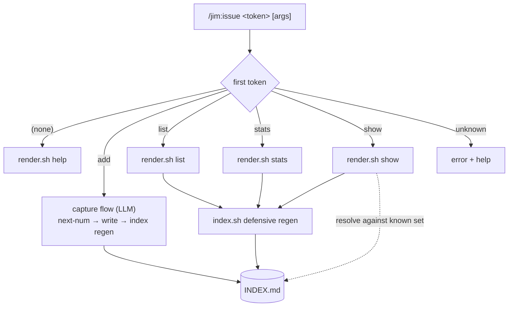
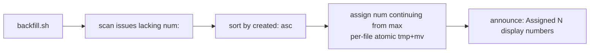

# Issue Command Consolidation — subcommand surface — Plan

## Overview

Consolidate `/jim:issue` + `/jim:issues` into one `/jim:issue` whose SKILL.md dispatches `add` (the unchanged 017 LLM capture flow) versus the deterministic read verbs (`list` / `stats` / `show` / help), which are served by growing the existing `render.sh` into a subcommand dispatcher. Add a persisted display-only `num:` ordinal (assigned at `add` time, one-shot backfilled for legacy issues via a dedicated atomic script), and delete the `issues` SKILL.md while leaving its scripts in place to avoid churn across the seven 018 batch protocols.

## Design Decisions

### 1. Dispatch split — `add` is LLM, the rest is bash

- **Chosen:** `skills/issue/SKILL.md` reads the first token of `$ARGUMENTS`. `add` → the existing capture flow (LLM). `list` / `stats` / `show` / (empty→help) → invoke `render.sh <verb> [args]` and present its stdout verbatim. An unrecognized first token → print an error line plus the help listing; it never falls through to capture.
- **Why:** Matches jim's Bash-vs-Prompt rule (ARCHITECTURE.md) — the read verbs are deterministic transforms over `INDEX.md`; only capture needs judgment. Presenting script output verbatim (no LLM re-interpretation of issue bodies) satisfies security.md Finding 2.
- **Rejected:** Free-text capture fall-through for unknown tokens — reintroduces the verb/subject ambiguity the explicit-verb design exists to remove (spec § dispatch).

### 2. Deterministic verbs via `render.sh` as a `case` dispatcher

- **Chosen:** Restructure `render.sh` (`skills/issues/scripts/render.sh`) into `case "$1" in stats|list|show|help) ...`. `render.sh stats` reproduces today's trend output (plus a by-priority count); `render.sh list [filter]` is a new per-issue enumeration; `render.sh show <id>` resolves and formats one issue; `render.sh help` prints the subcommand listing. Defensive `index.sh` regen (existing render.sh behavior) is kept as the first step of every read verb.
- **Why:** `render.sh` already parses every `INDEX.md` section; reusing it is the least-churn path and mirrors the `case`-dispatch pattern in `jimfile.sh` / `jimconf.sh`. Defensive regen guarantees freshly-backfilled `num:` values surface.
- **Rejected:** A new `dispatch.sh` — adds a script and an `allowed-tools` entry for no benefit. LLM-side rendering — violates security.md Finding 2 (untrusted body into agent context).

### 3. Script location — relocate everything under `skills/issue/scripts/`; no `skills/issues/` path remains

- **Chosen:** Move `index.sh`, `render.sh`, and the new `backfill.sh` to `skills/issue/scripts/`, delete `skills/issues/` entirely (SKILL.md + now-empty `scripts/`), and update every reference. That means rewriting the `${CLAUDE_PLUGIN_ROOT}/skills/issues/scripts/index.sh` path in all seven 018 batch protocols (`allowed-tools` + two body call sites each = 21) plus `skills/issue/SKILL.md` (9 total, research §6) — 30 occurrences across 8 files — and the `INDEX_SCRIPT`/`$HERE` references inside the scripts.
- **Why:** We are unifying under a single skill; a SKILL-less `skills/issues/` directory left behind to dodge edits is an inconsistent half-measure. The churn is mechanical, the research enumerates every site, and a repo-wide grep gate (no `skills/issues/` reference may remain) plus the full meta-test suite catch any miss.
- **Rejected:** Leave scripts in `skills/issues/scripts/` and delete only the SKILL.md — avoids churn but leaves an orphan directory and a path that contradicts the consolidation. Explicitly overruled.

### 4. `num:` parsing in `index.sh`

- **Chosen:** Parse `num:` in the `index.sh` main loop via the existing `parse_simple_field` (research §3, L100–109) into a new `meta_num` map; emit `num` and `created` in the `## Issues` section rows so `list` can sort/group/select on them.
- **Why:** The main loop already reads every file's frontmatter — adding one field is free. `list` needs `created` for date-sort and `num` for the ordinal column, so both must reach `INDEX.md`.
- **Rejected:** A separate `## Num` section — redundant; the `## Issues` rows are the natural carrier.

### 5. Ordinal assignment for `add` — `jimfile.sh next-num issue`

- **Chosen:** Add a `next-num issue` operation to `jimfile.sh` that scans `num:` across `<issues_dir>/*.md` and prints `max + 1` (or `1` when none exist), in one `grep`/`awk` pass. `add` calls it after backfill to stamp the new issue.
- **Why:** Mirrors `next-id issue` placement (research §2). One-pass scan is acceptable at hundreds of issues (research § Scale). Decentralized — duplicates are accepted as non-fatal per spec.
- **Rejected:** A persistent counter file — merge-conflict-prone across branches; the spec already accepts duplicate ordinals as harmless.

### 6. One-shot backfill — standalone migration, run once, NOT wired into the verb flow

- **Chosen:** New `skills/issue/scripts/backfill.sh`, a one-time **migration** for the `num:`-field format change. It collects issues lacking `num:`, sorts by `created:` ascending, assigns sequential ordinals continuing from the current max, and writes each file with a per-file atomic `tmp + mv` (mirroring `index.sh` DD #12), preserving all other content. Idempotent (no-op when every issue already has `num:`); prints `Assigned display numbers to N issue(s).` only when N>0. It is invoked **once** at 019 rollout — a build task runs it against `docs/issues/` for this repo; users run it once after upgrading (documented in WORKFLOW/release notes). The normal command flow (`add`/`list`/`stats`/`show`) never calls it.
- **Why:** Backfill is a migration, not runtime behavior — running it on every verb invocation would re-scan the whole collection for nothing once the format is current. New issues get their ordinal at `add` time via `next-num`; legacy issues remain fully functional un-numbered (slug/prefix/id addressing, blank ordinal column), so backfill is convenience, not correctness. Running it up-front (before any new `add`) keeps ordinals ascending with creation — `next-num` ignores un-numbered legacy issues, so numbering new issues before migrating would invert chronological order. Atomic per-file write satisfies security.md Finding 4.
- **Rejected:** Per-verb invocation (the originally-drafted hook) — wasteful re-scan on every command; overruled. Backfill inside `render.sh` — breaks the read-only guarantee. Silent write — violates transparency (the one-line notice is kept). A permanent `backfill` verb — the surface stays `add`/`list`/`stats`/`show`/help; the migration is a one-shot script, not a command.

### 7. `show` resolution — match against the indexed set, never compose a path from raw input

- **Chosen:** `render.sh show <arg>` resolves against `INDEX.md`'s known set: if `<arg>` is all-digits → ordinal lookup over `meta_num`; else exact `id` match → exact slug match → unique slug-prefix match. 0 matches → "no issue matched"; exactly 1 → format and print; >1 (duplicate ordinal or ambiguous prefix) → list the candidates and ask. Only the single resolved slug is passed to `jimfile.sh path issue` for the file read.
- **Why:** Resolving against the known set (not `test -e` on the argument) closes the path-traversal vector (security.md Finding 1). Pure-int → ordinal also resolves the numeric-slug open question (a numeric-slug issue is reached via full id or a non-numeric prefix).
- **Rejected:** Composing `<issues_dir>/<arg>.md` from the raw argument — path traversal (`show ../../etc/passwd`).

### 8. `list` view — config defaults + closed-set filter validation

- **Chosen:** `render.sh list [filter]` renders the `## Issues` rows. Default grouping/sort/columns come from three jimconf keys (`issue_list_group`, `issue_list_sort`, `issue_list_cols`); a positional `[filter]` overrides scope for that call. The filter is validated against the closed set `{open, closed, critical, high, medium, low}` (status vs priority disambiguated by which set it lands in); unknown filters produce a clear error rather than reaching a pattern matcher. **All three `issue_list_*` config values are likewise validated against their allowed sets (Interface Contract); an unrecognized `group`/`sort`/`cols` value falls back to its documented default rather than being passed into a sort/group/column expression** *(resolves security.md Finding 5)*.
- **Why:** Satisfies spec `list` ACs and security.md Findings 3 + 5 (filter/column/group/sort injection). Disjoint value sets make a single positional unambiguous. Config is developer-authored (trusted), but validate-and-fall-back keeps a `jimconf.toml` typo from producing a broken or mis-sorted view.
- **Rejected:** Free-form filter or config value passed to `grep`/`awk`/`sort` — argument/regex injection, silent mis-sort. Erroring the whole view on a bad config value — a typo shouldn't break `list`; fall back to default instead.

### 9. Config keys via an `issue_list_*` prefix arm in `resolve()`

- **Chosen:** Add `issue_list_group`, `issue_list_sort`, `issue_list_cols` to `KEYS`; add `default_for()` arms (`status`, `date`, `num,date,priority,slug`); extend `resolve()` (research §1, L99–125) with an `issue_list_*` prefix arm that returns the bare TOML name (no `_path` suffix), alongside the existing `require_*` / `auto_*` / `issue_capture` arms.
- **Why:** These keys are neither path-typed nor toggles; a prefix family generalizes cleanly and is self-documenting (parallel to `auto_*`).
- **Rejected:** Three bare-name literal special-cases — noisier than one prefix arm.

## Constitution Check

**ARCHITECTURE.md status:** Present — constraints noted below.

| Constraint from ARCHITECTURE.md | Honored? | Notes |
| :--- | :--- | :--- |
| Skills under `skills/{name}/SKILL.md`; ≤ 500 lines | Yes | `skills/issue/SKILL.md` absorbs the read verbs; stays under 500. |
| Markdown-first; bash + POSIX only; no third-party deps | Yes | All new logic is bash (`render.sh` dispatch, `backfill.sh`, `jimfile.sh`/`jimconf.sh` arms). |
| `!`-injection only with stable inputs at load time | Yes | Subcommand-dependent calls live in fenced bash blocks (slug/verb known at runtime), not `!`-injection slots. |
| Cross-skill composition via `${CLAUDE_PLUGIN_ROOT}` (skill body) / `BASH_SOURCE`-relative (script body) | Yes | All references repointed to `${CLAUDE_PLUGIN_ROOT}/skills/issue/scripts/…`; relocated scripts use `$HERE`. |
| `set -uo pipefail`; NOT `set -e`; `export LC_ALL=C` | Yes | `backfill.sh` adopts the canonical preamble; relocated scripts preserve theirs. |
| Never `source`/`eval` user data; line-oriented parsing only | Yes | `num:` parsed via `parse_simple_field`; no YAML lib; no eval. |
| `allowed-tools` names exact script paths, not bare `Bash(bash *)` | Yes | `skills/issue/SKILL.md` names the `skills/issue/scripts/render.sh` + `index.sh` paths; the 7 batch protocols' clauses repoint to the new `index.sh` path. |
| Atomic write (tmp + `mv` + `trap`) for file mutation | Yes | `backfill.sh` per-file write follows 017 DD #12. |
| Sentinel directive vocabulary for gates | Yes | SKILL.md dispatch uses the documented `SET` / `IF == THEN` idiom. |
| `agent:` field is documentation only | Yes | `skills/issue/SKILL.md` keeps `agent: pm`; deterministic verbs run inline via fenced bash. |
| Writes restricted from `.git/`, `.env`, etc. | Yes | All writes target `docs/issues/` (or configured `issues_path`). |

## File Manifest

| Component | File Path | Action | Notes |
| :--- | :--- | :--- | :--- |
| Capture+view skill | `skills/issue/SKILL.md` | Update | First-token dispatch; preserve `add` flow + Step 7; `add` stamps `num:` via `next-num`; add `render.sh` to `allowed-tools` (new `skills/issue/scripts/` path); `num:` in validation checklist; help text. Does **not** call `backfill.sh`. |
| Issue template | `skills/issue/assets/issue-template.md` | Update | Add `num: {num}` to frontmatter. |
| Read-view skill | `skills/issues/SKILL.md` | Delete | Behavior migrates into `skills/issue/`. |
| Index generator | `skills/issue/scripts/index.sh` | Move + Update | Relocate from `skills/issues/scripts/`; fix `$HERE`-relative refs; parse `num:` into `meta_num`; emit `num` + `created` in `## Issues` rows. |
| View dispatcher | `skills/issue/scripts/render.sh` | Move + Update | Relocate from `skills/issues/scripts/`; fix `INDEX_SCRIPT` ref; `case` dispatcher: `stats` (+by-priority) / `list` (group/sort/cols + filter validation) / `show` (safe resolver) / `help`. |
| Backfill script | `skills/issue/scripts/backfill.sh` | Create | One-shot migration: idempotent atomic per-file `num:` assignment by created-date order. Not invoked by the verb flow. |
| Issues dir removal | `skills/issues/` | Delete | Entire directory removed — no `skills/issues/` path remains. |
| 018 batch protocols | `skills/{spec,research,plan,build,brainstorm,debug,sec}/SKILL.md` | Update | Repoint `skills/issues/scripts/index.sh` → `skills/issue/scripts/index.sh` (each: 1 `allowed-tools` + 2 body sites = 21 total, research §6). |
| File resolver | `skills/file/scripts/jimfile.sh` | Update | Add `next-num issue` (max-scan +1). |
| Config resolver | `skills/conf/scripts/jimconf.sh` | Update | `KEYS` + `default_for()` + `resolve()` `issue_list_*` prefix arm. |
| Config example | `jimconf.toml.example` | Update | Add `issue_list_*` examples; fix L108 `/jim:issues` → `/jim:issue list`. |
| Sec template | `skills/sec/assets/security-template.md` | Update | Fix L113 `/jim:issues` → `/jim:issue list`. |
| User docs | `WORKFLOW.md`, `README.md` | Update | Update any `/jim:issues` references found by grep sweep; document the one-time backfill migration. |
| Index/render/backfill tests | `tests/issues.sh` | Update | Fix script source paths to `skills/issue/scripts/`; `num:` parsing; `render.sh` dispatch (stats/list/show/help); filter validation; show resolution + traversal-safety; backfill migration cases. |
| File resolver tests | `tests/jimfile.sh` | Update | `next-num issue` cases. |
| Config tests | `tests/jimconf.sh` | Update | `issue_list_*` defaults + overrides. |
| Architecture doc | `ARCHITECTURE.md` | Update (post-build) | Auto-refreshed by `/jim:build` → `/jim:arch`. Not a manual task. |

## Interface Contracts

```text
jimfile.sh next-num issue
  Returns:  <integer>   (max `num:` across <issues_dir>/*.md, + 1; or 1 if none)
  Notes:    single grep/awk pass; reads num: only; never mutates.

skills/issue/scripts/render.sh <subcommand> [args] [issues_dir]
  render.sh stats [dir]
    → Open/Closed counts · by-priority · by-label · by-origin · Blocking(out-degree)
  render.sh list [filter] [dir]
    filter ∈ {open,closed,critical,high,medium,low}  (else: error "unknown filter")
    default group/sort/cols from issue_list_* config; filter overrides scope.
  render.sh show <id> [dir]
    <id> all-digits → ordinal lookup; else exact id → exact slug → unique prefix.
    0 matches → "no issue matched" (exit 0); 1 → formatted issue; >1 → list candidates.
    resolves only against INDEX.md known set — never composes a path from raw <id>.
  render.sh help
    → subcommand listing.
  All read verbs: defensive index.sh regen first; stdout only; no issue-file writes.

skills/issue/scripts/backfill.sh [issues_dir]   (one-shot migration; NOT called by the verb flow)
  Assigns num: to issues lacking it, by created: ascending, continuing from max.
  Per-file atomic tmp+mv; preserves all other content; idempotent.
  Prints "Assigned display numbers to N issue(s)." iff N>0; exit 0 otherwise silent.

index.sh  — ## Issues row gains:  <num> <created> alongside existing slug/status/priority/labels/origin.

issue frontmatter:  num: <positive integer>   (display-only; never in relations:/[[wikilinks]])

jimconf keys (bare-name, issue_list_* prefix arm):
  issue_list_group   default "status"               allowed: status|priority|origin|none
  issue_list_sort    default "date"                 allowed: date|priority|num
  issue_list_cols    default "num,date,priority,slug"  tokens ⊆ {num,date,priority,status,slug,labels,origin,title}
```

## Data Flow

Normal command flow (backfill is a separate one-time migration, not shown):



One-time migration (run once at 019 rollout, before normal use):



## Task Breakdown

### Foundation — config layer

1. [x] **Add `issue_list_*` cases to `tests/jimconf.sh`.** Extend `case_no_config_returns_defaults` (L39) with the three defaults and `case_full_config_returns_overrides` (L70) with overrides. The override case fails before task 2 (resolver appends `_path`).
   **Verify:** `bash /mnt/src/jim/tests/jimconf.sh full_config_returns_overrides 2>&1 | grep -q FAIL`

2. [x] **Extend `jimconf.sh`: `KEYS`, `default_for()`, `resolve()`.** Add the three keys (L42), default arms (L48–72: `status` / `date` / `num,date,priority,slug`), and an `issue_list_*` prefix arm in `resolve()` (L99–125) returning the bare name.
   **Verify:** `bash /mnt/src/jim/tests/jimconf.sh && bash /mnt/src/jim/skills/conf/scripts/jimconf.sh get issue_list_group | grep -qx status`

### Foundation — ordinal resolver

3. [x] **Add `next-num issue` to `jimfile.sh` with tests.** Max-scan of `num:` across `<issues_dir>/*.md`, print max+1 (1 if none). Add `case_jimfile_nextnum_*` to `tests/jimfile.sh` (empty dir → 1; mixed nums → max+1).
   **Verify:** `bash /mnt/src/jim/tests/jimfile.sh nextnum`

### Structural — relocate scripts, delete `skills/issues/`

4. [x] **Relocate `index.sh` + `render.sh` to `skills/issue/scripts/`; delete `skills/issues/` entirely; repoint every reference.** `git mv` the two scripts; fix their internal `$HERE`/`INDEX_SCRIPT` refs if needed; delete `skills/issues/SKILL.md` and the now-empty dir; repoint the 21 `skills/issues/scripts/index.sh` occurrences in the seven 018 batch protocols (1 `allowed-tools` + 2 body sites each, research §6); repoint the `skills/issue/SKILL.md` existing `index.sh` ref; fix the script `source` paths in `tests/issues.sh`. Behavior unchanged — pure move + rewire. **Depends on nothing; do before script-internal edits so all later work is at the new path.**
   **Verify:** `! grep -rIn 'skills/issues/' /mnt/src/jim/skills /mnt/src/jim/tests && test -f /mnt/src/jim/skills/issue/scripts/render.sh && test ! -e /mnt/src/jim/skills/issues && bash /mnt/src/jim/skills/meta-test/scripts/run.sh`

### `index.sh` — num parsing

5. [x] **Add `num:` + `created` to `tests/issues.sh` index cases.** Assert a numbered issue's `num` and `created` appear in the regenerated `## Issues` row; an un-numbered issue does not crash the parse.
   **Verify:** `bash /mnt/src/jim/tests/issues.sh index 2>&1 | grep -q FAIL`

6. [x] **Parse `num:` in `index.sh`; emit `num`+`created` in `## Issues` rows.** `meta_num[$slug]="$(parse_simple_field "$fm" num)"` in the main loop (L290–297); extend the row format (L415–420). Access under `set -u` with `${meta_num[$slug]-}`.
   **Verify:** `bash /mnt/src/jim/tests/issues.sh index`

### Backfill — one-shot migration script

7. [x] **Add `backfill.sh` cases to `tests/issues.sh`.** Cover: assigns ordinals by created order; idempotent second run is a no-op (prints nothing, exit 0); preserves body + relations + other frontmatter; continues from existing max; partial content never corrupted (atomic write).
   **Verify:** `bash /mnt/src/jim/tests/issues.sh backfill 2>&1 | grep -q FAIL`

8. [x] **Create `skills/issue/scripts/backfill.sh`.** Preamble `set -uo pipefail; export LC_ALL=C`. Collect unnumbered issues, sort by `created:`, assign sequential `num:` continuing from max via per-file `tmp + mv` (`trap` cleanup). Idempotent; one-line notice only when N>0. Standalone — not referenced by any verb.
   **Verify:** `bash /mnt/src/jim/tests/issues.sh backfill && bash -n /mnt/src/jim/skills/issue/scripts/backfill.sh`

### `render.sh` — dispatcher

9. [x] **Add `render.sh` dispatch cases to `tests/issues.sh`.** `stats` (counts incl. by-priority + blocking); `list` default + `list <filter>` + unknown-filter error; unrecognized `issue_list_group`/`issue_list_sort`/`issue_list_cols` config value → falls back to default (no error, no mis-sort) per Finding 5; `show` by num / slug / unique-prefix / ambiguous(list) / none; `show ../../etc/passwd` and other path-shaped input → no match, no file read outside issues dir; `help` lists subcommands; read verbs write no issue files.
   **Verify:** `bash /mnt/src/jim/tests/issues.sh render 2>&1 | grep -q FAIL`

10. [x] **Restructure `render.sh` into a `case` dispatcher.** Implement `stats` (current output + by-priority), `list` (group/sort/cols from config + closed-set validation of filter, columns, group, and sort with fall-back-to-default on unrecognized config values), `show` (resolve against INDEX known set per Interface Contract; never compose a path from raw input), `help`. Keep defensive `index.sh` regen first.
    **Verify:** `bash /mnt/src/jim/tests/issues.sh render`

11. [x] **Run full meta-test suite — no regressions.**
    **Verify:** `bash /mnt/src/jim/skills/meta-test/scripts/run.sh`

### Skill consolidation

12. [x] **Add `num: {num}` to `skills/issue/assets/issue-template.md`.**
    **Verify:** `grep -qE '^num:' /mnt/src/jim/skills/issue/assets/issue-template.md`

13. [x] **Rewrite `skills/issue/SKILL.md` for subcommand dispatch.** First-token dispatch (`add`→capture, `list`/`stats`/`show`→`render.sh` verbatim, empty→`render.sh help`, unknown→error+help); `add` calls `next-num issue` to stamp `num:`; preserve Step 7 untrusted-content discipline; add the `skills/issue/scripts/render.sh` + `index.sh` `allowed-tools` clauses; add `num:` to the validation checklist; update `argument-hint`. Does **not** reference `backfill.sh` (migration is out-of-band).
    **Verify:** `grep -qE 'scripts/render\.sh' /mnt/src/jim/skills/issue/SKILL.md && grep -qE 'next-num issue' /mnt/src/jim/skills/issue/SKILL.md && grep -qE 'untrusted-issue-content' /mnt/src/jim/skills/issue/SKILL.md && ! grep -q 'backfill' /mnt/src/jim/skills/issue/SKILL.md`

### Pointers & user docs

14. [x] **Update `jimconf.toml.example`.** Add commented `issue_list_*` examples after the issue-tracking section; change L108 `/jim:issues` → `/jim:issue list`.
    **Verify:** `grep -qE '^#?\s*issue_list_group' /mnt/src/jim/jimconf.toml.example && ! grep -q '/jim:issues' /mnt/src/jim/jimconf.toml.example`

15. [x] **Update `skills/sec/assets/security-template.md`** L113 `/jim:issues` → `/jim:issue list`.
    **Verify:** `! grep -q '/jim:issues' /mnt/src/jim/skills/sec/assets/security-template.md`

16. [x] **Repo-wide `/jim:issues` sweep; update user docs + document the migration.** Grep the repo for `/jim:issues`; update `WORKFLOW.md` / `README.md` references to the new surface; add a one-time-backfill migration note (run `backfill.sh` once after upgrading, before creating new issues). (Spec/plan/research/issue artifacts under `docs/` are historical record — leave them.)
    **Verify:** `! grep -rIn '/jim:issues' /mnt/src/jim/skills /mnt/src/jim/WORKFLOW.md /mnt/src/jim/README.md`

### Migration, smoke & validation

17. [x] **Run the one-time backfill migration against this repo's collection.** Execute `backfill.sh` once against `docs/issues/` so jim's own issues get ordinals (up-front, before any new `add`). Filed-issue changes are committed as administrative housekeeping.
    **Verify:** `bash /mnt/src/jim/skills/issue/scripts/backfill.sh /mnt/src/jim/docs/issues; grep -lqE '^num:' /mnt/src/jim/docs/issues/20260603-*.md`

18. [x] **End-to-end smoke (manual).** In a temp issues dir: `backfill.sh` numbers an un-numbered collection with an announcement and is a no-op on re-run; `render.sh list` shows the `#num` column; `list open` filters; `show <num>`, `show <slug-prefix>` resolve; `show ../../etc/passwd` reports no match; `stats` shows counts incl. by-priority; `render.sh help` lists subcommands; an `add` stamps a new `num:`.
    **Verify:** `bash /mnt/src/jim/skills/issue/scripts/render.sh list /mnt/src/jim/docs/issues | grep -qE '#[0-9]+'`

19. [x] **Final full meta-test suite.**
    **Verify:** `bash /mnt/src/jim/skills/meta-test/scripts/run.sh`

## Requirements Coverage Summary

| Spec Acceptance Criterion (paraphrased) | Addressed In Task(s) |
| :--- | :--- |
| Single command, first-token dispatch; `/jim:issues` removed | 4 (deletes `skills/issues/`), 13 |
| Bare `/jim:issue` → help | 10, 13 |
| Unknown token → error + help (no capture fall-through) | 10, 13 |
| `/jim:issues` references repointed to `/jim:issue list` | 14, 15, 16 |
| `add <subject>` unchanged 017 capture (+ `num:` stamp) | 12, 13 |
| Capture without `add` no longer creates an issue | 13 |
| Sequential display ordinal, assigned at creation, ascending | 3, 6, 13 |
| Ordinal display-only; reference key stays date-slug | 6, 13 (never written to relations) |
| Duplicate ordinal non-fatal; ambiguity handled at lookup | 9, 10 (show >1 → list) |
| One-shot backfill by created order, content-preserving, idempotent | 7, 8, 17 |
| `show` cleaned-up render, not raw dump | 9, 10 |
| `show` accepts ordinal/slug/prefix/id; precedence rules | 9, 10 |
| `show` ambiguous → list & ask; none → reports no match | 9, 10 |
| `show` resolves only against known set; no path traversal (Finding 1) | 9, 10 |
| Views render deterministically; no embedded-instruction interpretation (Finding 2) | 10, 13 (verbatim stdout) |
| `list` terse, grouped-by-status, date-sorted, includes ordinal | 9, 10 |
| `list <status>/<priority>` filter; disjoint sets | 9, 10 |
| `list` default view configurable; arg overrides | 1, 2, 10, 14 |
| `list` filter + columns + group/sort validated vs closed sets (Findings 3, 5) | 9, 10 |
| `stats` counts (open/closed, priority, label, origin) + blocking | 9, 10 |
| Read verbs don't mutate content (backfill/index-regen excepted) | 7, 9, 10 |

All ACs covered. No `[NEEDS CLARIFICATION]` markers — both spec open questions resolved (DD #6, DD #7).

## Out of Scope

- **LLM `trends` view, analysis cache, tier-1 parallel-work hint** — deferred to a future spec (per spec § Out of Scope).
- **Atomic-write detail beyond per-file `tmp + mv`** — security.md Finding 4 is addressed by DD #6; no broader transactional backfill.
- **A permanent `backfill`/`migrate` verb** — backfill is a one-shot migration script (DD #6), not part of the `add`/`list`/`stats`/`show`/help surface.
- **Lifecycle mutation verbs (`close`/`open`/`edit`), collision-scheme change, codebase-aware independence analysis** — per spec § Out of Scope / already-filed issues.
- **`ARCHITECTURE.md` manual edit** — handled by the `/jim:build` → `/jim:arch` feedback loop.

## Open Questions

- [x] ~~Numeric-slug edge in `show` (e.g. `show 401`)~~ → DD #7: a pure-integer argument is always an ordinal; numeric-slug issues are reached via full id or non-numeric prefix.
- [x] ~~Backfill trigger & visibility~~ → DD #6: a one-shot migration script run once at rollout (before normal use), announced with a one-line notice; never wired into the verb flow.
- [x] ~~Script location~~ → DD #3: relocate all scripts to `skills/issue/scripts/`; delete `skills/issues/` entirely — no orphan path remains.

None open.
