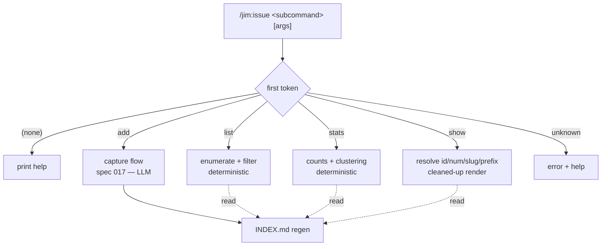

# 019 Issue Command Consolidation — subcommand surface

## Overview

Collapses the two issue commands (`/jim:issue` capture, `/jim:issues` view) into a single `/jim:issue` with explicit subcommands — `add`, `list`, `stats`, `show`, and bare-help — and adds a stable, human-typeable display ordinal so issues can be referenced by number. The LLM-analytical `trends` view and its cache are deliberately deferred to a follow-on spec.

## Problem Statement

Issue tracking today exposes two sibling commands whose names differ by one letter (`/jim:issue` vs `/jim:issues`), which is easy to confuse and gives no room to grow the read surface. Worse, the only way to reference a specific issue is its date-prefixed slug (`20260603-auth-middleware-swallow-401`) — a long string a developer must copy-paste rather than type, which makes inspecting a single issue (`show`) clumsy. As a collection grows to dozens or hundreds of issues, developers need a clean, discoverable command surface for *viewing and making sense of* the collection — listing, filtering, and pulling up one issue quickly — not just capturing into it. The current two-command shape can't carry that without becoming a confusing sprawl of near-identical command names.

## User Stories

- As a developer, I can run `/jim:issue` with no argument and see the list of available subcommands, so that the issue surface is self-documenting and I don't have to remember two near-identical command names.
- As a developer, I can run `/jim:issue add <subject>` to capture a discovery exactly as `/jim:issue` does today, so that capture is now an explicit, unambiguous verb rather than free-text that collides with the new subcommands.
- As a developer, I can run `/jim:issue list` (optionally filtered by status or priority) to see a terse, grouped enumeration of the collection, so that I can scan what exists at a glance.
- As a developer, I can run `/jim:issue stats` to see counts and clustering over the collection, so that I get the at-a-glance summary the old `/jim:issues` trend view provided.
- As a developer, I can run `/jim:issue show 106` (or by slug / prefix / full id) to pull up a single issue in a readable form, so that referencing one issue is as easy as typing a short number.

## Acceptance Criteria

**Command consolidation & dispatch**

- [ ] `/jim:issue` becomes a single command that dispatches on its first token (the subcommand). The separate `/jim:issues` command is removed.
- [ ] `/jim:issue` invoked with no argument prints help: the list of subcommands (`add`, `list`, `stats`, `show`) with a one-line description of each.
- [ ] An unrecognized first token (e.g. `/jim:issue frobnicate`) produces an error message and the help listing — it does **not** fall through to capture. Capture happens only via the explicit `add` verb.
- [ ] All references to `/jim:issues` elsewhere in the workflow — specifically the end-of-phase candidate-batch "review later" pointer inlined across the seven surfacing skills (spec 018) — are updated to point at the new view entry point (`/jim:issue list`). *External Constraint — sourced from `docs/specs/issue/002-issue-tracking-workflow-integration/plan.md` (batch protocol POSTCONDITIONS / summary lines).*

**Capture (`add`)**

- [ ] `/jim:issue add <subject>` performs the capture flow unchanged from spec 017: draft from conversation context, present the single confirm-or-edit moment with the sensitive-content scrub reminder, write the issue file on approval, and regenerate `INDEX.md`. *External Constraint — sourced from `docs/specs/issue/001-issue-tracking/spec.md` AC-C1 through AC-C7, AC-C2, and AC-I2.*
- [ ] Capturing without the `add` verb (the former bare `/jim:issue <subject>` form) no longer creates an issue — it is interpreted as subcommand dispatch per the rules above.

**Display ordinal (`num`)**

- [ ] Each issue carries a sequential display ordinal, assigned at creation, that ascends with creation order across the collection.
- [ ] The ordinal is **display-only**: it is never used in `relations:` or `[[wikilinks]]`. The stable cross-reference key remains the existing date-prefixed id/slug, so a duplicate ordinal can never break a relation edge. *External Constraint — sourced from `docs/specs/issue/001-issue-tracking/spec.md` AC-C5 (typed relations key off the id/slug).*
- [ ] A duplicate ordinal (possible when two branches assign independently) is non-fatal: it only makes a number ambiguous at lookup time (see `show`), and never blocks a write, an index regeneration, or a render.
- [ ] Existing issues that predate the ordinal are backfilled once: each issue lacking an ordinal is assigned one by created-date order, written into its frontmatter, preserving all other file content. The backfill is idempotent (issues that already have an ordinal are untouched).

**View — `show`**

- [ ] `/jim:issue show <id>` renders a single issue in a cleaned-up, readable form (its metadata as a header block, the body, and its relations) — not a raw file dump.
- [ ] `show` accepts any of: the display ordinal (a number), the bare slug, a unique slug prefix, or the full date-prefixed id. A pure-integer argument is resolved as an ordinal; otherwise resolution tries exact id, then exact slug, then unique prefix.
- [ ] When the argument is ambiguous (a duplicated ordinal, or a prefix matching more than one issue), `show` lists the matching issues and asks the developer to disambiguate rather than guessing.
- [ ] When the argument resolves to nothing, `show` reports that no issue matched.
- [ ] `show` resolves its argument **only against the set of existing issues** (matching a known ordinal, slug, prefix, or id). An argument that matches no existing issue returns "no match"; `show` never reads or renders a file outside the issues directory, and any path-shaped input is rejected per the slug-normalization rule. *External Constraint — sourced from `security.md` Finding 1 and `docs/specs/issue/001-issue-tracking/spec.md` AC-C7.*

**View — `list`**

- [ ] `/jim:issue list` renders a terse enumeration of the collection. By default it is grouped by status, sorted by date within each group, and includes the display ordinal.
- [ ] `/jim:issue list <status>` (e.g. `open`, `closed`) or `/jim:issue list <priority>` (e.g. `high`) filters the enumeration to that facet. The two value sets are disjoint, so a single positional argument selects the intended facet unambiguously.
- [ ] The default `list` view — its grouping, sort, and displayed columns — is configurable per project via jim's standard config mechanism; an explicit filter argument overrides the configured default for that invocation. *External Constraint — sourced from `ARCHITECTURE.md` § Plugin Conventions → Scripting Layer (jimconf key convention).*
- [ ] `list` validates its filter argument against the known status and priority value sets; an unrecognized filter (and an unrecognized configured column value) yields a clear error rather than being passed into a pattern matcher. *External Constraint — sourced from `security.md` Finding 3.*

**View — `stats`**

- [ ] `/jim:issue stats` renders deterministic summary counts (open vs closed, counts by priority, by label, and by origin) plus the blocking view (issues ranked by outgoing `blocks` out-degree) — the information the spec 017 `/jim:issues` trend view provided. *External Constraint — sourced from `docs/specs/issue/001-issue-tracking/spec.md` AC-R1, AC-R2.*

**Read-only guarantee**

- [ ] `list`, `stats`, `show`, and help do not mutate issue-file content. The only write a read verb performs is defensive `INDEX.md` regeneration. (The one-shot ordinal backfill — which only *adds* the `num` field — is a separate, out-of-band migration, not part of the read-verb flow.)
- [ ] The `list`, `stats`, and `show` views render deterministically and never interpret instructions embedded in issue content. If any view is rendered via the LLM rather than deterministically, issue content is wrapped in the `<untrusted-issue-content>` marker and the model is instructed to ignore embedded directives. *External Constraint — sourced from `security.md` Finding 2 and `docs/specs/issue/001-issue-tracking/spec.md` AC-S2.*

## UI Mockup

```
> /jim:issue
jim issue — capture & review discovery artifacts

  add <subject>           capture a new issue from the conversation
  list [status|priority]  terse list, grouped by status (default)
  stats                   counts + clustering
  show <id>               view a single issue

  Issues live in docs/issues/. Close one by editing its `status:` field.

> /jim:issue list
Issues — docs/issues/   (47 open · 12 closed)

open (47)
  #106  2026-06-03  critical  credential-leak-log-trace
  #105  2026-06-03  high      auth-middleware-swallow-401
  #103  2026-06-01  medium    csrf-token-rotation
  …
closed (12)
  #91   2026-05-28  high      session-fixation-vector
  …

> /jim:issue show 106            # also: show cred  |  show 20260603-credential-leak-log-trace
┌─ #106 · 20260603-credential-leak-log-trace ─────────────────┐
│ status   open            priority  critical                  │
│ labels   auth, security                                      │
│ origin   docs/specs/sdlc/013-sec/                             │
│ created  2026-06-03      updated   2026-06-03                │
│ relations                                                    │
│   blocks → csrf-token-rotation, rate-limit-exhaustion        │
└─────────────────────────────────────────────────────────────┘

## Description
…issue body…

> /jim:issue stats
Issue Collection — docs/issues/

  Open: 47    Closed: 12

  By priority      By label                By origin
    critical   2     auth         9          docs/specs/sdlc/013-sec/   5
    high      11     middleware   6          (unattributed)           18
    …

  Blocking (top by out-degree)
    credential-leak-log-trace      blocks 4
```

## Data Flow



## Out of Scope

- **LLM-analytical `trends` view.** The pressure-as-convergence analysis (detecting issues that semantically converge on a latent load-bearing capability), its sequencing/prioritization prose, the analysis cache + delta-integration, and the tier-1 graph-isolation "parallel-work candidates" hint — all deferred to a follow-on spec (planned 020). This spec ships only the deterministic read surface.
- **Lifecycle mutation verbs.** `close`, `open`, `edit` as subcommands — out. Issues are still closed/edited by direct file edit, per spec 017. This spec is viewing/sense-making plus the existing capture, not lifecycle management.
- **Collision-scheme change to the filename/id.** Swapping the coarse `YYYYMMDD` prefix for a date+random suffix is tracked separately (`docs/issues/20260603-replace-coarse-date-prefix-with-date-random-suffix-for-collision.md`). The date+slug reference key is unchanged here.
- **Codebase-aware implementation-independence analysis.** Tracked separately (`docs/issues/20260603-codebase-aware-implementation-independence-analysis-for-parallel.md`); its own future spec.
- **Deprecation alias for `/jim:issues`.** The old command is hard-removed, not aliased.
- **3rd-party backends, cross-project federation, full lifecycle states.** Unchanged from spec 017 § Out of Scope.

## Research & Architecture Handoff

*Implementation insights surfaced during scoping. These are context for the architect — not requirements, not exclusions. Treat each as a starting point to evaluate, not a directive.*

### Insight 1: Deterministic read verbs as a script dispatcher

- **Relates to AC:** *"`/jim:issue` … dispatches on its first token"* and the `list` / `stats` / `show` / help ACs.
- **Surfaced as:** grow `render.sh` into a subcommand `case` (mirroring `skills/file/scripts/jimfile.sh`), with the SKILL.md branching only `add` out to the LLM capture path.
- **Levelled-up requirement (already in the ACs):** a single `/jim:issue` command with deterministic read verbs and one LLM verb.
- **Deflection reason:** Delegation — script structure is an implementation choice.
- **Architect note:** The deterministic verbs (`list`/`stats`/`show`/help) fit jim's Bash-vs-Prompt rule (deterministic transforms over `INDEX.md`); `add` stays prompt-side. Weigh extending the existing `render.sh` vs. introducing a new dispatcher script.
- **Routing hint:** Architect to decide.

### Insight 2: Display-ordinal assignment mechanism

- **Relates to AC:** the `num` ordinal ACs (sequential, assigned at creation, duplicates non-fatal).
- **Surfaced as:** `num = max(existing ordinal across collection) + 1`, a decentralized scan at `add` time — no central counter file (consistent with "duplicates are harmless").
- **Levelled-up requirement (already in the ACs):** a sequential display ordinal that ascends with creation and never breaks references when duplicated.
- **Deflection reason:** Delegation — assignment algorithm and where it lives (`jimfile.sh` vs `index.sh` vs the capture flow) are implementation choices.
- **Architect note:** A max+1 scan reads `num:` frontmatter only; decide the owning script and how it interacts with the one-shot backfill. A counter file was rejected (merge-conflict-prone; ambiguity was accepted instead).
- **Routing hint:** Architect to decide.

### Insight 3: Script location after `/jim:issues` removal

- **Relates to AC:** *"The separate `/jim:issues` command is removed."*
- **Surfaced as:** `index.sh` + `render.sh` live under `skills/issues/scripts/`; removing the `issues` skill invites relocating them under `skills/issue/scripts/`.
- **Levelled-up requirement (already in the ACs):** the consolidated command and its scripts are coherent after removal.
- **Deflection reason:** Delegation — file layout is an implementation choice with a known ripple.
- **Architect note:** Relocation touches the `${CLAUDE_PLUGIN_ROOT}/skills/issues/scripts/index.sh` references inlined in all seven 018 batch protocols plus `/jim:issue`'s own write path; leaving the scripts in place (a `scripts/` dir without a SKILL.md) avoids that churn but is less tidy. Weigh tidiness vs. reference churn.
- **Routing hint:** Architect to decide.

### Insight 4: Granular `list`-view config keys

- **Relates to AC:** *"The default `list` view … is configurable per project."*
- **Surfaced as:** three jimconf keys — grouping, sort, columns (e.g. `issue_list_group`, `issue_list_sort`, `issue_list_cols`).
- **Levelled-up requirement (already in the ACs):** a configurable default `list` view with per-invocation override.
- **Deflection reason:** Constraint-Sourcing — exact key names/values follow the jimconf convention, which the architect formalizes.
- **Architect note:** Define the keys, their allowed values, and defaults (group=status, sort=date, cols include the ordinal) per the `jimconf.sh` `resolve()` dispatch convention; add to `jimconf.toml.example` and the config tests.
- **Routing hint:** Candidate constraint pending sourcing.

### Insight 5: Cleaned-up `show` rendering

- **Relates to AC:** *"`show` … renders … a cleaned-up, readable form … not a raw file dump."*
- **Surfaced as:** a header box for metadata + body + resolved relation links.
- **Levelled-up requirement (already in the ACs):** a readable single-issue view.
- **Deflection reason:** Delegation — presentation format is an implementation choice.
- **Architect note:** Likely deterministic (bash) rendering, keeping `show` out of the LLM path; resolving relation targets to their slugs uses the `INDEX.md` graph already built by `index.sh`.
- **Routing hint:** Architect to decide.

## Open Questions

- [ ] **Numeric-slug edge.** An issue whose slug is purely numeric (e.g. titled "401") collides with ordinal addressing in `show`, since a pure-integer argument resolves as an ordinal. Proposed resolution: pure-int always means ordinal; reach a numeric-slug issue via its full id or a non-numeric prefix. Confirm this is acceptable, or define an escape (e.g. a `slug:` qualifier).
- [ ] **Backfill trigger & visibility.** Should the one-shot ordinal backfill run automatically the first time a verb needs ordinals, or be a one-time explicit action? Should it announce itself (it writes to existing files, which the developer then commits as housekeeping)? Plan-level decision.
