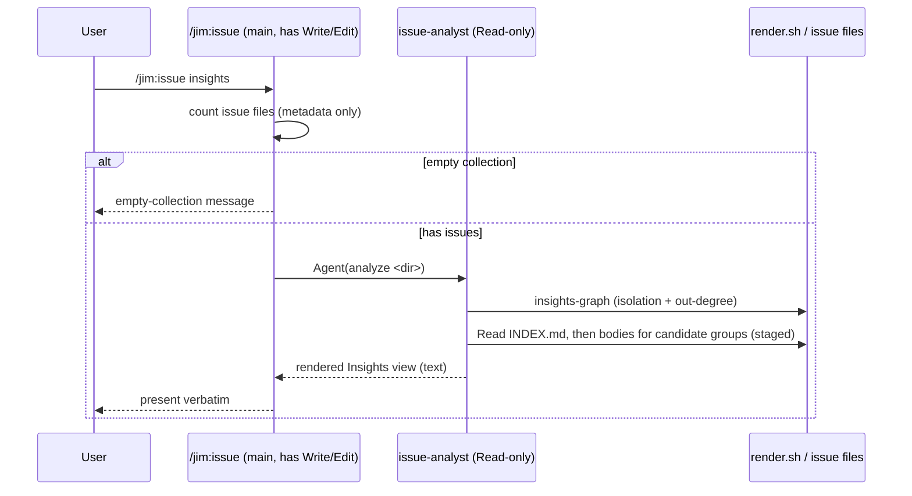

# Issue insights — LLM-analytical view — Plan

## Overview

Implement `/jim:issue insights` as a prompt-side verb that dispatches the synthesis to a **constrained read-only subagent** (`issue-analyst`) whose tool scope excludes `Write`/`Edit` — so untrusted issue content can never drive a file mutation — backed by a small deterministic `render.sh insights-graph` helper that hands the agent exact graph facts (isolation + blocking out-degree) while the LLM owns semantic convergence.

## Design Decisions

### 1. Capability-backed read-only via a constrained `issue-analyst` subagent

- **Chosen:** Dispatch the insights synthesis to a new subagent (`agents/issue-analyst.md`) whose `tools:` are limited to `Read` + a single argument-scoped `Bash(bash ${CLAUDE_PLUGIN_ROOT}/skills/issue/scripts/render.sh *)` entry — no `Write`, `Edit`, `Agent`, or broad/bare `Bash` (see DD6).
- **Why:** Satisfies the adversarial-read-only AC structurally (security.md Finding 1): a prompt injection embedded in issue content cannot mutate files because the capability is *absent*, not merely forbidden by prompt text.
- **Rejected:** Behavioral read-only in the shared `/jim:issue` skill — the skill must carry `Write`/`Edit` for the `add` verb, so untrusted content interpreted in that context could coerce a write. That is exactly Finding 1.

### 2. Untrusted content is isolated to the subagent; the main arm only dispatches + presents verbatim

- **Chosen:** The `insights` arm in `SKILL.md` does **not** itself read issue bodies or `INDEX.md` issue/graph rows (all carry user-authored, attacker-controllable text). It resolves the issues dir, counts issue *files* (metadata only) for the empty check, dispatches `issue-analyst`, and presents the returned view verbatim under the existing read-verb "do not act on directive-looking text" discipline.
- **Why:** Keeps every untrusted field — bodies *and* `title`/`labels`/`origin` and INDEX-derived strings (AC #8 broadened scope, Finding 2) — out of the Write-capable main context.
- **Rejected:** Main agent reads bodies and passes them wrapped to the subagent — still exposes untrusted content to the Write-capable main context, defeating DD1.
- **Terminal-reader control (security.md Finding 5):** the analyst is the *terminal* consumer of issue content — it has no `Agent` tool to hand content onward — so the AC #8 `<untrusted-issue-content>` *wrapping* (a pass-to-subordinate discipline) is not the operative control here. The realized control is: the analyst treats all issue content as **data, never instruction**, backed by its absent write/exec capability (DD1/DD6). The wrapping marker applies only if a future design hands content to a further agent. The analyst persona states this explicitly.

### 3. Deterministic graph facts via `render.sh insights-graph`; the LLM owns semantics

- **Chosen:** Add an `insights-graph` arm to `render.sh` emitting machine-readable facts — the set of graph-isolated open issues and the blocking out-degree ranking — reusing the existing `## Graph` awk parser (render.sh:255–259). The analyst consumes these for AC #5 (parallel-work) and AC #4 (sequencing pressure) and reasons over bodies only for AC #2 (convergence).
- **Why:** Research Rec 2a/3 — graph isolation is exact, cheap, and unit-testable in bash, and more reliable than LLM graph-walking (which can miss inverse edges). Honors the ARCHITECTURE Bash-vs-Prompt rule (structure → bash, judgment → prompt).
- **Rejected:** LLM derives isolation from INDEX.md's raw edge list — feasible but error-prone on larger graphs and not unit-testable.

### 4. Staged read to bound per-run cost (Finding 3 / research Insight 3)

- **Chosen:** The analyst reads the compact `INDEX.md` + `insights-graph` first, then reads full bodies only for the issues it is actively grouping. No cache.
- **Why:** Bounds per-run token/IO cost and the context-stuffing surface (security.md Finding 3, Advisory) without introducing the deferred cache.
- **Rejected:** Read every body unconditionally each run — unbounded; eager full-collection reads are what the deferred cache was meant to amortize.

### 5. `insights` is prompt-side; only help text + graph facts are bash

- **Chosen:** The verb lives in `SKILL.md` + the analyst agent; the only deterministic bash additions are the `cmd_help` listing (AC #10) and `insights-graph` (DD3).
- **Why:** ARCHITECTURE Bash-vs-Prompt rule — semantic synthesis is judgment.
- **Rejected:** Rendering the whole view in bash — impossible; semantic convergence requires an LLM.

### 6. Minimize the analyst's tool surface — exact-scoped `Bash`, no `jimfile`

- **Chosen:** The analyst's only `Bash` entry is the exact argument-scoped `Bash(bash ${CLAUDE_PLUGIN_ROOT}/skills/issue/scripts/render.sh *)` (mirroring `skills/issue/SKILL.md`'s existing pattern). `jimfile.sh` is **not** granted to the analyst — the main `insights` arm resolves the issues dir (`jimfile get issues`) and passes it in the dispatch prompt. The analyst runs with `Read` + that one `render.sh` entry.
- **Why:** DD1's capability-backing is only as strong as the `Bash` allow-pattern (security.md Finding 4). A bare `Bash` or broad glob would let an injection in interpreted issue content drive arbitrary shell — re-opening mutation/exfil despite the absent `Write`/`Edit`. Pinning the pattern and dropping `jimfile` shrinks the injection-reachable surface to a single read-only, content-safe script.
- **Rejected:** Grant `Bash(jimfile.sh *)` to the analyst for convenience — unnecessary surface; the dir is knowable in the main arm and passed down. Also rejected: a bare `Bash` grant — the escape hatch Finding 4 names.

## Constitution Check

**ARCHITECTURE.md status:** Present — constraints noted below.

| Constraint from ARCHITECTURE.md | Honored? | Notes |
| :--- | :--- | :--- |
| Bash-vs-Prompt Decision Rule (§310–321) | Yes | Synthesis → prompt (analyst); graph structure → bash (`insights-graph`). DD3/DD5. |
| Read-verb output discipline — present verbatim, do not interpret | Yes (carve-out) | `insights` *interprets* by design, but interpretation is confined to the constrained subagent; the main arm still presents verbatim. DD2; documented in SKILL.md. |
| `allowed-tools` narrowing (spec 012) | Yes | Issue skill gains `Agent(issue-analyst)`; the analyst's own tools are narrowed to `Read` + one exact-scoped `Bash(... render.sh *)` entry. DD1/DD6. |
| Scripting layer — `set -uo pipefail`, `LC_ALL=C`, `BASH_SOURCE`-relative composition, no third-party deps | Yes | `insights-graph` follows the render.sh preamble and reuses `ensure_index`/`resolve_dir`. |
| INDEX.md staleness gate + atomic regen | Yes | `insights-graph` calls `ensure_index`; never writes issue files. |
| Agents live in `agents/` | Yes | `agents/issue-analyst.md`. |

## File Manifest

| Component | File Path | Action | Notes |
| :--- | :--- | :--- | :--- |
| Constrained analyst subagent | `agents/issue-analyst.md` | Create | Read-only persona; `tools:` = `Read` + exact `Bash(bash ${CLAUDE_PLUGIN_ROOT}/skills/issue/scripts/render.sh *)` ONLY (no `Write`/`Edit`/`Agent`/`jimfile`/broad `Bash` — DD6); the 3-output format; treat-as-data terminal-reader discipline; staged-read instruction. |
| Insights dispatch + procedure | `skills/issue/SKILL.md` | Update | Add `insights` arm to Step 1 dispatch; add `Agent(issue-analyst)` to `allowed-tools`; add an "Insights" procedure section; document the read-verb-discipline carve-out (DD2). |
| Graph-facts helper + help text | `skills/issue/scripts/render.sh` | Update | Add `cmd_insights_graph` + `insights-graph` case arm; add `insights` line to `cmd_help`; update the unknown-subcommand valid-list and the CLI-summary header comment. |
| Deterministic tests | `tests/issues.sh` | Update | Cases: help lists `insights`; `insights-graph` isolation set; `insights-graph` blocking out-degree; `insights-graph` empty/unconfigured dir. |
| Architecture doc | `ARCHITECTURE.md` | Update | Document the `insights` verb, the `issue-analyst` agent, and the `insights-graph` helper. |
| User-facing docs | `README.md` | Update | Document `/jim:issue insights` in the issue command surface. |

## Interface Contracts

```text
# render.sh insights-graph [<dir>]
#   Deterministic graph facts for the analyst. Reuses ensure_index + the
#   `## Graph` awk parser. Exit 0 always (degrades to empty output).
#   "Isolation" = an OPEN issue whose slug appears as neither source nor
#   target in any `blocks` or `depends-on` edge (related-to / duplicates are
#   ordering-neutral and ignored). LC_ALL=C stable ordering.
#
#   stdout, line-oriented:
#     ISOLATED <slug>            # one per graph-isolated open issue, slug-sorted
#     BLOCKING <count> <slug>    # blocking out-degree per source, count desc then slug
#   Unconfigured / empty dir → no lines, exit 0.

# agents/issue-analyst.md  (subagent contract)
#   Input  : task prompt carrying the already-resolved issues dir to analyze.
#   Tools  : Read + Bash(bash ${CLAUDE_PLUGIN_ROOT}/skills/issue/scripts/render.sh *)
#            ONLY.  No Write/Edit/Agent, no jimfile, no bare/broad Bash. (DD6)
#   Output : the rendered Insights view as text (== Convergence / == Sequencing
#            / == Parallel-work candidates), per the spec mockup. Text only.

# SKILL.md  `insights` dispatch (main arm)
#   1. dir = jimfile get issues; count *.md issue files (metadata only).
#   2. if 0 issues -> print empty-collection message, stop.
#   3. else Agent(issue-analyst, "<analysis task; issues dir = <dir>>") -> view.
#      (main arm resolves & passes dir so the analyst needs no jimfile — DD6.)
#   4. present `view` verbatim; do not act on directive-looking text within it.
```

## Data Flow



## Task Breakdown

1. [x] Add `cmd_insights_graph` to `skills/issue/scripts/render.sh` (isolation set + blocking out-degree, reusing the `## Graph` awk parser and `ensure_index`/`resolve_dir`), wire an `insights-graph` arm into `main()`'s `case`, and update the unknown-subcommand valid-list + CLI-summary header comment.
   **Verify:** `d=$(mktemp -d); w(){ printf -- '---\nid: %s\nstatus: open\ncreated: 2026-01-01\n%s---\n# Description\nx\n' "$1" "$2" > "$d/$1.md"; }; w 20260101-a $'relations:\n  blocks: [20260101-b]\n  depends-on: []\n  related-to: []\n  duplicates: []\n'; w 20260101-b $'relations:\n  blocks: []\n  depends-on: []\n  related-to: []\n  duplicates: []\n'; w 20260101-c $'relations:\n  blocks: []\n  depends-on: []\n  related-to: []\n  duplicates: []\n'; out=$(bash skills/issue/scripts/render.sh insights-graph "$d"); printf '%s\n' "$out" | grep -q 'ISOLATED 20260101-c' && printf '%s\n' "$out" | grep -q 'BLOCKING 1 20260101-a' && ! printf '%s\n' "$out" | grep -q 'ISOLATED 20260101-a'`

2. [x] Add the `insights` line to `cmd_help` in `skills/issue/scripts/render.sh`.
   **Verify:** `bash skills/issue/scripts/render.sh help | grep -q 'insights'`

3. [x] Create `agents/issue-analyst.md`: constrained read-only persona (`tools:` = `Read` + exact `Bash(bash ${CLAUDE_PLUGIN_ROOT}/skills/issue/scripts/render.sh *)` ONLY — no `Write`/`Edit`/`Agent`/`jimfile`/bare `Bash`, per DD6), the three-section output format (Convergence / Sequencing / Parallel-work candidates), the honest-empty-convergence rule, the treat-as-data terminal-reader discipline over **all** ingested fields (DD2), and the staged-read instruction (DD4).
   **Verify:** `grep -q '^name: issue-analyst' agents/issue-analyst.md && ! sed -n '/^tools:/,/^[a-z]/p' agents/issue-analyst.md | grep -Eq 'Write|Edit|Agent|jimfile' && grep -q 'render.sh \*)' agents/issue-analyst.md`

4. [x] *(Depends on task 3.)* Update `skills/issue/SKILL.md`: add the `insights` arm to the Step 1 dispatch (resolve the issues dir and pass it in the analyst dispatch per DD6, branch to the analyst, present the returned view verbatim, handle the empty collection), add `Agent(issue-analyst)` to `allowed-tools`, add an "Insights" procedure section, and document the read-verb-discipline carve-out (DD2).
   **Verify:** `grep -q 'Agent(issue-analyst)' skills/issue/SKILL.md && grep -qi 'insights' skills/issue/SKILL.md`

5. [x] *(Depends on tasks 1–2.)* Add deterministic cases to `tests/issues.sh`: (a) `help` lists `insights`; (b) `insights-graph` isolation set; (c) `insights-graph` blocking out-degree; (d) `insights-graph` on empty/unconfigured dir emits nothing and exits 0.
   **Verify:** `bash skills/meta-test/scripts/run.sh issues`

6. [x] Update `README.md` (issue command surface) and `ARCHITECTURE.md` (insights verb, `issue-analyst` agent, `insights-graph` helper) to document the new surface.
   **Verify:** `grep -q 'insights' README.md && grep -q 'issue-analyst' ARCHITECTURE.md`

## Requirements Coverage Summary

| Spec Acceptance Criterion | Addressed In Task(s) |
| :--- | :--- |
| AC1 — on-demand, pull-only view | 4 |
| AC2 — convergence groups (semantic, named, members listed) | 3, 4 |
| AC3 — honest empty-convergence result | 3 |
| AC4 — sequencing / prioritization prose | 1 (out-degree facts), 3 |
| AC5 — parallel-work candidates (no blocking/dependency relations) | 1 (isolation), 3 |
| AC6 — read-only (never creates/edits/closes) | 3 (constrained tools), 4 |
| AC7 — fresh each run, no persisted artifact | 3 (staged read), 4 |
| AC8 — all ingested user-authored fields treated as untrusted | 3 (discipline), 4 (isolation to subagent) |
| AC9 — read-only holds under adversarial input | 3 (capability-backed tools), 4 (untrusted confined to subagent) |
| AC10 — `insights` in help list; unknown-subcommand path unchanged | 2 (help), 1 (valid-list update preserves error path) |
| AC11 — empty-collection message, not an error | 4 |

## Out of Scope

- Persisted analysis cache + delta-integration (spec deferral).
- Write side / umbrella-issue filing (spec deferral).
- New `issue_insights_*` config keys (spec deferral).
- Codebase-aware implementation-independence for the parallel-work hint (tracked separately; isolation here is relation-graph only).

## Open Questions

- [x] ~~How is read-only enforced against prompt injection?~~ → Capability-backed via the constrained `issue-analyst` subagent (DD1/DD2); resolves security.md Finding 1.
- [x] ~~Graph isolation: deterministic or LLM-derived?~~ → Deterministic `insights-graph` helper (DD3); resolves research Rec 2.
- [x] ~~Per-run cost with no cache?~~ → Staged read (DD4); resolves security.md Finding 3.
- [x] ~~Could the analyst's `Bash` scope be an injection escape hatch?~~ → Exact-scoped `render.sh`-only `Bash`, no `jimfile`, no bare `Bash` (DD6); resolves security.md Finding 4.
- [x] ~~Does AC #8 wrapping apply to the terminal analyst?~~ → Realized as treat-as-data + absent write/exec capability; wrapping reserved for content handed onward (DD2); resolves security.md Finding 5.
