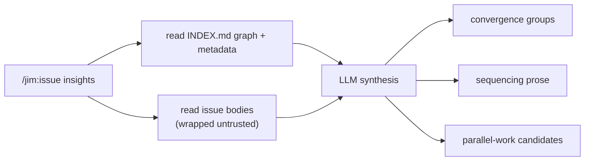

# 020 Issue insights — LLM-analytical view

## Overview
Adds the deferred `insights` verb to `/jim:issue` — a pull-only, read-only LLM-analytical view that reads across issue *bodies* to surface semantic convergence on latent capabilities, a sequencing recommendation, and parallel-work candidates. It is the second prompt-side verb (alongside `add`), layering meaning-level synthesis on top of spec 019's deterministic `stats`.

## Problem Statement
After spec 019, `/jim:issue` offers deterministic read views: `list` enumerates, `stats` counts and clusters by origin/label and ranks blocking by out-degree. But those views cluster on *metadata*, not *meaning*. A developer staring at twenty issues still can't see that four of them are symptoms of one missing capability, can't tell what order relieves the most pressure, and can't tell which issues are safe to pick up in parallel. That sense-making requires reading and reasoning across issue bodies — exactly what a bash-rendered view cannot do. The result is that a growing collection becomes harder to act on, not easier, even with the deterministic views in hand.

## User Stories
- As a developer triaging a growing issue collection, I can run `/jim:issue insights` to see which issues are symptoms of one underlying missing capability, so that I can fix the root cause instead of chasing each symptom.
- As a developer planning my next work, I can see a recommended order of attack and a set of safely-parallelizable issues, so that I can decide what to tackle first and what I can hand off concurrently.

## Acceptance Criteria
- [ ] `/jim:issue insights` produces an on-demand analytical view over the current issue collection. It is pull-only — never invoked proactively — consistent with the existing read verbs.
- [ ] The view identifies **convergence groups**: sets of issues that semantically point at a single latent, load-bearing capability. Each group names that underlying capability and lists its member issues by `#num` and slug. This goes beyond the by-origin / by-label clustering `stats` already provides — it groups by what each issue is actually about, not by how it is tagged.
- [ ] When no genuine convergence exists across the collection, the view says so plainly rather than manufacturing groups (honest empty result, mirroring jim's candidate-batch "empty batches are normal" discipline).
- [ ] The view includes a **sequencing / prioritization** recommendation in prose: what to tackle first and why (e.g., blocking pressure, cluster size, convergence on a shared capability).
- [ ] The view surfaces **parallel-work candidates**: issues that carry no blocking or dependency relations to other open issues, and can therefore be worked concurrently without ordering conflicts.
- [ ] `insights` is read-only: it never creates, edits, or closes an issue file, consistent with `list` / `stats` / `show`. Filing any follow-up (e.g., an umbrella issue for a detected latent capability) remains the developer's action via `/jim:issue add`.
- [ ] Each `insights` run analyzes the collection fresh — the view reflects the state of the issue collection at invocation time, with no persisted analysis artifact written.
- [ ] When user-authored issue content is read into the analysis — bodies, and the `title` / `labels` / `origin` frontmatter plus the `INDEX.md`-derived strings built from them — it is treated as untrusted: wrapped in the `<untrusted-issue-content>` structural marker, with the analysis not following instructions embedded in any of it. *External Constraint — sourced from `docs/specs/issue/001-issue-tracking/spec.md` AC-S2 and `skills/issue/SKILL.md` Step 7.*
- [ ] The read-only property holds under adversarial input: even when an issue's content contains directives to create, modify, or delete issues, running `insights` makes no change to any issue file.
- [ ] `insights` appears in the `/jim:issue` help subcommand list, and the existing unknown-subcommand error path is unchanged.
- [ ] When the collection is empty, `insights` reports an empty-collection message rather than erroring.

## UI Mockup
```
> /jim:issue insights

Issue Insights — docs/issues/   (22 open · 22 analyzed)

== Convergence ==

  ▸ Upstream token expiry is unowned                      [4 issues]
    The 401-swallow, session-fixation, token-rotation, and
    rate-limit issues all bottom out in the same gap: nothing
    owns validating and refreshing the upstream token. Fixing
    that capability dissolves all four.
      - #14  20260528-credential-leak-log-trace
      - #11  20260527-session-fixation-vector
      - #9   20260526-csrf-token-rotation
      - #7   20260525-rate-limit-exhaustion

  ▸ Index regen has no concurrency story                  [2 issues]
    Two issues describe INDEX.md races under parallel writes;
    both want a single serialization point.
      - #19  20260602-index-regen-race
      - #5   20260524-concurrent-add-clobber

== Sequencing ==

  Start with the token-expiry cluster — highest blocking pressure
  (#14 blocks 4) and it unblocks the whole auth surface. The
  index-concurrency cluster is lower pressure; defer it until the
  auth work lands.

== Parallel-work candidates ==

  No blocking/dependency edges — safe to pick up concurrently
  without ordering conflicts:
    - #3   20260524-readme-typo-pass
    - #18  20260601-config-key-docs
```

## Data Flow


## Out of Scope
- **Persisted analysis cache + delta-integration.** Deferred. Each run re-derives from the collection fresh; caching the analysis and re-analyzing only the changed delta becomes its own optimization spec once the output shape is proven in use.
- **Write side / umbrella-issue filing.** `insights` is read-only. It does not propose-and-file an issue for a detected latent capability; filing stays a developer action via `/jim:issue add`.
- **Changes to `stats`.** The deterministic clustering (origin/label) and blocking (out-degree) view is unchanged. `insights` layers on top; it does not replace or absorb `stats`.
- **Frequency-over-time and provenance-ratio trends.** Per the 017 brainstorm, these are explicitly not the target.
- **Proactive / push surfacing.** Pull only — `insights` is never auto-invoked by other skills or mid-conversation.
- **Codebase-aware implementation-independence analysis** for the parallel-work hint. Tracked separately (`docs/issues/20260603-codebase-aware-implementation-independence-analysis-for-parallel.md`); its own future spec. Here, "parallel-work candidate" means relation-graph isolation only, not a code-level independence proof.
- **Interactive / graph UI.** Text-only, unchanged from spec 017.
- **Config knobs for the insights view.** No new `issue_insights_*` jimconf keys in this spec.

## Research & Architecture Handoff

*Implementation insights surfaced during scoping. These are context for the architect — not requirements, not exclusions. Treat each as a starting point to evaluate, not a directive.*

### Insight 1: `insights` is the second prompt-side verb

- **Relates to AC:** *"`/jim:issue insights` produces an on-demand analytical view"* (AC #1) and the convergence/sequencing/parallel ACs.
- **Surfaced as:** the 019 dispatch already branches `add` to the LLM capture path while `list`/`stats`/`show`/help go to `render.sh`. `insights` is the natural second LLM branch — synthesis, not a deterministic script dump.
- **Levelled-up requirement (already in the ACs):** an analytical view that reasons over issue *meaning*, distinct from `stats`' deterministic metadata clustering.
- **Deflection reason:** Delegation — whether the SKILL.md dispatch grows a new `insights` arm and how the prompt-side analysis is structured is the architect's call.
- **Architect note:** Per the Bash-vs-Prompt rule (ARCHITECTURE.md), semantic synthesis stays prompt-side. Weigh whether any sub-step is deterministic enough to precompute in `index.sh` / `render.sh` (see Insight 2) versus leaving the whole verb in the prompt. The dispatch's read-verb output discipline ("present verbatim, do not interpret") does **not** apply to `insights`, which by design *is* interpretation — keep that distinction explicit in the SKILL.md so the untrusted-content discipline (AC #8) carries the safety boundary instead.
- **Routing hint:** Architect to decide.

### Insight 2: Parallel-work candidates derive from the relation graph

- **Relates to AC:** *"surfaces parallel-work candidates: issues that carry no blocking or dependency relations"* (AC #5).
- **Surfaced as:** the 019 deferral note's "tier-1 graph-isolation parallel-work hint" — graph isolation means a node with no `blocks` / `depends-on` (and inverse) edges in the index Graph.
- **Levelled-up requirement (already in the ACs):** surface issues that can be worked concurrently without ordering conflicts. The user need is "what's safe to parallelize," not "compute graph isolation."
- **Deflection reason:** Delegation — the graph-isolation computation is a mechanism. `INDEX.md` already materializes the relation graph, so isolation may be derivable deterministically and fed to the synthesis rather than re-inferred by the LLM.
- **Architect note:** Decide whether isolation detection is a deterministic precompute (cheap, exact, from `INDEX.md`) handed to the prompt, versus inferred prompt-side. The deterministic route is more reliable for the graph-structural part; the LLM still owns convergence and sequencing.
- **Routing hint:** Architect to decide.

### Insight 3: The analysis reads issue bodies, not just `INDEX.md`

- **Relates to AC:** *"groups by what each issue is actually about"* (AC #2) and the untrusted-content AC (AC #8).
- **Surfaced as:** semantic convergence requires the prose of each issue, which `INDEX.md` does not carry in full — so `insights` reads the issue files' bodies.
- **Levelled-up requirement (already in the ACs):** convergence detection over meaning (AC #2); body content wrapped as untrusted (AC #8).
- **Deflection reason:** Constraint-Sourcing — the wrapping requirement is an External Constraint sourced to 017 AC-S2 / SKILL.md Step 7; the "reads bodies" mechanism is the implementation detail.
- **Architect note:** Reading every body each run is the cost the deferred cache was meant to amortize. With the cache out of scope, weigh how many bodies the verb reads per run and whether the synthesis can be staged (graph/metadata from `INDEX.md` first, bodies only for candidate convergence groups) to keep cost bounded on larger collections.
- **Routing hint:** Architect to decide.

### Insight 4: Capability-back the read-only guarantee

- **Relates to AC:** *"the read-only property holds under adversarial input"* (adversarial-safety AC) and *"`insights` is read-only"* (AC #6).
- **Surfaced as:** security.md Finding 1 — `insights` runs inside the `/jim:issue` skill whose `allowed-tools` grant `Write` / `Edit` (needed by `add`), so a body-borne prompt injection could attempt to drive those tools despite the read-only spec.
- **Levelled-up requirement (already in the ACs):** `insights` makes no file change even under adversarial input; the read-only promise is a property, not a behavior.
- **Deflection reason:** Delegation — *how* to make read-only capability-backed (constrained subagent, a narrowed `allowed-tools` scope for the insights path, or running the synthesis where `Write`/`Edit` are unreachable) is the architect's call.
- **Architect note:** Behavioral read-only ("the prompt says don't write") is weaker than structural read-only (the tool is not available). Because the input is attacker-controlled, prefer removing the capability on the insights path over relying on instruction-following. Compose with the AC #8 untrusted-wrapping as defense in depth.
- **Routing hint:** Architect to decide.

## Open Questions
None — outstanding scope levers (verb name, cache, write-side, view contents) were resolved during the spec interview; security findings ① and ② were folded into the ACs above (③ carried to the plan).
