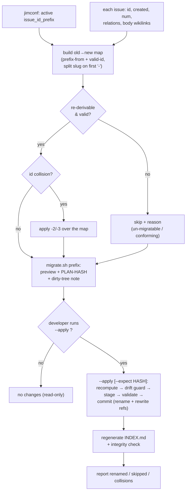

# Re-derive existing issue ids to the active prefix scheme — Plan

## Overview

A new hand-run `skills/issue/scripts/migrate.sh` with a `prefix` subcommand does
all the work — re-derive each id from the issue's own stored data, resolve
collisions, rewrite inbound references, rename files. There is **no verb**:
`migrate.sh prefix` previews (read-only) and `migrate.sh prefix --apply` commits,
so the developer's explicit `--apply` *is* the confirm. Re-derivation reuses the
existing security boundary (`is_valid_id`) and the index's reference-recognition
rules so the rewrite-set equals the index's edge-set.

## Design Decisions

### 1. Command surface — a hand-run `migrate.sh prefix`, no verb

- **Chosen:** a new `skills/issue/scripts/migrate.sh` (sibling to `backfill.sh`) with a `prefix` subcommand; no-arg prints help. `migrate.sh prefix` previews (read-only, dry-run); `migrate.sh prefix --apply` commits. No `/jim:issue` verb — the migration is hand-run like `backfill.sh`, and running `--apply` is the explicit confirmation (AC #8).
- **Why:** changing the prefix scheme is a rare, deliberate maintenance action, so a guided in-chat verb is unwarranted weight. Honest semantics: `backfill.sh` *fills missing data*; this *transforms existing* ids → a distinct `migrate.sh`. Read-only-by-default (`--apply` required to mutate) is the safe gate.
- **Rejected:** a `/jim:issue` verb — adds an LLM-in-the-loop confirm for a once-ever action (and an untrusted-content surface). Rejected: a `backfill.sh` subcommand — "backfill" means fill-missing; renaming + graph-rewriting existing ids is a different operation class and word.

### 2. Re-derive the prefix from stored inputs (`jimfile.sh prefix-from`)

- **Chosen:** a new `prefix-from <created_iso> <num>` subcommand in `jimfile.sh` (beside `resolve_issue_prefix`) that reads the same `issue_id_prefix` / `issue_id_project` config but renders from the issue's **own** stored data: `date` → first 8 digits of `created:` (`YYYYMMDD`); `timestamp` → `created:` with `-`/`:`/`Z` stripped (`YYYYMMDDThhmmss`); `sequential` → `render_template '{seq:NN}' <num>` (clock-independent); `project` → the static tag. For the date/timestamp schemes it first validates `created:` against the canonical `# SYNC(ts-shape)` pattern (spec 022) and reshapes only a conforming value (folds security F6 — calendar validity is not re-checked, consistent with the no-`date -d` constraint; a shape-valid value reshapes as-is, and `is_valid_id` still blocks any traversal); it then validates the rendered prefix via `is_valid_id`. Returns rc 1 + `un-migratable: <reason>` on a genuinely missing **or non-conforming** `created:`, or a custom `{date:FMT}` template (DD 9).
- **Why:** spec Insight 2 / research rec 1 — reuse the one security boundary (`is_valid_id`), render from stored data not the run clock (AC #2/#3). String-reshaping the canonical `created:` (guaranteed ISO-8601 post-022) needs no `date -d` (a non-POSIX GNU extension that breaks the macOS desktop app).
- **Rejected:** parameterizing `resolve_issue_prefix` to call `date -u -d <created>` — non-POSIX, breaks portability (`CLAUDE.md` → bash+POSIX only). Rejected: re-deriving the slug from `title:` — the stored slug ≠ `normalize_slug(title)` (e.g. `20260530-smoke-test` has title "End-to-end smoke test").

### 3. Slug extraction — split the current id on its first `-`

- **Chosen:** `slug = <current_id> after the first '-'`; `old_prefix = before it`. The new id is `<prefix-from>-<slug>`.
- **Why:** every preset prefix is dash-free (`20260530`, `20260530T000000`, `0001`, a dash-free project tag), so the first `-` cleanly delimits prefix from a (dash-containing) slug. Matches the spec's "only the leading prefix segment is re-derived; the slug is carried over."
- **Rejected:** storing the slug as a separate frontmatter field — a schema change, out of scope. (Limitation: a project tag containing a `-` mis-splits — see Open Questions.)

### 4. Full-id validation — validate the assembled id, not just the prefix (folds F1)

- **Chosen:** every candidate id (`prefix` + carried `slug` + any `-2`/`-3` discriminator) is validated as a unit via a new thin `jimfile.sh valid-id <id>` subcommand (rc 0/1) wrapping the existing `is_valid_id`. A candidate that fails (path metacharacter in a hand-edited slug, `..`, >128 chars) is un-migratable — skipped, never written.
- **Why:** security finding F1 — the carried slug is re-validated, not trusted; the guard covers the whole id so a tampered on-disk slug can't escape the issues dir (AC #11).
- **Rejected:** a 4th byte-identical `is_valid_id` copy inside `migrate.sh` — re-derivation is one-shot (not regen-hot), so a subprocess call per id is fine and keeps `is_valid_id` from sprouting a 4th SYNC copy.

### 5. Reference rewrite mirrors the index's recognition (folds F2)

- **Chosen:** `migrate.sh` rewrites references in place with new awk that recognizes references by the **same rules** `index.sh` uses — `parse_relations`' four 2-space-indent buckets and `parse_wikilinks_from_body`' fenced-code/inline-backtick stripping — replacing only exact-id matches at those structured sites, driven by the up-front old→new map. A test asserts the rewrite touches exactly the edges `index.sh` reports.
- **Why:** F2 — rewrite-set must equal the index's edge-set, or a missed link dangles (AC #6) and a stray match corrupts content. An old id legitimately appears in `origin:` paths, prose, and code fences, and is a prefix of longer ids.
- **Rejected:** global `sed s/old/new/` — corrupts `origin:` paths, prose mentions, fenced-code occurrences, and prefix-overlapping ids.

### 6. Read-only preview + `--apply` with drift guard + idempotent retry (folds F5; AC #8/#10)

- **Chosen:** `migrate.sh prefix` builds the full old→new map, prints the preview, and emits a stable `PLAN-HASH`; it mutates nothing. `migrate.sh prefix --apply [--expect <hash>]` recomputes the map fresh (authoritative on current state); if `--expect` is given and the recomputed hash differs, it aborts (rc 3, "collection changed since preview"). Apply stages every final file (new name + rewritten refs) via `mktemp`, validates the staged set, then commits per-file atomic `mv`. The whole operation is idempotent (AC #5), so an interrupted run is completed by a retry — never left permanently inconsistent (AC #10) — and recovery is via the developer's VCS.
- **Why:** F5 — the gap between previewing and `--apply` is a TOCTOU window; the optional `--expect` hash detects drift. Idempotent-retry + per-file atomicity + VCS is the realistic consistency story for a filesystem with no transactions (`backfill.sh` precedent: "a retry completes any unfinished work").
- **Rejected:** trusting a stored plan from preview → apply verbatim — would apply a stale plan to a drifted collection. Rejected: strict cross-file all-or-nothing — no filesystem transaction primitive; idempotent retry achieves the same recoverability.

### 7. Untrusted content + read-only git dirty-tree note (folds F3/F4)

- **Chosen:** issue files are parsed as data by bash (never `source`/`eval`); the preview surfaces only derived tokens (ids, counts, skip reasons), never raw body prose. With no verb, **no LLM ever handles issue content**, so the spec-017/018 prompt-injection surface is absent — AC #12 reduces to the bash parse-as-data discipline. `migrate.sh prefix` also runs a **read-only** `git status` check and prints a note flagging an uncommitted issues collection, since recovery from a mistaken `--apply` is via the developer's VCS (AC #8/F4).
- **Why:** dropping the verb is itself the strongest mitigation for F3. The dirty-tree flag makes the destructive op recoverable without any git writes (Git-ops stays out of scope).
- **Rejected:** staging/committing via git — out of scope; the check is read-only only.

### 8. INDEX regeneration + integrity as the post-run verification (AC #13)

- **Chosen:** `--apply` calls `index.sh` once at the end and surfaces any new Integrity Warnings (bidirectional relations, wikilink validity, origin resolution) as the post-run check.
- **Why:** reuses the existing verification surface; a clean regen proves no new dangling references (AC #6/#13).
- **Rejected:** a bespoke verifier — duplicates `index.sh`'s integrity logic.

### 9. Custom `{date:FMT}` templates are un-migratable

- **Chosen:** re-derivation supports the four presets (date/timestamp/sequential/project) and dash-free literal/`{seq}` custom templates. A custom template containing a `{date:FMT}` token is reported un-migratable (skip + reason).
- **Why:** a general strftime FMT (`%j`, `%U`, weekday names) can't be reshaped from stored components without `date -d` (non-POSIX). AC #2 itself enumerates only the presets, so this is a narrow, honest boundary.
- **Rejected:** a GNU `date -d` path — breaks macOS portability.

## Constitution Check

**ARCHITECTURE.md status:** Present — constraints noted below.

| Constraint from ARCHITECTURE.md | Honored? | Notes |
| :--- | :--- | :--- |
| Bash-vs-Prompt rule (`:313-324`) — deterministic logic in bash, conversational gates in prompt | Yes | `migrate.sh` is fully deterministic bash; there is **no** prompt/verb — the confirm is a manual `--apply`, so no conversational gate exists to misplace. |
| Scripting Layer conventions (`:300-311`) — `set -uo pipefail`, `LC_ALL=C`, dir from `jimconf.sh get issues`, `BASH_SOURCE`-relative paths, never `source`/`eval`, atomic `tmp + mv` | Yes | `migrate.sh` follows all; per-file `mktemp + mv` mirrors `backfill.sh`/`index.sh`. |
| Trust boundary (`:255`) + "slug pipeline is the security boundary — never delegate to the LLM" (`jimfile.sh:645-650`) | Yes | `prefix-from` + `valid-id` are bash; no LLM is in the loop at all (hand-run). |
| `is_valid_id` single source (SYNC discipline, `:300-311`) | Yes | Reused via the new `valid-id` subcommand — no 4th copy added. |
| Issue content is untrusted (spec 017/018) | Yes | Parsed as data; no LLM exposure (no verb); preview emits derived tokens only (DD 7). |
| bash + POSIX only, no third-party deps (`CLAUDE.md`) | Yes | String-reshape avoids `date -d`; no `jq`/`yq` (DD 2, 9). |

## File Manifest

| Component | File Path | Action | Notes |
| :--- | :--- | :--- | :--- |
| Migration script | `skills/issue/scripts/migrate.sh` | Create | No-arg → help; `prefix` (preview) / `prefix --apply` (commit); map builder, reference rewrite, atomic apply. |
| Prefix re-resolver + id validator | `skills/file/scripts/jimfile.sh` | Update | Add `prefix-from <created> <num>` + `valid-id <id>` subcommands. |
| Tests | `tests/issues.sh` | Update | `migrate.sh` preview/apply/rewrite/idempotency/consistency cases + must-not-touch cases. |
| Tests | `tests/jimfile.sh` | Update | `prefix-from` (per scheme + un-migratable) and `valid-id` cases. |
| Architecture | `ARCHITECTURE.md` | Update | Scripting Layer paragraph: `migrate.sh` + the new `jimfile.sh` subcommands. |

## Interface Contracts

```bash
# skills/issue/scripts/migrate.sh
#   bash migrate.sh                                  → help/usage (lists subcommands)
#   bash migrate.sh prefix [<issues_dir>]
#       PREVIEW (read-only). Prints the plan (rename / skip / collision lines + a
#       "N to rename · M to skip · K collisions" summary), a "PLAN-HASH: <hex>"
#       line, and a read-only git dirty-tree / VCS-recovery note. Mutates nothing.
#   bash migrate.sh prefix [<issues_dir>] --apply [--expect <hash>]
#       APPLY. Recompute the map; if --expect is set and differs, abort (rc 3).
#       Else stage → validate → commit (rename + rewrite refs) → regenerate INDEX
#       → report counts. Idempotent: a re-run with nothing to do is a silent no-op.
#   issues_dir default: jimconf.sh get issues
#   exit: 0 ok (incl. no-op) · 1 IO/rename failure · 2 malformed invocation · 3 drift (--expect mismatch)

# Internal per-issue plan record (TAB-separated):
#   <action>\t<old_id>\t<new_id>\t<reason>
#   action ∈ rename | skip-conforming | skip-unmigratable | collision-resolved

# skills/file/scripts/jimfile.sh (new subcommands)
#   bash jimfile.sh prefix-from <created_iso> <num>
#       Echo the active-scheme prefix re-derived from STORED inputs.
#       rc 1 + "un-migratable: <reason>" on missing field / custom {date:} template.
#   bash jimfile.sh valid-id <id>
#       rc 0 if <id> passes is_valid_id (allowlist, <=128, no ".."), else rc 1.
```

## Data Flow



## Task Breakdown

1. [x] Add `jimfile.sh valid-id <id>` subcommand wrapping `is_valid_id` (rc 0/1).
   **Verify:** `bash skills/meta-test/scripts/run.sh jimfile_valid_id` (accepts a good id; rejects `../x`, an empty id, and a 129-char id).

2. [x] Add `prefix-from <created> <num>` subcommand in `jimfile.sh`: validate `created:` against the canonical `# SYNC(ts-shape)` pattern before reshaping (date/timestamp), `render_template` for sequential/project, validate the result via `is_valid_id`; rc 1 + `un-migratable: <reason>` for a missing/non-conforming `created:` or custom `{date:}` template.
   **Verify:** `bash skills/meta-test/scripts/run.sh jimfile_prefix_from` (date→`YYYYMMDD`, timestamp→`YYYYMMDDThhmmss`, sequential→padded `num`, project→tag, missing `created`→un-migratable, non-conforming `created` `2026-06`→un-migratable, `{date:%j}`→un-migratable).

3. [x] Create `skills/issue/scripts/migrate.sh`: no-arg → help; `prefix` preview map builder with helpers (`field_value`, split-on-first-`-` slug) — classify each issue (rename / skip-conforming / skip-unmigratable) via `prefix-from` + `valid-id`, resolve collisions with the `-2`/`-3` convention over the map.
   **Verify:** `bash skills/meta-test/scripts/run.sh migrate_prefix_classifies` (no-arg prints help; `prefix` on a temp fixture yields expected rename/skip/collision rows + summary counts).

4. [x] `migrate.sh prefix` preview output: human plan lines + a stable `PLAN-HASH:` line + a read-only git dirty-tree / VCS-recovery note; mutates nothing.
   **Verify:** `bash skills/meta-test/scripts/run.sh migrate_prefix_preview` (two preview runs on an unchanged fixture emit identical `PLAN-HASH`; the dirty-tree note appears; no files changed).

5. [x] Reference-rewrite engine (awk): rewrite the four `relations:` buckets + fenced-aware body `[[wikilinks]]`, exact-id only, per the old→new map.
   **Verify:** `bash skills/meta-test/scripts/run.sh migrate_rewrite` (rewrites a relation target + a body wikilink; does NOT touch an `origin:` path, a prose mention, a `[[oldid]]` inside a code fence, or a prefix-overlapping longer id).

6. [x] `migrate.sh prefix --apply` (core): stage final files (new name + rewritten refs) via `mktemp`, validate the staged set, commit per-file atomic `mv`, regenerate `INDEX.md`, report counts. Depends on tasks 3 and 5.
   **Verify:** `bash skills/meta-test/scripts/run.sh migrate_apply_core` (renames files + rewrites refs + regenerates INDEX with no new Integrity Warnings).

7. [x] `--apply` guards: idempotent re-run (nothing to do → silent no-op) and the `--expect <hash>` drift guard (recompute; mismatch → exit 3). Depends on task 6.
   **Verify:** `bash skills/meta-test/scripts/run.sh migrate_apply_guards` (second run is a no-op; `--expect WRONG` exits 3).

8. [x] Consistency-on-failure: an injected mid-apply failure leaves a re-runnable state (retry completes, no dangling refs) and reports the resulting state. Depends on task 6.
   **Verify:** `bash skills/meta-test/scripts/run.sh migrate_apply_retry_completes` (simulated failure → retry converges; INDEX integrity clean).

9. [x] Update `ARCHITECTURE.md` Scripting Layer paragraph: `migrate.sh` (prefix preview/apply, reuses `is_valid_id` + index recognition + atomic `tmp+mv`) and the new `jimfile.sh` subcommands.
   **Verify:** `grep -q 'migrate.sh' ARCHITECTURE.md`

## Requirements Coverage Summary

| Spec Acceptance Criterion | Addressed In Task(s) |
| :--- | :--- |
| AC #1 — re-derive to active scheme, rename files | 2, 3, 6 |
| AC #2 — derivation from issue's own stored data | 2 |
| AC #3 — literal timestamp re-derivation (day-start incl.) | 2 |
| AC #4 — un-migratable on genuinely-missing field | 2, 3 |
| AC #5 — already-conforming untouched; idempotent | 3, 7 |
| AC #6 — rewrite all inbound refs, no new dangling | 5 |
| AC #7 — collision discriminator reused | 3 |
| AC #8 — preview, explicit `--apply` confirm, VCS/dirty-tree | 4, 6, 7 |
| AC #9 — best-effort + per-skip reporting | 3, 6 |
| AC #10 — consistency on failure | 6, 8 |
| AC #11 — full-id allowlist (prefix + slug + discriminator) | 1, 2, 3 |
| AC #12 — issue content untrusted (parsed as data, no LLM) | 3, 5 |
| AC #13 — INDEX reflects new ids, integrity holds | 6 |

## Out of Scope

- **The `backfill.sh` CLI rationalization** (num/timestamp subcommands, no-arg help) — a separate quick refactor, not part of this plan. `migrate.sh` adopts the shared no-arg→help convention.
- **Custom `{date:FMT}` template re-derivation** — un-migratable (DD 9); POSIX-only, no `date -d`.
- **Dash-containing project-tag slug extraction** — split-on-first-`-` mis-splits (DD 3); documented limitation.
- **Strict cross-file transactional atomicity** — consistency is via idempotent retry + VCS recovery, not a filesystem transaction (DD 6).
- **Schema changes, `num` re-numbering, slug re-slugification, cross-collection migration, a config write surface, git staging/commit** — all per spec Out of Scope.

## Open Questions

- [x] ~~**Custom `{date:FMT}` templates → un-migratable** (DD 9)~~ → Accepted: un-migratable (skip + report); POSIX-only, no `date -d`.
- [x] ~~**Slug extraction = split on first `-`** (DD 3)~~ → Accepted: documented limitation (dash-containing project tags mis-split).
