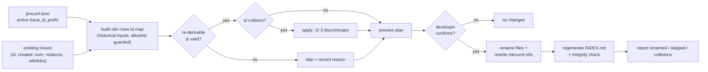

# 023 Re-derive existing issue ids to the active prefix scheme

## Overview
A one-shot, opt-in command that re-derives existing issue ids to the active
`issue_id_prefix` scheme — renaming issue files and rewriting every inbound
reference so a mixed-scheme collection converges on a single scheme, behind a
preview-then-confirm gate.

## Problem Statement
Spec 021 made the issue-id prefix configurable but deliberately forward-only:
changing `issue_id_prefix` affects only newly-created issues, and existing ids
are never rewritten. A developer who adopts a new scheme — switching from dates
to sequential ticket numbers, adding a project tag, settling on a house date
format — is left with a collection that permanently mixes the old scheme and the
new one. The only path to a uniform collection today is renaming each file by
hand and then hunting down every `relations:` target and `[[wikilink]]` that
referenced the old id, which is tedious and easy to get wrong: a single missed
reference becomes a dangling relation, and a careless rename collides two issues
into one path. The collection cannot converge on its chosen scheme without
error-prone manual surgery.

## User Stories
- As a developer who adopted a new prefix scheme, I can run one command to
  converge my whole existing collection on that scheme instead of renaming files
  by hand.
- As a developer worried about breaking cross-references, I can preview the full
  rename-and-rewrite plan and confirm it before anything changes, so I never
  discover a dangling relation after the fact.
- As a developer with a partly-migrated or awkward collection, I can re-run the
  command safely and trust that already-converged issues are left alone and
  un-convertible ones are reported, not silently mangled.

## Acceptance Criteria
- [ ] A one-shot command re-derives existing issue ids in the configured
  collection to the **active** `issue_id_prefix` scheme (the same scheme spec 021
  resolves from config), renaming each issue file to its re-derived id.
- [ ] Each re-derived id is computed from **that issue's own stored data** — its
  `created:` timestamp for the date and `timestamp` schemes, its `num:` ordinal
  for the sequential scheme, the configured tag for the project scheme — never the
  migration-run clock.
- [ ] Under the `timestamp` scheme an issue re-derives **literally** from its
  stored `created:`: a legacy value normalized to a day-start placeholder
  (`…T00:00:00Z`, spec 022) carries its real date through and propagates the
  placeholder time into the id (`…T000000`). The migration neither reconstructs
  nor invents sub-day precision an issue never captured.
- [ ] An issue that genuinely **lacks** the field its target scheme needs — no
  `created:` for the date/`timestamp` schemes, no `num:` for the sequential
  scheme — is left unchanged and reported as un-migratable.
- [ ] An issue whose current id already matches the active scheme is left
  byte-untouched — no rename, no reference churn. Running the command twice in a
  row produces no changes on the second run (idempotent).
- [ ] When an issue file is renamed, every inbound reference to its old id is
  rewritten to the new id — `relations:` targets across all four typed buckets
  (`blocks` / `depends-on` / `related-to` / `duplicates`) and body `[[wikilinks]]`,
  collection-wide. Every relation or wikilink that resolved before the run still
  resolves after it; the rename introduces no new dangling reference, and a
  reference that was already dangling before the run is reported, not silently
  rewritten.
- [ ] When two issues re-derive to the same id, the existing numeric
  discriminator (`-2`, `-3`, …) is applied so each file lands at a unique path.
  Two issues collide only when their re-derived prefix **and** slug coincide (a
  genuine duplicate); distinct slugs re-derive collision-free even when they share
  a prefix (e.g. a shared `…T000000` midnight).
  *External Constraint — sourced from `docs/specs/issue/005-issue-id-prefix/spec.md`
  AC #6 (the collision discriminator is reused, not reinvented).*
- [ ] The command computes the full plan first — every old-id → new-id rename,
  the references each rename will rewrite, every detected collision, and every
  skipped or un-migratable issue with its reason — and presents it to the
  developer; it mutates nothing until the developer explicitly confirms, and on
  decline the collection is left unchanged. Because the migration is destructive
  and recovery is via the developer's version control (see Out of Scope → Git
  operations), the plan states this plainly and — via a read-only check, never a
  write — flags when the issues collection has uncommitted changes, so the
  developer can checkpoint a clean state before confirming.
- [ ] The run is best-effort: it migrates every issue it can safely converge
  without aborting on an issue it cannot, then reports the outcome — counts of
  renamed, skipped (already-conforming or un-migratable), and collision-resolved
  issues, with a per-issue reason for every skip.
- [ ] If the apply phase cannot complete (interrupted or failed partway), the
  command does not leave the collection internally inconsistent — a state where
  filenames and their inbound references disagree — and it reports the resulting
  state so the developer can recover.
- [ ] Id re-derivation and sanitization are performed deterministically by jim's
  bash layer, not composed by the LLM, and every re-derived id passes the same
  bounded id allowlist and length bound spec 021 already enforces. The guard
  applies to the **full** re-derived id — the new prefix, the carried-over slug,
  and any `-2`/`-3` discriminator — never the prefix alone: a verbatim-preserved
  slug is re-validated, not trusted, so a legacy slug hand-edited on disk to hold
  path metacharacters cannot steer the rename outside the issues directory. A
  re-derivation that would produce an invalid or over-length id is treated as
  un-migratable (skipped and reported), never written. *External Constraint —
  sourced from `CLAUDE.md` ("Never `source` or `eval` user-supplied data") and the
  `skills/file/scripts/jimfile.sh` security-boundary note ("Slug pipeline is the
  security boundary — never delegate to the LLM").*
- [ ] Issue-file content is treated as untrusted user-authored data: the
  deterministic bash layer parses it without `source`/`eval`, the preview surfaces
  only structured derived tokens (ids, counts, per-skip reasons) — never raw issue
  body prose — and no directive embedded in issue content can cause the apply to
  proceed without the developer's explicit confirmation. *External Constraint —
  sourced from spec 017 (issue-tracking) AC-S2 and spec 018 § Security and Safety:
  issue content is untrusted user-authored data, parsed as data and never executed
  or obeyed as instruction.*
- [ ] After a successful run, `INDEX.md` reflects the re-derived ids, and its
  integrity checks (bidirectional relations, wikilink validity, origin
  resolution) report no new breakage introduced by the migration.

## UI Mockup
```
$ <re-derive command>   # active scheme: issue_id_prefix = "sequential"

Re-derivation plan — ./docs/issues  (scheme: sequential)

  rename   20260530-smoke-test            ->  0001-smoke-test
  rename   20260603-replace-coarse-...    ->  0006-replace-coarse-...
  rename   20260613-re-derive-existing... ->  0007-re-derive-existing...
           └─ rewrites 1 relation in 0006-replace-coarse-...
              (depends-on: 20260613-... -> 0007-...)

  skip     20260531-wikilink-parser-...   already in active scheme
  skip     20260531-typed-frontmatter-... un-migratable: no num: to
                                          project into a sequential id

  3 to rename · 2 to skip · 0 collisions

Apply this plan? [y/N]
```

## Data Flow


## Out of Scope
- **Issue schema fidelity upgrade.** Giving `created:` / `updated:` sub-day (to-the-second) resolution shipped separately as spec 022; this spec is a *migration command* over that schema, not a schema change. The interaction is settled: issues filed after 022 carry real sub-day times and re-derive faithfully under the `timestamp` scheme, while legacy issues normalized to a day-start placeholder re-derive literally (AC #3) — the command reconstructs no time it does not have.
- **Changing 021's forward-only default.** New-issue creation is unchanged; this command is an explicit, opt-in convergence step a developer runs deliberately, never an automatic rewrite triggered by editing `issue_id_prefix`.
- **`num` re-numbering.** `num` is not recomputed or reassigned. The sequential scheme *projects* each issue's existing `num` into its id exactly as spec 021 defined; `num` stays the decentralized display ordinal from spec 019.
- **The slug and `.md` extension.** Only the leading prefix segment is re-derived; the human-readable slug and the file extension are carried over unchanged (not re-slugified). "Carried over" is not "trusted blindly" — the slug still passes AC #11's full-id allowlist as part of the re-derived id, so preservation never bypasses the security boundary.
- **Cross-collection migration.** The command operates on the single configured `issues_path` collection — not multiple directories or external trackers.
- **A config write surface.** Developers still select `issue_id_prefix` by editing `jimconf.toml` directly; this command reads the active scheme, it never sets it. `/jim:conf` stays read-only.
- **Git operations.** The command renames files in the working tree; staging and committing the result is the developer's own follow-up step, consistent with every other jim write path.

## Research & Architecture Handoff

*Implementation insights surfaced during scoping. These are context for the architect — not requirements, not exclusions. Treat each as a starting point to evaluate, not a directive.*

### Insight 1: Command surface — one-shot script vs. `/jim:issue` verb

- **Relates to AC:** *"A one-shot command re-derives existing issue ids …"* (AC #1) and the preview-then-confirm gate (AC #8).
- **Surfaced as:** the originating issue and spec 021 both describe this as "a one-shot re-derivation command"; the developer chose a preview-then-confirm interaction.
- **Levelled-up requirement (already in the ACs):** a deliberately-invoked convergence operation that shows its plan before mutating.
- **Deflection reason:** Delegation — whether this is a standalone script invoked directly, a new `/jim:issue` verb wrapping a script, or a split is the architect's call.
- **Architect note:** `skills/issue/scripts/backfill.sh` is the direct precedent — a one-shot, idempotent, announced migration (num-ordinal assignment) using per-file atomic `tmp + mv`, deliberately NOT wired into the verb flow. Note the bash-vs-prompt split this feature forces: the deterministic work (re-derive ids, detect collisions, rewrite references, rename files) belongs in bash per the Bash-vs-Prompt rule, but preview-then-confirm (AC #8) is a conversational gate. A clean shape is bash computing and printing the plan (and applying on a confirmation token / second invocation), with a thin skill verb — or the developer — driving the confirm, mirroring how the read verbs already delegate to `render.sh`.
- **Routing hint:** Architect to decide.

### Insight 2: Re-derivation reuses 021's prefix resolver, fed historical inputs

- **Relates to AC:** the historical-source rule (AC #2) and the deterministic-resolution / allowlist constraint (AC #11).
- **Surfaced as:** the developer chose "historical inputs" (Approach A) — re-derive from each issue's own stored data, never the migration-run clock. (The original "skip lossy" sub-rule for the `timestamp` scheme was superseded once spec 022 shipped sub-day timestamps: a normalized day-start placeholder now re-derives literally — see AC #3.)
- **Levelled-up requirement (already in the ACs):** each re-derived id reflects the issue's own stored data and never the migration-run clock; an issue that genuinely lacks the field its scheme needs is skipped, not fabricated.
- **Deflection reason:** Delegation — *where* the historical inputs are threaded is a mechanism.
- **Architect note:** spec 021's `resolve_issue_prefix` resolves the prefix from the current clock plus config. Re-derivation needs the same resolver parameterized by the issue's own `created:` / `num:` instead of "now". Decide whether to generalize that resolver to accept an explicit date/ordinal, or add a re-derivation path that feeds historical inputs through the same `is_valid_id` allowlist and length-bound guards spec 021 built — the single-resolver route keeps the security boundary in one place. Post-022 every issue stores a full `created:` timestamp, so the `timestamp` scheme is no longer a lossy target — it re-derives literally (day-start placeholders included; see AC #3). Keep the general skip condition anchored to a *genuinely missing* field (no `created:`, no `num:`) or an invalid/over-length result, not to any one scheme name.

### Insight 3: Reference-rewrite + rename atomicity is the hard part

- **Relates to AC:** the no-dangling-references guarantee (AC #6), collision handling (AC #7), and consistency-on-failure (AC #10).
- **Surfaced as:** spec 021 scoped this work out precisely because "reference-rewrite safety (no dangling relations, idempotency, collision handling)" is the difficult part.
- **Deflection reason:** Constraint-Sourcing — the "never leave a dangling relation / never delegate the security boundary to the LLM" rule is sourced to spec 021 and `CLAUDE.md`; *how* to apply renames and rewrites safely is the mechanism.
- **Architect note:** Build the complete old→new id map up front (every rename target known before any mutation) so reference rewrites can target final ids in one pass. Reference rewriting must match ids **exactly** — never substring-replace an id that is a prefix of a longer id. Consider a staging/all-or-nothing apply (the existing atomic `tmp + mv` in `index.sh` and the per-file pattern in `backfill.sh` are precedents) so an interrupted run can't leave half-rewritten references. Collisions reuse spec 021's `-2`/`-3` discriminator; resolve them while building the map so the preview shows final paths. Regenerate `INDEX.md` once at the end and lean on its existing integrity checks as the post-run verification surface (AC #13).
- **Routing hint:** Architect to decide; a research pass on the existing `index.sh` relation/wikilink parsers may de-risk the rewrite step.

## Open Questions
- [x] ~Re-derivation source for time-based schemes, and handling of inputs an issue never stored~ → Approach A: re-derive from each issue's own `created:` / `num:` / configured tag, never the migration-run clock. Post-022 (sub-day timestamps shipped), the `timestamp` scheme re-derives literally — including normalized day-start placeholders (AC #3); skip and report only an issue that genuinely lacks the field its scheme needs.
- [x] ~Execution safety for a destructive rename-and-rewrite operation~ → Preview the full plan and apply only on explicit confirmation.
- [x] ~Handling of issues that can't cleanly converge~ → Best-effort: skip already-conforming and un-migratable issues, apply the `-2`/`-3` discriminator on collisions, and report the residual with reasons.
- [x] ~Sub-second `created:` / `updated:` schema fidelity~ → Shipped separately as spec 022. Interaction resolved: the `timestamp` scheme migrates literally — real captured times re-derive faithfully, day-start placeholders propagate as `…T000000` (AC #3), nothing is reconstructed.
