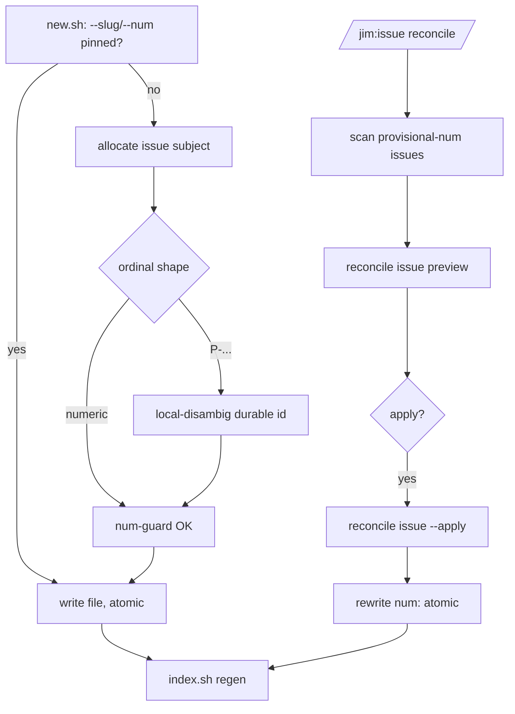

# Coordinated issue display ordinals — Plan

## Overview

Make `new.sh` the single coordination point: its identity fallback resolves the
durable id and display ordinal through `jimalloc.sh allocate issue` instead of
the uncoordinated `next-id`/`next-num` tree scans, add a preview-then-apply
`/jim:issue reconcile` that realizes provisional ordinals into real ones, and
teach the readers to render a provisional ordinal distinguishably. Batch-CAS and
the §7a rework are split to a dedicated follow-on; batch filing here coordinates
per item.

## Design Decisions

### 1. `new.sh` is the single coordination point

- **Chosen:** `new.sh`'s identity fallback (when `--slug`/`--num` are not pinned)
  calls `jimalloc.sh allocate issue "$title"` and parses the returned
  `<fullid>\t<num>`. The `--slug`/`--num` override contract is preserved
  unchanged (tests, `/jim:issue add`'s pinned display, and the reconcile path
  all still pin values).
- **Why:** one internal change makes *both* filing entry points coordinate — the
  interactive `add` and the per-item candidate batch (which calls `new.sh` with
  no overrides) — with zero edits to the eight surfacing skills, and it preserves
  the emitter's public contract (`<slug>\t<path>` stdout, override flags) that
  `sdlc` and `blueprint` depend on.
- **Rejected:** each caller (the SKILL flow + the 8 batch loops) allocates and
  passes overrides — spreads coordination across callers and would not cover the
  batch path without editing all of them (that is the split-out follow-on).

### 2. `/jim:issue add` allocates late via `peek`

- **Chosen:** the confirm-or-edit preview shows an *advisory* ordinal from
  `jimalloc.sh peek issue` and the title-derived slug; the binding
  `allocate issue` happens inside `new.sh` at save time (the SKILL stops pinning
  `--num`, and drops its manual `-2`/`-3` collision loop — disambiguation now
  lives below it).
- **Why:** allocate-as-late-as-possible (`platform/007` G7) means an unreachable
  point fails at save, after the interview, and never burns an ordinal if the
  developer cancels or edits the title; `peek` is explicitly non-binding.
- **Rejected:** pre-allocate in the SKILL and pin `--num`/`--slug` — binds before
  confirmation (burns an id on cancel) and re-derives a stale slug if the title
  is edited.

### 3. Strict two-grammar `num` guard (security Finding 2)

- **Chosen:** widen `new.sh`'s `num` validation from `^[0-9]+$` to a strict union
  — a real ordinal `^[0-9]+$` **or** a provisional `P-` prefix whose remainder
  passes `jimfile.sh valid-id`. Anything else is rejected, for both a
  fallback-derived and a caller-supplied `--num`.
- **Why:** a real ordinal is registry-derived and the coordination branch is
  push-writable; the widened field must not admit free text that would inject
  into rendered `INDEX.md`/`list`/`show` output. Two exact shapes, nothing else.
- **Rejected:** accept any non-empty `num` — reopens the injection surface AC 10
  now covers at the display boundary.

### 4. Provisional durable-id disambiguation is local-only (security Finding 1)

- **Chosen:** when the allocator returns a *provisional* ordinal (`P-…`),
  `new.sh` disambiguates the durable id against the local `docs/issues/`
  collection (`-2`/`-3`, mirroring today's `next-id` tree suffix) and mirrors the
  suffix into the stored `P-<durable-id>`. In *real* mode `new.sh` trusts the
  allocator's registry-disambiguated id and, on a local filename collision
  (a `platform/007` G2 drift anomaly), refuses to overwrite and errors rather
  than diverging from the registry.
- **Why:** provisional ids are computed offline over an empty log, so only the
  local clone can disambiguate them; this covers the common same-user offline
  case. The residual cross-clone same-day-same-slug case surfaces as a filename
  merge conflict when branches meet (detected, not silently lost) — a documented
  limit, not a silent merge.
- **Rejected:** clone-local entropy in the durable id — permanently pollutes the
  clean `date-slug` filename shape (the fork the developer declined).

### 5. `reconcile` is an explicit, previewed verb backed by a script

- **Chosen:** add a `/jim:issue reconcile` subcommand and a new
  `skills/issue/scripts/reconcile.sh`. Preview scans `docs/issues/` for issues
  whose `num` is provisional, feeds their durable ids to
  `jimalloc.sh reconcile issue` (preview), and shows the provisional→real
  mapping; `--apply` publishes via the allocator and rewrites each affected
  file's `num:` line atomically (tmp+mv), then regenerates `INDEX.md` once. The
  rewrite is anchored to the leading `---` frontmatter block (never a body line),
  and every durable id read from frontmatter is `valid-id`-gated before it reaches
  the allocator or a path (security Finding 5, the AC 10 boundary at the reconcile
  entry point).
- **Why:** realizing provisionals mutates existing files, so it must be visible
  and previewed (VISION *not a black box*); a deterministic frontmatter transform
  belongs in a script (Bash-vs-Prompt), mirroring the existing `backfill.sh` /
  `migrate.sh` migration family rather than composing files by hand.
- **Rejected:** auto-realize at the next reachable filing — a silent rewrite of
  the developer's files mid-`add`.

### 6. Realized-ordinal resolution is INDEX-reprojection, not a registry read (Insight 6)

- **Chosen:** after `reconcile` rewrites `num` and regenerates the index, `show`
  resolves the realized ordinal through the index exactly as today; `render.sh`
  gains no allocator dependency. Readers render a `P-…` ordinal verbatim (it is
  inherently distinguishable) with a light "(provisional)" marker so it never
  reads as a settled `#N`.
- **Why:** with `issue_placement` deferred, frontmatter stays on-branch, so the
  rewrite + reindex already make `show #N` resolve; registry `resolve issue` is
  marginal for issues and would couple the read path to the network.
- **Rejected:** wire `show` to `jimalloc.sh resolve issue` — needless coupling
  that cannot help a peer whose branch lacks the rewritten file anyway.

## Constitution Check

**ARCHITECTURE.md status:** Present — constraints noted below.

| Constraint from ARCHITECTURE.md | Honored? | Notes |
| :--- | :--- | :--- |
| Scripting Layer: Bash + POSIX only, no third-party deps | Yes | `reconcile.sh` uses grep/sed/cut; composes `jimalloc.sh` via `BASH_SOURCE`-relative path. |
| Registry content is untrusted: parse-as-data, never source; revalidate before git/path/display use | Yes | Reconcile-returned ordinals pass the strict `num` grammar + `valid-id` before any frontmatter write (Finding 2 / AC 10). |
| `single-emitter`: issue *files* are created only through `new.sh` | Yes | `reconcile.sh` transforms one existing frontmatter field, atomically — the `backfill.sh`/`migrate.sh` migration pattern, not new-file composition. |
| `atomic-index-write` / atomic issue writes (tmp+mv) | Yes | `reconcile.sh` rewrites via tmp+mv; `INDEX.md` regenerated once through `index.sh`. |
| `validator-lockstep`: byte-identical `is_valid_id` (platform depends on it) | Yes | Untouched; the `num` guard adds a `P-`+`valid-id` check, it does not alter `is_valid_id`. |
| Allocator tiers / `id_coordination_*` config, `GIT_TERMINAL_PROMPT=0` | Yes | Inherited from `jimalloc.sh` unchanged; no new config (issue_placement deferred). |

## File Manifest

| Component | File Path | Action | Notes |
| :--- | :--- | :--- | :--- |
| Emitter | `skills/issue/scripts/new.sh` | Update | Fallback → `allocate issue`; widen `num` guard (DD3); provisional local-disambig + real-mode collision error (DD4). |
| Reconcile | `skills/issue/scripts/reconcile.sh` | Create | Preview + `--apply`; realize provisionals via allocator; atomic `num:` rewrite; regen index. |
| Index | `skills/issue/scripts/index.sh` | Update | Confirm verbatim `num` projection; add a provisional marker if rendered ambiguously. |
| Read views | `skills/issue/scripts/render.sh` | Update | `show`/`list` render `P-…` distinguishably; `list --sort num` tolerates a non-numeric ordinal (DD6). |
| Subcommand + add flow | `skills/issue/SKILL.md` | Update | `add` allocates late via `peek`, drops manual collision loop; new `reconcile` routing arm. |
| Allocator tests | `tests/jimalloc.sh` | Update | Reconcile realize/idempotent/within-batch-halt; provisional ordinal shape fixtures (if not already covered). |
| Issue tests | `tests/issues.sh` | Update | `new.sh` allocator wiring (temp repo), `num`-guard grammar, provisional disambig, `reconcile.sh`, provisional rendering. |

## Interface Contracts

```text
# jimalloc.sh (existing — consumed, not changed)
allocate issue <subject>      -> stdout: "<fullid>\t<num>"      (real)
                                 stdout: "<fullid>\tP-<fullid>" (provisional mode)
peek     issue                -> stdout: "<next-num>"           (advisory, non-binding)
reconcile issue [--apply]     <- stdin : one provisional <fullid> per line
                                 -> stdout (preview): "<fullid>\t<real-ordinal>" per line
                                 -> stdout (--apply): provisional→real mapping (published)

# new.sh — CLI contract UNCHANGED (stdout "<slug>\t<path>"; --slug/--num/--title/... overrides)
#   num guard (DD3): accept iff  num =~ ^[0-9]+$   OR   ( num =~ ^P- AND valid-id(num without "P-") )
#   provisional (num starts "P-"): if docs/issues/<fullid>.md exists, suffix fullid -2/-3 and set num="P-<fullid>"
#   real: on local <fullid>.md collision -> error (no overwrite; G2 drift), do not suffix

# reconcile.sh (new)
#   reconcile.sh            [--dir <issues_dir>]   preview: list pending provisionals + would-be real ordinals
#   reconcile.sh --apply    [--dir <issues_dir>]   realize + rewrite num: (tmp+mv) + regen INDEX; idempotent
#   stdout: human summary; nonzero on within-batch collapse (allocator halt) or invalid registry token
```

## Data Flow



## Task Breakdown

1. [x] **`num`-guard grammar (DD3).** Replace `new.sh`'s `^[0-9]+$` check with the
   strict union (real numeric OR `P-`+`valid-id`), applied to both fallback and
   `--num` override; reject free text.
   **Verify:** `grep -Eq 'num.*(provisional|grammar)' tests/issues.sh && bash tests/issues.sh`

2. [x] **Emitter fallback → allocator, real path (DD1).** In `new.sh`, resolve
   unset `slug`/`num` via `jimalloc.sh allocate issue "$title"` (parse
   `<fullid>\t<num>`); keep `<slug>\t<path>` stdout unchanged. Test in a temp git
   repo so the local-tier CAS runs. Depends on task 1.
   **Verify:** `grep -Eq 'allocate.*coordinated' tests/issues.sh && bash tests/issues.sh`

3. [x] **Provisional path + local disambiguation (DD4).** Handle a `P-…` return:
   store it as `num`, disambiguate the durable id against `docs/issues/`
   (`-2`/`-3`, mirrored into `P-<fullid>`); in real mode error on a local filename
   collision instead of overwriting. Depends on task 2.
   **Verify:** `grep -Eq 'provisional.*disambig' tests/issues.sh && bash tests/issues.sh`

4. [x] **Distinguishable provisional rendering (DD6, AC 9).** `render.sh` `show`
   and `list` render a `P-…` ordinal distinctly (marker; `--sort num` tolerates
   it without error); confirm `index.sh` projects `num` verbatim and orders by
   slug (no numeric assumption).
   **Verify:** `grep -Eq 'render.*provisional' tests/issues.sh && bash tests/issues.sh`

5. [x] **`reconcile.sh` — preview + apply (DD5, Findings 1 & 5).** New script:
   scan provisional-num issues, `valid-id`-gate each durable id read from
   frontmatter before feeding `jimalloc.sh reconcile issue` (preview); `--apply`
   rewrites the `num:` field **anchored to the leading `---` frontmatter block
   only** (never a body line), atomically, and regenerates `INDEX.md`; idempotent
   re-run maps an already-realized id to its existing ordinal; a within-batch
   collapse halts nonzero. Depends on task 3.
   **Verify:** `grep -Eq 'reconcile.*(realize|idempotent|anchor|crafted)' tests/issues.sh && bash tests/issues.sh`

6. [x] **`SKILL.md` add-flow + `reconcile` routing (DD2, DD5).** `add` shows the
   preview from `peek issue`, calls `new.sh` without `--num`, drops the manual
   collision loop; add the `reconcile` subcommand arm invoking `reconcile.sh`
   (preview then confirm→`--apply`). Depends on tasks 2, 5.
   **Verify:** `grep -q 'peek issue' skills/issue/SKILL.md && grep -q 'reconcile.sh' skills/issue/SKILL.md`

7. [x] **Allocator-side fixtures (AC 2, 5, 7, 8).** Ensure `tests/jimalloc.sh`
   covers the reconcile realize/idempotent/within-batch-halt paths and the
   provisional ordinal shape this consumer relies on; add any missing fixture.
   **Verify:** `grep -Eq 'reconcile' tests/jimalloc.sh && bash tests/jimalloc.sh`

8. [x] **Full suite green.** Run the aggregate runner; issue + allocator suites
   pass.
   **Verify:** `bash skills/meta-test/scripts/run.sh issues && bash skills/meta-test/scripts/run.sh jimalloc`

## Requirements Coverage Summary

| Spec Acceptance Criterion | Addressed In Task(s) |
| :--- | :--- |
| AC 1 — resolve ordinal + durable id through allocator, durable-before-write | 2 |
| AC 2 — concurrent filings never share ordinal/durable id (disambiguation) | 2, 7 |
| AC 3 — INDEX stays a pure projection, no allocation authority | 4 |
| AC 4 — `show` resolves a realized ordinal; former provisional never mis-resolves | 4, 5 |
| AC 5 — tier follows reachability (remote vs local) | 2, 7 |
| AC 6 — provisional ordinal stored distinctly, no real ordinal consumed | 3 |
| AC 7 — reconcile preview-then-apply, idempotent, never merges two issues | 5, 7 |
| AC 8 — fail mode: bounded retry then hard-fail | 2, 7 (inherited from allocator) |
| AC 9 — readers render real vs provisional distinguishably | 4 |
| AC 10 — revalidate every read-back value, incl. reconcile rewrite + display | 1, 5 |
| AC 11 — emitter guarantees unchanged (single-emitter, atomic, encoding) | 2, 3, 5 |

## Out of Scope

- **Batch-CAS + §7a candidate-batch rework** — collapsing a candidate batch into
  one CAS across the eight surfacing skills is the dedicated cross-group follow-on
  (security Finding 3; Handoff Insight 2). Batch filing here is per-item.
- **Removing the now-vestigial `next-id issue` / `next-num issue` jimfile forms** —
  other tools may still call them; leaving the CLI surface intact. (Their
  group-vs-kind collision is issue `#123`, orthogonal — research §1.)
- **Cross-clone provisional durable-id uniqueness** — the rare offline same-day
  same-slug case across clones surfaces at merge (documented limit, DD4), not
  fully prevented here.
- **The `platform/007` G2 "only-door" verification sweep** — a systematic
  registry-vs-tree check is a separate deferred follow-on (issue #116); `new.sh`
  only refuses to overwrite on a real-mode local collision.
- **ARCHITECTURE.md refresh** — performed by the `/jim:build` completion gate via
  `/jim:arch`; pipeline-owned, not a human deferral.

## Open Questions

- [x] ~Where the allocator is called from~ → `new.sh` fallback (DD1).
- [x] ~Reconcile trigger~ → explicit previewed `/jim:issue reconcile` (DD5).
- [x] ~Provisional collision depth~ → local disambig + documented cross-clone
  limit (DD4).
- [ ] Does `list`/`stats` need more than the verbatim `P-…` marker to flag
  provisionals (e.g. a dedicated column), or is the marker enough? (UX polish;
  resolve during task 4.)
