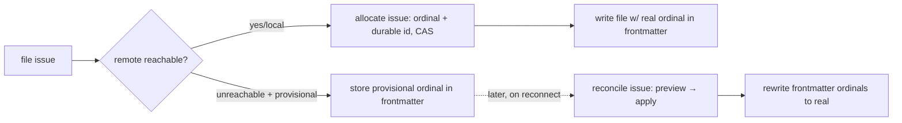

# 010 Coordinated issue display ordinals

## Overview
Route issue filing's identity — the display ordinal (`#42`) and the durable
date-slug id — through the coordination allocator instead of an uncoordinated
tree scan, so two people on separate clones never file colliding issue ids, and
provisional ids from offline filing are realized into real ones on reconnect.

## Problem Statement
An issue's display ordinal and its durable date-slug id are both derived from
uncoordinated `max + 1` / tree scans (`jimfile.sh next-num` / `next-id`) at
filing time. Two developers filing on separate clones or branches — jim's
near-term reality — compute the same next ordinal and, on a shared day with a
shared natural slug, the same durable id; nobody learns until the branches meet,
where the ordinals silently duplicate and `INDEX.md` collides. The coordination
allocator that would prevent this already exists and is proven (`platform/007`
foundation, `008` seed, `009` provisional/reconcile), and its issue verbs
(`allocate issue`, `resolve issue`, `reconcile issue`) are the frozen consumer
contract 009 anticipated — but nothing consumes them. Issue filing is still the
one place a duplicate id is a matter of timing, not prevention.

## User Stories
- As a developer filing an issue on a team sharing a repo, the display ordinal
  and durable id I receive are mine alone across every clone and branch, so that
  `#42` and the issue's filename never collide with someone else's.
- As a developer citing `show #42`, it resolves to the right issue through the
  coordinated registry — including an ordinal that was realized from an earlier
  provisional — so the handle stays dereferenceable.
- As a developer filing issues while offline or unable to reach the coordination
  point, I still get a usable local id and it is realized into a real,
  coordinated ordinal when I reconnect, without hand-editing issue files.
- As a solo developer on a repo with no remote, issue filing still coordinates
  across my clone's sessions and worktrees, with no per-machine setup.
- As a developer, the moment my provisional issues become real is a visible,
  previewed step I trigger — not a silent rewrite of my files behind my back.

## Acceptance Criteria
- [ ] Issue filing resolves both the display ordinal and the durable date-slug
      id through the coordination allocator, not an uncoordinated tree scan. The
      id is durably reserved at the coordination point before the issue file is
      written; if the reservation does not succeed, no issue file is written.
- [ ] Two issues filed concurrently on separate clones or branches never receive
      the same display ordinal, and never the same durable id: the allocator's
      disambiguation covers both id forms, so a shared-day shared-slug filing is
      suffixed rather than colliding.
- [ ] `INDEX.md` remains a pure projection of the stored ordinal: regenerating
      the index reserves nothing, has no allocation authority, and can never
      introduce or renumber a duplicate ordinal.
- [ ] After a provisional issue is realized into a real ordinal, `show
      <ordinal>` resolves the realized ordinal to its issue, and a stale
      reference to that issue's former provisional ordinal never mis-resolves to
      a different issue.
- [ ] The guarantee tier follows reachability: when a remote is reachable,
      filing coordinates across all clones and users; when no remote exists, it
      coordinates across the local clone's sessions and worktrees. Neither tier
      requires per-machine setup beyond the checked-in configuration.
- [ ] Under `id_coordination_unreachable = provisional` with an unreachable
      remote, filing stores a structurally-distinct provisional ordinal in the
      issue's frontmatter — one that can never be mistaken for or collide with a
      real ordinal — and the issue is immediately usable locally. No real
      ordinal is consumed, and the provisional never enters the registry or the
      next-ordinal high-water.
- [ ] A visible, preview-then-apply reconcile step realizes every pending
      provisional issue into a real coordinated ordinal and rewrites the affected
      issue files' frontmatter. Realization is idempotent — re-running maps an
      already-realized identity to its existing ordinal, never a second one — and
      never merges two distinct issues that were coordinated, or filed within one
      clone, onto one ordinal. The residual cross-clone case — the same durable id
      filed offline in two clones — is not silently merged: it surfaces as a
      filename conflict when the branches meet (detected at merge).
- [ ] Under `id_coordination_unreachable = fail` (the default) with an
      unreachable remote, filing performs bounded retries and then hard-fails
      with a clear message, rather than writing an uncoordinated or duplicate id.
- [ ] Every frontmatter reader — `INDEX.md` generation, `show`, and `list` —
      renders a real numeric ordinal and a provisional ordinal correctly and
      distinguishably, so a provisional issue is never displayed as a settled
      `#N`.
- [ ] Every ordinal, id, or slug read back from the registry or from issue
      frontmatter is revalidated through the established id/slug boundary before
      it is used as a filesystem path, a git argument, or stored into issue
      frontmatter and rendered, including in the reconcile rewrite step — a
      registry-derived ordinal is branch-writable input, so its display surface
      is guarded as strictly as its path/ref surface. *(External Constraint — the coordination point is
      writable by anyone who can push it; sourced to `platform/007`'s injection-
      guard AC and the `jimalloc.sh` / `jimledger.sh` validation precedent.)*
- [ ] The issue-emitter guarantees hold unchanged: every issue file is still
      written only through the single emitter, writes stay atomic (tmp + mv), and
      untrusted title/label/origin/body encoding is unaffected by the new
      identity path. *(External Constraint — sourced to the `issue` group
      blueprint invariants `single-emitter`, `atomic-index-write`,
      `untrusted-body-never-shell`.)*

## Data Flow

## Out of Scope
- **`issue_placement` / centralizing issue content.** Where issue *files* live —
  on the working branch (as today) versus a shared/central destination as
  cross-branch discovery artifacts — is a separable, larger concern deferred to
  its own follow-on spec. This spec coordinates the *ids*; issue files continue
  to ride the working branch and `docs/issues/` unchanged.
- **Issue rename / redirect records.** Issues are not renamed the way spec
  ordinals are, and emitting rename / group-rename records is the spec-and-
  partition consumer's scope (`platform/007` follow-on), not this one. This spec
  emits only `issue allocate` records via the existing verbs.
- **The `next-id issue` group-vs-kind CLI collision** (a group literally named
  `issue` colliding with the issue *kind*). A separate platform issue owns it;
  this spec does not touch `jimfile.sh`'s spec-id path.
- **The `Issue: <num>/<id>` commit-trailer convention** and any rewrite of
  historical trailers. The durable id keeps trailers dereferenceable; the ordinal
  realized from a provisional is a frontmatter/index concern only.
- **Migrating existing issue files into the registry.** Bootstrapping the
  registry from the current collection is `seed`'s job (`platform/008`), run once
  at adoption; this spec assumes a seeded — or empty — registry.
- **Treating the ordinal as an authorization or integrity anchor.** The
  `platform/007` non-goal carries down: an ordinal or registry record is advisory
  provenance, never a basis for an auth, authorization, or integrity decision.
- **Making coordination opt-out, or suppressing it for auto-filed batches.**
  Under a reachable remote, coordinated filing is a git push — a deliberate change
  from today's local-only filing (a visible git operation, consistent with jim's
  ledger commits), and it applies uniformly, including the end-of-run candidate
  batches the surfacing skills file. This spec adds no knob to disable
  coordination per path. Batch filing here coordinates **per item** — one CAS per
  issue, free in the local tier and a few round-trips on a remote; collapsing a
  batch into a single CAS, and the §7a candidate-batch rework it requires across
  the surfacing skills, is a dedicated cross-group follow-on (see Handoff
  Insight 2). A per-path or appetite-based opt-out, if ever wanted, is a separate
  concern.
- **Opaque reservation for sensitive work.** Coordinated filing publishes the
  human-readable, title-derived slug and the filer identity (`<who>`) to the
  coordination point at creation time — before the work merges — so both are
  visible to everyone with repo read access earlier than today's
  on-branch-until-merge behavior. Binding an opaque token at reservation and
  revealing the readable slug only at merge is a follow-on, not built here; the
  disclosure surface is acknowledged (mirroring `platform/007`) so a team can
  weigh it.

## Research & Architecture Handoff

*Implementation insights surfaced during scoping. These are context for the architect — not requirements, not exclusions. Treat each as a starting point to evaluate, not a directive.*

### Insight 1: Where the allocator is called from, and emitter purity

- **Relates to AC:** *"resolves both the display ordinal and the durable id through the coordination allocator"* (AC 1) and *"the issue-emitter guarantees hold unchanged"* (AC 11)
- **Surfaced as:** `new.sh` already accepts `--slug` / `--num` overrides and today resolves the unset ones via `jimfile.sh next-id` / `next-num`. The narrow swap is to resolve them via `jimalloc.sh allocate issue <subject>` (which returns `<fullid>\t<num>` in one CAS) instead.
- **Levelled-up requirement (already in the ACs):** the AC fixes *that* identity is coordinator-issued and durable-before-write; it does not fix *which* component calls the allocator.
- **Deflection reason:** Delegation — the call site is an architecture trade-off against the `single-emitter` invariant.
- **Architect note:** two shapes. (a) `new.sh` calls the allocator internally when slug/num are unset — keeps one call site (single-source) but turns the emitter, today a pure local writer every test and all eight surfacing skills depend on, into a network-touching operation. (b) A thin shared resolver (or the skill flow) allocates and passes `--slug`/`--num`, keeping `new.sh` pure but spreading the allocator call across callers. Weigh against how tests exercise `new.sh` without a remote.
- **Routing hint:** Architect to decide.

### Insight 2: Batch filing must not become N independent CAS races

- **Relates to AC:** *"durably reserved … before the issue file is written"* (AC 1) and the reachable-remote tier (AC 5)
- **Surfaced as:** the end-of-run candidate batch (the eight surfacing skills) files many issues in one loop. Under a configured remote, a naive wiring makes each filing its own push-CAS — N serialized round-trips that race every other push to the coordination branch.
- **Levelled-up requirement (already in the ACs):** the functional need is that filing K issues in one run coordinates all K without K independent races; the ACs state coordination and durability, not a batch primitive.
- **Deflection reason:** Delegation — batch shape is a mechanism choice.
- **Architect note:** the allocator already has a shared, erosion-guarded batch-publish path (`alloc_publish`, used by `seed` and `reconcile`) that lands N records in one commit / one CAS. Consider exposing a batch issue-allocate so a candidate batch is one CAS, and how the interactive per-row override path composes with it.
- **Routing hint:** Architect to decide.

### Insight 3: Provisional durable-id collision at realization

- **Relates to AC:** *"realization … never merges two distinct issues onto one ordinal"* (AC 7) and durable-id uniqueness (AC 2)
- **Surfaced as:** the allocator computes a provisional issue's durable id over an *empty* log (`alloc_provisional_issue`), so it is not disambiguated against the registry. Two offline issues — or one offline issue versus a real one allocated concurrently elsewhere — can share a durable id; `reconcile`'s keyed find-or-allocate keys on that durable id.
- **Levelled-up requirement (already in the ACs):** AC 7 forbids merging two distinct issues onto one ordinal; the mechanism to guarantee it is open.
- **Deflection reason:** Delegation — verify against the already-built `reconcile` behavior; the fix may be local-tree disambiguation of provisional durable ids at filing time, or a reconcile-time check.
- **Architect note:** confirm during planning whether the built `alloc_reconcile_realize` collapses a shared durable id, or whether the consumer must disambiguate provisional durable ids locally (mirroring today's `next-id` tree disambiguation) before storing them.
- **Routing hint:** Architect to decide / verify against built mechanism.

### Insight 4: Reconcile trigger — explicit and previewed

- **Relates to AC:** *"a visible, preview-then-apply reconcile step"* (AC 7)
- **Surfaced as:** the allocator ships `reconcile issue [--apply]` (preview by default). The consumer can drive it from an explicit verb the developer runs, or automatically at the start of the next reachable filing.
- **Levelled-up requirement (already in the ACs):** AC 7 requires realization to be *visible* and *previewed*; whether the trigger is a dedicated verb or an auto-step is open.
- **Deflection reason:** Delegation — leaning explicit verb for transparency (VISION *not a black box*), mirroring jim's one-time-migration preview-then-apply doctrine and the allocator's own `--apply` gating.
- **Routing hint:** Architect to decide.

### Insight 5: Allocate late; preview via `peek`

- **Relates to AC:** *"durably reserved … before the issue file is written"* (AC 1)
- **Surfaced as:** today's confirm-or-edit display shows the pre-resolved `next-num`. The allocator's `peek issue` is the advisory, non-binding preview; only `allocate issue` binds.
- **Levelled-up requirement (already in the ACs):** AC 1 binds the id at write time; a preview must never reserve one.
- **Deflection reason:** Delegation — back any "what's next" display with `peek`, and bind with `allocate` as late in the flow as possible so an unreachable-point failure does not strand a half-built issue (`platform/007` G7).
- **Routing hint:** Architect to decide.

### Insight 6: How `show` resolves a realized ordinal — index versus registry

- **Relates to AC:** *"`show` resolves the realized ordinal to its issue"* (AC 4)
- **Surfaced as:** the AC originally mandated resolution *through the coordinated registry (forward replay)*. Research found `render.sh` resolves `show` purely against `INDEX.md` and calls no resolver today; because `issue_placement` is deferred, realization rewrites the frontmatter ordinal and reindexes, so `show <ordinal>` resolves via the index with no registry call.
- **Levelled-up requirement (already in the ACs):** AC 4 now fixes only the observable outcome — a realized ordinal resolves, and a former provisional ordinal never mis-resolves.
- **Deflection reason:** Delegation — the resolution mechanism is the architect's call.
- **Architect note:** the registry `resolve issue` verb is load-bearing for *specs* (rename records) but marginal for issues — it cannot help a peer whose branch lacks the rewritten file anyway. Reprojecting the rewritten frontmatter through the index (rewrite ordinal + reindex) is the simpler path and likely sufficient; weigh whether any case actually needs the registry resolver.
- **Routing hint:** Architect to decide.

## Open Questions
- [x] ~Does `issue_placement` (content centralization) belong here?~ → No; deferred to its own follow-on spec. This spec coordinates ids only.
- [x] ~Unreachable-origin behavior for issues~ → Wire the full provisional +
  reconcile loop (not fail-only), completing 009's frozen consumer contract.
- [ ] Reconcile trigger: explicit `/jim:issue reconcile` verb versus automatic on
  the next reachable filing (leaning explicit — see Insight 4).
- [ ] Provisional durable-id collision: does the built `reconcile` already
  prevent merging distinct issues onto one ordinal, or must the consumer
  disambiguate provisional durable ids locally? (see Insight 3).
- [ ] Do `list` / `stats` need to visually flag provisional issues, or is the
  distinguishable `num` rendering (AC 9) plus `show` enough?
