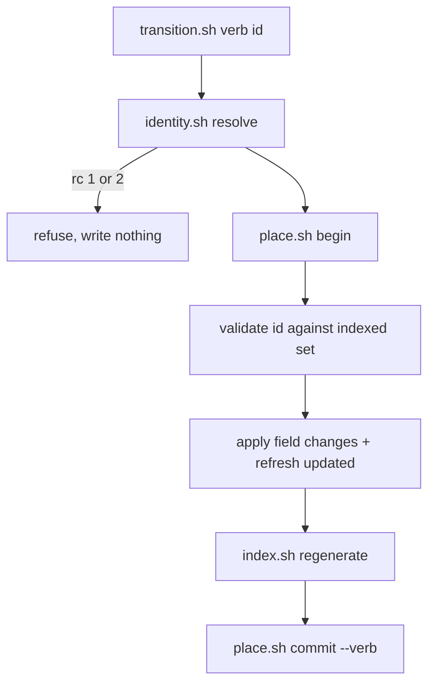
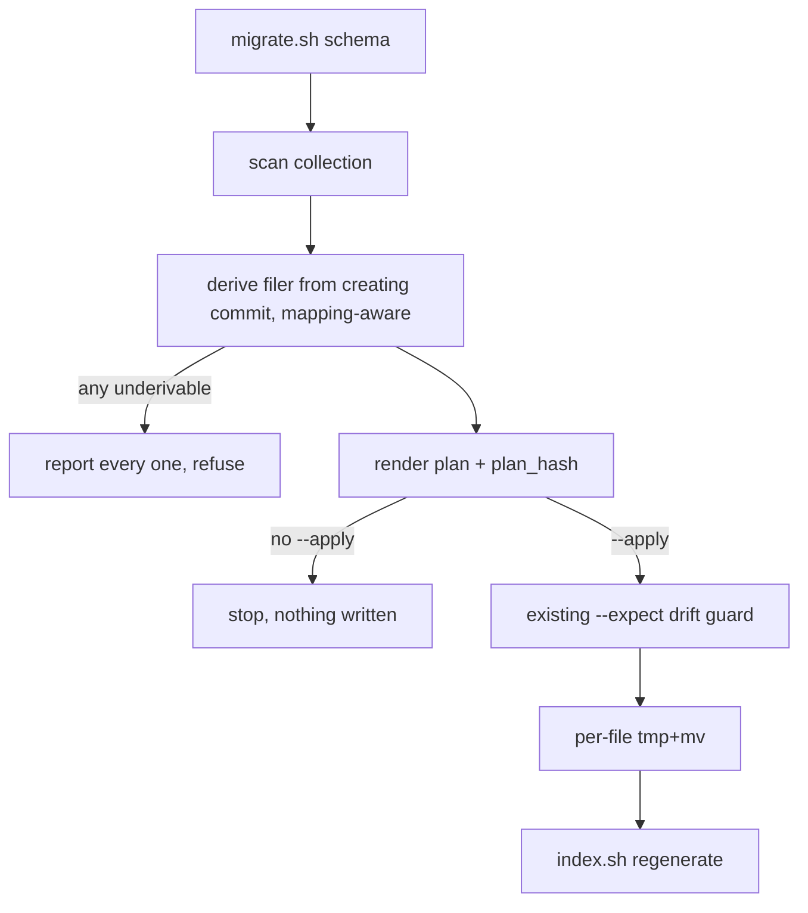

# Schema and state model — Plan

## Overview

Add five frontmatter fields and a third lifecycle state to the issue schema,
introduce one script that performs every state transition through the existing
placement door, and convert the existing collection through a new subcommand of
the migration surface that already owns previewed, gated rewrites.

## Design Decisions

### 1. The conversion is a migration, not a backfill

- **Chosen:** Host the conversion as a new `schema` subcommand of `migrate.sh`,
  beside `prefix`, reusing that script's plan hash, `--expect` drift guard and
  recoverability note in place. No library is extracted and `backfill.sh` is not
  touched.
- **Why:** The line that predicts which conversions need a preview is not
  missing-versus-existing data — that is a coincidence of `backfill.sh`'s first
  two jobs. It is **derived versus constant values**. This conversion derives
  `filed-by` from version-control history and `outcome` from existing status,
  and derivation is exactly what an operator should see before it is written
  350 times. Constant fills need no preview and stay where they are.
  - The drift guard is not duplicated, because it is not moved: the new
    subcommand calls the same `plan_hash` and the same `--expect` refusal, in
    the same file, already covered by the existing suite.
  - `migrate.sh` already routes a preview read-only under a branch placement
    and an apply under the `migrate` verb. `backfill.sh` states the opposite of
    itself — both its subcommands write, so it has no read-only route — and
    giving it one means new code in the placement-routing layer, which is where
    the gate-before-git invariant lives.
  - Smallest touch to a security-sensitive script: a subcommand added beside an
    existing one, rather than four functions lifted out of it and re-sourced.
- **Rejected:** *Extract a `previewlib.sh` shared by both surfaces* — the
  shareable surface is far smaller than it appears. The renderer is written
  around the prefix migration's four action names and its row tuple is a
  rename's `old → new`, neither of which a schema conversion has. What remains
  generic is a hash, a comparison and a note; restructuring a working script to
  deduplicate those, while still owing `backfill.sh` a new read-only placement
  path, spends risk where the duplication was not.
- **Rejected:** *A shared renderer taking a caller-supplied formatter* — the
  same cost as above, plus function-name indirection for two callers that print
  different things.
- **Rejected:** *A second preview and drift guard inside `backfill.sh`* — forks
  safety logic, the one category worth avoiding, and this group already carries
  such a fork (the two frontmatter parsers) as a tracked issue.
- **Rejected:** *A standalone script* — a third migration surface for one job.
- **Consequence, accepted:** the collection's conversions are now split by risk
  rather than by era — a future constant-only fill belongs in `backfill.sh`,
  a future derivation-bearing one here. That is the distinction worth having,
  but it does mean the two scripts are no longer separable by their names alone,
  and each states its own criterion in its header.

### 2. Identity is validated and refused, not encoded

- **Chosen:** Resolve the ambient identity once in `identity.sh`, validate it
  against a **positively enumerated** single-line character set — accept only
  that set, reject everything else — and refuse when it fails, on the same
  refusal path as a missing identity.
- **Why:** The spec requires that a recorded identity can never introduce
  additional fields, and that an unrecordable value refuses like a missing one.
  Validation achieves this by construction and is mechanically checkable;
  encoding merely renders a malformed value survivable, storing something the
  developer never meant as their identity. The set is stated positively because
  the criterion is absolute — *whatever* the environment supplied — and an
  enumeration of known-bad characters can only ever cover what its author
  anticipated. Unicode line separators, a leading `---`, a trailing backslash and
  stray control characters all pass a blocklist while remaining capable of
  disturbing the record. Failing closed is the only formulation that satisfies
  "whatever", and it matches the group's existing discipline, where an id clears
  a positive validator before any path is composed.
- **Rejected:** *Reject a list of dangerous characters* — cheaper to write, and
  open by default to everything not thought of.
- **Rejected:** *YAML-encode it like `--title`* — would faithfully persist a
  multi-line value as an escaped scalar, satisfying the letter of "no extra
  fields" while recording nonsense.
- **Rejected:** *Trust it, as `--created`/`--updated` currently are* — that is
  the live defect this group already tracks, and the demonstrated injection
  vector.

### 3. Umbrella membership stored only on the member

- **Chosen:** The member declares `part-of:`; nothing is written to the
  umbrella. A roster is derived when one is needed.
- **Why:** One write per membership change instead of two, no reciprocity to
  verify, and an umbrella with many members carries no list that must stay in
  sync. Deliberately breaks the group's bidirectional relation pattern.
- **Rejected:** *Bidirectional, matching the existing typed relations* —
  consistent, but doubles the write surface for no gain when nothing in this
  spec reads the field.

### 4. Keyed field extraction instead of positional

- **Chosen:** Change `parse_scalar_fields` to emit `key<TAB>value` lines rather
  than bare values in a fixed order, and update its callers.
- **Why:** Callers currently read seven lines by position. Twelve is materially
  more fragile, and inserting a field mid-list silently shifts every field after
  it. Keying contains the blast radius of this change and of every future field.
- **Rejected:** *Append the five new fields to the end of the positional list* —
  cheapest now, and re-pays the cost on every future schema change.
- **Not attempted:** unifying the two frontmatter parsers. That is a tracked
  follow-on with its own scope; this plan adds fields to both.

### 5. One transition script, verb-dispatched

- **Chosen:** A single `transition.sh <verb> <id>` covering claim, release,
  start, close, reopen.
- **Why:** Mirrors the group's single-writer discipline — one script owns issue
  mutation, one place implements the placement door dance and the last-modified
  refresh. Five scripts would fork that logic five ways.
- **Rejected:** *Five small scripts* — duplicates the door handling.
- **Rejected:** *Extend `new.sh`* — that script is the emitter for new files;
  mutating existing ones is a different contract with a different door verb.

### 6. Derive the historical filer through the project's alias mapping

- **Chosen:** The conversion reads the creating commit's author via the
  mapping-aware spelling of the author-email field.
- **Why:** Verified to return the mapped address where the project has an alias
  mapping and the raw address unchanged where it does not. Costs one character,
  adds no configuration and no mapping for jim to own, and stops one
  contributor's several addresses from splitting every by-person view.
- **Rejected:** *The raw spelling* — actively discards a mapping the project
  already has.

### 7. Transition verbs extend the published verb enum

- **Chosen:** Add `claim`, `release`, `start`, `reopen` to `PLACE_VERBS`;
  `close` already exists.
- **Why:** The enum is what reaches published commit messages, so distinct verbs
  make a centralized collection's history self-describing.
- **Rejected:** *Map every transition onto the existing `edit` verb* — uniform
  history, but discards the signal at exactly the point someone reads it.

## Constitution Check

**ARCHITECTURE.md status:** Present — constraints noted below.

| Constraint | Honored? | Notes |
| :--- | :--- | :--- |
| Bash + POSIX only; no third-party dependencies | Yes | `git`, `awk`, `sed`, `grep` only — all already used in this group |
| `set -uo pipefail`, never `set -e` | Yes | New scripts follow the group preamble |
| Inter-script composition via `BASH_SOURCE`-relative paths | Yes | `identity.sh` is resolved that way from `new.sh` and `transition.sh` |
| No spec IDs or artifact citations in script comments | Yes | Comments state behavior only |
| Never `source`/`eval` user-supplied data | Yes | Issue files parsed line-orientedly throughout |
| `single-emitter` — only `new.sh` creates issue files | Yes | `transition.sh` mutates existing files; it creates none |
| `untrusted-body-never-shell` | Yes | No body content reaches a shell argument |
| `id-gate-before-path` | Yes | `transition.sh` validates the id before composing any path |
| `atomic-index-write` | Yes | Per-file tmp+mv; index regenerated after each transition |
| `placement-gate-before-git` | Yes | All mutation routes through `place.sh` |
| `staleness-gated-reads` | Yes | Unchanged; reads still route as they do today |

**No cross-group contract change.** The identity helper lives inside this group
rather than extending the platform path CLI, so the group's `requires` face is
unchanged and no new edge enters the contract graph.

## File Manifest

| Component | File Path | Action | Notes |
| :--- | :--- | :--- | :--- |
| Schema template | `skills/issue/assets/issue-template.md` | Update | Five new fields; `active` in the status comment |
| Identity helper | `skills/issue/scripts/identity.sh` | Create | Resolve + validate ambient identity; one refusal path |
| Transition verbs | `skills/issue/scripts/transition.sh` | Create | claim / release / start / close / reopen |
| Emitter | `skills/issue/scripts/new.sh` | Update | Populate `filed-by`; default `type`; refuse on absent/invalid identity |
| Index | `skills/issue/scripts/index.sh` | Update | Keyed field extraction; three new integrity warnings |
| Read views | `skills/issue/scripts/render.sh` | Update | Parse and display the new fields |
| Conversion | `skills/issue/scripts/migrate.sh` | Update | New `schema` subcommand beside `prefix`, reusing its plan hash and drift guard |
| Placement door | `skills/issue/scripts/place.sh` | Update | Four new entries in `PLACE_VERBS` |
| Skill surface | `skills/issue/SKILL.md` | Update | Document the five verbs and the schema |
| Group tests | `tests/issues.sh` | Update | Schema, identity, transitions, conversion, integrity |
| Door tests | `tests/place.sh` | Update | New verb-enum entries |

## Interface Contracts

Frontmatter, with the five additions and their permitted values:

```yaml
id: 20260817-example-slug
num: 42
title: "Example"
status: open | active | closed        # `active` is new
priority: low | medium | high | critical
type: issue | epic                    # new; default `issue`
filed-by: "<identity>"                # new; set by the emitter, never by hand
claimed-by: "<identity>" | ""         # new; empty means unheld
outcome: done | wontfix | duplicate | obsolete | ""   # new; non-empty iff ever closed
labels: [a, b]
relations:
  blocks: []
  depends-on: []
  related-to: []
  duplicates: []
  part-of: []                         # new; umbrella slugs, member side only
created: 2026-08-17T00:00:00Z
updated: 2026-08-17T00:00:00Z
origin: "path/or/conversation"
```

Derived, never stored:

```
claimed   := claimed-by is non-empty
blocked   := any depends-on target has status != closed
reopened  := status != closed AND outcome is non-empty
```

Script surfaces:

```
identity.sh resolve              # -> <identity> on stdout; rc 1 unresolvable, rc 2 invalid
transition.sh <verb> <id> [--as <outcome>] [--force]
    verb ∈ claim | release | start | close | reopen
    rc 0 ok · 1 io · 2 usage · 3 placement conflict · 5 already held (claim)
migrate.sh schema [<dir>]                # preview, mutates nothing
migrate.sh schema [<dir>] --apply [--expect <hash>]
    rc 0 ok · 1 io · 2 usage · 3 drift — the same codes `prefix` returns,
    from the same guard
```

## Data Flow





## Task Breakdown

Each task pairs its implementation with the tests that prove it, so the suite is
the verify throughout. Tests live in `tests/issues.sh` unless named otherwise.

1. [x] Add the five fields and the `active` status to
   `skills/issue/assets/issue-template.md`, with `part-of` inside `relations:`.
   **Verify:** `grep -qE '^type:' skills/issue/assets/issue-template.md && grep -qE '^filed-by:' skills/issue/assets/issue-template.md && grep -qE '^claimed-by:' skills/issue/assets/issue-template.md && grep -qE '^outcome:' skills/issue/assets/issue-template.md && grep -qE '^ +part-of:' skills/issue/assets/issue-template.md`

2. [x] Create `skills/issue/scripts/identity.sh` with a `resolve` verb — read the
   ambient identity, validate it against a positively enumerated single-line
   character set, print it on stdout; rc 1 absent, rc 2 invalid, no stdout on
   either refusal. Accept only the enumerated set; everything outside it fails
   closed. Cover in tests: a valid address; an absent identity; a
   newline-bearing value; a value carrying a character outside the accepted set
   but outside any obvious blocklist too (a Unicode line separator or a leading
   `---`), proving the validator fails closed rather than enumerating bad input.
   **Verify:** `bash tests/issues.sh`

3. [x] Update `new.sh` to populate `filed-by` from `identity.sh resolve`, default
   `type: issue`, emit empty `claimed-by` / `outcome` / `part-of`, and refuse the
   whole filing with a fixed reason when identity resolution fails.
   Depends on task 2.
   **Verify:** `bash tests/issues.sh`

4. [x] Change `parse_scalar_fields` in `index.sh` to emit `key<TAB>value` lines,
   add the five fields to its allowlist, and update every caller to read by key.
   **Verify:** `bash tests/issues.sh`

5. [x] Add three integrity warnings to `index.sh` — finished-with-no-outcome,
   unrecognized outcome, unrecognized `type` or `part-of` target — routing every
   interpolated value through `row_safe`. Depends on task 4.
   **Verify:** `bash tests/issues.sh`

6. [x] Update `render.sh` to parse and display the new fields in `show`, and to
   accept `active` wherever `status` is recognized.
   **Verify:** `bash tests/issues.sh`

7. [x] Add `claim`, `release`, `start`, `reopen` to `PLACE_VERBS` in `place.sh`
   and to its usage text.
   **Verify:** `bash tests/place.sh`

8. [x] Add the `schema` subcommand's read-only half to `migrate.sh`: build the
   conversion plan — derive each issue's filer from its creating commit using
   the mapping-aware author field, set `type: issue`, set `outcome: done` on
   already-closed issues, leave `claimed-by` and `part-of` empty — and render it
   with the plan hash and recoverability note. Mutates nothing; `prefix`'s
   behavior must not change, and its existing tests must pass unmodified.
   **Verify:** `bash tests/issues.sh`

9. [x] Create `skills/issue/scripts/transition.sh` with its dispatch and shared
   path only — resolve identity, validate the id against the indexed set, open
   the placement door, refresh `updated` via the deterministic helper, regenerate
   the index, commit under the verb matching the subcommand. No verb behavior yet;
   an unknown verb exits 2. Depends on tasks 2, 4, 7.
   **Verify:** `bash tests/issues.sh`

10. [x] Implement the five verb behaviors in `transition.sh` and cover each:
    `start` on an unheld issue claims it; `claim` on a held issue exits 5 naming
    the holder; `--force` takes it over; `close` by a non-holder succeeds and
    preserves `claimed-by`; `close` without `--as` records `done`; `reopen`
    preserves `outcome`; re-closing replaces it; `release` empties `claimed-by`.
    Depends on task 9.
    **Verify:** `bash tests/issues.sh`

10a. [x] Validate `--as` against the outcome enum before any write, refusing an
    unrecognized value at rc 2 with nothing written — the same fail-closed
    treatment the identity gets, rather than leaving a bad value to be reported
    by the index afterward. Cover an unrecognized outcome in tests.
    Depends on task 10.
    **Verify:** `bash tests/issues.sh`

10b. [x] Require the superseding reference when closing with the superseded
    outcome: refuse unless the issue names a superseding issue in its
    `duplicates` relation. This makes the spec's "identifies the issue that
    supersedes it" a write-time property rather than only an index warning.
    Cover both the refusal and the accepted path.
    Depends on task 10a.
    **Verify:** `bash tests/issues.sh`

10c. [x] Exercise at least one transition against a configured destination
    branch, asserting the edit lands at the destination and the published commit
    carries the verb matching the subcommand. Under the default placement the
    door is inert, so without this the placement criterion is satisfied by
    construction rather than by evidence. Depends on tasks 7, 10.
    **Verify:** `bash tests/issues.sh`

11. [x] Add the `schema` subcommand's write half: under `--apply`, pass the
    freshly-recomputed plan through the same `--expect` drift guard `prefix`
    uses, write each file with a per-file atomic tmp+mv, and regenerate the
    index. Without `--apply` nothing is written. Depends on task 8.
    **Verify:** `bash tests/issues.sh`

12. [x] Make `migrate.sh schema` collect every issue whose filer cannot be
    derived, report all of them, and refuse the whole run rather than writing a
    placeholder for any. Depends on task 11.
    **Verify:** `bash tests/issues.sh`

13. [x] Update `skills/issue/SKILL.md` — the five transition verbs in the
    subcommand dispatch, the new schema fields, the derived states, the `schema`
    conversion, and a validation checklist reflecting the three-state lifecycle.
    **Verify:** `bash tests/docsurfaces.sh`

14. [x] Preview the conversion against the real collection and confirm it reports
    zero underivable filers. Preview only — nothing is applied.
    Depends on task 12.
    **Verify:** `bash skills/issue/scripts/migrate.sh schema`

15. [x] Full suite green.
    **Verify:** `bash skills/meta-test/scripts/run.sh`

## Requirements Coverage Summary

| Spec Acceptance Criterion | Addressed In Task(s) |
| :--- | :--- |
| Issue records filer, holder, kind, umbrella, outcome | 1, 3 |
| Filer recorded automatically without the developer supplying it | 3 |
| Holder distinct from lifecycle state | 1, 10 |
| Unheld is a representable state | 1, 4 |
| Three lifecycle states | 1, 6, 10 |
| Ever-finished carries an outcome; never-finished carries none | 1, 5, 10 |
| Outcome distinguishes the four cases | 1, 5 |
| Superseded outcome identifies the superseding issue | 5, 10b |
| Reopen preserves the outcome | 10 |
| Reopened is determinable from recorded state alone | 4, 6 |
| Re-finishing replaces the earlier outcome | 10 |
| Five transitions, one command each, no hand-editing | 9, 10 |
| Closing accepts an outcome; defaults to completed | 10, 10a |
| Starting an unheld issue claims it | 10 |
| Claiming a held issue is refused, names holder, overridable | 10 |
| Any developer can close any issue | 10 |
| Closing preserves the holder record | 10 |
| Every transition stamps and reindexes | 9 |
| Transitions identical under either placement | 7, 9, 10c |
| Filing refused when identity undeterminable | 2, 3 |
| Refusal is a fixed reason carrying no issue content | 2, 3 |
| Identity can never introduce additional fields | 2 |
| Identity form is one documented choice | 2, 13 |
| Existing collection carries the new fields | 8, 11 |
| Filer recovered from history, not assigned | 8 |
| Conversion previews before changing anything | 8, 11, 14 |
| Underivable filer reports all and refuses | 12 |
| Existing finished issues recorded as completed | 8, 11 |
| Index reports finished-with-no-outcome | 5 |
| Index reports unrecognized outcome | 5 |
| Index reports unrecognized kind or umbrella reference | 5 |
| Integrity reports carry no body content | 5 |

Every acceptance criterion maps to at least one task. No `[NEEDS CLARIFICATION]`
markers.

## Out of Scope

- **Unifying the two frontmatter parsers.** Both gain the five fields; the
  divergence itself is a tracked follow-on with its own scope.
- **Reading or displaying umbrella membership.** `type` and `part-of` are
  written and validated, never consumed. Rosters, progress rollups, and umbrella
  views belong to the epics spec.
- **Filtering on any new field.** The filter engine is a separate spec; this
  plan makes the data exist, not queryable.
- **Applying the conversion.** Task 14 previews only. Running `--apply` against
  the real collection is a deliberate operator action, not a build step.
- **Backfilling `claimed-by`.** No historical signal exists for who held an
  issue; the field starts empty everywhere.
- **`ARCHITECTURE.md` refresh.** Performed by the `/jim:build` completion gate,
  not a deferral.

## Open Questions

- [x] ~Where does the previewed conversion live?~ → Beside `prefix`, as a second
      subcommand of the migration surface; see Design Decision 1.
- [x] ~Encode or validate the ambient identity?~ → Validate and refuse; see
      Design Decision 2.
- [x] ~Positional or keyed field extraction?~ → Keyed; see Design Decision 4.
- [x] ~Is a superseded outcome's link enforced at write time, or only reported?~
      → Enforced (task 10b). The spec states it as a property of the record, so
      detecting it after the fact would leave the record permitted to contradict
      the spec. Raised by the plan-phase security review.
