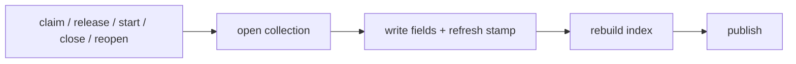

# 012 Schema and state model

## Overview

Extend the issue schema with identity, lifecycle, and grouping fields, and give
developers verbs to move an issue through its states without hand-editing YAML.

## Problem Statement

An issue records *what* was discovered but nothing about *who* holds it or
*where it stands*. The collection has grown to 350 issues across two
contributors, and the only recorded states are `open` and `closed`. A developer
cannot answer "what am I on the hook for?", "what is anyone actively working?",
or "of the work we closed, how much did we actually do rather than abandon?"

Two consequences compound as the collection grows:

- **Nobody's work is separable from anyone else's.** With the collection
  centralized on a shared branch, every contributor sees one undifferentiated
  pile.
- **Completion metrics overstate progress.** A `closed` issue that was abandoned
  or superseded counts identically to one that was finished.

Changing an issue's state today means editing frontmatter by hand — and when the
collection lives on a designated branch, that means driving a two-phase
begin/edit/commit door manually. That friction is tolerable for the single
`open → closed` transition; across a richer state model it guarantees the fields
go stale.

## User Stories

- As a developer, I can claim an issue so that my collaborators know it is
  spoken for.
- As a developer, I can mark an issue active so that I can distinguish the one
  thing I am working from the several things I hold.
- As a developer, I can close an issue with a reason so that abandoned work is
  not counted as completed work.
- As a developer, I can see who filed an issue so that I know whom to ask about
  a discovery I did not make.
- As a developer, I can release an issue I am not going to get to, and reopen
  one that turned out not to be finished, so that the recorded state keeps
  matching reality instead of drifting from it.
- As a contributor joining an existing collection, I can rely on historical
  issues carrying the same identity fields as new ones so that views over the
  collection are not split between a populated present and a blank past.

## Acceptance Criteria

**Schema**

- [ ] An issue records who filed it, who currently holds it, what kind of record
      it is, which umbrella body of work it belongs to, and — once it has been
      finished at least once — the outcome of the most recent finish.
- [ ] A newly filed issue has its filer recorded automatically, without the
      developer supplying it.
- [ ] An issue's holder is distinct from its lifecycle state: an issue can be
      held without being underway, and can be underway while its holder is
      recorded.
- [ ] An issue with no holder is a representable state, distinct from every
      lifecycle state.

**Lifecycle**

- [ ] An issue can be in one of three states: not started, underway, or
      finished.
- [ ] An issue that has ever been finished carries an outcome; one that never
      has carries none.
- [ ] The outcome distinguishes completed work from work that was declined,
      work superseded by another issue, and work that ceased to apply.
- [ ] An issue whose outcome is superseded identifies the issue that supersedes
      it.
- [ ] Reopening a finished issue returns it to not-started and preserves its
      outcome, so the reason it was previously finished survives the reopen.
- [ ] Whether an issue has been reopened is determinable from its recorded
      state alone, without a field dedicated to saying so.
- [ ] Finishing an issue that was previously finished and reopened replaces the
      earlier outcome with the current one.

**Transitions**

- [ ] A developer can claim, release, start, close, and reopen an issue through
      a single command each, without hand-editing the underlying record.
- [ ] Closing accepts an outcome; when none is given, the issue is recorded as
      completed.
- [ ] Starting an unheld issue also claims it for the developer starting it.
- [ ] Claiming an issue another developer holds is refused, and the refusal
      names the current holder. The developer can override the refusal to take
      it over.
- [ ] Any developer can close any issue, whether or not they hold it.
- [ ] Closing an issue preserves the record of who held it.
- [ ] Every transition updates the issue's last-modified stamp and refreshes the
      collection index. *(External Constraint — `issue` group blueprint
      § Invariants: `atomic-index-write`, "index regenerated on every write";
      last-modified refresh per `skills/issue/SKILL.md` § 6a.)*
- [ ] Every transition works identically whether the collection lives on the
      working branch or on a designated shared branch. *(External Constraint —
      `issue` group blueprint § Provides: `place.sh` placement door.)*

**Filer identity**

- [ ] When the developer's identity cannot be determined from the environment,
      filing an issue is refused and nothing is written.
- [ ] The refusal is reported as a fixed reason that names the missing
      identity and carries no issue content. *(External Constraint — `issue`
      group blueprint § Provides: "failures are fixed reason codes carrying no
      issue content".)*
- [ ] A recorded identity can never introduce additional fields into the issue
      record, whatever the environment supplied. An identity value that cannot
      be recorded safely is refused exactly as a missing one is.
- [ ] The form the recorded identity takes is a single documented choice applied
      uniformly, not a per-environment accident.

**Existing collection**

- [ ] Every issue in the existing collection carries the new fields after a
      one-time conversion.
- [ ] The filer of an existing issue is recovered from the collection's own
      history rather than assigned by default.
- [ ] The conversion previews what it will change before changing anything.
- [ ] If the filer of any issue cannot be recovered, the conversion reports
      every such issue and refuses to run rather than substituting a placeholder.
- [ ] Existing finished issues are recorded as completed.

**Integrity**

- [ ] The collection index reports any finished issue carrying no outcome.
      *(External Constraint — `issue` group blueprint § Provides: `index.sh`
      produces integrity warnings.)*
- [ ] The collection index reports any issue whose outcome is not a recognized
      value. *(External Constraint — same source.)*
- [ ] The collection index reports any issue whose kind or umbrella reference is
      not a recognized value. *(External Constraint — same source.)*
- [ ] Integrity reports identify offending issues without reproducing their
      body content. *(External Constraint — `issue` group blueprint
      § Invariants: `untrusted-body-never-shell`, and § Provides:
      untrusted-issue-content discipline.)*

## UI Mockup

```
$ /jim:issue claim 47
  #47  Add the cross-group contract graph and blast-radius
       claimed-by: you@example.com

$ /jim:issue claim 47                       # already held by someone else
  refused: #47 is held by sam@example.com
           re-run with --force to take it over

$ /jim:issue start 47                       # unheld -> claims, then starts
  #47  claimed-by: you@example.com
       status: open -> active

$ /jim:issue close 47
  #47  status: active -> closed
       outcome: done
       claimed-by: you@example.com          (kept)

$ /jim:issue close 51 --as wontfix
  #51  status: open -> closed
       outcome: wontfix

$ /jim:issue reopen 51
  #51  status: closed -> open
       outcome: wontfix                     (kept — reopened)
```

An open issue carrying an outcome is one that was finished and reopened; the
outcome names how it was finished last time:

```
  status   outcome    meaning
  ------   -------    -------
  closed   done       finished
  open     done       reopened — the fix did not hold
  open     wontfix    reopened — the decision was reversed
  open     (none)     never finished
```

Integrity reporting in the collection index. Records are named by slug rather
than by ordinal: the slug is what the file is called, and it survives an
ordinal being reassigned.

```
## Integrity Warnings

- `20260101-example` is closed but records no outcome.
- `20260102-example` unrecognized outcome: donw.
- `20260103-example` unrecognized type: epik.
```

A close naming no superseding issue is not in that list because it never
reaches the index: `--as duplicate` is refused at the transition unless the
record already names the superseding issue in its `duplicates` relation.

## Data Flow



## Out of Scope

- **Filtering and views over the new fields.** Selecting issues by holder,
  filer, kind, or umbrella is the following spec; this spec makes the data
  exist, not queryable.
- **Umbrella grouping behavior.** The kind and umbrella fields are recorded and
  validated here but nothing consumes them — derived membership, progress
  rollups, and umbrella views belong to the epics spec. They land now so the
  collection is converted once rather than twice.
- **Umbrella membership cardinality.** An issue may name several umbrellas and
  nothing enforces a limit. Whether a rollup that counts one issue under two
  umbrellas deduplicates, double-counts, or restricts membership is decided
  where those rollups are defined, not here.
- **Recording who closed an issue.** The holder is preserved as a record of who
  held the issue; a separate closed-by field is not added.
- **Tamper-evident attribution.** The holder field is a coordination signal, not
  a provenance guarantee. Any developer can take a held issue and any developer
  can close one, so the recorded holder is not evidence of who did the work and
  must not be relied on as such.
- **Reconciling one person's several identities.** jim maintains no mapping
  between a contributor's several addresses and does not merge them. Where the
  project's own version control already carries such a mapping, recovering an
  identity through it is not excluded — declining to honor a mapping that exists
  would be discarding information, not staying out of scope. What is excluded is
  jim authoring, storing, or requiring one.
- **Normalizing or obscuring the recorded identity.** The value is stored as the
  environment supplies it — not truncated, hashed, or mapped through a table.
  Which form that value takes is each contributor's own configuration decision,
  and a contributor who wants non-routable attribution configures a forge
  noreply address. The collection is published content, so this is a deliberate
  choice to store what version control already publishes rather than a
  reduction that a public commit history would defeat anyway.
- **Enforcing a project-wide identity policy.** Nothing refuses a filing because
  the configured identity is of the wrong kind. Requiring, say, that every
  recorded identity be non-routable would convert a personal preference into a
  project-imposed restriction and put a forge-specific pattern on the emitter's
  path; contributors decide for themselves.
- **Assignment by anyone other than the holder.** Claiming is self-service;
  there is no verb for assigning work to someone else.
- **Anything beyond the four outcomes.** No free-text closure notes, no
  per-outcome required metadata.
- **Outcome history deeper than the most recent closure.** An issue finished,
  reopened, and finished again carries only the latest outcome; the full
  sequence stays recoverable from version control, not from the record.
- **Reclassifying historical closures.** Every existing finished issue is
  recorded as completed; abandoned or superseded history is not reconstructed.

## Research & Architecture Handoff

*Implementation insights surfaced during scoping. These are context for the
architect — not requirements, not exclusions. Treat each as a starting point to
evaluate, not a directive.*

### Insight 1: Umbrella membership stored on one side only

- **Relates to AC:** *"An issue records ... which umbrella body of work it
  belongs to"*
- **Surfaced as:** a proposal to store membership as a bidirectional relation
  pair, mirroring the existing typed relations
- **Levelled-up requirement (already in the ACs):** the issue records its
  umbrella; nothing in the ACs constrains which side stores it
- **Deflection reason:** Delegation
- **Architect note:** The existing typed relations are written and
  integrity-checked on both sides. Storing membership only on the member — and
  deriving the umbrella's roster at index time — costs one write per change
  instead of two, needs no reciprocity check, and keeps an umbrella with many
  members from carrying a large list that must stay in sync. Cost: the umbrella
  record is no longer self-describing without the index. Weigh against the
  consistency of matching the existing relation pattern.
- **Routing hint:** Architect to decide

### Insight 2: Held-ness and blocked-ness as derived, not stored

- **Relates to AC:** *"An issue with no holder is a representable state,
  distinct from every lifecycle state"*
- **Surfaced as:** a proposal that "claimed" and "blocked" be values of the
  lifecycle state alongside not-started / underway / finished
- **Levelled-up requirement (already in the ACs):** an unheld issue is
  representable, and holder is independent of lifecycle state
- **Deflection reason:** Razor
- **Architect note:** Treating held-ness as a lifecycle value creates an
  invariant with no owner — a record marked "claimed" whose holder is absent is
  contradictory but structurally legal. Deriving it from whether a holder is
  recorded removes the contradiction by construction. The same argument applies
  to blocked-ness, which the existing dependency relations already determine:
  an issue is blocked exactly when something it depends on is unfinished.
  Storing either duplicates a fact that already exists elsewhere and can
  disagree with it.
- **Routing hint:** Architect to decide

### Insight 3: Recovering historical filers from version-control history

- **Relates to AC:** *"The filer of an existing issue is recovered from the
  collection's own history"*
- **Surfaced as:** deriving each issue's filer from the author of the commit
  that added its file
- **Levelled-up requirement (already in the ACs):** the filer is recovered from
  history rather than assigned by default
- **Deflection reason:** Delegation
- **Architect note:** History for the collection shows two distinct authors, so
  a blanket assignment would be measurably wrong. Complication: when the
  collection is centralized on a designated branch, the relevant history is that
  branch's, not the working branch's — and files that moved during
  centralization may not present their original creating commit. The
  refuse-loudly criterion exists precisely so this surfaces rather than silently
  degrading.

  **Prefer the mapping-aware form of the author field.** Version control offers
  two spellings of the commit author's address: a raw one and one that resolves
  through the project's own alias mapping if it has one. Verified this session
  against the exact creating-commit invocation the derivation needs — the
  mapping-aware form returns the mapped address where a mapping exists, and the
  raw address unchanged where none does. Choosing it costs a single character,
  adds no configuration, no mapping for jim to maintain, and nothing on any read
  path, while preventing one contributor's several addresses from splitting
  every by-person view. Choosing the raw form actively discards a mapping the
  project already has. This does not conflict with the Out of Scope exclusion on
  reconciling identities: jim still authors and stores no mapping.
- **Routing hint:** Researcher to investigate

### Insight 4: Transition verbs and the existing publish door

- **Relates to AC:** *"Every transition works identically whether the collection
  lives on the working branch or on a designated shared branch"*
- **Surfaced as:** the observation that the existing publish door accepts a
  fixed set of change verbs
- **Levelled-up requirement (already in the ACs):** transitions behave
  identically under either placement
- **Architect note:** The existing door's verb set is closed and appears in
  published commit messages, so the new transitions either extend that set or
  map onto an existing verb. The choice is externally visible in history. Note
  also that the current convention has agents editing issue files directly; five
  new verbs are the first mutation path that could be script-mediated
  end-to-end, which bears on whether the single-writer discipline extends to
  edits.
- **Routing hint:** Architect to decide

### Insight 5: Refusing to file without an ambient identity

- **Relates to AC:** *"When the developer's identity cannot be determined from
  the environment, filing an issue is refused"*
- **Surfaced as:** reading the filer from ambient version-control configuration
- **Levelled-up requirement (already in the ACs):** filing is refused rather
  than recording an empty filer
- **Deflection reason:** Constraint-Sourcing
- **Architect note:** Blast radius is wider than interactive capture: every
  group's end-of-phase candidate batch files through the same emitter, so an
  environment without a configured identity fails those batches too. The
  existing publish path sets a precedent by falling back to a synthetic identity
  when none is configured — but that is a commit author, which version control
  requires, not a durable data field. The precedent is deliberately not followed
  here.
- **Routing hint:** Architect to decide

### Insight 6: Where a previewed conversion should live

- **Relates to AC:** *"The conversion previews what it will change before
  changing anything"* (Existing collection)
- **Surfaced as:** a question about which existing migration surface should host
  the conversion
- **Levelled-up requirement (already in the ACs):** the conversion previews
  before it changes anything; nothing in the ACs names a surface
- **Deflection reason:** Delegation
- **Architect note:** The group's two migration surfaces divide by nature, and
  each states that division in its own header: one fills in **missing** data and
  documents that its writes have no preview form; the other **transforms
  existing** data behind a read-only preview, an explicit apply gate, and a
  plan-hash drift guard that refuses an apply whose preview has gone stale.
  This conversion straddles them — four of the five fields are missing-data
  fills, while the outcome field is derived from existing state — and the
  preview requirement currently only the transform surface satisfies.

  The developer expects **further issue-schema changes, and more
  backfill-shaped migrations, in future**. That changes the economics: a preview
  is not a one-off need on the fills-missing-data side but a recurring one. Two
  consequences worth weighing. First, hosting this conversion on the transform
  surface solves today's spec but leaves the next backfill facing the same
  question. Second, and more important, duplicating the preview / apply /
  drift-guard machinery into a second script would put *safety* code in two
  places — the worst category to duplicate, and a second instance of the
  same divergence risk already tracked for this group's two frontmatter
  parsers.

  Extracting the shared machinery so both surfaces compose it is therefore worth
  weighing against the cheaper hosting choices, using the group's established
  `BASH_SOURCE`-relative composition pattern. Whether that extraction belongs in
  this spec's scope or a follow-on is the architect's call; the ACs are
  satisfied either way.
- **Routing hint:** Architect to decide

## Open Questions

- [x] ~What form does the recorded identity take?~ → Whatever the environment
      supplies, unmodified. The form is already a per-contributor decision made
      where it belongs — in each contributor's own version-control config — so
      jim neither stores a preference nor imposes one. A contributor wanting
      non-routable attribution configures a forge noreply address; one happy to
      be reachable configures a real one. Both work with no jim-side branching.
- [x] ~Should the conversion run as a distinct operation or extend an existing
      conversion surface?~ → Not a spec question; the acceptance criteria
      constrain the conversion's observable behavior, not which surface hosts
      it. Routed to the architect — see Handoff Insight 6, which records the
      expectation that further schema changes will need the same guarantees.
- [x] ~Does an issue belong to at most one umbrella, or several?~ → Several;
      nothing enforces a count. Non-exclusive membership is the property this
      storage model was chosen for, and this spec consumes the field nowhere, so
      restricting it here would decide an umbrella-behavior question from a spec
      that cannot observe its consequences. Permitting many is also the
      reversible direction: a later constraint can be added against permissive
      data, where relaxing an enforced one would mean converting the collection
      a second time. How progress rollups treat an issue counted under two
      umbrellas is deferred to the epics spec, which defines those views.
- [x] ~Does starting an unheld issue claim it?~ → Yes, starting claims it.
- [x] ~What happens when claiming an issue another developer holds?~ → Refused,
      naming the holder; overridable to take it over.
- [x] ~Does closing require holding the issue?~ → No; anyone can close, and the
      holder record is preserved.
- [x] ~What happens when the filer of an existing issue cannot be recovered?~ →
      The conversion refuses rather than substituting a placeholder.
- [x] ~What happens when no identity is configured at filing time?~ → Filing is
      refused and nothing is written.
- [x] ~Do the umbrella fields ship here or with the epics spec?~ → Here, so the
      existing collection is converted once rather than twice.
