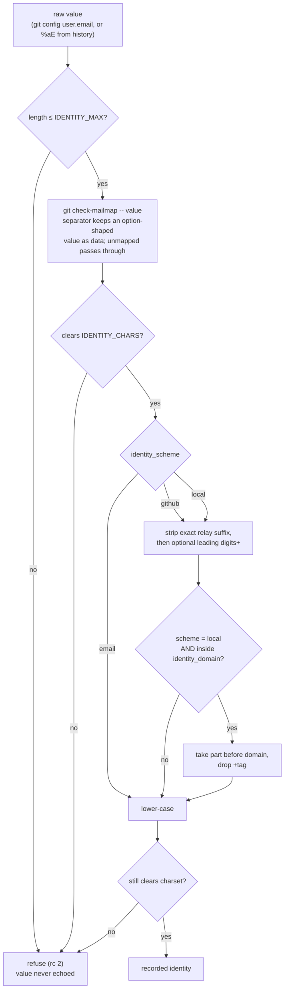
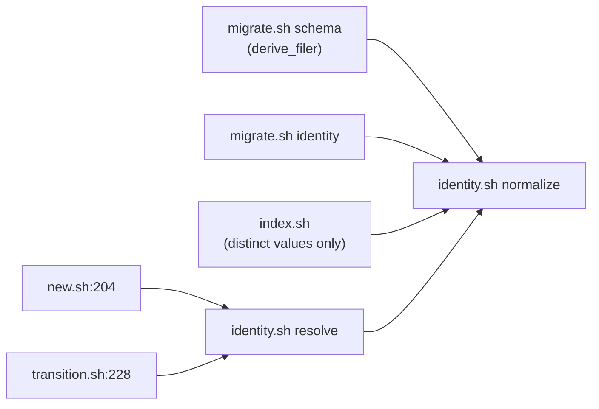

# Recorded identity schemes — Plan

## Overview

Add a third verb, `normalize`, to the one script that already decides what a
recordable identity is, and route every write path through it — so the emitter,
the transition verbs and the collection conversion cannot disagree. The two
rewrite operations become one new `migrate.sh` subcommand reusing the preview,
apply gate and drift guard the existing migrations already share.

## Design Decisions

### 1. The transformation is a third verb on `identity.sh`, not logic in callers

- **Chosen:** `identity.sh normalize <value>` alongside `resolve` and `validate`.
  `resolve` internally routes through it, so the environment path and the
  already-have-a-value path share one definition. `migrate.sh` calls `normalize`
  directly for identities recovered from history.
- **Why:** three call sites record an identity — `new.sh:204`, `transition.sh:228`,
  `migrate.sh:415`. The existing `resolve`/`validate` split exists precisely so
  those cannot drift; putting the form logic anywhere else re-opens exactly the
  gap that split was built to close. It also means `new.sh` and `transition.sh`
  need **no changes at all** — they already call `resolve`.
- **Rejected:** folding the logic into `resolve` only — the conversion never calls
  `resolve`, so converted and newly-filed issues would disagree permanently.
- **Rejected:** a separate `identity-form.sh` — a second script that must be kept
  in lockstep with the first is the drift this design is avoiding.

### 2. Pipeline order: length-gate → mailmap → validate → normalize → re-validate

- **Chosen:** bound the length first, resolve the alias mapping, run the full
  charset gate, extract/lower-case, then re-validate the result.
- **Why:** the mapping is keyed on **addresses**, so extraction must come after
  it or a mapping can never match (spec Insight 2). The charset gate must come
  after the mapping too, because a mapping can rescue an otherwise unrecordable
  source address — validating first would refuse a value the project has
  explicitly told us how to read. The length bound moves ahead of everything
  because it is the only step that protects the `git check-mailmap` invocation
  itself from an unbounded argument.
- **Why re-validate:** extraction only ever takes a substring and lower-cases,
  and `IDENTITY_CHARS` is closed under both, so the output is provably still in
  the set. The re-check costs one comparison and removes the need for anyone to
  re-derive that proof later.
- **The mapping call passes the value after an end-of-options separator.** The
  hyphen is a member of `IDENTITY_CHARS`, so an option-shaped value is not merely
  unvalidated at that point in the pipeline — it is *accepted* by the validator
  too, and reordering the pipeline would not change that. Verified against the
  installed git: `git check-mailmap "--help"` prints the manual page and
  `git check-mailmap "-x"` returns `error: unknown switch 'x'`, while
  `git check-mailmap -- "-x"` returns `<-x>` as data. The separator is the whole
  fix; without it the value crosses from data into control.
- **Rejected:** validate-then-mailmap — refuses values the mapping would fix, and
  does not address the option-shaped case anyway.
- **Rejected:** mailmap with no length bound — hands an unbounded value to git.
- **Rejected:** excluding the hyphen from the charset — it is legal in real
  addresses, and the separator solves the problem without narrowing what a
  contributor may be called.

### 3. Two bare-name config keys in a new `identity_*` prefix arm

- **Chosen:** `identity_scheme` (default `github`) and `identity_domain`
  (default empty), registered in `jimconf.sh`'s `KEYS`, `default_for`, and a new
  `identity_*` arm in the bare-name branch at `:237`.
- **Why:** neither key is a path, so both need the bare-name arm. Omitting the
  arm is not a soft failure — the resolver would look up `identity_scheme_path`
  and silently return the default, so a project that configured the documented
  name would see no effect at all. This is the documented failure mode of the
  `issue_placement` key, called out in that file's own comments.
- **Rejected:** one combined key (`identity_scheme = "local:company.com"`) —
  packs two values into one string and forces a parser where the resolver
  already has a grammar.

### 4. `identity.sh` gains `-c <config>` forwarding

- **Chosen:** the `jf`/`jc` helper pattern `migrate.sh` already uses.
- **Why:** `identity.sh` now reads configuration, and `migrate.sh` runs under an
  explicit `-c` in its tests. Without forwarding, a conversion under a test
  config would resolve the scheme from the ambient project instead. The other
  callers need nothing: `jimconf.sh` reads `./jimconf.toml` relative to PWD, and
  `run_identity` already runs with CWD inside the fixture.
- **Rejected:** an environment variable — a second configuration channel beside
  the resolver, which is the thing the resolver exists to be.

### 5. One `migrate.sh identity` subcommand with two modes

- **Chosen:** `migrate.sh identity [--from X --to Y | --renormalize]`, sharing
  one plan builder, preview, `gate_apply` and apply path.
- **Why:** the two operations differ **only** in where the new value comes
  from — supplied for a remap, computed for a re-normalization. Everything else
  (row shape, hash, drift refusal, atomic write, index regeneration) is
  identical. `gate_apply`'s own comment states that a second copy of the refusal
  is the one duplication worth avoiding outright; two subcommands would grow a
  second copy of everything around it too.
- **Rejected:** two subcommands over shared internals — duplicates the argument
  parsing and the `route_placement` token for no behavioral gain.

### 6. The mismatch surface normalizes distinct values, not records

- **Chosen:** `index.sh` collects the **distinct** recorded identities, shells
  out to `identity.sh normalize` once per distinct value, and compares.
- **Why:** a collection has a handful of distinct identities and hundreds of
  records. Per-record invocation would be ~350 subprocesses on a path that runs
  on **every write**; per-distinct-value is 2–5. This keeps the single-definition
  rule (no re-implementation of the form logic inside `index.sh`) without paying
  for it per record.
- **Rejected:** re-implementing extraction inline in `index.sh` — a second copy
  of the rule, on the one path that runs most often.
- **Rejected:** per-record invocation — correct and unaffordable.
- **An unresolvable scheme omits the warning rather than assuming one.**
  `jimconf.sh` refuses instead of defaulting when a run starts below the project
  root, and that distinction has to survive here: computing the comparison under
  a guessed form would write a wrong warning into content the project publishes.
  Absent configuration takes the documented default; a *failed* read does not.
- **Slugs pass through the existing row sanitizer.** `index.sh` already
  sanitizes every value it interpolates into generated rows, and a warning that
  names records is no exception.
- **No suppression knob.** The warning cannot be silenced by configuration. A
  signal that can be turned off stops being a signal, and this project has
  already made that call twice — a degraded read carries a non-zero status rather
  than trusting a message to be read, and the organization-local form refuses
  outright rather than warning. The repetition objection also does not hold:
  this warning has an exit condition. Running the re-normalization clears it, so
  it is a finite prompt to finish a migration, not a permanent nag.

### 7. Relay recognition: exact suffix, then an *optional* leading id

- **Chosen:** strip the exact service suffix; from the remainder strip a leading
  `<digits>+` if present.
- **Why:** the forge issues two forms (id-bearing and name-only). Keying on the
  separator alone would rewrite ordinary tagged mail; requiring the id would
  leave every pre-cutoff contributor recorded as a full address while everyone
  else got a handle — the identity split this spec exists to close, inside the
  default scheme.
- **Rejected:** splitting on `+` — plus-addressing is ordinary mail.

### 8. The ambiguity check lives in the plan builder, not in `normalize`

- **Chosen:** the collision comparison runs over a built plan in `migrate.sh`.
  `identity.sh normalize` transforms one value and knows nothing about the
  collection.
- **Why:** it satisfies both halves of the spec at once — bulk operations refuse
  the whole run, while single-record writes are judged only against the identity
  being written, because the check simply is not on that path. A check inside
  `normalize` would have to read the collection on every filing, which is both
  the denial-of-service the spec forbids and a read the emitter has no reason to
  perform.
- **Rejected:** a collection-wide check inside `identity.sh` — one colliding pair
  would block all capture.

### 9. Fix the two pre-existing index-regeneration twins in the same pass

- **Chosen:** `apply_plan` (`migrate.sh:331`) and `apply_schema_plan` (`:519`)
  both stop discarding `index.sh`'s exit status; the new identity apply path is
  written correctly from the start.
- **Why:** all three sit in one file. Writing the third correctly and leaving two
  neighbours reporting success over an index that failed to regenerate is drift
  by construction — the next reader copies whichever one they see first. The
  correct pattern is two files away in `transition.sh:280` and `reconcile.sh:244`.
- **Note:** this is **not** from this spec's acceptance criteria. It is a fix the
  developer authorized during the previous spec's blueprint fork; the ledger
  records it as `fixed=1` but the code change never landed. Flagged rather than
  folded in silently.
- **Rejected:** deferring it — leaves the ledger asserting something untrue.

## Constitution Check

**ARCHITECTURE.md status:** Present — constraints noted below.

| Constraint from ARCHITECTURE.md | Honored? | Notes |
| :--- | :--- | :--- |
| Bash + POSIX only, no third-party deps | Yes | No `jq`; `git`, `grep`, `sed`, `tr` only |
| `set -uo pipefail`, not `set -e` | Yes | Existing preamble unchanged |
| `BASH_SOURCE`-relative inter-script composition | Yes | `identity.sh` reaches `jimconf.sh` the way `new.sh` does |
| Never `source`/`eval` user-supplied data | Yes | Config and identities are compared, never evaluated |
| Positively enumerated charset, fail closed | Yes | Extended to the new domain setting (Task 6) |
| Refusals carry no rejected value | Yes | Preserved; the ambiguity refusal names records, not addresses |
| No spec IDs / artifact refs in script comments | Yes | Comments describe current behavior only |
| Single resolver, many consumers | Yes | `identity.sh` chains to `jimconf.sh`, not to a second config path |
| § Security Considerations → Recorded identity | **No — superseded** | That paragraph states the value is "not normalized… or mapped". This plan reverses it. The build-completion `/jim:arch` refresh replaces the paragraph including its security rationale (spec Insight 8) |

## File Manifest

| Component | File Path | Action | Notes |
| :--- | :--- | :--- | :--- |
| Recordable identity | `skills/issue/scripts/identity.sh` | Update | `normalize` verb, config read, mailmap resolution, `-c` forwarding |
| Config resolver | `skills/conf/scripts/jimconf.sh` | Update | `identity_scheme` / `identity_domain` in `KEYS`, `default_for`, new `identity_*` bare-name arm |
| Config reference | `jimconf.toml.example` | Update | Commented block documenting both new keys |
| Migrations | `skills/issue/scripts/migrate.sh` | Update | `identity` subcommand, `-c` forwarding to `identity.sh`, conversion records the normalized form, two index-status fixes |
| Index generation | `skills/issue/scripts/index.sh` | Update | Configured-form mismatch warning |
| Issue tests | `tests/issues.sh` | Update | New identity-form, mailmap, rewrite and mismatch cases; two existing comments corrected |
| Config tests | `tests/jimconf.sh` | Update | New key family cases |

`new.sh` and `transition.sh` are **deliberately absent** — both already call
`identity.sh resolve`, which is where the form is applied (Decision 1).

## Interface Contracts

```text
identity.sh — CLI

  bash identity.sh [-c <config>] resolve
      The environment's identity, mapped and normalized. stdout: one value.
  bash identity.sh [-c <config>] validate <value>
      Judge one already-obtained value. Unchanged behavior. stdout: the value.
  bash identity.sh [-c <config>] normalize <value>
      Map and normalize one already-obtained value. stdout: one value.

  Exit codes (unchanged set; `normalize` reuses them):
    0  resolved / accepted — the value is on stdout
    1  none configured, or an empty value — nothing on stdout
    2  present but not recordable, a usage error, OR a configuration that
       cannot select a form — nothing on stdout

  A form that cannot be applied (organization-local with no domain, a domain
  outside the accepted charset, a domain naming several) exits 2 and names the
  setting on stderr. It never names an identity value.

config keys (jimconf.sh, bare-name family)

  identity_scheme   email | github | local          default: github
  identity_domain   one domain, charset-gated       default: "" (empty)

  An unrecognized identity_scheme is REFUSED (exit 2), naming the setting.
  It does not fall back to the default: a mistyped form would otherwise record
  every identity under a form the project did not choose, on the strength of a
  stderr note the spec already judged too weak to rely on for the parallel
  domain case.

migrate.sh — CLI additions

  bash migrate.sh [-c <cfg>] identity [<dir>] --renormalize
  bash migrate.sh [-c <cfg>] identity [<dir>] --from <old> --to <new>
      PREVIEW (read-only): plan + summary + PLAN-HASH + mapping disclosure.
  bash migrate.sh [-c <cfg>] identity [<dir>] <mode> --apply [--expect <hash>]
      APPLY: rewrite filed-by / claimed-by + regenerate INDEX.

  Neither mode flag, or both, exits 2 having written nothing.

  Plan row (TAB-separated), one per issue:
      <action>\t<slug>\t<field>\t<old>\t<new>
      action ∈ rewrite | unchanged | ambiguous
```

## Data Flow





## Task Breakdown

1. [ ] Register `identity_scheme` and `identity_domain` in `jimconf.sh` — add both
   to `KEYS`, add defaults (`github`, empty) to `default_for`, and add an
   `identity_*` arm to the bare-name branch. Document both in
   `jimconf.toml.example`, which is the reference a user reads to discover a key
   exists; a key that resolves and changes how every identity is recorded but
   appears in no reference is a key nobody finds. Update the exact-key-list
   assertion in the config tests, which breaks whenever `KEYS` grows.
   **Verify:** `bash tests/jimconf.sh identity`

2. [ ] Add `-c <config>` parsing and a `jc` helper to `identity.sh`; read
   `identity_scheme`, validating it against the closed set and **refusing**
   anything outside it, naming the setting. An absent key takes the default; an
   unrecognized value is a refusal, not a fallback — the same call the spec made
   for a form that cannot be applied.
   **Verify:** `bash tests/issues.sh identity_scheme`

3. [ ] Add the `normalize` verb performing lower-casing only, under every form.
   Depends on task 2.
   **Verify:** `bash tests/issues.sh identity_normalize_case`

4. [ ] Extend `normalize` with relay extraction: strip the exact service suffix,
   then an optional leading `<digits>+`. Both forge forms yield the same account
   name; an address merely carrying a tag is untouched; an empty result yields
   the original. Depends on task 3.
   **Verify:** `bash tests/issues.sh identity_normalize_relay`

5. [ ] Extend `normalize` with the organization-local form: inside
   `identity_domain`, take the part before the domain and drop any `+tag`;
   outside it, fall through to the relay rule. Domain comparison is
   case-insensitive. Depends on task 4.
   **Verify:** `bash tests/issues.sh identity_normalize_local`

6. [ ] Gate `identity_domain`: refuse a value outside the accepted charset,
   refuse a value naming several domains, and refuse every identity-recording
   operation when the form is `local` and no domain is set — each naming the
   setting, never a value. Depends on task 5.
   **Verify:** `bash tests/issues.sh identity_domain`

7. [ ] Insert alias resolution ahead of extraction in `normalize`, after the
   length bound and before the charset gate, per the Data Flow order. The value
   is passed after an end-of-options separator (`git check-mailmap -- "<value>"`)
   so an option-shaped identity is read as data — see Decision 2.
   Depends on task 6.
   **Verify:** `bash tests/issues.sh identity_mailmap`

7a. [ ] Add regression cases for option-shaped identities — at minimum `--help`,
    `-x` and `--stdin` — asserting each is treated as a value and none reaches
    git as an option. The charset admits leading hyphens by design, so this is a
    permanent property to pin rather than a one-off fix. Depends on task 7.
    **Verify:** `bash tests/issues.sh identity_option_shaped`

8. [ ] Route `resolve` through the full pipeline so the environment path and the
   already-have-a-value path share one definition. Depends on task 7.
   **Verify:** `bash tests/issues.sh identity_resolve`

9. [ ] Correct the two existing identity case comments that assert the reversed
   stance ("the form … is the contributor's own configuration decision, not
   jim's"), and add a case using a real `users.noreply.github.com` address —
   every current fixture uses `example.com`/`example.test`, so the new default is
   inert against them and the real suffix is untested.
   **Verify:** `bash tests/issues.sh identity_`

10. [ ] Forward `-c` from `migrate.sh` to `identity.sh`, and change the schema
    conversion to record the normalized form rather than the validated raw value.
    Depends on task 8.
    **Verify:** `bash tests/issues.sh migrate_schema`

11. [ ] Add the `identity` subcommand skeleton to `migrate.sh` — argument
    parsing, mode exclusivity (neither or both exits 2), `usage()` entry, and the
    `route_placement` token.
    **Verify:** `bash tests/issues.sh migrate_identity_usage`

12. [ ] Implement the re-normalization plan builder and preview, including the
    disclosure of whether an alias mapping was found and how many records it
    altered. Depends on tasks 10, 11.
    **Verify:** `bash tests/issues.sh migrate_identity_renormalize`

13. [ ] Implement the remap mode (`--from`/`--to`), covering both `filed-by` and
    `claimed-by`. Depends on task 12.
    **Verify:** `bash tests/issues.sh migrate_identity_remap`

14. [ ] Add the ambiguity check over the built plan: two distinct source values
    normalizing to one identity refuse the whole run, naming the colliding
    records and the single produced value — never the two source addresses.
    Depends on task 13.
    **Verify:** `bash tests/issues.sh migrate_identity_ambiguous`

15. [ ] Implement the apply path: `gate_apply` drift refusal, per-file atomic
    tmp+mv, then index regeneration whose failure is surfaced and carried rather
    than discarded. Depends on task 14.
    **Verify:** `bash tests/issues.sh migrate_identity_apply`

16. [ ] Fix the two pre-existing twins that discard `index.sh`'s exit status and
    then report success — `apply_plan` (`:331`) and `apply_schema_plan` (`:519`) —
    following `transition.sh:280`. See Decision 9: authorized previously, not
    from this spec's ACs.
    **Verify:** `bash tests/issues.sh migrate_index_failure`

17. [ ] Add the configured-form mismatch warning to `index.sh`, normalizing
    distinct recorded values only, naming affected records and their count with a
    bounded list and a counted tail, and never naming an identity value. Slugs
    compose through `index.sh`'s existing row sanitizer, like every other value
    it interpolates into generated rows. A scheme that cannot be resolved omits
    the warning and says so, rather than computing it under an assumed form. No
    configuration silences it — see Decision 6. Depends on task 8.
    **Verify:** `bash tests/issues.sh index_identity_mismatch`

18. [ ] Add a case proving a colliding pair present in the collection blocks
    neither a filing nor a transition — the single-record write paths are judged
    only against the identity being written. Depends on task 17.
    **Verify:** `bash tests/issues.sh identity_collision_does_not_block`

19. [ ] Add a case proving a read shows the stored value verbatim and triggers no
    normalization, mapping or re-derivation at display time.
    **Verify:** `bash tests/issues.sh render_identity_verbatim`

20. [ ] Full suite green.
    **Verify:** `bash tests/issues.sh && bash tests/jimconf.sh && bash tests/scripthygiene.sh`

## Requirements Coverage Summary

| Spec Acceptance Criterion | Addressed In Task(s) |
| :--- | :--- |
| A project selects one of three forms; project-wide, not per contributor | 1, 2 |
| The forms are ordered; each contains the one below it | 4, 5 |
| One form applies no extraction at all | 3 |
| By default a project extracts forge relay account names | 1, 4 |
| Every recorded identity is lower case, under every form | 3 |
| A relay address records as the account name it carries | 4 |
| Every relay form the forge issues records as the same account name | 4, 9 |
| Ordinary mail resembling a relay address is recorded unchanged | 4 |
| A relay address yielding no account name is recorded unchanged | 4 |
| Inside the configured domain, record the account part | 5 |
| Outside the domain, record as the form below would | 5 |
| A `+tag` is not part of the recorded account | 5 |
| Domain comparison ignores case | 5 |
| The domain setting names exactly one domain | 6 |
| The domain clears a positively enumerated charset | 6 |
| `local` with no domain refuses, naming the setting | 6 |
| A mapped address records as the form of what it maps to | 7 |
| Alias resolution applies everywhere an identity is recorded | 7, 8, 10 |
| An unmapped address is carried through unchanged | 7 |
| A preview discloses mapping use, presence and record count | 12 |
| A whole-collection operation refuses on a collision | 14 |
| A single-identity write is judged only against what it writes | 18 |
| Case-only differences are one address, not a collision | 3, 14 |
| An unrecordable-value refusal names neither value nor content | 6 |
| An ambiguity refusal names records and the produced value | 14 |
| An operator can replace one identity with another, explicitly | 13 |
| The replacement covers every identity field incl. the holder | 13 |
| An operator can re-apply the current form with no mapping | 12 |
| Both operations preview and write nothing until applied | 12, 13, 15 |
| An apply is refused when the collection changed since preview | 15 |
| A configured-form mismatch is surfaced without a rewrite | 17 |
| A view shows the identity recorded in the file | 19 |
| Recovering historical filers records the current form | 10 |

No `[NEEDS CLARIFICATION]` items — every criterion maps to at least one task.

## Out of Scope

- **The `ARCHITECTURE.md` § Recorded identity paragraph.** Superseded by this
  plan, but rewritten by the `/jim:arch` refresh the build-completion gate runs.
  Pipeline-owned maintenance, not a deferral and not an issue.
- **Re-running the collection conversion.** This plan makes the conversion write
  the normalized form; running it over the real collection is an operator action
  the developer takes deliberately, after this lands.
- **A second forge's relay format.** Spec-excluded; the recognition is written so
  another is a small addition, but none is added here.
- **Multi-domain organizations.** Spec-excluded.
- **`SKILL.md` documentation of the new subcommand and keys.** The `issue` skill's
  `allowed-tools` grant is separately known to be missing `transition.sh` and
  `migrate.sh` entirely; folding a new verb into that grant belongs with that
  fix, not scattered across two changes.
- **Read-time identity resolution.** Explicitly excluded by the spec; task 19
  exists to prove it stays excluded.

## Open Questions

- [x] ~Does `identity.sh` need `-c`, given the other callers do not?~ → Yes, for
      `migrate.sh`, which runs under an explicit `-c` in its tests; without it a
      conversion under a test config would read the ambient project's scheme.
- [x] ~Where does the ambiguity check live?~ → The plan builder, not `normalize`.
      That placement satisfies both the bulk-refusal and the
      no-capture-DoS criteria without a branch.
- [x] ~Will the default scheme break existing tests?~ → No. Every current fixture
      uses `example.com` / `example.test`, so relay extraction is inert against
      all of them. Only two comments state the reversed stance (task 9).
- [x] ~Should `index.sh`'s mismatch warning be suppressible while a
      re-normalization is the known next step?~ → No, and no knob is built. A
      signal that can be switched off stops being a signal, which is the call
      this project already made for a degraded read (non-zero status rather than
      a message) and for the organization-local form (refuse rather than warn).
      The repetition objection does not survive inspection either: the warning
      has an exit condition — running the re-normalization clears it — so it
      prompts the operator to finish a migration rather than nagging forever.
