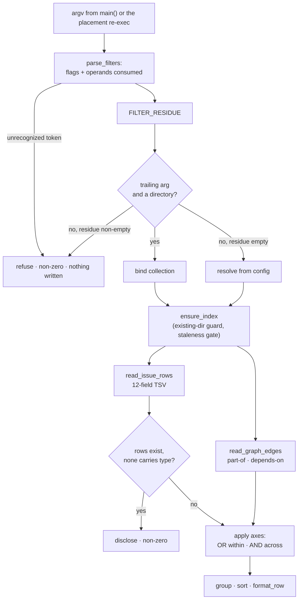

# Read-view filter composition — Plan

## Overview

Widen the index's Issues row with the four scalars the new axes need, then put
one shared filter parser in front of both read views — reading umbrella and
dependency axes from the Graph section the index already writes, rather than
adding them to the row.

## Design Decisions

### 1. One argument grammar, read the same way by both readers

- **Chosen:** `parse_filters` consumes every flag and its operand first,
  removing both from the argument list. The existing trailing-directory check
  then runs over what remains — **and `dir_given`, which decides routing before
  any verb runs, reads arguments by the same grammar.** Two readers of one argv
  that disagree will disagree exactly where it is least visible: `dir_given`
  chooses *which collection* a read serves, so a grammar it alone gets wrong
  produces a correct-looking answer over the wrong data.
- **Precedence, stated rather than emergent:** a reserved word always reads as a
  filter and never as a collection. The two readers disagree about this today —
  `dir_given` guards its single-argument branch with `! is_filter_token` and
  `cmd_list`'s shape read does not — so unrouted, `list open` with a directory
  named `open` present binds it as the collection and applies no filter.
  Classifying first fixes it by construction, at the cost of one corollary worth
  naming: a directory whose name collides with a reserved word can no longer be
  passed as a collection.
- **Why:** the collection is identified today by *shape* — the trailing
  argument, and only when it is a directory. That is safe only because no
  reserved bare word plausibly names a directory. A flag operand can land in
  trailing position, and the failure is silent rather than loud: in this very
  repository, `list --label docs` would take `docs` as the collection and print
  `_No matching issues._` instead of filtering by that label. Verified against
  the current script — `render.sh list docs` already reads `docs` as a
  collection today.
- **Rejected:** requiring the collection before any flag — it changes an
  existing calling convention, including the placement re-exec that appends the
  materialized directory as the trailing argument. **Rejected:** a `--`
  separator — it pushes the problem onto every caller, and the re-exec in
  `route_placement` emits no such separator.

### 2. Four scalars widen the row; umbrella and dependency come from the Graph

- **Chosen:** `type`, `filed-by`, `claimed-by`, and `outcome` are rendered into
  the Issues row. `part-of` and `depends-on` are read from the index's Graph
  section, which already carries both.
- **Why:** `parse_relations` is type-agnostic, so `part-of` is already emitted
  as a Graph edge, and `cmd_stats` already parses that section. Adding a
  `part-of` row column would duplicate a fact the index already holds in a form
  the scripts already read, and would leave the epic increment's derived roster
  reading from a different place than the graph it renders.
- **Rejected:** a fifth row column for `part-of` — duplication with no gain.
  **Rejected:** a second machine-readable index section — roughly doubles a
  140 KB file and adds a second atomicity and staleness question to invariants
  written around one index. **Rejected:** re-reading frontmatter per query — a
  third frontmatter parser reproducing the timestamp degradation and the
  frontmatter-bounded discipline.

### 3. One parser, two callers

- **Chosen:** a single `parse_filters` invoked by `cmd_list` and `cmd_stats`.
- **Why:** both need identical vocabulary, identical combining rules, and
  identically-ordered refusal. `cmd_stats` ignores the axes it has no use for
  rather than rejecting them.
- **Rejected:** a parser per verb — two places for the ordering property to
  drift, and the ordering is what keeps a read verb from touching disk.

### 4. `need_operand` is a declared sibling, not a silent copy

- **Chosen:** implement it in `render.sh` with its own option list, carrying a
  marker that states it mirrors `migrate.sh`'s helper in *shape* while differing
  in content by construction.
- **Why:** `cross-copy-lockstep` reads a sync marker as an assertion of
  byte-identity, and these two cannot be byte-identical — each script's option
  list is its own. The invariant's own remedy is that a deliberate difference
  declares itself, which is exactly how `place.sh`'s branch-name gate handles
  the containment rule it does not mirror.
- **Rejected:** an unmarked copy — an intended asymmetry that reads as drift.
  **Rejected:** lifting it to a shared file — neither script sources the other,
  and creating a shared library for one 14-line helper is a larger structural
  change than the feature warrants.

### 5. The Graph edge parse is unified, and the slug pattern widened

- **Chosen:** one `read_graph_edges` helper matching the id charset, used by the
  two existing callers and the two new axes.
- **Why:** both current readers match `[a-z0-9-]+` while `is_valid_id` allows
  `^[A-Za-z0-9][A-Za-z0-9._-]*$`, so under `issue_id_prefix=project` every edge
  touching an uppercase or dotted id is silently dropped. `blocked` and
  `--epic` would otherwise become copies three and four of a pattern already
  known to be wrong.
- **Scope of "the id charset":** the helper implements the character class
  only — `is_valid_id` is that class *plus* an emptiness check, a 128-character
  cap, and an explicit `..` rejection applied before the regex. The helper is
  therefore laxer, and that is safe here for one reason worth writing down: an
  edge slug is only ever compared against a row slug, never composed into a path
  or opened, so `id-gate-before-path` is not in play. The helper says so at its
  definition.
- **Rejected:** leaving it and relying on the filed issue — the record exists
  (`20260825-graph-edge-readers-narrow-slugs-below-what-is-valid-id-allows`),
  but shipping two new consumers of a known-wrong pattern costs more than the
  wider diff saves. **Rejected:** calling `is_valid_id` per edge — a subshell per
  edge for a check no path depends on.

### 6. A pre-widening index is detected from data, not from a stamp

- **Chosen:** *rows exist but none carries `type`* identifies an index written
  before the row was widened.
- **Why:** `type` is non-empty on every record after the 012 conversion, so the
  condition is derivable with no schema version, no marker, and no transition
  code. The view then discloses and fails rather than reporting an empty match.
- **Rejected:** an embedded schema stamp or index version field — transition
  scaffolding for a one-time condition whose repair is a single regeneration.

### 7. No filter value reaches awk as program text

- **Chosen:** axis comparisons happen in shell over rows already loaded; the
  Graph parse stays a single-quoted awk literal that takes no filter value at
  all.
- **Why:** concatenating a value into an awk program is injection into the
  interpreter, and `-v` is separately unsafe here because it expands escape
  sequences in its operand — the reason these scripts already pass values
  through the environment.
- **Rejected:** passing filter values via `ENVIRON` — safe, but unnecessary once
  the comparisons live in shell, and it would put a value into awk for no gain.

### 8. Prefix matching is literal

- **Chosen:** the pattern operand of every prefix comparison is quoted, so
  `*`, `?`, and `[` in a filter value match themselves.
- **Why:** `[[ "$origin" == "$prefix"* ]]` is literal only because `$prefix` is
  quoted; unquoted, a value containing a metacharacter silently widens a query
  the developer narrowed.
- **Rejected:** stripping metacharacters from the value — it would make a
  legitimate origin containing one unreachable.

### 9. An ad-hoc column selection refuses; the configured default still degrades

- **Chosen:** `--cols` refuses an unrecognized token and names the recognized
  set; `issue_list_cols` keeps falling back to the default set.
- **Why:** a flag is this invocation's explicit ask and should fail loudly; a
  standing setting whose typo broke every read would make the collection
  unreadable for a formatting mistake.
- **Rejected:** making both refuse — see above. **Rejected:** making both
  degrade — silently discarding what the developer typed this run is the failure
  the parse surface exists to stop.

### 10. Identity normalization is memoized per distinct value

- **Chosen:** an associative array keyed by raw value, mirroring `index.sh`'s
  `ident_seen`.
- **Why:** `identity.sh normalize` is a subprocess; per-record invocation over
  350 records is 350 forks for at most a handful of distinct identities.
- **Rejected:** normalizing per row — same result, two orders of magnitude more
  process spawns.

### 11. An echoed token is sanitized like a rendered row value

- **Chosen:** a refusal that quotes the offending token strips control
  characters and bounds its length first, matching what `row_safe` already does
  for values rendered into the index.
- **Why:** echoing an operator's own token discloses nothing, so quoting it is
  right — but stderr is a rendered surface like an index row, and the project
  already decided that argument once. A token carrying terminal escape sequences
  should not reach a terminal intact merely because it arrived through argv
  rather than through a file.
- **Rejected:** echoing raw — two surfaces rendering untrusted-shaped text under
  two different rules. **Rejected:** omitting the token — it is the most useful
  word in the message, and the operator typed it.

## Constitution Check

**ARCHITECTURE.md status:** Present — constraints noted below. The `issue` group
blueprint (`docs/specs/issue/000-blueprint/spec.md`) and `BLUEPRINT.md` were read
as locked constraints alongside it.

| Constraint | Honored? | Notes |
| :--- | :--- | :--- |
| `id-gate-before-path` (critical) | Yes | No filter value is composed into a path. `--spec` resolves against the specs root only to build a string compared against `origin`; nothing is opened from it. `show`'s existing indexed-set resolution is untouched. |
| `issue-file-never-sourced` (critical) | Yes | Every new axis reads the generated index. No issue file is read, sourced, or evaluated by the filter path. |
| `atomic-index-write` (medium) | Yes | Row widening rides the existing tmp+mv write in `index.sh`; no new write path. |
| `staleness-gated-reads` (medium) | Yes — extended | Task 11 extends the existing rule from "index could not be rebuilt" to "index cannot answer the axis named", disclosing on stderr with a non-zero status. Same principle, wider trigger. |
| `insights-capability-boundary` (high) | Yes | The analyst's `Bash(… render.sh *)` grant admits every new flag by construction; all are read-only and none reaches a write. Task 5's ordering and `ensure_index`'s existing existence guard both keep a read from creating a collection. |
| `cross-copy-lockstep` (high) | Yes | DD 4 declares the `need_operand` asymmetry in its own marker; DD 5 removes a genuine unmarked divergence rather than adding two more copies of it. |
| `untrusted-body-never-shell` (critical) | Yes | No issue body is read. Filter values are operator-supplied, and DD 7 keeps them out of awk program text. |
| `identity-validated-before-record` (critical) | Not engaged — see note | The invariant governs identities that are *written*. A person filter compares and never records, so no new value reaches a write path. Task 8 routes query values through the same `identity.sh normalize` the write paths use, so the definition stays single even though the invariant does not reach reads. Flagged for the blueprint refresh below. |
| `ARCHITECTURE.md` § Skills — awk values via environment, never `-v` | Yes | DD 7. |
| `ARCHITECTURE.md` § Plugin Conventions → Scripting Layer | Yes | Bash + POSIX only, `set -uo pipefail`, no new dependency. |
| `CLAUDE.md` → Bash scripts — no spec IDs in comments | Yes | Task comments describe current behavior; no spec, AC, or issue number appears in any script comment. |

**Blueprint face changes this plan causes** (recorded for the `/jim:blueprint`
refresh at build completion, not actioned here — the blueprint is present-tense):

- `render.sh` **read views** — the guarantee gains composed filtering over a
  reserved vocabulary, refusal before the collection binds, and the widened
  axis-answerability disclosure.
- `identity.sh` **recordable identity** — its guarantee enumerates the three
  write paths the single definition governs. This plan adds the first *read*
  consumer of the same definition, so the enumeration stops being exhaustive.
- `index.sh` **index generation** — the Issues section it produces carries four
  further fields. The stated guarantees (line-oriented parse, atomic write) are
  unchanged.

## File Manifest

| Component | File Path | Action | Notes |
| :--- | :--- | :--- | :--- |
| Index rows | `skills/issue/scripts/index.sh` | Update | Render `type` / `filed-by` / `claimed-by` / `outcome` into the Issues row through the existing sanitizer. |
| Read views | `skills/issue/scripts/render.sh` | Update | Widened row reader, shared filter parser, operand-aware directory read, filter-aware `dir_given` so routing and binding read one grammar, unified Graph-edge parse, new axes, new columns, `--cols`, disclosures, help text. |
| Skill docs | `skills/issue/SKILL.md` | Update | The `list` verb's argument description and the new `stats` filtering surface. |
| Tests | `tests/issues.sh` | Update | New `case_*` functions for each task below. |

No file outside the `issue` group's declared territory is written. The
`ARCHITECTURE.md` refresh is the build-completion gate's, not a task here.

## Interface Contracts

**Widened `INDEX.md` Issues row.** Existing keys keep their order and meaning;
new keys append, each emitted only when the record carries a value, each passed
through `row_safe`:

```
- `<slug>` — <title> · status: <s> · num: <n> · priority: <p> · created: <ts>
  · labels: [<csv>] · origin: <path> · type: <t> · filed-by: <id>
  · claimed-by: <id> · outcome: <o>
```

**Widened `read_issue_rows` TSV.** Twelve TAB-separated fields; absent values
render as `-` exactly as the existing five do. Unknown keys in a row are
ignored, as today:

```
slug \t num \t status \t prio \t created \t labels \t title \t origin
     \t type \t filed_by \t claimed_by \t outcome
```

**`parse_filters <args...>`** — classifies every argument, refuses on the first
unrecognized one, and leaves the residue for the caller:

```
Populates, in the caller's scope:
  FILTER_AXIS[<axis>]   space-separated alternatives for that axis
                        axes: status priority type label epic filed-by
                              claimed-by spec origin held blocked
  FILTER_COLS           column selection from --cols, or empty
  FILTER_RESIDUE[]      arguments that are not filters (at most the collection)
Returns 0 on success; 1 having written nothing on any refusal.
Refusals: unrecognized bare word · unknown flag · flag with no operand
          · flag whose operand is another known flag · unknown column token
```

**`read_graph_edges <index_file> <type>`** — emits `<source>\t<target>` for every
edge of one relation type, matching the id charset:

```
Slug pattern: [A-Za-z0-9][A-Za-z0-9._-]*   (the is_valid_id charset)
Used by: blocking rollup · insights graph · blocked/unblocked · --epic
```

**Axis semantics.** Alternatives within an axis are OR; axes are AND. `held`
carries `claimed`/`unclaimed`; `blocked` carries `blocked`/`unblocked`. Both
derived axes are computed, never read from a stored field.

## Data Flow



The refusal edge leaving `parse_filters` is the load-bearing one: no argument
reaches the directory bind until every argument has been classified.

## Task Breakdown

1. [x] `index.sh` — render `type`, `filed-by`, `claimed-by`, `outcome` into the
   Issues row, each under the existing `[[ -n … ]]` guard and each through
   `row_safe`.
   **Verify:** `bash tests/issues.sh index_row_carries_new_scalars | tail -3`

2. [x] `tests/issues.sh` — a case asserting a record with no holder and no
   outcome emits neither key, and one asserting a value containing the row
   separator or a control character is sanitized.
   **Verify:** `bash tests/issues.sh index_row_omits_absent | tail -3`

3. [x] `render.sh` — teach `read_issue_rows` the four new keys, emitting the
   12-field TSV per the contract. Depends on task 1.
   **Verify:** `bash tests/issues.sh render_rows_carry_new_scalars | tail -3`

4. [x] `render.sh` — add `read_graph_edges` matching the id character class, and
   route the blocking rollup and the insights graph through it, removing both
   `[a-z0-9-]+` copies. Its definition states which of `is_valid_id`'s semantics
   it implements and why the laxer form is safe where an edge slug is compared
   and never opened.
   **Verify:** `bash tests/issues.sh graph_edges_match_id_charset | tail -3`

5. [x] `render.sh` — add `need_operand` with a marker declaring it a shape
   sibling of `migrate.sh`'s rather than a byte-identical copy.
   **Verify:** `bash tests/issues.sh render_flag_requires_operand | tail -3`

6. [x] `render.sh` — add `parse_filters` per the contract: bare-word vocabulary,
   flag parsing, operand consumption, and refusal on the first unrecognized
   token. Every token a refusal quotes is stripped of control characters and
   length-bounded first. No axis is applied yet. Depends on task 5.
   **Verify:** `bash tests/issues.sh parse_filters_refuses_unknown | tail -3`

7. [x] `render.sh` — bind the collection from `FILTER_RESIDUE` rather than from
   raw argv, so a flag operand can never be read as the collection directory and
   a reserved word always reads as a filter. Depends on task 6.
   **Verify:** `bash tests/issues.sh list_label_operand_is_not_a_collection | tail -3`

8. [x] `render.sh` — make `dir_given` read arguments by the same grammar, so the
   routing decision and the binding decision cannot disagree: the `list` arm
   stops treating a flag's operand as a supplied directory, and the `stats` arm
   stops reading any argument as one. Depends on task 6.
   **Verify:** `bash tests/issues.sh routing_survives_filters | tail -3`

9. [x] `tests/issues.sh` — a case asserting that an unrecognized bare word, an
   unknown flag, a flag missing its operand, and an unknown column token each
   leave **no directory created**, on `list` and on `stats`; and that a filter
   whose operand names an existing directory leaves **no `INDEX.md` written**
   inside it. The second is the stronger observable: `ensure_index` declines to
   create a directory but does regenerate an index inside one that exists, so a
   retarget writes even though it cannot `mkdir`.
   **Verify:** `bash tests/issues.sh read_verb_writes_nothing | tail -3`

10. [x] `render.sh` — apply the scalar axes (`status`, `priority`, `type`,
    `label`) with OR within an axis and AND across axes, including a bare word
    and a flag naming one axis unioning. Depends on tasks 3, 7.
    **Verify:** `bash tests/issues.sh list_axes_or_within_and_across | tail -3`

11. [x] `render.sh` — match the person axes: resolve `me` through
    `identity.sh resolve`, normalize both sides through `identity.sh normalize`
    memoized per distinct value, and fall back to literal comparison where either
    side cannot be normalized, so an unjudgeable record stays reachable.
    Depends on task 10.
    **Verify:** `bash tests/issues.sh list_person_axis_matches | tail -3`

12. [x] `render.sh` — the person-axis refusal paths: an unresolvable environment
    identity, and a resolved-but-unnormalizable one, each name the condition and
    the setting to correct, never the value, and each fails writing nothing.
    Depends on task 11.
    **Verify:** `bash tests/issues.sh list_person_axis_refuses | tail -3`

13. [x] `render.sh` — disclose and fail when rows exist but none carries `type`,
    and a filter names an axis the index does not describe. Depends on task 3.
    **Verify:** `bash tests/issues.sh list_refuses_unanswerable_axis | tail -3`

14. [x] `render.sh` — apply the origin axes: `--origin` as a quoted literal
    prefix over the row's origin field, `--spec` resolving against the configured
    specs root first. Depends on task 10.
    **Verify:** `bash tests/issues.sh list_origin_prefix_is_literal | tail -3`

15. [x] `render.sh` — apply the derived axes: `claimed`/`unclaimed` from holder
    emptiness, `blocked`/`unblocked` from a one-hop `depends-on` edge to a record
    that is not closed, and `--epic` from `part-of` edges. Depends on tasks 4, 10.
    **Verify:** `bash tests/issues.sh list_derived_predicates | tail -3`

16. [x] `render.sh` — add `type`, `filed-by`, `claimed-by`, `outcome` to
    `COL_TOKENS` and `format_row`, and honor `FILTER_COLS` for one invocation
    without touching the configured default. Depends on tasks 3, 6.
    **Verify:** `bash tests/issues.sh list_cols_flag | tail -3`

17. [x] `render.sh` — keep hiding finished issues unless a lifecycle-state
    filter is given, and emit the disclosure line when a filter was active and
    finished issues were hidden. Depends on task 10.
    **Verify:** `bash tests/issues.sh list_hide_closed_discloses | tail -3`

18. [x] `render.sh` — route `cmd_stats` through `parse_filters`, scope its
    clusters and rollup to the matching records, print the scope line, and never
    hide finished issues. Depends on tasks 6, 8, 10.
    **Verify:** `bash tests/issues.sh stats_scoped_by_filter | tail -3`

19. [x] `render.sh` — update `cmd_help` to describe the composed surface rather
    than a single status-or-priority token.
    **Verify:** `bash skills/issue/scripts/render.sh help | grep -qE -- '--claimed-by' && echo ok`

20. [x] `skills/issue/SKILL.md` — update the `list` verb's argument description
    and document the `stats` filtering surface.
    **Verify:** `grep -qE -- '--claimed-by' skills/issue/SKILL.md && echo ok`

21. [x] Full suite green.
    **Verify:** `bash skills/meta-test/scripts/run.sh 2>&1 | tail -5`

## Requirements Coverage Summary

| Spec Acceptance Criterion | Task(s) |
| :--- | :--- |
| Several filters in one query, any order | 6 |
| Values in one axis combine as alternatives | 10 |
| Filters in different axes combine as conjunction | 10 |
| Bare word and flag feed the same axis (union) | 10 |
| A query matching nothing reports that and succeeds | 10 |
| Bare words resolve only against reserved vocabularies | 6 |
| Unrecognized bare word refused; nothing written to disk | 6, 9 |
| A reserved word that is also a label stays reachable as a label | 7, 10 |
| Flag with no value, or whose value is a flag, is refused | 5, 6 |
| Filterable by who filed and, separately, who holds | 11 |
| Developer can name themselves | 11 |
| Query and record match under the configured form | 11 |
| Unjudgeable identity reachable by naming it exactly | 11 |
| Unresolvable identity refuses, names what is missing, writes nothing | 12 |
| A refusal over a resolved value names the condition, never the value | 12 |
| No single word meaning "mine" | 6 |
| Filter to the issues one spec generated, by group and directory | 14 |
| Match covers every artifact in the spec's directory | 14 |
| Filter on recorded origin directly by prefix | 14 |
| Origin match is a path prefix | 14 |
| Held-ness filterable both directions | 15 |
| Blocked-ness filterable both directions | 15 |
| Neither predicate stored; no record can disagree | 15 |
| Finished issues hidden by default; only lifecycle state overrides | 17 |
| A view that hid finished issues while filtering says so | 17 |
| Statistics never hides finished issues | 18 |
| List can display kind, filer, holder, outcome | 16 |
| Columns choosable for a single query | 16 |
| Unrecognized ad-hoc column refused; configured default degrades | 16 |
| Statistics accepts the same filters, same rules | 8, 18 |
| A scoped statistics run discloses its scope | 18 |
| The index describes each record with every filterable field | 1, 4 |
| An index entry omits a field the record does not carry | 1, 2 |
| A record's values cannot corrupt the index structure | 2 |
| A filter naming an unanswerable axis discloses and fails | 13 |

No `[NEEDS CLARIFICATION]` markers — every AC maps to a task.

## Out of Scope

*Deferred — a human or a future spec picks these up:*

- Negation on any axis. Already tracked as
  `20260825-negation-in-read-view-filters`.
- Sorting or grouping by the newly indexed fields, including the origin grouping
  that degrades to a flat list today. Tracked as
  `20260825-sort-and-group-read-views-by-the-newly-indexed-fields` and
  `20260825-restore-origin-grouping-in-the-list-view`.
- Creating epics, joining one, or deriving an epic's roster and progress. The
  `--epic` and `--type` axes filter fields that are schema-valid and empty until
  the epic increment lands.
- Completion-rate metrics over the newly indexed `outcome`.
- Amending `VISION.md`'s team-coordination non-goal. Tracked as
  `20260825-amend-vision-md-team-coordination-non-goal`.

*Handled by a later gate — not deferrals, not follow-on issues:*

- The `ARCHITECTURE.md` refresh covering the widened row format and the new read
  consumer of `identity.sh`. The `/jim:build` completion gate runs it.
- The `/jim:blueprint issue` refresh covering the three face changes listed in
  the Constitution Check.

## Open Questions

- [x] ~~Should `part-of` become a row column alongside the four scalars?~~ → No.
  `parse_relations` is type-agnostic, so the index already renders it as a Graph
  edge, and `cmd_stats` already parses that section.
- [x] ~~Is `need_operand` a marked copy of `migrate.sh`'s or an independent
  sibling?~~ → A sibling whose marker declares the asymmetry, matching how
  `place.sh` handles the containment rule it deliberately does not mirror.
- [x] ~~Fix the Graph slug-pattern narrowing here, or leave it to its own
  issue?~~ → Here. Two new consumers of a known-wrong pattern cost more than the
  wider diff.
- [x] ~~How is a pre-widening index detected without a schema stamp?~~ → Rows
  exist but none carries `type`, which the 012 conversion guarantees non-empty.
- [x] ~~Does fixing how `cmd_list` binds the collection cover the whole argument
  surface?~~ → No. `dir_given` decides routing before any verb runs and reads
  argv by its own grammar; under `issue_placement=branch` a filtered `stats`
  declines routing outright and `list --label <existing-dir>` silently serves the
  working tree. Task 8 brings both readers onto one grammar.
