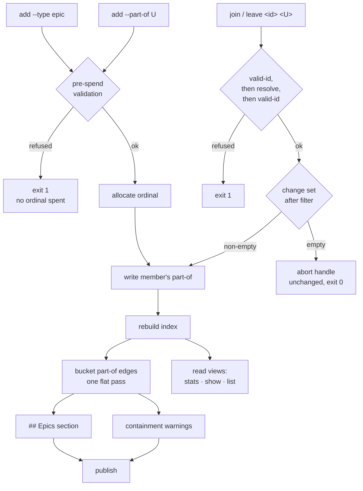

# Epic authoring and views — Plan

## Overview

Add the write half of the umbrella concept — two capture-time flags on the
emitter and two lifecycle verbs — and the three read surfaces that make
membership legible, deriving every roster and progress figure by **bucketing
the index's existing `part-of` edges rather than traversing them**, which is
what makes the derivation terminate over membership the containment rule
forbids but a hand-edit can still express.

## Design Decisions

### 1. The roster is derived by bucketing, never by traversal

- **Chosen:** one flat pass. Each record contributes itself to the bucket of
  every umbrella its own `part-of` names. Nothing ever walks *from* an umbrella
  *into* a member's own memberships.
- **Why:** it makes termination a property of the algorithm's shape rather than
  of a cycle guard that must itself be correct. Two records naming each other
  as umbrellas are representable by hand-edit and are simply two buckets each
  holding one record — the pass visits each record once regardless. This is the
  design answer to security Finding 2, and it is stronger than the finding
  asked for: the finding wanted a termination *requirement*, and the shape
  removes the possibility rather than guarding it. It also introduces no new
  class of control flow — `index.sh` contains **no recursion and no visited-set
  traversal anywhere today** (verified: every walk of `outgoing_fm` /
  `outgoing_all` is single-hop — the bidirectional check at `index.sh:715-733`,
  the umbrella-resolves check at `:742-751`, and the Graph render at `:778-785`).
- **The pass deduplicates by `(member, umbrella)`, and that is a second reason
  independent of the first.** `outgoing_fm` and `outgoing_all` differ in *two*
  ways, and reading the plan's "use `outgoing_fm`" instruction as covering both
  is the mistake to avoid. `edges_all` is guarded by a `seen_all` key;
  `edges_fm` is appended unconditionally, and nothing deduplicates it anywhere.
  Verified: a record carrying `part-of: [E, E, E]` renders **one** edge in
  `## Graph` and yields **three** entries in `outgoing_fm` — the existing
  umbrella-resolves check fires its warning three times for that one record.
  Without a dedup the bucketing counts the member three times, overstating the
  progress denominator and letting one record fill the whole oldest-first cap
  while hiding genuinely distinct members. Do **not** fix this by switching to
  `outgoing_all`: that reintroduces the wikilink problem. Frontmatter-only and
  deduplicated are two requirements, not one.
- **Rejected:** traversal from the umbrella with a visited set — needs a
  correctness argument, a cycle fixture, and would be this file's first
  traversal. Rejected: refusing to derive at all when a cycle is present — the
  index must still render, and a collection made unreadable by one hand-edited
  record is a worse failure than a roster that reports a cycle plainly.

### 2. `## Epics` sits between `## Issues` and `## Graph`

- **Chosen:** the new section is emitted after the `## Issues` block
  (`index.sh:804-809`) and before the `## Graph` block (`:810-815`).
- **Why:** placement is **constrained, not cosmetic**. The integrity-warnings
  extractor in `cmd_stats` (`render.sh:751`) reads
  `awk '/^## Integrity Warnings$/,EOF' | sed -n '2,$p' | grep -E '^- '` — a
  range to end-of-file filtered on a leading `- `. Two test helpers do the same
  (`tests/issues.sh:2888`, `:6297`). A section placed *after* Integrity
  Warnings would have every one of its roster lines swallowed into the warnings
  block. Before `## Graph` also matches the spec's own mockup prose, which
  points at "the Graph section below it".
- **Rejected:** appending at the end — silently corrupts the warnings view.
  Rejected: between Graph and Warnings — correct but puts a rollup of Issues
  behind the raw edge dump.

### 3. Containment in the new section is a property of who writes the line

- **Chosen:** state the requirement as *the writer owns every line's opening
  bytes*. Every line the section emits begins with writer-literal text (the
  indent and `- `); every untrusted scalar reaching it passes through
  `row_safe` (`index.sh:301-303`) **plus** the backtick strip the nine existing
  call sites use; every slug is an `is_valid_id`-cleared id, never a raw
  frontmatter value.
- **Why:** security Finding 1 is right that "cannot forge a row" does not by
  itself establish "cannot forge a nesting level", and right that the sanitizer
  was written for a flat row. Reading it settles the question in the
  increment's favour, and the reason is worth recording rather than
  re-deriving: `row_safe` is
  `tr -d '\000-\037\177' | sed 's/·//g' | cut -c1-512`, and `\000-\037`
  **contains `\012`** — so a value cannot carry a newline, and a value that
  cannot carry a newline can never reach the start of a line. Nesting is forged
  only by controlling a line's start. The property therefore already holds; what
  was missing is a statement of *why*, and a case that goes red if the section
  ever interpolates a value before its own literal prefix.
- **Rejected:** a second, section-specific sanitizer — a second definition of
  one rule is what `cross-copy-lockstep` and `declared-vocabularies` both exist
  to prevent, and it would need the same load-bearing stage ordering
  (control-strip before separator-strip, because deleting a control byte can
  reconstitute `C2 B7`) re-argued in a second place.

### 4. The roster cap is 10 open members, oldest first

- **Chosen:** the section lists an umbrella's **open** members, capped at
  **10**, in the index's existing enumeration order, with an overflow line
  naming the remainder and the closed count.
- **Why:** measured against the real collection rather than argued. Modelling
  full adoption — every one of the 46 originating spec directories becomes an
  umbrella and all 311 spec-derived issues join one:

  | | |
  | :--- | :--- |
  | `INDEX.md` today | 167,041 bytes / 571 lines (Issues 140,223 · Graph 21,783 · Warnings 653) |
  | open members per umbrella | median **2** · p75 **4** · p90 **7** · max **20** |
  | whole section, uncapped | 13,313 bytes (**+8.0%**) |
  | whole section, cap 10 | 12,641 bytes (**+7.6%**), 1 umbrella of 46 truncated |
  | whole section, cap 5 | 12,030 bytes (+7.2%), 4 of 46 truncated |
  | single entry at realistic title lengths, cap 10 | ~890 bytes |
  | single entry at the code's own ceilings, cap 10 | ~2,600 bytes |
  | `part-of` edges in `## Graph` | +46,703 bytes (**+28.0%**) at 150.2 B/edge measured |

  The last two rows are different questions and the gap between them is the
  honest argument for the cap. ~890 bytes is a measurement over real titles;
  the ceiling comes from the caps that actually apply — `row_safe` admits 512
  bytes per scalar, `is_valid_id` 128 per slug, and `status` is checked against
  **no vocabulary at all** in the index writer, unlike `type` and `outcome`.
  Since this increment's stated threat model is a hand-edited record, the
  ceiling is the row that record would move.

  Three things fall out. The cap buys ~700 bytes at realistic scale, so **it is
  a bound, not an optimization** — its job is to make one umbrella's worst case
  finite, which satisfies the criterion that no entry can grow the file without
  limit. 10 is where it bites once in 46 (the spec asked for "should rarely
  bite"; 20 never bites today and 5 bites four times). And the increment's real
  index cost is the Graph edges at +28%, four times the section — which
  confirms the spec's reasoning that a section built to be legible rather than
  complete is not where the cost sits.
- **Ordering:** oldest-first needs no invention — `index.sh` enumerates in glob
  order, which for date-prefixed slugs is chronological. It also surfaces the
  right thing: an umbrella's oldest open member is its stalest work.
- **Rejected:** a full roster — unbounded by construction, and fails the
  criterion outright. Rejected: a count alone — cheapest, but fails the story
  the section exists for. Rejected: making the cap configurable — a new config
  key for a bound nobody has yet hit is machinery ahead of demand.

### 5. The statistics exclusion is one guard at one ordering boundary

- **Chosen:** a single guard in `cmd_stats`' row loop, placed **between**
  `matching[$slug]=1` (`render.sh:661`) and the first work counter (`:662`).
- **Why:** the loop has three regions with three different populations, and the
  guard belongs at the second boundary:

  | region | lines | population | epics? |
  | :--- | :--- | :--- | :--- |
  | staleness signals — `seen_rows`, `saw_type` | 658-659 | **every** row, before `row_matches` | must include |
  | scope set — `matching` | 661 | rows that passed the filter | must include |
  | work counters — `open_count`, `closed_count`, `origin_count`, `priority_count`, `label_count` | 662-680 | units of work | must exclude |

  Epics must stay in `matching` because `stats --type epic` is a legal query
  whose blocking rollup (`:727-732`, gated on `matching`) must still work; they
  must stay in `seen_rows`/`saw_type` because those answer "can this index
  describe `type` at all" for the whole collection, and a collection holding
  only epics would otherwise report `seen_rows == 0` and silently pass a schema
  gate it should fail. Because the five work counters are contiguous and end the
  loop body, one `continue`-shaped guard covers all five — and, importantly,
  **the failure mode is biased safe**: a counter added later to the loop's tail
  is excluded by default, which is the right default for a work counter.
- **The ordering is load-bearing and held by nothing today.** It gets a comment
  at the site naming the three regions, and a case per region that goes red if
  the guard moves.
- **Containers get their own accumulator and their own summary line.** The
  guard alone serves half the criterion: it stops containers inflating the
  counts, but "reports containers separately" needs somewhere for the count to
  go, and the spec's mockup draws it in the summary
  (`Epics: 2 open · 1 closed`). Without it there is also a degenerate case —
  `stats --type epic` admits only epic rows into scope and then skips every one
  of them before any counter, so the headline reads `Open: 0 · Closed: 0` and
  every cluster reads `_none_` however many umbrellas exist. An epic counter
  incremented at the guard, printed as its own summary line, fixes both: the
  criterion is served in full and a container-scoped census has something true
  to say.
- **Rejected:** a guard repeated at each of the five accumulators — the shape
  `declared-vocabularies` exists to prevent, and a sixth accumulator would
  silently miss it. Rejected: a second `work[]` array beside `matching` — same
  positional dependency plus an extra declaration, and the research's preferred
  option before the loop's contiguity was measured.

### 6. Write-only-on-change is one verb-agnostic filter at the change choke point

- **Chosen:** `transition.sh` re-reads the record's frontmatter once and drops
  from the pending change set every `field<TAB>value` pair whose value already
  matches. If nothing survives, the run aborts the placement handle, writes
  nothing, regenerates nothing, and reports the no-op at status 0.
- **Why:** a choke point already exists. Every verb's field writes funnel
  through one capture — `changes="$(apply_verb …)"` at `transition.sh:281` —
  **before** the `updated` stamp is appended (`:300`) and before `set_fields`
  runs (`:303`). A filter inserted between 281 and 300 covers all five existing
  verbs and both new ones with no per-verb code, which is what makes the fold
  to the existing five cheap rather than a rewrite.
- **This cannot be delegated downward, and the reason is the whole point.**
  `place.sh` already declines to publish an empty diff — `place_direct_publish`
  returns 0 at `place.sh:777` when `git status --porcelain` is empty, and the
  routed arm asks the same question structurally via `place_changed`
  (`:1913-1925`, consulted at `:1956`, `:1968`, `:1974`). Neither can ever fire
  for a transition, because `main` appends a fresh timestamp *before*
  `set_fields`, so the file is never byte-identical. The stamp defeats the guard
  that would otherwise have made a no-op free, which is exactly why the decision
  has to be made on the semantic fields, above the stamp.
- **What the fold does and does not reach:** today only `claimed-by` is ever
  read back before being overwritten (`apply_verb` reads `holder` at `:351`).
  `status` and `outcome` are written blind by `start`, `close` and `reopen`, so
  re-closing an already-closed issue with the same outcome, and reopening an
  already-open one, both currently rewrite the file. The filter fixes all of
  them at once. On a **real** change every verb keeps its behaviour exactly.
- **The comparison is between composed lines, not between values.** This is the
  load-bearing detail and the obvious implementation gets it wrong. `apply_verb`
  emits values in **file form** — `claimed-by` carrying literal quotes
  (`"jrko"`, `""`), `status` and `outcome` bare — while `fm_field`, the only
  scalar reader in the file, **strips** quotes. Comparing pair value against
  `fm_field`'s answer therefore matches for `status` and `outcome` and *never*
  for `claimed-by`, which is the field this rule leads with. Verified: a
  self-reclaim yields `"jrko"` against `jrko`; a release on an unheld record
  yields `""` against the empty string. The failure is partial and silent —
  `close`-on-closed and `reopen`-on-open would correctly no-op while every
  `claim` / `release` / `start` kept writing, so the rule would look
  implemented. `set_fields` writes `field: value`, so the question that actually
  matters is **"does `field: value` equal the record's existing `^field:`
  line?"** — quote-agnostic, needing no per-field knowledge, and safe against a
  later field with a different convention.
- **Relation fields need the other reader.** `fm_field` is anchored at
  `^<field>:` and `part-of` is indented under `relations:`, so
  `fm_field "$fm" part-of` returns empty **unconditionally**, whatever the
  record holds — verified against a record with a real membership. The
  membership comparison reads through `relation_targets` and compares as set
  membership, not string equality. `close --as duplicate` already reads a
  relation that way, so the precedent is in the same file.
- **Rejected:** comparing per verb inside `apply_verb` — five comparisons, five
  chances to omit one, and `start` writes two fields of which only one is read
  back today.

### 7. `join` / `leave` take a verb-gated second positional

- **Chosen:** the argument loop gains a second accumulator, bound only when the
  active verb declares it takes one. `claim` / `release` / `start` / `close` /
  `reopen` keep today's arity exactly — a second bare token is still
  `error: unexpected argument` at status 2.
- **Why:** `transition.sh` has no second-positional infrastructure; `main`'s
  loop binds the single positional at `:210` and rejects any second token in
  the `else` at `:211`. Making that branch unconditionally permissive would
  loosen arity for five verbs nothing asked to change.
- **The umbrella clears the validator before any path is composed from it, in
  the same position the issue id does.** This is security Finding 3, and the
  ordering is already written into the file twice: `:241-245` gates the
  caller's id *"before any path is composed from it, including the stat inside
  `resolve_slug`"*, and `:266-276` re-validates the resolved slug because only
  one of the resolver's three branches answers with a value the first check
  covered. The umbrella operand joins both halves — validated as supplied, and
  re-validated after resolution, since it resolves by the same
  ordinal/slug/prefix rules an issue id does (the spec requires that
  symmetry). The emitter's own collision loop is the local precedent and says
  so at `new.sh:277-279`: *"A derived id is a new id, and it composes the next
  iteration's path."*
- **Rejected:** an `--umbrella <slug>` flag — avoids the arity work, but the
  spec's shape is `join <id> <umbrella>` and a flag would make the second
  operand optional in a verb where it is mandatory.

### 8. Capture-time validation lands in the shared pre-spend block, above a hoisted directory resolution

- **Chosen:** move the issues-directory resolution (`new.sh:246-252`) above the
  allocation (`:219`), and put both new refusals — an unrecognized kind and an
  unresolvable umbrella — in the pre-spend block alongside the existing
  `priority` and `status` enum checks (`:188-196`).
- **Why:** the allocator is append-only, so an ordinal spent by a run that then
  refuses is one no later run reclaims. The directory resolution was verified to
  depend on **nothing** the allocation produces — only on `$dir` and
  `jimconf.sh get issues` — so hoisting it costs an ordering change rather than
  new machinery, which is what makes the umbrella-existence check affordable at
  all. The collision handling (`:270-287`) genuinely cannot move: it branches on
  `slug_via_alloc` and inspects the allocated slug and `P-` ordinal shape.
- **One fact the spec did not have.** The placement-routing block (`:106-178`)
  is *itself* entirely pre-spend and ends in an `exec` into `place.sh` on the
  routed arm, which re-invokes this same script with `--dir` already set. The
  child then runs its own full sequence. So a validation placed in the routing
  branch would run on one arm only — it must sit in the shared block below it,
  which both invocation shapes reach. On the routed arm the child is *handed*
  its directory as an ordinary flag, so the check has a real collection to
  resolve against in both shapes.
- **Refusal status codes follow the local precedent**, not a new scheme: the
  `priority` and `status` enum checks exit **1**, and both new refusals are the
  same class of thing. Status 2 stays what it is — a usage error about the shape
  of the call.
- **These two changes must not be split across tasks.** Validating at capture is
  affordable *only because* the ordering requirement is stated; separated, the
  likely outcomes are a check that burns ordinals or a quiet drop of the
  capture-time check. Tasks 4 and 6 are ordered, the dependency is named on the
  task, and task 7 is the case that fails if either drifts.

### 9. `PLACE_VERBS` grows, and `usage()` starts deriving from it

- **Chosen:** add `join` and `leave` to `PLACE_VERBS` (`place.sh:104-105`), and
  convert `usage()` from its quoted heredoc to the `printf '%s\n'` form
  `transition.sh` already uses, so the vocabulary line interpolates while every
  other line stays a single-quoted literal.
- **The conversion, not the interpolation, is the instruction — and the
  difference is a real defect.** `usage()` is `cat <<'USAGE'`, a **quoted**
  heredoc, which is why the backticked words already in its body —
  `` `direct` ``, `` `route` ``, `` `{}` ``, `` `{token}` `` — print literally.
  Unquoting the delimiter to allow `${PLACE_VERBS[*]}` simultaneously enables
  **command substitution** on all four. Verified: the unquoted form emits four
  `command not found` lines on stderr and prints a help body with those words
  deleted. The strings are fixed and not caller-influenced, so this is not an
  injection vector — but `route` is a real binary on many systems, and where it
  is on `PATH` every `--help` and every unknown-subcommand invocation would run
  it and splice its output into the help text.
- **Why the fold:** the array and the usage text are two independent
  enumerations of one vocabulary — precisely the `declared-vocabularies`
  divergence, in the file this increment must edit, and **a distinct instance
  from the one already filed** (issue #402 covers `ISSUE_OUTCOMES` /
  `ISSUE_TYPES` across `index.sh`/`render.sh` and does not mention this pair).
  `transition.sh`'s own `usage()` already interpolates `${TRANSITION_VERBS[*]}`
  at `:64`, so the fix is to copy a sibling, not to invent one. Adding two verbs
  without it would ship the drift this increment created.
- **The face change is additive and breaks neither consumer.** The enum is a
  declared face with two consumers outside the group, confirmed against the call
  sites rather than against the contract graph: `skills/spec/scripts/reconcile.sh`
  uses `mode` / `begin` / `commit --verb edit` / `abort` (`:503`, `:659`, `:822`,
  and four abort sites), and `/jim:partition` holds a read-only trio —
  `mode`, `begin --read`, `abort` — granted verb-scoped in its `allowed-tools`
  (`skills/partition/SKILL.md:18`) with no publish verb at all. Neither uses a
  verb this increment touches, and growing an enum removes nothing.
- **Rejected:** mapping join/leave onto the existing generic `edit` verb — the
  door's commit subject is `docs(issues): <verb> <id>` (`place_message`,
  `:1676-1683`), so the choice is visible in published history. The schema
  increment faced this fork for its five verbs and extended the set; matching
  that keeps history describing what happened.

### 10. An unresolvable umbrella refuses at resolution time, and `epic` becomes a schema-gated axis

- **Chosen:** `--epic <ref>` resolves its operand — by the same
  ordinal → exact → prefix ladder `show` uses — against the collection's
  records of kind `epic`, and refuses when resolution finds none.
  `AXIS_FIELDS` changes `epic:-` to `epic:type`.
- **Resolution comes before the refusal, and the two are not separable.**
  `epic_matches` does exact string equality against slugs read from the graph.
  Verified against a fixture holding a real umbrella and one member: the exact
  slug matches, the **ordinal matches nothing and the prefix matches nothing**,
  both at status 0. Adding the refusal without the ladder therefore makes two
  of the three required reference forms *worse* than today — a silent empty
  result becomes an active refusal of a legitimate reference. The spec requires
  all three forms, sourcing them to `show`'s own grammar. The ladder is a
  shared helper used by the filter and by `--part-of` at capture, not a third
  implementation: without that, `--part-of 42` could be refused at capture
  while `join <id> 42` succeeded against the same target.
- **The integration point is `build_derived_axes`, not `resolve_person_axes`.**
  `resolve_person_axes` runs *before* `ensure_index` in both read verbs, and
  deciding whether a slug names an umbrella needs the built index — so the
  refusal cannot sit where the precedent sits. `build_derived_axes` already
  runs after the index is built and before the row loop, which satisfies the
  property that actually matters ("a refusal writes nothing, because no row has
  been read"). It gains an umbrella set alongside `DERIVED_EPIC`, which tracks
  membership only and does not expose `type` today. The `resolve_person_axes`
  citation stands for the **rule** it established, not for the position.
- **Why:** the refusal does not exist today — `epic_matches`
  (`render.sh:1021-1034`) checks only whether a member's `part-of` names the
  operand, so `--epic no-such-thing` returns "_No matching issues._" at status 0,
  indistinguishable from an umbrella that is genuinely empty. The governing rule
  was set by the preceding increment for exactly this shape and is written at
  `render.sh:1081-1083`: *"An empty result is not an answer. Returning nothing
  matched would be indistinguishable from genuinely holding nothing."* Its
  implementation, `resolve_person_axes` (`:1092-1116`), refuses before any row
  is read — so a refusal writes nothing — and that is the position to copy.
- **The consequence is deliberate and is the reason the axis moves.** Resolving
  "is this slug an umbrella" reads the `type` row scalar, so the axis can no
  longer claim exemption from `schema_gate`. Today `epic` carries `-` in
  `AXIS_FIELDS` (`:94-96`) meaning "derived from the Graph, not from a row
  field", which exempts it (`schema_gate` skips any axis whose field is not in
  `SCHEMA_GATED_FIELDS`, `:534`). After this change `--epic` against an index
  written before the widened schema refuses with *"does not describe: type"* —
  which is correct: an index that cannot say what is an epic cannot validate the
  reference, and answering anyway is the failure the AC forbids. The existing
  vocabulary-iterating case
  (`case_issues_render_unanswerable_axes_refuse_on_both_verbs`,
  `tests/issues.sh:8328-8364`) loops `AXIS_FIELDS` and flips this axis from
  "still answers" to "refuses" with no edit — the declared-vocabularies
  machinery working as designed.
- **Rejected:** resolving against the set of slugs that appear as `part-of`
  targets — needs no row field, but refuses an umbrella with no members, which
  the spec explicitly requires to report an empty roster. Rejected: resolving
  against any record of any kind — leaves `--epic <a-plain-issue>` answering
  emptily, so the read and write paths would disagree about what resolves, which
  is the disagreement capture-time validation was added to prevent.

### 11. The operator-facing verb list gets a check that stays run, not an edit

- **Chosen:** add a `transition_verbs()` derivation and a case in
  `tests/docsurfaces.sh` asserting every verb the script dispatches is named on
  each operator surface; then update the surfaces to pass it.
- **Why:** the five verbs are restated in prose at six sites —
  `transition.sh:27`, `skills/issue/SKILL.md:34` and `:380`, `README.md:54`,
  `WORKFLOW.md:81`, `ARCHITECTURE.md:75` and `:84`. Only `ARCHITECTURE.md` is
  refreshed by the pipeline; the rest are hand-maintained, and a hand edit
  fixes this increment while leaving the next one exposed. `tests/docsurfaces.sh`
  already carries the pattern to copy — `ledger_verbs()` (`:60-64`) reads
  `jimledger.sh`'s dispatch table and
  `case_docsurfaces_ledger_verbs_are_documented` (`:137-147`) asserts each verb
  is documented. The check is written first so it goes red before the docs are
  touched.
- **Rejected:** hand-editing the six sites — the enumeration is not the problem;
  the absence of anything that re-runs it is. Rejected: a hand-written verb
  array in the test, which is the shape `case_docsurfaces_registry_verbs_reach_every_surface`
  (`:154-180`) already carries and which the project has recorded as having the
  defect it exists to catch, one level up.

## Constitution Check

**ARCHITECTURE.md status:** Present — constraints noted below. The `issue`
group blueprint's Invariants table (`docs/specs/issue/000-blueprint/spec.md`) is
the sharper instrument for this increment and is checked alongside it.

| Constraint | Honored? | Notes |
| :--- | :--- | :--- |
| `single-emitter` — every issue file created only through `new.sh` | Yes | Tasks 4-6 extend the emitter; no new writer of issue files is introduced. |
| `untrusted-body-never-shell` — bodies via `--body-file`, scalars YAML-encoded | Yes | `--part-of` writes the **resolved id verbatim**, not a re-encoding of the operand. It has already cleared `is_valid_id` and already resolved against the collection, so a second normalization can only disagree with what was validated. Explicitly **not** the `--labels` encoder (`new.sh:307-314`): that is a lossy normalizer for free text, reducing anything outside `[a-z0-9-]`, while `is_valid_id` admits `[A-Za-z0-9][A-Za-z0-9._-]*`. Verified: `JIM-0042-auth-hardening` passes the validator and encodes to `jim-0042-auth-hardening` — and `JIM-` is a supported `issue_id_prefix` scheme, so the record would name an umbrella that does not exist, the index would warn "names an umbrella not in the collection" permanently, and the roster would never attribute the member. No new body path. |
| `id-gate-before-path` (critical) | Yes | DD 7 and DD 8. The umbrella operand clears `valid-id` before any path composition on both the verb and the capture path, and is re-validated after resolution. |
| `placeholder-by-position` (high) | Yes | Verified, not assumed: markers are appended last and declared as negative offsets (`new.sh:172-176`), resolved against current argc by `place_marker_at` (`place.sh:262-269`), which also checks the resolved slot holds the declared marker. New flags land in `original_argv`, ahead of the markers. |
| `atomic-index-write` (medium) | Yes | The `## Epics` section joins the existing `{ … } > "$tmpfile"` composition and `mv` (`index.sh:787-857`); no new write path. |
| `staleness-gated-reads` (medium) | Yes, and extended | DD 10 moves `epic` into `SCHEMA_GATED_FIELDS`' reach deliberately. |
| `declared-vocabularies` (high) | Yes, and repaired | DD 9 removes an existing divergence in `place.sh:2062-2063`; DD 11 adds a derived doc sweep. |
| `row-shape-is-the-writers` (high) | Yes | DD 3. Every scalar reaching the new section goes through `row_safe`; every line's opening bytes are the writer's. |
| `issue-file-never-sourced` (critical) | Yes | Roster derivation reads the generated index, not issue files; the emitter's new fields are read line-oriented. |
| `cross-copy-lockstep` (high) | Yes | No sync-marked copy is touched. `is_valid_id`'s triplicate is unchanged. |
| `placement-gate-before-git` (critical) | Yes | No change to `place.sh`'s branch gate; only the verb enum grows. |
| ARCH — all scripts `set -uo pipefail; export LC_ALL=C`, bash + POSIX only, no third-party deps | Yes | No new dependency; every addition is bash/awk/sed/grep. |
| ARCH — `blocked` and `epic` derived from `## Graph`, not stored | Yes | Roster and progress are derived; only `part-of` on the member is stored. |

## File Manifest

| Component | File Path | Action | Notes |
| :--- | :--- | :--- | :--- |
| Placement door | `skills/issue/scripts/place.sh` | Update | `PLACE_VERBS` += `join` `leave`; `usage()` interpolates the array |
| Emitter | `skills/issue/scripts/new.sh` | Update | `--type` / `--part-of` flags; hoisted directory resolution; two pre-spend refusals; `type:` and `relations.part-of` written from parsed values |
| Lifecycle verbs | `skills/issue/scripts/transition.sh` | Update | verb-gated second positional; `join` / `leave`; containment refusals; write-only-on-change filter; header verb list |
| Index | `skills/issue/scripts/index.sh` | Update | roster/progress bucketing; `## Epics` section; two containment warnings |
| Read views | `skills/issue/scripts/render.sh` | Update | stats exclusion + umbrella rollup; `show` roster + progress; `list` progress; `--epic` refusal; `AXIS_FIELDS` |
| Issue skill | `skills/issue/SKILL.md` | Update | dispatch entries for `join` / `leave`; § 6a `updated` rationale correction |
| Issue tests | `tests/issues.sh` | Update | new cases; `derived_fixture` gains a partially-complete umbrella |
| Placement tests | `tests/place.sh` | Update | usage-derives-from-array case |
| Doc-surface tests | `tests/docsurfaces.sh` | Update | `transition_verbs()` + every-verb-documented case |
| Operator docs | `README.md`, `WORKFLOW.md` | Update | verb lists |

`skills/issue/assets/issue-template.md` needs **no change** — its `type:` slot
(`:11-12`) and `relations.part-of` slot (`:28-30`) already carry both fields and
already document them as this increment uses them. The emitter writes its
frontmatter by `printf`, not by reading the template, so only the emitter's
hardcoding changes.

## Interface Contracts

```
# ── Capture ────────────────────────────────────────────────────────────────
new.sh [existing flags] [--type <issue|epic>] [--part-of <csv-of-umbrella-refs>]

  --type      default "issue". Validated against ISSUE_TYPES in the shared
              pre-spend block. Unrecognized value → exit 1, message names the
              rejected key, never the value.
  --part-of   comma-separated umbrella references. Each is validated (valid-id)
              and then resolved against the collection; a reference naming no
              record of kind epic → exit 1. Both checks run ABOVE the allocate
              call, so neither spends an ordinal.

  New refusals, both pre-spend, both exit 1 (matching the priority/status
  precedent at new.sh:188-196). Exit 2 remains call-shape errors only.

# ── Lifecycle ──────────────────────────────────────────────────────────────
transition.sh join  <id> <umbrella> [--dir <path>]
transition.sh leave <id> <umbrella> [--dir <path>]

  TRANSITION_VERBS = (claim release start close reopen join leave)
  VERBS_WITH_UMBRELLA = (join leave)     # the only verbs binding a 2nd operand

  <umbrella> accepts the same reference forms <id> does: an ordinal, a slug, or
  a slug prefix. It clears valid-id as supplied, and again after resolution.

  exit 0  applied, or nothing to do (see below)
  exit 1  invalid id; unresolvable or ambiguous reference; target is not an epic
  exit 2  unknown verb; unknown flag; wrong operand count for the verb
  exit 5  hold conflict (claim/release/start only — unchanged)

  stdout, unchanged shape:  "<slug>\t<verb>"
  A run that changes nothing prints "<slug>\t<verb>\tunchanged" and exits 0.

# ── Write-only-on-change (all seven verbs) ────────────────────────────────
  Applied to the pending change set between its capture (transition.sh:281)
  and the `updated` stamp (:300). A pair whose value already matches the
  record is dropped. An empty surviving set means: no field written, no stamp,
  no index regeneration, the placement handle aborted rather than committed.
  On a real change every verb behaves exactly as it does today.

# ── The ## Epics section grammar ──────────────────────────────────────────
  Emitted between ## Issues and ## Graph. Every line's opening bytes are
  writer-literal; no interpolated value ever begins a line.

  - `<umbrella-slug>` — <title> · status: <status> · <closed>/<total> closed
    - `<member-slug>`                          (open members, max 10)
    … <n> more open · <m> closed               (overflow line, only when capped)
                                               (blank line between umbrellas)

  <umbrella-slug>, <member-slug>  is_valid_id-cleared ids
  <title>                         row_safe(...) | tr -d '`'
  <status>                        the umbrella's own author-set status
  <closed>/<total>                derived; total counts every member, open or not

  ROSTER_CAP = 10          # declared constant, iterated/read, never restated

# ── Derivation (index.sh) ─────────────────────────────────────────────────
  One flat pass, no traversal:
    for each record R:
      for each U in R.part-of:          # frontmatter only — outgoing_fm
        members[U]   += R
        if R.status == closed: closed[U] += 1

  Terminates for any membership the collection can hold, including a cycle,
  because no step follows an edge out of a bucket.

# ── Read views ────────────────────────────────────────────────────────────
  render.sh stats   epics excluded from every work counter; kept in `matching`;
                    new "== Epics ==" rollup between the label cluster and
                    "== Blocking ==".
  render.sh show    roster + progress appended to the metadata block, between
                    `created` (render.sh:1354) and the blank line (:1355).
                    Not capped — `show` renders one record on demand and is
                    neither regenerated nor committed.
  render.sh list    a `type: epic` row carries its progress figure.
  AXIS_FIELDS       epic:-  ->  epic:type
```

## Data Flow



## Task Breakdown

### The door and its vocabulary

1. [x] `place.sh`: add `join` and `leave` to `PLACE_VERBS` (`:104-105`).
   **Verify:** `bash -c 'source <(sed -n "104,105p" skills/issue/scripts/place.sh); for v in join leave file edit close; do printf "%s " "${PLACE_VERBS[*]}" | grep -q " $v " || { echo "MISSING $v"; exit 1; }; done; echo ok'`

2. [x] `place.sh`: convert `usage()` from `cat <<'USAGE'` to the
   `printf '%s\n'` form used at `transition.sh:58-65` — every existing line a
   single-quoted literal, only the vocabulary line double-quoted so
   `${PLACE_VERBS[*]}` expands. **Do not simply unquote the heredoc
   delimiter**: the body carries `` `direct` ``, `` `route` ``, `` `{}` `` and
   `` `{token}` ``, and unquoting turns all four into command substitution.
   Depends on task 1.
   **Verify:** `out=$(bash skills/issue/scripts/place.sh --help 2>/tmp/uerr); test -z "$(cat /tmp/uerr)" && printf '%s' "$out" | grep -q '`route`' && printf '%s' "$out" | grep -q '`{token}`' && printf '%s' "$out" | grep -q 'join' && printf '%s' "$out" | grep -q 'leave' && echo ok`

3. [x] `tests/place.sh`: add a case asserting `usage()`'s verb list is derived —
   every element of `PLACE_VERBS`, read out of the script with the
   `script_vocabulary` idiom, appears in the usage output — **and** that the
   conversion did not turn prose into substitution: the literal backticked
   tokens survive and stderr is empty. Goes red against the pre-task-2
   hand-typed list, and against the unquoted-heredoc shortcut. Depends on
   task 2.
   **Verify:** `bash tests/place.sh case_place_usage_verbs_derive_from_the_array`

### Capture time

4. [x] `new.sh`: hoist the issues-directory resolution (`:246-252`) to
   immediately below the filer resolution (`:209`), above the allocation
   (`:219`). No behavioural change on its own — it is what makes task 6
   affordable. **Do not split from task 6** (DD 8).
   **Verify:** `awk '/issues_dir=/{d=NR} /allocate issue/{a=NR} END{exit !(d && a && d < a)}' skills/issue/scripts/new.sh && bash tests/issues.sh case_new_defaults_kind_and_leaves_holder_and_outcome_empty`

5. [x] `new.sh`: add `--type`, validate it against the declared kind vocabulary
   in the pre-spend block beside the `status` check (`:193-196`), and write the
   parsed value at `:333` in place of the hardcoded `issue`. Remove the comment
   at `:331-332` asserting a capture is always an issue — this increment is what
   makes that false.
   **Verify:** `bash tests/issues.sh case_new_files_an_epic_kind && bash tests/issues.sh case_new_refuses_an_unrecognized_kind_before_spending_an_ordinal`

6. [x] `new.sh`: add `--part-of`; validate each reference with `valid-id`, then
   resolve it through the shared ordinal → exact → prefix ladder and refuse one
   that resolves to no record of kind `epic` — all in the pre-spend block, using
   the directory hoisted in task 4. Write the **resolved id verbatim** into
   `relations.part-of` at `:341`; do not put it through the `--labels` encoder,
   which would mangle any id carrying an uppercase letter or a `.`. Depends on
   task 4.
   **Verify:** `bash tests/issues.sh case_new_files_into_an_umbrella && bash tests/issues.sh case_new_refuses_an_unresolvable_umbrella_before_spending_an_ordinal && bash tests/issues.sh case_new_part_of_preserves_a_mixed_case_umbrella_id`

7. [x] `tests/issues.sh`: add the paired no-identity-burned case — after each of
   the two new refusals, the allocator's next ordinal is the one the run would
   have taken. This is the case that makes tasks 4-6 a unit rather than three
   edits.
   **Verify:** `bash tests/issues.sh case_new_refusals_leave_the_ordinal_unspent`

### Lifecycle verbs

8. [x] `transition.sh`: add a verb-gated second positional to `main`'s argument
   loop (`:203-213`) — a `VERBS_WITH_UMBRELLA` constant, and a third branch in
   the `*)` arm. The five existing verbs keep today's arity: a second bare token
   is still `error: unexpected argument`, status 2.
   **Verify:** `bash tests/issues.sh case_transition_existing_verbs_still_refuse_a_second_operand`

9. [x] `transition.sh`: add `join` / `leave` to `TRANSITION_VERBS` (`:49`), the
   `apply_verb` arms (`:353-379`), and the header verb list (`:27`), writing the
   member's `part-of`. The umbrella operand clears `valid-id` as supplied and
   again after resolution, in the same positions the issue id does (`:241-245`,
   `:266-276`). Depends on task 8.
   **Verify:** `bash tests/issues.sh case_transition_join_and_leave_write_membership`

10. [x] `transition.sh`: add the two containment refusals to the new arms — an
    umbrella that is not `type: epic` is refused naming what the record *is*,
    and an epic may not be put under an epic. Depends on task 9.
    **Verify:** `bash tests/issues.sh case_transition_join_refuses_a_non_epic_umbrella && bash tests/issues.sh case_transition_refuses_an_epic_inside_an_epic`

11. [x] `transition.sh`: add the write-only-on-change filter between the change
    capture (`:281`) and the stamp (`:300`), comparing the **composed
    `field: value` line** against the record's existing `^field:` line — not
    value against value, which mismatches for every quoted field. Read a
    relation through `relation_targets`, a scalar through `fm_field`. An empty
    surviving set aborts the handle and reports `unchanged` at status 0.
    Applies to all seven verbs. Depends on task 10.
    **Verify:** `bash tests/issues.sh case_transition_a_noop_writes_nothing && bash tests/issues.sh case_transition_a_real_change_still_writes && bash tests/issues.sh case_transition_noop_holds_for_quoted_and_bare_fields`

12. [x] `tests/issues.sh`: give the no-op rule a case per existing verb that
    goes red without the filter — mtime and `updated:` both unmoved, and the
    placement door asked to commit nothing.
    `case_transition_claim_is_idempotent_for_the_holder` (`:4436`) is today's
    closest case and asserts neither, so it cannot discriminate; extend it or
    supersede it rather than leaving it standing as coverage it does not have.
    Depends on task 11.
    **Verify:** `bash tests/issues.sh case_transition_noop_is_free_for_every_verb`

### The index

13. [x] `index.sh`: derive rosters and progress by bucketing `part-of` edges
    from `outgoing_fm` in one flat pass, beside the existing umbrella-resolves
    check (`:742-751`), deduplicating by `(member, umbrella)` as it goes. Two
    independent requirements: read `outgoing_fm` and never `outgoing_all`,
    because a wikilink must not create a membership; and dedup, because
    `edges_fm` is appended unguarded while `edges_all` is `seen_all`-guarded, so
    one record naming an umbrella three times reaches the bucket three times.
    **Verify:** `bash tests/issues.sh case_index_derives_a_roster_and_progress && bash tests/issues.sh case_index_roster_counts_a_repeated_membership_once`

14. [x] `index.sh`: add a cycle fixture and the case that pins termination — two
    records naming each other as umbrellas, and an umbrella naming itself. The
    index must complete and warn, not hang. Depends on task 13.
    **Verify:** `timeout 30 bash tests/issues.sh case_index_terminates_over_forbidden_membership`

15. [x] `index.sh`: emit the `## Epics` section between the `## Issues` block
    (`:804-809`) and the `## Graph` block (`:810-815`), with `ROSTER_CAP` as a
    declared constant. Every scalar through `row_safe` plus the backtick strip;
    every line's opening bytes writer-literal. Depends on task 13.
    **Verify:** `bash tests/issues.sh case_index_emits_the_epics_section && bash tests/issues.sh case_index_epics_section_caps_a_long_roster`

16. [x] `tests/issues.sh`: add the structural-containment case — a record whose
    title carries a newline, a `·`, a leading `- `, and a backtick produces a
    section with the expected line count and no line whose shape a member entry
    could be confused with. Assert counts and shapes, never the absence of the
    injected string. Depends on task 15.
    **Verify:** `bash tests/issues.sh case_index_epics_section_structure_is_the_writers`

17. [x] `index.sh`: add the two containment warnings beside the existing
    umbrella-resolves check (`:742-751`), which already has `mtarget`,
    `meta_type` and `meta_status` in scope — a `part-of` target that is not
    `type: epic`, and a record that is itself an epic and carries a `part-of`.
    Identify records without reproducing body content. Depends on task 13.
    **Verify:** `bash tests/issues.sh case_index_warns_a_non_epic_umbrella && bash tests/issues.sh case_index_warns_an_epic_inside_an_epic`

### The read views

18. [x] `tests/issues.sh`: pin the census regression oracle **before** touching
    `cmd_stats` — a collection holding no umbrellas produces byte-identical
    `stats` output across the change. The current collection holds none, so this
    is available at no cost.
    **Verify:** `bash tests/issues.sh case_issues_render_stats_unchanged_without_umbrellas`

19. [x] `render.sh`: add the epic-exclusion guard to `cmd_stats`' row loop
    between `matching[$slug]=1` (`:661`) and the first work counter (`:662`),
    with a comment naming the three regions and why each boundary is where it
    is. The guard increments a container counter as it skips, and `cmd_stats`
    prints it as its own summary line beside `Open`/`Closed` — that line is the
    "reports containers separately" half of the criterion, and it is also what
    stops `stats --type epic` reporting `Open: 0 · Closed: 0` with every cluster
    empty. Depends on task 18.
    **Verify:** `bash tests/issues.sh case_issues_render_stats_counts_work_not_containers && bash tests/issues.sh case_issues_render_stats_type_epic_still_rolls_up_blocking && bash tests/issues.sh case_issues_render_stats_reports_a_container_count`

20. [x] `tests/issues.sh`: add the ordering cases — one per region — that go red
    if the guard moves above `matching` or above `seen_rows`/`saw_type`. The
    schema-staleness case is the sharp one: a collection of epics only must still
    fail the schema gate. Depends on task 19.
    **Verify:** `bash tests/issues.sh case_issues_render_stats_exclusion_ordering_is_load_bearing`

21. [x] `render.sh`: add the `== Epics ==` rollup to `cmd_stats`, between the
    label cluster (ends `:719`) and `== Blocking ==` (`:722`), reading `part-of`
    through `read_graph_edges` by name — the shared reader, call site six.
    Depends on task 19.
    **Verify:** `bash tests/issues.sh case_issues_render_stats_reports_a_per_umbrella_rollup`

22. [x] `render.sh`: render the roster and progress in `show`, between `created`
    (`:1354`) and the blank line (`:1355`). `render_issue_file` takes `dir` and
    `slug` only today, so it gains the index path `cmd_show` already holds at
    `:1369`. Uncapped, deliberately.
    **Verify:** `bash tests/issues.sh case_issues_render_show_lists_the_roster_and_progress && bash tests/issues.sh case_issues_render_show_empty_umbrella_reports_an_empty_roster`

23. [x] `render.sh`: carry an umbrella's progress on its `list` row. Depends on
    task 13.
    **Verify:** `bash tests/issues.sh case_issues_render_list_epic_shows_progress`

24. [x] `render.sh`: resolve an `--epic` reference through the shared
    ordinal → exact → prefix ladder (the same helper task 6 uses) inside
    `build_derived_axes` (`:922-938`), which gains an umbrella set beside
    `DERIVED_EPIC`; refuse only when resolution finds no record of kind `epic`.
    `build_derived_axes` is the integration point, not `resolve_person_axes`
    (`:1092-1116`) — that runs before `ensure_index` and cannot see what is an
    epic; it stands as the precedent for the *rule*, not the position. Change
    `AXIS_FIELDS` `epic:-` to `epic:type` (`:94-96`); the existing vocabulary
    loop picks the axis up with no edit.
    **Verify:** `bash tests/issues.sh case_issues_render_refuses_an_unresolvable_umbrella && bash tests/issues.sh case_issues_render_epic_accepts_ordinal_and_prefix_forms && bash tests/issues.sh case_issues_render_unanswerable_axes_refuse_on_both_verbs && bash tests/issues.sh case_issues_render_list_empty_match_succeeds`

### Documentation surfaces

25. [x] `tests/docsurfaces.sh`: add `transition_verbs()` reading
    `TRANSITION_VERBS` out of `transition.sh`, and a case asserting every
    dispatched verb is named on each operator surface — `README.md`,
    `WORKFLOW.md`, `skills/issue/SKILL.md`. Copy `ledger_verbs()` (`:60-64`) and
    `case_docsurfaces_ledger_verbs_are_documented` (`:137-147`); do **not** copy
    the hand-written array in `case_docsurfaces_registry_verbs_reach_every_surface`
    (`:154-180`). Written before the docs are updated, so it goes red first.
    Depends on task 9.
    **Verify:** `bash tests/docsurfaces.sh case_docsurfaces_transition_verbs_are_documented; test $? -ne 0 && echo "red as expected"`

26. [x] `skills/issue/SKILL.md`: add `join` / `leave` to the dispatch table
    (`:34`) and the transition-verb list (`:380`); document the `unchanged`
    report. Correct § 6a's rationale at `:236` — it claims `updated` is
    refreshed "so recency ordering reflects the real time of the last change",
    and **nothing sorts on `updated`**: `issue_list_sort` accepts
    `date|priority|num`, and `date` resolves to field 5, `created`
    (`render.sh:1245`). Say what the field is actually for.
    **Verify:** `bash tests/docsurfaces.sh case_docsurfaces_transition_verbs_are_documented`

27. [x] `README.md:54` and `WORKFLOW.md:81`: add the two verbs to the operator
    verb lists. Depends on task 25 — the check must be red before this lands.
    **Verify:** `bash tests/docsurfaces.sh case_docsurfaces_transition_verbs_are_documented && bash tests/docsurfaces.sh`

### Closing

28. [x] `tests/issues.sh`: extend `derived_fixture` (`:8639-8680`) so its
    umbrella is **partially** complete — today both members are open, so no
    fixture exercises a non-zero progress numerator. Extend rather than adding
    inline epic frontmatter; it is the corpus-shaped helper the group converged
    on.
    **Verify:** `bash tests/issues.sh case_issues_render_list_derived_predicates && bash tests/issues.sh case_index_derives_a_roster_and_progress`

29. [x] Run the whole suite backgrounded and confirm green. Never concurrently
    with anything else, subagents included.
    **Verify:** `rm -f /tmp/suite.log && bash skills/meta-test/scripts/run.sh > /tmp/suite.log 2>&1; grep -E '^Ran ' /tmp/suite.log`

## Requirements Coverage Summary

| Spec Acceptance Criterion | Task(s) |
| :--- | :--- |
| **Creating an umbrella and joining it** | |
| Create an umbrella kind without a separate capture flow | 5 |
| Name an umbrella at capture time | 6 |
| Put an existing issue under an umbrella and take it out, one command each | 8, 9 |
| Umbrella reference clears the same validation, in the same position | 6, 9 |
| Membership recorded on the member alone; one record written | 6, 9, 13 |
| An issue can belong to several umbrellas; a repeated join changes nothing | 9, 11 |
| Every membership change stamps and refreshes the index | 9, 11 |
| Every membership change works identically under either placement | 1, 2, 9 |
| **A change that changes nothing** | |
| A no-op writes nothing — no field, no stamp, nothing published | 11, 12 |
| Reports that nothing changed, distinguishably, and succeeds | 11 |
| Every lifecycle verb obeys the rule | 11, 12 |
| Joining an already-finished umbrella is permitted; progress reflects it | 9, 13 |
| **What an umbrella may contain** | |
| An umbrella contains ordinary issues and never another umbrella | 10, 17 |
| Putting an issue under a non-umbrella is refused, saying what it is | 6, 10 |
| Putting an umbrella under an umbrella is refused | 10 |
| The index reports any membership violating either rule | 17 |
| Integrity reports identify records without reproducing body content | 16, 17 |
| **Naming an umbrella that does not exist** | |
| Refused when filing, filtering, joining and leaving | 6, 10, 24 |
| The refusal is distinguishable from a query that matched nothing | 24 |
| A filing refused for any reason consumes no issue identity | 4, 6, 7 |
| An umbrella is nameable by the same reference forms an issue is | 6, 9, 24 |
| **The umbrella's own views** | |
| A roster can never disagree with the records claiming membership | 13 |
| Progress shown wherever the umbrella is shown, computed from members | 15, 21, 22, 23 |
| Opening an umbrella shows its roster and progress | 22 |
| The read views can list the umbrellas, each with progress | 23 |
| An umbrella's lifecycle state is author-set, never inferred | 22 (no cascade added; asserted, not implemented) |
| An umbrella with no members reports an empty roster | 22 |
| An issue in several umbrellas counts toward each independently | 13, 28 |
| Deriving a roster or progress finishes for any membership the collection can hold | 13, 14 |
| **Counting** | |
| The statistics view counts work and reports containers separately | 19, 21 |
| Every cluster the statistics view reports counts units of work only | 19, 20 |
| The statistics view reports a per-umbrella rollup | 21 |
| A run over a collection holding no umbrellas reports what it reported before | 18 |
| **What the index records** | |
| The index carries a section describing umbrellas, with roster and progress | 15 |
| The section can never be stale with respect to the records beside it | 15 (joins the existing atomic composition; no new write path) |
| No field value can introduce a line, re-parent a member, or change nesting | 15, 16 |
| A bound exists on how much the section renders for any one umbrella | 15 |
| A record's field values can never corrupt the index structure | 15, 16 |

No `[NEEDS CLARIFICATION]` items. All 38 criteria map to at least one task.

## Out of Scope

*Deferred — needs a human or a future spec:*

- **Bounding membership cardinality.** An issue may still name any number of
  umbrellas. Bounding it would reverse a decision the schema increment took
  deliberately in the reversible direction; the bound this increment adds is on
  what the section *renders*.
- **Making `ROSTER_CAP` configurable.** A constant until something hits it.
- **`part-of` edges leaving the `## Graph` section.** They are the complete
  membership record and cost +28% of the index at full adoption — four times the
  new section. Whether that is the right trade is a real question and a
  different one; nothing here changes the Graph.
- **The `updated:` field having any reader at all.** The sweep this plan owed
  found exactly one — `backfill.sh cmd_timestamp` (`:169-199`), a one-shot
  format normalizer. The field is not in `index.sh`'s `parse_scalar_fields`
  allowlist (`:153-171`), not in `COL_TOKENS`, not in `AXIS_FIELDS`, and not a
  sort key. Task 26 corrects the doc claim; giving the field a purpose is a
  separate question.
- **Grouping or ordering the read views by umbrella.** Already tracked
  separately.

*Handled by a later gate — not a deferral:*

- `ARCHITECTURE.md`'s refresh, which `/jim:build`'s completion gate runs via
  `/jim:arch`. The two verb-list mentions at `:75` and `:84` are its
  responsibility, which is why tasks 25-27 name only the hand-maintained
  surfaces.
- The group blueprint's Provides face for `place.sh` and `transition.sh`, which
  `/jim:blueprint` owns. Neither is hand-edited here.
- The plan-lens security pass, which `/jim:build`'s gate runs against this
  document.

## Open Questions

- [x] ~Where does the `## Epics` section go?~ → Between `## Issues` and
  `## Graph`. Constrained, not cosmetic — see DD 2.
- [x] ~What is the roster cap, and what order does it truncate against?~ → 10
  open members, oldest first. Measured; see DD 4.
- [x] ~Does the write-only-on-change rule need per-verb comparisons?~ → No. One
  filter at the existing change choke point covers all seven; see DD 6.
- [x] ~Do any consumers of `updated:` or file mtime break under it?~ → No. One
  reader of the field (a format migration, unaffected), one reader of mtime
  (`index_is_stale`, which *improves* — a no-op stops forcing a spurious
  regeneration). Zero consumers outside the group.
- [x] ~Does extending `PLACE_VERBS` break either outside consumer?~ → No.
  `reconcile.sh` uses `mode`/`begin`/`commit --verb edit`/`abort`;
  `/jim:partition` holds a read-only trio. Growing an enum removes nothing.
- [x] ~**`--part-of` accepts a comma-separated list at capture; `join` takes one
  umbrella per call.** The asymmetry follows the flag conventions on each side
  (`--labels` is a list; a transition verb takes one operand) and no criterion
  requires either to match the other.~ → Kept, after the second look this asked
  for. Nothing since has argued against it: the build, both reviews, the
  remediation pass and the follow-on fixes raised no complaint about the batch
  shape, and documenting the two forms beside each other in the feature doc
  read naturally rather than oddly.
