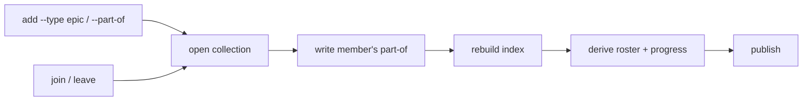

# 015 Epic authoring and views

## Overview

Give the collection a way to create an umbrella record, put issues under it and
take them out again, and read back the roster, progress and rollups that
membership makes derivable.

## Problem Statement

The collection can describe an umbrella body of work and cannot create one. The
preceding three increments recorded the kind of a record and its umbrella
membership, settled the identity fields beside them, and made both filterable.
Nothing writes either field.

The emitter hard-codes every record it produces as an ordinary issue with no
membership, and the five lifecycle verbs move an issue between states without
touching its kind or its umbrella. So the only way to create an epic today is to
hand-edit frontmatter — the exact friction the lifecycle verbs were introduced to
remove, and one that is materially worse under a designated shared branch, where
a hand edit means driving a two-phase publication door manually.

The evidence that nothing writes these fields is the collection itself: **405
records, every one of kind `issue`, not one carrying a membership.** The read
side is complete and answers honestly about an empty world.

Two further consequences follow from membership being unwritable, and both come
due the moment the first umbrella exists:

- **The umbrella's own views do not exist.** Membership is stored on the member
  alone by design, so an umbrella's roster and its progress are things only a
  reader can compute. No reader computes them, so an umbrella cannot report what
  it contains or how far along it is — the two questions it exists to answer.
- **Counting is undecided, and the default is wrong.** An umbrella is a
  container, but every existing rollup would count it as a unit of work. A
  census over one umbrella and two members reports three open items where two
  are real, and the overstatement grows with adoption.

## User Stories

- As a developer, I can create an umbrella record so that a body of work too
  large for one issue has somewhere to live.
- As a developer, I can put an issue under an umbrella when I file it, so that
  work discovered inside a known theme is grouped at the moment it is captured.
- As a developer, I can put an existing issue under an umbrella and take it out
  again, so that a theme I recognize only after filing is still expressible.
- As a developer, I can see what an umbrella contains and how far along it is,
  so that I can report on a body of work without opening its members.
- As a developer, I can list the umbrellas in the collection with their
  progress, so that I can see the shape of the work in flight at a glance.
- As a developer, I can finish an umbrella while some of its members are still
  open, so that deferring the remainder is a decision I record rather than one
  the tool refuses to let me make.
- As a maintainer, I can trust that a census counts units of work rather than
  containers, so that adopting umbrellas does not silently inflate every
  statistic I already rely on.
- As a developer, I am told when I name an umbrella that does not exist, so that
  a mistyped reference is refused rather than answered with an empty result.
- As a developer, I am prevented from nesting umbrellas, so that what an
  umbrella contains has one unambiguous answer.
- As a developer, I can mistype an umbrella name without permanently consuming
  an issue number, so that a refused filing costs me the retype and nothing
  else.
- As a developer, I can re-run a command that turns out to change nothing
  without dirtying the record or adding a line to shared history, so that
  repeating myself is free rather than something I have to avoid.

## Acceptance Criteria

**Creating an umbrella and joining it**

- [ ] A developer can create a record of the umbrella kind without learning a
      capture flow separate from the one that files an ordinary issue.
- [ ] A developer can name an umbrella at capture time, so that filing an issue
      into a known theme is one command rather than two.
- [ ] A developer can put an existing issue under an umbrella, and take it out
      again, through a single command each, without hand-editing the underlying
      record.
- [ ] An umbrella reference clears the same validation an issue reference does,
      in the same position relative to any path composition or filesystem
      access, so a second operand is gated exactly as the first one is.
      *(External Constraint — `issue` group blueprint § Invariants:
      `id-gate-before-path`, "every id passes the validator before any path
      composition or file read".)*
- [ ] Membership is recorded on the member alone; joining or leaving writes to
      exactly one record. *(External Constraint — `issue` group blueprint
      § Provides: `issue-template.md`, "`part-of` recorded on the member side
      only".)*
- [ ] An issue can belong to several umbrellas, and joining one it already
      belongs to leaves the record unchanged rather than recording it twice.
- [ ] Every membership change updates the record's last-modified stamp and
      refreshes the collection index. *(External Constraint — `issue` group
      blueprint § Invariants: `atomic-index-write`, "index regenerated on every
      write"; last-modified refresh per `skills/issue/SKILL.md` § 6a.)*
- [ ] Every membership change works identically whether the collection lives on
      the working branch or on a designated shared branch. *(External
      Constraint — `issue` group blueprint § Provides: `place.sh` placement
      door.)*

**A change that changes nothing**

- [ ] A membership change that would leave a record exactly as it found it
      writes nothing: no field, no last-modified stamp, and nothing published.
- [ ] Such a change reports that nothing changed, distinguishably from one that
      did, and succeeds rather than failing — so grouping several issues at
      once is not stopped by one that was already grouped.
- [ ] Every lifecycle verb obeys that rule, not only the membership ones. A
      verb that would leave a record as it found it writes nothing and
      publishes nothing, whichever verb it is.
- [ ] Joining an umbrella that has already been finished is permitted, and that
      umbrella's progress reflects the new member.

**What an umbrella may contain**

- [ ] An umbrella contains ordinary issues and never another umbrella.
- [ ] An attempt to put an issue under a record that is not an umbrella is
      refused, and the refusal says what the named record is.
- [ ] An attempt to put an umbrella under an umbrella is refused.
- [ ] The collection index reports any membership that violates either rule, so
      that a record written by hand rather than through a verb is still caught.
      *(External Constraint — `issue` group blueprint § Provides: `index.sh`
      produces integrity warnings.)*
- [ ] Integrity reports identify offending records without reproducing their
      body content. *(External Constraint — `issue` group blueprint
      § Invariants: `untrusted-body-never-shell`, and § Provides:
      untrusted-issue-content discipline.)*

**Naming an umbrella that does not exist**

- [ ] Naming a non-existent umbrella is refused wherever it can be named — when
      filing, when filtering, when joining, and when leaving. Capture time is
      included deliberately: a membership named as an issue is filed is named on
      the same terms as one named afterwards, so the two paths cannot disagree
      about what resolves.
- [ ] The refusal is distinguishable from a query that matched nothing. An empty
      result means no record matched; it never means the reference could not be
      resolved.
- [ ] A filing refused for any reason — an unrecognized kind, an unresolvable
      umbrella, or any other — consumes no issue identity, so a refusal never
      leaves a permanent gap in the collection's ordinals. *(External
      Constraint — `issue` group blueprint § Requires: `platform.jimalloc`,
      whose reservation is durable-before-write and append-only, so an identity
      spent by a run that then refuses is one no later run reclaims.)*
- [ ] An umbrella is nameable by the same reference forms an issue is nameable
      by elsewhere in the read views, so a developer does not have to learn a
      second way to point at a record. *(External Constraint —
      `skills/issue/SKILL.md` § `show`: "an ordinal number, a slug, or a slug
      prefix".)*

**The umbrella's own views**

- [ ] An umbrella's roster can never disagree with the records that claim
      membership in it, because nothing stores the roster apart from them.
- [ ] An umbrella's progress — how many of its members are finished, against how
      many it has — is shown wherever the umbrella itself is shown, and is
      computed from those members rather than recorded on the umbrella.
- [ ] Opening an umbrella shows its roster and its progress.
- [ ] The read views can list the umbrellas in the collection, each with its
      progress.
- [ ] An umbrella's own lifecycle state is author-set and never inferred from
      its members, so finishing an umbrella while members remain open is a
      permitted deliberate act.
- [ ] An umbrella with no members reports an empty roster rather than failing or
      reporting nothing at all.
- [ ] An issue belonging to several umbrellas counts toward the progress of each
      of them independently.
- [ ] Deriving a roster or a progress figure finishes for any membership the
      collection can hold, including membership the containment rule forbids
      but a hand-edited record can still express.

**Counting**

- [ ] The statistics view counts units of work and reports containers
      separately, so that a rollup is never inflated by the umbrellas in it.
- [ ] Every cluster the statistics view already reports counts units of work
      only.
- [ ] The statistics view reports a per-umbrella rollup.
- [ ] A statistics run over a collection holding no umbrellas reports what it
      reported before this spec, so adopting umbrellas is what changes the
      numbers rather than installing this increment.

**What the index records**

- [ ] The collection index carries a section describing the umbrellas it holds,
      each with its roster and progress.
- [ ] The index's umbrella section can never be stale with respect to the
      records beside it in the same file. *(External Constraint — `issue` group
      blueprint § Invariants: `atomic-index-write`, "index regenerated on every
      write".)*
- [ ] No field value a record carries can introduce a line into the umbrella
      section, place a member under an umbrella it did not name, or change how
      deeply a line is nested. The section's structure is a property of what
      writes it, whatever the records say.
- [ ] A bound exists on how much the umbrella section renders for any one
      umbrella, so that no umbrella's entry can grow the generated file without
      limit. The bound is on what the section renders, never on how many
      umbrellas a record may name — membership itself stays uncounted, as the
      schema increment decided, and a bound placed there instead would reverse
      that decision rather than satisfy this one.
- [ ] A record's own field values can never corrupt the structure of the index
      that carries them. *(External Constraint — `issue` group blueprint
      § Provides: `index.sh`, "line-oriented parse only"; the existing row
      sanitizer strips the separator and control characters and bounds length.)*

## UI Mockup

Creating an umbrella, then filing into it and joining after the fact:

```
$ /jim:issue add "Auth hardening" --type epic
  filed #406  20260827-auth-hardening   (epic)

$ /jim:issue add "Rotate tokens" --part-of auth-hardening
  filed #407  20260827-rotate-tokens
       part-of: 20260827-auth-hardening

$ /jim:issue join 341 auth-hardening
  #341  part-of: 20260827-auth-hardening

$ /jim:issue leave 341 auth-hardening
  #341  part-of: (none)
```

Refusals. An umbrella may not contain an umbrella, and a plain issue is not an
umbrella:

```
$ /jim:issue join 406 some-other-epic
  refused: #406 is an epic; an epic cannot belong to an epic

$ /jim:issue join 341 20260102-rotate-tokens
  refused: 20260102-rotate-tokens is an issue, not an epic

$ /jim:issue join 341 no-such-epic
  refused: no epic named 'no-such-epic'
           to list epics: /jim:issue list epic
```

Listing the umbrellas, each with derived progress:

```
$ /jim:issue list epic

open (2)
  #406   2026-08-27   high       Auth hardening              3/7 closed
  #390   2026-08-14   medium     Placement door hardening    11/12 closed
```

Opening one shows the roster the index derived:

```
$ /jim:issue show 406

#406 · 20260827-auth-hardening
Auth hardening
  status: open   priority: high
  type: epic
  filed-by: you@example.com
  progress: 3/7 closed

  Members
    #407   open      Rotate tokens
    #341   open      Reconcile drops a realized redirect
    #333   closed    Split leaves a stale territory entry
    ...
```

A census counts work, and reports containers on their own line:

```
$ /jim:issue stats

== Summary ==

  Open: 12 · Closed: 76
  Epics: 2 open · 1 closed

== Clusters ==

  By priority                       (issues only)
    high         8
    medium       4

== Epics ==

  #406   Auth hardening              3/7 closed
  #390   Placement door hardening    11/12 closed
```

The collection index gains a section, derived like the Graph beside it. It
lists open members and counts the closed ones, and truncates past a bound —
the complete membership is in the Graph section below it, always:

```
## Epics

- `20260827-auth-hardening` — Auth hardening · status: open · 3/7 closed
  - `20260827-rotate-tokens`
  - `20260825-reconcile-drops-a-realized-redirect`

- `20260814-placement-door-hardening` — Placement door hardening ·
  status: open · 68/88 closed
  - `20260719-placement-door-leaks-a-handle-on-abort`
  - `20260718-materialization-skips-a-nested-tree-entry`
  … 18 more open · 68 closed
```

Opening one umbrella is not bounded the same way, and the asymmetry is
deliberate: the index is regenerated on every write and committed, while
`show` renders one record on demand and is neither.

## Data Flow



## Out of Scope

- **An artifact space for an umbrella.** An umbrella is a record like any other
  and gets the one file. The brainstorm's optional sidecar directory for
  umbrellas that accumulate diagrams and notes stays available as a later
  addition if one proves cramped, and is not built here.
- **Nesting deeper than one level.** Rejected rather than deferred. Recursive
  membership makes both "what this umbrella contains" and its progress
  ambiguous, and the ACs refuse it at the write path and report it at the index.
- **A distinct ordinal sequence for umbrellas.** Umbrellas and issues share one
  allocator and one sequence, so an ordinal does not say which kind it names.
  The kind is already readable — it is a filterable axis and a selectable
  column — so a separate sequence would buy legibility that is available
  without one.
- **Assigning an issue to an umbrella on someone else's behalf.** Membership is
  edited by whoever runs the verb, exactly as claiming is. No approval step, no
  notification, no ownership check on the umbrella.
- **Progress weighted by anything.** Progress counts members finished against
  members held. No estimates, no points, no priority weighting, no burn-down
  over time.
- **Tamper-evident membership or progress.** Membership is stored on the member
  and the roster is derived from it, so any record joins any umbrella by editing
  its own frontmatter, and the umbrella's file records nothing about it. An
  umbrella's progress is therefore a function of records its author neither owns
  nor can see from the file — it moves whenever any member changes, and whoever
  moved it leaves no trace in the umbrella. This follows from the storage model
  chosen deliberately here, and it sits inside the same trust boundary the rest
  of the collection does: anyone who can commit. The figure is a coordination
  signal, not an attestation. It is not evidence of how much work was done, nor
  of who did it, and nothing downstream may treat it as either. This restates
  for progress what the schema increment already recorded for the holder
  field.
- **A collection-wide rollup that spans umbrellas.** An issue under two
  umbrellas counts toward both, and no view sums umbrella progress into a single
  total — so no view needs to deduplicate. Building deduplication now would be
  machinery for a view that does not exist.
- **Ordering or grouping the read views by umbrella.** The views gain an
  umbrella listing and a per-umbrella rollup; the existing sort and grouping
  settings are unchanged. Grouping a list by umbrella is tracked separately
  alongside the other grouping work.
- **Closing an umbrella's members when the umbrella closes, or the reverse.**
  The two lifecycles are independent. An umbrella's state is author-set, and
  nothing cascades in either direction.
- **Reporting an umbrella's progress as a completion rate.** Progress counts
  members finished, and says nothing about how they finished. An honest
  completion rate reads the outcome field and is a separate increment.
- **Migrating the existing collection into umbrellas.** No conversion runs, and
  no existing issue gains a membership. Every record stays exactly as it is
  until someone groups it deliberately.
- **Anything a lifecycle verb does when it does change something.** The rule
  extended to the existing verbs governs one path only: the one where a verb
  would leave the record as it found it. On a real change every verb keeps the
  behavior it has — the fields it writes, the refusals it raises, what it
  preserves, what it publishes and under which verb name. This bound is worth
  stating because the fold is the one place this spec reaches outside the
  umbrella feature, and an unbounded reading of it would licence a rewrite of
  five verbs that nothing here asked for.

## Research & Architecture Handoff

*Implementation insights surfaced during scoping. These are context for the
architect — not requirements, not exclusions. Treat each as a starting point to
evaluate, not a directive.*

### Insight 1: The umbrella-reading rule quantifies over a set that is re-derived at each use

- **Relates to AC:** *"An umbrella's roster is derived from its members"* and
  *"An umbrella's progress … is derived and shown wherever the umbrella is
  shown."*
- **Surfaced as:** a proposal to compute the roster and the progress at each
  view that needs them.
- **Levelled-up requirement (already in the ACs):** the roster and progress are
  derived rather than stored, so nothing can disagree with them.
- **Deflection reason:** Razor.
- **Architect note:** this increment adds at least three readers of the index's
  edge set — the roster, the progress count, and the index's own umbrella
  section — to the two that already exist. The preceding increment's
  retrospective identifies exactly this shape as the root cause of its own
  escaped defects: *a set the rule quantifies over was re-derived at each point
  of use instead of declared once and iterated, and every re-derivation was
  locally correct and globally incomplete.* That increment already built the
  remedy and finished applying it: one shared edge reader, whose slug pattern
  matches the ids the collection actually accepts and whose rationale is
  written beside it, now serves every existing read of that section. The
  migration is complete rather than pending — the seam is uniform across all
  five current call sites, and no reader carries a pattern of its own.

  So the risk this increment carries is not a migration left undone. It is
  that a new derivation reaches the edge set some other way — parsing the
  section inline, or matching a slug with a fresh pattern — and becomes the
  first exception to a rule that currently holds everywhere. The group's
  blueprint states that rule as a `high` invariant, so a bypass is a
  violation rather than a style disagreement. Worth binding each new
  derivation to the existing reader by name in its task, rather than
  restating what the reader does.
- **Routing hint:** Architect to decide.

### Insight 2: Membership changes and the closed publication verb set

- **Relates to AC:** *"Every membership change works identically whether the
  collection lives on the working branch or on a designated shared branch."*
- **Surfaced as:** two new commands for joining and leaving an umbrella.
- **Levelled-up requirement (already in the ACs):** membership changes behave
  identically under either placement.
- **Deflection reason:** Constraint-Sourcing.
- **Architect note:** the publication door accepts a closed set of change verbs,
  and that set appears in the commit messages the door publishes — so whether
  joining and leaving become their own verbs or map onto the existing generic
  edit verb is a choice visible in history, not an internal one. The preceding
  schema increment faced the same fork for its five lifecycle verbs and
  extended the set; matching that precedent keeps published history describing
  what happened rather than that something changed.

  **That set is also a cross-group face, not only a history convention.** The
  project's contract graph records the placement door as a dependency of two
  other groups — one holding the publish path, one holding the read-only
  handle. Extending the verb enum is therefore a change to a declared face with
  named consumers, and reconciling it is part of the work rather than a
  follow-on.

  **The emitter side is safer than it looks, and the reason is worth knowing
  before planning.** Capture-time membership adds flags to the single write
  door every group's candidate batch files through, which widens the argv that
  door forwards through the placement wrapper. Widening that argv was the
  mechanism behind the placeholder defect this group's blueprint now carries a
  `high` invariant about — but the invariant records a fix that has already
  landed, not a live hazard. The wrapper no longer infers placeholder positions
  from textual adjacency: the caller declares them, as offsets counted from the
  end of the argument list, and the emitter appends its two markers last. Flags
  added ahead of those markers therefore cannot move them, and the forwarded
  argv is documented at the call site as text the wrapper never examines.

  The constraint that remains is narrow and worth stating so it is not
  rediscovered: new flags belong in the forwarded caller arguments, ahead of
  the appended markers. Anything inserted between the markers and the end
  would shift the declared offsets, which is the one way this increment could
  reopen the defect.
- **Routing hint:** Architect to decide.

### Insight 3: Refusing an unresolvable umbrella reference on a read path

- **Relates to AC:** *"Naming a non-existent umbrella is refused wherever it can
  be named"* and *"The refusal is distinguishable from a query that matched
  nothing."*
- **Surfaced as:** the observation that a mistyped umbrella currently returns an
  empty result at a success status.
- **Levelled-up requirement (already in the ACs):** an unresolvable reference is
  refused; an empty result means nothing matched.
- **Deflection reason:** Delegation.
- **Architect note:** this makes the umbrella filter behave unlike every other
  filter axis, and the asymmetry is deliberate rather than accidental — a label
  that matches nothing is a legitimate answer because a label is free text,
  while an umbrella reference names a record that either exists or does not. The
  preceding increment established the governing rule for exactly this
  distinction and applied it to a different indistinguishable-emptiness case.
  Worth noting where the resolution has to happen: the read views answer from
  the generated index rather than from the records, so resolving a reference
  means resolving it against what the index carries, and the umbrella section
  this spec adds is what makes that resolvable without a second parse surface.
- **Routing hint:** Architect to decide.

### Insight 4: Excluding containers from a census that already counts every record

- **Relates to AC:** *"The statistics view counts units of work and reports
  containers separately"* and *"A statistics run over a collection holding no
  umbrellas reports what it reported before this spec."*
- **Surfaced as:** a proposal to add an umbrella rollup to the statistics view.
- **Levelled-up requirement (already in the ACs):** a rollup is never inflated
  by the containers in it.
- **Deflection reason:** Razor.
- **Architect note:** the second criterion is the load-bearing one and it is
  cheap to verify — the collection currently holds no umbrellas, so a census
  taken before and after must be byte-identical. That makes this the one change
  in the increment with a mechanical regression oracle available at no cost,
  which is worth using given the preceding retrospective's finding that a test
  and the code it covers were written from one understanding and pinned nothing.
  Note the blast radius is wider than the summary line: the exclusion has to
  reach every cluster the census already reports, and each cluster is a separate
  accumulation site. That is the same enumeration shape as Insight 1 — a rule
  quantifying over a set of sites — so the sites are worth declaring rather than
  visiting one at a time.
- **Routing hint:** Architect to decide.

### Insight 5: An idempotent join, and where the duplicate is detected

- **Relates to AC:** *"joining one it already belongs to leaves the record
  unchanged rather than recording it twice."*
- **Surfaced as:** the observation that membership is a list.
- **Levelled-up requirement (already in the ACs):** a repeated join is not a
  second membership.
- **Deflection reason:** Delegation.
- **Architect note:** the field is a list and the natural implementation appends
  to it, so a repeated join is the default failure rather than an exotic one.
  Worth deciding deliberately whether a repeated join is a silent success, a
  reported no-op, or a refusal — the ACs require only that the record not gain a
  duplicate. The same question applies to leaving an umbrella the record does
  not belong to. Note the interaction with the last-modified stamp: a no-op that
  still refreshes the stamp makes an unchanged record look edited, and the read
  views use file modification time to decide whether the index is stale.
- **Routing hint:** Architect to decide.

### Insight 6: Where a new refusal fires relative to the identity it spends

- **Relates to AC:** *"A filing refused for any reason … consumes no issue
  identity."*
- **Surfaced as:** the two new emitter-side refusals — an unrecognized kind and
  an unresolvable umbrella — described without saying where in the emitter they
  run.
- **Levelled-up requirement (already in the ACs):** a refused filing leaves no
  permanent gap in the collection's ordinals.
- **Deflection reason:** Constraint-Sourcing.
- **Architect note:** the emitter reserves its identity partway through its own
  run, and the reservation is durable and append-only — so the position of a
  refusal, not its wording, decides whether it is free or permanently
  expensive. The existing code already respects this and is worth reading as
  the pattern: every cheap validation the emitter performs sits *above* the
  reservation, and everything below it is a failure that has already spent an
  ordinal. A new enum check belongs in that upper block, which costs nothing.

  The umbrella-existence check is the one that resists it, and the reason is
  worth having before planning rather than during. Resolving whether an
  umbrella exists needs the collection directory, and the emitter resolves that
  directory *below* the reservation. So satisfying this AC and the
  refuse-at-capture AC together means hoisting the directory resolution above
  the reservation, not adding a check where the directory happens to be
  available.

  Two facts make that cheaper than it sounds. On a routed placement the inner
  invocation is handed its directory as an argument, so it is known before any
  parsing decision. And on the default placement the resolution is a
  configuration read with no side effects, so moving it earlier costs an
  ordering change rather than new machinery. Worth confirming both by reading
  the emitter rather than from this note.

  This generalizes past this spec, and the project's own practice notes state
  it as a standing question: whenever a script gains a refusal, ask whether it
  fires before or after identity is spent. This increment adds refusals to the
  one script where that question has a durable answer.
- **Routing hint:** Architect to decide.

## Open Questions

- [x] ~Should the remaining epic work ship as one spec or several?~ → One.
      Splitting would ship verbs whose fields nothing reads, which is the
      write-only shape the preceding increment's problem statement opened by
      criticizing. Repeating it knowingly costs more than the size risk of a
      single larger increment.
- [x] ~How does an umbrella get created, and how does membership change?~ →
      Capture-time flags for the kind and the initial membership, plus join and
      leave commands for afterwards. Grouping is mostly retroactive — a theme is
      recognized across issues already filed — so a verb is required; and
      hand-editing frontmatter is what the lifecycle verbs exist to prevent.
- [x] ~Does an umbrella count as a unit of work in the collection's
      statistics?~ → No; containers are counted and reported separately.
      Counting them inflates every rollup, and the overstatement grows with
      adoption rather than staying constant.
- [x] ~Where is the one-level nesting rule enforced?~ → At the write path and in
      the index both. The verb refuses the operation, and the index reports a
      violation that arrived by hand-edit — which stays possible across 405
      editable files, so a write-path guard alone would not see it.
- [x] ~What happens when an umbrella reference names nothing?~ → Refused on
      every path that accepts one, read and write alike, and distinguishably
      from a query that matched nothing.
- [x] ~Does naming an umbrella at capture time validate it, or only the
      after-the-fact verbs?~ → Capture time validates too. Leaving it out would
      have made the same reference resolve on one path and not the other, which
      is the disagreement the single-definition discipline exists to prevent.
      It carries a real cost — the check needs the collection directory, which
      the emitter resolves after it has already spent an identity — and that
      cost is recorded as an ordering requirement rather than absorbed by
      dropping the check. See Handoff Insight 6.
- [x] ~How does progress count an issue belonging to two umbrellas?~ → Toward
      both, independently. No view sums umbrella progress into a collection-wide
      total, so a double count never surfaces; and restricting membership would
      reverse a decision the schema increment took deliberately in the
      reversible direction.
- [x] ~What does a membership change that changes nothing actually do?~ → It
      writes nothing and says so without failing, and the rule reaches every
      lifecycle verb rather than only the membership ones.

      The question looked like one about wording and was three questions. The
      *data* was already settled by the ACs. The *file* was not: a verb that
      writes unconditionally refreshes the last-modified stamp, and that stamp
      is load-bearing — the read views decide index staleness by comparing file
      modification times, so a no-op that touches the file forces a rebuild for
      nothing. The *publication* was not either: the placement door already
      declines to publish a collection with nothing to commit, but a refreshed
      stamp is a real modification, so the stamp defeats a guard that would
      otherwise have made this free. Writing only on change fixes all three
      with one comparison, and the third costs nothing new — it lets existing
      machinery work rather than adding any.

      On what the command says: refusal was rejected because the desired state
      already holds and refusing breaks a batch, where grouping several issues
      should not fail on the one already grouped. Silent success was rejected
      because once the write is gone it reports success for a command that did
      nothing at all — and membership is invisible from the umbrella's side, so
      a developer cannot confirm it by looking. The criterion states the
      observable and leaves the channel to the plan, because the verbs'
      existing stdout line is a machine contract that should not grow prose.

      **The fold to the existing five is deliberate scope, not drift.** They
      write unconditionally today, so under a designated branch each of their
      no-ops publishes a timestamp-only commit. Specifying the new verbs alone
      would leave one script holding two disciplines, and would make this
      increment the reason for the split. The preceding increment made the same
      call for the same reason — folding in a latent defect it would otherwise
      have propagated — and its retrospective records that as the right call
      and one to repeat.

      **The adjacent case is settled with it.** Joining an already-finished
      umbrella is permitted: an umbrella closes with work deliberately
      deferred, so a late discovery belonging to that theme is real, and
      refusing would force a reopen to record a fact. Its progress reflects the
      new member, which is consistent with that figure being a coordination
      signal rather than an attestation.

      See Handoff Insight 5.
- [x] ~What does the index's umbrella section render, and what bounds it?~ →
      The umbrella's open members, hard-capped with an overflow line, and the
      closed count beside them. The cap's size and the order truncation follows
      are properties for the plan to settle by measurement rather than numbers
      this spec picks.

      **The deciding argument is that this roster is a convenience, not the
      record.** Every membership already renders as an edge in the index's
      graph section and always will, so the complete list is permanently one
      section down. Nothing is lost by bounding what the umbrella section
      shows. That rules out a full roster, which is unbounded by construction;
      and it rules out showing a count alone, which would be cheapest but
      fails the story this section exists for — seeing what an umbrella
      contains without opening its members, rather than cross-referencing a
      graph slug by slug.

      Two notes on what the graph duplication is and is not. It is a size
      question only: `part-of` edges come from frontmatter alone, so both
      renderings derive from one set in one pass and cannot disagree with each
      other. And the roster is the cheaper half of the two — membership costs
      more in edges than in roster lines, so a section built to be legible
      rather than complete is not where this increment's index cost is
      concentrated.

      **Open-only is a principled filter rather than an arbitrary one**, and it
      inherits the work-queue view's existing default — hide finished work,
      say so — instead of inventing a rule. It also shrinks as an umbrella
      progresses, so the entry is smallest exactly when the umbrella is most
      complete. Measured against the collection's largest real body of work,
      88 issues from one spec, 68 are closed: the filter alone removes roughly
      three-quarters of the lines before any cap applies.

      The cap is what actually satisfies the criterion, since a filter is not a
      bound — an umbrella with 88 *open* members would still render 88 lines.
      It should rarely bite, and the ordering it truncates against wants to be
      deterministic rather than incidental: the index already enumerates in
      glob order, which for date-prefixed slugs is chronological, so
      oldest-first falls out of existing behavior instead of needing invention.
