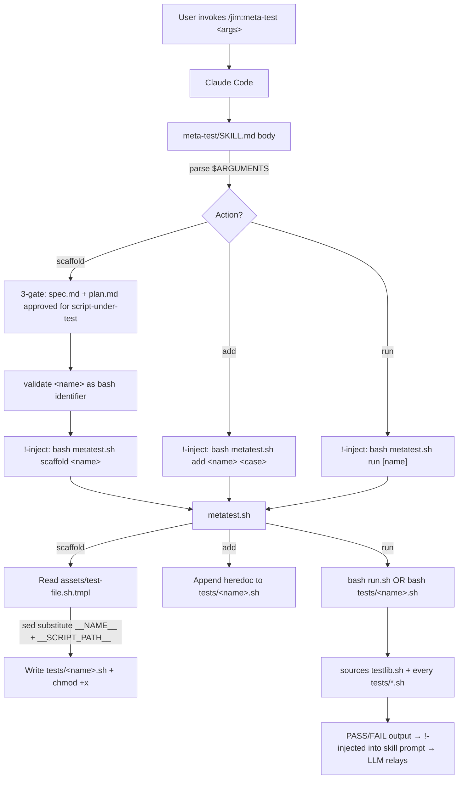

# 007 meta-test — Plan

## Overview

A `/jim:meta-test` skill at `skills/meta-test/` ships three bundled bash scripts (`testlib.sh` framework, `run.sh` aggregate runner, `metatest.sh` dispatcher) plus one scaffold template (`assets/test-file.sh.tmpl`). The user-facing SKILL.md exposes three actions — scaffold, add-case, run — gated per-action: scaffold requires an approved spec+plan for the script-under-test (mirroring meta-skill/meta-agent gating); add-case and run are ungated. The existing `tests/testlib.sh` and `tests/run.sh` files move into the skill's `scripts/` directory so the skill that runs the suite owns the runner, while per-feature test files stay at `tests/<name>.sh` and source the relocated lib via a `BASH_SOURCE`-relative path (the same composition pattern `jimfile.sh` already uses to call `jimconf.sh`).

## Design Decisions

### 1. Lib + runner location — Option (ii) from spec Open Questions

- **Chosen:** Move `tests/testlib.sh` → `skills/meta-test/scripts/testlib.sh` and `tests/run.sh` → `skills/meta-test/scripts/run.sh`. Per-feature test files (`tests/jimconf.sh`, `tests/jimfile.sh`, future `tests/<name>.sh`) stay in `tests/` and source the relocated lib via a `BASH_SOURCE`-relative path: `source "$(cd "$HERE/../skills/meta-test/scripts" && pwd)/testlib.sh"`.
- **Why:** The skill that runs the suite owns the runner. Symmetric with `skills/conf/scripts/jimconf.sh` (run by `/jim:conf`) and `skills/file/scripts/jimfile.sh` (run by `/jim:file`). The user explicitly raised this as the more honest shape during scoping. Standalone-runnability survives — the indirection is one extra `cd` per test file.
- **Rejected — Option (i) status quo (lib stays in `tests/`):** Soft separation between "runs tests" (skill) and "owns runner file" (`tests/`). The spec's Open Question framing explicitly noted this asymmetry as the reason to consider a move.
- **Rejected — Option (iii) cases-also-in-skill (`skills/meta-test/tests/...`):** Forces every jim feature's tests under one skill's directory. Confused ownership.

### 2. Per-action gating discipline (research signal)

- **Chosen:** Three actions, three gating policies.
  - **Scaffold (`/jim:meta-test <name>`):** full plan-gating — spec.md + plan.md must exist with `status: approved` for the script-under-test (`skills/<feature>/scripts/<name>.sh`). Mirrors `/jim:meta-skill` and `/jim:meta-agent` discipline.
  - **Add-case (`/jim:meta-test add <name> <case>`):** no skill-level gating beyond "tests/<name>.sh exists." Add-case is invoked inside the TDD loop of `/jim:build`, which has already gated on the plan; gating again is redundant and would create awkward "is there a plan for this case?" checks.
  - **Run (`/jim:meta-test run [name]`):** no gating. Pure pass-through to the test runner.
- **Why:** Spec AC says "approved spec.md + plan.md must exist before the skill scaffolds anything" — the verb "scaffolds" applies to the `<name>` action only. Add-case and run are different verbs with different lifecycles. Per-action gating respects the precedent without manufacturing gates where they don't fit.
- **Rejected — Skill-wide gating (every action requires spec/plan):** Run-action gating would block `/jim:meta-test run` from being a quick TDD feedback loop. Add-case gating would force a spec-edit cycle for every new test case, defeating TDD.

### 3. Dispatcher script name — `metatest.sh` (no hyphen)

- **Chosen:** Bundled dispatcher at `skills/meta-test/scripts/metatest.sh`. Test file at `tests/metatest.sh`. Case prefix `case_metatest_*`.
- **Why:** Bash function names cannot contain hyphens. The convention `case_<name>_<descr>` requires `<name>` to be a valid bash identifier. If the file were `tests/meta-test.sh`, the cases would have to be `case_meta-test_*` → invalid bash. Stripping the hyphen for the bash-side names keeps the slash-command (`/jim:meta-test`) and skill directory (`skills/meta-test/`) hyphenated for human readability while keeping bash names valid. Same pattern as `/jim:conf` → `jimconf.sh` (no hyphen needed there because the skill name has none, but the principle is "bash filenames track bash conventions").
- **Rejected — `meta-test.sh` filename:** invalidates `case_meta-test_*` function names downstream.

### 4. `<name>` argument validation (security + correctness boundary)

- **Chosen:** `metatest.sh` validates `<name>` as `^[a-zA-Z_][a-zA-Z0-9_]*$` (bash-identifier-safe). Reject hyphens, dots, slashes, leading digits, empty. Exit 1 with stderr message naming the bad input.
- **Why:** Two boundaries collapse into one rule. Security: `<name>` flows into `tests/<name>.sh` — `..`, `/`, control chars would write outside `tests/`. Correctness: `<name>` flows into `case_<name>_*` function definitions — non-identifier chars produce broken bash. Both rules subsume into "valid bash identifier." Simpler than two separate validators.
- **Rejected — slug-style normalization (lowercase + hyphenate non-alnum):** Would silently transform `meta-test` → `meta-test` (still bad) or `meta_test` (mangling, which the spec AC explicitly forbids: "no name-mangling"). Reject + ask the user to fix is honest.
- **Rejected — accept anything, fail at test-run time:** Pushes detection to the wrong layer.

### 5. Add-case conflict semantics (spec Open Question)

- **Chosen:** Exit 2, stderr `Error: case_<name>_<case> already exists in tests/<name>.sh`. No file mutation.
- **Why:** Mirrors `jimconf.sh`'s exit-2 = malformed invocation semantics (invalid input from the caller, not script-internal failure). Message names the conflict explicitly so the LLM can present an actionable error.
- **Rejected — exit 1:** Conflates with "scaffold refused — file exists" (also a caller-input issue) — harmless, but exit 2 is the more precise semantic.
- **Rejected — silently skip:** Loses the signal that the caller's intent was already satisfied; coder may think the case was added when it wasn't.

### 6. Run action — standalone-execution path with filter fallback (spec Open Question)

- **Chosen:** When `<name>` is passed: if `tests/<name>.sh` exists and is executable, invoke `bash tests/<name>.sh`. Otherwise fall back to `bash skills/meta-test/scripts/run.sh <name>` (filter mode). When `<name>` is omitted: `bash skills/meta-test/scripts/run.sh`. Exit code propagates.
- **Why:** The standalone path is the DX promise the user identified as "really cool" in the brainstorm — `bash tests/jimfile.sh` is the natural drill-down. Filter fallback covers the case where the file genuinely doesn't exist (typo or before-scaffold).
- **Rejected — always filter mode:** Reliable but doesn't reinforce the standalone-runnability DX win.

### 7. Scaffold template location and substitution (spec Open Question)

- **Chosen:** Template at `skills/meta-test/assets/test-file.sh.tmpl` with placeholders `__NAME__` (script-under-test name, becomes case prefix and `run_<name>` invoker name) and `__SCRIPT_PATH__` (path to the script-under-test, e.g., `skills/<feature>/scripts/<name>.sh`). Dispatcher substitutes via `sed -e 's/__NAME__/<name>/g' -e 's|__SCRIPT_PATH__|<placeholder>|g'`. The pipe-as-delimiter for `__SCRIPT_PATH__` avoids escaping slashes.
- **Why:** Mirrors the standard `assets/` pattern. Sed substitution is portable, dependency-free, and matches the other deterministic-bash idioms in jim. The `__SCRIPT_PATH__` placeholder is intentionally generic (`skills/CHANGEME/scripts/<name>.sh`) so the user edits it after scaffold — the dispatcher cannot reliably infer the feature directory from the script name alone.
- **Rejected — heredoc inline in dispatcher script:** Couples template editing to dispatcher edits; harder to review.
- **Rejected — taking `<feature>` as a second positional arg to scaffold:** Adds surface area; the spec says single positional `<name>` for scaffold.

### 8. Add-case template — inline heredoc in dispatcher

- **Chosen:** Add-case appends a 3-4 line heredoc directly from `metatest.sh`. Not a separate template file.
- **Why:** Case stub is trivially small (function signature + one TODO comment + closing brace). A separate `assets/case-stub.sh.tmpl` for ~5 lines of bash is template sprawl; coder finds the inline heredoc immediately when reading the dispatcher.
- **Rejected — `assets/case-stub.sh.tmpl`:** Symmetric with scaffold template but unnecessary at this size.

### 9. Skill body composition — three-action dispatcher in SKILL.md

- **Chosen:** Single SKILL.md body. First step: parse `$ARGUMENTS` to identify action (`<name>` / `add ...` / `run ...`). Branch to the action's section. Each section has its own gating ritual (or no-gate for run/add). Each section ends by `!`-injecting the dispatcher: `` !`bash ${CLAUDE_SKILL_DIR}/scripts/metatest.sh $ARGUMENTS` ``.
- **Why:** Mirrors `/jim:conf` and `/jim:file`'s "thin skill body, fat script" pattern but with action-conditional gating (which `/jim:conf` and `/jim:file` don't have because their actions are all introspection). The gating logic belongs in the SKILL.md (LLM-level — checks markdown frontmatter), not the script (script can't reliably grep markdown for `status: approved` and reason about it).
- **Rejected — three separate skills (`/jim:meta-test-scaffold`, `/jim:meta-test-add`, `/jim:meta-test-run`):** Slash-command sprawl. Subcommand argument is more idiomatic.
- **Rejected — gating inside the dispatcher script:** Script lacks LLM judgment for soft-gate edge cases (e.g., "spec exists but is `in-progress` — proceed?").

### 10. ARCHITECTURE.md update — skills tree + mermaid + Scripting Layer extension

- **Chosen:** Three additive edits in one PR-set:
  1. Add `meta-test/` block under `skills/` in the project tree (under `meta-agent/`), with one-line nodes for `SKILL.md`, `assets/test-file.sh.tmpl`, `scripts/{testlib.sh, run.sh, metatest.sh}`.
  2. Add `MT["/jim:meta-test"]` node to the mermaid Meta Skills subgraph and connect to `META`.
  3. Extend Plugin Conventions → Scripting Layer subsection with one paragraph naming the meta-test runner+lib relocation. Also update the existing `tests/` block's per-line annotations (the lines describing `run.sh` and `testlib.sh` now point at `skills/meta-test/scripts/`).
- **Why:** Mirrors 008/009's "doc updates land in same PR" discipline. The Scripting Layer subsection is the single canonical home for "which scripts exist and how they compose" — adding the third script there keeps the convention indexed.

### 11. CLAUDE.md update — five conventions, pointer-not-encyclopedia

- **Chosen:** Add a `# Bash scripts` section with five short rules: no source/eval of user data, no third-party deps, `set -uo pipefail` (not `-e`), `BASH_SOURCE`-relative for inter-script (not `${CLAUDE_PLUGIN_ROOT}` inside script bodies), pointers to `tests/testlib.sh` header and ARCHITECTURE.md Scripting Layer for canonical detail. Target ~10–12 lines.
- **Why:** Per spec AC. CLAUDE.md is loaded into every conversation; bloating it costs tokens permanently. Index-not-encyclopedia keeps the cost bounded; the canonical references absorb the depth.

## Constitution Check

**ARCHITECTURE.md status:** Present — constraints noted below.

| Constraint from ARCHITECTURE.md | Honored? | Notes |
| :--- | :--- | :--- |
| Skills directory contains `SKILL.md` ± `assets/` ± `references/` ± `scripts/` (Plugin Conventions §Skills) | Yes | New `skills/meta-test/` follows: `SKILL.md`, `assets/test-file.sh.tmpl`, `scripts/{testlib.sh, run.sh, metatest.sh}`. First meta-* skill to ship `assets/` and `scripts/`. |
| Plugin agents have lowest priority; project-level overrides take precedence | Yes | No new agent introduced; `/jim:meta-test` runs under `@jim:meta` (existing). |
| SKILL.md ≤ 500 lines | Yes | Target ~250–350 lines (mirrors `meta-skill`'s 470 / `meta-agent`'s 480 envelope, with three-action dispatch instead of single-flow gating). |
| Skills do not write to `.git/`, `~/.ssh/`, `node_modules/`, `.venv/`, `.env`, `.env-*` | Yes | All writes go to `skills/meta-test/`, `tests/`, `docs/specs/jim/{008,009}/`, `ARCHITECTURE.md`, `README.md`, `WORKFLOW.md`, `CLAUDE.md`. |
| Scripting Layer single-resolver/many-consumers/`${CLAUDE_PLUGIN_ROOT}` pattern | Yes (extended) | `metatest.sh` joins as the third script. ARCHITECTURE.md is updated in Task 23 to document the third script and the test-infrastructure relocation. |
| Tests live under `tests/`, not loaded by Claude Code | **Yes — with documented evolution.** Test *cases* (the inputs to test runs) stay under `tests/`. Test *framework* (`testlib.sh`) and *runner* (`run.sh`) move into `skills/meta-test/scripts/` because the skill that runs the suite owns its toolchain. Neither Claude Code's loader behavior nor the "no test code in skills" intent is changed — Claude Code loads SKILL.md content, not script content; bash scripts are inert until `!`-injected or invoked from Bash. The boundary that moves is "where the framework file lives," not "what gets loaded into LLM context." |
| Single source of truth for SDLC process is WORKFLOW.md | Yes | WORKFLOW.md is updated (Task 25) to add `/jim:meta-test` to the meta workflow narrative; the SDLC process itself is unchanged. |

## File Manifest

| Component | File Path | Action | Notes |
| :--- | :--- | :--- | :--- |
| Test framework lib | `skills/meta-test/scripts/testlib.sh` | Create (move) | Moved from `tests/testlib.sh`, content unchanged. Header docblock stays canonical for bash-test conventions. |
| Aggregate runner | `skills/meta-test/scripts/run.sh` | Create (move) | Moved from `tests/run.sh`. Internal `source` line updated to sibling-relative (`source "$(dirname "${BASH_SOURCE[0]}")/testlib.sh"`). Glob target stays `tests/*.sh` (PWD-relative; assumes invocation from repo root). |
| Action dispatcher | `skills/meta-test/scripts/metatest.sh` | Create | Bash dispatcher implementing scaffold/add/run subcommands. Mirrors `jimconf.sh`/`jimfile.sh` discipline (header docblock, `set -uo pipefail`, named section banners). |
| Scaffold template | `skills/meta-test/assets/test-file.sh.tmpl` | Create | Per-script test file template with `__NAME__` and `__SCRIPT_PATH__` placeholders. |
| User-facing skill | `skills/meta-test/SKILL.md` | Create | Three-action dispatcher in skill body. Per-action gating. `!`-injects `metatest.sh`. |
| Old testlib | `tests/testlib.sh` | Delete | Moved (no content change). |
| Old runner | `tests/run.sh` | Delete | Moved (no content change). |
| Per-script test (jimconf) | `tests/jimconf.sh` | Update | Single line: `source "$HERE/testlib.sh"` → `source "$(cd "$HERE/../skills/meta-test/scripts" && pwd)/testlib.sh"`. |
| Per-script test (jimfile) | `tests/jimfile.sh` | Update | Same single-line source change. |
| Dogfood test | `tests/metatest.sh` | Create | `case_metatest_*` cases covering scaffold, add, run actions and their refusal modes. Hand-authored (cannot dogfood-scaffold the very first test file). |
| Spec 008 forward-ref | `docs/specs/jim/008-jimconf/spec.md` | Update | Append "Note (added by spec 007)" paragraph in the testing section (after L76). Additive only. |
| Plan 008 forward-ref | `docs/specs/jim/008-jimconf/plan.md` | Update | Append "Note (added by spec 007)" paragraph in Decision 4 region. Additive only. |
| Spec 009 forward-ref | `docs/specs/jim/009-jimfile/spec.md` | Update | Append "Note (added by spec 007)" paragraph in the testing section (after L60). Additive only. |
| Plan 009 forward-ref | `docs/specs/jim/009-jimfile/plan.md` | Update | Append "Note (added by spec 007)" paragraph in Decision 9 region. Additive only. |
| Architecture doc | `ARCHITECTURE.md` | Update | Skills tree + mermaid Meta Skills subgraph + Scripting Layer extension + `tests/` annotations. |
| README | `README.md` | Update | Add `/jim:meta-test` to commands table; update test-running section to point at new runner location. |
| Workflow doc | `WORKFLOW.md` | Update | Add `/jim:meta-test` to command reference, plugin directory tree, and "Building Jim with Jim" section. |
| Project rules | `CLAUDE.md` | Update | Add `# Bash scripts` section per spec AC. |

## Interface Contracts

### `metatest.sh` CLI

```text
USAGE
    bash metatest.sh scaffold <name>           Create tests/<name>.sh from the asset template.
    bash metatest.sh add <name> <case_name>    Append case_<name>_<case_name>() stub to tests/<name>.sh.
    bash metatest.sh run                       Run all tests via the aggregate runner.
    bash metatest.sh run <name>                Run only tests/<name>.sh (standalone path) or filter fallback.

NAME VALIDATION
    <name> must match ^[a-zA-Z_][a-zA-Z0-9_]*$ (valid bash identifier).
    Rejected: hyphens, dots, slashes, leading digits, empty. Exit 1.

ACTIONS
    scaffold:
      - Refuse if tests/<name>.sh exists. Exit 1, stderr: "Error: tests/<name>.sh already exists."
      - Read template from skills/meta-test/assets/test-file.sh.tmpl (BASH_SOURCE-relative).
      - Substitute __NAME__ → <name>, __SCRIPT_PATH__ → "skills/CHANGEME/scripts/<name>.sh".
      - Write to tests/<name>.sh, chmod +x.
      - stdout: confirmation message naming the file and the placeholders to edit.

    add:
      - Refuse if tests/<name>.sh does not exist. Exit 1, stderr: "Error: tests/<name>.sh does not exist."
      - Refuse if grep -q "^case_<name>_<case_name>()" tests/<name>.sh. Exit 2, stderr: "Error: case_<name>_<case_name> already exists in tests/<name>.sh".
      - Append a heredoc-defined case stub (function signature + TODO comment + closing brace) to tests/<name>.sh.
      - stdout: confirmation message naming the appended function.

    run [<name>]:
      - No args: exec bash skills/meta-test/scripts/run.sh (BASH_SOURCE-relative). Propagate exit code.
      - With <name>: if tests/<name>.sh exists, exec bash tests/<name>.sh. Else exec bash skills/meta-test/scripts/run.sh <name> (filter fallback).
      - Output is the runner's output verbatim.

EXIT CODES
    0   Success (or runner exit code propagated by run action).
    1   Validation/conflict error (bad name, file missing for add, file present for scaffold).
    2   Add-case duplicate-case-name conflict.
    3   Reserved (currently unused).
    Non-zero from run action: propagated from underlying runner; semantics defined by run.sh.

OUTPUT
    Confirmation/diagnostic messages to stdout. Errors to stderr. Output sized to be readable
    when !-injected into a skill body.

NEVER
    Never source or eval user-supplied content. Never write outside tests/ or skills/meta-test/scripts/.
    Never assume a TTY (no read -p, no terminal colors).
```

### Scaffold template (`assets/test-file.sh.tmpl`) — body sketch

```text
#!/usr/bin/env bash
# tests/__NAME__.sh — tests for __SCRIPT_PATH__
#
# Conventions: see skills/meta-test/scripts/testlib.sh header (canonical).
# Run standalone: bash tests/__NAME__.sh
# Run all:        bash skills/meta-test/scripts/run.sh
#
set -uo pipefail

HERE="$(cd "$(dirname "${BASH_SOURCE[0]}")" && pwd)"
source "$(cd "$HERE/../skills/meta-test/scripts" && pwd)/testlib.sh"

SCRIPT="$REPO_ROOT/__SCRIPT_PATH__"

# ─── Section: Per-script invoker ─────────────────────────────────────────────

run___NAME__() {
  OUT="$(mktemp)"; ERR="$(mktemp)"
  bash "$SCRIPT" "$@" >"$OUT" 2>"$ERR"; RC=$?
  OUT_TXT="$(cat "$OUT")"; ERR_TXT="$(cat "$ERR")"
  rm -f "$OUT" "$ERR"
}

# ─── Section: Test cases ─────────────────────────────────────────────────────

# AC: scaffolder produces a runnable file with at least one passing case.
case___NAME___smoke() {
  # TODO: invoke the script and assert on its output/exit/stderr.
  assert_eq "0" "0" "smoke placeholder — replace with a real assertion"
}

# ─── Section: Standalone-runnable tail ───────────────────────────────────────
#
# This file works two ways:
#   1. bash tests/__NAME__.sh       → runs only this file's cases (standalone).
#   2. bash skills/meta-test/scripts/run.sh
#                                   → sources this file alongside every other
#                                     tests/*.sh and runs the union of cases.
#
# How the dual-mode works:
#   ${BASH_SOURCE[0]} is the file bash is currently reading.
#   ${0} is the file bash was invoked with.
#   They match ONLY when this file is run directly. When the aggregate runner
#   sources us, BASH_SOURCE[0] is this file but $0 is run.sh — they diverge.
#   So the block below runs the cases only on direct invocation; otherwise it
#   stays silent and lets the aggregate runner decide what to dispatch.
#
# DO NOT "tidy" this into something simpler — $BASH_SOURCE (no index) and
# ${BASH_SOURCE} behave subtly differently in older bash and break aggregate
# runs.
#
if [[ "${BASH_SOURCE[0]}" == "${0}" ]]; then
  if [[ ! -e "$SCRIPT" ]]; then
    echo "NOTE: script under test not found at $SCRIPT — every test will fail."
  fi
  FILTER="${1:-}"
  run_discovered_cases
fi
```

### Skill body sketch (`skills/meta-test/SKILL.md`)

```yaml
---
name: meta-test
description: >
  Scaffold a new bash test file, append a test case, or run jim's bash-script test suite.
  Use when implementing or extending tests for jim's own deterministic bash scripts under
  skills/*/scripts/ (e.g., jimconf.sh, jimfile.sh). Do not use for application-code testing
  or for testing skill/agent prompts (those are validated by checklist).
agent: meta
argument-hint: "<name> | add <name> <case_name> | run [name]"
allowed-tools: Bash(bash *)
---
```

Body shape (~250-350 lines):
1. Action dispatch (parse `$ARGUMENTS`, branch on first token).
2. Scaffold action: 3-gate (Spec for script-under-test → Plan for script-under-test → no Research gate; meta-test inherits the upstream gates) → name validation → `!`-inject `metatest.sh scaffold <name>`.
3. Add-case action: file-exists check → name + case_name validation → `!`-inject `metatest.sh add <name> <case_name>`.
4. Run action: `!`-inject `metatest.sh run [name]`. No gating.
5. Validation Checklist (mirrors meta-skill's 19-point checklist, scaled to meta-test surface).

## Data Flow



## Task Breakdown

TDD-ordered. **Convention:** every `**Verify:**` shell command assumes PWD is the repo root (`/home/adri/projects/JamSuite/repos/jim`). The coder runs `cd <repo-root>` once at the start of the build session.

### Phase A — Lib + runner relocation (tests pass after every step)

1. [x] **Move `tests/testlib.sh` → `skills/meta-test/scripts/testlib.sh`.** Use `mkdir -p skills/meta-test/scripts && git mv tests/testlib.sh skills/meta-test/scripts/testlib.sh` (preserves history). Header docblock stays canonical and unchanged.
   **Verify:** `test -f skills/meta-test/scripts/testlib.sh && ! test -f tests/testlib.sh`

2. [x] **Move `tests/run.sh` → `skills/meta-test/scripts/run.sh`.** Use `git mv`. Update its internal `source` line for `testlib.sh` to sibling-relative (`source "$(cd "$(dirname "${BASH_SOURCE[0]}")" && pwd)/testlib.sh"` if it isn't already sibling-relative). Glob target stays `tests/*.sh` (PWD-relative).
   **Verify:** `test -f skills/meta-test/scripts/run.sh && ! test -f tests/run.sh`

3. [x] **Update `tests/jimconf.sh` source line** to point at the relocated testlib. Single-line change: replace `source "$HERE/testlib.sh"` with `source "$(cd "$HERE/../skills/meta-test/scripts" && pwd)/testlib.sh"`.
   **Verify:** `bash tests/jimconf.sh 2>&1 | tail -3 | grep -q '12 passed'`  *(all 12 jimconf cases pass standalone)*

4. [x] **Update `tests/jimfile.sh` source line** with the identical change.
   **Verify:** `bash tests/jimfile.sh 2>&1 | tail -3 | grep -q '31 passed'`  *(all 31 jimfile cases pass standalone)*

5. [x] **Smoke-test the relocated aggregate runner.** Confirm `bash skills/meta-test/scripts/run.sh` discovers all `tests/*.sh` files and runs every case.
   **Verify:** `bash skills/meta-test/scripts/run.sh 2>&1 | tail -3 | grep -q '43 passed'`  *(12 jimconf + 31 jimfile = 43)*

### Phase B — Dispatcher + template (TDD on `metatest.sh` itself)

6. [x] **Hand-author `tests/metatest.sh` (red phase).** Create the dogfood test file manually (cannot scaffold it yet — chicken-and-egg). File follows the same shape as `tests/jimconf.sh` and `tests/jimfile.sh`: HERE-pattern, source the relocated testlib, define `SCRIPT_METATEST="$REPO_ROOT/skills/meta-test/scripts/metatest.sh"`, define a `run_metatest()` invoker. Add ~12 cases: (a) `case_metatest_scaffold_creates_file_from_template`; (b) `case_metatest_scaffold_substitutes_name_placeholder`; (c) `case_metatest_scaffold_substitutes_script_path_placeholder`; (d) `case_metatest_scaffold_refuses_on_existing_file_exit_1`; (e) `case_metatest_scaffold_rejects_bad_name_with_hyphen`; (f) `case_metatest_scaffold_rejects_bad_name_path_traversal`; (g) `case_metatest_scaffold_makes_file_executable`; (h) `case_metatest_add_appends_case_function`; (i) `case_metatest_add_refuses_duplicate_case_exit_2`; (j) `case_metatest_add_refuses_missing_file_exit_1`; (k) `case_metatest_run_no_args_invokes_aggregate_runner`; (l) `case_metatest_run_with_name_invokes_standalone_path`. Each case has a `# AC: <text>` mapping comment. Append the standalone-runnable tail (with the explanatory comment block per the scaffold template above).
   **Verify:** `bash tests/metatest.sh 2>&1 | tail -3 | grep -Eq '(failed|script under test not found)'`  *(red — script doesn't exist yet)*

7. [x] **Create `skills/meta-test/assets/test-file.sh.tmpl`** with the body specified in Interface Contracts §"Scaffold template". Placeholders `__NAME__` and `__SCRIPT_PATH__`. Includes the explanatory comment block above the standalone-runnable tail.
   **Verify:** `test -f skills/meta-test/assets/test-file.sh.tmpl && grep -q '__NAME__' skills/meta-test/assets/test-file.sh.tmpl && grep -q '__SCRIPT_PATH__' skills/meta-test/assets/test-file.sh.tmpl && grep -q 'BASH_SOURCE\[0\]' skills/meta-test/assets/test-file.sh.tmpl`

8. [x] **Create `skills/meta-test/scripts/metatest.sh`** implementing the full CLI from Interface Contracts. Mirror `jimconf.sh`/`jimfile.sh` discipline: file header docblock, named section banners (Globals → Validation → Action handlers → Argument dispatch → Implementation notes), per-helper docblocks, `set -uo pipefail`, single `main "$@"` at file end, no `source`/`eval` of user content. Template path resolved via `BASH_SOURCE`-relative: `TEMPLATE="$(cd "$(dirname "${BASH_SOURCE[0]}")/../assets" && pwd)/test-file.sh.tmpl"`. Runner path the same way: `RUNNER="$(cd "$(dirname "${BASH_SOURCE[0]}")" && pwd)/run.sh"`. Make script executable.
   **Verify:** `bash tests/metatest.sh 2>&1 | tail -3 | grep -q '12 passed'`  *(all 12 metatest cases pass)*

9. [x] **Cross-agent portability smoke test.** Confirm `metatest.sh` runs without a TTY.
   **Verify:** `bash -c 'bash skills/meta-test/scripts/metatest.sh' < /dev/null; test $? -eq 2`  *(exit 2 = "Malformed invocation" with usage; no TTY-related failure)*

10. [x] **Re-run the full test suite.** Confirm Phase B did not regress Phase A.
    **Verify:** `bash skills/meta-test/scripts/run.sh 2>&1 | tail -3 | grep -q '55 passed'`  *(43 + 12 metatest = 55)*

### Phase C — User-facing skill

11. [x] **Create `skills/meta-test/SKILL.md`** with the frontmatter specified in Interface Contracts and a body covering: action dispatch on `$ARGUMENTS`, per-action gating per Design Decision 2, validation steps before script invocation, the `!`-injection of `metatest.sh`, and a Validation Checklist mirroring `meta-skill` and `meta-agent` structure. YAML frontmatter is the very first content (no leading H1) per cross-agent hygiene.
    **Verify:** `head -n 1 skills/meta-test/SKILL.md | grep -q '^---$' && grep -q '^name: meta-test$' skills/meta-test/SKILL.md && grep -q '^agent: meta$' skills/meta-test/SKILL.md && grep -q 'metatest.sh' skills/meta-test/SKILL.md && wc -l < skills/meta-test/SKILL.md | awk '$1 < 500 { exit 0 } { exit 1 }'`

12. [x] **Bind `/jim:meta-test` to `@jim:meta`.** Add `meta-test` to `agents/meta.md`'s `skills:` field so the skill content is preloaded into meta's context (matches how `meta-skill` and `meta-agent` are bound).
    **Verify:** `grep -E 'skills:\s*\[.*meta-test.*\]' agents/meta.md`

### Phase D — Retrospective edits (specs 008/009)

13. [x] **Append forward-reference paragraph to `docs/specs/jim/008-jimconf/spec.md`** after the testing-strategy resolution at L76. Format: a `> **Note (added by spec 007):** Tests for jimconf now follow the conventions ratified by spec 007 (`/jim:meta-test`). The framework lives at `skills/meta-test/scripts/testlib.sh`; new test cases should be scaffolded via `/jim:meta-test add jimconf <case_name>`.` blockquote. Additive only; no existing content modified.
    **Verify:** `grep -q 'added by spec 007' docs/specs/jim/008-jimconf/spec.md`

14. [x] **Append forward-reference paragraph to `docs/specs/jim/008-jimconf/plan.md`** in the Decision 4 region (testing strategy). Same format and content scope as Task 13.
    **Verify:** `grep -q 'added by spec 007' docs/specs/jim/008-jimconf/plan.md`

15. [x] **Append forward-reference paragraph to `docs/specs/jim/009-jimfile/spec.md`** after L60 (the testing AC). Same format, scoped to jimfile.
    **Verify:** `grep -q 'added by spec 007' docs/specs/jim/009-jimfile/spec.md`

16. [x] **Append forward-reference paragraph to `docs/specs/jim/009-jimfile/plan.md`** in the Decision 9 region (test runner). Same format, scoped to jimfile.
    **Verify:** `grep -q 'added by spec 007' docs/specs/jim/009-jimfile/plan.md`

### Phase E — Doc updates

17. [x] **Update `ARCHITECTURE.md` skills tree** (around L23-42 area) — add `meta-test/` block beneath `meta-agent/` with one-line nodes for SKILL.md, assets/test-file.sh.tmpl, scripts/{testlib.sh, run.sh, metatest.sh}.
    **Verify:** `grep -q 'meta-test/' ARCHITECTURE.md && grep -q 'metatest.sh' ARCHITECTURE.md && grep -q 'test-file.sh.tmpl' ARCHITECTURE.md`

18. [x] **Update `ARCHITECTURE.md` `tests/` block** — change the per-line annotations: remove `run.sh` and `testlib.sh` from the `tests/` block (they moved); leave `jimconf.sh` and `jimfile.sh` annotations in place; add `metatest.sh` annotation as the third per-script test file.
    **Verify:** `grep -A 6 '^├── tests/' ARCHITECTURE.md | grep -q 'metatest.sh' && ! grep -A 6 '^├── tests/' ARCHITECTURE.md | grep -q 'testlib.sh'`

19. [x] **Update `ARCHITECTURE.md` mermaid Meta Skills subgraph** (around L84-87) — add `MT["/jim:meta-test"]` and connect to `META`.
    **Verify:** `grep -q 'MT\["/jim:meta-test"\]' ARCHITECTURE.md`

20. [x] **Extend `ARCHITECTURE.md` Plugin Conventions → Scripting Layer** (L246-255 area) — add a paragraph naming `metatest.sh` as the third script and the test-infrastructure relocation (testlib + runner now live in `skills/meta-test/scripts/`, sourced by per-script test files via `BASH_SOURCE`-relative path). Cite the inter-script composition pattern shared with `jimfile.sh`.
    **Verify:** `grep -q 'metatest' ARCHITECTURE.md && grep -q 'meta-test/scripts/testlib' ARCHITECTURE.md`

21. [x] **Update `README.md`** — add `/jim:meta-test` to the commands table (after `/jim:meta-agent`); update any "running tests" section to point at the new runner location (`bash skills/meta-test/scripts/run.sh` instead of `bash tests/run.sh`).
    **Verify:** `grep -q '/jim:meta-test' README.md && grep -q 'meta-test/scripts/run.sh' README.md`

22. [x] **Update `WORKFLOW.md`** — add `/jim:meta-test` to: (a) command reference table; (b) plugin directory tree; (c) "Building Jim with Jim" section narrative.
    **Verify:** `grep -c '/jim:meta-test' WORKFLOW.md | awk '$1 >= 3 { exit 0 } { exit 1 }'`  *(at least 3 mentions = all three sections)*

23. [x] **Update `CLAUDE.md`** — add a `# Bash scripts` section per spec AC. Five short rules (no source/eval, no third-party deps, `set -uo pipefail` not `-e`, `BASH_SOURCE`-relative for inter-script not `${CLAUDE_PLUGIN_ROOT}` inside script bodies, pointers to `tests/testlib.sh`...wait, that path no longer exists. Update pointer to `skills/meta-test/scripts/testlib.sh`). Target ~10-12 lines total.
    **Verify:** `grep -q '^# Bash scripts$' CLAUDE.md && grep -q 'set -uo pipefail' CLAUDE.md && grep -q 'BASH_SOURCE' CLAUDE.md && grep -q 'skills/meta-test/scripts/testlib.sh' CLAUDE.md`

### Phase F — End-to-end + dogfood

24. [x] **Re-run the full test suite end-to-end after all skill + doc updates.** Confirms no regression introduced by the moves and updates.
    **Verify:** `bash skills/meta-test/scripts/run.sh 2>&1 | tail -3 | grep -q '55 passed'`

25. [x] **Manual dogfood walkthrough.** From a scratch directory (or repo root): (a) confirm `/jim:meta-test scaffoldtest` (with a name that has no spec/plan) **refuses** with the missing-spec gate message; (b) create a throwaway `docs/specs/jim/999-scratchtest/{spec.md,plan.md}` (status: approved) and confirm `/jim:meta-test scratchtest` **succeeds** and produces a runnable file; (c) confirm `bash tests/scratchtest.sh` exits 0 (the scaffolded smoke case has a placeholder assertion that passes); (d) confirm `/jim:meta-test add scratchtest a_new_case` appends correctly; (e) confirm `/jim:meta-test run scratchtest` runs the file standalone; (f) clean up scratchtest spec dir and `tests/scratchtest.sh`. Document the walkthrough output in `docs/debug/$(date +%Y%m%d)-meta-test-walkthrough.md`.
    **Verify:** `test -f docs/debug/$(date +%Y%m%d)*-meta-test-walkthrough.md`

## Requirements Coverage Summary

| Spec Acceptance Criterion | Addressed In Task(s) |
| :--- | :--- |
| `/jim:meta-test` skill at `skills/meta-test/SKILL.md`, owned by `@jim:meta`, with plan-gating | 11, 12 |
| Scaffold action — template + docblock + invoker stub + smoke case + standalone-runnable tail | 7 (template), 8 (script), 11 (skill body) |
| Add-case action — appends case stub, refuses on conflict | 8 (script), 11 (skill body) |
| Run action — runs all or one file, propagates exit code | 8 (script), 11 (skill body) |
| Free-form name argument, no enforced prefix or mangling | 8 (validation rejects only invalid bash identifiers; no transformation) |
| Conflict handling — scaffold refuses if file exists | 8 (script behavior), 6 (test case d) |
| Convention authority — single canonical location, no duplication | 7 (template cites testlib header), 11 (skill body cites testlib header), 23 (CLAUDE.md is pointer-only) |
| ARCHITECTURE.md updated — skills tree, mermaid, Plugin Conventions | 17, 18, 19, 20 |
| README.md updated — commands table, test-running section | 21 |
| WORKFLOW.md updated — command ref, directory tree, "Building Jim with Jim" | 22 |
| CLAUDE.md updated — Bash scripts section, 5 rules + pointer | 23 |
| Retrospective edits to specs 008 and 009 (spec.md + plan.md each) | 13, 14, 15, 16 |
| Test surface for `/jim:meta-test` itself, scaffolded by dogfooding | 6 (initial hand-author for chicken-and-egg), 25 (dogfood walkthrough) |
| Existing self-hosted specs continue to work (zero regression) | 3, 4, 5, 10, 24 |

No `[NEEDS CLARIFICATION]` markers — all spec ACs are covered by tasks.

## Out of Scope

- **Migrating existing test files to be scaffolded retroactively.** `tests/jimconf.sh` and `tests/jimfile.sh` were hand-authored before `/jim:meta-test` existed; they're updated only to fix the source line (Phase A), not regenerated through the scaffolder. Scaffolder-equivalent shape is enforced going forward, not retroactively.
- **Auto-running tests after scaffold.** Scaffold and run remain separate actions per spec AC.
- **`/jim:meta-test list` / `status` / discovery surfaces.** Per spec OoS.
- **Convention compliance auditing** of existing files. Per spec OoS.
- **Scaffolding the dogfood test file via the dispatcher.** Chicken-and-egg — `tests/metatest.sh` is hand-authored in Task 6 because the dispatcher doesn't exist yet. Once it exists, future tests scaffold normally.
- **Inferring `<feature>` directory from `<name>` in scaffold.** Scaffold uses `__SCRIPT_PATH__` placeholder = `skills/CHANGEME/scripts/<name>.sh`; user edits after scaffold. Reliable inference would require parsing existing skill directories — premature.
- **CI integration.** No GitHub Actions, no pre-commit hooks. Coder runs `bash skills/meta-test/scripts/run.sh` manually or via `/jim:meta-test run`.
- **Cross-agent (Codex/Gemini/Cursor) integration code.** Inherits 008/009's stance: hygiene constraints honored (no TTY, no PLUGIN_ROOT inside script body, YAML-first SKILL.md), but no cross-agent integration code is written.

## Open Questions

- [x] ~~Lib + runner location?~~ → Option (ii) — move into skill (Decision 1).
- [x] ~~Update-mode argument validation (add-case conflict)?~~ → Exit 2, stderr names the conflict (Decision 5).
- [x] ~~Run action — standalone vs filter?~~ → Standalone with filter fallback (Decision 6).
- [x] ~~Scaffold template location?~~ → `skills/meta-test/assets/test-file.sh.tmpl` with `__NAME__` and `__SCRIPT_PATH__` placeholders (Decision 7).
- [x] ~~Per-action gating discipline?~~ → Scaffold gated, add-case and run ungated (Decision 2).
- [x] ~~Dispatcher script name (`metatest.sh` vs `meta-test.sh`)?~~ → `metatest.sh` (no hyphen) so case prefixes `case_metatest_*` are valid bash identifiers (Decision 3).
- [x] ~~`<name>` argument validation?~~ → Bash-identifier-safe `^[a-zA-Z_][a-zA-Z0-9_]*$`; reject hyphens, dots, slashes, leading digits, empty (Decision 4).
