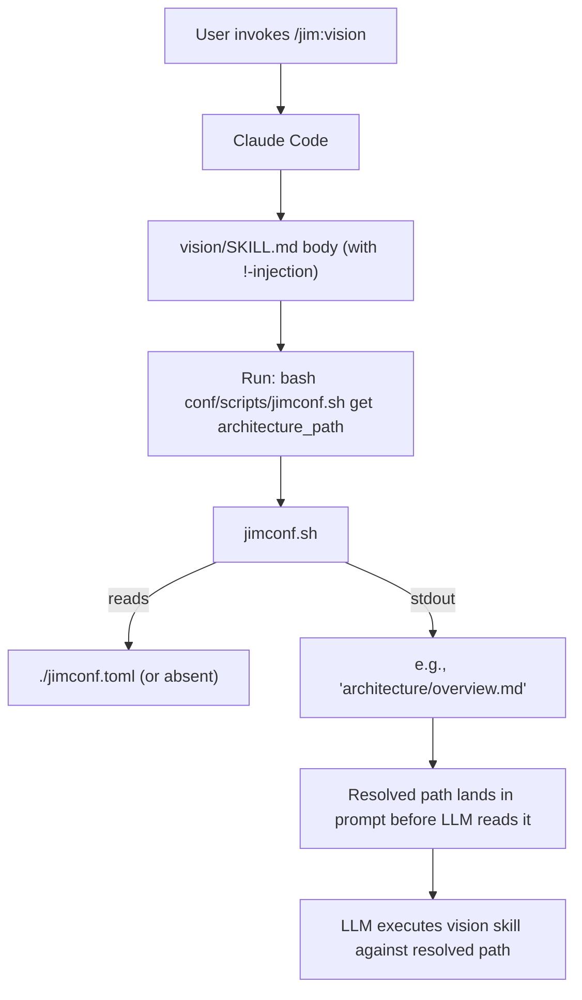

# 008 jimconf — Plan

## Overview

A single bash resolver script (`skills/conf/scripts/jimconf.sh`) reads `jimconf.toml` at the project root and is invoked from each consuming skill via Claude Code's `` !`<command>` `` injection primitive — the resolved path lands in the skill's prompt deterministically before the LLM sees it. A thin user-facing `/jim:conf` skill wraps the same script for human introspection. Tests are written in plain bash with no third-party dependencies, run via `bash tests/run.sh`, and follow strict inline-documentation conventions so any contributor can read the test file top-to-bottom and understand it without reference docs.

## Design Decisions

### 1. Resolution mechanism: single bash script + `!`-injection (Option B from research)

- **Chosen:** One script at `skills/conf/scripts/jimconf.sh`. Consuming skills invoke it via `` !`bash ${CLAUDE_PLUGIN_ROOT}/skills/conf/scripts/jimconf.sh get <key>` `` in their SKILL.md body. Output replaces the placeholder before the LLM sees the prompt.
- **Why:** Single source of truth. Replaces ~20 scattered "if it exists" prose patterns with one tested codepath. `!`-injection is a documented Claude Code primitive (`code.claude.com/docs/en/skills`); `${CLAUDE_PLUGIN_ROOT}` is the documented plugin-root substitution (`code.claude.com/docs/en/plugins-reference#environment-variables`) that resolves to the plugin's installation directory regardless of which skill is consuming the script. Substitution happens at content-render time (before `!`-injection runs), so the path is fully resolved before bash sees it. Works at every install scope (personal/project/plugin) without layout-coupled `..` walks.
- **Rejected — Option A (per-skill inline grep):** Duplicates parsing logic across every skill; no central place to test or extend.
- **Rejected — Option C (`/jim:conf` user-facing skill that other skills don't use):** Doesn't solve the duplication problem; Open Question #3 in the spec was specifically about eliminating this.

### 2. Config file format: flat `KEY = "value"` lines (valid TOML, bash-grep-parseable)

- **Chosen:** `jimconf.toml` at project root. Top-level scalar keys only. Example:
  ```toml
  specs_path = "docs/specs"
  architecture_path = "ARCHITECTURE.md"
  ```
- **Why:** Valid TOML (a real parser will accept it) AND parseable with `grep | cut | tr` — zero external deps. Editor syntax highlighting via `.toml` extension. Matches the user's stated preferences (visible, single extension, no extra dots, mirrors `/jim:conf`). Cross-agent neutral — not under any single agent's dotdir.
- **Rejected — `.claude/jim.local.md`:** Couples jim to Claude Code; the path config is project-wide metadata, not Claude state.
- **Rejected — `.jim/jimconf.toml`:** User explicitly ruled out a `.jim/` folder ("the whole point is to make where we store documents more flexible").
- **Rejected — `docs/jim/jimconf.toml`:** Circular — `docs/` itself is configurable.
- **Rejected — bash `source` of `KEY=VALUE` files:** `source` executes the file; security risk.

### 3. /jim:conf interface (the user's question #2)

- **Chosen:** Two layers, single underlying engine.
  - **Engine — the script (`jimconf.sh`):** Direct CLI. Skills consume it via `!`-injection; no skill-to-skill routing. See Interface Contracts below for full CLI.
  - **User-facing skill — `/jim:conf`:** Thin **standalone** wrapper for humans who want to inspect their config. `/jim:conf get specs`, `/jim:conf list`, `/jim:conf path`. The skill body is one `!`-injection that calls the same script. **No `agent:` binding** — there's no LLM reasoning to delegate, so the skill stands alone rather than being bound to `@jim:meta` (which is for plugin-build operations, not end-user introspection).
- **Why:** Claude Code has no clean "skill A calls skill B" primitive. Skills invoke shell commands via `!`-injection; the script *is* the call surface. The `/jim:conf` skill exists for the *user*, not for *machine* invocation. Separation keeps the skill-name pollution low (one new slash command, not per-key).
- **Rejected — `/jim:conf` skill called from inside other skills:** No clean mechanism in Claude Code for chained skill invocation. Direct script-via-Bash is what the platform supports.
- **Rejected — multiple skills (`/jim:conf-get`, `/jim:conf-list`):** Slash-command sprawl; subcommand argument is more idiomatic.

### 4. Testing strategy (the user's question #1)

- **Chosen:** **Plain-bash test runner at `tests/run.sh`** with **zero third-party dependencies**. The runner uses a small handcrafted assert helper, runs each test in an isolated temp directory, and reports pass/fail counts. Run with `bash tests/run.sh` from anywhere bash runs. Tests are not loaded by Claude Code (it reads `skills/` and `agents/` only) and are inert at runtime.
- **Documentation discipline (mandatory for `tests/run.sh`):**
  1. **File header docblock** explaining: what the file tests, how to run it, expected output shape, exit code semantics, and how to add a new test case (3-step recipe).
  2. **Section banners** dividing the file into named sections — Header / Assert helpers / Setup / Test cases / Reporter — each preceded by a `# ─── Section: <name> ───` line.
  3. **Per-helper docblocks** above each function: 2-line summary of purpose and a usage example as a comment.
  4. **Per-test-case docblocks** above each test: 1 line stating the behavior being verified, mapped back to the spec AC it covers (e.g., `# AC: zero-config baseline preserved`).
  5. **No clever bash.** Prefer explicit over terse. No `||` / `&&` chains for flow control where an `if` would read more clearly. No magic `$?` checks more than one line away from the command.
  6. **Reading checkpoint at file end:** a comment block titled `## Maintenance notes` listing common gotchas (e.g., temp dir cleanup, `set -euo pipefail` interactions with `run`-style capture).
- **Why:** Zero-dep matches user preference (no `brew install bats-core` step, no contributor onboarding tax). The script-under-test (`jimconf.sh`) is small (~6 keys, ~4 subcommands) so the test surface is bounded — a hand-rolled runner of ~150-200 well-documented lines is readable, reviewable, and survives an unfamiliar contributor reading it cold.
- **Rejected — bats-core:** Adds a third-party install requirement. User prefers no external deps.
- **Rejected — colocated `--self-test` flag inside the script:** Mixes test logic into production code; harder to read; production script grows unbounded as test count grows.
- **Rejected — shunit2:** Same dependency objection as bats.
- **Rejected — pytest / Python harness:** Adds a Python dependency for testing a bash script. Overkill.
- **Rejected — no automated tests, manual walkthrough only:** The script is the first executable code in jim and its behavior must be regression-proof. Manual-only is acceptable for skill prompts (which are LLM-interpreted) but not for deterministic code.

### 5. /jim:meta-test or /jim:self-test skill — DEFERRED

- **Chosen:** Do not introduce a `/jim:meta-test` or `/jim:self-test` skill in this spec. Document `bats tests/` in README/CONTRIBUTING and let developers run it directly.
- **Why:** Tests run via a one-line CLI command; wrapping in a skill adds machinery (SKILL.md, frontmatter, agent binding) without solving a real problem. If/when CI integration, convention enforcement, or test-result reporting is needed, a future spec can add `/jim:meta-test` purely additively.
- **Rejected — `/jim:meta-test` in v1:** YAGNI. The skill would add maintenance burden without immediate user value.

> **Note (added by spec 007):** The deferral above has been resolved — spec 007 introduces `/jim:meta-test` as the meta skill for scaffolding and running jim's bash-script tests. As part of that work, `tests/run.sh` and `tests/testlib.sh` were relocated to `skills/meta-test/scripts/`; `tests/jimconf.sh` was updated to source the relocated lib via a `BASH_SOURCE`-relative path. Run jimconf tests with `bash tests/jimconf.sh` (standalone) or `bash skills/meta-test/scripts/run.sh` (aggregate). Future jimconf test cases should be appended via `/jim:meta-test add jimconf <case_name>`.

### 6. Caching / resolution timing

- **Chosen:** No caching. Each `!`-injection call re-runs the script. The script reads `jimconf.toml` once per invocation.
- **Why:** Spec only requires consistency within a single skill run. `!`-injection runs once per invocation and the result is fixed in the prompt — consistent by construction. File-read overhead is negligible at human-typing scale.
- **Rejected — session cache:** Adds state; no measured performance need.

### 7. Refactor scope: `path resolution only`, not existence checks

- **Chosen:** Skills replace hardcoded path literals (e.g., `ARCHITECTURE.md`) with `!`-injected resolved paths. Existing existence-check prose (e.g., "if it exists") stays.
- **Why:** Spec Out of Scope explicitly excludes refactoring existence-check prose to deterministic helpers. Spec AC #4 requires path *resolution* through config; AC #5 explicitly states existence checking is the consuming skill's concern. This plan honors both.
- **Rejected — opportunistic refactor of existence-check prose:** Would expand scope and contradict the spec's Out of Scope.

### 8. ARCHITECTURE.md update bundled in this PR set

- **Chosen:** Update `ARCHITECTURE.md` in the same PR sequence to reflect the new `skills/conf/scripts/` directory and the move from "pure markdown" to "markdown + minimal scripting layer for deterministic config resolution."
- **Why:** Spec Open Question #4 explicitly requires this. ARCHITECTURE.md L181, L183 currently claim jim is "pure markdown — no build step, no dependencies, no package manager"; that claim becomes false the moment `jimconf.sh` lands. Constitution Check below documents the divergence.
- **Rejected — separate PR for ARCHITECTURE.md:** Leaves the repo in an inconsistent state mid-merge.

## Constitution Check

**ARCHITECTURE.md status:** Present — constraints noted below.

| Constraint from ARCHITECTURE.md | Honored? | Notes |
| :--- | :--- | :--- |
| Skills directory contains `SKILL.md` ± `assets/` ± `references/` ± `scripts/` (L131) | Yes | New `skills/conf/SKILL.md` and `skills/conf/scripts/jimconf.sh` follow this pattern |
| Plugin agents have lowest priority; project-level overrides take precedence (L223) | Yes | No new agent introduced; existing `@jim:meta` is the natural owner of `/jim:conf` if any |
| SKILL.md ≤ 500 lines; agent body ≤ 800 tokens (L233-L234) | Yes | `/jim:conf` SKILL.md is small (~50-100 lines) |
| Skills do not write to `.git/`, `~/.ssh/`, `node_modules/`, `.venv/`, `.env`, `.env-*` (L190) | Yes | All writes are to `skills/conf/`, `tests/`, `jimconf.toml`, or existing skill files |
| **"Pure markdown — no build step, no dependencies, no package manager" (L181, L183)** | **No — explicit divergence** | This plan introduces `skills/conf/scripts/jimconf.sh` (bash) and a developer-only `bats-core` testing dependency. ARCHITECTURE.md is updated as part of this plan (Task 14) to reflect the new "markdown + minimal scripting layer" reality. Spec Open Question #4 explicitly authorized this divergence. |
| Single source of truth for SDLC process is `WORKFLOW.md` (L150-L152) | Yes | `WORKFLOW.md` does not need updating; configuration is a runtime concern, not a process concern |

## File Manifest

| Component | File Path | Action | Notes |
| :--- | :--- | :--- | :--- |
| Resolver script | `skills/conf/scripts/jimconf.sh` | Create | Bash script implementing the CLI in Interface Contracts |
| /jim:conf skill | `skills/conf/SKILL.md` | Create | Thin user-facing wrapper around `jimconf.sh` |
| Test runner | `tests/run.sh` | Create | Plain-bash, zero-dep runner for `jimconf.sh`. Heavily documented per Decision 4. Supports filter-by-pattern arg: `bash tests/run.sh [pattern]` runs all tests when no pattern, or only tests whose name matches. Fixtures are inline heredocs per test (no `tests/fixtures/` directory in v1). |
| Example config | `jimconf.toml.example` | Create | At repo root; documents all 6 keys with defaults; copied to `jimconf.toml` by users |
| Architecture doc | `ARCHITECTURE.md` | Update | Update L181/L183 to reflect scripting layer; add `skills/conf/` and `tests/` to project structure |
| README | `README.md` | Update | New "Configuration" section explaining `jimconf.toml`, supported keys, defaults, manual-migration rule |
| Skill: vision | `skills/vision/SKILL.md` | Update | Replace 3 hardcoded paths (L26 ARCHITECTURE, L31 VISION, L75 VISION) with `!`-injected resolved paths |
| Skill: roadmap | `skills/roadmap/SKILL.md` | Update | Replace L26 (VISION), L31 (specs), L38 (ROADMAP), L71 (ROADMAP write) with `!`-injected paths |
| Skill: arch | `skills/arch/SKILL.md` | Update | Replace L23-24 (ARCHITECTURE), L40 (ARCHITECTURE), L32 (VISION) with `!`-injected paths |
| Skill: plan | `skills/plan/SKILL.md` | Update | Replace L50 (ARCHITECTURE), L96 (specs/{group}/{id}-{name}/plan.md write) with `!`-injected paths |
| Skill: spec | `skills/spec/SKILL.md` | Update | Replace L32 (VISION/ARCHITECTURE), L43 (specs glob), L115 (specs glob), L127 (specs write) with `!`-injected paths |
| Skill: research | `skills/research/SKILL.md` | Update | Replace L35 (specs write), L92 (VISION/ARCHITECTURE) with `!`-injected paths |
| Skill: brainstorm | `skills/brainstorm/SKILL.md` | Update | Replace L27 (VISION/ROADMAP), L31 (brainstorms write) with `!`-injected paths |
| Skill: debug | `skills/debug/SKILL.md` | Update | Replace L34 (debug glob), L48 (debug write), L61 (debug write) with `!`-injected paths |
| Skill: meta-skill | `skills/meta-skill/SKILL.md` | Update | Replace L22 (specs glob) with `!`-injected specs path |
| Skill: meta-agent | `skills/meta-agent/SKILL.md` | Update | Replace L22 (specs glob) with `!`-injected specs path |

Note: agent files (`agents/*.md`) only contain documentation references to paths and do not perform I/O; they are not updated in this plan. Their context paragraphs can be regenerated when `/jim:arch` next runs.

## Interface Contracts

### `jimconf.sh` CLI

```text
USAGE
    bash jimconf.sh get <key>             Resolve <key> using ./jimconf.toml (or default if absent).
    bash jimconf.sh -c <path> get <key>   Resolve <key> using the config file at <path>.
    bash jimconf.sh list                  List all keys with resolved values from ./jimconf.toml.
    bash jimconf.sh -c <path> list        List from a specific config file.
    bash jimconf.sh path                  Print absolute path to active config (./jimconf.toml or empty).
    bash jimconf.sh -c <path> path        Print <path> if it exists, empty otherwise.
    bash jimconf.sh keys                  Print valid keys (no I/O).

CONVENTION
    Production skills do NOT use -c. The flag exists for tests and ad-hoc inspection
    (e.g., /jim:conf -c .claude/old-jimconf.toml list to inspect a backup).

VALID KEYS
    specs
    architecture
    vision
    roadmap
    brainstorms
    debug

DEFAULTS (when key absent from config OR no config file exists)
    specs         = "docs/specs"
    architecture  = "ARCHITECTURE.md"
    vision        = "VISION.md"
    roadmap       = "ROADMAP.md"
    brainstorms   = "docs/brainstorms"
    debug         = "docs/debug"

CONFIG FILE LOOKUP
    Default: ./jimconf.toml relative to PWD (the user's project root at skill-invocation time).
    With -c <path>: read from <path>. If <path> does not exist, fall through to defaults
    (same behavior as missing default file).

    NO walk-up / parent-directory search. Users are expected to launch claude at the project
    root. Walking up would conflict with Claude Code's "trust this folder" sandbox boundary
    and is explicitly out of scope for v1.

    Top-level KEY = "value" lines are parsed via grep+sed; nested TOML structures
    (tables, arrays) are silently ignored — flat config only.

EXIT CODES
    0   Success.
    1   Unknown key (only `get <unknown_key>` triggers this; unspecified keys in the file fall through to defaults silently).
    2   Malformed invocation (missing argument, unknown subcommand).

OUTPUT
    `get <key>` and `path`: print to stdout, no trailing newline beyond standard echo.
    `list` and `keys`: one line per item, trailing newline.
    Errors: print to stderr; nothing on stdout.
```

### Skill consumption pattern

Every consuming skill adds the relevant Bash permissions to its frontmatter and uses `!`-injection in its body to land the resolved path in the prompt before the LLM reads it.

```yaml
---
name: vision
description: Create or update the project VISION.md...
allowed-tools: Bash(bash *)
---

## Strategic Context

Read the architecture doc if it exists:
!`bash ${CLAUDE_PLUGIN_ROOT}/skills/conf/scripts/jimconf.sh get architecture`

Read the vision doc:
!`bash ${CLAUDE_PLUGIN_ROOT}/skills/conf/scripts/jimconf.sh get vision`

...
```

The `!`-injection runs *before* the LLM sees the skill content, so the literal resolved path (e.g., `ARCHITECTURE.md` or `architecture/overview.md`) lands in the prompt, not the script invocation. Existence-check prose ("if it exists") remains where it is — that's still the LLM's job.

### `/jim:conf` SKILL.md (user-facing wrapper) — body sketch

```yaml
---
name: conf
description: Inspect jim's resolved configuration paths. Use to debug a jimconf.toml, see active overrides, list valid keys, or inspect a specific config file with -c.
argument-hint: "[get <key> | list | path | keys] (optional: -c <path>)"
allowed-tools: Bash(bash *)
---

# /jim:conf

Examples:
- `/jim:conf list` — show active project config
- `/jim:conf get specs` — get a single key
- `/jim:conf path` — show which file is active
- `/jim:conf -c .claude/old-jimconf.toml list` — inspect a backup config file
- `/jim:conf -c jimconf.toml.example list` — see the defaults

Run jim's config resolver:

!`bash ${CLAUDE_SKILL_DIR}/scripts/jimconf.sh $ARGUMENTS`
```

## Data Flow



## Task Breakdown

Tasks are TDD-ordered: tests first (red), implementation (green), refactor, then propagation across skills.

**Convention:** every `**Verify:**` shell command assumes PWD is the repo root. The coder runs `cd <repo-root>` once at the start of the build session, then executes verifies from there. Plan paths are repo-relative throughout for portability.

1. [x] **Create the test directory and write the plain-bash test runner at `tests/run.sh`** following all 6 documentation-discipline rules from Decision 4. Runner uses `mktemp` to write per-test config files (heredoc inline) and passes them via `-c <path>` to the script — no `cd` per test, no shared filesystem state. Runner accepts an optional filter pattern as `$1`: `bash tests/run.sh` runs all; `bash tests/run.sh partial` runs only test cases whose name matches `partial`. Cover ~12 test cases: (1) no config → all 6 keys return defaults; (2) full config → all 6 keys return overrides; (3) partial config (1 key set) → that key overrides, others default; (4) `get unknown_key` exits 1 with stderr message; (5) `list` outputs all 6 keys as `KEY=VALUE`; (6) `keys` outputs the valid-key list; (7) `path` returns absolute path when config exists; (8) `path` returns empty when no config; (9) malformed lines (comments, blanks, non-`KEY = "value"`) are ignored; (10) values with spaces are preserved verbatim; (11) `-c <path>` reads the specified file instead of `./jimconf.toml`; (12) `-c <missing-path>` falls through to defaults silently. The runner must include: file header docblock, named section banners, per-helper docblocks, per-test-case AC mapping comments, and a Maintenance Notes block at file end. Make `tests/run.sh` executable.
   **Verify:** `bash tests/run.sh; test $? -ne 0`  *(must fail because script doesn't exist yet — confirms red phase)*

2. [x] **Create the resolver script at `skills/conf/scripts/jimconf.sh`** implementing the full CLI from Interface Contracts — including the `-c <path>` flag for read-side subcommands (`get`, `list`, `path`). Use `grep`/`sed`/`cut` for parsing; never `source` or `eval`. NO walk-up logic — read `./jimconf.toml` from PWD or the explicit `-c <path>`, nothing else. Make script executable. Include a file header docblock that mirrors the discipline applied to `tests/run.sh` — purpose, CLI summary, the `-c` convention (production skills don't use it; tests and ad-hoc inspection do), and an `## Implementation notes` section at file end describing the parse strategy and known limits (flat keys only, double-quoted values only, no nested tables).
   **Verify:** `bash tests/run.sh`  *(all tests pass)*

3. [x] **Smoke-test the script directly** to confirm it works in isolation outside the runner.
   **Verify:** `test "$(bash skills/conf/scripts/jimconf.sh get architecture)" = "ARCHITECTURE.md"`

4. [x] **Create `jimconf.toml.example` at repo root** containing all 6 keys with their defaults and a comment block explaining usage and the manual-migration rule.
   **Verify:** `test -f jimconf.toml.example && grep -q '^specs' jimconf.toml.example && grep -q '^debug' jimconf.toml.example`

5. [x] **Verify example config round-trips through the script** by reading it via `-c` and confirming all 6 keys resolve to their defaults (no need to copy or `cd`).
   **Verify:** `bash skills/conf/scripts/jimconf.sh -c jimconf.toml.example list | wc -l | tr -d ' ' | grep -q '^6$'`

6. [x] **Create the `/jim:conf` user-facing skill at `skills/conf/SKILL.md`** with frontmatter (`name: conf`, `description`, `argument-hint`, `allowed-tools: Bash(bash *)`) — **no `agent:` field** (standalone skill; see Decision 3). Body `!`-injects the script with `$ARGUMENTS`.
   **Verify:** `grep -q '^name: conf$' skills/conf/SKILL.md && grep -q 'jimconf.sh' skills/conf/SKILL.md`

7. [x] **Update `skills/vision/SKILL.md`** — replace the 3 hardcoded path references at L26 (ARCHITECTURE), L31 (VISION read), L75 (VISION write) with `!`-injected calls to `jimconf.sh`. Add `Bash(bash *)` to `allowed-tools`. Existence-check prose stays.
   **Verify:** `! grep -E '^[^!]*ARCHITECTURE\.md' skills/vision/SKILL.md | grep -v 'jimconf' | grep -q .`  *(no remaining hardcoded ARCHITECTURE.md outside `!`-injection lines)*

8. [x] **Update `skills/roadmap/SKILL.md`** — replace VISION/ROADMAP/specs refs with `!`-injected calls.
   **Verify:** `grep -q 'jimconf.sh get roadmap' skills/roadmap/SKILL.md && grep -q 'jimconf.sh get specs' skills/roadmap/SKILL.md`

9. [x] **Update `skills/arch/SKILL.md`** — replace ARCHITECTURE/VISION refs with `!`-injected calls.
   **Verify:** `grep -q 'jimconf.sh get architecture' skills/arch/SKILL.md`

10. [x] **Update `skills/plan/SKILL.md`** — replace ARCHITECTURE read and specs write-path with `!`-injected calls.
    **Verify:** `grep -q 'jimconf.sh get architecture' skills/plan/SKILL.md && grep -q 'jimconf.sh get specs' skills/plan/SKILL.md`

11. [x] **Update `skills/spec/SKILL.md`** — replace VISION/ARCHITECTURE reads, specs glob, and spec write-path with `!`-injected calls.
    **Verify:** `grep -q 'jimconf.sh get specs' skills/spec/SKILL.md && grep -q 'jimconf.sh get vision' skills/spec/SKILL.md`

12. [x] **Update `skills/research/SKILL.md`** — replace VISION/ARCHITECTURE alignment reads and specs write-path with `!`-injected calls.
    **Verify:** `grep -q 'jimconf.sh get specs' skills/research/SKILL.md`

13. [x] **Update `skills/brainstorm/SKILL.md`** — replace VISION/ROADMAP reads and brainstorms write-path with `!`-injected calls.
    **Verify:** `grep -q 'jimconf.sh get brainstorms' skills/brainstorm/SKILL.md`

14. [x] **Update `skills/debug/SKILL.md`** — replace debug glob and debug write-paths with `!`-injected calls.
    **Verify:** `grep -q 'jimconf.sh get debug' skills/debug/SKILL.md`

15. [x] **Update `skills/meta-skill/SKILL.md`** — replace specs reference with `!`-injected call.
    **Verify:** `grep -q 'jimconf.sh get specs' skills/meta-skill/SKILL.md`

16. [x] **Update `skills/meta-agent/SKILL.md`** — replace specs reference with `!`-injected call.
    **Verify:** `grep -q 'jimconf.sh get specs' skills/meta-agent/SKILL.md`

17. [x] **Update `ARCHITECTURE.md`** — change L181/L183 ("pure markdown — no build step, no dependencies, no package manager") to reflect the new minimal scripting layer. Add `skills/conf/` to the Project Structure tree. Add `tests/` to the Project Structure tree with note "developer-only; not loaded by Claude Code." Add a "Scripting Layer" subsection under Plugin Conventions explaining the `${CLAUDE_PLUGIN_ROOT}/skills/conf/scripts/jimconf.sh` invocation pattern, citing the official `${CLAUDE_PLUGIN_ROOT}` documentation at `code.claude.com/docs/en/plugins-reference#environment-variables`.
    **Verify:** `grep -q 'skills/conf/' ARCHITECTURE.md && grep -q 'jimconf' ARCHITECTURE.md && ! grep -q 'pure markdown — no build step, no dependencies, no package manager' ARCHITECTURE.md`

18. [x] **Update `README.md`** — add a "Configuration" section explaining `jimconf.toml`, list all 6 keys with defaults, the manual-migration rule, and the `bash tests/run.sh` developer command for running the test suite.
    **Verify:** `grep -q 'jimconf.toml' README.md && grep -q 'specs_path' README.md`

19. [x] **Re-run the test suite end-to-end after all skill updates** to confirm no regression in script behavior.
    **Verify:** `bash tests/run.sh`

20. [x] **Manual non-default-layout walkthrough (spec AC #8).** Set up a scratch directory with ARCHITECTURE.md relocated to a subdirectory and the specs directory renamed; create a matching `jimconf.toml`; run `/jim:spec` to create a trivial spec, then `/jim:plan` against it; confirm files land at the configured locations. Document the walkthrough output in a brief note appended to the build-phase debug log.
    **Verify:** `test -f docs/debug/$(date +%Y%m%d)*-jimconf-walkthrough.md`  *(walkthrough note exists in debug archive — coder writes it as part of this task)*

## Requirements Coverage Summary

| Spec Acceptance Criterion | Addressed In Task(s) |
| :--- | :--- |
| Configurable surface for 6 paths with documented defaults | 2 (script implements all 6 keys + defaults), 4 (example file lists all 6) |
| Zero-config baseline preserved (no `jimconf.toml` → today's behavior) | 1 case (a), 2 (script defaults branch) |
| Partial config layered over defaults | 1 case (c), 2, 5 |
| Skills resolve paths through the configuration layer | 7–16 (all consuming skills updated) |
| Config layer contract is path resolution only (existence check belongs to skills) | 2 (script has no existence check; returns string only); skill updates retain existence-check prose |
| Documentation explains creating `jimconf.toml`, supported keys, manual-migration rule | 4 (example file with comments), 18 (README configuration section) |
| Existing self-hosted specs (001–006) continue to work without `jimconf.toml` | 19 (full test re-run), 20 (manual walkthrough also confirms baseline) |
| Build phase demonstrates non-default layout works (verification method = architect's choice) | 20 (manual walkthrough; method aligns with this plan's plain-bash testing decision) |

No `[NEEDS CLARIFICATION]` markers — all spec ACs are covered by tasks.

## Out of Scope

- Refactoring existing existence-check prose ("if it exists", "Check for existing") to deterministic helpers — explicit spec Out of Scope; this plan only resolves *paths*, not existence.
- Multi-location config lookup (e.g., walking parent dirs for `jimconf.toml`, supporting `.claude/jim.local.md` as alternate location) — deferred to future `/jim:file` skill.
- `/jim:meta-test` or `/jim:self-test` skill — deferred until there's a concrete need (CI integration, convention enforcement). For v1, `bats tests/` from the CLI is sufficient.
- Updating `agents/*.md` documentation paragraphs — agent files do not perform I/O; their context paragraphs are descriptive only and can be regenerated by `/jim:arch` later.
- TOML nested tables, arrays, or non-string types — script handles flat scalar keys only; nested structures in `jimconf.toml` are silently ignored.
- Caching across skill invocations — each `!`-injection re-runs the script. Performance is non-issue at human-typing scale.
- Cross-agent (Codex/Gemini/Cursor) consumption of `jimconf.toml` — the file is intentionally portable (flat TOML), but no jim-side code is written to support other agents in v1.
- Walk-up / parent-directory search for `jimconf.toml`. Skills resolve config relative to PWD only; users are expected to launch claude at the project root. Walking up would conflict with Claude Code's "trust this folder" sandbox boundary. A future spec may add discovery if real-world friction emerges.
- Separate `tests/fixtures/` directory. v1 inlines all test fixtures via heredoc per test case. If a future test requires a fixture larger than ~10 lines, that spec can introduce the directory.

## Open Questions

- [x] ~~Resolution mechanism (script vs pure-markdown)?~~ → Single bash script + `!`-injection (Decision 1).
- [x] ~~Config format and location?~~ → `jimconf.toml` at project root, flat `KEY = "value"` (Decision 2).
- [x] ~~/jim:conf interface?~~ → Two layers: script as engine, thin `/jim:conf` wrapper for users; skills call the script directly (Decision 3).
- [x] ~~Testing strategy and location?~~ → bats-core in `tests/`, run with `bats tests/`, no shipping concern because Claude Code only loads `skills/`/`agents/` (Decision 4).
- [x] ~~/jim:meta-test skill?~~ → Deferred (Decision 5).
- [x] ~~Caching?~~ → No caching (Decision 6).
- [x] ~~ARCHITECTURE.md update?~~ → Yes, in same PR (Decision 8 + Task 17).
- [x] ~~Should `/jim:conf` be bound to `@jim:meta` or stand alone?~~ → **Standalone.** `/jim:conf` is end-user introspection, not a meta-build operation. The skill body is a single `!`-injection invocation of `jimconf.sh` with no LLM reasoning to delegate, so no agent binding is needed; the `agent:` frontmatter field is omitted entirely.
- [x] ~~Verify `${CLAUDE_PLUGIN_ROOT}` (or equivalent plugin-root substitution).~~ → **Verified.** `${CLAUDE_PLUGIN_ROOT}` is documented at `code.claude.com/docs/en/plugins-reference#environment-variables`: *"the absolute path to your plugin's installation directory... substituted inline anywhere they appear in skill content, agent content, hook commands, monitor commands, and MCP or LSP server configs."* Plan now uses `${CLAUDE_PLUGIN_ROOT}/skills/conf/scripts/jimconf.sh` for cross-skill references (Decision 1, skill consumption pattern, Task 17). The `${CLAUDE_SKILL_DIR}/scripts/jimconf.sh` reference inside the `/jim:conf` skill body is intentional — that's the conf skill referencing its own scripts/ directory, matching the official codebase-visualizer docs example.
