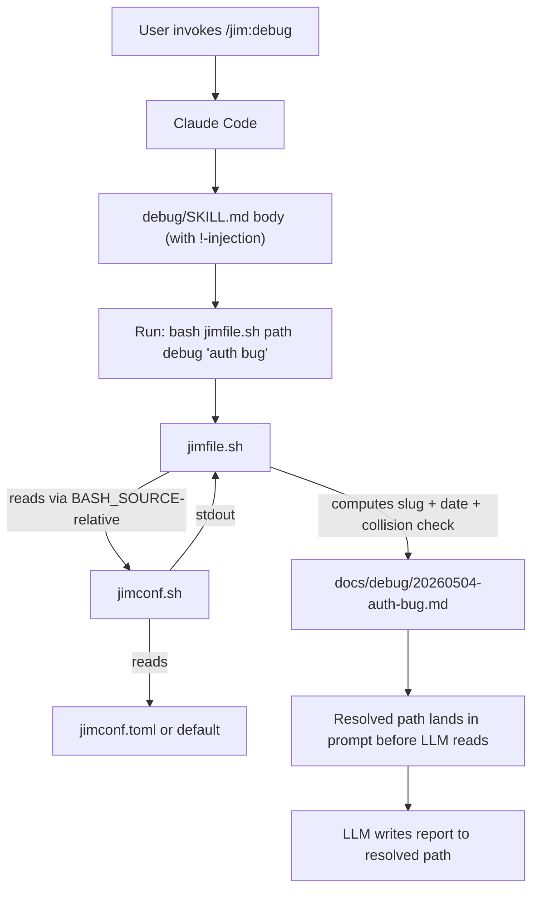

# 009 jimfile — Plan

## Overview

A bash script (`skills/file/scripts/jimfile.sh`) exposes deterministic file/path operations — existence, slug normalization, today's date, next spec ID, canonical artifact paths, and glob discovery — invoked from consuming skills via Claude Code's `` !`<command>` `` injection primitive. The script internally calls `jimconf.sh` (via a `BASH_SOURCE`-relative path) to honor `/jim:conf` overrides for the configurable directories. A thin user-facing `/jim:conf`-style skill wraps the same script. Tests extend the existing `tests/run.sh` runner. Migration scope for v1: `debug`, `brainstorm`, and `spec` skills — together exercising every operation in the surface.

## Design Decisions

### 1. Operation surface — verb-first (Grouping A from research)

- **Chosen:** Verb-first subcommands: `exists`, `slug`, `date`, `next-id`, `path <kind> ...`, `glob <kind> [filter]`, `kinds`. Each verb is a separate handler; `path` and `glob` take a `<kind>` argument.
- **Why:** Sibling style to `jimconf.sh` (which uses `get`, `list`, `path`, `keys`). Each verb maps to one handler in the script, one section in tests. Skill-side call sites read naturally: `jimfile.sh next-id jim`, `jimfile.sh path debug "auth bug"`. Easy to grep call-sites for during future audits.
- **Rejected — Grouping B (noun-first by kind):** `spec next-id <group>`, `debug path <topic>`, etc. Multiplies test surface ~3× because each `<kind>` becomes its own subcommand tree. Not worth the readability gain.
- **Rejected — Grouping C (flat single-purpose subcommands):** YAGNI; verbose at call sites.

### 2. Composition with `/jim:conf` — script shells out internally (option b)

- **Chosen:** `jimfile.sh` internally invokes `jimconf.sh` via a `BASH_SOURCE`-relative path: `"$(dirname "${BASH_SOURCE[0]}")/../../conf/scripts/jimconf.sh"`. Skill call sites are clean: one `!`-injection per operation.
- **Why:** Consumer skills compose path-utility ops with directory resolution at the same call site (e.g., a `/jim:debug` migration needs both "where do debug reports live?" and "what's today's filename for topic X?"). Two-`!`-injection composition (option a) requires shell-quoting two commands inside one prompt placeholder — ugly. The `BASH_SOURCE`-relative call is portable across plugin install scopes (Claude Code resolves the script's own directory at runtime; no env-var dependency).
- **Why this is the right cross-agent posture (per research Peer Feedback):** Both scripts ship together in the plugin. The `BASH_SOURCE`-relative path holds as long as `skills/file/scripts/jimfile.sh` and `skills/conf/scripts/jimconf.sh` keep their relative position. When jim eventually publishes to `.agents/skills/`, it ships the whole `skills/` tree intact — the relative path travels with it. `${CLAUDE_PLUGIN_ROOT}` is a Claude-Code-only substitution and is *not* used inside script bodies (only at skill-side call sites, which the spec already mandates).
- **Rejected — option (a) pass resolved paths as arguments:** Each call site composes two `!`-injections. Skill bodies get noisy; multiplies the `!`-injection count past `/jim:conf`'s norm.
- **Rejected — option (c) parse `jimconf.toml` directly:** Duplicates parse logic; two sources of truth.

### 3. Co-location — `skills/file/` (own skill directory)

- **Chosen:** New skill directory at `skills/file/` with `SKILL.md` and `scripts/jimfile.sh`. Mirrors `skills/conf/`.
- **Why:** One skill per directory, one purpose per directory. The `/jim:file` user-facing skill body uses `${CLAUDE_SKILL_DIR}/scripts/jimfile.sh` cleanly (matches `/jim:conf`). The `BASH_SOURCE`-relative intra-script call (`../../conf/scripts/jimconf.sh`) is two levels but stable.
- **Rejected — `skills/conf/scripts/jimfile.sh` (co-located with jimconf):** Awkward — a single skill directory housing scripts that belong to two distinct user-facing skills. Saves a small ARCHITECTURE.md update at the cost of muddled ownership.
- **Rejected — `skills/_scripts/`:** Out of step with the existing one-skill-per-directory convention.

### 4. Slug normalization — explicit pipeline at the script layer (security boundary)

- **Chosen:** Slug normalization runs entirely in the script. Pipeline:
  ```
  tr 'A-Z' 'a-z' | sed 's/[^a-z0-9]/-/g; s/-\+/-/g; s/^-//; s/-$//' | cut -c1-64
  ```
  Reject empty result, `.`, `..` with exit 1 + stderr message.
- **Why (per research Peer Feedback):** Path traversal via `/jim:debug ../../../../etc/passwd` is the most likely real-world misuse. The pipeline is naturally safe — `..` and `/` are non-alnum, replaced with `-`, collapsed with the run-collapse step. But "naturally safe by accident" isn't enough: the script must explicitly reject empty results and the literal slugs `.`/`..` so that any future change to the pipeline can't silently re-open the hole. The 64-char cap matches typical filesystem hygiene without being onerous.
- **Why script not LLM:** Today's prose ("lowercase, hyphens, no spaces") delegates this to the LLM, which has no security model. The script is the new boundary.
- **Rejected — keep slug logic in skill prose:** Defeats the point of `/jim:file`; reintroduces drift.

### 5. Date-prefixed path collision rule — append numeric suffix

- **Chosen:** When `path debug <topic>` or `path brainstorm <topic>` would produce a path that already exists, append `-2`, `-3`, … until a non-existing path is found, and return that.
- **Why:** Predictable, Unix-friendly. Two `/jim:debug` runs on the same day on similar topics shouldn't overwrite the first report silently. Counter-incrementing is cheap and matches user mental models for filename collisions.
- **Rejected — silent overwrite:** Matches today's LLM behavior but is dangerous; debug reports especially are evidence.
- **Rejected — hard reject (exit 1):** Forces the caller to disambiguate; adds skill-prose burden the spec was trying to remove.

### 6. `exists` semantics — explicit yes/no string

- **Chosen:** `jimfile.sh exists <path>` prints `yes` or `no` to stdout, exits 0. Exit 2 if path arg is missing.
- **Why:** `!`-injection captures stdout, not exit codes. The LLM consumes the stdout string. `yes`/`no` is the most explicit form — harder to misread than empty-string-means-missing.
- **Rejected — exit-code-only:** LLM doesn't see exit codes through `!`-injection.
- **Rejected — print path-or-empty:** More clever, easier to confuse with `path` subcommand output.

### 7. Migration scope for v1 — three consumer skills

- **Chosen:** Migrate `skills/debug/SKILL.md`, `skills/brainstorm/SKILL.md`, and `skills/spec/SKILL.md`. Other consumer skills (`vision`, `roadmap`, `arch`, `plan`, `research`, `meta-skill`, `meta-agent`) keep their existing prose for now and are documented as a follow-on refactor target.
- **Why:** Together these three exercise every operation in the v1 surface — `path debug`/`brainstorm` (date-prefixed), `next-id` + `path spec` (ID-based), `exists` (debug looking up prior reports), and `glob specs` (spec discovery for ID assignment). Spec AC #11 only requires *one* consumer demonstrated end-to-end; three is enough to catch interaction bugs (slug normalization composing with collision resolution, etc.) without expanding the PR set unmanageably. The remaining 7 consumer files are eligible per spec AC #8 but explicitly deferred to keep this PR set reviewable.
- **Rejected — full migration of all 10 consumer files in v1:** Higher regression risk per PR; expands review surface ~3× without proportional learning. Phase the rollout.
- **Rejected — minimum-viable single-consumer migration:** Doesn't exercise the full operation surface.

### 8. No caching

- **Chosen:** Each `!`-injection re-runs the script. No cross-invocation cache.
- **Why:** Inherits 007's no-cache decision. File-read overhead at human-typing scale is negligible. A skill body composing 3-4 `!`-injection calls runs in <100ms total.

### 9. Test runner — extend `tests/run.sh`

- **Chosen:** Add `case_jimfile_*` test cases to the existing `tests/run.sh`. The runner's existing `$1` filter (`bash tests/run.sh jimfile`) selects them as a group. New cases follow the same documentation discipline (per-case `# AC:` comment, inline heredoc fixtures, `mktemp` sandbox).
- **Why:** Splits the runner only invents a CI-orchestration problem. The existing infrastructure (assert helpers, fixture helper, reporter) transfers unchanged. The Maintenance Notes block already covers the gotchas.
- **Rejected — parallel `tests/run-jimfile.sh`:** Creates a second runner with no shared state; CI/dev workflows have to run both.
- **Rejected — bats-core / shunit2 / pytest:** Inherits 007's zero-third-party-deps decision.

> **Note (added by spec 007):** Decision 9's "extend `tests/run.sh`" has evolved — `tests/run.sh` and `tests/testlib.sh` have been relocated into `skills/meta-test/scripts/` per spec 007. The `case_jimfile_*` cases in `tests/jimfile.sh` stay where they are; the source line was updated to reach the relocated lib via a `BASH_SOURCE`-relative path. Run jimfile tests with `bash tests/jimfile.sh` (standalone) or `bash skills/meta-test/scripts/run.sh jimfile` (filter via aggregate runner). Future jimfile test cases should be appended via `/jim:meta-test add jimfile <case_name>`.

### 10. ARCHITECTURE.md update — bundled in this PR set, additive

- **Chosen:** Update `ARCHITECTURE.md` in the same PR sequence: add `skills/file/` to the project tree (one block), extend the Scripting Layer subsection with one paragraph noting the second script and the inter-script composition pattern.
- **Why:** Mirrors 007's discipline (don't merge with the architecture doc out of sync). Smaller change than 007's update because the "minimal scripting layer" framing is already in place.

### 11. Cross-agent portability hygiene — apply all five constraints

- **Chosen:** Honor all five hygiene rules from the spec's Out of Scope:
  1. Non-interactive bash; no TTY assumed (test under `bash -c '<script>' < /dev/null` as a smoke step).
  2. No `${CLAUDE_PLUGIN_ROOT}` semantics inside the script body (substitution stays at call sites).
  3. New `SKILL.md` leads with YAML frontmatter (no leading H1 — Gemini compat).
  4. `/jim:file` carries no `agent:` binding (matches `/jim:conf`).
  5. Skill body and description survive being copied to `.agents/skills/` unchanged.
- **Why:** Constraint-shaping per the spec; cheap to honor in v1, expensive to retrofit later.

## Constitution Check

**ARCHITECTURE.md status:** Present — constraints noted below.

| Constraint from ARCHITECTURE.md | Honored? | Notes |
| :--- | :--- | :--- |
| Skills directory contains `SKILL.md` ± `assets/` ± `references/` ± `scripts/` (L137-L143) | Yes | New `skills/file/SKILL.md` and `skills/file/scripts/jimfile.sh` follow this pattern |
| Plugin agents have lowest priority; project-level overrides take precedence (L230) | Yes | No new agent introduced |
| SKILL.md ≤ 500 lines; agent body ≤ 800 tokens (L250-L251) | Yes | `/jim:file` SKILL.md is small (~50-80 lines) |
| Skills do not write to `.git/`, `~/.ssh/`, `node_modules/`, `.venv/`, `.env`, `.env-*` (L197) | Yes | All writes are to `skills/file/`, `tests/run.sh` (extension), and existing skill files |
| Plugin Conventions → Scripting Layer (L238-L246) honors single-resolver / many-consumers / `${CLAUDE_PLUGIN_ROOT}` pattern | Yes (extended) | New script joins the same pattern. ARCHITECTURE.md is updated in Task 9 to document the second script and the inter-script `BASH_SOURCE`-relative composition. |
| Single source of truth for SDLC process is `WORKFLOW.md` | Yes | `WORKFLOW.md` does not need updating; this is a runtime utility, not a process change |
| Tests live under `tests/`, not loaded by Claude Code (L206) | Yes | New test cases extend `tests/run.sh`; no new test directories |

## File Manifest

| Component | File Path | Action | Notes |
| :--- | :--- | :--- | :--- |
| Resolver script | `skills/file/scripts/jimfile.sh` | Create | Bash script implementing the CLI in Interface Contracts. Internally calls `jimconf.sh` via `BASH_SOURCE`-relative path. |
| /jim:file skill | `skills/file/SKILL.md` | Create | Thin user-facing wrapper. No `agent:` binding. Body `!`-injects the script with `$ARGUMENTS`. |
| Test runner | `tests/run.sh` | Update | Append `case_jimfile_*` cases (~30 of them) and add to `TESTS` array. Existing `case_*` cases unchanged. |
| Skill: debug | `skills/debug/SKILL.md` | Update | Replace L35 (debug glob), L49/L62/L67 (debug filename construction) with `jimfile.sh` calls. Existence-check prose at L34 ("Look for related files") stays. |
| Skill: brainstorm | `skills/brainstorm/SKILL.md` | Update | Replace L32 (brainstorm filename construction) with `jimfile.sh path brainstorm` call. Slug-prose ("lowercase, hyphens, no spaces") removed — script enforces. |
| Skill: spec | `skills/spec/SKILL.md` | Update | Replace L116 (next-id logic) and L128 (spec write path) with `jimfile.sh next-id` + `jimfile.sh path spec` calls. Glob at L44 already uses jimconf — no change. |
| Architecture doc | `ARCHITECTURE.md` | Update | Add `skills/file/` block to project tree (L33-L38 area, beneath `skills/conf/`). Add one paragraph to Scripting Layer subsection (L238-L246) describing `jimfile.sh` and the inter-script composition. |
| README | `README.md` | Update | Add a one-paragraph note under the existing Configuration section (or adjacent) describing `/jim:file` and the operation surface. |

## Interface Contracts

### `jimfile.sh` CLI

```text
USAGE
    bash jimfile.sh exists <path>                     Print "yes" or "no" to stdout.
    bash jimfile.sh slug <topic>                      Print kebab-case slug; exit 1 if empty/./.. result.
    bash jimfile.sh date                              Print today's date as YYYYMMDD.
    bash jimfile.sh next-id <group>                   Print 3-digit zero-padded next spec ID for <group>.
    bash jimfile.sh path spec      <group> <id> <name>    Print canonical spec path.
    bash jimfile.sh path plan      <group> <id> <name>    Print canonical plan path.
    bash jimfile.sh path research  <group> <id> <name>    Print canonical research path.
    bash jimfile.sh path debug     <topic>            Print {debug}/{date}-{slug}.md (collision-resolved).
    bash jimfile.sh path brainstorm <topic>           Print {brainstorms}/{date}-{slug}.md (collision-resolved).
    bash jimfile.sh glob specs [<group>]              List spec directory paths (optionally filtered by group).
    bash jimfile.sh glob debug                        List existing debug report paths.
    bash jimfile.sh glob brainstorms                  List existing brainstorm paths.
    bash jimfile.sh kinds                             Print valid artifact kinds, no I/O.

CONFIG RESOLUTION
    Internally invokes jimconf.sh (sibling under skills/conf/scripts/) to resolve
    the configurable directories: specs, debug, brainstorms. Honors any /jim:conf
    overrides automatically.

    Production skills do NOT pass -c. The flag exists for tests and ad-hoc inspection:
    bash jimfile.sh -c <jimconf-path> <subcmd>        Use specified jimconf.toml.

VALID KINDS
    spec   plan   research   debug   brainstorm

SLUG NORMALIZATION
    Pipeline (deterministic, security-boundary):
      tr 'A-Z' 'a-z' \
        | sed 's/[^a-z0-9]/-/g; s/-\+/-/g; s/^-//; s/-$//' \
        | cut -c1-64
    Reject (exit 1, stderr): empty result, "." literal, ".." literal.
    Path traversal ("../../etc/passwd") is naturally safe — non-alnum collapses to "-".

COLLISION RESOLUTION (path debug / path brainstorm only)
    If {dir}/{date}-{slug}.md exists, try {dir}/{date}-{slug}-2.md, then -3.md, etc.
    Return the first non-existing path. No filesystem mutation.

EXIT CODES
    0   Success.
    1   Validation failure: invalid slug result, unknown kind, unknown group with no specs path, etc.
    2   Malformed invocation: missing required argument, unknown subcommand.

OUTPUT
    All success output to stdout, one line per item (multi-line for `glob` and `kinds`,
    single-line otherwise). Errors and validation messages to stderr.
    No trailing whitespace beyond standard echo behavior.

NEVER
    Never source jimconf.toml or any user-supplied file (security: data, not code).
    Never write, create, or delete files. Pure read-only path resolution.
    Never assume a TTY. No `read -p`, no terminal colors, no isatty checks.
```

### Skill consumption pattern

Consumer skills declare `allowed-tools: Bash(bash *)` in frontmatter and use `!`-injection in the body to land resolved values in the prompt before the LLM reads it.

```yaml
---
name: debug
description: Structured failure diagnosis...
agent: coder
allowed-tools: Bash(bash *)
---

Determine the report filename:
!`bash ${CLAUDE_PLUGIN_ROOT}/skills/file/scripts/jimfile.sh path debug "$ARGUMENTS"`

Check for prior debug reports on the same topic:
!`bash ${CLAUDE_PLUGIN_ROOT}/skills/file/scripts/jimfile.sh glob debug`
```

The `!`-injection runs *before* the LLM sees the skill body — the literal resolved path lands in the prompt.

### `/jim:file` SKILL.md — body sketch

```yaml
---
name: file
description: >
  Inspect jim's file/path resolver: existence checks, slug normalization,
  date prefix, next spec ID, canonical artifact paths, glob discovery.
  Use to debug a configuration, audit what jim would name a new file, or
  list existing artifacts. Do not use for setting paths — there is no
  write surface; users edit jimconf.toml directly via /jim:conf.
argument-hint: "<exists|slug|date|next-id|path|glob|kinds> [args]"
allowed-tools: Bash(bash *)
---

# /jim:file

Run jim's file/path resolver:

!`bash ${CLAUDE_SKILL_DIR}/scripts/jimfile.sh $ARGUMENTS`
```

Note `${CLAUDE_SKILL_DIR}` (per-skill) for the user-facing skill's own bundled script — same pattern as `/jim:conf`. Cross-skill consumers use `${CLAUDE_PLUGIN_ROOT}` (plugin-wide).

## Data Flow



## Task Breakdown

TDD-ordered: tests first (red), implementation (green), then propagation across consumer skills, then doc updates.

**Convention:** every `**Verify:**` shell command assumes PWD is the repo root (`/home/adri/projects/JamSuite/repos/jim`). The coder runs `cd <repo-root>` once at the start of the build session.

1. [x] **Extend `tests/run.sh` with `case_jimfile_*` cases (red phase).** Add a sibling global `SCRIPT_JIMFILE="$REPO_ROOT/skills/file/scripts/jimfile.sh"` and a `run_jimfile <args...>` helper (mirroring the existing `run` but invoking `$SCRIPT_JIMFILE`). Add a "script under test not found" check for `$SCRIPT_JIMFILE` matching the existing one for `$SCRIPT`. Then add ~30 cases covering: `exists` (yes/no/missing-arg), `slug` (basic/collapse-dashes/strip-leading-trailing/path-traversal-safe/reject-empty/reject-dot-dotdot/length-cap), `date` (YYYYMMDD format), `next-id` (empty group/existing/with-gaps/zero-padding), `path spec/plan/research/debug/brainstorm` (basic + collision for date-prefixed kinds), `glob specs/debug/brainstorms` (filtered + unfiltered), `kinds`, and error paths (unknown-subcommand/unknown-kind), and `case_jimfile_honors_jimconf_overrides` (writes a fixture `jimconf.toml` overriding `debug_path`, runs `path debug foo` via the `-c` flag, asserts the override is honored). Each case begins with `# AC: <spec AC>` comment per the existing discipline. Use the existing `fixture`/`empty_dir`/`assert_*` helpers; add cases to the `TESTS` array. Do NOT modify `case_*` cases from 007.
   **Verify:** `bash tests/run.sh jimfile; test $? -ne 0`  *(must fail because script doesn't exist yet — confirms red phase)*

2. [x] **Create `skills/file/scripts/jimfile.sh`** implementing the full CLI from Interface Contracts. Mirror `jimconf.sh`'s discipline: file header docblock, named section banners (Globals → Validation → Slug/date helpers → Subcommand handlers → Argument dispatch → Implementation notes), per-helper docblocks, `set -uo pipefail`, single `main "$@"` at file end. Internal call to `jimconf.sh` uses `JIMCONF="$(dirname "${BASH_SOURCE[0]}")/../../conf/scripts/jimconf.sh"`. Pass through the optional `-c <path>` flag to `jimconf.sh` invocations so tests can stub overrides. Make script executable (`chmod +x`).
   **Verify:** `bash tests/run.sh jimfile`  *(all jimfile cases pass)*

3. [x] **Smoke-test the script outside the runner.** Confirm date format, slug, and one path operation produce expected output without `-c`.
   **Verify:** `bash skills/file/scripts/jimfile.sh date | grep -Eq '^[0-9]{8}$' && test "$(bash skills/file/scripts/jimfile.sh slug 'Auth Token Expiry')" = "auth-token-expiry" && bash skills/file/scripts/jimfile.sh kinds | grep -q '^debug$'`

4. [x] **Cross-agent portability smoke test.** Confirm the script runs without a TTY and produces the same output. Catches accidental `read -p` / `isatty` regressions per the cross-agent hygiene rule.
   **Verify:** `bash -c 'bash skills/file/scripts/jimfile.sh date' < /dev/null | grep -Eq '^[0-9]{8}$'`

5. [x] **Re-run the full test suite** to confirm `case_jimfile_*` did not regress any `case_*` cases from 007.
   **Verify:** `bash tests/run.sh`

6. [x] **Create `skills/file/SKILL.md`** with frontmatter (`name: file`, `description`, `argument-hint`, `allowed-tools: Bash(bash *)`) — **no `agent:` field**. Body `!`-injects the script with `$ARGUMENTS`. YAML frontmatter is the very first content (no leading H1) per cross-agent hygiene.
   **Verify:** `head -n 1 skills/file/SKILL.md | grep -q '^---$' && grep -q '^name: file$' skills/file/SKILL.md && grep -q 'jimfile.sh' skills/file/SKILL.md && ! grep -q '^agent:' skills/file/SKILL.md`

7. [x] **Migrate `skills/debug/SKILL.md`** — replace the prior-debug-reports glob (L35) with `!`bash ${CLAUDE_PLUGIN_ROOT}/skills/file/scripts/jimfile.sh glob debug``, and replace the report filename construction at L49, L62, L67 with `!`bash ${CLAUDE_PLUGIN_ROOT}/skills/file/scripts/jimfile.sh path debug "$ARGUMENTS"``. Existence-check prose ("Look for related files") stays. Topic-slug prose ("2-4 word kebab-case description") becomes redundant — remove it; the script enforces the rule.
   **Verify:** `grep -q 'jimfile.sh path debug' skills/debug/SKILL.md && grep -q 'jimfile.sh glob debug' skills/debug/SKILL.md && ! grep -q '2-4 word kebab-case' skills/debug/SKILL.md`

8. [x] **Migrate `skills/brainstorm/SKILL.md`** — replace the brainstorm filename construction at L32 with `!`bash ${CLAUDE_PLUGIN_ROOT}/skills/file/scripts/jimfile.sh path brainstorm "$ARGUMENTS"``. Slug prose ("lowercase, hyphens, no spaces") becomes redundant — remove it.
   **Verify:** `grep -q 'jimfile.sh path brainstorm' skills/brainstorm/SKILL.md && ! grep -q 'lowercase, hyphens, no spaces' skills/brainstorm/SKILL.md`

9. [x] **Migrate `skills/spec/SKILL.md`** — replace the next-ID prose at L116 with `!`bash ${CLAUDE_PLUGIN_ROOT}/skills/file/scripts/jimfile.sh next-id <group>``, and replace the spec write path at L128 with `!`bash ${CLAUDE_PLUGIN_ROOT}/skills/file/scripts/jimfile.sh path spec <group> <id> <name>``. The existing specs glob at L44 already uses `jimconf.sh get specs` — leave it (different concern: directory resolution, not artifact discovery). After migration, the LLM still selects `<group>` and `<name>` from interview context; the script computes `<id>` and assembles the path.
   **Verify:** `grep -q 'jimfile.sh next-id' skills/spec/SKILL.md && grep -q 'jimfile.sh path spec' skills/spec/SKILL.md && ! grep -E 'max\(existing IDs\) ?\+ ?1' skills/spec/SKILL.md`

10. [x] **Update `ARCHITECTURE.md`** — under the project tree (L33-L38 area), add a `skills/file/` block beneath `skills/conf/` mirroring its shape. In the Plugin Conventions → Scripting Layer subsection (L238-L246), add one paragraph noting the second script (`jimfile.sh`), its operation surface (existence/slug/date/next-id/path/glob), and the `BASH_SOURCE`-relative inter-script composition.
    **Verify:** `grep -q 'skills/file/' ARCHITECTURE.md && grep -q 'jimfile' ARCHITECTURE.md && grep -q 'BASH_SOURCE' ARCHITECTURE.md`

11. [x] **Update `README.md`** — add a brief paragraph (within or adjacent to the Configuration section) describing `/jim:file`: what it does, the operation surface, and the relationship to `/jim:conf`. Mention `bash tests/run.sh jimfile` as the test-filter command.
    **Verify:** `grep -q '/jim:file' README.md || grep -q 'jimfile' README.md`

12. [x] **Re-run the full test suite end-to-end after all skill migrations.** Confirms migrated skill bodies don't break any test (skills aren't test-loaded, but defense-in-depth) and that test discovery still finds every case.
    **Verify:** `bash tests/run.sh`

13. [x] **Manual non-default-layout walkthrough (spec AC #11).** In a scratch directory, set up a project with `jimconf.toml` overriding `debug_path`, `brainstorms_path`, and `specs_path` to non-default locations. Run `/jim:debug` (creates a debug report at the configured location), `/jim:brainstorm` (same for brainstorms), and `/jim:spec` (creates a spec at the configured specs dir with a correctly-incremented ID). Confirm all three artifacts land at the configured paths and that ID assignment is correct against an existing 002-foo, 005-bar layout. Document the walkthrough output in a brief debug-archive note.
    **Verify:** `test -f docs/debug/$(date +%Y%m%d)*-jimfile-walkthrough.md`  *(walkthrough note exists in debug archive — coder writes it as part of this task)*

## Requirements Coverage Summary

| Spec Acceptance Criterion | Addressed In Task(s) |
| :--- | :--- |
| Operation surface: exists, next-id, path (canonical), slug, glob | 1 (test cases for each), 2 (script implements each) |
| Honors `/jim:conf` overrides | 1 (test case `case_jimfile_honors_jimconf_overrides`), 2 (script shells out to `jimconf.sh`) |
| `!`-injection composition pattern | 7, 8, 9 (consumer skill migrations land resolved values in prompts) |
| User-facing `/jim:file` slash command | 6 |
| Path-and-name resolution only — no I/O | 2 (script does no `mkdir`/`mv`/`rm`/file-write); covered by absence in tests |
| Deterministic, documented edge-case behavior (gaps, collisions, missing dirs, slug normalization) | 1 (test cases for each), 2 (script implements), Design Decisions §4 + §5 + §6 |
| Zero third-party dependencies | 2 (bash + POSIX), 1 (test runner is plain bash) |
| Eligibility for migration of consumer skills using prose | 7, 8, 9 (3 of 10 candidates migrated; remaining 7 documented as follow-on per Out of Scope) |
| Existing self-hosted specs (001–007) unaffected; `/jim:file` is additive | 5, 12 (test runs include the existing 007 cases — no regression) |
| Tests live in `tests/`, zero-dep, strict-doc conventions | 1 (extends existing `tests/run.sh`) |
| Documentation explains operation surface, inspection commands, contract, migration story | 10 (ARCHITECTURE.md), 11 (README.md), 6 (SKILL.md description + body) |
| Build phase demonstrates at least one consumer migrated end-to-end | 7 + 8 + 9 (three consumers); 13 (manual non-default-layout walkthrough) |

No `[NEEDS CLARIFICATION]` markers — all spec ACs are covered by tasks.

## Out of Scope

- **Migrating the remaining 7 consumer skills** (`vision`, `roadmap`, `arch`, `plan`, `research`, `meta-skill`, `meta-agent`). Eligible per spec AC #8 but explicitly deferred to a follow-on refactor PR to keep this PR set reviewable. Their existing prose continues to work.
- **Refactoring existence-check prose to deterministic `exists` calls** wherever a file existence check exists. The script makes this *possible*; doing it is a follow-on (already deferred by spec OoS). Only `skills/debug/SKILL.md`'s glob for prior debug reports migrates in v1 — not the broader "if X exists" sweep.
- **"Most recent X" / staleness-detection helpers.** Deferred per spec OoS and research recommendation.
- **TOML nested tables, arrays, non-string types.** Inherits `jimconf.sh`'s flat-only parsing.
- **Caching across invocations.** No state.
- **Multi-project / monorepo / nested config.** Single project root, same as `/jim:conf`.
- **`/jim:meta-test` skill.** Deferred from 007; same rationale.
- **Walk-up / parent-directory search for `jimconf.toml`.** Inherits 007's no-walk-up rule.
- **Cross-agent (Codex/Gemini/Cursor/Windsurf/Cline/Junie/Roo) integration code.** Constraints honored (Decision 11) but no jim-side integration written.
- **Updating `agents/*.md` documentation paragraphs** for the migrated skills. Agent files are doc-only; their context paragraphs can be regenerated by `/jim:arch` later.

## Open Questions

- [x] ~~Operation surface — verb-first vs noun-first?~~ → Verb-first (Decision 1).
- [x] ~~Composition with `/jim:conf` — (a) args / (b) shell out / (c) parse directly?~~ → (b) shell out via `BASH_SOURCE`-relative path (Decision 2).
- [x] ~~Co-location?~~ → `skills/file/` own directory (Decision 3).
- [x] ~~Slug normalization algorithm?~~ → Explicit pipeline + reject empty/`.`/`..` + 64-char cap (Decision 4).
- [x] ~~Slug collisions?~~ → Append `-2`, `-3`, … (Decision 5).
- [x] ~~Missing target directory?~~ → Return path anyway (carried from spec OoS).
- [x] ~~"Most recent X"?~~ → Deferred (Decision in OoS).
- [x] ~~Migration scope for v1?~~ → Three consumers (debug, brainstorm, spec) (Decision 7).
- [x] ~~Test runner placement?~~ → Extend `tests/run.sh` (Decision 9).
- [x] ~~ARCHITECTURE.md update?~~ → Bundled in this PR set, additive (Decision 10).
- [x] ~~Cross-agent portability hygiene?~~ → All five constraints honored (Decision 11).
- [x] ~~`exists` semantics?~~ → Print `yes` or `no` to stdout (Decision 6).
