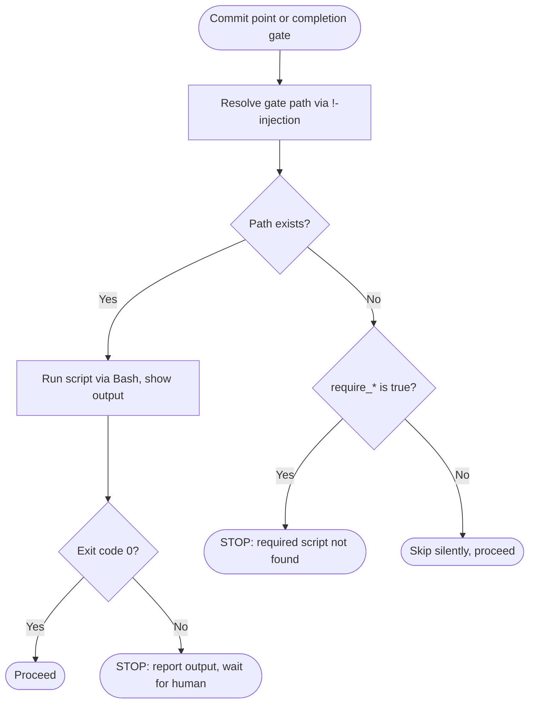

# 010 Configurable build hooks — Plan

## Overview

Extend `jimconf.sh` with three new keys (one path-typed, two boolean-flag-typed) using prefix-based TOML key dispatch in `resolve()`, then wire two BASIC `IF EXISTS THEN DO ... ELSE ... END IF` gate blocks into `skills/build/SKILL.md` — one in step 3's Commit sub-bullet (per-commit) and one replacing step 5's existing block (pre-completion).

## Design Decisions

### 1. Key dispatch in `resolve()` — convention-based prefix, not sibling function

- **Chosen:** Inline 2-line dispatch in `resolve()`: keys whose CLI name starts with `require_` map directly to their TOML name (no suffix); every other key continues to append `_path`.

  ```bash
  if [[ "$cli_key" == require_* ]]; then
    toml_key="$cli_key"
  else
    toml_key="${cli_key}_path"
  fi
  ```

- **Why:** Smallest possible surface change — `cmd_get`, `cmd_list`, `parse_value`, and `default_for` are unchanged in shape. The `require_*` prefix is a recognizable family; future flag keys (`require_research`, `require_security`) inherit the convention by name without further code change.
- **Rejected:** A `resolve_flag()` sibling — would require `cmd_get` and `cmd_list` to dispatch by key category, doubling the lookup paths.
- **Rejected:** A central `KEY_TYPE` registry — over-engineered for two flag keys; revisit if the count grows past four.
- **Rejected:** Embedding `_path` in the TOML name (e.g., `require_pre_commit_path`) — semantically wrong; spec mandates flag keys are not paths.

### 2. Gate block form — BASIC `THEN DO: ... ELSE ... END IF`, fenced text

- **Chosen:** A single `IF EXISTS THEN DO: ... ELSE ... END IF` block per gate, wrapped in a fenced ` ```text ` block. The THEN DO body holds 2 numbered steps (run+show output, halt-on-non-zero); the ELSE branch is one prose sentence with the require-flag check and conditional halt. Same block shape used at both call sites.
- **Why:** Stays within ARCHITECTURE.md §Logic-Flow Conventions' `~3-step THEN DO:` budget while preserving the canonical BASIC idiom. Fenced text keeps numbered-list indentation predictable. Two call-site copies are cheaper than the alternative (a named subsection that loses the eager `!`-injection at the call sites).
- **Rejected:** Named subsection in English referenced from each call site — named subsections cannot carry parametric `!`-injection, and the BASIC `IF (X) EXISTS THEN` requires the resolved path inside the parens at the call site itself.
- **Rejected:** Inline single-action form — cannot express the run + halt-on-non-zero + require-flag fallback in a single action.

### 3. Halt message format — inline `!`-injection of the resolved path

- **Chosen:** Halt message includes the resolved path via inline `!`-injection: `Required pre-commit script not found at !` `` `bash …get pre_commit` ``.
- **Why:** Matches spec AC verbatim ("Required \<gate-name\> script not found at \<path\>"). Eager substitution at slash-command load — the LLM reads the literal resolved path in the prompt. Three `!`-injections per gate (existence check, require-flag check, halt-message path), all resolving at load time.
- **Rejected:** Drop the path from the halt message — spec AC requires it.
- **Rejected:** Have the LLM infer the path from upstream context — fragile; explicit `!`-injection is unambiguous.

### 4. Per-task schema-and-test cohesion — bundle hardcoded-count updates with the schema change

- **Chosen:** Tasks 1 and 2 each include the count-update edits to existing hardcoded test cases (e.g., `case_list_outputs_all_keys`'s expected `"7"` becomes `"8"` in task 1, then `"10"` in task 2).
- **Why:** Maintains green-test discipline within each task. Splitting the count-updates into a separate refactor task would leave the test suite red between the schema task and the count-update task — a Tidy First violation.
- **Rejected:** Separate "update hardcoded counts" task — would break test green between tasks.

## Constitution Check

**ARCHITECTURE.md status:** Present — constraints noted below.

| Constraint | Honored? | Notes |
| :--- | :--- | :--- |
| BASIC keyword set is locked (no invented variants) — §Logic-Flow Conventions | Yes | Both gates use only `IF (X) EXISTS THEN DO:`, `ELSE`, `END IF` — no new constructs |
| `THEN DO:` body ≤ ~3 numbered steps | Yes | Each gate has 2 numbered steps in THEN DO; ELSE is a single prose sentence |
| Multi-step block form wrapped in fenced `text` block | Yes | Both gates fenced in ` ```text ` per §Logic-Flow Conventions |
| Substitution sigils strict (no mixing) | Yes | `!`-injection only inside `IF (...)` and prose; no `<lower>` or `{lower}` in skill body |
| `!`-injection eager at slash-command load | Yes | All three injections per gate use stable inputs (config-resolved paths) |
| Skills always call `jimfile.sh`, never `jimconf.sh` directly | Yes | Build skill uses `jimfile.sh get pre_commit`/`get pre_completion`/`get require_*` |
| Scripting layer: `set -uo pipefail`, no `set -e`, no `source`/`eval`, BASH_SOURCE-relative composition | Yes | `jimconf.sh` changes follow existing conventions; no new scripts |
| SKILL.md ≤ 500 lines (progressive disclosure) | Yes | `build/SKILL.md` grows from ~113 to ~140 lines |
| `parse_value` regex unchanged (top-level `KEY = "value"` only) | Yes | New TOML keys (`pre_completion_path`, `require_pre_commit`, `require_pre_completion`) match the existing regex without modification |

## File Manifest

| Component | File Path | Action | Notes |
| :--- | :--- | :--- | :--- |
| Config schema | `skills/conf/scripts/jimconf.sh` | Update | Append 3 keys to `KEYS`; add 3 cases to `default_for()`; insert prefix dispatch into `resolve()` |
| Tests | `tests/jimconf.sh` | Update | Add 6 new `case_*` (default + override × 3 keys); update 5 hardcoded-count cases (`7` → `10` in two stages) |
| Example doc | `jimconf.toml.example` | Update | Add 3 documented keys after the existing `pre_commit_path` block |
| Architecture | `ARCHITECTURE.md` | Update | Extend Scripting Layer parenthetical from 7 paths to 10 keys; note flag-key naming convention |
| Build skill | `skills/build/SKILL.md` | Update | Replace step-5 gate block (pre-completion); insert step-3 gate block (per-commit) |

## Interface Contracts

### `jimconf.sh` — schema and resolution

```bash
# KEYS extended:
readonly KEYS=(specs architecture vision roadmap brainstorms debug \
               pre_commit pre_completion require_pre_commit require_pre_completion)

# default_for() new arms:
case "$1" in
  ...existing...
  pre_completion)         echo "./pre-completion.sh" ;;
  require_pre_commit)     echo "false" ;;
  require_pre_completion) echo "false" ;;
esac

# resolve() prefix dispatch (new — replaces the single line `local toml_key="${cli_key}_path"`):
local toml_key
if [[ "$cli_key" == require_* ]]; then
  toml_key="$cli_key"
else
  toml_key="${cli_key}_path"
fi
```

### `skills/build/SKILL.md` — gate block template

Both gates share this exact shape (substitute `pre_commit` / `pre_completion` and the corresponding `require_*` key, plus the gate name in the halt message):

```text
IF (!`bash ${CLAUDE_PLUGIN_ROOT}/skills/file/scripts/jimfile.sh get <gate-key>`) EXISTS THEN DO:
  1. Run the script via Bash and show the full output.
  2. STOP and wait for human guidance if the exit code is non-zero.
   DONE
ELSE
  When !`bash ${CLAUDE_PLUGIN_ROOT}/skills/file/scripts/jimfile.sh get require_<gate-key>` resolves to "true", STOP with: "Required <gate-name> script not found at !`bash ${CLAUDE_PLUGIN_ROOT}/skills/file/scripts/jimfile.sh get <gate-key>`." Otherwise, skip silently.
END IF
```

`<gate-key>` and `<gate-name>` are written-out at each call site (literal text, not LLM substitution) — the BASIC `IF EXISTS` requires the resolved path inside the parens at the call site itself.

## Data Flow



## Task Breakdown

1. [x] **Add `pre_completion` path key to `jimconf.sh` and `tests/jimconf.sh`.** Append `pre_completion` to `KEYS` (line 42). Add `pre_completion) echo "./pre-completion.sh" ;;` arm to `default_for()`. Add Red-phase test cases `case_pre_completion_default()` and `case_pre_completion_overridden()` mirroring lines 188-201. Update hardcoded counts in `case_list_outputs_all_keys` (line 104, `"7"` → `"8"`) and `case_malformed_lines_are_ignored` (line 157, `"7"` → `"8"`); add `pre_completion` pair to `case_no_config_returns_defaults` (line 49 area), `pre_completion_path = "..."` line + assertion to `case_full_config_returns_overrides` (line 67 area), `assert_match` line to `case_list_outputs_all_keys`, and `pre_completion` to expected string in `case_keys_outputs_valid_keys` (line 119).
   **Verify:** `bash tests/jimconf.sh`

2. [x] **Add `require_*` flag keys with prefix dispatch in `jimconf.sh` and `tests/jimconf.sh`.** Append `require_pre_commit` and `require_pre_completion` to `KEYS`. Add their `default_for()` arms (each returns `"false"`). Insert the prefix-dispatch block into `resolve()` per Interface Contracts. Add Red-phase test cases `case_require_pre_commit_default()`, `case_require_pre_commit_overridden()`, `case_require_pre_completion_default()`, `case_require_pre_completion_overridden()`. Update count `"8"` → `"10"` in `case_list_outputs_all_keys` and `case_malformed_lines_are_ignored`; add the two `require_*:false` pairs to `case_no_config_returns_defaults`; add the two TOML lines + assertions to `case_full_config_returns_overrides`; add the two `assert_match` lines and extend the expected string in `case_keys_outputs_valid_keys`.
   **Verify:** `bash tests/jimconf.sh`

3. [x] **Document new keys in `jimconf.toml.example`.** After the existing `pre_commit_path` block (line 29), add three documented keys mirroring the 2-line-comment + key-alignment style of lines 25-29. Each comment names the gate the key governs (per-commit gate / pre-completion gate / require-flag for each).
   **Verify:** `grep -cE '^(pre_completion_path|require_pre_commit|require_pre_completion)' jimconf.toml.example` returns `3`

4. [x] **Extend ARCHITECTURE.md Scripting Layer entry.** Update line 261's parenthetical from "seven configurable paths" to ten configurable keys; add the three new keys (`pre_completion_path`, `require_pre_commit`, `require_pre_completion`); note that flag keys map directly to TOML name without `_path` suffix (the `require_*` prefix convention).
   **Verify:** `grep -cE '(pre_completion_path|require_pre_commit|require_pre_completion)' ARCHITECTURE.md` returns `3` or higher

5. [x] **Replace step-5 gate in `skills/build/SKILL.md` with the pre-completion gate.** Replace the existing block at lines 89-97 with the gate template (see Interface Contracts), substituting `pre_completion` for `<gate-key>` and `pre-completion` for `<gate-name>`. The previous "ELSE skip silently" semantic is replaced by the require-flag check.
   **Verify:** `grep -c 'get pre_completion' skills/build/SKILL.md` returns `2` or higher (existence check + halt-message path), and `grep -c 'get require_pre_completion' skills/build/SKILL.md` returns `1`

6. [x] **Insert per-commit gate into the step-3 Commit sub-bullet of `skills/build/SKILL.md`.** Add a new bullet under `**Commit**` (currently lines 67-69): "Run the pre-commit gate before the commit lands:" followed by the gate template (fenced ` ```text `), substituting `pre_commit` for `<gate-key>` and `pre-commit` for `<gate-name>`.
   **Verify:** `grep -c 'get pre_commit\b' skills/build/SKILL.md` returns `2` or higher (existence check + halt-message path), and `grep -c 'get require_pre_commit' skills/build/SKILL.md` returns `1`

## Requirements Coverage Summary

| Spec Acceptance Criterion | Addressed In Task(s) |
| :--- | :--- |
| `pre_completion_path` resolves via `jimfile.sh get pre_completion`, default `./pre-completion.sh` | 1 |
| `require_pre_commit` resolves via the same surface, default `"false"` | 2 |
| `require_pre_completion` resolves via the same surface, default `"false"` | 2 |
| Each new key reachable via `/jim:conf get <key>` and appears in `/jim:conf list` | 1, 2 |
| `jimconf.toml.example` documents all three new keys with comments | 3 |
| Configured override values for any of the three new keys take precedence over defaults | 1, 2 |
| `require_*` values are double-quoted strings; parser surface unchanged | 2 |
| `pre_commit_path` runs before each Red, Green, Tidy commit (and refactor commits) | 6 |
| `pre_completion_path` runs at step 5, replacing the current pre-commit invocation | 5 |
| Non-zero exit halts the build with full output, current task not marked, waits for human | 5, 6 |
| Absent script + `require_*=false` → skip silently | 5, 6 |
| Absent script + `require_*=true` → halt with "Required \<gate-name\> script not found at \<path\>" | 5, 6 |
| Both gates use canonical `IF (X) EXISTS THEN DO: ... DONE` BASIC idiom | 5, 6 |
| Both gates resolve paths via `!`-injection at slash-command load | 5, 6 |
| `tests/jimconf.sh` covers default + override + `-c <path>` for the three new keys | 1, 2 |
| `ARCHITECTURE.md` Scripting Layer names the three new keys | 4 |

## Out of Scope

(Carried from spec.md.)

- Generalized `workflow.*` config namespace (e.g., `require_research`, `require_plan_approval`, `require_security`).
- Bare-boolean TOML parsing (`require_pre_commit = true` without quotes).
- Conversational bypass language at gates ("proceed anyway").
- Backward-compatibility migration tooling.
- New `bin/` helper layer or hook dispatcher (the fork's `bin/jim_run_hook` and `{jim_run_hook}` placeholder pattern is not adopted).
- Per-phase opt-out (e.g., "skip pre-commit on Red commits only").
- Modifications to `/jim:debug`, `/jim:plan`, or other skills.

## Open Questions

None — all design decisions resolved via research + design analysis.
