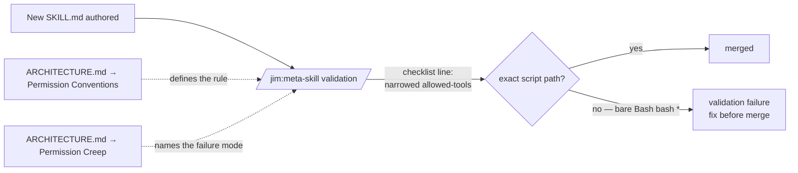

# 012 Narrow `allowed-tools` in all SKILL.md frontmatter — Plan

## Overview

Apply prefix-narrowed `Bash(...)` clauses to the `allowed-tools` line of every `skills/*/SKILL.md`, then codify the rule in the `meta-skill` validation checklist and document it in ARCHITECTURE.md (Plugin Conventions + Anti-Patterns). The body of every skill stays byte-identical — only the frontmatter `allowed-tools` value changes. A second pass appends own-skill `Read(${CLAUDE_SKILL_DIR}/assets/**)` and `Read(${CLAUDE_SKILL_DIR}/references/**)` clauses to the nine skills that own at least one of those directories, pre-authorizing template/DoD reads at slash-command load time instead of prompting mid-flow.

> **Phase 0 verification pivot (recorded after implementation):** The second-pass Read clauses (tasks 11–20) were applied as planned but empirical verification showed they are no-ops: the Read prompts originate in spawned subagents (`@jim:architect` etc.), and Claude Code's documented permission model provides no plugin-shippable way to authorize subagent reads. Tasks 11–20 are marked `[~]` (superseded) and replaced by tasks 21–28, which (a) revert the Read clauses, (b) correct `ARCHITECTURE.md` to describe the verified scope, (c) add a `README.md` Permissions section documenting the one-per-session prompt and an optional `.claude/settings.json` snippet for users who want zero prompts. See spec.md → Refactor Rationale → Phase 0 verification table for the doc citations.

## Design Decisions

### 1. Bulk-edit identical patterns as one task

- **Chosen:** Group the ten skills whose `!`-injection sites only call `${CLAUDE_PLUGIN_ROOT}/skills/file/scripts/jimfile.sh` into a single task that applies the same pattern. The three skills with distinct shapes (`conf`, `file`, `meta-test`) each get their own task.
- **Why:** All ten edits are mechanically identical (one-line `allowed-tools` replacement) and the verify is a single `grep` over the whole group — splitting into ten separate tasks would inflate the plan without adding atomicity. The DoD's atomicity rule is "one logical change, one verify," not "one file per task."
- **Rejected:** One task per file — needless ceremony when the diff is the same across ten files; the verify still has to read all ten to confirm completeness.

### 2. Verify with `grep` against the literal target line, not a regex

- **Chosen:** Each frontmatter task's Verify is a `grep -Fx` (fixed-string, full-line) match against the exact `allowed-tools:` line shape expected by the spec's AC.
- **Why:** The target patterns include `${CLAUDE_PLUGIN_ROOT}` and `${CLAUDE_SKILL_DIR}` as literal text (they're not shell-expanded in the YAML frontmatter — Claude Code substitutes them at load time). A regex match risks accidentally accepting `Bash(bash *)` left behind. `grep -Fx` confirms the exact line is present and any wildcard line is gone (paired with `! grep -F 'Bash(bash *)'`).
- **Rejected:** YAML-parser verify — jim has no third-party deps per CLAUDE.md, so a python/yq parser is unavailable; `grep` is the canonical bash test idiom in this codebase.

### 3. ARCHITECTURE.md changes are two distinct edits, not one

- **Chosen:** Treat the "Permission Conventions" subsection (new content under Plugin Conventions) and the "Permission Creep" anti-pattern extension as two separate tasks.
- **Why:** They touch different sections of ARCHITECTURE.md and serve different purposes — the subsection introduces the convention; the anti-pattern entry connects the new convention to an existing failure-mode taxonomy. Splitting keeps each task's verify focused and lets a reviewer see them as discrete documentation moves.
- **Rejected:** Single ARCHITECTURE.md task — would couple a content addition to an anti-pattern table edit, violating the "one thing changed, one thing verifiable" rule.

### 4. Place "Permission Conventions" between "Substitution Conventions" and "Progressive Disclosure"

- **Chosen:** Insert the new `### Permission Conventions` subsection immediately after `### Substitution Conventions` and before `### Progressive Disclosure` in `ARCHITECTURE.md` → `## Plugin Conventions`.
- **Why:** Spec AC 7 says "sibling to Substitution Conventions." Both deal with frontmatter-level mechanics that govern how Claude Code loads SKILL.md — adjacency reinforces the conceptual grouping. Progressive Disclosure (lines/tokens budget) is a structural rule that reads naturally after both substitution and permission rules.
- **Rejected:** Append after Anti-Patterns — would orphan the new convention from the existing convention cluster.

### 5. No scripted regression guard; rely on the LLM checklist

- **Chosen:** Add a single line to the `meta-skill` "Anti-patterns" checklist requiring `allowed-tools` to declare the exact script path(s) the skill injects or runs.
- **Why:** Matches how every other SKILL.md convention is policed today (LLM walks the checklist at create-time). The spec's Out of Scope item explicitly rules out a bash-grep guard. A scripted guard would also have to thread through the `meta-test` test framework, adding surface area for a permanently small N (14 files).
- **Rejected:** A `tests/skill_frontmatter.sh` checker — out of scope per spec; over-engineering for a 14-row enumeration that meta-skill validates per-skill.

### 6. Own-skill Read clauses use recursive `**` globs

- **Chosen:** For each skill that owns an `assets/` or `references/` directory, append `Read(${CLAUDE_SKILL_DIR}/assets/**)` and/or `Read(${CLAUDE_SKILL_DIR}/references/**)` (whichever the skill actually owns) to its `allowed-tools` line.
- **Why:** `**` (recursive) is forward-compatible with future nested files under `assets/` or `references/` (e.g. a future `references/sub-topic/foo.md`) without re-narrowing every skill. The `${CLAUDE_SKILL_DIR}` sigil is the same one already verified for `Bash(...)` clauses in tasks 1–4 — same load-time substitution pass covers Read. Investigation confirmed every existing `assets/<file>` and `references/<file>` mention in skill bodies is **own-skill**, so a single sigil family covers every case.
- **Rejected:**
  - Single-level `*` glob (`Read(${CLAUDE_SKILL_DIR}/assets/*)`) — tighter, but breaks if anyone later organizes sub-folders; symmetric-with-bash is more valuable than the marginal narrowing.
  - Per-file enumeration (`Read(${CLAUDE_SKILL_DIR}/assets/spec-template.md)` etc.) — over-narrowed; every new template would need a SKILL.md edit. The directory grant matches the actual trust boundary (skill owns its asset dir).
  - Project-relative paths (`Read(./skills/spec/assets/**)`) — fallback for the (unverified) case where `${CLAUDE_SKILL_DIR}` does **not** substitute inside Read clauses. Task 11 (pre-flight smoke) determines whether the chosen sigil shape works; if it doesn't, the plan reverts to this rejected alternative.

## Constitution Check

**ARCHITECTURE.md status:** Present — constraints noted below.

| Constraint from ARCHITECTURE.md | Honored? | Notes |
| :--- | :--- | :--- |
| L378-385 — Anti-Pattern "Permission Creep": follow least privilege | Yes | This refactor directly closes the skill-level drift the anti-pattern names. |
| L254-264 — Scripting Layer: `${CLAUDE_PLUGIN_ROOT}` for cross-skill, `${CLAUDE_SKILL_DIR}` for own-skill | Yes | Every narrowed pattern uses the documented sigil for its call shape (research § Local Patterns confirms). |
| L352-370 — Substitution Conventions: `${UPPER}` is reserved for real shell expansion, only `$ARGUMENTS`, `$CLAUDE_PLUGIN_ROOT`, `$CLAUDE_SKILL_DIR` recognized | Yes | The narrowed patterns rely on `${CLAUDE_PLUGIN_ROOT}` / `${CLAUDE_SKILL_DIR}` substitution at frontmatter load — same load-time pass as `!`-injection in the body. |
| L372-376 — SKILL.md ≤ 500 lines | Yes | Only the frontmatter line changes; body length is unaffected. |
| L226-227 — Naming: skill `name` matches directory exactly | Yes | No naming changes in this refactor. |

## File Manifest

| Component | File Path | Action | Notes |
| :--- | :--- | :--- | :--- |
| arch skill | `skills/arch/SKILL.md` | Update | Replace `allowed-tools: Bash(bash *)` with the jimfile pattern (P1); append R-A |
| brainstorm skill | `skills/brainstorm/SKILL.md` | Update | Replace with P1 (no own-skill assets/references) |
| build skill | `skills/build/SKILL.md` | Update | Bash clause already correct (P1); append R-R |
| conf skill | `skills/conf/SKILL.md` | Update | Replace with own-skill jimconf pattern (P2) (no own-skill assets/references) |
| debug skill | `skills/debug/SKILL.md` | Update | Replace with P1; append R-A |
| file skill | `skills/file/SKILL.md` | Update | Replace with own-skill jimfile pattern (P3) (no own-skill assets/references) |
| meta-agent skill | `skills/meta-agent/SKILL.md` | Update | Replace with P1 (no own-skill assets/references) |
| meta-skill skill | `skills/meta-skill/SKILL.md` | Update | (a) Replace with P1 (no own-skill assets/references); (b) add regression-prevention line to validation checklist (covers Bash and Read narrowing) |
| meta-test skill | `skills/meta-test/SKILL.md` | Update | Replace with two-clause pattern (P4); append R-A |
| plan skill | `skills/plan/SKILL.md` | Update | Replace with P1; append R-A + R-R |
| research skill | `skills/research/SKILL.md` | Update | Replace with P1; append R-A + R-R |
| roadmap skill | `skills/roadmap/SKILL.md` | Update | Replace with P1; append R-A |
| spec skill | `skills/spec/SKILL.md` | Update | Replace with P1; append R-A + R-R |
| vision skill | `skills/vision/SKILL.md` | Update | Replace with P1; append R-A |
| Architecture doc | `ARCHITECTURE.md` | Update | (a) Add `### Permission Conventions` subsection under Plugin Conventions; (b) extend it with a Read narrowing example covering own-skill assets/references; (c) extend Permission Creep anti-pattern entry |

No files are created. No files outside `skills/` and `ARCHITECTURE.md` are touched. `.claude/skills/meta-matrix/SKILL.md` is explicitly **out of scope** per spec. (Sentinel fixture location updated by spec 014 — see `skills/meta-matrix/`.)

## Interface Contracts

The "contracts" for this refactor are the per-skill target frontmatter lines. Every Verify command in the task breakdown checks for exact-line presence.

**Pattern catalogue (referenced as P1–P4 in the task breakdown):**

```yaml
# P1 — cross-skill jimfile (11 skills: arch, brainstorm, build, debug,
#                          meta-agent, meta-skill, plan, research,
#                          roadmap, spec, vision)
allowed-tools: Bash(bash ${CLAUDE_PLUGIN_ROOT}/skills/file/scripts/jimfile.sh *)

# P2 — own-skill jimconf (1 skill: conf)
allowed-tools: Bash(bash ${CLAUDE_SKILL_DIR}/scripts/jimconf.sh *)

# P3 — own-skill jimfile (1 skill: file)
allowed-tools: Bash(bash ${CLAUDE_SKILL_DIR}/scripts/jimfile.sh *)

# P4 — two-clause: cross-skill jimfile + own-skill metatest (1 skill: meta-test)
allowed-tools: Bash(bash ${CLAUDE_PLUGIN_ROOT}/skills/file/scripts/jimfile.sh *) Bash(bash ${CLAUDE_SKILL_DIR}/scripts/metatest.sh *)

# R-A — own-skill assets read (8 skills: arch, debug, meta-test, plan,
#                              research, roadmap, spec, vision)
Read(${CLAUDE_SKILL_DIR}/assets/**)

# R-R — own-skill references read (4 skills: build, plan, research, spec)
Read(${CLAUDE_SKILL_DIR}/references/**)
```

Each Read clause is **appended** to the existing Bash clause on the same `allowed-tools` line, space-separated. Composed lines for each skill:

```yaml
# arch, debug, meta-test (with P4), roadmap, vision  — P1 (or P4) + R-A
allowed-tools: <existing Bash clause> Read(${CLAUDE_SKILL_DIR}/assets/**)

# build — P1 + R-R
allowed-tools: Bash(bash ${CLAUDE_PLUGIN_ROOT}/skills/file/scripts/jimfile.sh *) Read(${CLAUDE_SKILL_DIR}/references/**)

# plan, research, spec — P1 + R-A + R-R
allowed-tools: Bash(bash ${CLAUDE_PLUGIN_ROOT}/skills/file/scripts/jimfile.sh *) Read(${CLAUDE_SKILL_DIR}/assets/**) Read(${CLAUDE_SKILL_DIR}/references/**)
```

**Whitespace rule:** A single space between `Bash(...)` clauses in P4 (matches Anthropic's prior-art shape: `Bash(git add *) Bash(git commit *) Bash(git status *)`). The space inside each clause between `bash` and the script path is also load-bearing (word boundary; see research § Prior Art, `code.claude.com/docs/en/permissions` row).

**Meta-skill checklist addition (text contract):**

The "Anti-patterns" subsection of `skills/meta-skill/SKILL.md` § 4 Validate gains a new bullet whose substance is:

> `allowed-tools` declares the exact script path(s) the skill `!`-injects or runs via fenced bash blocks — using `${CLAUDE_PLUGIN_ROOT}/skills/<name>/scripts/<file>.sh` for cross-skill calls or `${CLAUDE_SKILL_DIR}/scripts/<file>.sh` for own-skill calls. A bare `Bash(bash *)` is a validation failure.

**ARCHITECTURE.md additions (placement + text contracts):**

- **New subsection `### Permission Conventions`** inserted under `## Plugin Conventions`, positioned between `### Substitution Conventions` (ends ~L370) and `### Progressive Disclosure` (begins ~L372). Content covers: the narrowing rule, one example using `${CLAUDE_PLUGIN_ROOT}` (cross-skill case, e.g. the P1 pattern), one example using `${CLAUDE_SKILL_DIR}` (own-skill case, e.g. the P2 pattern), and a one-line note that frontmatter sigil substitution happens at the same load-time pass as body `!`-injection so the patterns must match each skill's actual call sites.
- **Anti-Patterns table entry for "Permission Creep"** (currently L383) extended to read:

  > **Permission Creep:** Write/Bash in a read-only agent's tool list, or bare `Bash(bash *)` in a SKILL.md `allowed-tools` clause when the skill only injects a specific script — follow least privilege. See Permission Conventions for the narrowed shape.

## Data Flow

The refactor is single-file edits, so a mermaid flowchart adds little. The one relationship worth diagramming is how the meta-skill checklist gate prevents future drift:



## Task Breakdown

Refactor type: structural changes only (frontmatter strings); each task's Verify confirms the change and runs the existing test suite to prove non-regression.

1. [x] Update `skills/conf/SKILL.md` frontmatter `allowed-tools` line to pattern P2 (`Bash(bash ${CLAUDE_SKILL_DIR}/scripts/jimconf.sh *)`).
   **Verify:** `grep -Fxq 'allowed-tools: Bash(bash ${CLAUDE_SKILL_DIR}/scripts/jimconf.sh *)' skills/conf/SKILL.md && ! grep -Fq 'Bash(bash *)' skills/conf/SKILL.md && bash skills/meta-test/scripts/run.sh`

2. [x] Update `skills/file/SKILL.md` frontmatter `allowed-tools` line to pattern P3 (`Bash(bash ${CLAUDE_SKILL_DIR}/scripts/jimfile.sh *)`).
   **Verify:** `grep -Fxq 'allowed-tools: Bash(bash ${CLAUDE_SKILL_DIR}/scripts/jimfile.sh *)' skills/file/SKILL.md && ! grep -Fq 'Bash(bash *)' skills/file/SKILL.md && bash skills/meta-test/scripts/run.sh`

3. [x] Update `skills/meta-test/SKILL.md` frontmatter `allowed-tools` line to pattern P4 (two clauses: cross-skill jimfile + own-skill metatest).
   **Verify:** `grep -Fxq 'allowed-tools: Bash(bash ${CLAUDE_PLUGIN_ROOT}/skills/file/scripts/jimfile.sh *) Bash(bash ${CLAUDE_SKILL_DIR}/scripts/metatest.sh *)' skills/meta-test/SKILL.md && ! grep -Fq 'Bash(bash *)' skills/meta-test/SKILL.md && bash skills/meta-test/scripts/run.sh`

4. [x] Update the ten remaining wildcard skills (`arch`, `brainstorm`, `debug`, `meta-agent`, `meta-skill`, `plan`, `research`, `roadmap`, `spec`, `vision`) — each `skills/<name>/SKILL.md` frontmatter `allowed-tools` line becomes pattern P1.
   **Verify:** `for s in arch brainstorm debug meta-agent meta-skill plan research roadmap spec vision; do grep -Fxq 'allowed-tools: Bash(bash ${CLAUDE_PLUGIN_ROOT}/skills/file/scripts/jimfile.sh *)' "skills/$s/SKILL.md" || { echo "MISS: $s"; exit 1; }; done && ! grep -RFq --include=SKILL.md 'Bash(bash *)' skills/ && bash skills/meta-test/scripts/run.sh`

5. [x] Confirm `skills/build/SKILL.md` is already at pattern P1 (no edit; verification-only task per spec AC 2 treating build as in-scope for uniformity).
   **Verify:** `grep -Fxq 'allowed-tools: Bash(bash ${CLAUDE_PLUGIN_ROOT}/skills/file/scripts/jimfile.sh *)' skills/build/SKILL.md`

6. [x] Confirm no bare wildcard remains across the whole `skills/` tree (acceptance gate for tasks 1–5 collectively) and that every SKILL.md carries a narrowed clause referencing one of the two documented sigils.
   **Verify:** `! grep -RFq --include=SKILL.md 'Bash(bash *)' skills/ && [ "$(grep -RFl --include=SKILL.md 'allowed-tools: Bash(bash $' skills/ | wc -l)" = "$(ls skills/*/SKILL.md | wc -l)" ]`

7. [x] Add the regression-prevention line to the `skills/meta-skill/SKILL.md` § 4 Validate → "Anti-patterns" checklist. Use the wording in Interface Contracts → "Meta-skill checklist addition." Insert as a new bullet after the existing "No permission creep (tools beyond what the skill actually needs)" line so the two related rules sit adjacent.
   **Verify:** `grep -Fq 'declares the exact script path(s) the skill' skills/meta-skill/SKILL.md && grep -Fq 'bare `Bash(bash *)` is a validation failure' skills/meta-skill/SKILL.md && bash skills/meta-test/scripts/run.sh`

8. [x] Add `### Permission Conventions` subsection to `ARCHITECTURE.md` under `## Plugin Conventions`, positioned between `### Substitution Conventions` and `### Progressive Disclosure`. Cover the narrowing rule and include one example for each sigil (cross-skill `${CLAUDE_PLUGIN_ROOT}` and own-skill `${CLAUDE_SKILL_DIR}`).
   **Verify:** `grep -nq '^### Permission Conventions' ARCHITECTURE.md && awk '/^### Substitution Conventions/{a=NR} /^### Permission Conventions/{b=NR} /^### Progressive Disclosure/{c=NR} END{exit !(a<b && b<c)}' ARCHITECTURE.md && grep -Fq '${CLAUDE_PLUGIN_ROOT}/skills/file/scripts/jimfile.sh' ARCHITECTURE.md && grep -Fq '${CLAUDE_SKILL_DIR}/scripts/' ARCHITECTURE.md && bash skills/meta-test/scripts/run.sh`

9. [x] Extend the `ARCHITECTURE.md` Anti-Patterns table entry for "Permission Creep" so it names `Bash(bash *)` in skill frontmatter as a concrete instance, not only agent tool lists. Cross-reference the new Permission Conventions subsection.
   **Verify:** `grep -Eq '\*\*Permission Creep:\*\*.*Bash\(bash \*\)' ARCHITECTURE.md && grep -Fq 'Permission Conventions' ARCHITECTURE.md && bash skills/meta-test/scripts/run.sh`

10. [x] Final smoke and regression sweep: run the underlying scripts the spec's smoke-check slash commands would invoke; run the full test suite. *(The literal `/jim:conf list` and `/jim:file path spec jim 001 meta` slash-command checks per AC 9 are a human action — see Open Questions for handoff.)*
    **Verify:** `bash skills/conf/scripts/jimconf.sh list && bash skills/file/scripts/jimfile.sh path spec jim 001 meta && bash skills/meta-test/scripts/run.sh`

### Own-skill Read narrowing (tasks 11–20) — SUPERSEDED

> **Tasks 11–20 are superseded.** They were executed (`[x]` preserved for audit trail) but empirical verification showed the Read clauses they added are no-ops for skills that delegate to a subagent. The clauses are removed by task 24 below; the doc gaps are filled by tasks 21–23, 25, 26.

11. [x] **Superseded by task 24 — verified no-op.** Pre-flight: append `Read(${CLAUDE_SKILL_DIR}/assets/**) Read(${CLAUDE_SKILL_DIR}/references/**)` to `skills/spec/SKILL.md` `allowed-tools` line (chosen as the pilot because `spec` has both `assets/` and `references/`). After the edit, the human runs `/jim:spec` in a fresh Claude Code session and confirms no Read permission prompt fires for `assets/spec-template.md` or `references/spec-types.md`. If the substitution does **not** fire (prompt still appears), STOP and re-narrow to the project-relative fallback `Read(./skills/spec/assets/**) Read(./skills/spec/references/**)` per Design Decision 6's rejected-alternative branch; update plan and re-run.
    **Verify (script-side):** `grep -Fxq 'allowed-tools: Bash(bash ${CLAUDE_PLUGIN_ROOT}/skills/file/scripts/jimfile.sh *) Read(${CLAUDE_SKILL_DIR}/assets/**) Read(${CLAUDE_SKILL_DIR}/references/**)' skills/spec/SKILL.md && bash skills/meta-test/scripts/run.sh`
    **Verify (human-side):** noted in Open Questions, mirrors AC 9 handoff.

12. [x] **Superseded by task 24 — verified no-op.** Append `Read(${CLAUDE_SKILL_DIR}/assets/**)` to `skills/arch/SKILL.md` `allowed-tools` line.
    **Verify:** `grep -Fxq 'allowed-tools: Bash(bash ${CLAUDE_PLUGIN_ROOT}/skills/file/scripts/jimfile.sh *) Read(${CLAUDE_SKILL_DIR}/assets/**)' skills/arch/SKILL.md && bash skills/meta-test/scripts/run.sh`

13. [x] **Superseded by task 24 — verified no-op.** Append `Read(${CLAUDE_SKILL_DIR}/references/**)` to `skills/build/SKILL.md` `allowed-tools` line.
    **Verify:** `grep -Fxq 'allowed-tools: Bash(bash ${CLAUDE_PLUGIN_ROOT}/skills/file/scripts/jimfile.sh *) Read(${CLAUDE_SKILL_DIR}/references/**)' skills/build/SKILL.md && bash skills/meta-test/scripts/run.sh`

14. [x] **Superseded by task 24 — verified no-op.** Append `Read(${CLAUDE_SKILL_DIR}/assets/**)` to `skills/debug/SKILL.md` `allowed-tools` line.
    **Verify:** `grep -Fxq 'allowed-tools: Bash(bash ${CLAUDE_PLUGIN_ROOT}/skills/file/scripts/jimfile.sh *) Read(${CLAUDE_SKILL_DIR}/assets/**)' skills/debug/SKILL.md && bash skills/meta-test/scripts/run.sh`

15. [x] **Superseded by task 24 — verified no-op.** Append `Read(${CLAUDE_SKILL_DIR}/assets/**)` to `skills/meta-test/SKILL.md` `allowed-tools` line (preserves the two existing P4 Bash clauses).
    **Verify:** `grep -Fxq 'allowed-tools: Bash(bash ${CLAUDE_PLUGIN_ROOT}/skills/file/scripts/jimfile.sh *) Bash(bash ${CLAUDE_SKILL_DIR}/scripts/metatest.sh *) Read(${CLAUDE_SKILL_DIR}/assets/**)' skills/meta-test/SKILL.md && bash skills/meta-test/scripts/run.sh`

16. [x] **Superseded by task 24 — verified no-op.** Append `Read(${CLAUDE_SKILL_DIR}/assets/**) Read(${CLAUDE_SKILL_DIR}/references/**)` to the remaining R-A + R-R skills (`plan`, `research`). Spec is already done in task 11 — this task handles the other two with the same shape.
    **Verify:** `for s in plan research; do grep -Fxq 'allowed-tools: Bash(bash ${CLAUDE_PLUGIN_ROOT}/skills/file/scripts/jimfile.sh *) Read(${CLAUDE_SKILL_DIR}/assets/**) Read(${CLAUDE_SKILL_DIR}/references/**)' "skills/$s/SKILL.md" || { echo "MISS: $s"; exit 1; }; done && bash skills/meta-test/scripts/run.sh`

17. [x] **Superseded by task 24 — verified no-op.** Append `Read(${CLAUDE_SKILL_DIR}/assets/**)` to `skills/roadmap/SKILL.md` and `skills/vision/SKILL.md`.
    **Verify:** `for s in roadmap vision; do grep -Fxq 'allowed-tools: Bash(bash ${CLAUDE_PLUGIN_ROOT}/skills/file/scripts/jimfile.sh *) Read(${CLAUDE_SKILL_DIR}/assets/**)' "skills/$s/SKILL.md" || { echo "MISS: $s"; exit 1; }; done && bash skills/meta-test/scripts/run.sh`

18. [x] **Superseded by task 25 — Read-clause requirement removed, anti-pattern warning added.** Extend the regression-prevention line in `skills/meta-skill/SKILL.md` § 4 Validate → "Anti-patterns" (added in task 7) so it also covers Read clauses for own-skill `assets/` and `references/`. Replace the existing bullet with: `` `allowed-tools` declares the exact script path(s) the skill `!`-injects or runs via fenced bash blocks — using `${CLAUDE_PLUGIN_ROOT}/skills/<name>/scripts/<file>.sh` for cross-skill calls or `${CLAUDE_SKILL_DIR}/scripts/<file>.sh` for own-skill calls. If the skill has its own `assets/` or `references/`, the same clause declares `Read(${CLAUDE_SKILL_DIR}/assets/**)` and/or `Read(${CLAUDE_SKILL_DIR}/references/**)`. A bare `Bash(bash *)`, or a missing Read clause for present own-skill assets/references, is a validation failure. ``
    **Verify:** `grep -Fq 'declares `Read(${CLAUDE_SKILL_DIR}/assets/**)`' skills/meta-skill/SKILL.md && grep -Fq 'missing Read clause for present own-skill assets/references' skills/meta-skill/SKILL.md && bash skills/meta-test/scripts/run.sh`

19. [x] **Superseded by task 22 — Read narrowing section replaced with verified-scope clarification.** Extend the `### Permission Conventions` subsection in `ARCHITECTURE.md` (added in task 8) so it covers Read narrowing in addition to Bash. Add one example showing `Read(${CLAUDE_SKILL_DIR}/assets/**)` for a skill that owns `assets/` and one showing `Read(${CLAUDE_SKILL_DIR}/references/**)` for a skill that owns `references/`, plus a one-line note that the same load-time substitution pass that handles `${CLAUDE_SKILL_DIR}` for Bash clauses applies to Read clauses too (so the sigil shape is symmetric across both tools).
    **Verify:** `grep -Fq 'Read(${CLAUDE_SKILL_DIR}/assets/**)' ARCHITECTURE.md && grep -Fq 'Read(${CLAUDE_SKILL_DIR}/references/**)' ARCHITECTURE.md && bash skills/meta-test/scripts/run.sh`

20. [x] **Superseded by task 28 — final regression sweep folded into the new post-revert sweep.** Final smoke + regression sweep for the Read pass: re-run the test suite, re-invoke the two script-level smoke commands from task 10, and confirm no Read clause references another skill's directory.
    **Verify:** `bash skills/conf/scripts/jimconf.sh list && bash skills/file/scripts/jimfile.sh path spec jim 001 meta && bash skills/meta-test/scripts/run.sh && ! grep -RFq --include=SKILL.md 'Read(${CLAUDE_PLUGIN_ROOT}/skills/' skills/`
    **Human handoff:** in a fresh Claude Code session, invoke `/jim:spec`, `/jim:plan`, and `/jim:research`. Confirm no Read permission prompt fires for the respective skill's own `assets/<template>.md` or `references/<doc>.md`. This is the AC 13 (live-session) verification surface; the bash Verify above only covers the script-side gates.

### Phase 0 verification pivot — revert + docs (tasks 21–28)

These tasks replace the Read-narrowing pass (tasks 11–20). The Read clauses are reverted; ARCHITECTURE.md is corrected to describe the verified scope; the meta-skill checklist is rewritten; a README Permissions section is added.

21. [x] Replace the `agent:` field paragraph in `ARCHITECTURE.md` → "Skill Invocation" (currently L237–239) so it leads with "routing mechanism that activates only when paired with `context: fork`" — the user's preferred phrasing, verified accurate per `code.claude.com/docs/en/skills.md` frontmatter table.
    **Verify:** `grep -Fq 'activates only when paired with `context: fork`' ARCHITECTURE.md && grep -Fq 'omits `context: fork`' ARCHITECTURE.md`

22. [x] Rewrite the `### Permission Conventions` subsection in `ARCHITECTURE.md` so it: (a) keeps the Bash narrowing rule and examples from task 8 (Phase 1 of spec 012 — still correct), (b) replaces the Read narrowing content added in task 19 with a verified-scope statement that skill `allowed-tools` applies only to main-thread execution and does **not** propagate to spawned subagents, (c) lists the verified non-mechanisms (no subagent `allowed-tools`, no sigil substitution in permission patterns, no plugin manifest `permissions`, no plugin-shipped `settings.json` permission keys), (d) documents the only working cross-boundary path: user-side `.claude/settings.json` `permissions.allow` entries (inherited by subagents per `sub-agents.md` L388).
    **Verify:** `grep -Fq 'main-thread execution' ARCHITECTURE.md && grep -Fq 'do not propagate to' ARCHITECTURE.md && grep -Fq '.claude/settings.json' ARCHITECTURE.md && ! grep -Fq 'Read(${CLAUDE_SKILL_DIR}/assets/**)' ARCHITECTURE.md && ! grep -Fq 'Read(${CLAUDE_SKILL_DIR}/references/**)' ARCHITECTURE.md && bash skills/meta-test/scripts/run.sh`

23. [x] Extend the `ARCHITECTURE.md` Anti-Patterns table entry for "Permission Creep" (extended in task 9) with a Read-clause corollary: declaring `Read(${CLAUDE_SKILL_DIR}/...)` in skill frontmatter for skills that delegate work to a subagent is an anti-pattern (those grants do not propagate; the clause is misleading documentation).
    **Verify:** `grep -Eq '\*\*Permission Creep:\*\*.*Read\(\$\{CLAUDE_SKILL_DIR\}' ARCHITECTURE.md && bash skills/meta-test/scripts/run.sh`

24. [x] Strip `Read(${CLAUDE_SKILL_DIR}/assets/**)` and `Read(${CLAUDE_SKILL_DIR}/references/**)` portions from each of the 10 delegating skills' `allowed-tools` lines: `arch`, `build`, `debug`, `meta-test`, `plan`, `research`, `roadmap`, `spec`, `vision`. (Pilot `spec` was edited in task 11 and is included.) The Bash clause(s) remain unchanged. Per-skill targets:
    - `arch`: `allowed-tools: Bash(bash ${CLAUDE_PLUGIN_ROOT}/skills/file/scripts/jimfile.sh *)`
    - `build`: same shape as arch
    - `debug`: same shape as arch
    - `meta-test`: `allowed-tools: Bash(bash ${CLAUDE_PLUGIN_ROOT}/skills/file/scripts/jimfile.sh *) Bash(bash ${CLAUDE_SKILL_DIR}/scripts/metatest.sh *)`
    - `plan`, `research`, `roadmap`, `spec`, `vision`: same shape as arch
    **Verify:** `! grep -RFq --include=SKILL.md 'Read(${CLAUDE_SKILL_DIR}' skills/ && for s in arch build debug plan research roadmap spec vision; do grep -Fxq 'allowed-tools: Bash(bash ${CLAUDE_PLUGIN_ROOT}/skills/file/scripts/jimfile.sh *)' "skills/$s/SKILL.md" || { echo "MISS: $s"; exit 1; }; done && grep -Fxq 'allowed-tools: Bash(bash ${CLAUDE_PLUGIN_ROOT}/skills/file/scripts/jimfile.sh *) Bash(bash ${CLAUDE_SKILL_DIR}/scripts/metatest.sh *)' skills/meta-test/SKILL.md && bash skills/meta-test/scripts/run.sh`

25. [x] Rewrite the `skills/meta-skill/SKILL.md` § 4 Validate → "Anti-patterns" line extended in tasks 7 + 18 so it drops the Read-clause mandate and adds the anti-pattern warning. Target bullet: `` `allowed-tools` declares the exact script path(s) the skill `!`-injects or runs via fenced bash blocks — using `${CLAUDE_PLUGIN_ROOT}/skills/<name>/scripts/<file>.sh` for cross-skill calls or `${CLAUDE_SKILL_DIR}/scripts/<file>.sh` for own-skill calls. A bare `Bash(bash *)` is a validation failure. Do **not** declare `Read(${CLAUDE_SKILL_DIR}/...)` clauses for skills that delegate work to a subagent — those grants don't propagate across the skill→subagent boundary and are misleading documentation. (See ARCHITECTURE.md → Permission Conventions for the verified scope.) ``
    **Verify:** `grep -Fq 'don'"'"'t propagate across the skill→subagent boundary' skills/meta-skill/SKILL.md && ! grep -Fq 'missing Read clause for present own-skill assets/references' skills/meta-skill/SKILL.md && bash skills/meta-test/scripts/run.sh`

26. [x] Add a "Permissions" section to `README.md` documenting: (a) the default one-per-session Read prompt behavior with the in-session "Yes, allow reading from assets/ during this session" approval path; (b) the optional zero-prompt setup — a `permissions.allow` JSON snippet for the user's project `.claude/settings.json`, with absolute paths to jim's `skills/*/assets/**` and `skills/*/references/**`; (c) a brief explanation of why this is needed (plugin subagents don't inherit skill `allowed-tools`, no plugin-shippable permission mechanism exists), linking to `ARCHITECTURE.md` → Permission Conventions.
    **Verify:** `grep -Eq '^## Permissions$|^### Permissions$|^# Permissions$' README.md && grep -Fq '.claude/settings.json' README.md && grep -Fq 'skills/*/assets/**' README.md && grep -Fq 'Yes, allow reading from assets' README.md`

27. [x] Confirm `docs/specs/jim/012-allowed-tools-narrowing/spec.md` ACs 10–15 have been rewritten to match the new strategy (this is bookkeeping — verifies the spec amendment landed cleanly). Spec amendment performed manually as part of this revert pass.
    **Verify:** `grep -Fq 'No `skills/*/SKILL.md` declares a `Read(${CLAUDE_SKILL_DIR}/...)` clause' docs/specs/jim/012-allowed-tools-narrowing/spec.md && grep -Fq 'main-thread execution' docs/specs/jim/012-allowed-tools-narrowing/spec.md && grep -Fq 'README.md` contains a "Permissions" section' docs/specs/jim/012-allowed-tools-narrowing/spec.md`

28. [x] Final regression sweep across the revert: full test suite, negative grep for Read clauses, and confirm the Bash clauses from tasks 1–10 are still intact.
    **Verify:** `bash skills/meta-test/scripts/run.sh && ! grep -RFq --include=SKILL.md 'Read(${CLAUDE_SKILL_DIR}' skills/ && ! grep -RFq --include=SKILL.md 'Bash(bash *)' skills/ && bash skills/conf/scripts/jimconf.sh list && bash skills/file/scripts/jimfile.sh path spec jim 001 meta`
    **Human handoff:** in a fresh Claude Code session, invoke each delegating slash command (`/jim:arch`, `/jim:build`, `/jim:debug`, `/jim:plan`, `/jim:research`, `/jim:roadmap`, `/jim:spec`, `/jim:vision`) and confirm the behavior matches the rewritten AC 14: at most one Read prompt per session per template path, with the in-session "Yes, for this session" option available. Optionally: apply the README snippet to `.claude/settings.json`, restart Claude Code, re-invoke, confirm zero prompts.

## Requirements Coverage Summary

| Spec Acceptance Criterion | Addressed In Task(s) |
| :--- | :--- |
| AC 1 — Every `skills/*/SKILL.md` declares narrowed `allowed-tools`; no bare `Bash(bash *)` | Tasks 1, 2, 3, 4, 5, 6 |
| AC 2 — 11 skills (arch…vision + build) get P1 jimfile pattern | Tasks 4, 5 |
| AC 3 — `conf` gets P2 jimconf pattern | Task 1 |
| AC 4 — `file` gets P3 jimfile (own-skill) pattern | Task 2 |
| AC 5 — `meta-test` gets P4 two-clause pattern | Task 3 |
| AC 6 — `meta-skill` validation checklist gains the regression-prevention line | Task 7 |
| AC 7 — `ARCHITECTURE.md` gains `Permission Conventions` subsection with both sigil examples | Task 8 |
| AC 8 — `ARCHITECTURE.md` `Permission Creep` entry mentions skill-frontmatter wildcards | Task 9 |
| AC 9 — Smoke check: `/jim:conf list` and `/jim:file path spec jim 001 meta` succeed without unexpected permission prompts | Task 10 (script-level) + manual human verification of the slash commands in a Claude Code session, flagged in Open Questions |
| AC 10 (new) — No `skills/*/SKILL.md` declares a `Read(${CLAUDE_SKILL_DIR}/...)` clause | Task 24 (negative grep) |
| AC 11 (new) — `ARCHITECTURE.md` → Permission Conventions states main-thread-only scope + verified non-mechanisms + `.claude/settings.json` workaround | Tasks 21, 22 |
| AC 12 (new) — `ARCHITECTURE.md` → Anti-Patterns → "Permission Creep" warns against Read clauses for delegating skills | Task 23 |
| AC 13 (new) — `skills/meta-skill/SKILL.md` validation checklist drops Read-clause mandate, adds anti-pattern warning | Task 25 |
| AC 14 (new) — `README.md` Permissions section documents the one-per-session prompt + optional zero-prompt `permissions.allow` snippet | Task 26 |
| ~~Original AC 10–13~~ — superseded by Phase 0 verification pivot | Originally tasks 11–20 (now superseded); see Refactor Rationale → Phase 0 verification table in spec.md |
| ~~Original AC 14~~ — original live-session zero-prompt smoke check | Superseded by new AC 14 (README docs); subagent Read prompts are documented behavior, not a regression |
| AC 15 — Existing tests pass without modification | Per-task Verify on tasks 1–4, 7–9, 11–19 + final sweep in tasks 10 and 20 |

## Out of Scope

- Editing `.claude/skills/meta-matrix/SKILL.md` — substitution-regression fixture; its broad `Bash(echo *), Bash(bash -c *)` is intentional. (Sentinel fixture location updated by spec 014 — see `skills/meta-matrix/`.)
- Modifying any `!`-injection site in skill bodies or any bash script under `skills/*/scripts/`.
- Changing `${CLAUDE_PLUGIN_ROOT}` vs `${CLAUDE_SKILL_DIR}` choices in existing skill bodies.
- A scripted bash-grep guard for `Bash(bash *)` regressions — the meta-skill LLM checklist is the chosen prevention surface.
- Upstream Anthropic `allowed-tools` enforcement bugs (#14956, #18837, #37683) — outside jim's control.
- Renaming, restructuring, or adding new skills.

## Open Questions

- [ ] **AC 9 fully verifiable only inside a live Claude Code session.** The spec's smoke check phrases the verification as invoking `/jim:conf list` and `/jim:file path spec jim 001 meta` — slash commands cannot be driven from a `bash` Verify command in this plan. Task 10 covers the underlying script invocations (which is what the slash commands actually run after frontmatter substitution and `!`-injection). The coder should hand off to the human user for the final slash-command smoke test after task 10 passes; this matches how prior jim refactors involving frontmatter changes have been verified.
