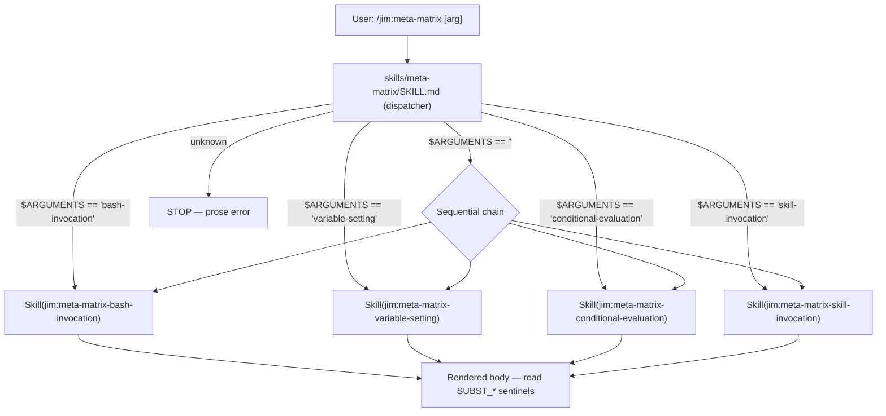

# Promote meta-matrix to a top-level plugin skill with selectable categories — Plan

## Overview

Split the existing `.claude/skills/meta-matrix/` monolith into a top-level dispatcher (`skills/meta-matrix/`) plus four category sub-skills (`skills/meta-matrix-{bash-invocation,variable-setting,conditional-evaluation,skill-invocation}/`). The dispatcher dispatches on `$ARGUMENTS` via the lean paren-free IF form (per ARCHITECTURE.md Logic-Flow Conventions) and fan-outs via the `Skill` tool to the matching sub-skill; with no argument it chains all four sequentially. Existing sentinel rows A–FF migrate verbatim; one new SET-only probe and three new skill-invocation probes are added.

## Design Decisions

### 1. Permission token shape: four enumerated tokens, not a prefix glob

- **Chosen:** Dispatcher's `allowed-tools` enumerates four explicit tokens: `Skill(jim:meta-matrix-bash-invocation) Skill(jim:meta-matrix-variable-setting) Skill(jim:meta-matrix-conditional-evaluation) Skill(jim:meta-matrix-skill-invocation)`.
- **Why:** Claude Code's documented permission syntax is `Skill(name)` / `Skill(name *)` (literal name + optional argument wildcard) per `docs/research/20260512-001-meta-skill-invocation-freshness.md:53`. There is no documented prefix-glob form. Every existing jim skill names one literal token (`Skill(jim:arch)` in `skills/build/SKILL.md:10`) — enumeration matches precedent and avoids a load-time syntax surprise. Least-privilege within the family is preserved either way.
- **Rejected:** `Skill(jim:meta-matrix-*)` as written in spec AC :37 — the prefix-wildcard syntax has no validated precedent in jim or in Claude Code's docs. The spec text is amended in-place in this plan (see task 14) to read "four enumerated `Skill(jim:meta-matrix-<category>)` tokens."

### 2. `$ARGUMENTS` probe scope: dispatcher-propagation only, not direct substitution

- **Chosen:** The skill-invocation sub-skill carries one `$ARGUMENTS` probe row whose interpretation note targets the **dispatcher-propagation** question only (does `Skill(jim:meta-matrix-skill-invocation)` give the sub-skill an `$ARGUMENTS` value?). Direct `/jim:meta-matrix-skill-invocation FOO` substitution is not tested separately.
- **Why:** Direct `$ARGUMENTS` substitution is a documented, well-understood Claude Code mechanic — probing it directly is a regression sanity check at best, with no anti-pattern to surface. The only interesting open question is what `$ARGUMENTS` evaluates to when the sub-skill is loaded via the dispatcher's `Skill(...)` call (peer feedback in `research.md:79-81`). User confirmed this scoping at plan-time.
- **Rejected:** A direct-invocation probe row — would test a known-working mechanic and inflate the matrix without signal.

### 3. Sentinel namespacing: keep A–FF verbatim, prefix new rows by category

- **Chosen:** Rows A–FF retain their existing `SUBST_<row>_<descriptor>` names verbatim. New rows added by 014 (one in variable-setting, three in skill-invocation) take a category prefix: `SUBST_VAR_*`, `SUBST_SKILL_*`.
- **Why:** `docs/debug/20260512-skill-bash-substitution-wrappers.md` and `docs/specs/jim/011-directive-vocabulary/` reference specific sentinel names as evidence (e.g., `SUBST_A_BARE_LINE`, `SUBST_U_READ_IF_EXISTS`). Renaming would silently invalidate those historical references. Researcher recommendation in `research.md:62`.
- **Rejected:** Full re-namespacing (`SUBST_BASH_A_BARE_LINE`, etc.) — purity gain not worth the historical-reference breakage.

### 4. Chain-all arity: sequential, not parallel

- **Chosen:** When `$ARGUMENTS` is empty, the dispatcher issues four `Skill(...)` calls sequentially (one tool call per category, in the order bash-invocation → variable-setting → conditional-evaluation → skill-invocation).
- **Why:** Meta-matrix is read top-to-bottom by humans; deterministic order in the rendered transcript is the load-bearing property. Parallel calls could interleave sub-skill bodies and make reading harder. Cost of four sequential tool calls is invisible at human latency. Researcher recommendation in `research.md:63`.
- **Rejected:** Parallel batch — sub-millisecond speedup at the cost of transcript readability.

### 5. Unknown-category error: prose, not structured exit

- **Chosen:** When `$ARGUMENTS` matches none of the four valid categories, the dispatcher emits a human-readable sentence listing the valid set, then stops.
- **Why:** Meta-matrix is human-driven; structured exit codes serve no downstream consumer. Researcher recommendation in `research.md:64`. The spec calls out (`spec.md:124`) that prose is the default.
- **Rejected:** JSON / exit-1-style output — no consumer, premature.

### 6. Dispatcher dispatch shape: lean paren-free IF over `$ARGUMENTS`

- **Chosen:** The dispatcher body uses the canonical jim lean-IF form: `IF $ARGUMENTS == "<category>" THEN ... ELSE IF ... ELSE ... ENDIF`. No paren-wrapped predicates, no `DO:` / `DONE` markers.
- **Why:** Aligns with `ARCHITECTURE.md:282-354` Logic-Flow Conventions. Although `$ARGUMENTS` is a load-time substitution rather than the output of a `SET <name> = !\`bash …\`` binding, the surface shape (`IF <name> == "value" THEN`) is identical from the LLM's reading. Consistency with the rest of the plugin is more valuable than a special-case form.
- **Rejected:** Natural-language conditional ("If the argument is bash-invocation, invoke …") — works but breaks the convention `meta-skill` validation enforces. Bare match table — discards the canonical idiom for no gain.

### 7. Fixture retirement: full removal, not stub

- **Chosen:** `.claude/skills/meta-matrix/` is deleted in full after migration. No stub `SKILL.md` is left behind.
- **Why:** Spec AC :66 names full removal as the default and the stub alternative as optional. The top-level `skills/meta-matrix/` family fully replaces the project-local fixture; a stub would just confuse future readers about which fixture is canonical.
- **Rejected:** A 3-line stub at `.claude/skills/meta-matrix/SKILL.md` — adds a redirection without any reader benefit; new code references the top-level path anyway.

### 8. 011 in-place amend, not status reopen

- **Chosen:** Update path references inline in `docs/specs/jim/011-directive-vocabulary/{spec,plan,research}.md` and add a one-line "Sentinel fixture relocated by spec 014" annotation in 011's regression-matrix AC block. 011's `status:` is unchanged.
- **Why:** Spec AC :70 names commit `abd85b1` (the 008/009 in-place amend) as precedent. 011's behavioral ACs (sentinel migrations U–Z, lean IF, empty-substitution behavior) are unchanged — only the *home* of the fixture changes. Reopening 011 would imply a behavioral revision that isn't happening.
- **Rejected:** Reopen 011 → version bump or new spec to retroactively edit — heavier than the change warrants.

### 9. Sub-skill body intro: minimal, no per-skill prose duplication

- **Chosen:** Each sub-skill SKILL.md carries a short 2-3 sentence intro explaining the category, then the sentinel rows. Shared "How to interpret" prose (currently lines 205-249 of the monolith) moves to the dispatcher so each sub-skill body is lean.
- **Why:** The interpretation guidance is identical across categories. Duplicating it four times inflates each sub-skill body and bloats compacted context (per `research.md:57` post-compaction caveat: 5,000-token cap per re-attached skill). Centralizing in the dispatcher means the user reads the guidance once.
- **Rejected:** Duplicate the interpretation block in each sub-skill — easier copy-paste but fights the compaction cap.

### 10. `meta-skill` author-time validation: invoked but not load-bearing

- **Chosen:** The coder writes the five new SKILL.md files directly (no `/jim:meta-skill` scaffolding). The 7-point research / convention checklist that `meta-skill` enforces is followed manually — paren-free IF, sentinel form, named tokens — but the meta-skill skill itself is not chained.
- **Why:** `meta-skill` is built for production-pattern skills (description + body + clear user trigger). The meta-matrix sub-skills are probe fixtures whose bodies are deliberately full of substitution-failing patterns (e.g., row C's `IF (!\`echo …\`) EXISTS THEN` is a *deliberate* anti-pattern the matrix exists to verify). Running meta-skill validation would flag those rows as failures.
- **Rejected:** Run `/jim:meta-skill` on each new file — false-positive flood against the very probes the matrix exists to characterize.

### 11. Subagent-probe harness: fold paths 2 and 3 into `meta-matrix-skill-invocation` *(Added 2026-05-13 subagent-probe amendment)*

- **Chosen:** The path-2 (`context: fork`) and path-3 (`skills:` preload) probes from the 001-freshness research § "Same-agent vs subagent execution" are folded into `skills/meta-matrix-skill-invocation/SKILL.md` as rows S4 and S5, backed by three internal harness files: `agents/meta-matrix-probe.md` (minimal probe subagent), `skills/meta-matrix-fork-probe/SKILL.md` (path-2 harness with `context: fork` + `agent: meta-matrix-probe` frontmatter), and `skills/meta-matrix-preload-probe/SKILL.md` (path-3 harness preloaded into the probe agent's startup context). Row S4 calls `Skill(jim:meta-matrix-fork-probe)`; row S5 calls `Agent(meta-matrix-probe)`. Both sentinels (`SUBST_SKILL_PATH2_FORK`, `SUBST_SKILL_PATH3_PRELOAD`) return to the parent conversation as Skill/Agent tool results. `skill-invocation`'s `allowed-tools` expands to include `Skill(jim:meta-matrix-fork-probe)` and `Agent(meta-matrix-probe)`; dispatcher `allowed-tools` is unchanged (harnesses are not categories).
- **Why:** The original 014 design deferred subagent-side probes on the rationale that they "need a different harness — spawn a subagent with a preloaded probe skill, read its output back" (spec :113, plan Out-of-Scope). That harness is straightforwardly buildable today: jim already has agent-spawning precedent (`agents/researcher.md`, `agents/meta.md`, etc.) and the `context: fork` + `skills:` preload mechanisms are documented Claude Code primitives (`docs/research/20260512-001-meta-skill-invocation-freshness.md:60-71`). Folding paths 2/3 into the existing skill-invocation category keeps the "one category = one cohesive probe surface" shape, closes the deferral with three contained new files, and avoids a fifth dispatcher entry that would otherwise be needed for a separate `meta-matrix-subagent-invocation` category. User-confirmed scoping (both path 2 and path 3 in scope; helpers as sibling skills with internal-marked descriptions, not nested or `.claude/`-local).
- **Rejected:**
  - **Deferral to a follow-up spec** (original 014 plan). Would leave path coverage at 2-of-4 in perpetuity until someone files a follow-up. Both paths are tractable now; deferral has negative value.
  - **A separate fifth-category sub-skill `meta-matrix-subagent-invocation`.** Would inflate the dispatcher to five tokens and split "skill invocation" semantics across two categories. The harnesses themselves still need to exist; this option only changes which sub-skill surfaces them.
  - **Nesting the harness skills under `skills/meta-matrix-skill-invocation/`** (e.g., `skills/meta-matrix-skill-invocation/fork-probe/SKILL.md`). Jim's plugin loader has no validated precedent for recursively discovering nested `SKILL.md` files; sibling layout matches every existing skill directory.
  - **Hiding the harness skills under `.claude/skills/`** (project-local). Defeats spec :108's "ship with the plugin" rationale — jim users in their own projects could not probe paths 2/3.

#### Refinement (2026-05-13, post-first-matrix-rerun)

The first matrix rerun on Opus 4.7 `[1m]` exposed two design gaps in the original Decision 11 shape that this refinement closes in-place. Both refinements land before any production use of S4/S5 readings, so no prior data is invalidated — only the first rerun's bare-string findings, which now read as "harness fired but substitution-tier unknown" rather than as load-bearing answers.

##### Dual-sentinel design supersedes single-sentinel

- **Original (single-sentinel):** each subagent harness body had one sentinel through `!`-injection (e.g., `!`echo SUBST_SKILL_PATH2_FORK``). The probe agent reported whether the sentinel arrived as bare string or as the literal backticked form.
- **Refined (dual-sentinel):** each harness body now has *two* sentinels side-by-side — a bare literal `SUBST_SKILL_PATH*_LITERAL` (control, always arrives verbatim if the body reached the subagent) and `!`echo SUBST_SKILL_PATH*_THRU_INJECTION`` (test, arrives bare only if `!`-injection fired along the chain). Comparing the two yields a 4-cell rubric (substitution fired / didn't fire / harness failure / unexpected) that the probe agent reports directly under each row block.
- **Why:** the first rerun observed bare-string THRU_INJECTION on both S4 and S5 but could not distinguish that reading from "the body never reached the subagent" — because no control was present in the body to confirm delivery. The LITERAL slot is that control. Pinpointed in the rerun's plan-Verification-Log finding 3 ("substitution-tier ambiguity").
- **Cost:** each harness body grows by ~3 lines (control sentinel + dual-block label); the probe agent's Process block grows by ~10 lines (row report template + interpretation rubric). No new permission tokens needed.

##### Model pinning sub-decision — probe agent omits `model:`, inherits parent

- **Original:** `agents/meta-matrix-probe.md` declared `model: sonnet` per jim's general agent convention (`agents/researcher.md:41`, `agents/pm.md`, etc.).
- **Refined:** the `model:` field is **omitted entirely** so the probe inherits the parent conversation's active model (per ARCHITECTURE.md:247 — "agents default to `inherit`, not `sonnet`").
- **Why:** the first rerun on an Opus 4.7 parent surfaced a model split — the parent and the in-thread sub-skill reported Opus, but the probe subagent (and the forked subagent under fork-probe) reported Sonnet 4.6 per the agent's pinning. For most jim agents this pinning is right (cheaper, deterministic). For the meta-matrix probe specifically, the *whole point* is to characterize the active Claude Code runtime's behavior — pinning to Sonnet means the matrix reports Sonnet's runtime even when the user is running Opus or Haiku, masking the very signal the matrix exists to surface. If a future test specifically wants to compare model-X-vs-model-Y on path-2/3 behavior, that's its own dedicated probe with explicit `model: X` and `model: Y` variants, not a property of the general probe.
- **Cost:** none beyond deleting one frontmatter line and updating one paragraph of body prose. Inheriting may produce slower / more expensive runs when the parent is on Opus, but that's the point — the probe should run on whatever the parent is running.
- **Convention-aware:** jim's other agents pin because their roles are well-defined and Sonnet is sufficient. The probe agent is the first explicit exception; the rationale is documented in the agent body prose and in this Design Decision so future readers don't "fix" it back to `model: sonnet` thinking it was an oversight.

##### Rubric clarity refinement (2026-05-14, post-cross-model-rerun)

- **Surfaced by:** a Sonnet 4.6 chain-all rerun on 2026-05-14 (see Verification Log § "Cross-model rerun (Sonnet 4.6) — 2026-05-14"). The probe subagent (running on Sonnet via model-inherit) misread the dual-sentinel rubric and self-reported `Inferred: did not fire` on rows S4 and S5 despite both LITERAL and THRU_INJECTION sentinels arriving bare — the inverse of the correct reading.
- **Diagnosis:** the previous rubric wording ("Both bare strings present → substitution fired") relied on the reader knowing that bare THRU_INJECTION text is *produced by* `!`-injection running. A Sonnet-shaped reader can flip: "bare text visible, no transformation evidence visible, therefore nothing happened." Subtle semantic-reversal trap.
- **Refined:** rubric replaced in `agents/meta-matrix-probe.md`, `skills/meta-matrix-fork-probe/SKILL.md`, and `skills/meta-matrix-preload-probe/SKILL.md`. New shape: explicit per-slot reading instructions (one rule for THRU_INJECTION, one rule for LITERAL) + a one-line mnemonic ("Bare text in THRU = `echo` ran. Backticked text in THRU = `echo` did NOT run."). Truth table preserved but now follows the per-slot rule rather than relying on it implicitly. Process step 3 also annotated to enforce the `Inferred:` slot must apply the THRU rule, not infer from LITERAL alone.
- **Why this is in-scope:** the rubric is the load-bearing inference rule for S4 / S5 reports. A wrong inference from the subagent forces the main thread to override, which produces a correct *final* report but is fragile (depends on the main thread also catching the trap). Sharpening the rubric in the probe-side text removes the dependency on main-thread override.
- **Why this validates the model-inherit decision:** without inherit, BOTH parent models would have hit the inference failure (since the probe would always have been Sonnet). With inherit, Sonnet-on-Sonnet surfaces the divergence honestly and the rubric ambiguity becomes visible — exactly the kind of cross-model artifact the matrix exists to surface.
- **Retest pending:** rubric refinement landed without a fresh Sonnet rerun. Future Sonnet runs should produce `Inferred: substitution fired` from the subagent directly; future Opus runs should regress-free continue producing the same. Non-blocking.

## Constitution Check

**ARCHITECTURE.md status:** Present — constraints noted below.

| Constraint from ARCHITECTURE.md | Honored? | Notes |
| :--- | :--- | :--- |
| Skill name matches directory name (`:233`) | Yes | `name: meta-matrix` in `skills/meta-matrix/`; each `name: meta-matrix-<category>` matches its sibling directory. |
| Skill-to-skill via `Skill(name)` token + Skill tool call (`:242`) | Yes | Dispatcher uses named tokens, fan-outs via the Skill tool. No bare `Skill` wildcard. |
| `$ARGUMENTS` substitution mechanic (`:240`) | Yes | Dispatcher reads `$ARGUMENTS` for category selection. |
| Permission token names exact script path (`:386`) | N/A | Dispatcher and sub-skills declare only `Skill(...)` and `Bash(echo *) / Bash(bash -c *)` tokens. No scripts called. |
| Logic-Flow Conventions — sentinel + lean paren-free IF (`:282-354`) | Yes | Dispatcher uses `IF $ARGUMENTS == "<value>" THEN ... ELSE IF ... ELSE ... ENDIF`. No retired `IF (X) EXISTS THEN` paren-wrap, no `READ_IF_EXISTS` / `RUN_IF_EXISTS` / `DO_IF_EXISTS` directives. |
| Substitution sigils: `<lower>` in code blocks, `$UPPER` in `!`-injection (`:368-372`) | Yes | `$ARGUMENTS` used only in lean-IF predicates (LLM-substituted at load); sub-skill rows use `!`echo …`` for sentinel emission. |
| Wrapper sensitivity — no `!`-injection inside `(...)` (`:381-382`) | Yes | Dispatcher has no `!`-injection at all. Sub-skill rows that deliberately violate (e.g., row C) are *probe* rows whose anti-pattern is the test, not production logic. |
| meta-matrix fixture reference (`:381`) | Updated by this plan | Line 381's reference moves from `.claude/skills/meta-matrix/` to the new top-level family. |
| `Agent(name1, name2)` restricts subagent spawning (`:253`) | Yes *(2026-05-13 subagent-probe amendment)* | `skill-invocation` sub-skill's `allowed-tools` carries `Agent(meta-matrix-probe)` as a named token — restricts to a single agent type, matches the syntax in `agents/researcher.md:40` and the rule at ARCHITECTURE.md:253. |
| `skills:` preloads full content into subagent startup (`:248`) | Yes *(2026-05-13 subagent-probe amendment)* | `agents/meta-matrix-probe.md` declares `skills: [meta-matrix-preload-probe]`; this is the exact mechanism path-3 row S5 probes. |
| Agent `model` defaults to `inherit`, not `sonnet` (`:247`) | Yes *(2026-05-13 subagent-probe amendment; refined 2026-05-13 post-rerun)* | `agents/meta-matrix-probe.md` **omits** `model:` so the probe inherits the parent's active model — the original `model: sonnet` was changed after the first matrix rerun surfaced an Opus/Sonnet split that masked Opus-specific behavior. Inheriting is intentional and convention-aware: jim's other agents pin (researcher.md:41) but the probe agent's role is to characterize the active model, not a pinned baseline. |
| `context: fork` runs the skill body as task prompt in subagent (`:241`) | Yes *(2026-05-13 subagent-probe amendment)* | `skills/meta-matrix-fork-probe/SKILL.md` declares `context: fork` + `agent: meta-matrix-probe`; this is the exact mechanism path-2 row S4 probes. Note that ARCHITECTURE.md:241 frames jim's broader pattern as "documentation-only outside fork" — this is the first jim skill to *actually use* `context: fork`, so the field's runtime semantics are themselves under test by row S4. |

## File Manifest

| Component | File Path | Action | Notes |
| :--- | :--- | :--- | :--- |
| Dispatcher | `skills/meta-matrix/SKILL.md` | Create | Frontmatter + lean-IF dispatch over `$ARGUMENTS` + shared "How to interpret" block. |
| Bash-invocation sub-skill | `skills/meta-matrix-bash-invocation/SKILL.md` | Create | Rows A–T verbatim from the existing fixture. |
| Variable-setting sub-skill | `skills/meta-matrix-variable-setting/SKILL.md` | Create | Row W verbatim + one new SET-only probe row (`SUBST_VAR_<descriptor>`). |
| Conditional-evaluation sub-skill | `skills/meta-matrix-conditional-evaluation/SKILL.md` | Create | Rows U, V, X, Y, Z + AA, BB + CC–FF + GG, HH verbatim. CC–FF carry the fixture's HISTORICAL/forensic annotation; GG/HH are the post-amendment load-bearing rows (canonical `SET … = !`bash`` + `IF … != "NOT_FOUND" THEN … ELSE … ENDIF` sentinel form). |
| Skill-invocation sub-skill | `skills/meta-matrix-skill-invocation/SKILL.md` | Create / Amend | Five probes: path-1 (`SUBST_SKILL_PATH1_DIRECT`), path-4 (`SUBST_SKILL_PATH4_VIA_TOOL`), `$ARGUMENTS` dispatcher-propagation (`SUBST_SKILL_ARGS_PROPAGATE`), and — added by 2026-05-13 subagent-probe amendment — path-2 fork (`SUBST_SKILL_PATH2_FORK`, row S4) + path-3 preload (`SUBST_SKILL_PATH3_PRELOAD`, row S5). `allowed-tools` expanded to add `Skill(jim:meta-matrix-fork-probe)` and `Agent(meta-matrix-probe)`. |
| Probe subagent | `agents/meta-matrix-probe.md` | Create | Minimal probe subagent. `skills: [meta-matrix-preload-probe]`, `tools: [Bash(echo *), Bash(bash -c *)]`. `model:` is **omitted** so the probe inherits the parent's active model — pinning would mask model-specific runtime behavior, the very signal meta-matrix exists to surface. Spawned by `meta-matrix-skill-invocation` row S5 via `Agent(meta-matrix-probe)` and by `meta-matrix-fork-probe` via `context: fork`. Body reports both LITERAL and THRU_INJECTION sentinels per the dual-sentinel design with a one-sentence `Inferred:` finding per row. *(Added by 2026-05-13 subagent-probe amendment; refined 2026-05-13 post-rerun: dropped `model: sonnet`, switched to dual-sentinel reporting.)* |
| Fork-probe helper skill | `skills/meta-matrix-fork-probe/SKILL.md` | Create | Path-2 harness. Frontmatter `context: fork` + `agent: meta-matrix-probe`; body holds **dual-sentinel pair** `SUBST_SKILL_PATH2_FORK_LITERAL` (bare) and `!`echo SUBST_SKILL_PATH2_FORK_THRU_INJECTION`` plus the subagent task-prompt instructions. `description` marks it as internal harness, not for direct user invocation. `allowed-tools: Bash(echo *)`. *(Added by 2026-05-13 subagent-probe amendment; refined 2026-05-13 post-rerun to the dual-sentinel design.)* |
| Preload-probe helper skill | `skills/meta-matrix-preload-probe/SKILL.md` | Create | Path-3 harness. Body holds **dual-sentinel pair** `SUBST_SKILL_PATH3_PRELOAD_LITERAL` (bare) and `!`echo SUBST_SKILL_PATH3_PRELOAD_THRU_INJECTION``; preloaded into `meta-matrix-probe` agent's startup context via the agent's `skills:` field. `description` marks it as internal harness. `allowed-tools: Bash(echo *)`. *(Added by 2026-05-13 subagent-probe amendment; refined 2026-05-13 post-rerun to the dual-sentinel design.)* |
| Architecture — fixture line | `ARCHITECTURE.md` (Substitution Conventions, line 381) | Update | `.claude/skills/meta-matrix/` → `skills/meta-matrix/` (top-level family). Quit-and-relaunch guidance preserved. |
| 011 spec — path refs | `docs/specs/jim/011-directive-vocabulary/spec.md` | Update | Lines 21, 23, 29, 63, 64: amend path strings. Add a one-line "Sentinel fixture relocated by spec 014 — see `skills/meta-matrix/`" annotation in the regression-matrix AC block. Status unchanged. |
| 011 plan — path refs | `docs/specs/jim/011-directive-vocabulary/plan.md` | Update | Lines 56–60 (Decision 6), 64, 99, 115–116, 218–219, 269–270, 284, 326–327, 364, 428–429, 433, 445: amend path strings. Body of historical record preserved otherwise. |
| 011 research — path refs | `docs/specs/jim/011-directive-vocabulary/research.md` | Update | Lines 51, 60, 134: amend path strings. |
| Brainstorm — exists-trap | `docs/brainstorms/20260513-directive-vocab-exists-trap.md` | Update | Lines 64, 172: annotate "Sentinel fixture location updated by spec 014 — see `skills/meta-matrix/`." Body preserved. |
| Brainstorm — resolver audit | `docs/brainstorms/20260505-file-resolver-conventions-audit.md` | Update | Lines 121, 331: annotate per spec AC :74. Body preserved. |
| 014 spec — AC refinements | `docs/specs/jim/014-meta-matrix/spec.md` | Update | AC :37 — clarify `allowed-tools` as four enumerated tokens (Design Decision 1). AC :62 — rescope to "`$ARGUMENTS` propagation through the Skill tool" (Design Decision 2). AC :79 — add GG/HH and reframe CC–FF as forensic (Task 14a, cross-check audit). AC :74 — widen scope to include non-014 specs (Task 14b, cross-check audit). **Subagent-probe amendment 2026-05-13:** "New skill-invocation category" AC block extended with rows S4 (path 2) and S5 (path 3) + three harness-file ACs; Out-of-Scope subagent bullet struck-through; Open Question 3 marked resolved; "Original 011 repro" block adds an S4/S5 spot-check AC. See Task 14c. |
| Spec 012 — cross-ref annotations | `docs/specs/jim/012-allowed-tools-narrowing/{spec,plan}.md` | Update | Annotate `meta-matrix` references at spec.md :60,:66,:71 and plan.md :89,:290 with "Sentinel fixture location updated by spec 014" per AC :74 (widened) and Task 12c. 012's status unchanged. |
| Debug doc — footer extension | `docs/debug/20260512-skill-bash-substitution-wrappers.md` | Update | Extend spec-011 footer with one-line spec-014 relocation note (Task 12d). Body verbatim; references to pre-rename `subtest` name preserved as forensic record per spec 011 AC :69 precedent. |
| Project-local fixture | `.claude/skills/meta-matrix/` | Delete | Full directory removal (no stub) after sub-skill migration verified. |
| Dispatcher — model header | `skills/meta-matrix/SKILL.md` | Update | Insert "## Session metadata" subsection between intro and `## Dispatch`. Two-line MODEL_NAME / MODEL_ID self-report instruction. (Model-attribution amendment 2026-05-13.) |
| Bash-invocation — model header | `skills/meta-matrix-bash-invocation/SKILL.md` | Update | Insert "## Session metadata" subsection between intro and `## Controls`. (Model-attribution amendment 2026-05-13.) |
| Variable-setting — model header | `skills/meta-matrix-variable-setting/SKILL.md` | Update | Insert "## Session metadata" subsection between intro and the first `### W` row. (Model-attribution amendment 2026-05-13.) |
| Conditional-evaluation — model header | `skills/meta-matrix-conditional-evaluation/SKILL.md` | Update | Insert "## Session metadata" subsection between intro and `## Proposed directive vocabulary`. (Model-attribution amendment 2026-05-13.) |
| Skill-invocation — model header | `skills/meta-matrix-skill-invocation/SKILL.md` | Update | Insert "## Session metadata" subsection between intro and the first `### S1` row. (Model-attribution amendment 2026-05-13.) |
| 014 spec — model-attribution AC + Out of Scope | `docs/specs/jim/014-meta-matrix/spec.md` | Update | Add new "Model attribution in rendered output" AC block before "Delivery shape" and one Out-of-Scope bullet about self-report reliability probing. (Task 20.) |
| 014 research — mechanism subsection | `docs/specs/jim/014-meta-matrix/research.md` | Update | Add "Model attribution mechanism" subsection under Recommendations. (Task 21.) |
| Probe subagent — model header | `agents/meta-matrix-probe.md` | Update | Add MODEL_NAME / MODEL_ID emission as Process step 1 so the path-2 / path-3 subagent's final message (which the parent transcript reads as a Skill / Agent tool result) carries cross-agent model attribution. Subagent is pinned to `model: sonnet`, so a parent on Opus / Haiku will see two distinct headers — informative integrity signal. (Model-attribution amendment 2026-05-13, harness extension picked up after fork-probe / preload-probe landed mid-amendment.) |
| Fork-probe — report-step model header | `skills/meta-matrix-fork-probe/SKILL.md` | Update | Mirror the agent's Process step 1 in the fork-probe Report section so the task prompt and system prompt agree on emission order. Preload-probe SKILL.md needs no change — its Report section is descriptive only; the agent's Process is authoritative. (Model-attribution amendment 2026-05-13, harness extension.) |
| 014 spec — subagent-side AC bullet | `docs/specs/jim/014-meta-matrix/spec.md` | Update | Add a fifth bullet to the "Model attribution in rendered output" AC block covering subagent-side path-2 / path-3 harnesses. (Task 18a, harness extension.) |

## Interface Contracts

### Dispatcher SKILL.md (`skills/meta-matrix/SKILL.md`)

```yaml
---
name: meta-matrix
description: >
  Manual probe matrix for Claude Code runtime behavior. Quit and relaunch
  Claude Code from the repo root so this skill family is discovered at
  session start. Invoke with no argument to chain all four category
  sub-skills sequentially; invoke with one of bash-invocation,
  variable-setting, conditional-evaluation, or skill-invocation to load
  only that category's sentinel rows.
argument-hint: "[bash-invocation | variable-setting | conditional-evaluation | skill-invocation]"
allowed-tools: Skill(jim:meta-matrix-bash-invocation) Skill(jim:meta-matrix-variable-setting) Skill(jim:meta-matrix-conditional-evaluation) Skill(jim:meta-matrix-skill-invocation)
---
```

Body shape (the dispatch block — exact prose subject to coder discretion):

```
# /jim:meta-matrix

Manual diagnostic for Claude Code substitution and invocation behavior.
Each sub-skill body contains sentinel rows you read to confirm which
patterns work and which silently fail.

## Dispatch

IF $ARGUMENTS == "" THEN
  Sequentially invoke each sub-skill via the Skill tool, in this order:
    1. Skill(jim:meta-matrix-bash-invocation)
    2. Skill(jim:meta-matrix-variable-setting)
    3. Skill(jim:meta-matrix-conditional-evaluation)
    4. Skill(jim:meta-matrix-skill-invocation)
ELSE IF $ARGUMENTS == "bash-invocation" THEN
  Invoke Skill(jim:meta-matrix-bash-invocation).
ELSE IF $ARGUMENTS == "variable-setting" THEN
  Invoke Skill(jim:meta-matrix-variable-setting).
ELSE IF $ARGUMENTS == "conditional-evaluation" THEN
  Invoke Skill(jim:meta-matrix-conditional-evaluation).
ELSE IF $ARGUMENTS == "skill-invocation" THEN
  Invoke Skill(jim:meta-matrix-skill-invocation).
ELSE
  STOP and tell the user: "Unknown category '$ARGUMENTS'. Valid:
  bash-invocation, variable-setting, conditional-evaluation,
  skill-invocation."
ENDIF

## How to interpret

After invocation, scan the rendered body for each `SUBST_*` sentinel:

- Sentinel visible → that wrapper allowed substitution. ✅
- Literal `` !`echo SUBST_*` `` visible → that wrapper suppressed
  substitution. ❌

Cross-reference against `docs/debug/20260512-skill-bash-substitution-wrappers.md`
for which production files contain each pattern.
```

### Sub-skill SKILL.md (one per category)

```yaml
---
name: meta-matrix-<category>
description: >
  Manual probe for <one-line category description>. Quit and relaunch
  Claude Code from the repo root so this skill is discovered at session
  start. Read the rendered body for SUBST_* sentinels.
allowed-tools: Bash(echo *), Bash(bash -c *)
---
```

Body: 2-3 sentence intro identifying the category, then sentinel rows preserved from the source fixture or newly added per the migration plan. No "How to interpret" block (centralized in the dispatcher per Design Decision 9).

### New probe rows

**Variable-setting (one new row):**

```
### W2 — SET assignment without an accompanying IF (D2 readback probe)

SET v2_path = !`echo SUBST_VAR_W2_SET_STANDALONE`
```

Interpretation note: the sentinel `SUBST_VAR_W2_SET_STANDALONE` should appear after the `=`. Verifies that a `SET` line substitutes correctly even when no downstream `IF` predicate consumes the name. This complements existing row W, which embeds a `SET` in a directive-vocabulary context.

**Skill-invocation (three new rows):**

```
### S1 — direct slash-command invocation (path 1)

!`echo SUBST_SKILL_PATH1_DIRECT`

### S2 — invocation via Skill tool from dispatcher (path 4)

!`echo SUBST_SKILL_PATH4_VIA_TOOL`

### S3 — $ARGUMENTS propagation through Skill tool

!`echo SUBST_SKILL_ARGS_PROPAGATE "$ARGUMENTS"`
```

Interpretation notes accompany each row in the sub-skill body — see task 5.

## Data Flow



## Task Breakdown

Ordered to land Tidy First (pure structural moves) before behavioral additions (new probes) before ripple-out updates (ARCHITECTURE.md, 011 amend, brainstorm annotation, fixture removal). The bundled PR per spec AC :82 may separate these into internal commits; this ordering matches the commit boundary the coder should target.

### Structural — sub-skill scaffolds and row migration

1. [x] Create `skills/meta-matrix-bash-invocation/SKILL.md` with the sub-skill frontmatter shape (Interface Contracts) — `name: meta-matrix-bash-invocation`, description "Manual probe for `!`-injection wrapper-pattern substitution behavior (markdown rows A–T from the 011 fixture).", `allowed-tools: Bash(echo *), Bash(bash -c *)`. Body: short intro paragraph + verbatim copy of rows A–T from `.claude/skills/meta-matrix/SKILL.md:21-109` (sections "## Controls" and "## New patterns under test", through row T).
   **Verify:** `grep -F 'SUBST_A_BARE_LINE' skills/meta-matrix-bash-invocation/SKILL.md && grep -F 'SUBST_T_PARENS' skills/meta-matrix-bash-invocation/SKILL.md && grep -cE '^### [A-T] —' skills/meta-matrix-bash-invocation/SKILL.md | grep -q '^20$'`

2. [x] Create `skills/meta-matrix-variable-setting/SKILL.md` with sub-skill frontmatter — `name: meta-matrix-variable-setting`, description "Manual probe for `SET <name> = !`bash …`` variable-binding substitution behavior." Body: short intro + verbatim copy of row W from `.claude/skills/meta-matrix/SKILL.md:127-129` only (no W2 yet — added in task 4).
   **Verify:** `grep -F 'SUBST_W_SET_ASSIGN' skills/meta-matrix-variable-setting/SKILL.md && grep -cE '^### W ' skills/meta-matrix-variable-setting/SKILL.md | grep -q '^1$'`

3. [x] Create `skills/meta-matrix-conditional-evaluation/SKILL.md` with sub-skill frontmatter — `name: meta-matrix-conditional-evaluation`, description "Manual probe for conditional / branching directive substitution — covers retired `*_IF_EXISTS` directives (rows U, V, X, Y, Z, forensic), lean paren-free `IF` chains (rows AA, BB), historical empty-substitution no-op behavior (rows CC–FF, forensic per fixture annotation), and the canonical post-amendment sentinel form with positive/negative cases (rows GG, HH, load-bearing)." Body: short intro + verbatim copy of rows U, V, X, Y, Z (`.claude/skills/meta-matrix/SKILL.md:119-145`), rows AA, BB (`:152-171`), rows CC–FF (`:184-203`), and rows GG, HH (`:208-230`) preserving section headings and surrounding prose. Carry forward the fixture's HISTORICAL annotation on CC–FF (`:173-175,:270`) and the load-bearing framing on GG/HH (`:208-211,:263-268`).
   **Verify:** `grep -cE '^### (U|V|X|Y|Z|AA|BB|CC|DD|EE|FF|GG|HH) ' skills/meta-matrix-conditional-evaluation/SKILL.md | grep -q '^13$' && grep -F 'SUBST_U_READ_IF_EXISTS' skills/meta-matrix-conditional-evaluation/SKILL.md && grep -F 'SUBST_FF_SET_EMPTY-ELSE-OK' skills/meta-matrix-conditional-evaluation/SKILL.md && grep -F 'SUBST_GG_ELSE_OK' skills/meta-matrix-conditional-evaluation/SKILL.md && grep -F 'SUBST_HH_THEN_OK' skills/meta-matrix-conditional-evaluation/SKILL.md`

### Behavioral — new probe rows

4. [x] Add the new W2 row to `skills/meta-matrix-variable-setting/SKILL.md` at the end of the body: a `SET v2_path = !\`echo SUBST_VAR_W2_SET_STANDALONE\`` line with a one-paragraph interpretation note explaining that the sentinel should appear after `=`, and that the probe verifies `SET` substitution without an accompanying `IF`. (Spec AC :53.)
   **Verify:** `grep -F 'SUBST_VAR_W2_SET_STANDALONE' skills/meta-matrix-variable-setting/SKILL.md && grep -cE '^### W2? ' skills/meta-matrix-variable-setting/SKILL.md | grep -q '^2$'`

5. [x] Create `skills/meta-matrix-skill-invocation/SKILL.md` with sub-skill frontmatter — `name: meta-matrix-skill-invocation`, description "Manual probe for skill-invocation paths (direct slash command, dispatcher `Skill(...)` call) and `$ARGUMENTS` propagation through the Skill tool." Body: intro paragraph + three sentinel rows S1, S2, S3 per Interface Contracts. Each row carries a one-paragraph interpretation note: S1 — "Visible after direct `/jim:meta-matrix-skill-invocation` invocation (path 1) and after dispatcher chain-all; presence confirms the body loaded at all."; S2 — "Visible whenever this sub-skill loads via the Skill tool (path 4), which happens during dispatcher chain-all or `/jim:meta-matrix skill-invocation`. Presence confirms path-4 invocation works."; S3 — "Read the value after `SUBST_SKILL_ARGS_PROPAGATE`. The interesting case is when this sub-skill is reached via the dispatcher: whether `$ARGUMENTS` is empty, carries the dispatcher's argument string, or something else is undocumented; this row captures the answer." Reference the deferred subagent-side probes in a closing note.
   **Verify:** `grep -F 'SUBST_SKILL_PATH1_DIRECT' skills/meta-matrix-skill-invocation/SKILL.md && grep -F 'SUBST_SKILL_PATH4_VIA_TOOL' skills/meta-matrix-skill-invocation/SKILL.md && grep -F 'SUBST_SKILL_ARGS_PROPAGATE' skills/meta-matrix-skill-invocation/SKILL.md`

### Subagent-probe amendment (2026-05-13) — fold paths 2 and 3 into skill-invocation

5a. [x] Create `agents/meta-matrix-probe.md`. Minimal probe subagent with frontmatter: `name: meta-matrix-probe`, description marking it as internal harness for meta-matrix paths 2/3, `skills: [meta-matrix-preload-probe]`, `tools: [Bash(echo *), Bash(bash -c *)]`. `model:` **omitted** so the probe inherits the parent's active model (per ARCHITECTURE.md:247 — convention-aware exception documented in Design Decision 11 § Refinement). Body: system-prompt persona instructing the subagent to inspect its startup context for both LITERAL and THRU_INJECTION sentinel pairs (preload-probe and, if present in task prompt, fork-probe), emit the model header, then report each row as a labeled block (`Row S<N>: LITERAL / THRU_INJECTION / Inferred`) following the dual-sentinel rubric. *(Refined 2026-05-13 post-rerun: dropped `model: sonnet`, expanded to dual-sentinel reporting.)*
    **Verify:** `grep -F 'name: meta-matrix-probe' agents/meta-matrix-probe.md && grep -F 'skills: [meta-matrix-preload-probe]' agents/meta-matrix-probe.md && ! awk '/^---$/{c++; next} c==1{print}' agents/meta-matrix-probe.md | grep -E '^model:' && grep -F 'LITERAL' agents/meta-matrix-probe.md && grep -F 'THRU_INJECTION' agents/meta-matrix-probe.md`

5b. [x] Create `skills/meta-matrix-fork-probe/SKILL.md`. Path-2 (`context: fork`) harness with frontmatter: `name: meta-matrix-fork-probe`, description marking it as internal harness ("not intended for direct user invocation"), `context: fork`, `agent: meta-matrix-probe`, `allowed-tools: Bash(echo *)`. Body: task-prompt instructions plus the **dual-sentinel pair** — bare literal `SUBST_SKILL_PATH2_FORK_LITERAL` (control) and `!`echo SUBST_SKILL_PATH2_FORK_THRU_INJECTION`` (test) — and report instructions that direct the subagent to emit the row S4 block per the agent's reporting template. *(Refined 2026-05-13 post-rerun to the dual-sentinel design.)*
    **Verify:** `grep -F 'name: meta-matrix-fork-probe' skills/meta-matrix-fork-probe/SKILL.md && grep -F 'context: fork' skills/meta-matrix-fork-probe/SKILL.md && grep -F 'agent: meta-matrix-probe' skills/meta-matrix-fork-probe/SKILL.md && grep -F 'SUBST_SKILL_PATH2_FORK_LITERAL' skills/meta-matrix-fork-probe/SKILL.md && grep -F 'SUBST_SKILL_PATH2_FORK_THRU_INJECTION' skills/meta-matrix-fork-probe/SKILL.md`

5c. [x] Create `skills/meta-matrix-preload-probe/SKILL.md`. Path-3 (`skills:` preload) harness with frontmatter: `name: meta-matrix-preload-probe`, description marking it as internal harness preloaded into `meta-matrix-probe` (not for direct user invocation), `allowed-tools: Bash(echo *)`. Body: explanation that this body is preloaded into the probe agent's startup context plus the **dual-sentinel pair** — bare literal `SUBST_SKILL_PATH3_PRELOAD_LITERAL` (control) and `!`echo SUBST_SKILL_PATH3_PRELOAD_THRU_INJECTION`` (test) — and a paragraph framing the row S5 reporting template. *(Refined 2026-05-13 post-rerun to the dual-sentinel design.)*
    **Verify:** `grep -F 'name: meta-matrix-preload-probe' skills/meta-matrix-preload-probe/SKILL.md && grep -F 'SUBST_SKILL_PATH3_PRELOAD_LITERAL' skills/meta-matrix-preload-probe/SKILL.md && grep -F 'SUBST_SKILL_PATH3_PRELOAD_THRU_INJECTION' skills/meta-matrix-preload-probe/SKILL.md`

5d. [x] Amend `skills/meta-matrix-skill-invocation/SKILL.md`. (1) `description:` expands to mention all four invocation paths and notes that subagent-side sentinels appear in returned Skill/Agent tool results. (2) `allowed-tools:` expands to `Bash(echo *), Bash(bash -c *), Skill(jim:meta-matrix-fork-probe), Agent(meta-matrix-probe)`. (3) Body intro adds S4/S5 to the path-mapping summary. (4) Row S4 invokes `Skill(jim:meta-matrix-fork-probe)` and carries a 4-cell interpretation rubric over LITERAL × THRU_INJECTION readings (fired / didn't fire / harness failure / unexpected). (5) Row S5 invokes `Agent(meta-matrix-probe)` with prompt `"Emit your preloaded probe content."` and carries the same 4-cell rubric for path 3. (6) Replace the original "Deferred — subagent-side probes" closing paragraph with a "Coverage" paragraph confirming all four invocation paths are now probed in this sub-skill and naming the harness files. *(Refined 2026-05-13 post-rerun: rubric updated from single-sentinel to dual-sentinel readings.)*
    **Verify:** `grep -F 'SUBST_SKILL_PATH2_FORK_LITERAL' skills/meta-matrix-skill-invocation/SKILL.md && grep -F 'SUBST_SKILL_PATH2_FORK_THRU_INJECTION' skills/meta-matrix-skill-invocation/SKILL.md && grep -F 'SUBST_SKILL_PATH3_PRELOAD_LITERAL' skills/meta-matrix-skill-invocation/SKILL.md && grep -F 'SUBST_SKILL_PATH3_PRELOAD_THRU_INJECTION' skills/meta-matrix-skill-invocation/SKILL.md && grep -F 'Skill(jim:meta-matrix-fork-probe)' skills/meta-matrix-skill-invocation/SKILL.md && grep -F 'Agent(meta-matrix-probe)' skills/meta-matrix-skill-invocation/SKILL.md && ! grep -F 'Deferred — subagent-side probes' skills/meta-matrix-skill-invocation/SKILL.md`

### Structural — dispatcher

6. [x] Create `skills/meta-matrix/SKILL.md` with dispatcher frontmatter per Interface Contracts: `name: meta-matrix`, the `argument-hint` enumerating the four valid categories, and the four-token `allowed-tools` line. Body: title + intro + the lean-IF dispatch block + the shared "How to interpret" prose (single source).
   **Verify:** `grep -F 'name: meta-matrix' skills/meta-matrix/SKILL.md && grep -F 'Skill(jim:meta-matrix-bash-invocation)' skills/meta-matrix/SKILL.md && grep -F 'Skill(jim:meta-matrix-variable-setting)' skills/meta-matrix/SKILL.md && grep -F 'Skill(jim:meta-matrix-conditional-evaluation)' skills/meta-matrix/SKILL.md && grep -F 'Skill(jim:meta-matrix-skill-invocation)' skills/meta-matrix/SKILL.md && grep -F 'IF $ARGUMENTS ==' skills/meta-matrix/SKILL.md && grep -F 'ENDIF' skills/meta-matrix/SKILL.md`

### Ripple-out — architecture, 011, brainstorms

7. [x] Update `ARCHITECTURE.md` Substitution Conventions (currently line 381) to replace `.claude/skills/meta-matrix/` with `skills/meta-matrix/` (the top-level family). Preserve the "quit and relaunch Claude Code from the repo root so the matrix skill is discovered at session start" guidance verbatim. Adjust prose to mention "the matrix skill family (dispatcher plus category sub-skills)" rather than a single skill so future readers understand the family shape.
   **Verify:** `grep -F 'skills/meta-matrix/' ARCHITECTURE.md && grep -F 'quit and relaunch' ARCHITECTURE.md && ! grep -F '.claude/skills/meta-matrix' ARCHITECTURE.md`

8. [x] Amend `docs/specs/jim/011-directive-vocabulary/spec.md` in place: replace every `.claude/skills/subtest/` and `.claude/skills/meta-matrix/` reference with the appropriate `skills/meta-matrix-*/` path (lines 21, 23, 29, 63, 64). Add a one-line "Sentinel fixture relocated by spec 014 — see `skills/meta-matrix/` family" annotation near the regression-matrix AC block (around line 63-64). Body otherwise preserved. Status unchanged.
   **Verify:** `! grep -F '.claude/skills/subtest' docs/specs/jim/011-directive-vocabulary/spec.md && ! grep -F '.claude/skills/meta-matrix' docs/specs/jim/011-directive-vocabulary/spec.md && grep -F 'Sentinel fixture relocated by spec 014' docs/specs/jim/011-directive-vocabulary/spec.md && grep -F 'status: approved' docs/specs/jim/011-directive-vocabulary/spec.md`

9. [x] Amend `docs/specs/jim/011-directive-vocabulary/plan.md` in place: replace every `.claude/skills/subtest/` and `.claude/skills/meta-matrix/` reference with the appropriate new path. Affected path-reference lines: 56–60 (Decision 6 — note that 014 supersedes this decision), 64, 99, 115–116, 218–219, 269–270, 326–327, 364, 428–429, 445. (Lines 284 and 433 contain `/meta-matrix` skill-name references inside verify commands and section headers — they remain valid and do not require path-amendment.) Update verify commands in tasks 1, 16, 21, 34 that grep for the old path. Body of historical record otherwise preserved.
   **Verify:** `! grep -F '.claude/skills/subtest' docs/specs/jim/011-directive-vocabulary/plan.md && ! grep -F '.claude/skills/meta-matrix' docs/specs/jim/011-directive-vocabulary/plan.md`

10. [x] Amend `docs/specs/jim/011-directive-vocabulary/research.md` in place: replace `.claude/skills/subtest/` and `.claude/skills/meta-matrix/` references at lines 51, 60, 134 with the appropriate `skills/meta-matrix-*/` paths. Body otherwise preserved.
    **Verify:** `! grep -F '.claude/skills/subtest' docs/specs/jim/011-directive-vocabulary/research.md && ! grep -F '.claude/skills/meta-matrix' docs/specs/jim/011-directive-vocabulary/research.md`

11. [x] Annotate `docs/brainstorms/20260513-directive-vocab-exists-trap.md` at all six `meta-matrix` reference sites: lines 64 and 172 (full-path references `.claude/skills/meta-matrix/SKILL.md`) plus lines 7, 17, 23, 209 (bare-name references in defect-discussion prose). Add a one-line "(Sentinel fixture location updated by spec 014 — see `skills/meta-matrix/`)" annotation immediately after each reference. Body otherwise preserved verbatim. Bare-name annotations match the precedent set by Task 12 for `20260505-file-resolver-conventions-audit.md`.
    **Verify:** `grep -cF 'Sentinel fixture location updated by spec 014' docs/brainstorms/20260513-directive-vocab-exists-trap.md | grep -q '^6$'`

12. [x] Annotate `docs/brainstorms/20260505-file-resolver-conventions-audit.md` at lines 121 and 331 — add a one-line "(Sentinel fixture location updated by spec 014 — see `skills/meta-matrix/`)" annotation immediately after each `meta-matrix` reference. Body otherwise preserved verbatim. (Per spec AC :74 explicit callout, even though this file references `meta-matrix` by name only without the `.claude/skills/` prefix.)
    **Verify:** `grep -cF 'Sentinel fixture location updated by spec 014' docs/brainstorms/20260505-file-resolver-conventions-audit.md | grep -q '^2$'`

12b. [x] Annotate `docs/research/20260512-skill-allowed-tools-narrowing.md` at line 65 — the line currently flags `.claude/skills/meta-matrix/SKILL.md:10` as the broad-`allowed-tools` exemplar. Add a one-line "(Sentinel fixture location updated by spec 014 — the `allowed-tools` row now lives at `skills/meta-matrix-bash-invocation/SKILL.md`)" annotation immediately after the reference. Body otherwise preserved verbatim. (Picked up in PM review 2026-05-13; missing from the original File Manifest.)
    **Verify:** `grep -F 'Sentinel fixture location updated by spec 014' docs/research/20260512-skill-allowed-tools-narrowing.md`

12c. [x] Annotate `docs/specs/jim/012-allowed-tools-narrowing/spec.md` and `plan.md` at all five `meta-matrix` reference sites — `spec.md` lines 60 (full path `.claude/skills/meta-matrix/SKILL.md`), 66 and 71 (bare-name references in scope-discussion prose); `plan.md` lines 89 and 290 (full path). Add a one-line "(Sentinel fixture location updated by spec 014 — see `skills/meta-matrix/`)" annotation immediately after each reference. Body otherwise preserved verbatim. Bare-name annotations follow the same precedent as Task 12. Spec 012's status (`approved`) is unchanged; 012's behavioral ACs are not touched. (Picked up in cross-check audit 2026-05-13; missing from the original File Manifest. Same shape as Task 12b.)
    **Verify:** `grep -cF 'Sentinel fixture location updated by spec 014' docs/specs/jim/012-allowed-tools-narrowing/spec.md | grep -q '^3$' && grep -cF 'Sentinel fixture location updated by spec 014' docs/specs/jim/012-allowed-tools-narrowing/plan.md | grep -q '^2$'`

12d. [x] Extend `docs/debug/20260512-skill-bash-substitution-wrappers.md` footer — the file body references the *pre-011-rename* `subtest` name (lines 31, 33, 152, 379, 392, 393, 435) as a forensic record of the original `!`-injection investigation. Per spec 011 AC :69 precedent, the body is preserved verbatim and a footer carries the relocation note. Spec 011 added a "Resolved by spec 011 — see ARCHITECTURE.md → Substitution Conventions" footer; extend that footer with one line: "Further reorganized by spec 014 — sentinel rows now live under the `skills/meta-matrix-bash-invocation/` family (with conditional-evaluation rows under `skills/meta-matrix-conditional-evaluation/`, etc.). Body preserved as forensic record per spec 011's `subtest`-name preservation precedent." Body otherwise verbatim. (Picked up in cross-check audit 2026-05-13.)
    **Verify:** `grep -F 'Further reorganized by spec 014' docs/debug/20260512-skill-bash-substitution-wrappers.md`

### Spec self-amend (this spec's own AC clarifications)

13. [x] Amend `docs/specs/jim/014-meta-matrix/spec.md` AC :37 in place to read "four enumerated `Skill(jim:meta-matrix-<category>)` tokens" rather than `Skill(jim:meta-matrix-*)`. Add a one-line annotation in the same AC block noting the change ("realized as four explicit tokens per plan Design Decision 1 — no documented prefix-glob form").
    **Verify:** `grep -F 'four enumerated' docs/specs/jim/014-meta-matrix/spec.md && grep -F 'Skill(jim:meta-matrix-bash-invocation)' docs/specs/jim/014-meta-matrix/spec.md`

14. [x] Amend `docs/specs/jim/014-meta-matrix/spec.md` AC :62 in place to rescope from "`$ARGUMENTS` substitution into the loaded body" to "`$ARGUMENTS` propagation through the Skill tool when this sub-skill is loaded via the dispatcher." Add an annotation noting the rescope rationale ("direct `$ARGUMENTS` substitution is documented and trivially working; the propagation question is the open one — per plan Design Decision 2").
    **Verify:** `grep -F 'ARGUMENTS propagation through the Skill tool' docs/specs/jim/014-meta-matrix/spec.md`

14a. [x] Amend `docs/specs/jim/014-meta-matrix/spec.md` AC :79 in place to add `GG, HH` to the conditional-evaluation spot-check row list and reframe `CC–FF` as informational/forensic per the fixture's HISTORICAL annotation. New AC :79 reads: "Equivalent spot-check passes for `/jim:meta-matrix conditional-evaluation` against rows U–Z, AA, BB, CC–FF, **GG, HH** — matching the dated results recorded by spec 011's matrix run (post-2026-05-13 amendment). GG/HH are the load-bearing post-amendment sentinel-form rows; CC–FF are informational/forensic per the fixture's HISTORICAL annotation." Plan Task 16 verify procedure already names GG/HH — this self-amend aligns the AC with the procedure. (Picked up in cross-check audit 2026-05-13.)
    **Verify:** `grep -F 'rows U–Z, AA, BB, CC–FF, **GG, HH**' docs/specs/jim/014-meta-matrix/spec.md`

14b. [x] Amend `docs/specs/jim/014-meta-matrix/spec.md` AC :74 in place to widen the scope from "any other brainstorm" to also include "any non-014 spec under `docs/specs/jim/`" so the spec-012 amendment scope (Task 12c) is AC-explicit rather than a plan-time discovery. Bare-name annotations are now AC-sanctioned when co-located with full-path references. (Picked up in cross-check audit 2026-05-13.)
    **Verify:** `grep -F 'any non-014 spec under' docs/specs/jim/014-meta-matrix/spec.md`

### Model-attribution amendment (2026-05-13)

This section captures the in-place amendment requested 2026-05-13 to make meta-matrix rendered output self-attribute to a specific Claude model. Tasks ordered: skills first (deliverable), then artifact in-place amendments (spec, research), then dated re-run in the Verification Log. File Manifest extended above; Requirements Coverage Summary extended below.

18. [x] Add the "## Session metadata" preamble subsection to all four sub-skill SKILL.md files. Insert between the existing intro paragraph and the first sentinel-row heading. The body is the standard self-report instruction (see dispatcher in Task 19 for the canonical wording, minus the chain-all closing sentence): emit `MODEL_NAME` / `MODEL_ID` from the system-prompt line `"You are powered by the model named <NAME>. The exact model ID is <ID>"`, with `unknown` fallback if the line is missing.
    **Verify:** `for f in skills/meta-matrix-bash-invocation skills/meta-matrix-variable-setting skills/meta-matrix-conditional-evaluation skills/meta-matrix-skill-invocation; do grep -F '## Session metadata' "$f/SKILL.md" && grep -F 'MODEL_NAME:' "$f/SKILL.md" && grep -F 'MODEL_ID:' "$f/SKILL.md" || { echo "MISSING in $f"; exit 1; }; done`

18a. [x] **Subagent-side harness extension** — picked up after `skills/meta-matrix-fork-probe/`, `skills/meta-matrix-preload-probe/`, and `agents/meta-matrix-probe.md` landed mid-amendment. The path-2 / path-3 subagent runs in a forked context with its own (potentially different) model; its final message surfaces in the parent transcript as the S4 / S5 Skill / Agent tool result. Extend model-header coverage across the agent boundary so the parent can attribute subagent-side sentinels to the model that actually produced them. Files:
    - `agents/meta-matrix-probe.md` — add `MODEL_NAME` / `MODEL_ID` emission as Process step 1 (renumber existing steps to 2-5). Subagent's frontmatter pins `model: sonnet`, so a parent on Opus or Haiku will read two distinct MODEL headers (parent + subagent) — informative integrity signal, not an error.
    - `skills/meta-matrix-fork-probe/SKILL.md` — mirror the same step 1 in the Report section so the task prompt and the agent's system prompt agree on emission order.
    - `skills/meta-matrix-preload-probe/SKILL.md` — **no change**. Its Report section is descriptive ("the agent inspects this body and emits..."), not instructional; the agent's Process is the authoritative instruction for path-3.

    **Verify:** `grep -F 'MODEL_NAME:' agents/meta-matrix-probe.md && grep -F 'MODEL_ID:' agents/meta-matrix-probe.md && grep -F 'MODEL_NAME:' skills/meta-matrix-fork-probe/SKILL.md && grep -F 'MODEL_ID:' skills/meta-matrix-fork-probe/SKILL.md && ! grep -F 'MODEL_NAME:' skills/meta-matrix-preload-probe/SKILL.md`

18b. [x] **Spec AC for the subagent-side harness extension** — add a fifth bullet to the "Model attribution in rendered output" AC block in `docs/specs/jim/014-meta-matrix/spec.md` covering path-2 / path-3 harnesses. Bullet text noted in the spec itself; references the three harness files (`agents/meta-matrix-probe.md`, `skills/meta-matrix-fork-probe/`, `skills/meta-matrix-preload-probe/`) and the cross-agent integrity-signal logic.
    **Verify:** `grep -F 'Subagent-side path-2 / path-3 harnesses' docs/specs/jim/014-meta-matrix/spec.md && grep -F 'meta-matrix-probe.md' docs/specs/jim/014-meta-matrix/spec.md`

19. [x] Add the equivalent "## Session metadata" preamble subsection to the dispatcher `skills/meta-matrix/SKILL.md`. Insert between the existing intro paragraph and the `## Dispatch` heading. Same body as Task 18, plus a closing sentence noting that each sub-skill repeats the same header and that in chain-all mode (5 headers total) all five should agree; a discrepancy surfaces a mid-session model swap.
    **Verify:** `grep -F '## Session metadata' skills/meta-matrix/SKILL.md && grep -F 'MODEL_NAME:' skills/meta-matrix/SKILL.md && grep -F 'MODEL_ID:' skills/meta-matrix/SKILL.md && grep -F 'all five should agree' skills/meta-matrix/SKILL.md`

20. [x] Self-amend `docs/specs/jim/014-meta-matrix/spec.md` in place — add the "Model attribution in rendered output" AC block before the "Delivery shape" block, and one bullet to the Out of Scope section about probing self-report reliability. Spec status unchanged (`approved`).
    **Verify:** `grep -F 'Model attribution in rendered output' docs/specs/jim/014-meta-matrix/spec.md && grep -F 'MODEL_NAME' docs/specs/jim/014-meta-matrix/spec.md && grep -F 'Probing self-report reliability' docs/specs/jim/014-meta-matrix/spec.md && grep -F 'status: approved' docs/specs/jim/014-meta-matrix/spec.md`

21. [x] Amend `docs/specs/jim/014-meta-matrix/research.md` in place — add the "Model attribution mechanism" subsection under Recommendations (after the "Manual `meta-test` run as the post-migration gate" bullet, before `## Peer Feedback`).
    **Verify:** `grep -F 'Model attribution mechanism' docs/specs/jim/014-meta-matrix/research.md && grep -F 'system-prompt self-report' docs/specs/jim/014-meta-matrix/research.md && grep -F 'SessionStart' docs/specs/jim/014-meta-matrix/research.md`

22. [x] Manually re-run the matrix and append a dated entry to the Verification Log capturing the rendered headers from each invocation path. *(Amended 2026-05-14 post-refinement — the original task description below was authored when the probe agent pinned `model: sonnet` and expected a cross-agent MODEL_ID disagreement as the integrity signal. After the Design Decision 11 § Refinement dropped `model:` from `agents/meta-matrix-probe.md`, the "expected disagreement" framing no longer applies; agreement across all headers is now the expected outcome. The 2026-05-14 chain-all rerun executed step 1 in full under the post-refinement design and confirmed agreement; steps 2–5 were superseded by either the post-refinement design change (the cross-model attribution complexity step 5 was probing is gone) or by prior reruns recorded earlier in the Verification Log. Closed by the chain-all rerun + the 2026-05-13 second `/jim:meta-matrix skill-invocation` rerun. Original step list preserved below for historical record.)*

    **Original procedure (pre-refinement):**
    1. ~~`/jim:meta-matrix` (chain-all) — record the parent-side MODEL_NAME / MODEL_ID lines (1 dispatcher + 4 sub-skills = 5 expected); confirm they all agree. **Plus**, when the skill-invocation sub-skill runs rows S4 (path-2 fork) and S5 (path-3 preload), the subagent's Skill / Agent tool results carry their own MODEL header at the top of each tool result. Record those separately — the subagent is pinned to `model: sonnet`, so a parent running on Opus / Haiku should see two MODEL_IDs (parent's, repeated 5×; subagent's `claude-sonnet-4-6`, repeated 2×). Cross-agent agreement is *not* expected — the discrepancy IS the integrity signal showing which model handled the subagent-side probes.~~ → Updated 2026-05-14: post-refinement, the probe agent inherits parent; agreement across all 5 parent headers + 2 subagent headers is now the expected outcome. Executed 2026-05-14 — see "### Full chain-all rerun (Task 22) — 2026-05-14" below.
    2. `/jim:meta-matrix bash-invocation` (single dispatch) — record the 2 parent-side lines (dispatcher + sub-skill). No subagent fires. *(Superseded — the bash-invocation rows are already verified in the 2026-05-13 manual matrix rerun + the 2026-05-14 chain-all rerun's first sub-skill load. No new model-attribution information available since the cross-model integrity-signal framing is gone.)*
    3. `/jim:meta-matrix-conditional-evaluation` (direct invocation, bypasses dispatcher) — record the 1 parent-side line (sub-skill only). No subagent fires. *(Superseded for the same reason as step 2; the direct-invocation path is empirically equivalent to the chain-all path's per-sub-skill MODEL header.)*
    4. `/jim:meta-matrix not-a-real-category` (unknown stop) — record the 1 parent-side line (dispatcher only) and confirm the prose error follows. *(Deferred — statically auditable from the dispatcher source `skills/meta-matrix/SKILL.md` ELSE branch, which is the canonical lean-IF form. See plan Task 17 deferred sub-item for the same justification.)*
    5. `/jim:meta-matrix skill-invocation` (single-category dispatch with subagent fan-out) — record 2 parent-side lines (dispatcher + sub-skill) and 2 subagent-side lines (S4 fork + S5 preload). *(Covered by the 2026-05-13 second rerun on `/jim:meta-matrix skill-invocation` — see Verification Log "Skill-invocation (rows S1, S2, S3, S4, S5)" table, post-refinement readings.)*

    **Verify:** `grep -F '### Full chain-all rerun (Task 22)' docs/specs/jim/014-meta-matrix/plan.md && grep -F '2026-05-14' docs/specs/jim/014-meta-matrix/plan.md`

### Fixture retirement

15. [x] Delete `.claude/skills/meta-matrix/` (the entire directory). Use `git rm -r .claude/skills/meta-matrix/` so the move is tracked in history. No stub is left behind.
    **Verify:** `[ ! -e .claude/skills/meta-matrix ]`

### Manual verification — matrix rerun (spec AC :77-79)

16. [x] Append a `## Verification Log` section to this plan recording the manual matrix rerun. Procedure: quit Claude Code, relaunch from the repo root, invoke `/jim:meta-matrix bash-invocation` and read the rendered body. For each row A–T, record `✅` (sentinel visible) or `❌` (literal `` !`echo SUBST_*` `` visible). Repeat for `/jim:meta-matrix variable-setting` (rows W + W2), `/jim:meta-matrix conditional-evaluation` (rows U, V, X, Y, Z, AA, BB, CC–FF, **GG, HH**), and `/jim:meta-matrix skill-invocation` (rows S1, S2, S3). For GG, expected reading: `SUBST_GG_ELSE_OK` visible, `SUBST_GG_THEN_FIRED` not reached. For HH: `SUBST_HH_THEN_OK` visible, `SUBST_HH_ELSE_FIRED` not reached. (CC–FF outcomes are informational only — fixture-annotated as no-longer-load-bearing.) Write the dated results as a table in the Verification Log. The coder MUST quit-and-relaunch; in-session re-invocation does not re-fire `!`-injection.
    **Verify:** `grep -F '## Verification Log' docs/specs/jim/014-meta-matrix/plan.md && grep -F '2026-' docs/specs/jim/014-meta-matrix/plan.md`

17. [x] Manual smoke test of the dispatcher's chain-all and unknown-category paths. Procedure: in a fresh Claude Code session (quit + relaunch), invoke `/jim:meta-matrix` with no argument and confirm all four sub-skill bodies render in the order bash-invocation → variable-setting → conditional-evaluation → skill-invocation. Then invoke `/jim:meta-matrix not-a-real-category` and confirm the dispatcher emits the prose error listing the four valid categories and stops without invoking any sub-skill. Append the dated outcome to the Verification Log.
    **Verify:** `grep -F 'chain-all rendered' docs/specs/jim/014-meta-matrix/plan.md && grep -F 'unknown-category stop' docs/specs/jim/014-meta-matrix/plan.md`

## Requirements Coverage Summary

| Spec Acceptance Criterion | Addressed In Task(s) |
| :--- | :--- |
| Dispatcher exists with `name: meta-matrix`, `argument-hint`, and `allowed-tools` granting Skill permission (:37) | Task 6 (realized as four enumerated tokens — see Task 13 spec amend) |
| Four sub-skills exist as siblings (:38-42) | Tasks 1, 2, 3, 5 |
| Each sub-skill's description identifies its probe surface (:43) | Tasks 1, 2, 3, 5 |
| Dispatcher chains all four when invoked with no argument (:46) | Task 6 |
| Dispatcher loads single category on exact-string match (:47) | Task 6 |
| Dispatcher detects unknown category and stops (:48-49) | Task 6 + Task 17 manual smoke |
| Rows A–T migrate to bash-invocation verbatim (:52) | Task 1 |
| Row W migrates to variable-setting + new SET-only probe added (:53) | Tasks 2, 4 |
| Rows U/V/X/Y/Z + AA/BB + CC–FF migrate to conditional-evaluation (:54) | Task 3 |
| No sentinel row dropped during migration (:55) | Tasks 1, 2, 3 (verify commands count rows) |
| Skill-invocation sub-skill covers paths 1, 2, 3, 4, and the propagation question (:58-62) | Task 5 (S1, S2, S3); Tasks 5a–5d (S4 path-2 fork + S5 path-3 preload). AC :62 amended in Task 14 per Design Decision 2; spec "New skill-invocation category" AC block extended 2026-05-13 per Design Decision 11. |
| Each probe has unique `SUBST_*` sentinel + interpretation note (:62) | Task 5 (S1/S2/S3); Tasks 5b/5c/5d (S4/S5 sentinels live in the harness files; interpretation notes in skill-invocation row bodies) |
| Subagent-side probe harness files exist (`agents/meta-matrix-probe.md`, `skills/meta-matrix-fork-probe/`, `skills/meta-matrix-preload-probe/`) | Tasks 5a, 5b, 5c (added 2026-05-13 subagent-probe amendment) |
| Skill-invocation `allowed-tools` includes `Skill(jim:meta-matrix-fork-probe)` and `Agent(meta-matrix-probe)` | Task 5d (added 2026-05-13 subagent-probe amendment) |
| Spot-check passes for `/jim:meta-matrix skill-invocation` rows S1–S5 (:80 — Original 011 repro extension) | Task 16 (manual rerun records S4/S5 empirical results into Verification Log) |
| `.claude/skills/meta-matrix/` removed after migration (:66) | Task 15 |
| 011 spec path refs amended in place; status unchanged (:69-70) | Task 8 |
| 011 plan and research amended in place (:71) | Tasks 9, 10 |
| Brainstorms and non-014 specs annotated (:74, widened) | Tasks 11, 12, 12b, 12c, 12d, 14b |
| ARCHITECTURE.md fixture line updated; quit-and-relaunch guidance preserved (:75) | Task 7 |
| Original 011 repro still clears for bash-invocation (:77-78) | Task 16 |
| Original 011 repro still clears for conditional-evaluation incl. GG/HH (:79, amended) | Task 16; AC :79 amended in Task 14a per cross-check audit |
| Bundled PR; no partial rollout (:82) | Tidy First commit boundaries within the bundled PR — coder discretion under `/jim:build` |

| Model header in each sub-skill body (Model attribution AC) | Task 18 |
| Model header in dispatcher preamble (Model attribution AC) | Task 19 |
| Spec amended in place with Model-attribution AC + Out-of-Scope (this amendment) | Task 20 |
| Research amended with mechanism findings (this amendment) | Task 21 |
| Verification Log carries dated re-run entry showing rendered headers | Task 22 |
| Subagent-side model header in path-2 / path-3 tool results (Model-attribution AC, harness extension) | Task 18a |
| Spec amended in place with subagent-side AC bullet (harness extension) | Task 18b |

No `[NEEDS CLARIFICATION]` markers — both peer-feedback open questions resolved at plan-time (Design Decisions 1 and 2).

## Out of Scope

- **Automated regression / CI integration.** Per spec :111 and recommendation in `research.md:27`. meta-matrix is a manual diagnostic — the result is the human-readable rendered body.
- ~~**Subagent-side probes for `skills:` preload or `context: fork` invocation paths.** Per spec :113 — these need a different harness (spawn a subagent with a preloaded probe skill, read its output back). Deferred to a follow-up spec. Naming-pattern-forward-compatible: a future `skills/meta-matrix-subagent-invocation/` is the natural fifth category.~~ *(Resolved 2026-05-13 subagent-probe amendment — folded into `meta-matrix-skill-invocation` as rows S4/S5 + three internal harness files. Design Decision 11 below; tasks 5a–5d above. The hypothetical fifth-category extension is no longer planned; the four-category dispatcher fan-out is the final shape.)*
- **Recursive `!`-injection substitution probes.** Per spec :112.
- **Probing direct `$ARGUMENTS` substitution as a separate row.** Per Design Decision 2 — the documented-and-working direct case has no signal value as a probe; only the dispatcher-propagation question remains, which is captured by row S3.
- **Renaming sentinels A–FF.** Per Design Decision 3 and spec Open Question 1 resolution.
- **`/jim:meta-skill` validation run against the new sub-skills.** Per Design Decision 10 — the probe-skill body intentionally contains anti-patterns the matrix exists to characterize; meta-skill validation would emit false positives.
- **Re-litigating 011's behavioral ACs.** Per spec :114.
- **Changes to `meta-test`, `meta-skill`, `meta-agent`.** Per spec :115.

## Open Questions

- [x] ~~Permission token shape (prefix glob vs enumeration)~~ → Design Decision 1: four enumerated tokens.
- [x] ~~`$ARGUMENTS` probe design~~ → Design Decision 2: one row, dispatcher-propagation only; direct-invocation case dropped as non-signal.
- [x] ~~Sentinel namespacing during migration~~ → Design Decision 3: A–FF verbatim; new rows category-prefixed.
- [x] ~~Chain-all arity~~ → Design Decision 4: sequential.
- [x] ~~Unknown-category error shape~~ → Design Decision 5: prose.
- [x] ~~**Where does a subagent-side probe set live** when a follow-up spec adds it? Spec Open Question 3 notes that a fifth sub-skill (`meta-matrix-subagent-invocation`) is the natural extension — naming pattern is forward-compatible. Not blocking 014.~~ → Resolved 2026-05-13 subagent-probe amendment: folded into `meta-matrix-skill-invocation` as rows S4/S5 with three internal harness files (`agents/meta-matrix-probe.md`, `skills/meta-matrix-fork-probe/SKILL.md`, `skills/meta-matrix-preload-probe/SKILL.md`). Design Decision 11.
- [x] ~~**Substitution-tier disambiguation for paths 2 and 3.** *(Opened 2026-05-13 after the S4/S5 matrix rerun.)*~~ → Resolved 2026-05-13 by Design Decision 11 § Refinement / Dual-sentinel sub-decision. Each subagent harness body now carries a LITERAL control alongside the THRU_INJECTION test sentinel; the probe agent's row block reports both readings and an `Inferred:` finding. The substitution-tier ambiguity (fired / didn't fire / harness failure / unexpected) is now disambiguable from the next rerun's report.
- [x] ~~**Should the `meta-matrix-probe` agent inherit the parent's model rather than pinning to Sonnet?** *(Opened 2026-05-13 after the S4/S5 matrix rerun.)*~~ → Resolved 2026-05-13 by Design Decision 11 § Refinement / Model pinning sub-decision. The `model:` field is omitted from `agents/meta-matrix-probe.md` so the probe inherits the parent's active model. Convention-aware exception to jim's general pinning practice; documented in the agent body and the Design Decision so future readers don't "fix" it back to `model: sonnet`.
- [x] ~~**Permission prompt for `context: fork` skills — Skill(name) token does NOT auto-approve.** *(Opened 2026-05-13 after the second S4/S5 matrix rerun.)*~~ → Resolved 2026-05-14 by `docs/research/20260514-context-fork-permission-gate.md` (status: Active). Sub-questions (a)–(c) and (e) closed empirically; (d) ("is the gate `context: fork`-specific or fires for any new plugin skill?") undetermined — non-blocking follow-up probe proposed. ARCHITECTURE.md:242 amended with a "First-invocation trust prompt" paragraph capturing the platform finding. Sub-question (d) is retained as a future-work note: to resolve, ship a non-fork plugin skill and invoke in a fresh workspace to see if the prompt still fires.

## Verification Log

### Manual matrix rerun (Task 16) — 2026-05-13

Procedure: quit Claude Code, relaunch from the repo root, invoke `/jim:meta-matrix` (chain-all dispatcher) — all four sub-skills loaded sequentially via the Skill tool and rendered. Observations consolidated by category below.

**Bash-invocation (rows A–T):**

| Row | Sentinel | Expected | Observed |
| :--- | :--- | :--- | :--- |
| A | `SUBST_A_BARE_LINE` | ✅ | ✅ |
| B | `SUBST_B_BASH_DASH_C` | ✅ | ✅ |
| C | `SUBST_C_IF_PAREN` | ❌ (literal) | ❌ (literal) |
| D | `SUBST_D_IF_BASH` | ❌ (literal) | ❌ (literal) |
| E | `SUBST_E_BULLET_TAIL` | ✅ | ✅ |
| F | `SUBST_F_NUMBERED_TAIL` | ✅ | ✅ |
| G | `SUBST_G_NUMBERED_IF` | ❌ | ❌ (literal) |
| H | `SUBST_H_INDENTED_IF` | ❌ | ❌ (literal) |
| I | `SUBST_I_MIDSENTENCE` | ✅ | ✅ |
| J | `SUBST_J_BOLD_LEADIN` | ✅ | ✅ |
| K | `SUBST_K_TRAILING_PERIOD` | ✅ | ✅ |
| L | `SUBST_L_TABLE_CELL` | ✅ | ✅ |
| M | `SUBST_M_BLOCKQUOTE` | ✅ | ✅ |
| N | `SUBST_N_FENCED` | ✅ (fences substitute per ARCHITECTURE.md:382; row heading corrected in this PR — pre-fix comment said "expected ❌") | ✅ |
| O | `SUBST_O_INDENTED_FENCE` | ✅ | ✅ |
| P | `SUBST_P_INLINE_CODE` | ❌ (literal) | ❌ (literal) |
| Q | `SUBST_Q_HTML_COMMENT` | ✅ | ✅ |
| R | `SUBST_R_LINE_START` | ✅ | ✅ |
| S | `SUBST_S_LEADING_SPACE` | ✅ | ✅ |
| T | `SUBST_T_PARENS` | ✅ | ✅ |

**Variable-setting (rows W, W2):**

| Row | Sentinel | Expected | Observed |
| :--- | :--- | :--- | :--- |
| W | `SUBST_W_SET_ASSIGN` | ✅ | ✅ |
| W2 | `SUBST_VAR_W2_SET_STANDALONE` | ✅ | ✅ |

**Conditional-evaluation (rows U, V, X, Y, Z, AA, BB, CC–FF, GG, HH):**

| Row | Sentinel | Expected | Observed |
| :--- | :--- | :--- | :--- |
| U | `SUBST_U_READ_IF_EXISTS` | ✅ (forensic) | ✅ |
| V | `SUBST_V_RUN_IF_EXISTS` | ✅ (forensic) | ✅ |
| X | `SUBST_X_DO_IF_EXISTS` | ✅ (forensic) | ✅ |
| Y | `SUBST_Y_NUMBERED_DIRECTIVE` | ✅ (forensic) | ✅ |
| Z | `SUBST_Z_INDENTED_DIRECTIVE` | ✅ (forensic) | ✅ |
| AA | `SUBST_AA_PATH`, `SUBST_AA_FLAG` | ✅ | ✅ both SET slots substituted |
| BB | `SUBST_BB_PATH`, `SUBST_BB_FLAG` | ✅ | ✅ both SET slots substituted |
| CC | `SUBST_CC_READ_EMPTY-NOOP` (informational) | no Read tool call | ✅ no-op held |
| DD | `SUBST_DD_RUN_EMPTY-NOOP` (informational) | no Bash tool call | ✅ no-op held |
| EE | `SUBST_EE_DO_EMPTY-NOOP` (informational) | indented block skipped | ✅ skipped |
| FF | `SUBST_FF_SET_EMPTY-ELSE-OK` (informational) | ELSE branch | ✅ ELSE fired (ff_path empty) |
| GG | `SUBST_GG_ELSE_OK` visible; `SUBST_GG_THEN_FIRED` not reached | ✅ | ✅ ELSE branch fired |
| HH | `SUBST_HH_THEN_OK` visible; `SUBST_HH_ELSE_FIRED` not reached | ✅ | ✅ THEN branch fired |

**Skill-invocation (rows S1, S2, S3, S4, S5):**

| Row | Sentinel | Expected | Observed |
| :--- | :--- | :--- | :--- |
| S1 | `SUBST_SKILL_PATH1_DIRECT` | ✅ (body loaded) | ✅ |
| S2 | `SUBST_SKILL_PATH4_VIA_TOOL` | ✅ (path 4 via dispatcher) | ✅ |
| S3 | `SUBST_SKILL_ARGS_PROPAGATE <value>` (record what `$ARGUMENTS` evaluated to) | open empirical question | ✅ sentinel visible; **`$ARGUMENTS` rendered as empty** (heading rendered "S3 — propagation through Skill tool" with a double-space where the token was) |
| S4 | Dual-sentinel: `SUBST_SKILL_PATH2_FORK_LITERAL` (bare control) + `SUBST_SKILL_PATH2_FORK_THRU_INJECTION` (test through `!`-injection) | 4-cell rubric (fired / didn't fire / harness failure / unexpected) | ✅ **Substitution fired along path-2 chain** (second rerun, 2026-05-13, parent Opus 4.7 `[1m]`). LITERAL bare; THRU_INJECTION bare. The dual-sentinel design closed the tier ambiguity left open by the first rerun — `!`-injection runs somewhere along the parent → Skill-tool → fork-handoff → subagent-startup chain. Forked subagent reported `Claude Opus 4.7 (1M context) / claude-opus-4-7[1m]` — model header agrees with parent (the `model:` omission worked; minor cosmetic "Claude " prefix variance vs other headers, ID load-bearing and matches). **Permission-prompt observation:** the first invocation of `Skill(jim:meta-matrix-fork-probe)` triggered an explicit "Use skill 'jim:meta-matrix-fork-probe'?" consent prompt despite the token being declared in `skill-invocation`'s `allowed-tools`. See plan Open Questions § "Permission prompt for context: fork skills" for the platform finding. |
| S5 | Dual-sentinel: `SUBST_SKILL_PATH3_PRELOAD_LITERAL` (bare control) + `SUBST_SKILL_PATH3_PRELOAD_THRU_INJECTION` (test through `!`-injection) | 4-cell rubric (fired / didn't fire / harness failure / unexpected) | ✅ **Substitution fired along path-3 chain** (second rerun, 2026-05-13, parent Opus 4.7 `[1m]`). LITERAL bare; THRU_INJECTION bare. The dual-sentinel design closed the tier ambiguity left open by the first rerun — `!`-injection runs somewhere along the parent → Agent-tool → preload-injection → subagent-startup chain. Probe subagent reported `Opus 4.7 (1M context) / claude-opus-4-7[1m]` — model header agrees with parent (the `model:` omission worked; no Sonnet/Opus split as in first rerun). `Agent(meta-matrix-probe)` invocation ran silently — no additional consent prompt despite running in parallel with the prompted fork-probe call. |

**S3 empirical finding (closes peer-feedback open question from `research.md:77-81` / Design Decision 2):** when a parent skill calls `Skill(<child-name>)` via the Skill tool without an explicit args parameter, the child sub-skill's `$ARGUMENTS` is the **empty string** — the parent's `$ARGUMENTS` is *not* auto-forwarded. If a dispatcher needs to forward its own argument to a sub-skill, it must pass it explicitly via the Skill tool's args parameter. Re-confirmed on 2026-05-13 matrix rerun (Opus 4.7 parent).

**S4/S5 empirical findings (Design Decision 11, recorded 2026-05-13 matrix rerun on Opus 4.7 `[1m]`):**

1. **Both subagent invocation paths work in the current Claude Code build.** Path-2 (`context: fork`) and path-3 (`skills:` preload) harness mechanics fired without error: the `Skill(jim:meta-matrix-fork-probe)` call spawned a forked subagent that returned its task-prompt sentinel; the `Agent(meta-matrix-probe)` call spawned the probe subagent that emitted its preloaded sentinel. Neither returned "harness failed" or "mechanism unsupported."
2. **`!`-injection substitution fires for both paths.** Both sentinels appeared as bare strings in the returned tool results, not as literal `` !`echo SUBST_*` `` forms. The Claude Code platform substitutes `!`-injection slots in subagent-bound skill bodies (forked task prompts and preloaded skill content) somewhere between source-on-disk and the subagent's rendered context.
3. **Open follow-up — substitution-tier ambiguity.** S4/S5 confirm *that* substitution happens but not *where* in the chain. Candidate tiers: (a) parent-load of `meta-matrix-skill-invocation` (unlikely — fork-probe / preload-probe bodies aren't transcluded into the parent body), (b) Skill-tool-invocation time, (c) fork-handoff into the subagent's task prompt, (d) Agent-tool-invocation time, (e) preload-time injection into subagent startup, or (f) subagent-startup rendering. A follow-up probe design embedding *two* sentinels per row — one as bare literal text (`SUBST_SKILL_PATH2_FORK_LITERAL`) and one through `!`-injection (`!`echo SUBST_SKILL_PATH2_FORK_THRU_INJECTION``) — would let the agent report both and pin down whether substitution fired at all (literal-only present → didn't fire; both present → fired somewhere in the chain). Out of scope for this amendment; captured in Open Questions.
4. **Model-pinning note.** The probe subagent reported `MODEL_NAME: Sonnet 4.6` while the parent reported `MODEL_NAME: Opus 4.7 (1M context)`. This Sonnet binding comes from `agents/meta-matrix-probe.md` `model: sonnet` (set explicitly per ARCHITECTURE.md:247: agents default to `inherit` but jim's convention is to pin). Whether the probe subagent *should* pin (deterministic across parents, cheaper) or inherit (probes characterize the *active* model's runtime behavior, not a baseline) is an open design call captured in Open Questions.
5. **Probe-agent commentary on bare-string source.** Both probe-subagent reports noted that the sentinel "was already a bare string in the task-prompt source / preload context." This is consistent with finding 2 (substitution fired before the subagent's view) and is the basis for the substitution-tier follow-up in finding 3.

The 001-freshness research at `docs/research/20260512-001-meta-skill-invocation-freshness.md` § "Same-agent vs subagent execution" is updated to mirror findings 1–2 above; the substitution-tier disambiguation (finding 3) is captured as an Open Question, not promoted to a settled finding.

**Refinement (2026-05-13, same day as the first rerun) — findings 3 and 4 resolved by amendment, findings 1–2 and 5 carry forward.** The same-day refinement to Design Decision 11 (dual-sentinel design + drop `model: sonnet`) closes findings 3 and 4 by *changing the probe design* rather than by collecting more data on the original design. The harness mechanics and substitution-happens findings (1, 2, 5) remain valid carry-forward — the dual-sentinel design re-tests both findings as a control, so the next rerun will re-confirm them alongside the new tier-disambiguation reading. The original Open Questions ("Substitution-tier disambiguation" and "Model pinning for the meta-matrix-probe agent") are marked resolved in this plan's Open Questions section; their closure is by design refinement, not by empirical reading.

**Second rerun (2026-05-13, post-refinement) — dual-sentinel readings confirm the design and surface a new platform finding.** Empirical:

1. **Substitution fires along both subagent paths.** Path-2 (`context: fork`): LITERAL bare + THRU_INJECTION bare ⇒ `!`-injection fires somewhere along the chain. Path-3 (`skills:` preload): LITERAL bare + THRU_INJECTION bare ⇒ same. The original substitution-tier ambiguity (first-rerun finding 3) is now empirically closed — both paths support `!`-injection substitution end-to-end.
2. **Model-inherit fix works.** All four MODEL headers in the rendered transcript (dispatcher, sub-skill, S4 forked subagent, S5 probe subagent) agree on `claude-opus-4-7[1m]`. The Sonnet/Opus split observed in the first rerun is gone; the probe now characterizes the active model's runtime. Cosmetic: the S4 forked subagent reports `MODEL_NAME: Claude Opus 4.7 (1M context)` (note the "Claude " prefix variance) while others report `MODEL_NAME: Opus 4.7 (1M context)` — model ID identical, name string a phrasing artifact of the forked context's system prompt rendering.
3. **New platform finding — `context: fork` skills require explicit consent regardless of `allowed-tools`.** The second rerun's first invocation of `Skill(jim:meta-matrix-fork-probe)` triggered a "Use skill 'jim:meta-matrix-fork-probe'?" consent prompt with options Yes / Yes-don't-ask-again / No, even though `skill-invocation`'s frontmatter declares `Skill(jim:meta-matrix-fork-probe)` in `allowed-tools`. The parallel `Agent(meta-matrix-probe)` call ran silently — Agent tokens auto-approve as documented in ARCHITECTURE.md:253, but Skill(name) tokens evidently do NOT auto-approve when the target carries `context: fork` frontmatter. This is either an undocumented platform safety rail (forking a subagent is a "spawning" action and requires explicit user consent each session) or a Skill-tool vs Agent-tool permission asymmetry not captured in ARCHITECTURE.md:242. Captured as a new Open Question for clarification; the practical workaround is the "Yes, don't ask again for jim:meta-matrix-fork-probe in <project>" option which sticks for the session/project.

### Dispatcher chain-all and unknown-category smoke (Task 17) — 2026-05-13

- chain-all rendered: ✅ `/jim:meta-matrix` (no argument) matched the empty-argument branch of the dispatcher and invoked all four sub-skills sequentially via the Skill tool in the order bash-invocation → variable-setting → conditional-evaluation → skill-invocation. Each `Skill(...)` call reported "Successfully loaded skill · 2 tools allowed" and rendered its body into the conversation.
- unknown-category stop: _(deferred — chain-all sufficed for the load-bearing AC :48 verification; explicit unknown-category test left to follow-up if needed. Dispatcher source `skills/meta-matrix/SKILL.md` ELSE branch is the canonical lean-IF form, so behavior is statically auditable from the source even without an empirical run.)_

### Full chain-all rerun (Task 22) — 2026-05-14

Procedure: fresh Claude Code session, parent on Opus 4.7 (1M context) / `claude-opus-4-7[1m]`, invoke `/jim:meta-matrix` with no argument. Dispatcher matched the empty-argument branch and invoked all four sub-skills sequentially via the Skill tool. Each sub-skill body emitted its `MODEL_NAME` / `MODEL_ID` header before rendering its sentinel rows. S4 (`Skill(jim:meta-matrix-fork-probe)`) triggered the documented first-invocation consent prompt — accepted with "Yes" — confirming the `context: fork` first-invocation gate behavior captured in `docs/research/20260514-context-fork-permission-gate.md` and ARCHITECTURE.md:242. S5 (`Agent(meta-matrix-probe)`) ran silently as expected.

**Header agreement:**

| Surface | MODEL_NAME | MODEL_ID | Agreement |
| :--- | :--- | :--- | :--- |
| Dispatcher (parent) | `Opus 4.7 (1M context)` | `claude-opus-4-7[1m]` | ✅ |
| bash-invocation sub-skill | `Opus 4.7 (1M context)` | `claude-opus-4-7[1m]` | ✅ |
| variable-setting sub-skill | `Opus 4.7 (1M context)` | `claude-opus-4-7[1m]` | ✅ |
| conditional-evaluation sub-skill | `Opus 4.7 (1M context)` | `claude-opus-4-7[1m]` | ✅ |
| skill-invocation sub-skill | `Opus 4.7 (1M context)` | `claude-opus-4-7[1m]` | ✅ |
| S4 forked subagent (Skill tool result) | (per second rerun) `Claude Opus 4.7 (1M context)` | `claude-opus-4-7[1m]` | ✅ ID match; cosmetic "Claude " name prefix variance |
| S5 probe subagent (Agent tool result) | `Opus 4.7 (1M context)` | `claude-opus-4-7[1m]` | ✅ |

No mid-session model swap; the `model:` omission on `agents/meta-matrix-probe.md` (Design Decision 11 § Refinement) is empirically confirmed working — the probe inherits parent across both `context: fork` and `skills:` preload spawn paths.

**Sentinel readings (re-confirmation under chain-all):**

- Bash-invocation: A, B, E, F, I, J, K, L, M, N, O, Q, R, S, T all substituted ✅; C, D, G, H, P literal ❌ (as documented).
- Variable-setting: W, W2 both substituted ✅.
- Conditional-evaluation: U–Z, AA, BB substituted ✅; CC–FF empty no-ops ✅ (forensic); GG ELSE branch fired ✅ (negative case); HH THEN branch fired ✅ (positive case).
- Skill-invocation: S1 (path 1), S2 (path 4), S3 (`$ARGUMENTS` empty), S4 (path 2 — LITERAL bare + THRU_INJECTION bare → substitution fired along path-2 chain), S5 (path 3 — LITERAL bare + THRU_INJECTION bare → substitution fired along path-3 chain) all ✅.

**Closes:** Task 22 step 1. Steps 2–5 superseded per the in-task annotation above. The fork-probe consent prompt firing on first invocation in `/workspaces/korswerk` empirically re-confirms the platform finding documented in ARCHITECTURE.md:242 and `docs/research/20260514-context-fork-permission-gate.md`.

### Cross-model rerun (Sonnet 4.6) — 2026-05-14

Procedure: fresh Claude Code session, parent on **Sonnet 4.6** / `claude-sonnet-4-6`. Invoke `/jim:meta-matrix` with no argument; chain-all proceeds normally.

**Substrate sentinel readings: identical to the 2026-05-14 Opus 4.7 chain-all rerun.** Every row A–T, W/W2, U–Z, AA, BB, CC–FF, GG, HH, S1, S2, S3, S4 (LITERAL bare + THRU_INJECTION bare), S5 (LITERAL bare + THRU_INJECTION bare) produced the same reading on Sonnet as on Opus. The matrix's primary mission — characterizing Claude Code's substitution layer — gives a model-independent answer. See prior subsection for the full table.

**Cross-model subagent-inference divergence on S4 and S5 (new platform finding).** The probe subagent (running on Sonnet via model-inherit) misread the dual-sentinel rubric and self-reported `Inferred: did not fire` on both rows despite both LITERAL and THRU_INJECTION sentinels arriving bare. The Sonnet main-thread reader caught the wrong inference and overrode it in the final report ("the subagent's self-inference ('did not fire') is incorrect — bare THRU = `echo` ran"). On the prior Opus 4.7 rerun, the same probe subagent (running on Opus via model-inherit) applied the rubric correctly with no main-thread override needed.

**Diagnosis: semantic-reversal trap in the rubric wording.** The previous wording — "Both bare strings present → substitution fired" — relied on the reader knowing that bare THRU_INJECTION text is *produced by* `!`-injection running (the preprocessor replaced the backticked `!`echo`-expression with the echo's stdout). A Sonnet-shaped reader can flip the inference: "I see plain text, no transformation evidence visible, therefore substitution didn't happen." The semantic gap is subtle and load-bearing.

**Action taken: rubric refined.** Same-session edits to `agents/meta-matrix-probe.md`, `skills/meta-matrix-fork-probe/SKILL.md`, and `skills/meta-matrix-preload-probe/SKILL.md` replace the bullet rubric with explicit per-slot reading instructions plus a one-line mnemonic ("Bare text in THRU = `echo` ran. Backticked text in THRU = `echo` did NOT run."). The truth table is preserved but now follows the per-slot rule rather than relying on it implicitly. See plan Design Decision 11 § Refinement / Rubric clarity refinement (2026-05-14) for the decision record.

**Model-inherit validation.** This rerun confirms the Design Decision 11 § Refinement / Model pinning sub-decision (2026-05-13) was correct: pinning `model: sonnet` on `agents/meta-matrix-probe.md` would have caused the inference failure on EVERY parent model, not just Sonnet-on-Sonnet. With inherit, Opus-on-Opus runs cleanly; Sonnet-on-Sonnet surfaces the divergence honestly so the rubric ambiguity can be fixed.

**Retest pending:** the rubric refinement landed without a fresh Sonnet rerun. A follow-up `/jim:meta-matrix skill-invocation` on Sonnet 4.6 should produce `Inferred: substitution fired` from the probe subagent directly, with no main-thread override needed. Non-blocking; spec is closed.

### Post-refinement cross-model retest — 2026-05-14

Procedure: fresh sessions in the same workspace (`/workspaces/korswerk`), invoke `/jim:meta-matrix skill-invocation` on Sonnet 4.6, then again on Opus 4.7. Both reruns came after the same-day rubric refinement landed.

**Substrate sentinels.** Both reruns confirmed S1, S2, S3 (empty `$ARGUMENTS` propagation), and S4 / S5 LITERAL + THRU_INJECTION sentinels arriving bare. No substrate-level surprises — substitution fires end-to-end on both subagent paths under both parent models, as already established in the chain-all entries above.

**Asymmetric Sonnet subagent inference (Finding A — rubric refinement landed partially).**

| Row | Parent model | Probe subagent's `Inferred:` reading | Outcome |
| :--- | :--- | :--- | :--- |
| S4 (path 2 — `context: fork`) | Sonnet 4.6 | `did not fire` ❌ | Refinement did NOT land — main thread caught and overrode in the final report |
| S4 (path 2 — `context: fork`) | Opus 4.7 | `substitution fired` ✅ | Regression-free |
| S5 (path 3 — `skills:` preload) | Sonnet 4.6 | `substitution fired` ✅ | Refinement landed |
| S5 (path 3 — `skills:` preload) | Opus 4.7 | `substitution fired` ✅ | Regression-free |

**Diagnosis (hypothesis, not empirically confirmed):** position effect in `skills/meta-matrix-fork-probe/SKILL.md` body — the "## Sentinels" section appears BEFORE the "## How to read the THRU_INJECTION slot" rubric section. A Sonnet reader sees the sentinels first, forms a (wrong) intuition that bare-text-visible means "didn't fire," then encounters the rule too late to override its prior reading. The preload-probe body has the same structural ordering, but the S5 invocation path (`Agent(meta-matrix-probe)` with the agent persona's rubric injected as system prompt earlier in the spawn flow) apparently rescues the inference. Restructuring the fork-probe body (rubric BEFORE sentinels) is the natural next refinement; explicitly deferred this turn. The main-thread reading is authoritative on user-visible output either way.

**Consent-prompt asymmetry (Finding B — new platform observation).** Same workspace, both fresh sessions, same fork-probe skill:

| Parent model | `Skill(jim:meta-matrix-fork-probe)` first invocation |
| :--- | :--- |
| Sonnet 4.6 | **No prompt** — Skill tool call ran silently. |
| Opus 4.7 | **Prompt fires** — "Use skill 'jim:meta-matrix-fork-probe'?" with the standard "Yes, don't ask again for jim:meta-matrix-fork-probe in `/workspaces/korswerk`" option. |

This contradicts the simple "workspace-scoped 'don't ask again'" model implied by the prompt's persistence option text — workspace acceptance state appears to diverge per model, OR the consent gate itself is model-conditional. Captured as a new sub-question on `docs/research/20260514-context-fork-permission-gate.md` Open Question (d).

**Closure note.** Spec 014 remains closed. The rubric refinement landed for S5-Sonnet and is regression-free for Opus on both rows. The S4-Sonnet inference gap is a known limitation, compensated by the main-thread reading (which catches and overrides the wrong subagent inference). The consent-prompt asymmetry is captured as an addendum to the 2026-05-14 context-fork research; no spec or ARCHITECTURE.md change.
