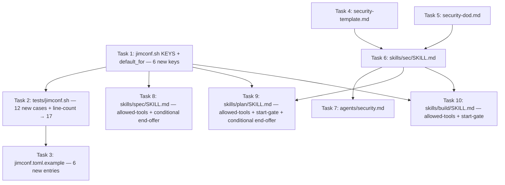

# Security Agent and Skill — Plan

## Overview

Build `@jim:security` and `/jim:sec` against current architecture (sentinel-form directive vocabulary, per-skill `allowed-tools` narrowing, `Skill(jim:<name>)` invocation), with workflow gates installed at the start of `/jim:plan` and `/jim:build` that block phase progression until the appropriate phase-level security review is on file. Six new `jimconf.toml` keys are introduced (`require_security`, `auto_security`, `require_security_loop`, `require_security_loop_sev`, `auto_security_loop_limit`, `security_adhoc_path`). Framework set at v1: STRIDE always; LINDDUN conditionally when data classification surfaces PII or personal data; CIA Triad deferred.

## Design Decisions

### 1. Config flag set — five value-keys plus one path-key

- **Chosen:** Five value-typed flags (`require_security`, `auto_security`, `require_security_loop`, `require_security_loop_sev`, `auto_security_loop_limit`) plus one path-typed key (`security_adhoc_path`). All registered in `jimconf.sh` `KEYS` and `default_for()`.
- **Why:** The developer's explicit specification during scoping. `require_*` family for hard-gate behavior (matches `require_pre_commit` / `require_pre_completion` semantics: workflow halts when not satisfied). `auto_*` family for behavior-modification of the require-style gate (matches `auto_arch_feedback` semantic: same gate, prompts suppressed). Loop modifiers (`_loop`, `_loop_sev`, `_loop_limit`) are scoped to the gate cycle.
- **Rejected:** A single `sec_mode = "off" | "require" | "auto" | "auto-loop"` value-key — would compress the 5-flag matrix into one but complicates downstream consumers (gate logic at `/jim:plan` and `/jim:build` must parse the enum and reconstitute the cases). The flat 5-flag shape is more aligned with existing `jimconf.toml` conventions and easier to test.

### 2. Phase-coverage indicator — frontmatter array + body coverage section (Insight 1 Option C)

- **Chosen:** Two-channel: `reviewed_phases: [spec, plan]` in `security.md` frontmatter (for deterministic gate parsing) AND a `## Coverage` section in the body listing each phase with its review date and lens applied (for human readability).
- **Why:** Gates at `/jim:plan` and `/jim:build` need a programmatically inspectable signal — the frontmatter array provides that with a deterministic `grep` or sed parse. The body section gives the developer a clear human-readable summary at the top of the artifact. Minor duplication is acceptable for the UX gain.
- **Rejected:** Frontmatter only (Insight 1 Option A) — gate-safe but loses human-readable surface. Body section only (Insight 1 Option B) — harder to parse deterministically from bash; gate logic would have to grep body markdown.

### 3. Lens-selection mechanism — auto-detect via artifact presence (Insight 2 Option A)

- **Chosen:** The skill globs the target directory for `spec.md` and `plan.md`; selects spec-phase / plan-phase / dual lens by presence.
- **Why:** Lowest friction. Works uniformly across gate-driven invocations from `/jim:plan` and `/jim:build`, manual invocation, and ad-hoc. No caller-passed mode argument needed.
- **Rejected:** Caller-passed mode argument (Insight 2 Option B) — requires every invocation path to thread a mode string; manual and ad-hoc invocations fall back to auto-detect anyway, making the explicit-mode option a hybrid in practice.

### 4. Advisory route destination — Option A (Spec or Plan like every severity)

- **Chosen:** All findings route to Spec or Plan regardless of severity. Advisory hardening lands at lower priority but in the same destination as Notable/Critical.
- **Why:** Consistent schema. Cleanly refactored when `/jim:backlog` ships (the backlog port will reroute Advisory as part of its own integration work).
- **Rejected:** Reserved `route: backlog` field with no current consumer (Insight 3 Option C) — forward-compat scaffolding flagged by the porting roadmap as anti-pattern. Advisory has no route (Insight 3 Option B) — schema inconsistency.

### 5. Framework set at v1 — STRIDE + LINDDUN; CIA deferred (Insight 8)

- **Chosen:** STRIDE runs on every target (Microsoft's canonical six). LINDDUN activates conditionally when data classification identifies PII, credentials, or session data (linddun.org's current seven).
- **Why:** STRIDE provides the systematic action-taxonomy baseline carried over from the fork brainstorm's framework comparison. LINDDUN closes STRIDE's privacy gap and activates organically via the data classification step. CIA's value is marginal until usage shows where STRIDE + LINDDUN miss things — defer with usage data.
- **Rejected:** All three at v1 — adds noise on simple targets. STRIDE-only — wastes the data classification signal.

### 6. Framework-selection mechanism — skill prose, not config (Insight 9 Option A)

- **Chosen:** Selection rules live in the skill body and `references/security-dod.md`. No `security_frameworks` config key.
- **Why:** `jimconf.toml` convention is paths and behavioral gates, not LLM-analytical-depth steering. Selection is artifact-driven (data classification → LINDDUN), not project-owner-driven.
- **Rejected:** Value-key config (Insight 9 Option B) — forward-compat scaffolding. Per-framework boolean flags (Insight 9 Option C) — scales poorly as the registry grows.

### 7. LINDDUN category naming — current linddun.org

- **Chosen:** Linking / Identifying / Non-repudiation / Detecting / Data Disclosure / Unawareness & Unintervenability / Non-compliance. Source cited in `references/security-dod.md`: `https://linddun.org/threat-types/`.
- **Why:** Maintained authoritative source (DistriNet, KU Leuven). The seventh category was extended from "Unawareness" to "Unawareness & Unintervenability" — meaningful change.
- **Rejected:** Older academic names from spec Insight 8 — outdated; risks drift.

### 8. `security_adhoc_path` — single path-typed key (Insight 5 Option A)

- **Chosen:** `security_adhoc_path` (default `"docs/security"`). Skill prompts conversationally at end of ad-hoc review for opt-in file write; no separate boolean.
- **Why:** Mirrors `debug_path` / `brainstorms_path` shape. The opt-in mechanism is the conversational prompt; no second knob needed.
- **Rejected:** Two-stage knob with separate boolean (Insight 5 Option C) — doubles config surface for no net behavioral gain.

### 9. Agent tool set — least privilege at v1 (no `Agent(researcher)`)

- **Chosen:** `@jim:security` tools = `[Read, Write, Edit, Glob, Grep]`.
- **Why:** No AC requires researcher spawning. Fork PR #5 included it but no current consumer.
- **Rejected:** `Agent(researcher)` for parity with fork — adds breadth without consumer.

### 10. `ARCHITECTURE.md` update — deferred to post-build `/jim:arch` feedback loop

- **Chosen:** No manual `ARCHITECTURE.md` task. Spec 013's post-build arch-feedback loop will refresh it after `/jim:build` completes.
- **Why:** Spec 013's loop is the canonical mechanism.
- **Rejected:** Manual update task — duplicates the automation.

### 11. Finding traceability — `Relates to:` field, conditional

- **Chosen:** Each finding optionally carries a `**Relates to:**` field; omitted when no applicable source can be cited.
- **Why:** Matches the spec's "where applicable" language (AC #4). Ad-hoc findings often don't have an AC to cite.
- **Rejected:** Mandatory field — forces trace fabrication on ad-hoc findings.

### 12. Loop defaults — conservative (Insight 11 Option A)

- **Chosen:** When `require_security_loop = "true"`:
  - If `require_security_loop_sev` is unset → default to `"critical"` (loop until no Critical-severity findings remain).
  - If `auto_security_loop_limit` is unset → default to `"5"` (iteration cap).
- **Why:** Conservative defaults prevent runaway loops while preserving the developer's intent ("enable looping"). Documented in `jimconf.toml.example` and surfaced via `/jim:conf list`. The default loop severity "critical" matches the strictest reasonable interpretation; the limit of 5 is enough for legitimate iterative refinement without burning compute on pathological cases.
- **Rejected:** Require both knobs when `_loop` is set (Insight 11 Option B) — highest config-write burden; less developer-friendly. Liberal defaults (no caps) — risks runaway loops.

### 13. Auto-routing mechanism in `auto_security` mode — direct Edit per finding (Insight 10 Option A)

- **Chosen:** When `auto_security = "true"`, the skill applies findings to spec.md or plan.md via direct Edit (one Edit per routable finding) — appending a new AC for spec-routed findings, a new task / decision for plan-routed findings, in the appropriate section.
- **Why:** The developer explicitly opted into "user out of the loop" — they accept the blast-radius trade-off in exchange for unattended gated workflow. Routing-journal-only (Insight 10 Option B) defers the actual route into a human-action queue, which arguably violates the "without per-finding prompts" promise. Direct Edit is the only realization that fully delivers the AC behavior.
- **Rejected:** Routing journal only (Option B) — doesn't deliver the auto-route promise; effectively reverts auto_security into "log findings, human acts later". Hybrid (Option C) — splits the model by severity, adding complexity without a clear UX win at v1.

### 14. Precedence when both `require_security` and `auto_security` are set — `auto_security` wins

- **Chosen:** When both `require_security = "true"` and `auto_security = "true"`, the workflow behaves as `auto_security` (routing automated; user out of loop). Precedence rule documented in `jimconf.toml.example`.
- **Why:** `auto_security` is the more aggressive setting. A developer who explicitly enabled both clearly wants the gated behavior; the question is only whether they want to be prompted for routing. Picking `auto_security` honours the more recent / more aggressive opt-in. No combination of the two should produce ambiguous behavior.
- **Rejected:** `require_security` wins (more conservative) — surprising for a developer who explicitly set `auto_security`. Halt with error on both-set — pointlessly punishes a probably-intentional configuration.

### 15. End-of-flow conversational offer is suppressed when gates are active

- **Chosen:** When `require_security = "true"` or `auto_security = "true"`, `/jim:spec`'s and `/jim:plan`'s end-of-flow conversational offers ("Want to run a security review before approving?") are suppressed. The gate at the next phase will handle the review.
- **Why:** Avoids double-prompting and double-running. With gates enabled, the developer's clear intent is "the next phase will enforce this" — offering at end of current phase creates noise without value.
- **Rejected:** Always-offer regardless of flags — confusing UX. Skip the gate when the developer ran the offer — couples the two systems and weakens the gate's guarantee.

### 16. Halt-error UX when loop limit reached

- **Chosen:** When `auto_security_loop_limit` is reached with findings still at or above `require_security_loop_sev`, the gate halts and prints a structured conversational error: one paragraph naming the unresolved findings (each with severity, title, route, and the finding's `Relates to:` source where applicable), one paragraph naming the gate that blocked, and one sentence suggesting either addressing the findings or adjusting `auto_security_loop_limit` / `require_security_loop_sev`. The skill exits non-zero so the calling phase (`/jim:plan` or `/jim:build`) halts cleanly.
- **Why:** Clear signposting per the AC requirement ("clear error message naming the unresolved findings"). Listing findings inline prevents the developer from having to dig into security.md; mentioning the config knobs provides a path forward if they decide the threshold is too strict.
- **Rejected:** Minimal error ("loop limit reached") — fails the AC's "clear error" requirement. Auto-relax the threshold — silently changes the developer's intended discipline.

## Constitution Check

**ARCHITECTURE.md status:** Present — constraints noted below.

| Constraint from ARCHITECTURE.md | Honored? | Notes |
| :--- | :--- | :--- |
| Sentinel-form directive vocabulary (SET + `IF != "NOT_FOUND"` / `IF == "true"`) | Yes | New skill body, /jim:spec end-offer block, /jim:plan gate + end-offer, /jim:build gate use this form exclusively |
| SKILL.md ≤ 500 lines | Yes | `skills/sec/SKILL.md` targets ≤ 500; methodology in `references/`, output format in `assets/` |
| Agent body ≤ 800 tokens | Yes | `agents/security.md` follows `pm.md` / `architect.md` shape |
| Per-skill `allowed-tools` narrowing (spec 012) | Yes | Every new / updated skill declares exact tokens; no wildcards |
| `Skill(jim:<name>)` permission token + Skill-tool invocation (specs 013, 015) | Yes | /jim:plan and /jim:build declare `Skill(jim:sec)`; matches `Skill(jim:arch)` and `Skill(jim:spec-check)` precedents |
| `$ARGUMENTS` non-auto-forward (spec 014 S3 probe) | Yes | /jim:plan and /jim:build pass spec directory path explicitly as `args` to `Skill(jim:sec)` |
| Flat TOML, double-quoted scalars only | Yes | All six new entries follow the form |
| `set -uo pipefail` in bash | Yes | jimconf.sh edits preserve the header |
| No `source` / `eval` of user data | Yes | Only KEYS / `default_for()` mutations |
| BASH_SOURCE-relative inter-script composition | Yes | No new inter-script composition |
| `require_*` / `auto_*` prefix dispatch family | Yes | Five new value keys resolve via existing dispatch at `jimconf.sh:93` without code change |
| First-invocation trust prompt (workspace-scoped per spec 014) | N/A | Documented behavior; one consent prompt on first `/jim:sec` invocation per workspace |
| No sensitive path writes | Yes | All writes are to `docs/specs/jim/016-sec/`, `skills/sec/`, `agents/security.md`, `jimconf.toml.example`, `tests/jimconf.sh`, `skills/spec/SKILL.md`, `skills/plan/SKILL.md`, `skills/build/SKILL.md`, `skills/conf/scripts/jimconf.sh` |

## File Manifest

| Component | File Path | Action | Notes |
| :--- | :--- | :--- | :--- |
| jimconf resolver | `skills/conf/scripts/jimconf.sh` | Update | Add six new CLI keys to the `KEYS` array at L42: `require_security`, `auto_security`, `require_security_loop`, `require_security_loop_sev`, `auto_security_loop_limit`, `security_adhoc`. Add six new `default_for()` arms at L48–63 returning `"false"`, `"false"`, `"false"`, `"critical"`, `"5"`, and `"docs/security"` respectively. |
| jimconf example | `jimconf.toml.example` | Update | Document all six new keys with comment headers following the existing `pre_commit_path` / `auto_arch_feedback` convention. Group together under a single "Security review gates and behavior" comment block. |
| jimconf tests | `tests/jimconf.sh` | Update | Add 12 new cases (`case_<key>_default` and `case_<key>_overridden` for each of the six new keys) following the shape at L241–288. Update the line-count assertion in `case_list_outputs_all_keys` at L109–128 from 11 to 17. |
| Security template | `skills/sec/assets/security-template.md` | Create | Output structure: frontmatter (spec / target field, `reviewed_phases:` array, status, date), severity summary header, data classification table, `## Coverage` body section, findings list, STRIDE coverage table, conditional LINDDUN coverage table, conditional artifact-misalignment section, routing recommendations |
| Security DoD | `skills/sec/references/security-dod.md` | Create | Validation checklist covering finding completeness (severity / description / suggestion / route, `Relates to:` where applicable), framework sweep coverage with N/A handling rules, data classification populated, `reviewed_phases:` populated correctly, ad-hoc no-default-write enforcement, framework source citations (STRIDE: Microsoft Learn; LINDDUN: linddun.org), auto-routing safety (only Edits to designated sections), halt-error format adherence |
| Security skill | `skills/sec/SKILL.md` | Create | Frontmatter with `allowed-tools` declaring both helper scripts; argument routing table; process steps (mode detection → read context → data classification → freeform expert review → STRIDE sweep → conditional LINDDUN sweep → artifact misalignment if dual lens → severity summary → output generation per mode → routing per mode — interactive in default/require, auto-Edit in auto → loop check (require_security_loop) → STOP); differential update path; halt-error generation when loop limit reached with unresolved findings; validation checklist linking to `references/security-dod.md` |
| Security agent | `agents/security.md` | Create | Frontmatter (name: security, description with 3 examples, skills: [sec], tools: [Read, Write, Edit, Glob, Grep], model: sonnet); body sections: role definition, context paths, core principles, analysis standards, process delegation, constraints. Token budget ≤ 800 |
| /jim:spec offer | `skills/spec/SKILL.md` | Update | Add `Bash(bash ${CLAUDE_PLUGIN_ROOT}/skills/conf/scripts/jimconf.sh *)` to `allowed-tools` at L10. Between Step 9 (Socratic self-check) and Step 10 (present and stop), insert a conditional offer block — show the conversational offer ONLY when both `require_security` and `auto_security` are `"false"`/unset. When either gate flag is set, skip the offer entirely (gate at `/jim:plan` handles it). No `Skill(jim:sec)` token needed; the developer manually runs `/jim:sec` if they accept the offer |
| /jim:plan gate + offer | `skills/plan/SKILL.md` | Update | Add `Skill(jim:sec)` and `Bash(bash ${CLAUDE_PLUGIN_ROOT}/skills/conf/scripts/jimconf.sh *)` to `allowed-tools` at L11. Insert a NEW Step 0 (or 1.5) — phase gate: read `require_security` and `auto_security`; if either is `"true"`, check the spec directory for `security.md` with `reviewed_phases:` including `spec`; if missing, invoke `Skill(jim:sec)` with the spec directory as args; if `security.md` still does not satisfy the gate after invocation (loop limit halt), exit non-zero with the halt-error block. Between Step 7 (DoD self-check) and Step 8 (present and stop), insert a conditional conversational offer block (same shape as `/jim:spec`'s) — show only when both flags are off |
| /jim:build gate | `skills/build/SKILL.md` | Update | Add `Skill(jim:sec)` and `Bash(bash ${CLAUDE_PLUGIN_ROOT}/skills/conf/scripts/jimconf.sh *)` to `allowed-tools`. Insert a NEW gate step early in the flow (after the plan-status gate, before the first task) — phase gate: read `require_security` and `auto_security`; if either is `"true"`, check the spec directory for `security.md` with `reviewed_phases:` including `plan`; if missing or incomplete, invoke `Skill(jim:sec)` with the spec directory as args; if still incomplete after invocation (loop limit halt), exit non-zero with the halt-error block |

## Interface Contracts

### Agent frontmatter (`agents/security.md`)

```yaml
---
name: security
description: >
  Security analyst for jim. Performs design-time security analysis of specs,
  plans, and arbitrary project files using a hybrid freeform expert review
  + STRIDE (with conditional LINDDUN on PII / personal-data targets) approach.
  Use when the user invokes /jim:sec, asks for a security review or threat
  model, when /jim:plan or /jim:build's gate invokes the review under
  require_security / auto_security, or when the user wants to check a spec or plan for
  security gaps before building. Do not use for runtime scanning, post-build
  code review (planned /jim:review), compliance audits, or code
  implementation.
  Examples:
  <example>...</example>
  <example>...</example>
  <example>...</example>
skills: [sec]
tools: [Read, Write, Edit, Glob, Grep]
model: sonnet
---
```

Three required example blocks: (a) direct invocation against a spec directory; (b) ad-hoc invocation against an arbitrary file; (c) negative example — request to build / implement, routed away to `/jim:build`.

### Skill frontmatter (`skills/sec/SKILL.md`)

```yaml
---
name: sec
description: >
  Perform design-time security analysis of specs, plans, or arbitrary project
  files. In spec-scoped mode, produces a security.md artifact alongside other
  spec artifacts; the artifact records which phases (spec, plan, or both) were
  covered so that downstream gates can verify coverage. In ad-hoc mode,
  delivers analysis in conversation by default with opt-in file output. Use
  when the user invokes /jim:sec, asks for a security review, threat model, or
  wants to check a spec or plan for security gaps; also invoked by /jim:plan
  and /jim:build's phase gates under require_security / auto_security. Do not use for
  runtime scanning, post-build code review (planned /jim:review), or
  compliance audits.
agent: security
argument-hint: "[spec-dir | file-path | directory]"
allowed-tools: Bash(bash ${CLAUDE_PLUGIN_ROOT}/skills/file/scripts/jimfile.sh *) Bash(bash ${CLAUDE_PLUGIN_ROOT}/skills/conf/scripts/jimconf.sh *)
---
```

### `security.md` frontmatter — spec-scoped mode

```yaml
---
spec: "{relative path to spec.md from project root}"
reviewed_phases: [spec]               # or [spec, plan] when plan-phase coverage added
status: "Active" | "Needs Spec Review" | "Needs Plan Review"
date: "{YYYY-MM-DD}"
---
```

`reviewed_phases` rules:

- An entry is present iff that phase's artifact (spec.md or plan.md) was actually analyzed in the most recent run.
- Order is `[spec]` → `[spec, plan]` as coverage accumulates. Removing coverage (e.g., re-running with only spec.md present after plan.md was deleted) drops the corresponding entry.
- Gate parsers read the field as a YAML inline array; entries are unquoted bare tokens.

`status` rules:

- `Active` — no Critical or Notable findings; all findings Advisory.
- `Needs Spec Review` — at least one Critical or Notable finding routes to Spec.
- `Needs Plan Review` — at least one Critical or Notable finding routes to Plan.

### `security.md` frontmatter — ad-hoc mode (opt-in file output only)

```yaml
---
target: "{relative path to reviewed file or directory from project root}"
status: "Active"
date: "{YYYY-MM-DD}"
---
```

`target` replaces `spec` per spec AC #22. The `reviewed_phases` field is omitted in ad-hoc mode (no phase semantics).

### `## Coverage` body section

```markdown
## Coverage

- spec.md — reviewed {YYYY-MM-DD} (requirements-gap lens)
- plan.md — reviewed {YYYY-MM-DD} (design-flaw lens)
```

Human-readable companion to the `reviewed_phases:` frontmatter. Entries appear in order they were added across re-runs.

### Finding structure (body of security.md / conversational output)

```markdown
### {N}. {Title}

- **Severity:** Critical | Notable | Advisory
- **Description:** {specific, not vague}
- **Suggestion:** {concrete actionable recommendation}
- **Route:** Spec | Plan
- **Relates to:** {AC #N | User Story #N | section name}
```

The `Relates to:` line is omitted when no applicable source can be cited (ad-hoc mode default). Findings are ordered Critical → Notable → Advisory.

### Severity summary header

```markdown
## Summary

**Findings:** {N_critical} Critical · {N_notable} Notable · {N_advisory} Advisory

{1–2 sentences: what was reviewed; lenses applied; frameworks marked N/A.}
```

### Data classification block

```markdown
## Data Classification

| Category | Present? | Notes |
| :--- | :--- | :--- |
| PII | Yes / No | {Specific fields if Yes} |
| Credentials | Yes / No | ... |
| Session data | Yes / No | ... |
| Internal-only | Yes / No | ... |
| Public | Yes / No | ... |
```

LINDDUN coverage section is included when any of PII / Credentials / Session data is `Yes`.

### STRIDE coverage table

Six rows: Spoofing / Tampering / Repudiation / Information Disclosure / Denial of Service / Elevation of Privilege. Each row: `Yes / No / N/A` and finding refs. Source citation: Microsoft Learn — Threat Modeling Tool threats (`https://learn.microsoft.com/en-us/azure/security/develop/threat-modeling-tool-threats`).

### LINDDUN coverage table (conditional)

Seven rows using current linddun.org naming: Linking / Identifying / Non-repudiation / Detecting / Data Disclosure / Unawareness & Unintervenability / Non-compliance. Each row: `Yes / No / N/A` and finding refs. Source citation: `https://linddun.org/threat-types/`.

### Artifact misalignment section (conditional)

Included only when both `spec.md` and `plan.md` exist in the target directory and are reviewed together.

```markdown
## Artifact Misalignment

- **Finding N — {Title}:** Spec states {X}; plan does {Y}. Route: Spec | Plan.
```

### Routing recommendations

```markdown
## Routing Recommendations

### Spec amendments
- {Finding N: suggested change}

### Plan amendments
- {Finding N: suggested change}
```

Empty destination sub-sections are removed. If no findings are routable: replace with `No routing required — all findings are informational.`

### Halt-error block format (loop limit reached with unresolved findings)

Emitted by `/jim:sec` to stdout when `require_security_loop = "true"` AND `auto_security_loop_limit` is reached AND there are findings at or above `require_security_loop_sev`:

```text
Security review gate cannot be satisfied:

Iteration limit ({N}) reached with the following unresolved findings at or
above severity "{S}":

- [{Severity}] {Title} (route: {Spec|Plan}; relates to: {ref}) — {Description}
- ...

Gate blocking: /jim:{plan|build}.

Address the findings (edit the spec or plan to resolve them) and re-run the
blocked phase, or relax the gate by adjusting `auto_security_loop_limit` or
`require_security_loop_sev` in jimconf.toml.
```

Skill exits non-zero. `/jim:plan` and `/jim:build` see the non-zero exit and halt their own flow.

### `jimconf.toml` entries (six new keys)

```toml
# --- Security review gates and behavior -----------------------------------

# Hard-gate security review at phase boundaries. When "true":
#   /jim:plan halts at its start until the spec has been reviewed
#   (security.md present with reviewed_phases including "spec").
#   /jim:build halts at its start until the plan has been reviewed
#   (security.md present with reviewed_phases including "plan").
# The gate produces the missing review by invoking /jim:sec; the developer
# remains in the loop for routing decisions. Default "false".
require_security            = "false"

# Same gate semantics as require_security, but findings are routed to spec.md
# or plan.md automatically without per-finding prompts. The developer is
# not interrupted during the gate cycle. If both require_security and auto_security
# are "true", auto_security takes precedence (the more aggressive setting).
# Default "false".
auto_security               = "false"

# Repeat the gated security-review-and-routing cycle until the configured
# severity threshold is clear (or the iteration limit is reached).
# Default "false".
require_security_loop       = "false"

# Severity threshold for the loop's exit condition. When require_security_loop
# is "true", the loop exits once no findings remain at or above this
# severity. Values: "critical" | "notable" | "advisory". Default "critical".
require_security_loop_sev   = "critical"

# Maximum iterations of the gated review-and-routing loop. When the limit
# is reached with findings still present at or above require_security_loop_sev,
# the workflow halts with an error listing the unresolved findings.
# Integer-as-string. Default "5".
auto_security_loop_limit    = "5"

# Default base directory for ad-hoc /jim:sec file output when the
# developer opts into writing findings during an ad-hoc review. The skill
# writes to {security_adhoc_path}/{YYYYMMDD}-{slug}.md when accepted.
# No file is written unless the developer accepts at the end-of-review
# prompt. Default "docs/security".
security_adhoc_path    = "docs/security"
```

### `/jim:spec` end-of-flow offer block (inserted between Step 9 and Step 10)

```text
### 10. Pre-approval security review offer (default mode only)

SET require_security = !`bash ${CLAUDE_PLUGIN_ROOT}/skills/conf/scripts/jimconf.sh get require_security`
SET auto_security    = !`bash ${CLAUDE_PLUGIN_ROOT}/skills/conf/scripts/jimconf.sh get auto_security`

IF require_security != "true" AND auto_security != "true" THEN
  Offer conversationally: "Want to run a security review before approving?
  (/jim:sec)" — if the developer accepts, run /jim:sec against the spec
  directory; otherwise proceed to the approval prompt. Findings, if produced,
  are advisory; the developer may approve regardless.
ENDIF
```

(Existing Step 10 renumbers to Step 11; Step 11 renumbers to Step 12. When `require_security` or `auto_security` is set, the offer is suppressed — the gate at `/jim:plan` will handle the review.)

### `/jim:plan` start-of-flow gate block (inserted as new Step 1.5 or before Step 1)

```text
### 1.5. Security review gate (require_security / auto_security)

SET require_security = !`bash ${CLAUDE_PLUGIN_ROOT}/skills/conf/scripts/jimconf.sh get require_security`
SET auto_security    = !`bash ${CLAUDE_PLUGIN_ROOT}/skills/conf/scripts/jimconf.sh get auto_security`

IF require_security == "true" OR auto_security == "true" THEN
  Check the spec directory for security.md whose `reviewed_phases:`
  frontmatter array includes "spec". If absent, invoke Skill(jim:sec) with
  the spec directory as args; the called skill reads require_security / auto_security
  itself and selects user-in-loop or auto-route behavior, runs the loop if
  require_security_loop is set, and writes/updates security.md. If the called
  skill exits with the halt-error block (loop limit reached with unresolved
  findings), surface the error to the developer and halt /jim:plan.
ENDIF
```

### `/jim:plan` end-of-flow offer block (inserted between Step 7 and Step 8)

```text
### 8. Pre-approval security review offer (default mode only)

SET require_security = !`bash ${CLAUDE_PLUGIN_ROOT}/skills/conf/scripts/jimconf.sh get require_security`
SET auto_security    = !`bash ${CLAUDE_PLUGIN_ROOT}/skills/conf/scripts/jimconf.sh get auto_security`

IF require_security != "true" AND auto_security != "true" THEN
  Offer conversationally: "Want to run a security review of this plan
  before approving? (/jim:sec)" — if the developer accepts, run /jim:sec
  against the spec directory (with plan.md now present, the dual lens
  applies); otherwise proceed to the approval prompt. Findings are advisory.
ENDIF
```

### `/jim:build` start-of-flow gate block (inserted after the existing plan-status gate)

```text
### 1.5. Security review gate (require_security / auto_security)

SET require_security = !`bash ${CLAUDE_PLUGIN_ROOT}/skills/conf/scripts/jimconf.sh get require_security`
SET auto_security    = !`bash ${CLAUDE_PLUGIN_ROOT}/skills/conf/scripts/jimconf.sh get auto_security`

IF require_security == "true" OR auto_security == "true" THEN
  Check the spec directory for security.md whose `reviewed_phases:`
  frontmatter array includes "plan". If absent or only the spec phase is
  recorded, invoke Skill(jim:sec) with the spec directory as args (the
  called skill detects plan.md, applies the dual lens, and adds "plan" to
  the reviewed_phases array). If the called skill exits with the
  halt-error block, surface the error and halt /jim:build before any
  task is executed.
ENDIF
```

### `tests/jimconf.sh` case templates

Twelve new cases (default + override for each of `require_security`, `auto_security`, `require_security_loop`, `require_security_loop_sev`, `auto_security_loop_limit`, `security_adhoc_path`). Pattern (one representative):

```bash
case_require_security_default() {
  local dir
  dir=$(empty_dir)
  capture cd "$dir" && bash "$SCRIPT" get require_security
  assert_eq "$OUT" "false" "default require_security"
  assert_eq "$RC" "0" "exit code"
}

case_require_security_overridden() {
  local dir
  dir=$(fixture 'require_security = "true"')
  capture bash "$SCRIPT" -c "$dir/jimconf.toml" get require_security
  assert_eq "$OUT" "true" "overridden require_security"
  assert_eq "$RC" "0" "exit code"
}
```

CLI keys vs TOML keys: the five flag/value keys map identically (CLI = TOML). The path-key follows the existing convention: CLI `security_adhoc` → TOML `security_adhoc_path`. The line-count assertion in `case_list_outputs_all_keys` (currently `11`) updates to `17`.

## Data Flow

Build order (dependency-ordered):



Runtime — gate at `/jim:plan` start:

```mermaid
sequenceDiagram
    participant DEV as Developer
    participant PLAN as /jim:plan
    participant CONF as jimconf.sh
    participant SEC as Skill(jim:sec)
    participant FS as Filesystem

    DEV->>PLAN: /jim:plan <spec>
    PLAN->>CONF: get require_security, auto_security
    CONF-->>PLAN: values
    alt require_security OR auto_security == "true"
        PLAN->>FS: read security.md frontmatter
        alt reviewed_phases lacks "spec"
            PLAN->>SEC: Skill(jim:sec) args=<spec-dir>
            SEC->>SEC: data classify → freeform → STRIDE [+ LINDDUN]
            SEC->>SEC: route findings (user-in-loop or auto-Edit)
            opt require_security_loop == "true"
                SEC->>SEC: loop until exit_sev clear or limit reached
                alt limit reached with findings still at threshold
                    SEC-->>PLAN: halt-error (non-zero exit)
                    PLAN-->>DEV: halt-error surfaced; /jim:plan stops
                end
            end
            SEC->>FS: write/update security.md (reviewed_phases includes "spec")
            SEC-->>PLAN: ok (zero exit)
        end
    end
    PLAN->>PLAN: continue with Steps 1+ (read spec, research, etc.)
```

Runtime — gate at `/jim:build` start:

```mermaid
sequenceDiagram
    participant DEV as Developer
    participant BUILD as /jim:build
    participant CONF as jimconf.sh
    participant SEC as Skill(jim:sec)
    participant FS as Filesystem

    DEV->>BUILD: /jim:build <spec>
    BUILD->>BUILD: plan-status gate (status: approved)
    BUILD->>CONF: get require_security, auto_security
    CONF-->>BUILD: values
    alt require_security OR auto_security == "true"
        BUILD->>FS: read security.md frontmatter
        alt reviewed_phases lacks "plan"
            BUILD->>SEC: Skill(jim:sec) args=<spec-dir>
            SEC->>SEC: plan-phase lens (or dual if spec also re-applied)
            SEC->>SEC: route + optional loop (same shape as plan gate)
            alt halt-error
                SEC-->>BUILD: halt-error
                BUILD-->>DEV: halt; no tasks executed
            end
            SEC->>FS: update security.md (reviewed_phases includes "plan")
        end
    end
    BUILD->>BUILD: begin task execution
```

### Workflow examples — `/jim:build` gate placement

The gate sits after the existing plan-status gate and before any task body. The following scenarios illustrate how it behaves across the matrix of config and artifact states.

**Scenario 1 — Default mode (neither flag set, gate skipped entirely)**

1. Developer runs `/jim:build docs/specs/jim/016-sec`.
2. Existing plan-status gate: `plan.md` is `status: approved` ✓.
3. New sec gate Step 1.5: reads `require_security = "false"`, `auto_security = "false"`.
4. Condition `require_security == "true" OR auto_security == "true"` is false → gate block is skipped entirely.
5. `/jim:build` proceeds to task execution. `/jim:sec` is never invoked.

The developer may have run `/jim:sec` manually beforehand; `/jim:build` neither checks nor cares in default mode.

**Scenario 2 — `require_security` set, plan-phase coverage already on file (happy path)**

1. Developer runs `/jim:build`.
2. Plan-status gate ✓.
3. Sec gate Step 1.5: reads `require_security = "true"`.
4. Reads `security.md` frontmatter: `reviewed_phases: [spec, plan]`.
5. Plan coverage present → gate passes without invoking `/jim:sec`.
6. `/jim:build` proceeds to task execution.

This is the steady-state happy path for a developer who has the gate enabled and has already addressed plan-phase findings in a prior cycle.

**Scenario 3 — `require_security` set, plan-phase coverage missing (developer in loop)**

1. Developer runs `/jim:build` against a spec whose `security.md` has `reviewed_phases: [spec]` only (spec was reviewed; plan is new since).
2. Plan-status gate ✓.
3. Sec gate Step 1.5: reads `require_security = "true"`.
4. Reads `security.md` frontmatter: `reviewed_phases: [spec]` — `plan` is missing.
5. Gate invokes `Skill(jim:sec)` with the spec directory as args.
6. `/jim:sec` detects both `spec.md` and `plan.md` are present → applies dual lens (artifact-misalignment findings possible).
7. `/jim:sec` produces, say, 2 Notable findings on the plan.
8. `require_security` mode → developer is prompted for routing decisions per finding (or a batched routing prompt).
9. Developer routes Finding 1 to plan.md (the architect to address during the next refinement), Finding 2 to spec.md (a missing AC).
10. `/jim:sec` updates `security.md`: `reviewed_phases: [spec, plan]`, appends the two new findings, updates the `## Coverage` body section.
11. `/jim:sec` exits 0; gate is satisfied.
12. `/jim:build` proceeds to task execution.

The developer participates in routing but doesn't have to manually invoke `/jim:sec`; the gate handles the invocation.

**Scenario 4 — `auto_security` set, missing coverage (developer out of loop)**

1. Developer runs `/jim:build` against a spec with no `security.md` at all.
2. Plan-status gate ✓.
3. Sec gate Step 1.5: reads `auto_security = "true"`.
4. `security.md` missing entirely → gate invokes `Skill(jim:sec)`.
5. `/jim:sec` runs dual-lens analysis: 1 Critical, 3 Notable, 2 Advisory findings.
6. `auto_security` mode → `/jim:sec` Edits spec.md and plan.md directly per finding (one Edit per routable finding into the appropriate section); no developer prompts.
7. `/jim:sec` writes `security.md` with `reviewed_phases: [spec, plan]` and records all findings in the artifact.
8. `require_security_loop` is false → no looping. `/jim:sec` exits 0; gate satisfied.
9. `/jim:build` proceeds to task execution.

The developer sees a summary in the conversational output (Critical-finding count highlighted) but is not interrupted with routing decisions.

**Scenario 5 — Loop hits the iteration limit with Critical findings unresolved**

1. Developer runs `/jim:build` with `auto_security = "true"`, `require_security_loop = "true"`, `require_security_loop_sev = "critical"`, `auto_security_loop_limit = "5"`.
2. Plan-status gate ✓; sec gate invokes `Skill(jim:sec)`.
3. Iteration 1: `/jim:sec` finds 3 Critical findings, auto-Edits spec/plan, updates security.md.
4. Iteration 2: re-analysis finds 2 Critical findings (one was resolved by the auto-route; the re-analysis surfaced an additional one when reading the updated artifacts).
5. Iteration 3: 2 Critical remain.
6. Iteration 4: 1 Critical remains.
7. Iteration 5: limit reached; 1 Critical finding still present.
8. `/jim:sec` emits the halt-error block (per Interface Contracts → Halt-error block format) listing the unresolved Critical finding with severity, title, route, and `Relates to:` source; names `/jim:build` as the blocking gate; suggests addressing the finding manually or relaxing `auto_security_loop_limit` / `require_security_loop_sev`.
9. `/jim:sec` exits non-zero.
10. `/jim:build` surfaces the halt-error to the developer and stops before any task body executes — no code is written.

The developer's recovery options: edit the spec/plan to address the Critical finding then re-run `/jim:build`; or relax the config knob if the threshold is too strict for the current iteration.

**Scenario 6 — Manual `/jim:sec` before `/jim:build` (gate is idempotent)**

1. Developer manually runs `/jim:sec docs/specs/jim/016-sec` before invoking `/jim:build`. `/jim:sec` writes `security.md` with `reviewed_phases: [spec, plan]`.
2. Developer runs `/jim:build`.
3. Plan-status gate ✓.
4. Sec gate Step 1.5: reads `require_security = "true"` (or `auto_security = "true"`).
5. Reads `security.md` → `reviewed_phases: [spec, plan]` ✓.
6. Gate passes without re-invoking `/jim:sec`.
7. `/jim:build` proceeds to task execution.

A developer who proactively runs `/jim:sec` doesn't trigger a second invocation when `/jim:build` runs. The gate's job is to ensure coverage exists, not to run `/jim:sec` unconditionally.

**Why this placement is correct**

- **After the plan-status gate, not before.** Running `/jim:sec` against an unapproved (`status: draft`) plan would waste work and produce a security review of artifacts still in flux. The plan-status gate filters those out cheaply.
- **Before any task body, not after.** Task bodies include code edits, commits, and pre-commit hook execution. The sec gate is cheap (read security.md frontmatter); failing after code has been written would mean the repo state diverges from the intended security discipline.
- **Distinct from the post-build `/jim:arch` feedback loop (spec 013).** The arch loop runs at the end of `/jim:build` to refresh ARCHITECTURE.md against completed work. The sec gate runs at the start to ensure security review precedes code. Different concerns, different timing.

## Task Breakdown

1. [x] **Register six new keys in `skills/conf/scripts/jimconf.sh`.** Add `require_security`, `auto_security`, `require_security_loop`, `require_security_loop_sev`, `auto_security_loop_limit`, `security_adhoc` to the `KEYS` array at L42; add six new arms in `default_for()` at L48–63 returning `"false"`, `"false"`, `"false"`, `"critical"`, `"5"`, `"docs/security"` respectively. Do not modify `resolve()` — `require_*` and `auto_*` are already dispatched at L93; `security_adhoc` maps to TOML `security_adhoc_path` via the default `${cli_key}_path` rule.
   **Verify:** `bash skills/conf/scripts/jimconf.sh get require_security` outputs `false`; `bash skills/conf/scripts/jimconf.sh get auto_security_loop_limit` outputs `5`; `bash skills/conf/scripts/jimconf.sh get security_adhoc` outputs `docs/security`; `bash skills/conf/scripts/jimconf.sh list | wc -l` outputs `17`.

2. [x] **Add 12 test cases to `tests/jimconf.sh`.** Append `case_<key>_default` and `case_<key>_overridden` pairs for all six new keys, following the case template in Interface Contracts. Update `case_list_outputs_all_keys` line-count assertion from `11` to `17`.
   **Verify:** `bash tests/jimconf.sh` exits 0; `grep -c "^case_" tests/jimconf.sh` shows count increased by 12.

3. [x] **Document six new keys in `jimconf.toml.example`.** Append all six entries under a single "Security review gates and behavior" comment block, matching the format in Interface Contracts.
   **Verify:** `for k in require_security auto_security require_security_loop require_security_loop_sev auto_security_loop_limit security_adhoc_path; do grep -q "^${k}" jimconf.toml.example || { echo "missing ${k}"; exit 1; }; done`.

4. [x] **Create `skills/sec/assets/security-template.md`.** Author per Interface Contracts: frontmatter with spec/target field + `reviewed_phases:` array, severity summary header, data classification block, `## Coverage` body section, findings list, STRIDE coverage table, conditional LINDDUN coverage table, conditional artifact misalignment section, routing recommendations.
   **Verify:** `test -f skills/sec/assets/security-template.md && grep -q "reviewed_phases" skills/sec/assets/security-template.md && grep -q "## Coverage" skills/sec/assets/security-template.md`.

5. [x] **Create `skills/sec/references/security-dod.md`.** Author the DoD checklist per Interface Contracts. Cite framework sources (Microsoft Learn for STRIDE; linddun.org for LINDDUN). Include auto-routing safety rules (Edits only to designated AC / task / decision sections) and halt-error format adherence.
   **Verify:** `test -f skills/sec/references/security-dod.md && grep -q "linddun.org" skills/sec/references/security-dod.md && grep -q "learn.microsoft.com" skills/sec/references/security-dod.md && grep -q "reviewed_phases" skills/sec/references/security-dod.md`.

6. [x] **Create `skills/sec/SKILL.md`.** Author per Interface Contracts: frontmatter (name: sec, agent: security, argument-hint, allowed-tools); argument routing table (spec-dir → spec-scoped, other path → ad-hoc, empty → ask); process steps (mode detection via Glob → read context (ARCHITECTURE.md + target) → data classification → freeform expert review → STRIDE sweep → conditional LINDDUN sweep when classification surfaces PII / credentials / session data → artifact misalignment if dual lens → severity summary → write security.md with `reviewed_phases:` updated → routing (in-loop default/require OR auto-Edit when auto_security) → loop check (if `require_security_loop`: repeat until `require_security_loop_sev` clear or `auto_security_loop_limit` reached → halt-error if limit reached with findings still present) → routing offer (default/require mode only) → STOP); differential update path; halt-error generation per Interface Contracts; validation checklist linking to `references/security-dod.md`.
   **Verify:** `test -f skills/sec/SKILL.md && grep -q "^name: sec$" skills/sec/SKILL.md && grep -q "agent: security" skills/sec/SKILL.md && grep -q "reviewed_phases" skills/sec/SKILL.md && [ "$(wc -l < skills/sec/SKILL.md)" -le 500 ]`.

7. [x] **Create `agents/security.md`.** Author per Interface Contracts: frontmatter (name: security, description with 3 examples — spec-scoped, ad-hoc, negative; skills: [sec]; tools: [Read, Write, Edit, Glob, Grep]; model: sonnet); body with role definition (1 sentence), context paths, core principles, analysis standards (freeform first, systematic second, advisory by default but blocking when require_security/auto_security set), process delegation to `/jim:sec`, constraints (no code writes, no spec/plan modifications outside the auto-routing mechanism, no SAST). Body ≤ 800 tokens.
   **Verify:** `test -f agents/security.md && grep -q "^name: security$" agents/security.md && ! grep -q "Agent(researcher)" agents/security.md && [ "$(wc -w < agents/security.md)" -le 800 ]`.

8. [x] **Update `skills/spec/SKILL.md`.** At L10, add `Bash(bash ${CLAUDE_PLUGIN_ROOT}/skills/conf/scripts/jimconf.sh *)` to the `allowed-tools` line (no `Skill(jim:sec)` needed; the offer is conversational only). Between Step 9 (Socratic self-check) and Step 10 (present and stop), insert the end-of-flow offer block per Interface Contracts — gated to default mode only (when both `require_security` and `auto_security` are not `"true"`). Renumber subsequent steps.
   **Verify:** `grep -q "jimconf.sh" skills/spec/SKILL.md && grep -q "require_security" skills/spec/SKILL.md && ! grep -q "Skill(jim:sec)" skills/spec/SKILL.md`.

9. [x] **Update `skills/plan/SKILL.md`.** At L11, add `Skill(jim:sec)` and `Bash(bash ${CLAUDE_PLUGIN_ROOT}/skills/conf/scripts/jimconf.sh *)` to the `allowed-tools` line. Insert a new gate step at the start (after the existing spec-status gate, before any other work) — phase gate per Interface Contracts, checking `reviewed_phases:` for `spec` and invoking `Skill(jim:sec)` when missing. Between Step 7 (DoD self-check) and Step 8 (present and stop), insert the conditional end-of-flow offer block (same shape as `/jim:spec`'s). Renumber subsequent steps.
   **Verify:** `grep -q "Skill(jim:sec)" skills/plan/SKILL.md && grep -q "require_security" skills/plan/SKILL.md && grep -q "reviewed_phases" skills/plan/SKILL.md && grep -q "jimconf.sh" skills/plan/SKILL.md`.

10. [x] **Update `skills/build/SKILL.md`.** Add `Skill(jim:sec)` and `Bash(bash ${CLAUDE_PLUGIN_ROOT}/skills/conf/scripts/jimconf.sh *)` to the `allowed-tools` frontmatter line. Insert a new gate step early in the flow (after the existing plan-status gate, before the first task is executed) — phase gate per Interface Contracts, checking `reviewed_phases:` for `plan` and invoking `Skill(jim:sec)` when missing.
    **Verify:** `grep -q "Skill(jim:sec)" skills/build/SKILL.md && grep -q "require_security" skills/build/SKILL.md && grep -q "reviewed_phases" skills/build/SKILL.md`.

## Requirements Coverage Summary

| Spec Acceptance Criterion | Addressed In Task(s) |
| :--- | :--- |
| AC1: spec-scoped artifact produced, findings ordered by severity | 4, 6 |
| AC2: one-line severity summary opens the artifact | 4, 6 |
| AC3: each finding has severity / description / suggestion / route (Spec or Plan) | 4, 5, 6 |
| AC4: each finding cites the related AC / US / section where applicable | 4, 5, 6 |
| AC5: lens by artifacts present (requirements-gap / design-flaw / both) | 6 |
| AC6: artifact misalignment surfaced explicitly when both spec and plan reviewed | 4, 6 |
| AC7: graceful degradation when only one of spec or plan present | 6 |
| AC8: explicit data classification step that informs threat-category relevance | 4, 5, 6 |
| AC9: freeform expert review + systematic sweeps (framework-plural, N/A explicit) | 4, 5, 6 |
| AC10: architecture-grounded findings (reads `ARCHITECTURE.md`) | 6 |
| AC11: re-run preserves untouched sections; surfaces change summary | 6 |
| AC12: re-run presents conversational delta (new / resolved / unchanged) | 6 |
| AC13: artifact records which phases (spec / plan / both) were covered; programmatically inspectable | 4, 5, 6, 9, 10 |
| AC14: default mode — conversational offer at end of /jim:spec and /jim:plan; findings advisory; no hard-block | 8, 9 |
| AC15: require-security-review gates phase progression (`/jim:plan` blocks on spec coverage; `/jim:build` blocks on plan coverage); developer in loop for routing | 1, 9, 10 |
| AC16: auto-security-review gates apply; findings auto-routed without per-finding prompts | 1, 6, 9, 10 |
| AC17: loop repeats review-and-routing cycle; exits on severity clear or limit; halts with error when limit reached with findings at threshold | 1, 6 |
| AC18: critical findings highlighted prominently in any conversational summary | 6, 9, 10 |
| AC19: `/jim:sec` invocable at any time independent of workflow | 6 |
| AC20: ad-hoc analysis delivers in conversation by default, no file written | 6 |
| AC21: ad-hoc opt-in write to a configurable location | 1, 3, 6 |
| AC22: ad-hoc file output uses same finding structure as spec-scoped (only target field differs) | 4, 6 |
| AC23: end-of-review routing — developer chooses in default/require, automatic in auto mode | 6 |
| AC24: skill stops after producing findings and routing; never auto-modifies outside the routing mechanism | 5, 6, 7 |

## Out of Scope

- CIA Triad / Parkerian Hexad framework sweep — deferred to a follow-on per Decision 5. Insight 8's "opt-in closing-pass" remains a tracked extension point.
- `Agent(researcher)` permission on `@jim:security` — least privilege at v1 per Decision 9.
- `jimfile.sh path security <topic>` subcommand for collision-resolved ad-hoc output paths — skill constructs the path inline using `jimfile.sh date` + `jimfile.sh slug`.
- Manual `ARCHITECTURE.md` update — deferred to the post-build `/jim:arch` feedback loop (spec 013).
- Backlog routing (third route option) — out of scope per spec; ships with `/jim:backlog` port (next item in the porting roadmap).
- Framework-selection config knob (`security_frameworks` value-key) — out of scope per Decision 6 and spec Insight 9 / Open Question 3.
- Hybrid auto-routing (Critical → direct Edit, Advisory → routing journal) — Decision 13 commits to direct Edit for all severities at v1; the hybrid model is a documented follow-on if usage shows blast-radius concerns.
- Time-based loop exit conditions — only severity threshold and iteration count, per spec Out of Scope.
- Per-finding loop control — global loop only, per spec Out of Scope.

## Open Questions

- [x] ~~Flag naming convention~~ → **Resolved.** Standardized on the long-form `security_*` topic anchor while preserving existing `require_*` / `auto_*` family-prefix dispatch: `require_security`, `auto_security`, `require_security_loop`, `require_security_loop_sev`, `auto_security_loop_limit`, plus `security_adhoc_path`. Topical grep (`grep "security" jimconf.toml`) finds all six entries; family-prefix dispatch in `resolve()` is unchanged. (Insight 1 / namespace discussion — Option C selected.)
- [x] ~~Loop defaults~~ → **Resolved.** `require_security_loop_sev = "critical"` and `auto_security_loop_limit = "5"` (Decision 12).
- [x] ~~Auto-routing blast radius~~ → **Noted.** Decision 13 stands: direct Edit per finding in `auto_security` mode at v1. Hybrid model (Critical → Edit, lower severities → routing journal) remains a tracked Out-of-Scope follow-on if usage shows the blast radius is too aggressive.
- [x] ~~`/jim:build` gate placement~~ → **Resolved.** Validated by the Workflow examples section in Data Flow (six scenarios spanning happy path, missing coverage, auto-route, loop halt, and idempotent manual-`/jim:sec` flows). Gate sits after the existing plan-status gate and before any task body executes.
