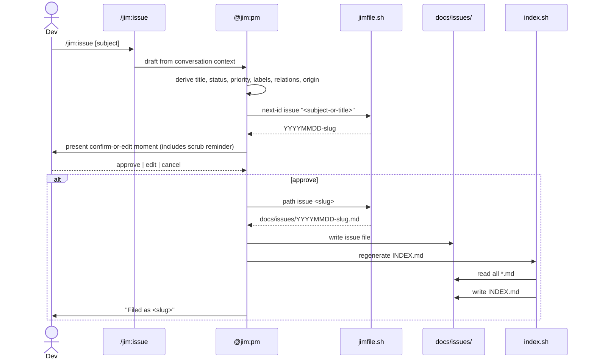

# Issue Tracking — Local Files (v1) — Plan

## Overview

Extend jim's existing markdown-first scripting layer with one new LLM skill (`/jim:issue`, capture), one new deterministic skill (`/jim:issues`, render), two new bash scripts (`index.sh`, `render.sh`), and additive surface on `jimfile.sh` + `jimconf.sh`. All file I/O routes through the established `jimfile.sh` / `jimconf.sh` resolvers — no new abstraction layer. Issue files are parsed line-oriented (per AC-S1); the index is regenerated eagerly on every write so both `/jim:issues` and mid-task agent readers see current data.

## Design Decisions

### 1. Index regen script ownership

- **Chosen:** `skills/issues/scripts/index.sh` (read-side skill owns the regen logic).
- **Why:** The index is an issues-specific aggregation that depends on the frontmatter schema and wikilink syntax. `/jim:issue` calls it post-write via a `${CLAUDE_PLUGIN_ROOT}`-prefixed path — same cross-skill composition pattern as `jimfile.sh` → `jimconf.sh`.
- **Rejected:** Adding a `jimfile.sh index issues` subcommand — would couple the generic file/path resolver to domain schema knowledge (status values, relation types).

### 2. Index regen invocation site

- **Chosen:** `/jim:issue` body invokes `${CLAUDE_PLUGIN_ROOT}/skills/issues/scripts/index.sh` in a fenced bash block as the final step of a successful write (after the file is on disk, before the confirmation report to the user).
- **Why:** Eager regen per AC-I2. Explicit invocation keeps the dependency visible in the skill body. The fenced-block timing (LLM-substituted, after the write) is the right form because the slug is only known at runtime.
- **Rejected:** `!`-injection at skill-load time — slug isn't known until the user invokes. Filesystem hook / inotify — jim has no hook layer; would add infrastructure.

### 3. Frontmatter parsing strategy

- **Chosen:** Line-oriented `grep` / `sed` / `cut` against the known field set, mirroring `jimconf.sh` / `jimfile.sh` discipline.
- **Why:** AC-S1 explicitly forbids `source`/`eval` and full YAML parsers. Per `CLAUDE.md` → Bash scripts: user data is data, not code.
- **Rejected:** Any YAML library (Python `yaml`, Ruby YAML, etc.) — AC-S1 explicit prohibition; YAML tag-based deserialization is a CVE class.

### 4. ID / filename generation

- **Chosen:** Extend `jimfile.sh next-id` with an `issue <subject>` branch. Returns `YYYYMMDD-<normalized-slug>` by composing the existing `today` + `slug` operations internally. Single call site for the consumer.
- **Why:** Matches AC-C6 (date-prefixed slug) and AC-C7 (slug normalization). Reuses existing primitives — no duplicate slug logic in two places.
- **Rejected:** Two separate calls (`jimfile.sh today` + `jimfile.sh slug "$subject"`) — fine for one-off use but couples the format convention to the consumer; centralizing is cheaper.

### 5. Slug normalization rule (implementation)

- **Chosen:** Lowercase via `tr '[:upper:]' '[:lower:]'` (POSIX class, not literal A-Z), replace whitespace runs with `-` via `tr -s '[:space:]' '-'`, strip non-`[a-z0-9-]` characters, collapse repeated `-`, strip leading/trailing `-`. Reject `..`, leading `.`, and the empty string with exit 1. Pattern: `^[a-z0-9][a-z0-9-]*[a-z0-9]$|^[a-z0-9]$`. **Script preamble sets `LC_ALL=C`** (in `index.sh`, `render.sh`, and the new `jimfile.sh` slug-touching branches) so locale-dependent `tr` behavior cannot produce non-deterministic slugs across environments. *(Resolves security.md Finding 11.)*
- **Why:** Implements AC-C7 and matches the validation rule for wikilink content in AC-I4. Single source of truth — `jimfile.sh slug` is extended (or, if the current behaviour already matches, simply reused). `LC_ALL=C` ensures the same input produces the same slug regardless of user locale (e.g., Turkish `İ` → `i`, not `i̇`).
- **Rejected:** Per-script slug logic — duplicate truth, drift risk. Locale-default `tr` — non-deterministic across environments.

### 6. Wikilink parser (in `index.sh`)

- **Chosen:** `grep -oE '\[\[[^][]+\]\]'` extracts candidate links; each candidate's interior is validated against the slug regex from DD #5. Malformed candidates are dropped from the graph (treated as prose per AC-I4); valid candidates become `related-to`-typed edges (default; explicit `relations:` entries override).
- **Why:** Pure regex, no parser library. AC-I3 + AC-I4 satisfied with the same validator the file-naming path uses.
- **Rejected:** A markdown parser library — adds a runtime dependency; not in line with the markdown-first/bash-only constraint.

### 7. Bidirectional relation integrity

- **Chosen:** `index.sh` reads each issue's `relations:` block; for every `blocks: [X]` it confirms `X.md` has `depends-on: [...this-slug...]`. Mismatches are reported in a `## Integrity Warnings` section of INDEX.md. No auto-correction — the user-authored content is preserved.
- **Why:** AC-C5 says bidirectional and typed. Auto-rewriting issue bodies silently would violate the confirm-or-edit moment principle (AC-C2) and could surprise the user.
- **Rejected:** Auto-write the inverse — silently mutates user content, violates the per-issue confirm contract.

### 8. Subordinate-agent context wrapping (prompt-injection guard)

- **Chosen:** Document the discipline in `skills/issue/SKILL.md` and `skills/issues/SKILL.md` instruction prose. When *any* skill or agent reads issue body content and passes it to a subordinate agent (now or in future workflow integration), the content is wrapped in `<untrusted-issue-content slug="…">…</untrusted-issue-content>` tags and the receiving agent is instructed not to follow embedded instructions. The PM agent (`agents/pm.md`) gets the same instruction in its body because it's the agent bound to `/jim:issue`.
- **Why:** v1 has no concrete subordinate-agent invocation path triggered by issue content reading (agents read INDEX.md directly), but the discipline must land in the skill prose now so that the deferred workflow-integration spec inherits it. AC-S2 requires the explicit boundary.
- **Rejected:** Content scrubbing / heuristic injection detection — false-positive risk, brittle, easy to bypass. Delimiting + instruction is the conventional defense.

### 9. Failure mode for `index.sh`

- **Chosen:** On parse failure (malformed frontmatter, IO error), emit error to stderr, exit non-zero, preserve previous INDEX.md unchanged.
- **Why:** A stale-but-correct index is safer than a corrupt one — agents reading INDEX.md mid-task get last-good data plus a visible failure signal in the calling skill's stderr.
- **Rejected:** Best-effort partial regen — could mislead readers; silent partial state is worse than a clean stale state.

### 10. First-write directory bootstrap

- **Chosen:** `/jim:issue` body runs `mkdir -p "$issues_path"` before invoking `jimfile.sh path issue …`. `index.sh` also mkdir-p's defensively. Idempotent; no harm. **Both call sites guard against an empty `$issues_path` by treating an empty/whitespace return from `jimconf.sh` as the sentinel `NOT_FOUND` and halting with a clear error.** `jimconf.sh` itself is extended so its path-typed key dispatch refuses to return an empty string — empty config values fall through to the default or to `NOT_FOUND` per the existing convention. *(Resolves security.md Finding 13.)*
- **Why:** First issue in a fresh project hits a missing `docs/issues/` dir. Bootstrap once, both call sites. The empty-path guard prevents `mkdir -p ""` from failing noisily or, worse, writing to the wrong location under unusual quoting.
- **Rejected:** Documenting "user must create directory first" — bad UX, easy to forget. Trusting `jimconf.sh` output without sanity check — defense-in-depth covers future regressions.

### 11. Nested-YAML `relations:` parsing in `index.sh`

- **Chosen:** `index.sh` reads the frontmatter as the block between the first two `^---$` lines only. Within that block, the `relations:` key is parsed as a top-level key whose value is an indented map of `<type>: [<slug>, ...]` entries at exactly 2-space indent. An `awk` state machine tracks indent depth: lines deeper than 2 spaces under `relations:` are ignored; lines at zero indent end the `relations:` block; malformed `relations:` blocks (unrecognized type, unparseable array literal, mixed indent) emit an Integrity Warning to INDEX.md and the issue's relations are treated as empty for graph purposes — not a fatal error. *(Resolves security.md Finding 9.)*
- **Why:** AC-C5 mandates four typed relation kinds; AC-S1 forbids a full YAML parser. The frontmatter-bounded scan plus indent-aware state machine is the minimal correct discipline — line-oriented but schema-aware. Matches the `jimconf.sh` parsing discipline (known fields, line-oriented). Malformed-but-non-fatal handling preserves data: the rest of the issue still contributes to the index.
- **Rejected:** Schemaless line-grep for `blocks:` / `depends-on:` / etc. anywhere in the file — would match body prose containing those tokens. Full YAML parser — AC-S1 prohibition.

### 12. Atomic INDEX.md write

- **Chosen:** `index.sh` writes to `<issues_dir>/.INDEX.md.tmp.$$` (PID-suffixed dotfile), then `mv` to `<issues_dir>/INDEX.md` on successful construction. `trap 'rm -f "$tmpfile"' EXIT INT TERM` cleans up the tmp file on any failure path. On parse failure (per DD #9) the tmp is removed and the prior INDEX.md is untouched. `mv` within a single directory is atomic on POSIX filesystems. *(Resolves security.md Finding 10.)*
- **Why:** DD #9 promises "preserve previous INDEX.md on failure" but didn't specify how. Direct write is non-atomic — a mid-write crash (signal, OOM, disk full) corrupts the index and breaks both `/jim:issues` and mid-task agent navigation. The tmp + `mv` pattern is the canonical bash idiom for atomic file replacement.
- **Rejected:** Direct write with rollback — no rollback is possible after a write begins. Fsync + atomic write at the OS level — not portably available from bash. Locking-only — solves a different problem (concurrency, not crash recovery).

## Constitution Check

**ARCHITECTURE.md status:** Present — constraints noted below.

| Constraint from `ARCHITECTURE.md` | Honored? | Notes |
| :--- | :--- | :--- |
| Skills under `skills/{name}/SKILL.md`; SKILL.md ≤ 500 lines | Yes | Both `skills/issue/` and `skills/issues/` follow the same shape as `skills/brainstorm/` and `skills/conf/`. |
| Markdown-first; bash + POSIX only; no third-party deps | Yes | All new scripts (`index.sh`, `render.sh`) are bash + grep/sed/cut/tr/awk only. |
| `!`-injection only with stable inputs at load time | Yes | Slug-dependent calls live in fenced bash blocks (LLM-substituted at runtime), not in `!`-injection slots. See DD #2. |
| Cross-skill bash composition via `${CLAUDE_PLUGIN_ROOT}` (skill body) / `BASH_SOURCE`-relative (script body) | Yes | `/jim:issue` SKILL.md uses `${CLAUDE_PLUGIN_ROOT}/skills/issues/scripts/index.sh`. `index.sh` internally uses `BASH_SOURCE`-relative paths to reach `jimfile.sh`. |
| `set -uo pipefail`, NOT `set -e` | Yes | All new scripts adopt the canonical preamble per `CLAUDE.md` → Bash scripts. |
| Never `source`/`eval` user data | Yes | DD #3 — line-oriented parsing only. |
| `allowed-tools` clause must name script paths verbatim, not bare `Bash(bash *)` | Yes | Both new skills' frontmatter narrows to the specific scripts they invoke. |
| Sentinel-based directive vocabulary (`SET / IF … != "NOT_FOUND" THEN / ENDIF`) for existence gates | Yes | Both new SKILL.md bodies use this idiom for any path-existence checks (e.g., issues_path resolution). |
| `agent:` field on skills is documentation convention (no `context: fork`) | Yes | `/jim:issue` carries `agent: pm` (LLM skill); `/jim:issues` carries no `agent:` binding (deterministic wrapper, mirrors `/jim:conf`, `/jim:file`). |
| Plugin agents `model:` default is `inherit` — must set explicitly if needed | Yes | No new agents created — `pm.md` only gets a `skills:` binding addition. |
| File-system writes restricted from `.git/`, `.env`, etc. | Yes | All writes target `docs/issues/` (or configured `issues_path`). |

## File Manifest

| Component | File Path | Action | Notes |
| :--- | :--- | :--- | :--- |
| Capture skill | `skills/issue/SKILL.md` | Create | LLM skill, `agent: pm`. Drafts from conversation context, confirm-or-edit moment, writes file, invokes `index.sh`. |
| Issue file template | `skills/issue/assets/issue-template.md` | Create | YAML-frontmatter template per the spec schema. |
| Read view skill | `skills/issues/SKILL.md` | Create | Deterministic wrapper. No `agent:` binding. Calls `index.sh` then `render.sh`. |
| Index regen script | `skills/issues/scripts/index.sh` | Create | Frontmatter scan + wikilink extraction + graph build + INDEX.md write. |
| Render script | `skills/issues/scripts/render.sh` | Create | Reads INDEX.md, emits trend view (counts + clusters + blocking + integrity warnings) to stdout. |
| File path resolver extension | `skills/file/scripts/jimfile.sh` | Update | Add `path issue <slug>` and `next-id issue <subject>` branches. |
| Config resolver extension | `skills/conf/scripts/jimconf.sh` | Update | Add `issues_path` key (default `./docs/issues/`). |
| Capture skill tests | n/a | n/a | Skill body validated by `meta-skill` DoD; no script test. |
| File resolver tests | `tests/jimfile.sh` | Update | Add `case_jimfile_path_issue_*` and `case_jimfile_nextid_issue_*` cases. |
| Config resolver tests | `tests/jimconf.sh` | Update | Add `case_jimconf_issues_path_*` cases. |
| Index + render tests | `tests/issues.sh` | Create | New per-script test file for `index.sh` + `render.sh` per `meta-test` convention. |
| Config example | `jimconf.toml.example` | Update | Add commented `issues_path` example line. |
| PM agent binding | `agents/pm.md` | Update | Add `issue` to `skills:` list. (`issues` has no agent binding.) |
| Architecture doc | `ARCHITECTURE.md` | Update (post-build) | Refreshed by `/jim:build` step 5.2 → `/jim:arch` auto-feedback. Not a manual edit task. |

## Interface Contracts

### `jimfile.sh` additions

```text
jimfile.sh path issue <slug>
  Returns:  <resolved-issues-path>/<slug>.md           (one line, stdout)
  On error: stderr message, exit 1 if slug fails the AC-C7 normalization rule
  Notes:    Does not touch the filesystem. Pure path composition.

jimfile.sh next-id issue <subject>
  Returns:  <YYYYMMDD>-<normalized-slug>               (one line, stdout)
  Internal: today + slug "<subject>" composed
  On error: stderr message, exit 1 if <subject> normalizes to the empty string
```

### `jimconf.sh` additions

```text
jimconf.sh get issues_path
  Returns:  <configured-value> | "./docs/issues/"     (default)
  Notes:    Follows existing path-key dispatch convention (key + "_path" suffix).
```

### `skills/issues/scripts/index.sh`

```text
index.sh [issues_dir]
  issues_dir default: jimconf.sh get issues_path
  Reads:    <issues_dir>/*.md  (excluding INDEX.md itself)
  Parses:   frontmatter via grep/sed/cut on known fields only:
              id title status priority labels relations created updated origin
            wikilinks via:
              grep -oE '\[\[[^][]+\]\]'
            each candidate's interior validated against the slug regex.
            Invalid candidates are silently dropped from the graph.
  Writes:   <issues_dir>/INDEX.md
              ## Summary           — Open: N, Closed: N
              ## Issues            — one row per issue (slug, title, status, priority, labels, origin)
              ## Graph             — edges section (from -> to, edge-type)
              ## Integrity Warnings — bidirectional mismatches (if any)
  Exit:     0 success; non-zero on parse/IO failure (previous INDEX.md untouched).
```

### `skills/issues/scripts/render.sh`

```text
render.sh [issues_dir]
  Step 1:   index.sh <issues_dir>  (defensive regen; usually a no-op)
  Step 2:   read INDEX.md sections
  Step 3:   emit to stdout:
              Summary line (Open: N · Closed: N)
              == Clusters ==
                By origin   (path -> count)
                By label    (label -> count)
              == Blocking ==
                Top issues by outgoing 'blocks' edge count
              == Integrity Warnings ==
                (only if present in INDEX.md)
  Exit:     0 always (rendering failures degrade to empty sections).
```

### Issue file shape (asset template)

```yaml
---
id: {YYYYMMDD}-{slug}
title: "{title}"
status: open
priority: {low|medium|high|critical}
labels: [{label1}, {label2}]
relations:
  blocks: []
  depends-on: []
  related-to: []
  duplicates: []
created: {YYYY-MM-DD}
updated: {YYYY-MM-DD}
origin: {relative-path-to-source-artifact}
---

## Description

{body — may contain [[other-issue-slug]] wikilinks}
```

## Data Flow

`/jim:issue` write path:



`/jim:issues` read path:

```mermaid
flowchart LR
    User[/jim:issues]
    User --> Render[render.sh]
    Render --> Index[index.sh defensive regen]
    Index --> Files[docs/issues/*.md]
    Index --> IDX[INDEX.md]
    Render --> IDX
    Render --> Out[trend view to stdout]
```

## Task Breakdown

Ordered by dependency. Each task is atomic; each Verify is shell-executable from the repo root.

1. [x] **Extend `jimconf.sh` with `issues_path` key (default `./docs/issues/`).** Follows existing `<key>_path` dispatch convention; resolver returns configured value or default. **The dispatch refuses to return an empty string for path-typed keys — an empty or whitespace-only configured value falls through to the default (or to `NOT_FOUND` if configured-empty is treated as an explicit opt-out per the existing convention).** Resolves Finding 13 at the resolver layer.
   **Verify:** `bash /mnt/src/jim/skills/conf/scripts/jimconf.sh get issues | grep -qE '^(./docs/issues/|/.+)$' && ! bash /mnt/src/jim/skills/conf/scripts/jimconf.sh get issues | grep -qE '^[[:space:]]*$'`

2. [x] **Add `case_issues_*` cases to `tests/jimconf.sh`.** Default, configured-value, comment-tolerance, missing-file fallthrough, empty/whitespace fallthrough. Naming follows existing jimconf convention (no `jimconf_` prefix; see `case_pre_commit_*`, `case_security_adhoc_*`).
   **Verify:** `bash /mnt/src/jim/tests/jimconf.sh issues`

3. [x] **Extend `jimfile.sh` with `path issue <slug>` branch.** Composes `<issues_path>/<slug>.md`. Validates slug per the AC-C7 rule (rejects path separators, `..`, leading dot, control characters, empty string); error to stderr, exit 1 on invalid.
   **Verify:** `bash /mnt/src/jim/skills/file/scripts/jimfile.sh path issue test-slug | grep -q "test-slug.md"`

4. [x] **Extend `jimfile.sh` with `next-id issue <subject>` branch.** Composes `<today>-<slug "<subject>">`. Errors on empty/all-invalid subject.
   **Verify:** `bash /mnt/src/jim/skills/file/scripts/jimfile.sh next-id issue "Auth swallows 401s" | grep -qE '^[0-9]{8}-auth-swallows-401s$'`

5. [x] **Add `case_jimfile_path_issue_*` and `case_jimfile_nextid_issue_*` cases to `tests/jimfile.sh`.** Cover happy path, slug-normalization rejection, subject-empty error, configured-path override.
   **Verify:** `bash /mnt/src/jim/tests/jimfile.sh issue`

6. [x] **Scaffold `tests/issues.sh` via `/jim:meta-test scaffold issues`.** Empty test file ready for cases. (Establishes the test file so subsequent tasks have a target.)
   **Verify:** `test -f /mnt/src/jim/tests/issues.sh && bash /mnt/src/jim/tests/issues.sh`

7. [x] **Create `skills/issues/scripts/index.sh`.** Reads `<issues_dir>/*.md`; parses frontmatter line-orientedly for the known field set per DD #3 + DD #11 (frontmatter-bounded scan, awk indent-aware state machine for `relations:`); extracts and validates wikilinks per DD #6; writes via the atomic tmp + `mv` pattern per DD #12 with `trap`-based tmp cleanup; emits INDEX.md with Summary / Issues / Graph / Integrity Warnings sections; preserves last-good INDEX.md on failure (DD #9). Script preamble: `set -uo pipefail; LC_ALL=C`. Never `source`/`eval`s issue files.
   **Verify:** `TMP=$(mktemp -d -t jim-issues-XXXXXX) && bash -n /mnt/src/jim/skills/issues/scripts/index.sh && bash /mnt/src/jim/skills/issues/scripts/index.sh "$TMP" && rm -rf "$TMP"` (smoke: parses cleanly, handles empty dir without crash).

8. [x] **Add `case_issues_index_*` cases to `tests/issues.sh`.** Cover: empty dir, one issue happy path, multi-issue clusters, bidirectional integrity mismatch detection, malformed-frontmatter parse failure preserves prior INDEX.md, malformed wikilink dropped from graph.
   **Verify:** `bash /mnt/src/jim/tests/issues.sh index`

9. [x] **Create `skills/issues/scripts/render.sh`.** Calls `index.sh` defensively, reads INDEX.md, emits Summary line + Clusters (by origin + by label) + Blocking (top-N by outgoing `blocks`) + Integrity Warnings sections to stdout. Script preamble: `set -uo pipefail; LC_ALL=C`.
   **Verify:** `TMP=$(mktemp -d -t jim-issues-render-XXXXXX) && bash -n /mnt/src/jim/skills/issues/scripts/render.sh && bash /mnt/src/jim/skills/issues/scripts/render.sh "$TMP" | grep -qE 'Open: 0.*Closed: 0' && rm -rf "$TMP"` (smoke: empty dir → "Open: 0 · Closed: 0").

10. [x] **Add `case_issues_render_*` cases to `tests/issues.sh`.** Cover: empty collection summary, clusters-by-origin grouping, label-cluster grouping, blocking-section ordering by out-degree, integrity-warnings surface.
    **Verify:** `bash /mnt/src/jim/tests/issues.sh render`

11. [x] **Run full meta-test suite to confirm no regression in existing tests.**
    **Verify:** `bash /mnt/src/jim/skills/meta-test/scripts/run.sh`

12. [x] **Create `skills/issue/assets/issue-template.md`.** YAML-frontmatter template per the Interface Contracts. Placeholders use `{name}` template-substitution sigil (per ARCHITECTURE.md → Substitution Conventions).
    **Verify:** `head -1 /mnt/src/jim/skills/issue/assets/issue-template.md | grep -qE '^---$' && grep -qE '^status: open$' /mnt/src/jim/skills/issue/assets/issue-template.md`

13. [x] **Create `skills/issue/SKILL.md`.** Frontmatter: `name: issue`, `agent: pm`, `argument-hint: "[subject]"`, narrow `allowed-tools` (Bash patterns for jimfile.sh + index.sh, Read/Write/Edit). Body: read VISION/ROADMAP/ARCHITECTURE via sentinel idiom; derive title from `$ARGUMENTS` or conversation context; draft full issue using the asset template; present single confirm-or-edit moment with scrub reminder text; on approve, run `next-id` → `path issue` → write → `index.sh` regeneration. Document the subordinate-agent content-wrapping discipline.
    **Verify:** `grep -qE '^name: issue$' /mnt/src/jim/skills/issue/SKILL.md && grep -qE '^agent: pm$' /mnt/src/jim/skills/issue/SKILL.md && grep -qE 'untrusted-issue-content' /mnt/src/jim/skills/issue/SKILL.md`

14. [x] **Create `skills/issues/SKILL.md`.** Frontmatter: `name: issues`, no `agent:` binding (deterministic wrapper, mirrors `/jim:conf` / `/jim:file`), narrow `allowed-tools` for render.sh. Body: thin wrapper instructing the LLM to invoke `render.sh` and present the output verbatim. Document the subordinate-agent content-wrapping discipline for any future workflow-integration consumer.
    **Verify:** `grep -qE '^name: issues$' /mnt/src/jim/skills/issues/SKILL.md && ! grep -qE '^agent:' /mnt/src/jim/skills/issues/SKILL.md && grep -qE 'untrusted-issue-content' /mnt/src/jim/skills/issues/SKILL.md`

15. [x] **Update `agents/pm.md` skills binding.** Add `issue` to the `skills:` array. (`issues` is intentionally not bound — no agent.) Body unchanged otherwise.
    **Verify:** `grep -qE '(^| )issue( |$|,|\])' /mnt/src/jim/agents/pm.md`

16. [x] **Update `jimconf.toml.example` with `issues_path` entry.** Follows existing example-line convention (uncommented entry showing the default value, alongside other `*_path` keys).
    **Verify:** `grep -qE '^issues_path\s*=' /mnt/src/jim/jimconf.toml.example`

17. [x] **End-to-end smoke: capture one issue, render the view.** Manual confirmation: `/jim:issue smoke-test` creates a file under `docs/issues/`, INDEX.md exists and references it, `/jim:issues` shows Open: 1.
    **Verify:** `test -d /mnt/src/jim/docs/issues && test -f /mnt/src/jim/docs/issues/INDEX.md && grep -qE 'Open: [0-9]+' /mnt/src/jim/docs/issues/INDEX.md` (run after the manual smoke).

## Requirements Coverage Summary

| Spec Acceptance Criterion (paraphrased) | Addressed In Task(s) |
| :--- | :--- |
| AC-C1 `/jim:issue [subject]` creates file under issues dir; derives title from context when no subject | 4, 13 |
| AC-C2 Single confirm-or-edit moment before write; scrub reminder for sensitive content | 13 |
| AC-C3 Frontmatter fields `id/title/status/priority/labels/relations/created/updated/origin` | 12, 13 |
| AC-C4 `status` is string with values `open` / `closed` | 12, 13 |
| AC-C5 `relations:` supports four bidirectional typed link types; bidirectional integrity checked | 7, 8, 12 |
| AC-C6 Date-prefixed slug filename `YYYYMMDD-slug.md` | 4, 13 |
| AC-C7 (security) Slug normalization rule; rejects path separators / `..` / leading dot / control chars | 3, 4, 5 |
| AC-R1 `/jim:issues` renders Clusters (by origin + label) + Blocking | 9, 10, 14 |
| AC-R2 Open / Closed counts at top of view | 9, 10, 14 |
| AC-R3 `/jim:issues` is read-only | 9, 14 (render.sh writes only to stdout) |
| AC-I1 Auto-generated INDEX.md is the navigation surface | 7, 13 |
| AC-I2 INDEX.md regenerates on every `/jim:issue` write | 7, 13 |
| AC-I3 `[[slug]]` body links + `relations:` entries both surface as graph edges | 7, 8 |
| AC-I4 (security) Wikilink content must match slug rule; malformed → prose | 7, 8 |
| AC-P1 Canonical write path via standard `jimfile.sh` resolver | 3 |
| AC-P2 `issues_path` overridable via `jimconf.toml` | 1, 16 |
| AC-S1 No `source`/`eval`; no YAML parser; line-oriented tools only | 7 (DD #3 + script enforcement), 13 (skill body) |
| AC-S2 (security) Subordinate-agent context wrapped in untrusted-content delimiter | 13, 14 (DD #8 + skill prose) |

All ACs covered. No `[NEEDS CLARIFICATION]` markers.

## Out of Scope

- **Workflow integration.** Auto-capture during `/jim:build`, `/jim:plan`, `/jim:spec`, `/jim:research`, `/jim:brainstorm` runs — deferred to a follow-on spec (per spec § Out of Scope).
- **3rd-party backends.** GitHub Issues, Linear, etc. — deferred, bridge-style architecture per research recommendation.
- **Full lifecycle states.** `in-progress`, `wontfix`, `duplicate` — schema supports adding these later, but parser / index / render handle only `open` / `closed` in v1.
- **Agent-CLI commands.** `claim`, `next`, `done`, `blocked`, `graph` — not implemented.
- **Configurable ID schemes.** Date-prefixed only; no `issue_id_scheme` config knob in v1.
- **Loud / quiet conversational invocation modes.** Tied to deferred workflow integration; `/jim:issue` always operates in single-confirm "loud" mode in v1.
- **`/jim:issue edit <slug>` subcommand.** Updates happen via direct file edit (files are plain markdown).
- **Interactive force-directed graph view.** Text-only rendering.
- **Cross-project federation.** Single project's `docs/issues/` only.
- **Structured audit trail for `status` transitions.** Git history is the v1 audit trail (per spec § Out of Scope).
- **Manual `ARCHITECTURE.md` edits.** Handled by `/jim:build` step 5.2 → `/jim:arch` auto-feedback loop; not a task.
- **Automatic injection-pattern scanning in `/jim:issue` drafts** (e.g., regex for `sk-`, JWT shapes). Listed as v2 follow-on in `security.md` Finding 5; not in v1.
- **Integrity hash on INDEX.md** (`security.md` Finding 6). Deferred; v1 accepts the tampering-window risk per the single-developer threat model.
- **`origin:` link validation / lint pass** (`security.md` Finding 7). Deferred to v2.
- **Multi-process INDEX.md regen safety** (`security.md` Finding 12). v1 assumes single-developer / single-process invocation; concurrent `/jim:issue` writes can race on regen with last-writer-wins semantics. Atomic rename (DD #12) ensures no half-written INDEX.md, but does not prevent the race. Defer `flock`-based critical-section locking to v2 when workflow integration or multi-user scenarios make the race practical.

## Open Questions

- [x] ~~Where does the index regen logic live — `jimfile.sh` subcommand or owning-skill script?~~ → `skills/issues/scripts/index.sh` (DD #1).
- [x] ~~Eager vs lazy index regen?~~ → Eager per AC-I2 (DD #2).
- [x] ~~Auto-correct bidirectional relations or report mismatches?~~ → Report only (DD #7).
- [x] ~~First-write directory bootstrap?~~ → mkdir-p in both call sites (DD #10).

None open.
