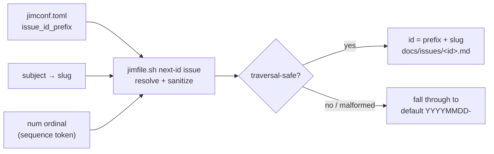

# 021 Configurable issue-id prefix

## Overview
Makes the prefix segment of an issue id (today the hard-coded `YYYYMMDD-`) configurable through `jimconf.toml` — via named presets plus a custom template escape hatch — so developers can match issue naming to their workflow while the date prefix stays the zero-config default.

## Problem Statement
Every issue jim files is named `YYYYMMDD-<slug>`, with the date prefix hard-coded in one fixed format. That is a one-size-fits-all default, and it does not fit everyone. A developer who thinks in sequential ticket numbers wants `NNNN-…`; a developer moving toward a multi-project tracker wants a static project tag in front of every id; a developer running parallel work across git worktrees wants a sub-day-resolution timestamp so issues created minutes apart do not collide; a developer with a house date convention just wants a different date format. None of this is reachable today without editing jim's code, so the issue collection's naming is dictated by jim rather than by the team using it.

## User Stories
- As a developer who thinks in sequential ticket numbers, I can configure a numeric prefix so my issues read like `0042-wire-consumers` instead of a date.
- As a developer integrating with a multi-project tracker, I can prepend a static project tag so every issue id carries its project namespace.
- As a developer running parallel work in git worktrees, I can choose a higher-resolution timestamp prefix so issues filed close together do not collide.
- As a developer with a house date convention, I can change the date format without touching jim's code.
- As a developer who is happy with the current naming, I keep getting `YYYYMMDD-` with no configuration at all.

## Acceptance Criteria
- [ ] With no `issue_id_*` configuration present, new issue ids are exactly `YYYYMMDD-<slug>` — byte-identical to today's behavior. Zero-config is preserved.
- [ ] The prefix scheme is selectable in `jimconf.toml` through named presets covering the common cases (at minimum: a date preset — the default — a sequential preset, a static-project-tag preset, and a sub-day `timestamp` preset), plus a custom template escape hatch for combinations the presets do not cover.
- [ ] The configuration can produce each of these prefix shapes without modifying jim's code: (a) a zero-padded sequential number; (b) a static project tag; (c) a sub-day-resolution timestamp; (d) a date in an alternative format.
- [ ] In the sequential scheme, the numeric prefix is the issue's display ordinal (`num`) rendered zero-padded — the same number, not a second counter. `num` remains a frontmatter field on every issue regardless of the active scheme.
- [ ] Changing the prefix configuration affects only newly-created issues. Existing issue ids are never rewritten, and a collection holding ids from multiple schemes stays fully functional — `list`, `stats`, `show`, the index, and `relations` / `[[wikilinks]]` all resolve mixed-scheme ids.
- [ ] When two resolved ids would collide (a static project tag with a repeated slug, or two same-day same-slug ids), the existing numeric discriminator (`-2`, `-3`, …) still applies so filing always succeeds.
- [ ] The resolved prefix is constrained to a bounded **allowlist** — ASCII letters, digits, `.`, `_`, and `-`, with no leading `.` or `-` and no `..` run — broader than the slug's lowercase-alnum-dash set (so `JIM`, `2026.06.13`, and a `T` time separator are preserved verbatim) but still a positive allowlist, not a denylist of forbidden characters. This guarantees a resolved prefix can never escape the issues directory and can never be parsed as a flag by downstream tooling, and it applies to the prefix from every source — preset, `issue_id_project` tag, or `{date:…}` / template expansion. A configuration that resolves to characters outside the allowlist is treated as malformed config (AC #8): the prefix is never written as-is.
- [ ] A present-but-malformed prefix configuration — an unparseable template or an unknown preset name — is never applied silently. jim surfaces a notice that the configured prefix is invalid and was not used, then falls back to the default `YYYYMMDD-` scheme so filing still succeeds; the developer is never left believing a malformed scheme took effect.
- [ ] A missing, empty, or whitespace-only prefix configuration falls through to the default `YYYYMMDD-` scheme silently — an absent or blank key is zero-config, not an error. *External Constraint — sourced from `ARCHITECTURE.md` jimconf `resolve()` convention (trims whitespace, all-whitespace → documented default; missing keys fall through).*
- [ ] The prefix is resolved by jim's deterministic path layer in bash, not composed by the LLM. *External Constraint — sourced from `CLAUDE.md` ("Never `source` or `eval` user-supplied data") and `skills/file/scripts/jimfile.sh` implementation note ("Slug pipeline is the security boundary — never delegate to the LLM").*
- [ ] The resolved prefix is length-bounded so the full filename (`prefix` + `slug` + `.md`) stays within filesystem limits (≈255 bytes); a prefix or template expansion that exceeds the bound is treated as malformed config (AC #8) — the notice is surfaced and the default scheme is used — rather than silently truncated into a different id.

## UI Mockup
```
# jimconf.toml

# (no config)  → date prefix, unchanged default
#   docs/issues/20260613-wire-consumers.md     num: 42

# Preset: sequential   prefix = num, zero-padded (Option A)
issue_id_prefix = "sequential"
#   docs/issues/0042-wire-consumers.md         num: 42

# Preset: project      static tag + companion value
issue_id_prefix  = "project"
issue_id_project = "JIM"
#   docs/issues/JIM-wire-consumers.md          num: 42

# Preset: timestamp    sub-day resolution
issue_id_prefix = "timestamp"
#   docs/issues/20260613T144530-wire-consumers.md

# Template escape hatch — compose your own
issue_id_prefix = "{date:%Y%m%dT%H%M%S}"          # sub-day resolution
#   docs/issues/20260613T144530-wire-consumers.md
issue_id_prefix = "{date:%Y.%m.%d}"               # alternative date format
#   docs/issues/2026.06.13-wire-consumers.md
issue_id_prefix = "JIM-{date:%Y%m%d}-{seq:03}"    # project + date + ordinal
#   docs/issues/JIM-20260613-042-wire-consumers.md
```

## Data Flow


## Out of Scope
- **Git commit-trailer format.** The `Issue:` trailer is defined by the developer's own `CLAUDE.md` commit conventions, not by jim — out of scope here.
- **Migration of existing ids.** Forward-only: jim never re-derives or rewrites already-filed issue ids when the scheme changes. A one-shot re-derivation command is a separate future concern.
- **The slug and the `.md` extension.** Only the leading prefix segment is configurable; the human-readable slug pipeline and the file extension are unchanged.
- **`num`'s own semantics.** `num` remains the decentralized, worktree-duplicate-tolerant display ordinal from spec 019. The sequential scheme *projects* it into the id; it does not change how `num` is computed.
- **Multi-project tracker integration itself.** The project-tag prefix is naming that *enables* future integration; building the integration (sync, push, external IDs) is not part of this spec.
- **A write surface for the config.** Consistent with all jim configuration, developers edit `jimconf.toml` directly; `/jim:conf` stays read-only and grows no setter.
- **Special-casing read views for the new prefix.** `list` / `stats` / `show` / `INDEX.md` consume ids as opaque strings; no new prefix-aware columns, sorting, or grouping.

## Research & Architecture Handoff

*Implementation insights surfaced during scoping. These are context for the architect — not requirements, not exclusions. Treat each as a starting point to evaluate, not a directive.*

### Insight 1: Configuration surface — preset keys plus a template grammar

- **Relates to AC:** *"selectable … through named presets … plus a custom template escape hatch"* (AC #2) and *"each of these prefix shapes"* (AC #3).
- **Surfaced as:** the developer chose "presets + template escape hatch" and previewed concrete syntax — `issue_id_prefix = "sequential"`, `issue_id_prefix = "{date:%Y%m%d}-{seq:03}"`, a companion `issue_id_project = "JIM"`.
- **Levelled-up requirement (already in the ACs):** a configuration surface that covers the common cases simply and arbitrary combinations flexibly.
- **Deflection reason:** Delegation — the exact jimconf key name(s), the preset name set, and the template token grammar are the architect's call.
- **Architect note:** Likely a new bare-name jimconf key `issue_id_prefix` (preset name *or* template string, dispatched by whether it matches a known preset) with a companion `issue_id_project` for the static tag. Token grammar candidates: `{date:<strftime>}` and `{seq:<width>}` plus literal text. A strftime passthrough is convenient but the format string is data fed to `date +…`; validate it rather than trusting it. Keep the preset/template dispatch inside the existing `resolve()` convention so missing/blank keys fall through to the date default. Preset name set to cover: `date` (default), `sequential`, `project`, `timestamp`. A *present-but-malformed* template or unknown preset must not fall through silently (AC #8) — surface a notice and use the default; that is distinct from the silent zero-config fallthrough for absent/blank keys (AC #9).
- **Routing hint:** Architect to decide.

### Insight 2: Sequential prefix needs the ordinal at id-resolution time

- **Relates to AC:** *"the numeric prefix is the issue's display ordinal (`num`) rendered zero-padded"* (AC #4).
- **Surfaced as:** Option A was chosen deliberately over an independent counter — the sequential prefix is `num` projected into the id, not a second number that can drift.
- **Levelled-up requirement (already in the ACs):** one number, shown in both the `num` field and (in sequential mode) the id; no divergence.
- **Deflection reason:** Delegation — *where* the projection happens is a mechanism. Today `jimfile.sh next-id issue` computes the slug/date and `next-num issue` computes the ordinal as separate calls; the sequence token needs the ordinal at id-resolution time.
- **Architect note:** Decide whether `next-id issue` learns to render the configured scheme (calling the same ordinal computation `next-num` uses) so the whole id is produced in one deterministic place, versus composing the id skill-side from two script calls. The single-resolver route keeps the security boundary (below) in one spot. Note the read-time consequence: `show 42` already resolves the ordinal independently, so a sequential id and `num` agreeing is a property to preserve, not re-derive.
- **Routing hint:** Architect to decide.

### Insight 3: Prefix resolution and sanitization stay in the bash boundary

- **Relates to AC:** the prefix-safety ACs (AC #7 allowlist, AC #11 length bound) and the deterministic-resolution External Constraint (AC #10).
- **Surfaced as:** the prefix becomes part of a filename, so it inherits the same path-traversal exposure the slug pipeline already guards in `jimfile.sh` (`normalize_slug`, `is_valid_slug`).
- **Levelled-up requirement (already in the ACs):** a configured prefix can never escape the issues directory; resolution is deterministic, not LLM-composed.
- **Deflection reason:** Constraint-Sourcing — the "never delegate the security boundary to the LLM" rule is sourced to `CLAUDE.md` and the `jimfile.sh` implementation notes; *how* to extend the existing guard is the mechanism.
- **Architect note:** Extend the existing `jimfile.sh` slug/charset guard rather than adding a parallel sanitizer. The prefix uses a *bounded allowlist* — broader than the slug's lowercase-alnum-dash set so the developer's chosen examples (uppercase `JIM`, dotted dates, the `T` separator) are preserved verbatim, but still a positive allowlist (ASCII letters/digits + `.` `_` `-`, no leading `.`/`-`, no `..`), not a denylist of forbidden characters. Pair it with the length bound (AC #11) so `prefix + slug` stays within filename limits; characters outside the allowlist or an over-length expansion route to the malformed-config notice (AC #8), not a silent rewrite.
- **Routing hint:** Architect to decide.

## Open Questions
- [x] ~Permitted prefix charset within the no-traversal boundary~ → Preserve the configured prefix verbatim (case, dots, separators) for characters within the AC #7 bounded allowlist; characters outside it are rejected via the malformed-config notice (AC #8), not normalized through the slug pipeline.
- [x] ~Notice on fallback~ → No silent fallback for a *malformed* prefix: jim informs the developer the configured prefix was invalid (AC #8). Absent/blank keys still fall through silently as zero-config (AC #9).
- [x] ~`timestamp` as a named preset vs. template-only~ → Include a named `timestamp` (sub-day resolution) preset, alongside the `{date:…}` template form.
