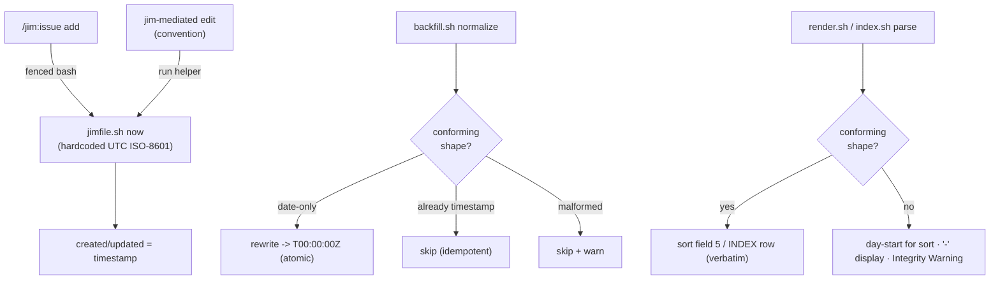

# Second-resolution timestamps for issue created/updated — Plan

## Overview

Add a deterministic `jimfile.sh now` helper (UTC ISO-8601, hardcoded format) that
stamps `created`/`updated`; extend `backfill.sh` with an opt-in `normalize`
subcommand for legacy date-only values; and add a shape-validating guard at the
two frontmatter-parsing sites so malformed timestamps can never corrupt the
`list` view or `INDEX.md`. Existing date-only collections render and sort
byte-identically — the only mixed-collection cost is cosmetic column misalignment.

## Design Decisions

### 1. New `now` subcommand on `jimfile.sh`, not an option on `date`

- **Chosen:** A zero-argument `now_utc_iso8601()` helper aliased as a `now` CLI subcommand, mirroring `today_yyyymmdd()` / `cmd_date` (research L15–16, L19).
- **Why:** One deterministic source of truth feeds both `add`-time stamping and the `updated`-on-edit refresh; the established helper→`cmd_`→`main()` dispatch pattern carries zero design risk.
- **Rejected:** A flag on the existing `date` subcommand — overloads one command with two output shapes and invites the flag becoming a format passthrough, the exact data→command surface Finding F2 forbids.

### 2. Helper format is a hardcoded literal — never config-driven (Finding F2)

- **Chosen:** `date -u +%Y-%m-%dT%H:%M:%SZ` written as a literal in the function body; the helper takes no argument and never touches `render_template()` / `resolve_issue_prefix()`'s `date +"$fmt"` path (research L17, L76).
- **Why:** Spec 021 deliberately bounded the one place config reaches `date +"$fmt"`. A clock helper has no reason to accept a format, so closing that door is free.
- **Rejected:** Sharing `render_template` — reintroduces a user-controllable format string with no benefit.

### 3. Stamping moves from the LLM into bash (AC #2)

- **Chosen:** The `/jim:issue add` flow obtains `created`/`updated` from `jimfile.sh now` (consumed in a fenced bash block exactly as `next-id`/`next-num` are); the template placeholders become `{YYYY-MM-DDThh:mm:ssZ}`.
- **Why:** The model cannot produce an accurate wall-clock second; determinism is a machine concern (ARCHITECTURE → Bash-vs-Prompt Rule).
- **Rejected:** LLM writes the ISO string — non-deterministic, can't know the second.

### 4. Normalization is a `normalize` subcommand on `backfill.sh` (AC #5, Finding F3)

- **Chosen:** Extend `backfill.sh` with `normalize [<dir>]`; the bare/`<dir>` form keeps its existing `num`-assignment behavior unchanged. Normalization reuses the per-file `mktemp + awk + mv` rewrite, the idempotency skip, and the announcement style verbatim (research L42–46).
- **Why:** `backfill.sh` already is jim's one-shot, idempotent, announced, atomic migration — F3's requirements are met by its existing structure; spec Insight 2 directed reusing it. Defaulting to the old behavior preserves the existing `bash backfill.sh <dir>` callers and tests (AC #6).
- **Rejected:** A separate script — duplicates the migration scaffolding; making `num`-assignment a required subcommand — breaks existing invocations.

### 5. Malformed-value guard is a purpose-named shape check copied at the parse sites under a SYNC guard — `is_valid_id` is untouched (AC #8, Finding F6)

- **Chosen:** Validate `created`/`updated` against the canonical shape (see Interface Contracts) at `render.sh::read_issue_rows`, `index.sh::parse_scalar_fields`, and `backfill.sh normalize`; degrade non-conforming values deterministically (day-start date prefix for sort, `-` for display, Integrity Warning for the index, skip-with-warning for normalize) and never let a raw value carrying a tab/control char enter the TSV or an `INDEX.md` row. The check is copied identically at each site under a `# SYNC:` comment and protected by a triplicate-identical guard test — the same discipline `is_valid_id` already uses (Finding F6).
- **Why:** These frontmatter values are author-editable and untrusted; an embedded tab shifts TSV columns. The three scripts run standalone and cannot share a sourced definition, so the established jim answer is copy + `# SYNC:` comment + a byte-identical guard test, which closes the drift risk Finding F6 raised.
- **Rejected:** Extending `is_valid_id()` — it is the id-charset allowlist mirrored byte-identically across three scripts under its own SYNC contract (research L18, L38); overloading it for a different field's shape pollutes that contract. Three unguarded inline copies — invites silent drift between sites (Finding F6).

### 6. `updated`-on-edit is a documented convention, not a script (AC #7)

- **Chosen:** Document in `skills/issue/SKILL.md` (agent edit guidance): when an issue is modified through jim's tooling, refresh `updated` by running `jimfile.sh now` and writing the result into the frontmatter.
- **Why:** Editing is judgment (prompt layer per Bash-vs-Prompt); only the timestamp value is deterministic (the helper). Checklist-validated, not unit-tested — degrades gracefully on out-of-band edits.
- **Rejected:** A mutation verb or commit hook — deferred per spec Out of Scope.

### 7. Keep the `list` `date` column width unchanged (AC #6)

- **Chosen:** Leave `format_row()`'s `%-12s` for the `date` column as-is. POSIX `printf` min-width does not truncate, so a 20-char timestamp prints in full; only inter-column alignment suffers in views that mix date-only and timestamp rows.
- **Why:** Widening the column would add trailing/inter-column whitespace to **every** row, changing the rendered output (and breaking existing render assertions) for purely date-only collections — a direct AC #6 violation. Keeping the width byte-preserves legacy output while timestamps still display fully (AC #1) and still sort correctly (AC #4 is a sort property, independent of column width).
- **Rejected:** Widen to ~22 — breaks AC #6 for legacy collections; truncate — loses the time, defeating the feature. A timestamp-aware column width is deferred (Out of Scope).

## Constitution Check

**ARCHITECTURE.md status:** Present — constraints noted below.

| Constraint from ARCHITECTURE.md | Honored? | Notes |
| :--- | :--- | :--- |
| Bash-vs-Prompt Decision Rule (deterministic → bash; judgment → prompt) | Yes | `now` stamping is bash; the `updated`-on-edit convention is prompt-layer. |
| Scripting Layer: `jimfile.sh` is the single resolver; helpers follow `today_yyyymmdd()` shape | Yes | `now_utc_iso8601()` is a direct sibling; `LC_ALL=C` inherited from the preamble. |
| `is_valid_id` is byte-identical across `jimfile.sh`/`index.sh`/`render.sh` (SYNC contract) | Yes | Not modified — the new shape guard is a separate inline regex (Decision 5). |
| Atomic write pattern (`mktemp + mv`, trap cleanup) | Yes | `normalize` reuses `backfill.sh`'s existing pattern verbatim. |
| Permission Conventions: skill `allowed-tools` names exact script paths | Yes | `skills/issue/SKILL.md` already grants `Bash(bash ${CLAUDE_PLUGIN_ROOT}/skills/file/scripts/jimfile.sh *)`; `now` is covered — no frontmatter change. |
| Progressive disclosure: SKILL.md ≤ 500 lines | Yes | Add-flow and convention edits are small prose additions. |

## File Manifest

| Component | File Path | Action | Notes |
| :--- | :--- | :--- | :--- |
| `now` helper | `skills/file/scripts/jimfile.sh` | Update | Add `now_utc_iso8601()`, `cmd_now`, `now` dispatch in `main()`, usage line. |
| Issue template | `skills/issue/assets/issue-template.md` | Update | `created`/`updated` placeholders → `{YYYY-MM-DDThh:mm:ssZ}`. |
| Add flow + convention | `skills/issue/SKILL.md` | Update | Step 3 stamps via `jimfile.sh now`; add the `updated`-on-edit convention. |
| Normalization | `skills/issue/scripts/backfill.sh` | Update | Add `normalize [<dir>]` subcommand; preserve default `num`-assign behavior. |
| Sort/display guard | `skills/issue/scripts/render.sh` | Update | Shape-validate `created` in `read_issue_rows`; degrade non-conforming. |
| Index guard | `skills/issue/scripts/index.sh` | Update | Shape-validate `created`/`updated` in `parse_scalar_fields`; Integrity Warning on non-conforming. |
| Helper test | `tests/jimfile.sh` | Update | `case_jimfile_now_utc_iso8601`. |
| Issue-script tests | `tests/issues.sh` | Update | Normalize cases, mixed-value sort case, malformed-guard cases (render + index), shape-regex triplicate-identical guard. |

## Interface Contracts

```bash
# jimfile.sh — new subcommand. Zero args. Format is a hardcoded literal (F2).
#   $ bash jimfile.sh now
#   2026-06-17T14:45:30Z
now_utc_iso8601() { date -u +%Y-%m-%dT%H:%M:%SZ; }   # exactly 20 chars, UTC, Z suffix

# Canonical "conforming" timestamp shape — used by the guard (render/index) and
# by normalize's idempotency/skip logic. Date-only (legacy) OR full timestamp:
#   ^[0-9]{4}-[0-9]{2}-[0-9]{2}$
#   ^[0-9]{4}-[0-9]{2}-[0-9]{2}T[0-9]{2}:[0-9]{2}:[0-9]{2}Z$

# Degradation rule for a NON-conforming created/updated value:
#   - sort:    use a leading [0-9]{4}-[0-9]{2}-[0-9]{2} prefix if present (day-start),
#              else empty — never the raw value (no tab/control char into the TSV).
#   - display: render as "-".
#   - index:   emit an Integrity Warning naming the slug + bad value; do not store raw.
#   - normalize: skip the file with a warning (never rewrite garbage into a timestamp).

# backfill.sh — new subcommand. Default (no subcommand) keeps num-assignment.
#   $ bash backfill.sh [<issues_dir>]            # unchanged: assign num ordinals
#   $ bash backfill.sh normalize [<issues_dir>]  # date-only created/updated -> YYYY-MM-DDT00:00:00Z
#   - idempotent: a value already matching the full-timestamp shape is left untouched
#   - atomic per-file: mktemp + awk + mv (reused verbatim)
#   - announces N normalized + a day-start-placeholder caveat (not recovered precision)
```

## Data Flow



## Task Breakdown

1. [x] Add the `now` subcommand to `skills/file/scripts/jimfile.sh` — `now_utc_iso8601()` emitting the hardcoded `date -u +%Y-%m-%dT%H:%M:%SZ` (no argument), a `cmd_now`, a `now` case in `main()`, and a usage line. Add `case_jimfile_now_utc_iso8601` to `tests/jimfile.sh` asserting the output matches the full-timestamp shape. (AC #1, AC #2, F2)
   **Verify:** `bash /mnt/src/jim/skills/file/scripts/jimfile.sh now | grep -qE '^[0-9]{4}-[0-9]{2}-[0-9]{2}T[0-9]{2}:[0-9]{2}:[0-9]{2}Z$' && bash /mnt/src/jim/skills/meta-test/scripts/run.sh jimfile`

2. [x] Update `skills/issue/assets/issue-template.md` `created`/`updated` placeholders to `{YYYY-MM-DDThh:mm:ssZ}`, and update `skills/issue/SKILL.md` step 3 so the add flow resolves the value from `jimfile.sh now` (fenced bash, substituted into the draft). (AC #1, AC #2)
   **Verify:** `grep -q 'YYYY-MM-DDThh:mm:ssZ' /mnt/src/jim/skills/issue/assets/issue-template.md && grep -q 'jimfile.sh now' /mnt/src/jim/skills/issue/SKILL.md`

3. [x] Document the `updated`-on-edit convention in `skills/issue/SKILL.md`: when an issue is modified through jim's tooling, refresh `updated` by running `jimfile.sh now` and writing the result into the frontmatter (degrades gracefully on out-of-band edits). (AC #7)
   **Verify:** `grep -q 'no edit verb' /mnt/src/jim/skills/issue/SKILL.md && grep -qiE 'refresh its .updated. field by running' /mnt/src/jim/skills/issue/SKILL.md`

4. [x] Add the shape guard to `skills/issue/scripts/render.sh::read_issue_rows`: a non-conforming `created` degrades to its leading date prefix for sort (else empty) and `-` for display, and never enters the TSV raw. Add `case_issues_render_list_mixed_timestamp_sort` (two same-day issues differing only in sub-day time sort in true order; a date-only issue orders as that day's start) and `case_issues_render_list_malformed_created_degrades`. (AC #3, AC #4, AC #8)
   **Verify:** `bash /mnt/src/jim/skills/meta-test/scripts/run.sh issues`

5. [x] Add the shape guard to `skills/issue/scripts/index.sh::parse_scalar_fields` (or its consumer): a non-conforming `created`/`updated` emits an Integrity Warning naming the slug and is not stored raw into the `INDEX.md` row. Add `case_issues_index_malformed_created_warns`. (AC #8)
   **Verify:** `bash /mnt/src/jim/skills/meta-test/scripts/run.sh issues`

6. [x] Add the `normalize [<dir>]` subcommand to `skills/issue/scripts/backfill.sh` (default invocation keeps `num`-assignment): rewrite date-only `created`/`updated` to `YYYY-MM-DDT00:00:00Z` via the existing per-file `mktemp + awk + mv`, skip already-timestamped values (idempotent), skip-and-warn malformed values, and announce N normalized with the day-start-placeholder caveat. Add tests mirroring the existing backfill block: assigns/idempotent/preserves-other-content/announces/skips-malformed plus an F3 round-trip case. (AC #5, AC #8, F3)
   **Verify:** `bash /mnt/src/jim/skills/meta-test/scripts/run.sh issues`

7. [x] Ensure the timestamp-shape check is byte-identical across `render.sh`, `index.sh`, and `backfill.sh`: mark each copy with a `# SYNC:` comment and add `case_issues_timestamp_shape_triplicate_identical` (mirroring `tests/jimfile.sh::case_jimfile_is_valid_id_triplicate_identical`) asserting the three copies match exactly. (AC #8, Finding F6)
   **Verify:** `bash /mnt/src/jim/skills/meta-test/scripts/run.sh issues`

8. [x] Run the full suite to confirm no regression in the existing date-only behavior. (AC #6)
   **Verify:** `bash /mnt/src/jim/skills/meta-test/scripts/run.sh`

## Requirements Coverage Summary

| Spec Acceptance Criterion | Addressed In Task(s) |
| :--- | :--- |
| AC #1 — new issues record canonical UTC ISO-8601 `Z`, visible in file + `show` | 1, 2 |
| AC #2 — creation time is the real wall-clock second, recorded deterministically (External Constraint) | 1, 2 |
| AC #3 — existing date-only issues work in a mixed collection; date-only orders as day-start; `num` final tiebreaker | 4, 5 |
| AC #4 — same-day issues disambiguated by timestamp even when `num` collides | 4 |
| AC #5 — opt-in, deliberate, idempotent normalization announced as day-start placeholder | 6 |
| AC #6 — backward-compatible; all-legacy collection sorts/renders/indexes unchanged | 8 (and Decision 7 keeps `list` output byte-stable) |
| AC #7 — `updated` refreshed on jim-mediated edit, recorded deterministically | 3 |
| AC #8 — malformed values never corrupt views/index; degrade deterministically | 4, 5, 6, 7 |

## Out of Scope

- **`ARCHITECTURE.md` edits.** The arch doc is owned by the post-build `/jim:arch` feedback loop (it regenerates from code + skills); the load-bearing `updated`-on-edit convention lives in `SKILL.md` (Task 3). The arch refresh after build will document the `now` helper, `normalize`, and the convention.
- **Timestamp-aware `list` column width / a `cols` preset.** Decision 7 keeps the column unchanged (full timestamps still print; cosmetic misalignment in mixed views accepted).
- **Catching out-of-band/manual edits, and a dedicated issue-mutation verb.** Per spec Out of Scope.
- **Recovering true historical sub-day creation times.** Per spec — normalization is an honest day-start placeholder.

## Open Questions

- [x] ~~`list` `date` column width vs. AC #6~~ → Keep `%-12s` unchanged; `printf` min-width prints timestamps in full without altering legacy date-only output (Decision 7).
- [x] ~~Where the malformed-value guard lives~~ → A copied shape check at the three parse sites (`render.sh`, `index.sh`, `backfill.sh`) under a `# SYNC:` comment + a triplicate-identical guard test (Decision 5, Finding F6); `is_valid_id` untouched.
- [x] ~~Reuse vs. new script for normalization~~ → `normalize` subcommand on `backfill.sh`, default behavior preserved (Decision 4).
