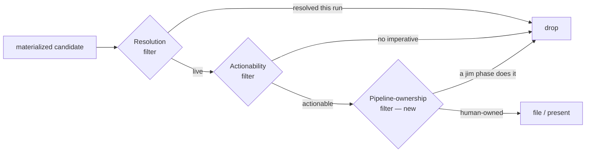

# 024 Issue pipeline-ownership — candidate batches over-file work jim auto-performs

## Overview
The spec-018 end-of-phase candidate batches file issues for work a jim phase performs automatically — e.g. "regenerate ARCHITECTURE.md," which the `/jim:build` completion gate already runs via `/jim:arch` — producing tracker noise and create-then-close commit churn. Add a pipeline-ownership filter so no surfacing skill files an issue for work jim itself will do.

## Defect Profile
- **Steps to Reproduce:**
  1. Run `/jim:plan` on a spec whose realized work includes regenerating a pipeline-maintained artifact (e.g. `ARCHITECTURE.md`), and park that maintenance in the plan's *Out of Scope* (e.g. "ARCHITECTURE.md regeneration via /jim:arch after merge").
  2. The plan's end-of-phase candidate batch materializes a candidate — "Regenerate ARCHITECTURE.md after the merge." It passes the **Resolution filter** (not resolved during the plan run) and the **Actionability filter** ("run /jim:arch" is a crisp 1-sentence imperative), so it is filed as an issue and committed.
  3. Run `/jim:build` for the same spec. Its completion gate (Step 6.2) invokes `/jim:arch`, regenerating `ARCHITECTURE.md` against the just-built code.
  4. The filed issue now tracks work the same workflow just performed; it is closed and committed.
- **Actual Behavior:** The candidate batch files an issue for *pipeline-owned* work — work a jim phase performs automatically in the normal flow. The issue is created+committed then closed+committed: pure churn, zero tracking value. The two existing filters do not catch it, because the work was not resolved *during the surfacing run* and "run /jim:arch" is a valid imperative.
- **Contributing signals (present but unheeded):** two cues already marked this work as pipeline-owned, yet neither filter consults them — (a) the plan's own *Out of Scope* named the very automation that moots the work ("ARCHITECTURE.md regeneration via /jim:arch after merge"), so the deferral itself pointed at a later gate; (b) `ARCHITECTURE.md`'s header declares it "generated and maintained by /jim:arch" — arch-doc maintenance is a jim-owned concern, not a human follow-up.
- **Expected Behavior:** No surfacing skill's candidate batch files an issue for work a jim phase will perform automatically. An issue is for work a human (or a future spec) must remember to do; if a jim phase does it on its own, it is not a follow-on and is not filed.
- **Environment:** jim plugin; the spec-018 end-of-phase candidate batch carried by the seven surfacing skills (`/jim:spec`, `/jim:research`, `/jim:plan`, `/jim:build`, `/jim:brainstorm`, `/jim:debug`, `/jim:sec`). Pre-fix the batch applies exactly two filters: Resolution and Actionability (`skills/plan/SKILL.md`, `skills/build/SKILL.md`, et al.). Cross-phase blindness is documented at `ARCHITECTURE.md` (the build batch runs *after* its own `/jim:arch` refresh, but nothing re-examines a candidate already filed in an earlier phase).

## Acceptance Criteria
- [ ] A candidate whose proposed action a jim phase performs automatically in the normal workflow is **not filed** by any surfacing skill's end-of-phase candidate batch. The exclusion is stated as a general principle — *drop any candidate whose action a jim phase performs automatically* — with the canonical traps named as examples: regenerating `ARCHITECTURE.md` (the `/jim:build` completion gate runs `/jim:arch`) and re-running the plan/build security gate. The principle generalizes beyond the named examples rather than being a closed enumeration.
- [ ] The exclusion holds across the cross-phase case — a candidate surfaced in an *earlier* phase than the gate that performs the work is still dropped (an arch-regen candidate raised during `/jim:plan` does not get filed, because the downstream `/jim:build` completion gate will perform it). This is the reported defect.
- [ ] A candidate that requires substantive human work on a pipeline-maintained artifact (e.g. authoring net-new architecture content, not the mechanical regeneration `/jim:arch` performs) is **still filed**. The filter excludes only work a jim phase performs automatically, not all work that touches a pipeline-maintained file.
- [ ] The pipeline-ownership determination is made from the agent's own model of jim's workflow — which phases perform which maintenance automatically — never from claims embedded in candidate text. An adversarial candidate asserting that it is pipeline-owned must not, by itself, cause a drop. *External Constraint — extends spec 018 § Security and Safety (`docs/specs/jim/018-issue-tracking-workflow-integration/spec.md:60-62`), whose untrusted-content discipline today binds only file/prioritize/label decisions, to cover drop/suppression decisions.*
- [ ] The exclusion applies at every surfacing skill's candidate-batch site — `/jim:spec`, `/jim:research`, `/jim:plan`, `/jim:build`, `/jim:brainstorm`, `/jim:debug`, `/jim:sec` — so the behavior holds regardless of which phase surfaces the candidate. *External Constraint — the seven surfacing skills are enumerated in spec 018 (`docs/specs/jim/018-issue-tracking-workflow-integration/spec.md`).*
- [ ] `/jim:plan`'s *Out of Scope* guidance distinguishes **deferred** work (a human or a future spec must pick it up → trackable, may become a candidate) from **handled by a later gate** (a jim phase performs it automatically → not an issue, not a candidate), and documents workflow-automated maintenance (notably the arch refresh) as *not* an Out-of-Scope deferral.
- [ ] Regression test covers the reported scenario: a documented reproduction scenario — a plan→build cycle whose realized work includes a pipeline-maintained-artifact refresh files **no** pipeline-ownership issue for that refresh — is recorded as the manual regression check, rerun when the candidate-batch convention is touched. Consistent with the SKILL.md-convention policing model (specs 011/012), no automated bash linter is added.
- [ ] The `meta-skill` author-time validation checklist gains a line requiring any surfacing skill's candidate-batch step to carry the pipeline-ownership filter, so future SKILL.md edits preserve it. *External Constraint — the author-time validation checklist is the chosen SKILL.md-convention prevention mechanism per specs 011 and 012 (`docs/specs/jim/012-allowed-tools-narrowing/spec.md`: "the meta-skill LLM validation checklist is the chosen prevention mechanism").*

## Data Flow

## Out of Scope
- **Retroactive sweep at the build gate** (scanning open issues after `/jim:build` runs `/jim:arch` and proposing closure of ones it just performed). Deferred — more complex, since it reads issue bodies (untrusted content per spec 017/018); prevention is the chosen lever. May be revisited as a follow-up spec.
- **An automated bash linter** enforcing the filter's presence across skills. Rejected per the established SKILL.md-convention policing model (specs 011/012); the meta-skill validation checklist is the prevention mechanism.
- **Changing the existing Resolution or Actionability filters' behavior.** They remain as-is; this adds a third filter alongside them.
- **Reconciling the interactive `/jim:issue add` actionability gate with the batch filters** — the interactive `add` verb applies a stricter actionability bar than the batches, so the two surfaces can disagree on what is fileable (the "two different bars" gap). Separate concern; not addressed here.
- **Any change to how candidates are filed/edited/skipped, the batch UI, or a cross-session deferred-candidate queue.**

## Research & Architecture Handoff

*Implementation insights surfaced during scoping. These are context for the architect — not requirements, not exclusions. Treat each as a starting point to evaluate, not a directive.*

### Insight 1: single-source the filter vs patch each skill's copy

- **Relates to AC:** *"A candidate whose proposed action a jim phase performs automatically … is not filed by any surfacing skill's end-of-phase candidate batch."* (AC #1)
- **Surfaced as:** a scoping proposal that *"the exclusion lives in one shared place (the spec 018 contract) and the surfacing skills reference it, rather than several independently-patched skill files."*
- **Levelled-up requirement (already in the ACs):** the *behavior* — no surfacing skill files pipeline-owned work — is in the ACs; the mechanism (single source vs duplication) is deferred to the architect.
- **Deflection reason:** Delegation.
- **Architect note:** Today the Resolution + Actionability filter text is copy-pasted into each surfacing `SKILL.md`; spec 018 § Security and Safety is *referenced* by the skills but the filter logic itself is not single-sourced. So "add it in one shared place" is a small refactor of its own, not a one-line edit. Options: (a) genuinely single-source the three filters (a shared contract block the skills reference), reducing future drift but touching the reference mechanism; (b) patch each of the seven batch sites consistently, matching the current duplication pattern with lower blast radius. Weigh drift risk vs blast radius.
- **Routing hint:** Architect to decide.

### Insight 2: canonical set of pipeline-owned actions — resolved by research

- **Relates to AC:** *"… the canonical traps named as examples: regenerating `ARCHITECTURE.md` … and re-running the plan/build security gate."* (AC #1)
- **Resolution:** `research.md` confirmed the realistic pipeline-owned traps are **ARCHITECTURE.md regen** (the `/jim:build`→`/jim:arch` gate; governed by spec-013 `auto_arch_feedback`) and **the plan/build security-gate re-run**. `INDEX.md` regen — named during scoping — was excluded: it is an internal side-effect of the issue scripts that no agent would surface as a candidate. AC #1's examples were updated accordingly.
- **Deflection reason:** Constraint-Sourcing (now sourced to `research.md`).
- **Routing hint:** Resolved — no architect action needed.

## Open Questions
- [x] ~Is the canonical list of pipeline-owned actions complete?~ → Confirmed by research: arch refresh + the plan/build security-gate re-run are the realistic traps; `INDEX.md` regen excluded as an internal side-effect (see `research.md` and Handoff Insight 2).
- [x] ~Should the retroactive build-gate sweep be in scope?~ → No; deferred to a future spec (Out of Scope).
- [x] ~Single-sourced filter vs per-skill duplication?~ → Deferred to the plan (Research & Architecture Handoff, Insight 1).
- [x] ~How is the mandatory regression expressed for an LLM-judgment prose change?~ → Documented manual scenario + meta-skill checklist line, no bash linter (per specs 011/012).
