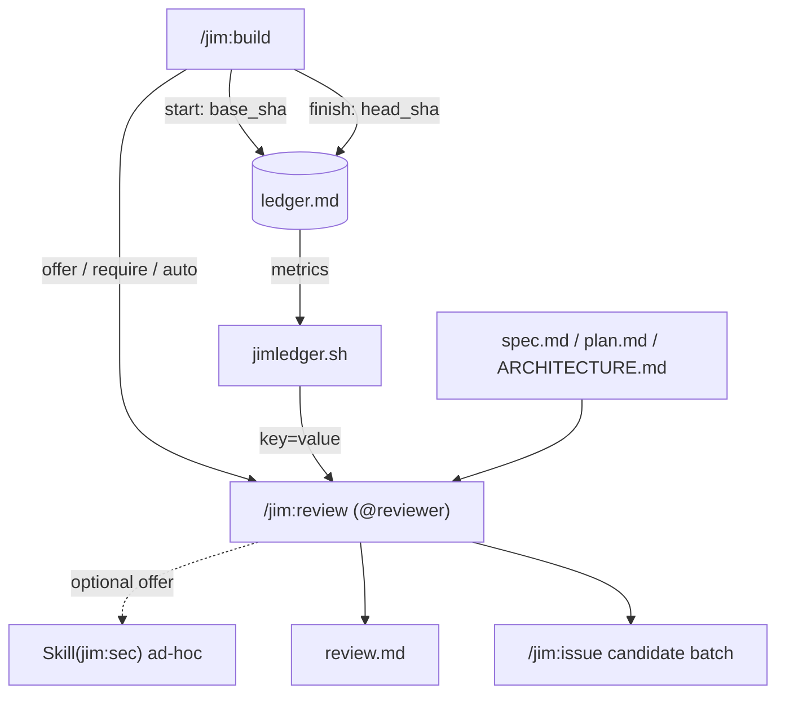

# Post-build review phase — Plan

## Overview

Add a `/jim:review` phase (skill + `@reviewer` agent + `review.md`) that runs
after `/jim:build`, fusing git metrics, a new committed `ledger.md`, and the
spec/plan/architecture ground truth into a findings report. A single new bash
helper (`jimledger.sh`) owns all git interaction and metric extraction; the
reviewer owns judgment. `/jim:build` is instrumented to record ledger
boundaries and to offer/auto-run the review under new `require_review` /
`auto_review` knobs.

## Design Decisions

### 1. `jimledger.sh` owns the entire git boundary

- **Chosen:** One script (`skills/review/scripts/jimledger.sh`) does all `git`
  calls — recording the baseline/head SHAs, and computing git-derived metrics —
  emitting `key=value` lines the reviewer consumes.
- **Why:** Centralizes the project's *first* operational use of git (research
  confirms only a read-only `git status` exists today, `migrate.sh:154`) behind
  one validated, testable surface, honoring the Bash-vs-Prompt rule (deterministic
  → bash) and sec Finding 4 (validate before interpolation).
- **Rejected:** Reviewer (LLM) shelling out to git directly — non-deterministic,
  untestable, and scatters the git trust boundary into a prompt.

### 2. Artifacts are spec-siblings, like `security.md` — no new `jimfile` KIND

- **Chosen:** `review.md` and `ledger.md` are written directly into the spec
  directory. `jimfile.sh` is **not** modified to add a `review` KIND.
- **Why:** `security.md` is the exact precedent (research): a spec-sibling
  artifact its skill writes directly. Keeps the `jimfile.sh` change to zero and
  the blast radius minimal.
- **Rejected:** Registering a `review` KIND + path/next-id logic — unnecessary
  surface for an artifact whose path is always `{spec-dir}/review.md`.

### 3. SHA validation reuses `jimfile.sh valid-id` (no 4th SYNC copy)

- **Chosen:** `jimledger.sh` validates every SHA/range token via
  `jimfile.sh valid-id <sha>` (the rc-only wrapper from spec 023) before any
  `git diff`/`git log`, called over a `BASH_SOURCE`-relative path.
- **Why:** `is_valid_id`'s allowlist (`^[A-Za-z0-9][A-Za-z0-9._-]*$`, no leading
  dash) both validates hex SHAs and forecloses git option-injection (sec Finding
  4). Reusing the single boundary respects the SYNC discipline (no new copy).
- **Rejected:** A bespoke regex in `jimledger.sh` — a 4th drifting copy of the
  same allowlist.

### 4. `/jim:review` runs inline (like `/jim:sec`); `@reviewer` is the persona

- **Chosen:** The skill body runs in the main thread (no `context: fork`),
  mirroring `/jim:sec`. `@reviewer` is the documentation persona (like
  `@security`); independence comes from a distinct skill+persona and ground-truth
  comparison, not subagent isolation.
- **Why:** Consistency with the closest sibling (`/jim:sec`), and it lets the
  caller's `allowed-tools` cover nested script calls per ARCHITECTURE → Skill
  Invocation.
- **Rejected:** Spawning `@reviewer` as a forked subagent — diverges from every
  other jim SDLC phase and complicates permission scoping.

### 5. Deeper security analysis is a developer-offered option, not an auto-chain

- **Chosen:** AC #3's "deeper security analysis" is an *offer* to run
  `Skill(jim:sec)` ad-hoc against the changed files; it is not auto-chained when
  the review is auto-invoked from build.
- **Why:** Avoids a deep `build → review → sec` auto-chain and keeps the
  auto-path lightweight; the reviewer still performs a first-pass regression lens
  itself.
- **Rejected:** Always auto-invoking `/jim:sec` from review — heavy, and risks
  surprising nested runs under `auto_review`.

### 6. `require_review` / `auto_review` semantics (resolves Open Question)

- **Chosen:** Both bare-name booleans default `"false"`.
  - Neither set → build **offers** ("Run review now? (`/jim:review`)").
  - `require_review = "true"` → build **auto-invokes** the review and treats the
    phase as incomplete until it has run; findings remain **advisory**
    (non-blocking), developer-in-loop on the review's own issue batch.
  - `auto_review = "true"` → build auto-invokes the review with no prompt.
  - **Composition (sec Finding 9):** `auto_review` (invocation) and
    `auto_issue_file` (filing) compose *independently*. `auto_review` never
    implies auto-filing — the review's issue batch stays interactive unless
    `auto_issue_file` is separately `"true"`.
- **Why:** Mirrors `require_security` / `auto_security` intent (require = must
  happen; auto = no human step) while honoring the spec's non-blocking stance.
- **Rejected:** A single `review` flag — loses the require-vs-automate distinction
  the user asked to mirror.

### 7. Alignment verdict vocabulary (resolves Open Question)

- **Chosen:** `alignment: aligned | minor-drift | major-drift`, a reviewer
  judgment recorded in `review.md` frontmatter.
- **Why:** Three buckets are enough to drive attention and aggregate later;
  flat frontmatter key keeps it mineable.
- **Rejected:** A numeric score — false precision for a judgment call.

### 8. Review re-run overwrites `review.md`; the ledger is append-only

- **Chosen:** Re-running `/jim:review` rewrites `review.md` (latest verdict
  wins). The ledger only ever appends.
- **Why:** `review.md` is a current-state synthesis; the ledger is the immutable
  event trail. Re-runs of build append fresh `started`/`finished` pairs (=
  re-run signal); an interruption is a `started` with no matching `finished`.
- **Rejected:** Appending review records into one file — complicates the mineable
  frontmatter and aggregation.

### 9. `metrics` is a content-free trusted channel (sec Finding 7)

- **Chosen:** `jimledger.sh metrics` emits ONLY fixed, script-generated keys
  (counts, validated SHAs, timestamps) — it never echoes commit/diff/ledger
  free-text to stdout. The reviewer treats metrics as a *trusted* channel; the
  raw `git log`/diff it reads for alignment is the *untrusted* channel (wrapped
  per AC #11).
- **Why:** Prevents an attacker-shaped commit from injecting fabricated metric
  lines (`alignment=aligned`, spurious keys) into the channel the reviewer
  trusts, which would bypass the untrusted-content boundary.
- **Rejected:** Letting metrics sample commit subjects/diff text — collapses the
  trusted/untrusted channel separation.

### 10. Commit the ledger at `start` and `finish` (sec Finding 8)

- **Chosen:** Build commits `ledger.md` at **both** `start` and `finish` (two
  administrative commits). `jimledger.sh` only reads git and appends to the file;
  **build owns the commits** (it is the commit authority in the TDD flow).
- **Why:** Committing only at `finish` leaves an interrupted build's events
  uncommitted and losable to `git clean` (sec Finding 8); committing at `start`
  makes the baseline/`started` event durable immediately, honoring AC #5's
  "across an interrupted build."
- **Rejected:** Commit-at-finish only + document working-tree-only durability —
  the user chose full committed durability. Also rejected `jimledger.sh`
  self-committing — would expand the script's git boundary beyond reads+append.

## Constitution Check

**ARCHITECTURE.md status:** Present — constraints noted below.

| Constraint from ARCHITECTURE.md | Honored? | Notes |
| :--- | :--- | :--- |
| Bash + POSIX only, no third-party deps; `set -uo pipefail`; `export LC_ALL=C` | Yes | `jimledger.sh` uses only `git`/coreutils. |
| Never `source`/`eval` user data; parse with grep/sed/cut | Yes | Ledger + git output parsed line-oriented; DD #1. |
| Inter-script composition via `BASH_SOURCE`-relative paths | Yes | `jimledger.sh` → `jimfile.sh valid-id`; DD #3. |
| `allowed-tools` names exact script paths (no `Bash(bash *)`) | Yes | Tasks 7, 9 list exact tokens. |
| Least-privilege agents (cf. `issue-analyst.md:13`) | Yes | `@reviewer` tools narrowed; sec Finding 6. |
| Sentinel logic-flow for config gates (`SET` + paren-free `IF`) | Yes | Build review gate, Task 12. |
| Progressive disclosure: SKILL ≤500 lines, agent ≤800 tokens | Yes | Verified in Tasks 6, 7. |
| Naming: skill name == dir; agent name == filename | Yes | `review` / `reviewer`. |
| Bash-vs-Prompt decision rule | Yes | Deterministic → `jimledger.sh`; judgment → skill. |
| Reuse `is_valid_id` via single boundary (SYNC discipline) | Yes | `jimfile.sh valid-id`; DD #3. |
| Config bare-name `require_*`/`auto_*` convention | Yes | `resolve()` arm already matches; Task 5. |

## File Manifest

| Component | File Path | Action | Notes |
| :--- | :--- | :--- | :--- |
| Ledger helper | `skills/review/scripts/jimledger.sh` | Create | start/finish/event/metrics/files; owns git reads |
| Ledger tests | `tests/jimledger.sh` | Create | TDD; temp git fixtures |
| Reviewer agent | `agents/reviewer.md` | Create | least-privilege persona |
| Review skill | `skills/review/SKILL.md` | Create | inline skill, `/jim:review` |
| Review template | `skills/review/assets/review-template.md` | Create | mineable frontmatter + body |
| Config defaults | `skills/conf/scripts/jimconf.sh` | Update | `require_review`/`auto_review` in `default_for()` |
| Config tests | `tests/jimconf.sh` | Update | assert new defaults |
| Build integration | `skills/build/SKILL.md` | Update | ledger start/finish; review gate (overturns `:200`,`:206`) |
| Config example | `jimconf.toml.example` | Update | document new knobs |
| Workflow doc | `WORKFLOW.md` | Update | document review phase + artifacts |
| Readme | `README.md` | Update | mention review phase |
| Architecture | `ARCHITECTURE.md` | Update | via `/jim:arch` refresh during build (not hand-edited) |

## Interface Contracts

```
# skills/review/scripts/jimledger.sh — CLI
jimledger.sh start   <spec-dir>                      # append: build started, base_sha=<git rev-parse HEAD>
jimledger.sh finish  <spec-dir>                      # append: build finished, head_sha=<git rev-parse HEAD>
jimledger.sh event   <spec-dir> <phase> <event> [k=v ...]   # generic append
jimledger.sh metrics <spec-dir>                      # emit key=value metric lines to stdout (trusted, content-free)
jimledger.sh files   <spec-dir>                      # emit changed file paths over base..head (untrusted channel)

# Ledger file: <spec-dir>/ledger.md — append-only, one event per line, TAB-separated:
# <iso8601-utc>\t<phase>\t<event>\t<k=v;k=v...>

# metrics stdout keys (absent keys mean "not derivable"):
base_sha= head_sha= commits= commits_test= commits_feat= commits_fix= commits_refactor=
files_changed= insertions= deletions= build_runs= build_interruptions= duration_seconds=

# Validation: base_sha/head_sha each pass `jimfile.sh valid-id` before git use; else exit 2.
# Earliest `started` base_sha and latest `finished` head_sha define the range.
# metrics emits ONLY the fixed keys above — never echoes commit/diff/ledger text (DD #9).
# files emits one changed path per line over the same validated range — the reviewer's
#   untrusted file-list channel for alignment (kept separate from the trusted metrics).
# jimledger.sh never commits; build commits ledger.md at start and finish (DD #10).
```

```
# review.md frontmatter (mineable) — written by /jim:review
spec: base_sha: head_sha: commits: commits_test: commits_feat: commits_fix: commits_refactor:
files_changed: insertions: deletions: build_runs: build_interruptions: duration_seconds:
phase_coverage:        # e.g. "spec,research,security,plan,build" (artifact-existence)
plan_deviations:       # reviewer judgment (int)
security_regressions:  # reviewer judgment (int)
alignment:             # aligned | minor-drift | major-drift
date:
# Body: ## Summary, ## Alignment (vs spec ACs / plan tasks / architecture),
#       ## Metrics, ## Security regressions, ## Findings, ## Deviations & feedback
```

## Data Flow



## Task Breakdown

**Phase 1 — Ledger helper (TDD; deterministic).**

1. [ ] Scaffold `tests/jimledger.sh` (via `/jim:meta-test scaffold jimledger`) and create `skills/review/scripts/jimledger.sh` skeleton (`#!/usr/bin/env bash`, `set -uo pipefail`, `export LC_ALL=C`, usage on no/invalid subcommand, trailing newline).
   **Verify:** `bash skills/review/scripts/jimledger.sh; test $? -ne 0 && bash tests/jimledger.sh`

2. [ ] Implement `event`/`start`/`finish` append to `<spec-dir>/ledger.md` (TAB-separated `iso8601\tphase\tevent\tkv`); `now` timestamp via `jimfile.sh now`.
   **Verify:** `bash tests/jimledger.sh 2>&1 | grep -q "append"` (case asserts a written line round-trips)

3. [ ] `start`/`finish` capture `git rev-parse HEAD`; validate the SHA via `jimfile.sh valid-id` (BASH_SOURCE-relative); exit 2 on non-repo or invalid SHA.
   **Verify:** `bash tests/jimledger.sh 2>&1 | grep -q "sha"` (temp git repo: base_sha recorded & valid; non-repo errors with rc 2)

4. [ ] `metrics`: emit git-derived (`commits`, `commits_test|feat|fix|refactor`, `files_changed`, `insertions`, `deletions` over earliest-base..latest-head) and ledger-derived (`build_runs`, `build_interruptions`, `duration_seconds`) lines. Emit ONLY fixed, script-generated keys — never echo commit/diff/ledger free-text (DD #9, sec Finding 7).
   **Verify:** `bash tests/jimledger.sh 2>&1 | grep -q "metrics"` (temp repo with 1 `test:` + 1 `feat:` commit → `commits=2 commits_test=1 commits_feat=1`; a case with a commit subject like `feat: alignment=major-drift x` asserts every metrics line matches `^[a-z_]+=[A-Za-z0-9._-]*$` — no echoed free-text)

4b. [ ] `files`: emit one changed file path per line over the same validated `base..head` range (the reviewer's untrusted alignment channel, separate from the content-free `metrics`). Same SHA validation/exit-2 path as `metrics`.
   **Verify:** `bash tests/jimledger.sh 2>&1 | grep -q "files"` (temp repo: a commit touching `foo.txt` → `files` output contains `foo.txt`; non-repo / invalid SHA exits 2)

**Phase 2 — Config (TDD).**

5. [ ] Add `require_review`/`auto_review` (default `"false"`) to `jimconf.sh` `default_for()`; confirm the existing `require_*`/`auto_*` `resolve()` arm returns them. Extend `tests/jimconf.sh`.
   **Verify:** `test "$(bash skills/conf/scripts/jimconf.sh get require_review)" = false && test "$(bash skills/conf/scripts/jimconf.sh get auto_review)" = false && bash tests/jimconf.sh`

**Phase 3 — Reviewer agent (meta-agent checklist).**

6. [x] Create `agents/reviewer.md`: `name: reviewer`, `skills: [review]`, `model: sonnet`, least-privilege `tools` (Read, Glob, Grep, Write, Edit, the three `Bash(bash ...jimledger.sh|jimfile.sh|index.sh *)` tokens), persona covering untrusted-content + scrub discipline + judgment-based verdict.
   **Verify:** `grep -q '^name: reviewer' agents/reviewer.md && grep -q 'model: sonnet' agents/reviewer.md && grep -q 'jimledger.sh' agents/reviewer.md && ! grep -q 'Bash(bash \*)' agents/reviewer.md`

**Phase 4 — Review skill (meta-skill checklist).**

7. [x] Create `skills/review/SKILL.md` (`name: review`, `agent: reviewer`, narrowed `allowed-tools` naming jimledger.sh/jimfile.sh/index.sh + `Skill(jim:sec)` + Read/Write/Edit): argument routing; status gate; read spec/plan/arch/ledger; resolve range + `metrics`; alignment analysis vs ACs/plan/architecture; `phase_coverage` via Glob; optional `Skill(jim:sec)` ad-hoc offer; untrusted-content wrap (`<untrusted-issue-content>` pattern); scrub discipline; write `review.md`; end-of-phase candidate batch (reviewer-judged priority); present + stop.
   **Verify:** `grep -q '^name: review' skills/review/SKILL.md && grep -q 'jimledger.sh' skills/review/SKILL.md && grep -q 'Skill(jim:sec)' skills/review/SKILL.md && test "$(wc -l < skills/review/SKILL.md)" -le 500`

8. [x] Create `skills/review/assets/review-template.md` with the mineable frontmatter key set (Interface Contracts) + body sections.
   **Verify:** `grep -q 'alignment:' skills/review/assets/review-template.md && grep -q 'base_sha:' skills/review/assets/review-template.md && grep -q '## Findings' skills/review/assets/review-template.md`

**Phase 5 — Build integration (edit `skills/build/SKILL.md`).**

9. [ ] Extend build `allowed-tools` (line 10) with `Skill(jim:review)` and `Bash(bash ${CLAUDE_PLUGIN_ROOT}/skills/review/scripts/jimledger.sh *)`.
   **Verify:** `grep -q 'Skill(jim:review)' skills/build/SKILL.md && grep -q 'jimledger.sh' skills/build/SKILL.md`

10. [ ] Add a "record build start" sub-step after Step 3 (Load context, before task execution) invoking `jimledger.sh start <spec-dir>`, then **commit `ledger.md`** (first of two ledger commits per DD #10 — makes the baseline durable across interruption, sec Finding 8).
    **Verify:** `grep -q 'jimledger.sh start' skills/build/SKILL.md && grep -qi 'commit' skills/build/SKILL.md`

11. [ ] In the completion gate (Step 6), add `jimledger.sh finish <spec-dir>` and **commit `ledger.md`** (second ledger commit, DD #10) as administrative housekeeping (coexisting with the arch refresh / issue files per the existing Step 6.3 precondition).
    **Verify:** `grep -q 'jimledger.sh finish' skills/build/SKILL.md`

12. [ ] Replace the hard prohibitions at `:200` ("do not auto-invoke review") and `:206` ("no auto-review") with a `require_review`/`auto_review` sentinel gate: default → conversational offer "Run review now? (`/jim:review`)"; `true` → invoke `Skill(jim:review)` with the spec dir; **preserve** "no auto-ship". (Addresses research Peer Feedback #1.)
    **Verify:** `grep -q 'require_review' skills/build/SKILL.md && grep -q 'auto_review' skills/build/SKILL.md && grep -q 'Skill(jim:review)' skills/build/SKILL.md && grep -qi 'no auto-ship' skills/build/SKILL.md && ! grep -q 'no auto-review' skills/build/SKILL.md`

**Phase 6 — Documentation.**

13. [ ] Add `require_review`/`auto_review` to `jimconf.toml.example` with comments and `"false"` defaults.
    **Verify:** `grep -q 'require_review' jimconf.toml.example && grep -q 'auto_review' jimconf.toml.example`

14. [ ] Document the review phase + its artifacts (`review.md`, `ledger.md`) in `WORKFLOW.md`.
    **Verify:** `grep -q '/jim:review' WORKFLOW.md && grep -q 'review.md' WORKFLOW.md`

15. [ ] Mention the review phase in `README.md`.
    **Verify:** `grep -q '/jim:review' README.md`

## Requirements Coverage Summary

| Spec Acceptance Criterion | Addressed In Task(s) |
| :--- | :--- |
| AC1 — build offers review by default; require/auto knobs | 5, 12, 13 |
| AC2 — compare diff vs spec ACs + plan tasks + architecture | 4b, 7 |
| AC3 — report security regressions, optional deeper analysis | 7 (+ DD #5) |
| AC4 — correct scoping on multi-spec branch | 3, 4, 4b, 10, 11 |
| AC5 — build records durable boundary + events (interruption/re-run) | 2, 3, 10, 11 |
| AC6 — report code + available process metrics | 4, 7 |
| AC7 — degrade gracefully when data absent | 4 (absent keys), 7 |
| AC8 — findings → issues, reviewer-judged priority | 7 |
| AC9 — produce review.md (machine summary + narrative) | 7, 8 |
| AC10 — single at-a-glance alignment verdict | 7, 8 (DD #7) |
| AC11 — ingested content untrusted (parse-only; no verdict steering) | 3 (no eval), 6, 7 |
| AC12 — scrub/minimize sensitive content before persisting | 6, 7 |

## Out of Scope

- Instrumenting phases other than build (sec causality, research duration). The
  ledger `event` verb exists for later rollout; only build calls it now.
- Project-level cross-spec metrics aggregator (spec Out of Scope).
- `Spec:`-trailer diff scoping; token metrics (spec Out of Scope).
- Hand-editing `ARCHITECTURE.md` — refreshed via `/jim:arch` during this
  feature's own build.

## Open Questions

- [x] ~~`require_review` enforcement semantics~~ → DD #6 (require = auto-invoke,
  advisory/non-blocking; auto = no prompt).
- [x] ~~Review re-run behavior~~ → DD #8 (overwrite `review.md`; ledger appends).
- [x] ~~Alignment verdict vocabulary~~ → DD #7 (`aligned`/`minor-drift`/`major-drift`).
- [x] ~~Ledger lifecycle when only build is instrumented~~ → starts at build
  (`start`), ends at `finish`; build-first per spec.
- [x] ~~Construction path: executor split for prompt files vs scripts~~ →
  Prompt files (`skills/review/SKILL.md` Task 7, `skills/review/assets/review-template.md`
  Task 8, `agents/reviewer.md` Task 6) are authored via `@jim:meta` using
  `/jim:meta-skill` and `/jim:meta-agent`. The script/config/test tasks (Phases 1–2)
  and the build-integration and doc edits (Phases 5–6) are `@coder`/TDD via
  `/jim:build`. Phase headers note the executor per phase.
