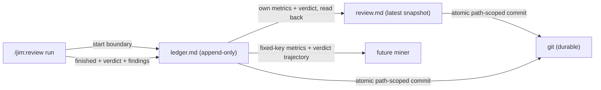

# 028 Instrument /jim:review as a ledger stage and preserve verdict history

## Overview
Make `/jim:review` a complete ledger stage — recording its own boundaries,
metrics, and alignment verdict, reporting those metrics in `review.md`, and
durably committing the result — so the review is self-measurable and its verdict
trajectory survives re-runs while `review.md` stays the latest snapshot.

## Problem Statement
`/jim:review` is the one SDLC stage absent from the ledger's instrumented set:
spec, research, plan, sec, and build all record `started`/`finished`
boundaries, but review records nothing. Two gaps follow. First, a developer
reviewing how a build's process went cannot see how long review took, whether
it was re-run, or whether a review attempt was abandoned — the review measures
every other stage but never itself. Second, when a review is re-run after drift
is fixed, the new `review.md` overwrites the old one, so the verdict history
(e.g. the build drifted, was corrected, then re-reviewed clean) is lost — there
is no record that the verdict ever moved. The developer wanting to trust "this
build was reviewed and ended aligned" cannot see the path the verdict took to
get there. Compounding both: review is terminal and has no approval gate (unlike
spec and plan), so there is no human commit gesture to carry its record into the
repository — its events and `review.md` sit in the working tree relying on a
commit that may never deliberately happen, leaving the very trajectory this spec
builds undurable.

## User Stories
- As a developer auditing a build's process, I can see how long `/jim:review`
  took, how many times it ran, and whether a review was interrupted, so the
  review stage is as measurable as every other stage.
- As a developer re-running `/jim:review` after fixing drift, I can recover the
  full sequence of alignment verdicts the spec received over time, so a
  `major-drift → aligned` recovery is visible rather than silently overwritten.
- As a developer reading `review.md`, I still see only the latest review as the
  authoritative snapshot, so the current verdict is never ambiguous.
- As a developer, I get a completed review's record — its verdict and its
  metrics — committed automatically, so the trajectory survives even though
  review has no approval gate to carry a commit.

## Acceptance Criteria
- [ ] `review` is an instrumented ledger stage: a `/jim:review` run records a
      stage-start boundary at the outset and a stage-completion boundary when it
      finishes, so the review's runs, duration, and interruptions become
      recoverable from the ledger alongside the other stages.
- [ ] The review-completion event carries the run's alignment verdict and its
      findings count, so each completed review appends one verdict record to the
      append-only ledger.
- [ ] After multiple `/jim:review` runs on the same spec, every run's verdict is
      recoverable in chronological order from the ledger (the verdict trajectory
      survives), while `review.md` continues to hold only the latest run's
      snapshot — a re-run overwrites `review.md` and appends to the ledger.
- [ ] The ledger metrics channel exposes the review stage's process metrics and
      the latest alignment verdict under a fixed, code-literal key set; no metric
      key is derived from ledger text, so a tampered ledger still cannot inject
      spurious metric keys. (`security.md` Finding 7's invariant is restated from
      "content-free counts" to "fixed key set, reviewer-judged trusted-origin
      values" — the no-key-injection property is preserved.)
- [ ] An interrupted, errored, or declined review — start recorded, completion
      absent — surfaces as a review interruption in the metrics, distinct from a
      completed run.
- [ ] When `/jim:review` runs over a build that was never ledger-instrumented
      (no prior ledger), the review still completes and degrades gracefully
      exactly as today, and its own stage boundaries are captured rather than
      silently dropped, so review stays self-measurable regardless of upstream
      instrumentation.
- [ ] `review.md` reports the review stage's own process metrics (runs,
      duration, interruptions) for the run alongside the other stages, so the
      review is a self-describing record that measures itself as it measures
      everything else.
- [ ] On completion, `/jim:review` commits `review.md` and `ledger.md` together
      in a single atomic commit scoped to just those paths (no unrelated
      working-tree changes swept in), so a completed review's verdict and metrics
      are durably recorded without a manual commit step.
- [ ] The verdict value surfaced from the ledger is validated against the known
      vocabulary (`aligned` / `minor-drift` / `major-drift`), and `findings`
      against a non-negative integer, so a tampered ledger surfaces at most a
      bounded, well-formed value rather than arbitrary text; and `review.md`
      remains the authoritative verdict for any single review, with the ledger
      trajectory advisory rather than a trust anchor. (security.md Finding 1;
      extends spec 026 `security.md` Finding 7.)
- [ ] `/jim:review`'s commit capability is least-privilege: the commit runs
      through a single audited, fixed-path entry point — literal `review.md` and
      `ledger.md` paths within the validated spec directory, an end-of-options
      `--` guard, never `git add -A` — and the review surface is not granted
      broad git access. (security.md Finding 2.)

## Data Flow

## Out of Scope
- **No aggregation or consumer.** Nothing reads the verdict trajectory in this
  spec — no dashboard, cross-spec rollup, or surfacing of prior verdicts on
  re-run. The trajectory is emitted and made extractable; mining it later
  matches the existing "mineable now, consumed later" stance of `review.md`'s
  frontmatter.
- **No new data store.** The verdict lives in the existing `ledger.md`; this
  spec does not introduce a separate review-history artifact.
- **No `review.md` snapshot-behavior change.** Re-run still overwrites
  `review.md` (now committed each run); only the ledger accumulates the
  append-only trajectory. `review.md` never becomes a multi-verdict log.
- **No frontmatter-body count consistency check.** Validating that `review.md`'s
  judged frontmatter counts match its body items is issue #17, a separate
  validation-checklist concern, not this spec. (Issue #16 — the missing `spec`
  column in the metrics rows — *is* absorbed here, since AC #7 edits those exact
  rows; see Insight 5.)

## Research & Architecture Handoff

*Implementation insights surfaced during scoping. These are context for the architect — not requirements, not exclusions. Treat each as a starting point to evaluate, not a directive.*

### Insight 1: instrument via the existing stage-event mechanism

- **Relates to AC:** *"`review` is an instrumented ledger stage…"* (AC #1)
- **Surfaced as:** the issue proposed adding `review` to `LEDGER_STAGES`
  (`jimledger.sh`) and emitting through the existing `event <dir> <phase>
  started|finished` verb, mirroring how plan/sec/research/spec already do it.
- **Levelled-up requirement (already in the ACs):** the AC states the
  observable outcome (review's boundaries/metrics are recoverable), not the list
  name or the call sites.
- **Deflection reason:** Delegation — the stage-allowlist edit and the two emit
  call sites are mechanical implementation detail.
- **Architect note:** the per-stage triplet (`review_runs`,
  `review_interruptions`, `review_duration_seconds`) comes "for free" from
  `phase_event_metrics` once `review` joins the allowlist. Decide where in the
  `/jim:review` skill body the emits land: `started` after the spec-dir
  precondition is validated (so a mis-invocation does not litter a ledger), and
  `finished` *after the verdict is determined but before `review.md` is
  composed* — see Insight 5 for why that ordering matters now.
- **Routing hint:** Architect to decide.

### Insight 2: surface the verdict under a fixed key (the no-key-injection invariant)

- **Relates to AC:** *"…exposes … the latest alignment verdict under a fixed,
  code-literal key set…"* (AC #4)
- **Surfaced as:** the issue proposed `review finished alignment=<v>
  findings=<n>`; the kv field already carries trusted-origin values
  (`base_sha`, `head_sha`) extracted by fixed keys, so a fixed `alignment` key
  is precedented.
- **Levelled-up requirement (already in the ACs):** the AC fixes the security
  property (no key derived from ledger text), not the spelling of the key.
- **Deflection reason:** Constraint-Sourcing — the invariant traces to
  `security.md` Finding 7 (spec 026/027), a locked architectural constraint.
- **Architect note:** the verdict is the first *semantic judgment* value the
  metrics channel would carry, where today every value is a count or a SHA. The
  reframe is defensible because (a) the value is reviewer-generated
  trusted-origin, like `head_sha`, and (b) the extraction key set stays a code
  literal, so the no-key-injection property holds. Consider naming for
  consistency with the triplet (`review_alignment` / `review_findings` rather
  than bare `alignment`), and whether `metrics` surfaces the *latest* verdict
  (like `head_sha`'s `last` extraction) while the *trajectory* is read from the
  raw `review finished` lines. This is security-relevant — run `/jim:sec`.
- **Routing hint:** Architect to decide; Researcher/Security to confirm the
  invariant reframe.

### Insight 3: re-run semantics resolve spec 026's open question

- **Relates to AC:** *"…a re-run overwrites `review.md` and appends to the
  ledger."* (AC #3)
- **Surfaced as:** spec 026 left an open question — on `/jim:review` re-run,
  overwrite `review.md` or append a new record? (Affects aggregation.)
- **Levelled-up requirement (already in the ACs):** this spec answers it with a
  third option — overwrite the snapshot, append the trajectory to the
  append-only ledger.
- **Deflection reason:** Story-Link — ties to the re-run user story.
- **Architect note:** worth recording the resolution against spec 026's open
  question when this lands, so the question is closed rather than left dangling.
- **Routing hint:** Architect to decide.

### Insight 4: recording review boundaries when no prior ledger exists

- **Relates to AC:** *"…its own stage boundaries are captured rather than
  silently dropped…"* (AC #6)
- **Surfaced as:** a scoping lean toward review emitting its boundaries
  unconditionally, creating `ledger.md` if absent (the event helper already
  creates the file on first append).
- **Levelled-up requirement (already in the ACs):** the AC keeps the user need —
  review stays self-measurable and degrades gracefully — without fixing the
  create-vs-skip mechanism.
- **Deflection reason:** Delegation — an architect could reasonably choose to
  skip review emission when the build was not instrumented (a ledger carrying
  only review events may be noise) rather than create a fresh ledger.
- **Architect note:** weigh creating a fresh `ledger.md` (review recorded even
  for un-instrumented builds; consistent self-measurement) against requiring an
  existing ledger (avoids a review-only ledger). Either way the graceful-
  degradation contract for *upstream* metrics is unchanged.
- **Routing hint:** Architect to decide.

### Insight 5: emit `finished` before composing `review.md`; metrics-row edit absorbs #16

- **Relates to AC:** *"`review.md` reports the review stage's own process
  metrics…"* (AC #7)
- **Surfaced as:** for `review.md` to report *this* run's own metrics, the
  ledger must already carry this run's `review finished` when the metrics are
  read — so the emit order is `started` → run the review → determine verdict →
  emit `finished` (with verdict) → read metrics → compose `review.md` → commit.
- **Levelled-up requirement (already in the ACs):** the AC fixes the observable
  (review reports its own metrics), not the emit ordering.
- **Deflection reason:** Delegation — ordering and the template-row mechanics are
  the architect's to place.
- **Architect note:** `review.md`'s Metrics table gains a `review` column;
  editing the Stage-durations / Interruptions rows to include `review` also adds
  the missing `spec` column those rows currently omit, which **absorbs issue
  #16** — recommend closing #16 when this lands. Watch the re-run duration
  wrinkle: `phase_event_metrics` computes a stage's duration as *first-started →
  last-finished*, so on a re-run far removed in time from the first review,
  `review_duration_seconds` spans the gap between sessions and reads as
  misleadingly large. Decide whether to keep that (consistent with every other
  stage) or compute review's duration per-run (see Open Questions).
- **Routing hint:** Architect to decide.

### Insight 6: review commits its own record — a deliberate exception to the convention

- **Relates to AC:** *"…commits `review.md` and `ledger.md` together in a single
  atomic commit…"* (AC #8)
- **Surfaced as:** review is terminal with no approval gate, so — unlike
  spec/research/plan/sec, whose events ride a human approval commit — there is no
  natural commit gesture; the durable trajectory this spec builds would otherwise
  rely on a commit that may never happen.
- **Levelled-up requirement (already in the ACs):** the AC fixes the outcome
  (verdict + metrics durably committed atomically), not the git mechanics.
- **Deflection reason:** Delegation — commit scoping/mechanics are the
  architect's to place.
- **Architect note:** this makes review a documented **exception** to spec 026's
  "non-build stages don't commit; the developer commits their events with the
  artifact" convention — review joins build as a self-committing terminal stage,
  for a different reason (no approval gesture, vs build's baseline durability).
  Scope the commit to the two paths (`review.md`, `ledger.md`) like build scopes
  its ledger commit — never `git add -A`. Consider whether an interrupted review
  (started, no finished) should leave its `started` uncommitted (swept into the
  next successful run's commit) — the spec assumes yes. Worth the arch/sec pass
  given it overturns a documented convention. Update `ARCHITECTURE.md`'s ledger
  convention text when this lands (the `/jim:build` completion gate runs
  `/jim:arch`).
- **Routing hint:** Architect to decide; Security to confirm.

## Open Questions
- [x] ~On re-run, overwrite `review.md` or append a new review record (spec 026
  open question)?~ → Overwrite `review.md` (latest snapshot wins); append the
  verdict to the append-only ledger so the trajectory survives.
- [x] ~Should the verdict live in the ledger, a separate artifact, or nowhere?~
  → In the ledger, as a trusted-origin value under a fixed key (decided during
  scoping).
- [ ] Exact metric key names for the surfaced verdict (`review_alignment` /
  `review_findings` vs bare `alignment`) and whether `findings` is a total or a
  severity-bucketed count — plan/build detail.
- [ ] `review_duration_seconds` on a re-run uses the existing first-started →
  last-finished semantics, which spans the gap between far-apart review sessions
  — keep it (consistent with all stages) or compute review's duration per-run?
- [ ] Should review's commit be unconditional, or gated by a config knob (e.g.
  for developers who want to inspect `review.md` before it is committed)? The
  current scope assumes unconditional, matching build's auto-committed ledger.
