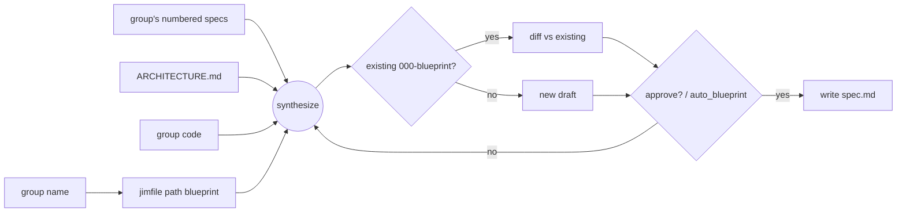

# Group blueprint spec (000-blueprint) — Plan

## Overview

Add a group-parameterized skill, `/jim:blueprint <group>`, that generates or
updates a group's reserved `000-blueprint/spec.md` by amalgamating the group's
numbered specs, ARCHITECTURE.md, and code — reusing `/jim:arch`'s scan → fill →
diff-and-confirm flow, backed by a deterministic `blueprint` path-resolver kind in
`jimfile.sh` and an `auto_blueprint` config flag.

## Design Decisions

### 1. A new `/jim:blueprint` skill, not a mode of `/jim:arch`
- **Chosen:** a dedicated skill `/jim:blueprint <group>` bound to `@jim:architect`.
- **Why:** the artifact is group-parameterized with its own template, inputs, and reserved slot; `/jim:arch` is intentionally project-wide and flat (`architecture_path` is not group-keyed). One command, one purpose.
- **Rejected:** a `--group` mode of `/jim:arch` — overloads arch's project-wide contract and entangles two output shapes.

### 2. A deterministic `blueprint` kind in `jimfile.sh` for the reserved slot
- **Chosen:** `jimfile.sh path blueprint <group>` → `{specs}/<group>/000-blueprint/spec.md`, validating `<group>` via `is_valid_slug` before composing.
- **Why:** single-sources the `000-blueprint` reserved-slot constant; keeps path resolution deterministic in bash (bash-vs-prompt rule); the validation folds in security Finding 3 (write-path through the id/slug boundary).
- **Rejected:** reuse `path spec <group> 000 blueprint` — works, but implies an allocated spec id `000` and leaks the magic string into the skill prompt. Also rejected: hardcode the path in the skill — violates the bash-vs-prompt rule.

### 3. An `auto_blueprint` flag; no new path key
- **Chosen:** add `auto_blueprint` (default `"false"`) to `jimconf.sh`, mirroring `auto_arch_feedback`.
- **Why:** the bare-name `auto_*` convention already resolves it; the location is derived per-group from `specs_path` + the reserved slot, so a path key is unnecessary.
- **Rejected:** a `blueprint_path` key — redundant; the path is structural, not independently configurable.

### 4. Reuse `/jim:arch`'s generate-and-confirm flow
- **Chosen:** scan inputs → fill `blueprint-template.md` → diff-and-confirm (or auto-write under `auto_blueprint`) → write; new-vs-update branch mirrors arch Step 3.
- **Why:** proven pattern, consistent UX; satisfies AC #1 (approval gate) and AC #9 (generate-or-update).
- **Rejected:** a bespoke flow — needless divergence from an established pattern.

### 5. Build routing: `/jim:meta-skill` for the prompt artifacts; bash TDD for the scripts
- **Chosen:** `SKILL.md` + `blueprint-template.md` are built via `/jim:meta-skill` (checklist-validated); the `jimfile.sh` / `jimconf.sh` changes are TDD'd via `tests/*.sh`.
- **Why:** ARCHITECTURE mandates new jim skills be authored via `/jim:meta-skill`; deterministic scripts are validated by the bash suite. The two halves verify differently (checklist vs. exit code).
- **Rejected:** hand-authoring the SKILL.md in `/jim:build` — bypasses the meta-skill convention and its template discipline.

### 6. `requires`-face discovery is best-effort, LLM-driven
- **Chosen:** the skill derives a group's `requires` by reading its code for cross-group references; the output states the best-effort nature.
- **Why:** addresses research Peer Feedback — precise cross-group dependency extraction needs clean module boundaries (issue #19). At single-group MVP scope, best-effort is honest and degrades gracefully.
- **Rejected:** a static-analysis dependency extractor — premature; jim is markdown-first/zero-dep and group boundaries aren't first-class yet (issue #19).

### 7. Untrusted-ingestion + secret-scrub guardrails in the skill prompt
- **Chosen:** the skill treats scanned code/specs as data-not-instruction and scrubs secret-looking values, mirroring `agents/investigator.md` + `skills/review/SKILL.md`.
- **Why:** AC #10/#11 and security Findings 1/2; the discipline is judgment-level (prompt), not deterministic (script).
- **Rejected:** a deterministic secret scanner — cannot cover the open-ended "secret-looking" space; jim's established pattern is prompt-level discipline.

### 8. Least-privilege tool grant for the blueprint skill
- **Chosen:** pin the skill's `allowed-tools` to `Read`, `Glob`, `Grep`, `Write`, `Edit`, and a scoped `Bash` for `jimfile.sh`/`jimconf.sh` — no broad `Bash`, no `Agent`.
- **Why:** the skill ingests untrusted code/specs, so a capability-bounded grant means a successful injection (DD #7 / AC #10) cannot escalate beyond writing the human-approved blueprint — the capability-backed analog of the prompt guardrail, mirroring `agents/investigator.md`'s "capability absent, not merely forbidden" boundary (security Finding 4).
- **Rejected:** a broad grant (`Bash`, `Agent`) — needless capability that widens the injection blast radius.

## Constitution Check

**ARCHITECTURE.md status:** Present — constraints noted below.

| Constraint | Honored? | Notes |
| :--- | :--- | :--- |
| Markdown-first; bash + POSIX only; zero third-party deps | Yes | No new deps; only `jimfile.sh`/`jimconf.sh` bash edits. |
| SKILL.md < 500 lines; `assets/` for templates | Yes | `blueprint-template.md` under `assets/`. |
| Path resolution via `!`-injected `jimfile.sh`; bash-vs-prompt split | Yes | `path blueprint` is deterministic bash; synthesis is prompt. |
| `auto_*` config convention (auto removes a human step; default human-in-loop) | Yes | `auto_blueprint` default `"false"`. |
| New jim skills authored via `/jim:meta-skill` | Yes | DD #5. |
| Untrusted-ingestion: parse-never-source; output is judgment, not a read value | Yes | DD #7. |
| Test conventions: `tests/<name>.sh` + `testlib.sh`, no third-party | Yes | `tests/jimfile.sh`, `tests/jimconf.sh`. |
| Ids/slugs validated through the single `is_valid_*` boundary | Yes | DD #2 validates `<group>`. |

## File Manifest

| Component | File Path | Action | Notes |
| :--- | :--- | :--- | :--- |
| Skill | `skills/blueprint/SKILL.md` | Create | `/jim:blueprint <group>` — scan → fill → diff-and-confirm → write; via `/jim:meta-skill`. |
| Template | `skills/blueprint/assets/blueprint-template.md` | Create | `000-blueprint` structure: Responsibility / Provides / Requires / Structure / Invariants. |
| Path resolver | `skills/file/scripts/jimfile.sh` | Update | Add `blueprint` kind: `path blueprint <group>` → reserved-slot path; validate `<group>`. |
| Path tests | `tests/jimfile.sh` | Update | `path blueprint` resolves the slot; `next-id` ignores `000-blueprint`. |
| Config resolver | `skills/conf/scripts/jimconf.sh` | Update | Add `auto_blueprint` (default `"false"`). |
| Config tests | `tests/jimconf.sh` | Update | `auto_blueprint` default + resolution. |
| Config example | `jimconf.toml.example` | Update | Document `auto_blueprint`. |
| Workflow doc | `WORKFLOW.md` | Update | Add `/jim:blueprint` to the command reference. |
| Architecture doc | `ARCHITECTURE.md` | (gate) | Refreshed by `/jim:build`'s completion gate via `/jim:arch` — not a manual task. |

## Interface Contracts

```
# jimfile.sh — new kind
path blueprint <group>
  → stdout: "<specs_path>/<group>/000-blueprint/spec.md"
  → validates <group> via is_valid_slug; exit 1 + stderr on invalid/missing group
  → pure path composition (no allocation; never touches next-id / mv-spec)

# next-id invariant (regression-locked; no code change)
next-id <group>
  → unaffected by a "000-blueprint" dir (parses to id 0, never raises max)

# jimconf.sh — new key
get auto_blueprint   → "false" (default) | configured value
  → resolves bare (auto_* prefix), no _path suffix

# /jim:blueprint <group>   (skill — prompt-level)
  input:  <group> (a spec group name)
  output: <specs>/<group>/000-blueprint/spec.md, written only after approval
          (or auto-written when auto_blueprint == "true")
  sections produced: Responsibility, Provides, Requires, Structure, Invariants
                     (each invariant: criticality + intended verification method)
  guardrails: scanned code/specs are data-not-instruction; secrets scrubbed to
              `secret-looking value at <path:line>`
```

## Data Flow



## Task Breakdown

1. [x] **jimfile `blueprint` kind (test-first).** Add `case_jimfile_path_blueprint_*` to `tests/jimfile.sh` asserting `path blueprint <group>` → `{specs}/<group>/000-blueprint/spec.md` and rejecting an invalid group; then implement the `blueprint` branch in `cmd_path` + dispatch in `jimfile.sh`, validating `<group>` via `is_valid_slug`.
   **Verify:** `bash skills/meta-test/scripts/run.sh jimfile`

2. [x] **Regression-lock the `next-id` invariant.** Add `case_jimfile_next_id_ignores_000_blueprint` to `tests/jimfile.sh` asserting a `000-blueprint` dir does not change `next-id`'s output (no `jimfile.sh` change expected — research confirms the guard at `:285`).
   **Verify:** `bash skills/meta-test/scripts/run.sh jimfile`

3. [x] **jimconf `auto_blueprint` (test-first).** Add a `tests/jimconf.sh` case for the default (`"false"`) and resolution; then add the key to `KEYS` and a `default_for` arm in `jimconf.sh`.
   **Verify:** `bash skills/meta-test/scripts/run.sh jimconf`

4. [x] **Document `auto_blueprint` in `jimconf.toml.example`** beside `auto_arch_feedback`.
   **Verify:** `grep -q 'auto_blueprint' jimconf.toml.example`

5. [x] **Create `skills/blueprint/assets/blueprint-template.md`** with the five sections (Responsibility / Provides / Requires / Structure / Invariants; each invariant carries criticality + verification method).
   **Verify:** `test -f skills/blueprint/assets/blueprint-template.md && grep -q 'Invariants' skills/blueprint/assets/blueprint-template.md && grep -q 'Requires' skills/blueprint/assets/blueprint-template.md`

6. [x] **Author `skills/blueprint/SKILL.md` via `/jim:meta-skill`** (depends on tasks 1, 3, 5) — argument routing (`<group>`), input gathering (glob the group's specs + ARCHITECTURE.md + group code), synthesis grounded in those artifacts, the untrusted-ingestion + secret-scrub guardrails, new-vs-update + diff-and-confirm with the `auto_blueprint` branch, a least-privilege `allowed-tools` grant (DD #8), and writing via `!`-injected `jimfile.sh path blueprint`.
   **Verify:** `test -f skills/blueprint/SKILL.md && [ "$(wc -l < skills/blueprint/SKILL.md)" -lt 500 ] && grep -q 'path blueprint' skills/blueprint/SKILL.md && grep -q 'auto_blueprint' skills/blueprint/SKILL.md && grep -qi 'secret' skills/blueprint/SKILL.md && grep -q 'allowed-tools' skills/blueprint/SKILL.md`

7. [x] **Document `/jim:blueprint` in `WORKFLOW.md`** command reference.
   **Verify:** `grep -q 'jim:blueprint' WORKFLOW.md`

## Requirements Coverage Summary

| Spec Acceptance Criterion | Addressed In Task(s) |
| :--- | :--- |
| AC1 — produce; written only after approval | 1, 6 |
| AC2 — stable home at the reserved `000-blueprint` slot | 1 |
| AC3 — responsibility | 5, 6 |
| AC4 — provides face | 5, 6 |
| AC5 — requires face (best-effort, DD #6) | 5, 6 |
| AC6 — structure | 5, 6 |
| AC7 — invariants + criticality + method | 5, 6 |
| AC8 — every claim traceable to sources | 6 |
| AC9 — generate-or-update | 6 |
| AC10 — judgment over evidence (no injection) | 6 |
| AC11 — secret scrubbing | 6 |
| Security Finding 3 — write-path validated through id/slug boundary | 1 |
| Security Finding 4 — least-privilege tool grant | 6 (DD #8) |

## Out of Scope

- The fold-back loop, the cross-group contract graph, and the verification engine — follow-on specs (issues #20–22).
- Multi-group / whole-project generation in a single run.
- **ARCHITECTURE.md refresh** — performed by `/jim:build`'s completion gate via `/jim:arch`; pipeline-automated, not a manual task and not a deferral.

## Open Questions

- [x] ~~**Skill name**~~ → `/jim:blueprint` (decided).
- [x] ~~`requires`-face precision for groups whose code boundary isn't a clean module~~ → Accepted: best-effort LLM judgement at MVP; sharpened by issue #19.
- [x] ~~Reserved-slot vs. `next-id` collision~~ → research confirms `000-blueprint` parses to id 0 and is ignored; locked by task 2.
- [x] ~~New skill vs. an `/jim:arch` mode~~ → new `/jim:blueprint` skill (DD #1).
