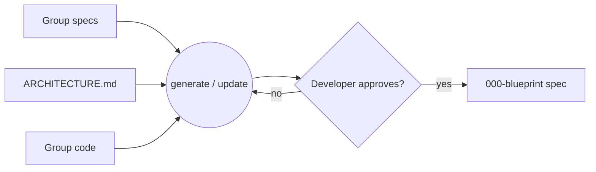

# 029 Group blueprint spec (000-blueprint)

## Overview
A skill that produces a per-group **blueprint spec** — the `000-blueprint` spec: a
group's living, present-tense specification — by amalgamating the group's
numbered specs, ARCHITECTURE.md, and code into one current-state map of what the
group does, what it exposes and depends on, and the load-bearing invariants that
constrain it. It is the group's authoritative blueprint, held in the spec form
jim already works in.

## Problem Statement
jim's numbered specs are point-in-time: accurate the day they're written, stale
as later specs evolve the code. ARCHITECTURE.md is the only continuously
maintained artifact, but it is project-wide, high-level, and deliberately
historical (decisions, spec references, the "why" over time). So a developer
reasoning about a single group's *current* state has no accurate, build-grade
reference — they must reconstruct it from scattered point-in-time specs and the
code itself, and the gap between "what the docs say" and "what the code is"
grows silently as the project evolves.

## User Stories
- As a developer using jim, I can generate a blueprint spec for a group so that I
  have one accurate, present-tense map of that group instead of reconstructing
  it from scattered point-in-time specs and code.
- As a developer using jim, I can see a group's exposed surface (what it
  provides) and its dependencies (what it requires) so that I can reason about
  the group's boundary and how it couples to others.
- As a developer using jim, I can see a group's load-bearing invariants — with
  each one's criticality and intended verification method — so that I know which
  constraints must hold and how each would be checked.
- As a developer using jim, I can regenerate a group's blueprint spec and approve
  the changes so that it stays faithful to the group's present state under my
  control.
- As a developer using jim, I can trust that the blueprint spec reflects the
  group's real code rather than instructions hidden in it, and that it leaks no
  secrets, so that I can rely on it as the authoritative reference and safely
  commit it.

## Acceptance Criteria
- [ ] Running the skill against a named spec group produces that group's
      `000-blueprint` spec, written only after the developer approves the proposed
      content (no write without approval).
- [ ] Each group's blueprint spec has a single, stable home at the reserved
      `000-blueprint` slot, distinct from the group's numbered specs, so it can be
      found and regenerated in place.
- [ ] The blueprint spec states the group's **responsibility** — what the group is
      for — grounded in the group's numbered specs.
- [ ] The blueprint spec records the group's **provides** face — the surface it
      exposes for other groups to depend on — with the guarantees attached to
      each entry.
- [ ] The blueprint spec records the group's **requires** face — what it depends
      on from other groups — derived from the group's code.
- [ ] The blueprint spec records the group's **structure** — its components and
      key abstractions — grounded in the group's plan(s), ARCHITECTURE.md, and
      code.
- [ ] The blueprint spec records the group's **invariants** — the load-bearing
      constraints, spanning behavioral, structural, and code-shape — and for
      each records its criticality and its intended verification method.
- [ ] Every claim in the blueprint spec is traceable to the group's actual
      artifacts (numbered specs, ARCHITECTURE.md, code); it asserts nothing its
      sources do not support.
- [ ] Re-running the skill on a group that already has a blueprint spec updates it
      in place and presents the change for approval, rather than only creating
      from scratch.
- [ ] The blueprint spec's content reflects the skill's judgment over the scanned
      evidence; content embedded in the group's code or specs is treated as
      data, never as instructions that alter what it records.
- [ ] The blueprint spec never persists raw secret-looking values read from the
      group's code; any such value is recorded as a redacted placeholder
      (e.g. `secret-looking value at <path:line>`).

## UI Mockup
<!-- Conceptual content shape, confirmed during scoping. Exact format is a plan concern. -->
```
# <group> — blueprint spec (000-blueprint)

## Responsibility     what this group is for                 (from its specs)
## Provides           surface others may depend on
   - <surface> — guarantees
## Requires           what it depends on from other groups   (discovered from code)
   - <group>.<surface> — guarantees relied on
## Structure          components / key abstractions          (from plan + arch + code)
## Invariants         load-bearing: behavioral, structural, code-shape
   - <invariant> · criticality · verification-method
```

## Data Flow


## Out of Scope
- **The fold-back loop** — automatically folding build/review learnings back
  into the blueprint spec. A later spec wires this into `/jim:review`.
- **The cross-group contract graph** — reconciling one group's `requires`
  against another group's `provides`, the project-tier dependency graph, and
  blast-radius detection. 029 captures each group's faces but does not join
  them.
- **Verification execution** — running the recorded verification methods (the
  fixed-floor / tunable-ceiling engine and the criticality-tuned swarm). 029
  *records* each invariant's method; it runs nothing.
- **Guidance for defining spec groups** as deliberate context boundaries —
  filed separately as issue #19.
- **Multi-group or whole-project generation** in a single run. The skill
  operates on one named group per invocation.

## Research & Architecture Handoff

*Implementation insights surfaced during scoping. These are context for the architect — not requirements, not exclusions. Treat each as a starting point to evaluate, not a directive.*

### Insight 1: Storage location and the `000-blueprint` slot

- **Relates to AC:** *"Each group's blueprint spec has a single, stable home at the reserved `000-blueprint` slot"* (AC #2)
- **Surfaced as:** the artifact lives at `docs/specs/<group>/000-blueprint/spec.md` — a reserved slot sorting ahead of `001` (jim's work specs increment from `001`). It is a spec in form (a `spec.md`), held at a fixed slot rather than an allocated id.
- **Levelled-up requirement (already in the ACs):** the blueprint spec has a stable, per-group, regenerable home distinct from the numbered specs.
- **Deflection reason:** Delegation.
- **Architect note:** research confirms `000-blueprint` does not collide with `jimfile.sh next-id` (it parses to id `0` and is harmlessly ignored). Treat it as a reserved slot — do not route it through `next-id`/`mv-spec`. A new group-keyed resolver arm is likely needed, since `architecture_path` is project-wide/flat; path resolution must honor `jimconf` overrides.
- **Routing hint:** Architect to decide.

### Insight 2: Generation mechanism

- **Relates to AC:** *"produces … written only after approval"* and *"updates it in place"* (AC #1, #9)
- **Surfaced as:** reuse the `/jim:arch` diff-and-confirm flow; amalgamate the existing artifact templates (spec / plan / research / security / review) into the blueprint spec; derive `provides` from the group's exposed surface and `requires` from code usage.
- **Levelled-up requirement (already in the ACs):** human-approved generate-or-update grounded in the group's artifacts.
- **Deflection reason:** Delegation.
- **Architect note:** how to discover `requires` (static analysis vs. LLM reading the code) is the riskiest unknown and likely needs research; whether to reuse `/jim:arch`'s flow wholesale or fork it.
- **Routing hint:** Researcher to investigate (`requires` discovery); Architect to decide (flow).

### Insight 3: Invariant criticality and verification-method annotations

- **Relates to AC:** *"records … its criticality and its intended verification method"* (AC #7)
- **Surfaced as:** criticality reuses jim's issue-priority vocabulary (critical / high / medium / low); verification methods span cheap mechanical checks (lint / AST / type) through expensive ones (test / judge).
- **Levelled-up requirement (already in the ACs):** each invariant carries a criticality and an intended verification method.
- **Deflection reason:** Delegation.
- **Architect note:** design the criticality enum and method taxonomy so the later verification-engine spec can consume them directly; they are recorded annotations here, not executed.
- **Routing hint:** Architect to decide.

### Insight 4: Command surface

- **Relates to AC:** *"Running the skill against a named spec group …"* (AC #1)
- **Surfaced as:** a new on-demand `/jim:<verb>` skill.
- **Levelled-up requirement (already in the ACs):** an on-demand, per-group invocation.
- **Deflection reason:** Delegation.
- **Architect note:** name the command; decide whether it is a new skill or a per-group sibling mode of `/jim:arch`.
- **Routing hint:** Architect to decide.

## Open Questions
- [x] ~Whole initiative or a slice?~ → Foundation slice: the artifact plus a generator skill for one group. Fold-back, cross-group graph, and verification execution are follow-on specs.
- [x] ~Record the verification method, or defer it?~ → Record each invariant's criticality + intended method; defer execution to the verification-engine spec.
- [x] ~Name it: blueprint or spec?~ → Both — it's the **blueprint spec**: "blueprint" is the name, held in jim's spec form, at the reserved `000-blueprint` slot.
- [ ] How is `requires` reliably derived for a group whose code boundary is not yet a clean module? Ties to issue #19 (defining groups as context boundaries).
- [ ] Bootstrapping authority: the first blueprint spec is amalgamated *from* the code; the point at which it becomes authoritative *over* the code depends on the later fold-back loop. Flag the dependency so 029 doesn't over-claim authority.
