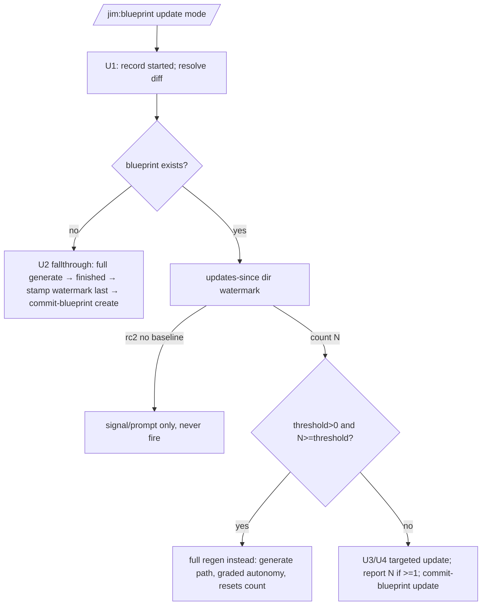

# Blueprint regen cadence — Plan

## Overview

Add a single-writer `last_full_generate` watermark (stamped only by generate
mode) and a deterministic `jimledger.sh updates-since` counter, wire the count
into `/jim:blueprint` update mode as a staleness signal, and gate an opt-in,
default-off full-regeneration on a new `blueprint_regen_threshold` config key —
plus correct the create-vs-update blueprint commit label. Script bits land first
(TDD, belt-tested); the skill-prose wiring is checklist-gated last.

## Design Decisions

### 1. Single-writer watermark, not a counter

- **Chosen:** a `last_full_generate` frontmatter field on the blueprint, written **only** by generate mode; update mode never writes it.
- **Why:** update mode stays read-only w.r.t. `spec.md`, so a fix-only update still commits `ledger.md` alone — spec 031's ledger-only-commit property (spec AC #4) holds by construction.
- **Rejected:** a two-writer counter (generate resets, update increments) — dirties `spec.md` on every update and breaks the fix-only property.

### 2. Ledger-derived count via a new `updates-since` subcommand

- **Chosen:** `jimledger.sh updates-since <dir> <iso>` clones the `phase_event_metrics` awk idiom (`jimledger.sh:275-289`), counting `blueprint finished` events with `$2 > watermark` **and** `$2 <= now`.
- **Why:** deterministic, read-only, no new state; the `<= now` upper bound closes the security-review Finding 1(b) future-dated-events vector. Timestamp compare is pure lexicographic string compare (ledger iso and `jimfile.sh now` share the identical `YYYY-MM-DDThh:mm:ssZ` format) — POSIX bash, no deps.
- **Rejected:** git-history-derived count — fragile (a fallthrough-born blueprint's create commit is indistinguishable from an update; still needs the watermark anyway).

### 3. Validation lives in `updates-since` (single hardened boundary)

- **Chosen:** `updates-since` validates the watermark against `^[0-9]{4}-[0-9]{2}-[0-9]{2}T[0-9]{2}:[0-9]{2}:[0-9]{2}Z$` and returns rc 2 on a malformed/empty watermark or a missing ledger; the skill interprets rc 2 as "no trustworthy baseline → signal/prompt, never fire".
- **Why:** the count now gates an unattended regen (security Finding 1, Notable), so validation must precede any trigger. Centralizing it in the tested script beats skill-prose validation and satisfies spec AC #8.
- **Rejected:** validating in the skill prose — untestable and easy to drift.

### 4. Watermark stamped last on the fallthrough (ordering fix)

- **Chosen:** in the U2 absent-blueprint fallthrough, stamp `last_full_generate` **after** recording the `blueprint finished` event, using a fresh `jimfile.sh now`; normal generate mode (no `finished` event) stamps at write.
- **Why:** research Peer Feedback Finding 1 — a create's own `finished` event must sit at/before the watermark so the strictly-`>` count excludes it (a fresh blueprint reads 0). `watermark >= create-finished` guarantees this.
- **Rejected:** stamp at write — the create's later `finished` event counts as a spurious +1 on the next update run.

### 5. create|update mode on `commit-blueprint`

- **Chosen:** `commit-blueprint <dir> [create|update]`, whitelisted to exactly those two, **defaulting anything else (including absent) to `update`**; subject becomes `docs(blueprint): <mode> 000-blueprint`. The U2 fallthrough passes `create`; U4 passes `update`.
- **Why:** honest git history (a first-time create is no longer mislabeled an update) and a defensive closed value set (security Finding 2). Back-compat safe: existing callers pass no mode → `update` → byte-identical.
- **Rejected:** a separate commit function — duplicates the path-scoped commit logic.

### 6. Lean one-knob threshold, reusing `auto_blueprint`

- **Chosen:** a bare-name integer `blueprint_regen_threshold` jimconf key, default `"0"` (disabled); the auto-fire-vs-prompt decision reuses the existing `auto_blueprint`.
- **Why:** mirrors the `review_fanout_cap` / `auto_security_loop_limit` integer-knob precedent; default-off keeps signal-only as the default (spec AC #5). Developer explicitly chose the lean design.
- **Rejected:** a dedicated `auto_blueprint_regen` boolean — extra config surface for no gain.
- **Fail-safe (security Finding 4):** `jimconf.sh` does not guarantee the value is an integer, and the knob gates an unattended action — so the skill treats any non-positive-integer threshold as **disabled** (signal-only, never fire), the same fail-safe posture the count takes on a bad watermark (DD3). Pinned in Task 6.

### 7. Trigger point: check at the start, regen *instead of* the targeted update

- **Chosen:** at the start of an update run, if `blueprint_regen_threshold > 0` and the pre-run count `>= threshold`, run a full whole-group regeneration **instead of** the targeted section-diff. The regen re-scans the group (which already includes the committed change the update would have folded), advances the watermark, and resets the count.
- **Why:** avoids applying a targeted edit that a full regen would immediately supersede; the triggering change is still reflected (the regen re-scans the committed source). The regen is generate mode's differential path, which already honors spec 031's graded autonomy (a `critical`/`high` downgrade still prompts under `auto_blueprint`) — so spec AC #6's "unattended but graded" behavior falls out for free.
- **Rejected:** check *after* applying the targeted update — wastes the just-applied edit; the regen would overwrite it.

## Constitution Check

**ARCHITECTURE.md status:** Present — constraints noted below.

| Constraint from ARCHITECTURE.md | Honored? | Notes |
| :--- | :--- | :--- |
| Bash + POSIX only, no third-party deps (Scripting Layer) | Yes | `updates-since` uses `awk`/string compare; no `jq`/`date -d` parsing. |
| Ledger untrusted, parse-only, never `source`d | Yes | `updates-since` counts via `awk -v`, no eval; same posture as `phase_event_metrics`. |
| `jimconf.sh` `resolve()` convention (bare-name keys) | Yes | New key added to `KEYS`, default case, and the bare-name arm at `jimconf.sh:116`. |
| `allowed-tools` exact-path grants | Yes | No change — blueprint already wildcards `jimledger.sh *` and `jimconf.sh *`. |
| Single-emitter / path-scoped commit (`commit-blueprint`) | Yes | Mode arg only swaps the subject; still `git add/commit -- spec.md ledger.md`. |
| SKILL.md ≤ 500 lines | Yes | blueprint SKILL.md is 307 lines; additions are modest — Task 8 asserts the ceiling. |
| Sentinel/directive vocabulary (no retired EXISTS forms) | Yes | New conditionals are prose / `SET`/`IF` per the meta-matrix conventions. |
| Watermark never content-derived (trust boundary, specs 026/029/030/031) | Yes | Stamped solely from `jimfile.sh now`; DD8 states it in the skill (security Finding 3). |

## File Manifest

| Component | File Path | Action | Notes |
| :--- | :--- | :--- | :--- |
| Ledger script | `skills/review/scripts/jimledger.sh` | Update | Add `updates-since` subcommand + dispatch arm; add `[create\|update]` mode arg to `cmd_commit_blueprint`. |
| Ledger tests | `tests/jimledger.sh` | Update | Belt cases for `updates-since` (count / boundary / future-dated / malformed / missing) and `commit-blueprint` create-vs-update subject. |
| Config script | `skills/conf/scripts/jimconf.sh` | Update | Add `blueprint_regen_threshold` to `KEYS`, default `"0"`, bare-name resolve arm. |
| Config tests | `tests/jimconf.sh` | Update | Default `"0"` + override case for the new key. |
| Blueprint template | `skills/blueprint/assets/blueprint-template.md` | Update | Add `last_full_generate` frontmatter field. |
| Blueprint skill | `skills/blueprint/SKILL.md` | Update | Generate-mode watermark stamp; U2 `create` + stamp-watermark-last; U4 count report + threshold trigger; watermark-is-`now` note; checklist rows. |
| Conf skill (if it enumerates keys) | `skills/conf/SKILL.md` | Update | Add the key to any user-facing key list (verify during Task 3; skip if not enumerated). |

## Interface Contracts

```
# jimledger.sh updates-since <blueprint-dir> <watermark-iso>
#   Validates <watermark-iso> matches ^[0-9]{4}-[0-9]{2}-[0-9]{2}T[0-9]{2}:[0-9]{2}:[0-9]{2}Z$.
#   rc 2  → missing dir/ledger, OR malformed/empty watermark (caller: "no baseline").
#   rc 0  → prints integer count of ledger lines where
#           $3=="blueprint" && $4=="finished" && $2 > watermark && $2 <= now
#           (now = date -u +%Y-%m-%dT%H:%M:%SZ, computed in-script).

# jimledger.sh commit-blueprint <blueprint-dir> [create|update]
#   mode defaults to "update"; any value other than "create" maps to "update".
#   Commits spec.md + ledger.md (path-scoped) with subject
#   "docs(blueprint): <mode> 000-blueprint".

# jimconf.sh get blueprint_regen_threshold
#   Bare-name integer key, default "0" (disabled). >0 enables the regen threshold.
```

## Data Flow



## Task Breakdown

1. [x] **`commit-blueprint` create|update mode** in `skills/review/scripts/jimledger.sh` — add an optional 2nd arg; whitelist to `create`|`update`, default `update`; interpolate into the subject. Add belt cases in `tests/jimledger.sh` (create → `create` subject; absent/other → `update` subject) — Red first.
   **Verify:** `bash tests/jimledger.sh commit_blueprint 2>&1 | tail -1`

2. [x] **`updates-since` subcommand** in `jimledger.sh` per the Interface Contract — add `cmd_updates_since` + a `updates-since)` dispatch arm; validate watermark, bound to `<= now`. Add belt cases (count N; events at/before watermark excluded; future-dated excluded; malformed watermark → rc 2; missing ledger → rc 2) — Red first.
   **Verify:** `bash tests/jimledger.sh updates_since 2>&1 | tail -1`

3. [x] **`blueprint_regen_threshold` config key** in `skills/conf/scripts/jimconf.sh` — add to `KEYS`, add `blueprint_regen_threshold) echo "0" ;;` to the default case, and add it to the bare-name condition at `jimconf.sh:116`. Add a `tests/jimconf.sh` case (default `"0"` + a `-c` override). Update `skills/conf/SKILL.md` only if it enumerates keys. Red first.
   **Verify:** `bash tests/jimconf.sh blueprint_regen 2>&1 | tail -1; bash skills/conf/scripts/jimconf.sh get blueprint_regen_threshold`

4. [x] **`last_full_generate` field** in `skills/blueprint/assets/blueprint-template.md` frontmatter (after `updated`).
   **Verify:** `grep -q '^last_full_generate:' skills/blueprint/assets/blueprint-template.md && echo OK`

5. [x] **Generate-mode watermark stamp + fallthrough ordering** in `skills/blueprint/SKILL.md` — Step 5 stamps `last_full_generate: <jimfile.sh now>` on write (stamped solely from `now`, never content-derived — DD8); U2 fallthrough records `blueprint finished`, **then** stamps the watermark (fresh `now`), **then** `commit-blueprint <dir> create`; add checklist rows for both.
   **Verify:** `grep -q 'last_full_generate' skills/blueprint/SKILL.md && grep -q 'commit-blueprint .*create' skills/blueprint/SKILL.md && echo OK`

6. [x] **U4 count report + threshold trigger** in `skills/blueprint/SKILL.md` — read `last_full_generate`; call `updates-since`; on rc 2 treat as no baseline (signal/prompt, never fire); on a count ≥ 1 report "N targeted updates since last full generate"; read `blueprint_regen_threshold` and **treat any value that is not a positive integer as disabled — signal-only, never fire** (fail-safe, security Finding 4); otherwise if count ≥ threshold, run a full regen instead (unattended under `auto_blueprint` honoring spec 031 graded autonomy; else prompt); pass `update` to `commit-blueprint`. Add checklist rows, including one asserting a malformed/non-positive threshold never fires.
   **Verify:** `grep -q 'updates-since' skills/blueprint/SKILL.md && grep -q 'blueprint_regen_threshold' skills/blueprint/SKILL.md && echo OK`

7. [x] **Full deterministic suite green + fix-only property intact.** Confirm no regression, in particular `case_jimledger_commit_blueprint_ledger_only` (spec 031 / AC #4).
   **Verify:** `bash skills/meta-test/scripts/run.sh 2>&1 | tail -3`

8. [x] **SKILL.md ceiling check.**
   **Verify:** `test "$(wc -l < skills/blueprint/SKILL.md)" -le 500 && echo OK`

## Requirements Coverage Summary

| Spec Acceptance Criterion | Addressed In Task(s) |
| :--- | :--- |
| AC #1 — cadence signal shown in update mode (suppress 0) | 6 |
| AC #2 — baseline is the last full generate (watermark) | 4, 5 |
| AC #3 — surfaces in both interactive and auto paths | 6 |
| AC #4 — fix-only ledger-only-commit preserved | 1 (design), 7 (regression guard) |
| AC #5 — opt-in threshold, default off (signal-only default) | 3, 6 |
| AC #6 — threshold-triggered regen (auto/graded vs prompt) | 6, 7 (DD7) |
| AC #7 — first-time create labeled as a create | 1, 5 |
| AC #8 — graceful/no-fire without a trustworthy baseline/count | 2 (rc 2 boundary), 6 |

## Out of Scope

- **`ARCHITECTURE.md` refresh for the new config key + subcommand.** Pipeline-owned — the `/jim:build` completion gate runs `/jim:arch`. Not a deferral, not an issue.
- **Back-stamping `last_full_generate` into existing blueprints.** Spec Out of Scope — they self-heal on the next full generate.
- **A `blueprint_*` config prefix arm.** A single key uses a specific bare-name match; a prefix arm is only warranted if more blueprint keys arrive.

## Open Questions

- [x] ~Where does watermark validation live?~ → In `updates-since` (rc 2), the single tested boundary (DD3).
- [x] ~Check the threshold before or after the targeted update?~ → Before; regen instead of the targeted edit (DD7).
- [x] ~One config knob or two?~ → One integer key; reuse `auto_blueprint` (DD6).
- None blocking.
