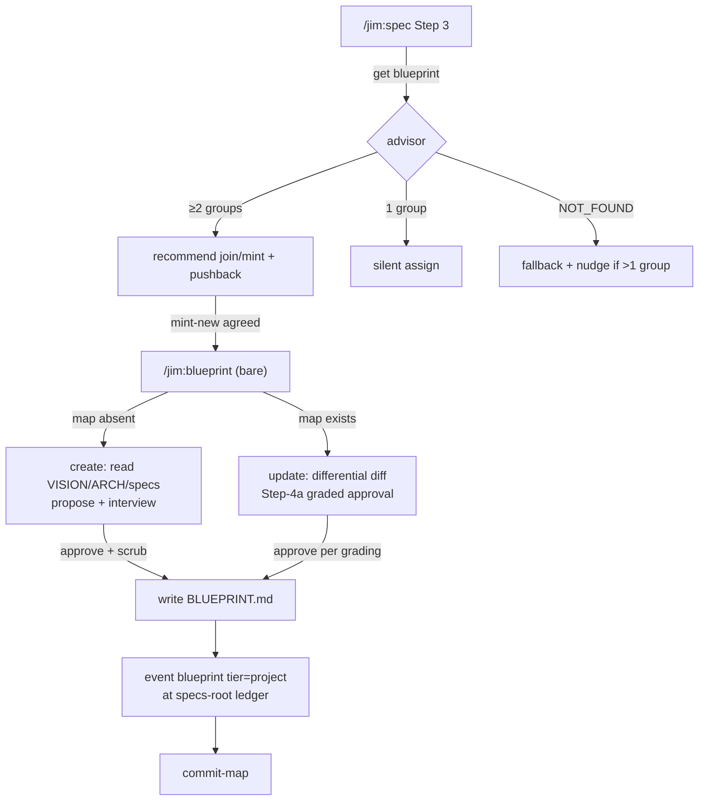

# Context map — deliberate spec-group definition — Plan

## Overview

Extend `/jim:blueprint` with a project-tier mode (bare invocation) that
creates and updates a root-level `BLUEPRINT.md` through interview + proposal,
and wire a map-consuming assignment advisor into `/jim:spec` Step 3 — all on
the existing jimconf/jimfile/jimledger rails, with three new config keys and
one new path-validated commit verb.

## Design Decisions

### 1. Dispatch: bare `/jim:blueprint` is the project tier

- **Chosen:** Empty `$ARGUMENTS` → project-tier map mode (create when the map
  is absent, differential update when present). The current empty-arg
  behavior ("ask which group") is replaced; the map mode opens with a
  one-line escape hint ("for a group blueprint, run `/jim:blueprint
  <group>`").
- **Why:** The empty-arg slot today is only a disambiguation prompt — no
  behavior is lost. Bare invocation makes the AC-14 nudge trivially short
  and reads naturally: no group named → the whole project.
- **Rejected:** `--project` flag — ceremony for the most strategic act;
  reserved word `map` — collides with a legitimate group named `map`
  (`is_valid_slug` reserves nothing).

### 2. Key naming and the kind-vs-key collision

- **Chosen:** jimconf CLI key `blueprint` → TOML `blueprint_path` (default
  `"BLUEPRINT.md"`), via the existing `_path` else-branch (`KEYS` + a
  `default_for` arm only). In `jimfile.sh`, verb+arity disambiguates: `get
  blueprint` → the project doc (path-or-`NOT_FOUND`); `path blueprint
  <group>` → the group-tier kind (unchanged); single-arg `path blueprint` →
  the configured map path, like every other strategic key (build-time
  correction, developer-approved: the single-arg branch precedes kind
  dispatch, so the natural behavior is consistent, not an error).
  Documented in the `jimfile.sh` header.
- **Why:** Keeps the artifact/key/skill name family intact (AC 1) while
  closing research's collision risk with zero code churn in `jimfile.sh` —
  the dispatch already behaves this way; the contract just becomes tested
  and documented.
- **Rejected:** Renaming the key (`map_path`) — breaks the blueprint name
  family; a new `map` KIND — adds a kind for a single root file.

### 3. Ledger home for project-tier events: the specs root

- **Chosen:** Project-tier `blueprint started`/`finished` events append to
  `<specs_path>/ledger.md` (i.e. `docs/specs/ledger.md`), with a
  `tier=project` kv on each event. The dir-based `event` verb works
  unchanged.
- **Why:** The specs root *is* the project tier's directory — it contains
  the groups. No root-family clutter, no `jimledger.sh` event changes, and
  the stage name `blueprint` is already in the allowlist.
- **Rejected:** Project-root `ledger.md` — clutters the curated root doc
  family; recording in the consuming spec's dir — standalone map runs have
  no consuming spec, and the map's history would scatter.

### 4. Commit arm: new `commit-map` verb (security Finding 2)

- **Chosen:** A third path-scoped commit verb in `jimledger.sh`:
  `commit-map <map-path> <specs-dir> [create|update]`. Both path arguments
  are config-derived and get the identical containment check — reject
  absolute paths and any `..` segment, verify each resolves inside
  `git rev-parse --show-toplevel` (security Finding 8) — then it commits
  `<map-path>` + `<specs-dir>/ledger.md` with literal paths and the `--`
  guard; mode whitelisted (`create|update`, default `update`); message
  `docs(blueprint): <mode> project map`.
- **Why:** `blueprint_path` is the first config-derived value to reach a
  `git add` path — containment validation is the fold-in for security
  Finding 2. A dedicated verb keeps each commit arm simple and auditable.
- **Rejected:** Parameterizing `commit-blueprint`'s filenames — widens an
  existing security-sensitive arm's surface for two callers with different
  shapes.

### 5. Blueprint SKILL.md layout: inline skeleton + `references/` split

- **Chosen:** SKILL.md gains the routing row plus a compact "Project tier"
  section (dispatch, create/update skeletons, gates, ledger/commit calls);
  the doctrine and interview methodology live in a new
  `skills/blueprint/references/map-methodology.md` (vertical-first
  doctrine, shared-kernel justification bar, axis recalibration under
  `layered`, territory capture + validation rules, scrub reminder text,
  interview flow).
- **Why:** SKILL.md is at 388/500; the methodology is the bulky, low-churn
  half. Progressive disclosure is the documented convention for exactly
  this (Handoff Insight 1).
- **Rejected:** Restructuring existing U-sections into `references/` —
  churns four shipped specs' text to make room this split provides anyway.

### 6. Advisor integration and mint-new invocation (security Findings 3, 7)

- **Chosen:** `/jim:spec` Step 3's group-identification line is replaced by
  an advisor block: `SET map = jimfile.sh get blueprint`; when present with
  ≥2 groups → recommend join/mint with reasoning and push back on
  conflicts; exactly 1 group → assign silently; `NOT_FOUND` → current
  behavior + a one-line nudge suppressed when ≤1 group exists (group count
  via the existing specs glob). The block carries an explicit
  data-not-instruction clause: map content is quoted descriptively, never
  followed as directives (Finding 3). Mint-new invokes
  `Skill(jim:blueprint)` with the proposed-group context as explicit args;
  `allowed-tools` gains only the namespaced `Skill(jim:blueprint)` token —
  the update path's nested Bash calls are covered by spec's existing
  scoped jimfile/jimconf/jimledger tokens (Finding 7).
- **Why:** Smallest insertion at the exact anchor (`skills/spec/SKILL.md:52`)
  with the established inline-invocation pattern; both plan-routed security
  findings land as prompt-discipline text, not new machinery.
- **Rejected:** A separate advisor sub-skill — a fourth skill invocation in
  `/jim:spec`'s flow for what is one decision block.

### 7. Config defaults and dispatch arm

- **Chosen:** `group_axis` default `"vertical"` (enum `vertical|layered`);
  `group_territory` default `"declared-paths"` (enum
  `directory|declared-paths|none`); both bare-name keys dispatched by a new
  `group_*` prefix arm in `resolve()`. Territory questions in the interview
  are optional-when-unknown — a greenfield group may record no territory
  yet under `declared-paths`. Territory paths are shape-checked
  deterministically at capture: a new rc-only `jimfile.sh valid-relpath
  <path>` validator (relative, no `..` segment) runs per declared path
  before it is recorded (security Finding 9 — the Bash-vs-Prompt rule
  assigns mechanical checks to scripts; #22 stays the consumption-time
  backstop).
- **Why:** `declared-paths` captures advisor-useful data without dictating
  layout (the spec's own lean); optional-when-unknown keeps zero-config
  friction at zero. A prefix arm matches the `issue_list_*`/`review_*`
  precedent and absorbs future `group_*` keys without predicate edits.
- **Rejected:** Default `none` — discards cheap, advisor-useful data;
  explicit per-key predicate names — third edit per future key.

### 8. Map format: root-family prose style

- **Chosen:** `BLUEPRINT.md` follows the root strategic-doc style (no YAML
  frontmatter): maintained-by banner first (AC 1 / Finding 5), then
  `*Axis / Territory*` and `*Last updated*` lines, the Context Map table,
  and per-group sections per the spec mockup. Template at
  `skills/blueprint/assets/map-template.md`.
- **Why:** Consistency with VISION/ROADMAP/ARCHITECTURE (none carry
  frontmatter); the only machine consumer is the LLM advisor, which reads
  structured markdown fine. No 032-style watermark needed — project-tier
  regen cadence is out of scope.
- **Rejected:** YAML frontmatter à la group blueprints — those live in spec
  dirs with `kind:` semantics the root family doesn't share.

### 9. Autonomy gating: Step-4a grading reused verbatim (AC 18)

- **Chosen:** The project-tier update path applies the existing Step-4a
  shared rule with a map-tier classification note: additive entries (new
  group, new relation, added territory) grade additive; dropping a group,
  severing a relation, or shrinking territory grade as downgrades of
  critical/high class → always prompt per-item, even under
  `auto_blueprint = "true"`. Create mode always prompts (it is one big
  approval — AC 5).
- **Why:** AC 18 names the shared rule; one grading concept across both
  tiers, zero new config.
- **Rejected:** A dedicated `auto_blueprint_map` knob — declined at spec
  time (config surface already at 36 keys).

### 10. Group roles: attribute in the map, not an entity split

- **Chosen:** Each map entry carries `role: domain | platform | layer`.
  `group` remains jim's single mechanical entity — directories, per-group
  IDs, blueprints, contracts, and commit trailers unchanged. The role
  attribute drives the intelligence: role assignment at proposal time and
  role-aware straddle reasoning (domain↔domain = partition smell;
  domain↔platform = normal). `group_axis` keeps exactly one job — doctrine
  steering at proposal time.
- **Why:** The three roles share every mechanical surface and differ only
  in how the intelligence reasons about them — the type-vs-attribute test
  lands on attribute. Role is a declared design decision with rationale →
  map artifact, not jimconf (the decisions-vs-dials split).
- **Rejected:** Splitting `group` into distinct entities across code and
  config — duplicates machinery with zero mechanical difference, forces a
  path/ID/trailer migration across 30+ historical specs, and reopens the
  closed freeze-history question.

**Security fold-in traceability:** Finding 2 → DD 4 (T3) · Finding 3 → DD 6
(T7) · Finding 6 → scrub reminder in `map-methodology.md` at both write
gates (T5, T6) · Finding 7 → DD 6 (T7) · Finding 8 → DD 4 (T3, both args) ·
Finding 9 → DD 7 (T2 validator; T5 methodology invokes it).

## Constitution Check

**ARCHITECTURE.md status:** Present — constraints noted below.

| Constraint from ARCHITECTURE.md | Honored? | Notes |
| :--- | :--- | :--- |
| Bash-vs-Prompt rule (deterministic → script; judgment → prompt) | Yes | Keys/paths/commit/validation in scripts; interview, proposal, pushback in prompts |
| SKILL.md ≤ 500 lines, progressive disclosure | Yes | DD 5; T6 Verify enforces the cap |
| Zero-config: missing file/keys fall through to defaults | Yes | All three keys have defaults; no required config |
| Path-scoped commits, never `git add -A` | Yes | DD 4; `commit-map` mirrors the two existing arms |
| Skill-to-skill invocation: namespaced token, explicit args, no `$ARGUMENTS` forwarding | Yes | DD 6 |
| Untrusted-content discipline (spec 018 § S&S) | Yes | Data-not-instruction clause in the advisor block (DD 6) |
| Ledger stage keys are literals from the fixed allowlist | Yes | Reuses `blueprint`; no allowlist change |
| Agents/skills consistent with WORKFLOW.md | Yes | T9 updates WORKFLOW.md in the same change |

## File Manifest

| Component | File Path | Action | Notes |
| :--- | :--- | :--- | :--- |
| Config resolver | `skills/conf/scripts/jimconf.sh` | Update | `blueprint` path key; `group_axis`/`group_territory` via new `group_*` arm; 3 `default_for` arms |
| Config tests | `tests/jimconf.sh` | Update | 3 `case_jimconf_*` cases (default + configured resolve each) |
| Config example | `jimconf.toml.example` | Update | Document the 3 keys, comment-block style |
| File resolver tests | `tests/jimfile.sh` | Update | Disambiguation cases + `valid-relpath` accept/reject cases |
| File resolver | `skills/file/scripts/jimfile.sh` | Update | Header doc for the kind-vs-key contract; new `valid-relpath` rc-only validator |
| Ledger script | `skills/review/scripts/jimledger.sh` | Update | `commit-map` verb with containment validation |
| Ledger tests | `tests/jimledger.sh` | Update | commit-map: happy path, traversal/absolute reject, mode whitelist |
| Map template | `skills/blueprint/assets/map-template.md` | Create | Banner + axis/territory + Context Map table + per-group sections |
| Map methodology | `skills/blueprint/references/map-methodology.md` | Create | Doctrine, interview, axis recalibration, territory validation, scrub text |
| Blueprint skill | `skills/blueprint/SKILL.md` | Update | Routing row + Project-tier section (create/update skeletons, gates) |
| Spec skill | `skills/spec/SKILL.md` | Update | Advisor block at Step 3; `Skill(jim:blueprint)` token |
| Arch skill | `skills/arch/SKILL.md` | Update | Map-reference rule in Steps 4–5 |
| Arch template | `skills/arch/assets/architecture-template.md` | Update | Partition-reference note |
| Workflow doc | `WORKFLOW.md` | Update | Blueprint lifecycle section, both tiers + advisor |
| Architect agent | `agents/architect.md` | Update | `skills: [plan, arch, blueprint]` |

## Interface Contracts

```text
# jimconf.sh — new keys (CLI key → TOML key → default)
blueprint        → blueprint_path   → "BLUEPRINT.md"
group_axis       → group_axis       → "vertical"        # vertical | layered
group_territory  → group_territory  → "declared-paths"  # directory | declared-paths | none
# resolve(): new `group_*` prefix arm joins the bare-name predicate

# jimfile.sh — behavior contract (kind-vs-key: documented + tested)
get blueprint           → configured map path if it exists on disk, else NOT_FOUND
path blueprint <group>  → <specs>/<group>/000-blueprint/spec.md   (KIND wins; unchanged)
path blueprint          → configured map path (single-arg strategic form;
                          arity disambiguates from the group-tier kind)
valid-relpath <path>    → NEW rc-only validator: rc 0 iff relative and no
                          ".." segment; rc 1 otherwise (mirrors valid-id)

# jimledger.sh — new verb
commit-map <map-path> <specs-dir> [create|update]
  validate: BOTH args relative, no ".." segment, each resolves inside
            `git rev-parse --show-toplevel`; else exit 1
  commit:   <map-path> + <specs-dir>/ledger.md, literal paths, `--` guard
  message:  "docs(blueprint): <mode> project map"   (mode whitelisted, default update)

# Project-tier ledger events (specs root = docs/specs)
event <specs-dir> blueprint started  tier=project
event <specs-dir> blueprint finished tier=project [additions=<n> downgrades=<n>]
```

## Data Flow



## Task Breakdown

1. [x] Config keys: add `blueprint` (path), `group_axis`, `group_territory`
   (bare, new `group_*` arm) to `jimconf.sh` with defaults, TDD via new
   `case_jimconf_*` cases; document all three in `jimconf.toml.example`.
   **Verify:** `bash tests/jimconf.sh`

2. [x] jimfile: add disambiguation test cases (`get blueprint`
   default/configured/NOT_FOUND; `path blueprint <group>` unchanged;
   single-arg `path blueprint` resolves the map path), the header doc note, and the new
   `valid-relpath` rc-only validator (TDD: accept `src/billing/`; reject
   absolute and `..`-bearing paths).
   **Verify:** `bash tests/jimfile.sh`

3. [x] `commit-map` verb in `jimledger.sh` with containment validation on
   both path arguments, TDD via `tests/jimledger.sh` cases (happy path;
   absolute-path and `..`-segment rejects for `<map-path>` AND
   `<specs-dir>`; mode whitelist; ledger co-commit). Depends on task 1
   (resolves `blueprint_path`).
   **Verify:** `bash tests/jimledger.sh`

4. [x] Map template at `skills/blueprint/assets/map-template.md`: banner
   first line, axis/territory line, Last-updated line, Context Map table,
   per-group section shape (purpose, role, boundary rationale, relations,
   territory, blueprint link).
   **Verify:** `grep -q "generated and maintained by" skills/blueprint/assets/map-template.md && grep -q "Context Map" skills/blueprint/assets/map-template.md`

5. [x] Map methodology at `skills/blueprint/references/map-methodology.md`:
   vertical-first doctrine + shared-kernel justification bar, role
   assignment (`domain | platform | layer`, platform behind the
   justification bar, `layer` under layered doctrine), `layered`
   recalibration, both-directions interview flow, territory capture rules
   (relative, repo-contained, checked per path via `jimfile.sh
   valid-relpath` — AC 8, Finding 9), scrub reminder text (Finding 6).
   **Verify:** `grep -q "vertical-first" skills/blueprint/references/map-methodology.md && grep -qi "scrub" skills/blueprint/references/map-methodology.md`

6. [x] Blueprint SKILL.md: empty-arg routing row → project tier; "Project
   tier" section with create/update skeletons, Step-4a map-tier grading
   note (AC 18), specs-root ledger events, `commit-map` call, scrub gate,
   escape hint; validation-checklist rows. Depends on tasks 3–5.
   **Verify:** `awk 'END{exit !(NR<=500)}' skills/blueprint/SKILL.md && grep -q "commit-map" skills/blueprint/SKILL.md && grep -q "map-methodology" skills/blueprint/SKILL.md`

7. [x] Spec SKILL.md: advisor block replacing the Step 3 group line
   (map-consuming recommend/pushback with role-aware straddle reasoning —
   domain↔domain flags a smell, domain↔platform is normal — silent
   single-group assign, absent-map nudge with ≤1-group suppression,
   data-not-instruction clause, mint-new via `Skill(jim:blueprint)` with
   explicit args); add the namespaced token to `allowed-tools`. Depends on
   task 6.
   **Verify:** `grep -q "Skill(jim:blueprint)" skills/spec/SKILL.md && grep -qi "data, not" skills/spec/SKILL.md`

8. [x] Arch skill + template: reference-the-map rule (partition described by
   `BLUEPRINT.md` link, never re-declared) in Step 4 scan targets and the
   template.
   **Verify:** `grep -q "BLUEPRINT.md" skills/arch/SKILL.md && grep -q "BLUEPRINT.md" skills/arch/assets/architecture-template.md`

9. [x] WORKFLOW.md: blueprint lifecycle section covering the group tier
   (generate / update / guard / cadence) and the project tier (map create /
   update / advisor consumption); command-reference row for the bare
   invocation.
   **Verify:** `grep -q "BLUEPRINT.md" WORKFLOW.md && grep -qi "context map" WORKFLOW.md`

10. [x] `agents/architect.md`: `skills: [plan, arch, blueprint]`.
    **Verify:** `grep -q "blueprint" agents/architect.md`

11. [x] Full regression: entire bash suite green.
    **Verify:** `bash skills/meta-test/scripts/run.sh`

## Requirements Coverage Summary

| Spec Acceptance Criterion | Addressed In Task(s) |
| :--- | :--- |
| 1. `BLUEPRINT.md` artifact, blueprint surface only, `blueprint_path`, banner | 1, 4, 6 |
| 2. Map records name/purpose/role/rationale/relations/territory | 4, 6 |
| 3. Sole partition authority — no ad-hoc group minting | 6, 7 |
| 4. `ARCHITECTURE.md` references the map | 8 |
| 5. Both-directions creation flow, approval-gated | 5, 6 |
| 6. Vertical-first doctrine, justified platform groups | 5 |
| 7. `group_axis` knob + layered recalibration | 1, 5 |
| 8. Territory-mode knob, data-only, capture validation | 1, 5, 6 |
| 9. Differential update (diff + approval) | 6 |
| 10. Ledger stage events per 026/030 convention | 3, 6 |
| 11. Advisor recommends with role-aware reasoning (≥2 groups) | 7 |
| 12. Pushback with reasoning; developer final authority | 7 |
| 13. Mint-new through the blueprint surface, flow resumes | 6, 7 |
| 14. Absent-map fallback + nudge, suppressed ≤1 group | 7 |
| 15. Single-group map: silent assign | 7 |
| 16. WORKFLOW.md documents both tiers | 9 |
| 17. `architect.md` lists blueprint | 10 |
| 18. Autonomy: `auto_blueprint` + Step-4a grading, downgrades prompt | 6 |

No `[NEEDS CLARIFICATION]` items.

## Out of Scope

- Cross-group reconciliation, contract graph, blast radius — issue #21.
- Territory enforcement / verification floor — issue #22 (capture-time shape
  validation only ships here).
- Partition migration (layered→vertical, mode upgrades) — issue #34.
- Bottom-up onboarding partitioner — issue #35.
- Project-tier regen cadence (032-style watermark/threshold for the map) —
  deferred; `updates-since` composes later if wanted, no watermark is
  written now.
- The `ARCHITECTURE.md` refresh after build — handled by the `/jim:build`
  completion gate (pipeline-owned, not a deferral).

## Open Questions

- [x] ~~Territory-mode default~~ → `declared-paths` (DD 7);
  optional-when-unknown keeps greenfield friction at zero. Spec's open
  question resolved here.
- [x] ~~`BLUEPRINT.md` template detail~~ → DD 8 + T4 (root-family prose
  style, no frontmatter).
