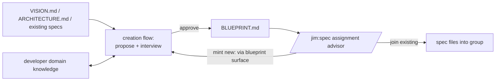

# 033 Context map — deliberate spec-group definition

## Overview

Give jim a project-tier context map — `BLUEPRINT.md`, created and maintained
through the `/jim:blueprint` surface — plus an assignment advisor in
`/jim:spec` that consumes it, so spec groups become deliberately drawn bounded
contexts instead of filing accidents. Directly serves the vision's
"maintain architectural consistency" claim by making the partition itself a
designed, checkable artifact.

## Problem Statement

The blueprint model (specs 029–032) promotes the spec group from a filing
convention to a load-bearing context boundary: each group carries a
provides/requires surface, verification contracts, and external consumers.
But group choice today is ad hoc — a name picked because it fits the spec at
hand. Careless seams propagate into every downstream artifact: blueprints
over bad boundaries are accurate but low-value (fat, chatty faces; contracts
that verify little; blast radius reporting "everything affects everything"),
and each artifact invested in a wrong seam raises the cost of eventual
re-partitioning.

Developers can't reliably draw these boundaries unaided — domain and context
partitioning is hard, and at spec-filing time their attention is on the
feature, not the whole-application picture. The partitions that emerge
naturally (layered: `foundation` / `storage` / `dashboard`) make nearly every
feature spec straddle every group by construction, which is the worst shape
for the blueprint machinery.

Sequencing context: this capability is a prerequisite for multi-group
blueprint adoption and for issues #21/#22 (the contract graph's project-tier
home is `BLUEPRINT.md`, superseding the earlier ARCHITECTURE.md-tier
placement — recorded in issue #21).

## User Stories

- As a developer starting a multi-group project, I can have jim propose a
  context map grounded in my vision and domain knowledge so that group
  boundaries are deliberate bounded contexts, not filing accidents.
- As a developer filing a spec, I can see a reasoned recommendation for which
  group it joins so that specs land in cohesive contexts.
- As a developer whose spec fits no existing group, I can mint the new group
  through a guided interview without abandoning my spec-filing flow so that
  the map stays authoritative while I keep my context.
- As a developer who disagrees with jim's grouping analysis, I can argue it
  out and keep final authority so that the partition remains mine.
- As a developer on a single-group project, I can file specs with no added
  overhead so that the machinery never taxes simple projects.

## Acceptance Criteria

**The map artifact**

- [ ] 1. A project-tier `BLUEPRINT.md` exists as a first-class jim artifact:
  written only through the `/jim:blueprint` surface, located at the project
  root by default, path configurable via a `blueprint_path` config key
  (consistent with the other strategic-doc path keys). The artifact opens
  with a maintained-by banner ("generated and maintained by
  `/jim:blueprint` — edit via the skill"), mirroring `ARCHITECTURE.md`'s
  (security.md Finding 5).
- [ ] 2. The map records, for every group: name, purpose, boundary rationale,
  relations to other groups, and — when the territory mode calls for it —
  the group's declared code territory (see mockup).
- [ ] 3. `BLUEPRINT.md` is the sole authority for the partition: a new group
  can come into being during any jim flow only through the map surface,
  never as an ad-hoc side effect of spec filing.
- [ ] 4. When `ARCHITECTURE.md` is regenerated in a project that has a
  `BLUEPRINT.md`, the architecture document references the map for the
  partition rather than re-declaring it (no second copy to drift).

**Creation and update (project-tier mode of `/jim:blueprint`)**

- [ ] 5. Invoking the project-tier mode with no existing map runs a creation
  flow that works in both directions: it reads strategic context
  (vision, architecture, existing specs — where present) and proposes a
  partition with per-group reasoning, and it interviews the developer for
  domain knowledge the documents don't carry. The map is written only after
  explicit developer approval — never silently.
- [ ] 6. The proposal applies the vertical-first doctrine: groups are
  proposed as domain-vertical bounded contexts; a horizontal / platform /
  shared-kernel group is proposed only with an explicit justification of its
  shared surface.
- [ ] 7. A `group_axis` config knob (default `vertical`) provides the layered
  escape hatch; under `layered`, doctrine guidance and straddle messaging
  recalibrate (straddling is expected, not flagged as a partition smell).
- [ ] 8. A territory-mode config knob selects how group↔code binding is
  captured — `directory` (group owns a subtree), `declared-paths` (map lists
  the group's code locations), or `none` (no code binding). Territory is
  recorded in the map as data only; no enforcement ships in this spec.
  Territory declarations are validated at capture — relative,
  repo-contained paths only (security.md Finding 4).
- [ ] 9. Re-invoking the project-tier mode with an existing map runs a
  differential update: proposed changes are presented as a diff against the
  current map and applied on approval, consistent with the group-tier
  blueprint update conventions.
- [ ] 10. Map creation and update record stage boundaries on the jim ledger
  consistent with the group-tier blueprint stage events (the stage-event
  convention of specs 026/030).

**Assignment advisor (`/jim:spec`)**

- [ ] 11. When `BLUEPRINT.md` exists and holds ≥2 groups, `/jim:spec`'s
  group-identification step consumes the map and recommends join-existing or
  mint-new, with stated reasoning grounded in the target group's purpose and
  boundary rationale.
- [ ] 12. When the developer's choice conflicts with the advisor's analysis,
  the advisor pushes back with reasoning and engages the discussion; the
  developer retains final authority — the advisor never blocks filing.
- [ ] 13. Mint-new: once developer and advisor agree a new group is
  warranted, the map is updated through the blueprint surface — including
  its interview — before the spec files into the new group, and the
  spec-filing flow resumes where it left off.
- [ ] 14. Absent map: `/jim:spec` falls back to current group-identification
  behavior plus a one-line, non-blocking nudge to draw the context map; the
  nudge is suppressed when the project has ≤1 existing group.
- [ ] 15. On a project whose map holds a single group, the advisor assigns to
  it without interactive overhead.

**Ecosystem consistency**

- [ ] 16. `WORKFLOW.md` documents the blueprint surface at both tiers — the
  existing group-tier lifecycle (generate / update / guard / cadence, specs
  029–032) and the new project-tier map mode and assignment advisor
  (sourced: ARCHITECTURE.md's WORKFLOW.md single-source-of-truth
  constraint).
- [ ] 17. `agents/architect.md` lists `blueprint` in its `skills:`
  frontmatter, matching the skill's declared `agent: architect` ownership
  (sourced: the `pm.md` convention of preloading all owned skills).

**Security (routed from security.md)**

- [ ] 18. Project-tier map autonomy is user-controlled through config,
  mirroring the group tier: map updates honor `auto_blueprint` under the
  shared Step-4a grading (spec 031) — additive changes (e.g. a newly
  minted group) may write unattended when the knob is `"true"`, while any
  weakening or removal (dropping a group, severing a relation, shrinking
  territory) always prompts per-item. The default (`"false"`) keeps every
  map change human-approved (security.md Finding 1, revised).

## UI Mockup

`BLUEPRINT.md` shape (illustrative content):

```markdown
# Blueprint — acme-shop

*Axis: vertical · Territory: declared-paths*
*Last updated: 2026-07-03 (via /jim:blueprint)*

## Context Map

| Group    | Purpose                          | Relations                  |
|----------|----------------------------------|----------------------------|
| accounts | Identity, auth, profiles         | provides → billing, orders |
| billing  | Charges, invoices, payment state | requires ← accounts        |
| orders   | Cart, checkout, fulfillment      | requires ← accounts        |
| platform | Shared kernel: config, telemetry | provides → all (justified) |

## Groups

### billing

- **Purpose:** Charges, invoices, and payment lifecycle.
- **Boundary rationale:** Distinct domain language (invoice, charge,
  settlement); changes driven by payment-provider churn, isolated here.
- **Relations:** requires `accounts` (customer identity).
- **Territory:** `src/billing/`, `api/billing/`
- **Blueprint:** docs/specs/billing/000-blueprint/
```

Advisor moment in `/jim:spec` (illustrative):

```
Reading BLUEPRINT.md (4 groups)…

Recommendation: billing — this spec changes invoice line-item rounding,
which sits inside billing's declared purpose (payment lifecycle) and
touches its territory (src/billing/).

You suggested dashboard. Pushback: dashboard's boundary rationale is
read-only presentation; a rounding rule is billing domain logic — filing
it under dashboard would put a billing invariant outside its context.

join billing (recommended) / keep dashboard / mint new group / discuss
```

## Data Flow



## Out of Scope

- **Cross-group contract graph, reconciliation, blast radius** — issue #21;
  it consumes the map this spec creates.
- **Invariant verification / territory enforcement** — issue #22; territory
  declarations here are data only.
- **Partition migration** (layered→vertical re-partitioning, territory-mode
  upgrades) — issue #34.
- **Re-homing historical specs** — freeze-history is decided: numbered specs
  stay where they are; only living artifacts follow the new partition.
- **Split/merge health sensors** (detecting a partition gone bad) — deferred
  to #21/#22 territory.
- **Bottom-up onboarding partitioner** (dependency-graph / git co-change
  analysis of an existing codebase) — the creation flow reads existing
  specs and docs, but heavy code-analysis machinery is excluded. Issue #35.
- **ROADMAP.md changes** — deliberately untouched per the originating
  session.

## Research & Architecture Handoff

*Implementation insights surfaced during scoping. These are context for the
architect — not requirements, not exclusions. Treat each as a starting point
to evaluate, not a directive.*

### Insight 1: Blueprint skill placement and line budget

- **Relates to AC:** *"project-tier mode of /jim:blueprint"* (ACs #5, #9)
- **Surfaced as:** Interview decision — extend `/jim:blueprint` rather than
  minting a new skill, so the artifact's whole lifecycle (create, update,
  guard, cadence) stays under one roof with the 030–032 machinery.
- **Levelled-up requirement (already in the ACs):** map creation/update is
  reachable through the blueprint surface with interview + approval.
- **Deflection reason:** Delegation — file layout is the architect's call.
- **Architect note:** `skills/blueprint/SKILL.md` is at 388/500 lines.
  The interview methodology likely needs `references/` progressive
  disclosure; the SKILL.md body carries only dispatch + process skeleton.
  Dispatch must disambiguate the project-tier mode from the existing
  `<group>` / `--from-review` / `--since` arms.
- **Routing hint:** Architect to decide.

### Insight 2: Mint-new routing mechanism

- **Relates to AC:** *"map is updated through the blueprint surface … and
  the spec-filing flow resumes"* (AC #13)
- **Surfaced as:** Reuse the established inline skill-to-skill invocation
  pattern (`/jim:build` → `/jim:arch`, `/jim:spec` → `/jim:spec-check`):
  `/jim:spec` invokes `Skill(jim:blueprint)` with the proposed-group context
  as args.
- **Levelled-up requirement (already in the ACs):** single-writer discipline
  on the map without abandoning the spec flow.
- **Deflection reason:** Delegation — invocation mechanics are plan-level.
- **Architect note:** `$ARGUMENTS` does not auto-forward through the Skill
  tool; the proposed-group context must be passed explicitly. The caller's
  `allowed-tools` needs the namespaced `Skill(jim:blueprint)` token.
- **Routing hint:** Architect to decide.

### Insight 3: Config-key mechanics

- **Relates to AC:** *"`group_axis` config knob"*, *"territory-mode config
  knob"*, *"`blueprint_path`"* (ACs #1, #7, #8)
- **Surfaced as:** Follow jimconf conventions — bare-name keys for behavior
  knobs, `_path` suffix mapping for the path key, defaults preserved on
  missing file/keys (zero-config).
- **Levelled-up requirement (already in the ACs):** the knobs exist with
  safe defaults; behavior is observable through the creation flow and
  advisor.
- **Deflection reason:** Constraint-Sourcing — jimconf conventions are
  documented in ARCHITECTURE.md → Plugin Conventions → Scripting Layer.
- **Architect note:** new keys need `resolve()` dispatch arms + bash tests
  (`tests/jimconf.sh`), and the territory-mode key needs a name (e.g.
  `group_territory`) and default decided at plan time.
- **Routing hint:** Architect to decide.

## Open Questions

- [ ] Default value for the territory-mode knob — `declared-paths` proposed
  (mid-strength: captures advisor-useful data without dictating layout),
  but `none` is the leaner zero-config default. Decide at plan.
- [ ] `BLUEPRINT.md` template detail (exact section/field format, assets/
  template) — plan-level.
- [x] ~Where does the map live?~ → Top-level `BLUEPRINT.md`, root
  strategic-doc family.
- [x] ~One spec or split?~ → One spec: artifact + creation + advisor +
  knobs + update path.
- [x] ~Re-home historical specs on re-partition?~ → Freeze history.
