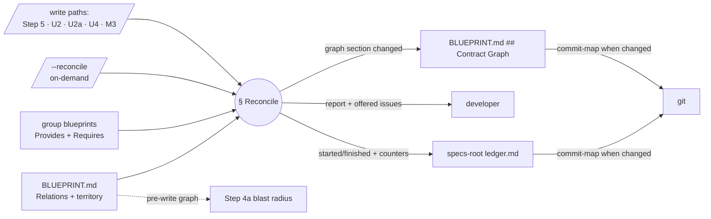

# Cross-group contract graph and blast radius — Plan

## Overview

Add a reconcile pass to `/jim:blueprint` — a thin `§ Reconcile` arm in the
SKILL.md whose methodology lives in a new `references/reconcile-methodology.md`
— that derives the contract graph from directly-read group-blueprint faces,
writes it as a `## Contract Graph` section in `BLUEPRINT.md`, and is fired by
every blueprint write path plus a new `--reconcile` flag.

## Design Decisions

### 1. Home and disclosure: thin SKILL.md arm + fat reference

- **Chosen:** a compact `§ Reconcile` section in `skills/blueprint/SKILL.md`
  (dispatch, trigger hooks, write/commit/ledger skeleton) with detector
  definitions, coverage rules, and report format in a new
  `references/reconcile-methodology.md`.
- **Why:** AC #2 makes `/jim:blueprint` the only writer of the map, so the
  reconcile must live under its roof; the SKILL.md sits at 462/500 lines, so
  the body can absorb only a skeleton (033's map-methodology set the
  precedent).
- **Rejected:** a new skill — splits the single-writer surface AC #2 and spec
  033 AC #3 require. All-inline — breaks the 500-line progressive-disclosure
  invariant.

### 2. Derivation is LLM judgment over directly-read faces — no extraction script

- **Chosen:** the reconcile reads each blueprint-bearing group's Provides /
  Requires sections (and the map's Relations) directly and derives edges,
  findings, and counters in-context; no new bash script ships.
- **Why:** the irreducible work — matching a prose `requires` guarantee to a
  prose `provides` guarantee — is judgment; the dotted
  `{other-group}.{surface}` key (research) makes candidate pairing easy
  enough that a parser saves little, and guarantee matching needs the full
  face text in context regardless. Cost is bounded by scoping reads to the
  face sections and aggregating report findings per consumer group
  (security.md Finding 7).
- **Rejected:** a bash face-extraction pre-pass — adds a markdown parser
  coupled to the blueprint template shape (a new SYNC-drift surface) for
  marginal token savings; revisit when issue #22's engine mechanizes face
  formats. This consciously declines research.md's optional
  "deterministic edge/counter helper" recommendation.

### 3. On-demand surface: a `--reconcile` flag

- **Chosen:** `/jim:blueprint --reconcile` (flag with no group remainder),
  stripped per the existing `--from-review` / `--since` convention.
- **Why:** flag-strip parsing is already established, and a flag cannot
  collide with the group-name namespace.
- **Rejected:** a bare-word verb (`/jim:blueprint reconcile`) — `reconcile`
  is a valid group slug, making dispatch ambiguous. Trigger-only (no
  on-demand arm) — AC #7 requires it, and boundary health should be checkable
  without a face change.

### 4. Commit choreography: reuse `commit-map`, never widen a commit

- **Chosen:** map-tier updates carry the refreshed graph in their existing
  `commit-map` commit. Group-tier update runs (`--from-review` / `--since`)
  and `--reconcile` runs **always** finish with a follow-on
  `commit-map <map> <specs-root> update` once the reconcile has recorded its
  events: a changed graph rides it alongside the specs-root ledger, and an
  unchanged map stages nothing, so the commit carries the ledger alone —
  the 031 fix-only ledger-only-commit property. Generate mode writes the
  graph alongside the blueprint and leaves both commits to the developer
  (its existing convention — the reconcile events ride that commit).
- **Why:** `commit-blueprint` is path-scoped to the group dir; the map is
  outside it. `commit-map` already exists, is `valid-relpath`-guarded, and
  keeps the "exactly three path-scoped commit arms" invariant intact
  (security.md Finding 4). The unconditional commit keeps AC #10's durable
  record honest even when a run finds mismatches without changing the edge
  table (security.md Finding 8).
- **Rejected:** widening `commit-blueprint` to also stage the map — breaks
  the path-scoped invariant. A fourth commit arm — new git write surface with
  no need.

### 5. Ledger contract: a reconcile event pair at the specs root

- **Chosen:** every reconcile records `blueprint started` / `blueprint
  finished` with `tier=project op=reconcile` on the **specs-root** ledger,
  the finished line carrying all counters, zeros included:
  `edges= leaks= breaking= dead= unresolved= undeclared= stale=`.
  `commit-map` already commits that ledger, so counters always ride a commit
  — with the graph when it changed, alone when it did not (DD 4;
  security.md Finding 8). No `jimledger.sh` changes — `event` accepts
  arbitrary kv.
- **Why:** group-dir ledgers stay clean (so `updates-since` counts are
  unaffected), and the 031 "always emit every counter" convention carries
  over. Future consumers must shape-validate values as non-negative integers
  over this fixed key set, per the spec 028 pattern (security.md Finding 5) —
  recorded in Interface Contracts below.
- **Rejected:** appending counters to the triggering group-tier `finished`
  event — that event closes before reconciliation runs, and reconcile-only
  runs would have no event at all.

### 6. Graph section shape and its single writer

- **Chosen:** a `## Contract Graph` section in `BLUEPRINT.md`: a
  `| Consumer | Relies on | Provider |` table plus a
  `*Last reconciled: <ts> (via /jim:blueprint)*` stamp taken from
  `jimfile.sh now`; when fewer than two groups have blueprints the table is
  replaced by a one-line "*Nothing to reconcile — fewer than two groups have
  blueprints.*" note. No verdict/status column (spec AC #3). The reconcile
  pass is the section's only writer; its rewrite is exempt from Step-4a
  grading (spec AC #13), with the exemption rationale recorded in the
  methodology reference.
- **Why:** mirrors the spec mockup; the stamp reuses the 032 watermark idiom
  (deterministic source, never content-derived).
- **Rejected:** per-edge status column — decided out at spec time (rots into
  misplaced trust; duplicates the issue collection).

### 7. Blast radius reads the persisted, pre-write graph

- **Chosen:** Step 4a's grading (and U3's fork presentation), when a proposed
  edit weakens/removes a Provides entry, reads the map's current
  `## Contract Graph` and names every consumer group whose edge relies on
  the touched entry — informational, never a veto. The line carries the
  graph's `Last reconciled` stamp so trust in the answer is calibrated by
  its age (security.md Finding 9).
- **Why:** the pre-write graph records exactly the surface consumers declared
  against, which is precisely who breaks; reading a persisted section is
  cheap and needs no re-derivation before the write.
- **Rejected:** re-deriving the graph pre-write — pays the full reconcile
  twice per update for no accuracy gain.

### 8. Trigger wiring and the fix-only answer

- **Chosen:** one-line "run the reconcile pass (§ Reconcile)" hooks after
  each write lands: generate Step 5, update-mode U2 fallthrough, U2a regen
  branch, U4, and map-tier M3. A fix-only 031 run (every edit withheld,
  ledger-only commit) **skips** the reconcile — no face changed. With fewer
  than two blueprint-bearing groups the pass short-circuits to the one-line
  note (AC #7).
- **Why:** faces change only at write sites; hooking each keeps "the graph
  never silently stales" true by construction. This resolves the spec's open
  question on fix-only runs.
- **Rejected:** reconciling on every invocation including fix-only —
  cost without a face change to justify it.

## Constitution Check

**ARCHITECTURE.md status:** Present — constraints noted below.

| Constraint from ARCHITECTURE.md | Honored? | Notes |
| :--- | :--- | :--- |
| SKILL.md ≤ 500 lines (progressive disclosure) | Yes | ~33 net lines added to a 462-line file → ~495. Every SKILL.md task verifies `wc -l ≤ 500`; pre-identified fallback if busted: compress § Reconcile to dispatch-only, pushing the skeleton into the methodology reference |
| `allowed-tools` names exact script paths, mirroring call sites | Yes | Reconcile uses only already-granted scripts (`jimfile.sh`, `jimconf.sh`, `jimledger.sh`, `new.sh`, `index.sh`); no frontmatter grant changes |
| Single-writer artifacts; map written only via `/jim:blueprint`, committed via `commit-map` | Yes | DD 4, DD 6 |
| `jimledger.sh` commits in exactly three path-scoped arms | Yes | DD 4 reuses `commit-map`; no new commit site |
| Bash-vs-Prompt rule | Yes | DD 2 documents the judgment call — matching is judgment, not deterministic |
| Untrusted-content boundary; secrets redacted | Yes | Methodology mandates delimited evidence blocks + redaction (spec AC #11/#12) |
| WORKFLOW.md is the single source of truth for the process | Yes | Task 6 documents the reconcile surface there |
| Tests: deterministic scripts → `tests/`; LLM prompts → checklist | Yes | No script ships (DD 2), so validation is the SKILL.md checklist + dogfood task |
| No third-party dependencies | Yes | Markdown + existing bash only |

## File Manifest

| Component | File Path | Action | Notes |
| :--- | :--- | :--- | :--- |
| Reconcile methodology | `skills/blueprint/references/reconcile-methodology.md` | Create | Detector definitions, coverage rules, report + graph formats, issue-offer flow, Step-4a exemption rationale |
| Map template | `skills/blueprint/assets/map-template.md` | Update | `## Contract Graph` section (table shape, stamp, nothing-to-reconcile note) |
| Blueprint skill | `skills/blueprint/SKILL.md` | Update | `--reconcile` dispatch row + argument-hint, `§ Reconcile` skeleton, five trigger hooks, Step-4a blast-radius consult, validation-checklist items |
| Workflow doc | `WORKFLOW.md` | Update | Document the reconcile surface, triggers, and finding classes at the blueprint section |
| Project map | `BLUEPRINT.md` | Update (task 7, via the skill) | `## Contract Graph` section lands through the reconcile pass — never hand-edited |
| Specs-root ledger | `docs/specs/ledger.md` | Update (task 7, via the skill) | Reconcile `started`/`finished` event pair with counters |

## Interface Contracts

```text
CLI surface
  /jim:blueprint --reconcile            # on-demand, project-tier; no group arg

Contract Graph section (BLUEPRINT.md; sole writer: the reconcile pass)
  ## Contract Graph
  *Derived from the group blueprints' provides/requires faces — regenerated
  on every blueprint write; do not edit. Last reconciled: <ts from
  jimfile.sh now> (via /jim:blueprint)*
  | Consumer | Relies on | Provider |
  — or, when < 2 groups have blueprints:
  *Nothing to reconcile — fewer than two groups have blueprints.*

Ledger events (specs-root ledger.md; jimledger.sh event, no script changes)
  blueprint  started   tier=project op=reconcile
  blueprint  finished  tier=project op=reconcile \
      edges=<n> leaks=<n> breaking=<n> dead=<n> unresolved=<n> \
      undeclared=<n> stale=<n>          # all keys, zeros included
  Consumers extracting these values MUST shape-validate: fixed key set,
  non-negative integers (spec 028 pattern; security.md Finding 5).

Finding classes (report + offered issues; defined in the methodology)
  leak | breaking | dead-surface (full coverage only) | unresolved-require
  | undeclared-relation | stale-relation
  Evidence quotes only inside <untrusted-face-content path="...">...</...>
  blocks; territory paths re-validated via jimfile.sh valid-relpath at use.

Blast-radius consult (Step 4a / U3, read-only)
  On a Provides weakening/removal: read the map's Contract Graph; emit
  "blast radius: <consumer groups> — graph as of <Last reconciled>" in the
  prompt. Informational only.
```

## Data Flow



## Task Breakdown

1. [ ] Create `skills/blueprint/references/reconcile-methodology.md`: the six
   finding classes with remedies (incl. non-dotted entries → unresolved;
   territory `valid-relpath` re-validation), the declared-data principle with
   the existential/universal coverage rule, coverage reporting, the report
   format (declaration-level wording, per-consumer aggregation, delimited
   `<untrusted-face-content>` evidence, secret redaction), the blast-radius
   line format (consumers + the graph's `Last reconciled` stamp —
   security.md Finding 9), the per-finding issue-offer flow (emitter +
   labels), the graph-section shape, and the Step-4a exemption rationale.
   **Verify:** `test -f skills/blueprint/references/reconcile-methodology.md && grep -q "declaration-level" skills/blueprint/references/reconcile-methodology.md && grep -q "untrusted-face-content" skills/blueprint/references/reconcile-methodology.md && grep -q "valid-relpath" skills/blueprint/references/reconcile-methodology.md`

2. [ ] Update `skills/blueprint/assets/map-template.md`: add the
   `## Contract Graph` section per the Interface Contract (table, stamp line,
   nothing-to-reconcile note, do-not-edit banner).
   **Verify:** `grep -q "Contract Graph" skills/blueprint/assets/map-template.md && grep -q "Last reconciled" skills/blueprint/assets/map-template.md`

3. [ ] Update `skills/blueprint/SKILL.md`: add the `--reconcile` routing-table
   row, extend `argument-hint`, and add the `§ Reconcile` section (resolve
   paths, read methodology, short-circuit on < 2 blueprint-bearing groups,
   derive + detect per the reference, write graph via Edit, ledger pair +
   counters at specs root, then `commit-map` unconditionally — ledger-only
   when the graph is unchanged, per DD 4).
   **Verify:** `grep -q '\-\-reconcile' skills/blueprint/SKILL.md && grep -q "reconcile-methodology" skills/blueprint/SKILL.md && [ "$(wc -l < skills/blueprint/SKILL.md)" -le 500 ]`

4. [ ] Update `skills/blueprint/SKILL.md`: wire the five trigger hooks
   (Step 5, U2, U2a regen, U4, M3 — fix-only runs skip), and add the Step-4a
   blast-radius consult sentence (read the pre-write graph, name consumers,
   never a veto). Depends on task 3.
   **Verify:** `[ "$(grep -c 'Reconcile' skills/blueprint/SKILL.md)" -ge 7 ] && grep -q "blast radius" skills/blueprint/SKILL.md && [ "$(wc -l < skills/blueprint/SKILL.md)" -le 500 ]`

5. [ ] Update `skills/blueprint/SKILL.md`: add validation-checklist items
   (detectors fired only on declared data; evidence delimited; counters all
   emitted; graph write exempt from grading while hand-declared content stays
   graded; map committed only via `commit-map`). Depends on task 3.
   **Verify:** `grep -A40 "Validation Checklist" skills/blueprint/SKILL.md | grep -qi "reconcile" && [ "$(wc -l < skills/blueprint/SKILL.md)" -le 500 ]`

6. [ ] Update `WORKFLOW.md`: document the reconcile pass in the blueprint
   surface section — the `--reconcile` verb, the write-path triggers, the
   finding classes, and the blast-radius enrichment of the update guard.
   **Verify:** `grep -qi "reconcile" WORKFLOW.md`

7. [ ] Dogfood acceptance on jim's single-group map: drive `§ Reconcile`
   (via `/jim:blueprint --reconcile`) — expect the short-circuit note written
   into `BLUEPRINT.md`, the stamp, the counter-bearing event pair on the
   specs-root ledger, and a `commit-map` commit. Depends on tasks 1–5.
   **Verify:** `grep -q "Contract Graph" BLUEPRINT.md && grep -q "op=reconcile" docs/specs/ledger.md && git log --oneline -1 -- BLUEPRINT.md | grep -q blueprint`

## Requirements Coverage Summary

| Spec Acceptance Criterion | Addressed In Task(s) |
| :--- | :--- |
| 1. Derived graph section from faces, never hand-declared | 1, 2, 3, 7 |
| 2. Written only through the `/jim:blueprint` surface | 3 (DD 1, DD 3) |
| 3. Graph only — no per-edge status persisted | 1, 2 (DD 6) |
| 4. Six finding classes with remedies; territory re-validation; relation classes via map-tier update | 1 |
| 5. Declared-data principle; existential/universal coverage rule | 1 |
| 6. Explicit coverage + unverifiable-edge reporting | 1 |
| 7. Re-run on every blueprint write + on-demand; < 2 groups no-op | 3, 4, 7 (DD 8) |
| 8. Blast radius names consumers at face change; never a veto | 4 (DD 7) |
| 9. Report at detection time; offered issues; declaration-level wording | 1 |
| 10. Outcomes durably recorded (counters) | 3, 7 (DD 5) |
| 11. Trust boundary; delimited evidence quoting | 1, 5 |
| 12. Secret redaction | 1 |
| 13. Derived-graph write exempt from Step-4a grading, recorded | 1, 4, 5 (DD 6) |

## Out of Scope

- **`ARCHITECTURE.md` refresh** — pipeline-owned: the `/jim:build` completion
  gate runs `/jim:arch`; not a deferral.
- **`tests/` changes** — no deterministic script ships (DD 2); the LLM-run
  reconcile validates via the SKILL.md checklist and the dogfood task, per
  the project's testing conventions.
- **`jimledger.sh` / `jimfile.sh` changes** — none needed; existing `event`,
  `now`, `valid-relpath`, and `commit-map` cover the contracts.
- **Tracked follow-ons** — plan-time advisory (#39), Relations-column
  derivation (#40), multi-group update fan-out (#41), partition-health
  sensors (#42).

## Open Questions

- [x] ~~Does a fix-only 031 run re-derive the graph?~~ → No — no face
  changed; hooks fire only where a write landed (DD 8; resolves the spec's
  open question).
- [x] ~~Counter key set?~~ → `edges/leaks/breaking/dead/unresolved/undeclared/stale`,
  all always emitted (DD 5).
- None blocking.
