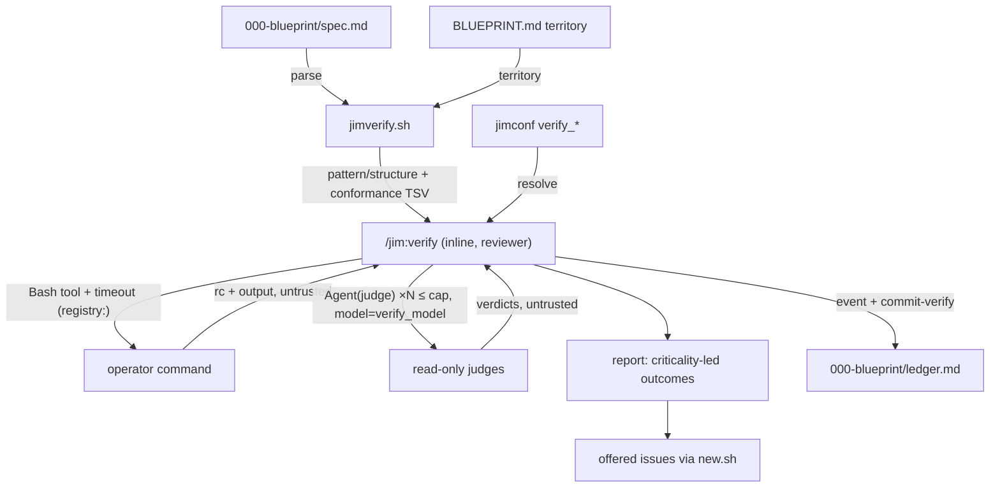

# Invariant verification engine core — Plan

## Overview

A new `/jim:verify` skill (bound `agent: reviewer`) orchestrates a
deterministic `jimverify.sh` core — blueprint parsing, territory resolution,
and the native mechanical floor — plus model-executed registry commands and
a fanned-out read-only `judge` subagent for the appetite-gated ceiling. No
jim script ever executes config-derived strings; the registry is resolved by
script, run by the model through the Bash tool.

## Design Decisions

### 1. Registry execution split: script resolves, model executes

- **Chosen:** `verify_command_<name>` keys in `jimconf.toml` hold complete
  command strings. `jimconf.sh` only *resolves* them; the **skill** executes
  each via the Bash tool (with a timeout), captures rc/output, and contains
  failure to that check's outcome. `jimverify.sh` never executes registry
  content.
- **Why:** Research confirmed zero precedent for a jim script executing
  config-derived strings — every script header promises config is data,
  never code. The `pre_commit` pattern (config resolves, model executes via
  Bash, Claude Code's permission layer applies) is the house-consistent
  split, and it satisfies spec AC #6 unchanged.
- **Rejected:** script-executed command strings — would be the first script
  to cross the never-execute-config boundary; a path-only registry
  (pre_commit-style script files) — forces wrapper scripts for one-liners
  like `npm test` with identical provenance and no security gain.

### 2. Check-data format: Id + closed-enum Method columns, params in a fenced block

- **Chosen:** The blueprint Invariants table becomes
  `| Id | Invariant | Criticality | Check |` where `Id` is a short slug
  (`^[a-z0-9][a-z0-9-]*$`) and `Check` is drawn from the closed enum
  `pattern` / `structure` / `registry:<name>` / `judge`. Inert parameters
  (needed only by `pattern`/`structure`) live in an optional line-oriented
  fenced block labeled `verify-checks` below the table, keyed by Id (grammar
  in Interface Contracts). Anything missing or malformed degrades exactly as
  the spec requires: absent Id/enum → judge fallback (AC #10); a present
  but malformed params line → *failed* (AC #1).
- **Why:** Regex/glob parameters cannot live safely in markdown table cells
  (`|` collides with the table syntax); a line-oriented block is the
  established grep-parseable shape. Criticality and Id parse from simple
  cells reliably. Parsing is deterministic → bash owns it (Bash-vs-Prompt
  rule).
- **Rejected:** params inside table cells (escaping fragility); an
  LLM-extracted check manifest (nondeterministic extraction of deterministic
  data — and it would put the untrusted blueprint through the model on the
  *mechanical* path the floor exists to keep deterministic).

### 3. Mint a `judge` agent rather than reuse `investigator`

- **Chosen:** New `agents/judge.md`: `tools: [Read, Glob, Grep]`,
  `model: inherit`, single-target prompt ("judge whether this invariant
  holds over this scope"), verdict enum `holds | partial | violated`,
  investigator's untrusted-content and secret-scrub clauses carried
  verbatim.
- **Why:** `investigator`'s body is diff-anchored (supplied hunks, build
  range) and its description scopes it to the `/jim:review` orchestrator; a
  judge receives a rule + territory scope, no diff. A sibling agent is ~60
  lines and keeps both prompts honest.
- **Rejected:** reusing `investigator` with a contorted spawn prompt — the
  "you will be given diff hunks" framing would be false in every verify
  spawn, and its description would mislead routing.

### 4. Skill binding: `agent: reviewer`

- **Chosen:** `/jim:verify` carries `agent: reviewer` (documentation
  convention) and `verify` joins `agents/reviewer.md`'s `skills:` preload
  list (the pm.md owned-skills convention, spec 033 AC #17 lineage).
- **Why:** Verification is evidence-driven checking against a reference —
  the reviewer's lens and fan-out pattern (it already orchestrates
  read-only subagents). The architect owns *authoring* the blueprint;
  checking code against it is review-side.
- **Rejected:** `agent: architect` (authoring persona, not verification);
  a new persona (proliferation for one skill).

### 5. Config keys: one `verify_*` family, two dynamic-suffix arms

- **Chosen:** Six keys, all bare-name, one `verify_*` arm in `resolve()`'s
  `:120` disjunction:
  - `verify_appetite` — criticality threshold for the judge rung; default
    `"low"` (= judge everything: the thorough default). Values outside
    `critical|high|medium|low` degrade to `"low"`, noted in the report.
  - `verify_appetite_<group>` — per-group override (dynamic suffix,
    slug-validated); same enum/degrade rule.
  - `verify_fanout_cap` — default `"10"`; junk/non-positive → `10`
    (mirrors `review_fanout_cap`, a cap of 0 never silently disables).
  - `verify_model` — default `"inherit"`; validated against
    `inherit|sonnet|opus|haiku|fable`; per-spawn Agent `model` param (the
    `review_model` mechanism, extended with `fable` — Anthropic's newest
    model tier, which `review_model`'s enum predates; issue filed to align
    review).
  - `verify_command_<name>` — the registry (dynamic suffix; `<name>` must
    match `^[a-z0-9][a-z0-9-]*$` or the arm returns empty). No default —
    empty means *unconfigured*.
  - `verify_registry_timeout` — per-command timeout (seconds) for registry
    executions only — native floor and judges are not governed by it;
    default `"120"`; junk/non-positive → `120` (same degrade rule + report
    note as the other knobs). Named outside the `verify_command_<name>`
    dynamic namespace deliberately — `verify_command_timeout` would parse
    as a registry entry named `timeout`. Consumed by Decision 9.
- **Why:** Follows the `review_*` family shape exactly; dynamic suffixes
  keep the registry flat-TOML-compatible. Suffix validation makes a
  blueprint-recorded name inert even at lookup (security.md Finding 1 —
  enforced both in `jimverify.sh parse` and in the resolver arm).
- **Rejected:** a TOML table for the registry (jimconf is flat by design);
  a second `auto_*`-style knob (nothing here removes a human step).

### 6. Ledger stage + a dedicated `commit-verify` verb

- **Chosen:** `verify` joins `LEDGER_STAGES` (`jimledger.sh:304`). Events
  ride the group's `000-blueprint/ledger.md`: `verify started`, then
  `verify finished checked=<n> holds=<n> violated=<n> failed=<n>
  unconfigured=<n> skipped=<n>`. A new path-scoped `commit-verify
  <blueprint-dir>` stages and commits `-- ledger.md` only, subject
  `chore(verify): record verification run` — the run's self-commit (spec
  AC #11).
- **Why:** The blueprint dir's ledger already carries that group's
  blueprint lifecycle; verify events belong beside them. `commit-blueprint`
  is wrong for this: it stages `spec.md` and writes a
  `docs(blueprint): update…` subject — misleading history for a run that
  writes no artifact (the spec 032 create/update lesson: commit messages
  should tell the truth).
- **Rejected:** reusing `commit-blueprint` (dishonest subject, stages
  spec.md); leaving the event uncommitted (contradicts the resolved spec
  decision).

### 7. Outcome vocabulary (resolves the spec's open question)

- **Chosen:** `holds` / `violated` / `failed` / `unconfigured` / `skipped`
  — matching the five distinctions AC #1 fixes, and doubling as the ledger
  counter keys (Decision 6). Judge verdict `partial` maps to `violated`
  with the partial evidence quoted (a partially-held invariant does not
  hold).
- **Why:** Single vocabulary across report, counters, and judge mapping —
  no translation table to drift.
- **Rejected:** review's `satisfied|partial|divergence` — those name
  AC-satisfaction, not invariant conformance.

### 8. Native floor: three `jimverify.sh` verbs, conformance emitted deterministically

- **Chosen:** `parse <spec.md>` (invariant table + `verify-checks` block →
  normalized TSV; validates Id charset, criticality enum, method enum,
  registry-name charset), `territory <map> <group>` (extracts the group's
  territory list, each path through `valid-relpath`; failing path reported
  as map hygiene and excluded), `check <blueprint-dir> <map> <group>` (runs
  all `pattern`/`structure` checks scoped to territory and emits the
  territory-conformance result → TSV `id, outcome, evidence`). Territory
  conformance is computed as the deterministic set difference — tracked
  files outside every declared territory (single-group: outside the
  group's) — emitted as data; the *skill* frames attribution in the report
  (violation vs informational), since "is this stray file group code?" is
  judgment.
- **Why:** Everything deterministic lands in the script (Bash-vs-Prompt
  rule); the one judgment call in AC #5 (attribution) stays with the model.
  Under `group_territory = none`, `territory` returns nothing, `check`
  runs pattern/structure unscoped (repo root) and skips conformance — and
  says so on stdout so the skill names the degradation (AC #3).
- **Rejected:** timeout wrappers inside the script (`timeout(1)` is not on
  stock macOS; native primitives are grep/find-bounded anyway — the
  long-running risk lives with registry commands, handled in Decision 9).

### 9. Bounding check execution (security.md Finding 4)

- **Chosen:** The skill runs each registry command through the Bash tool
  with an explicit `timeout` parameter set from the
  `verify_registry_timeout` knob (Decision 5; seconds, default `120`,
  skill converts to the tool's milliseconds); expiry or crash folds into
  that check's `failed` outcome with the evidence quoted inside the
  delimited block. The run always continues.
- **Why:** Harness-level timeout is portable (no coreutils dependency) and
  the containment contract is already AC #6's.
- **Rejected:** script-level `timeout`/`ulimit` wrappers (portability; and
  per Decision 1 the script doesn't run registry commands at all).

### 10. Check-authoring guidance in blueprint `references/`

- **Chosen:** New `skills/blueprint/references/check-authoring.md` (the
  format grammar, method-selection guidance, worked examples). Blueprint
  SKILL.md gets a minimal pointer amendment inside Step 3's existing
  invariants sentence — net +2 lines max (497→≤499), template updated in
  `assets/blueprint-template.md`.
- **Why:** Blueprint SKILL.md has 3 lines of headroom; progressive
  disclosure is the documented remedy (spec Insight 2; issue #43 tracks
  the fuller restructure).
- **Rejected:** inlining authoring guidance in the SKILL.md body (breaks
  the 500-line invariant).

## Constitution Check

**ARCHITECTURE.md status:** Present — constraints noted below.

| Constraint from ARCHITECTURE.md | Honored? | Notes |
| :--- | :--- | :--- |
| Bash-vs-Prompt rule | Yes | Parsing/floor/counters in `jimverify.sh`; judgment (attribution, judges, report framing) in the skill |
| Never source/eval config or scanned content | Yes | Decision 1 — the script resolves, the model executes; `parse` is line-oriented awk |
| One-level subagent nesting | Yes | `/jim:verify` runs inline; judges are the single level (SKILL.md carries the same standing note as review) |
| `allowed-tools` names exact script paths, no bare wildcards | Yes | See File Manifest; registry commands are deliberately *not* declared — they surface normal Bash permission prompts (the pre_commit behavior) |
| Read-only subagents capability-narrowed | Yes | `judge`: `[Read, Glob, Grep]`, no Write/Edit/Bash/Agent |
| SKILL.md ≤ 500 lines / agent ≤ ~800 tokens | Yes | verify SKILL.md budgeted ~250 lines; blueprint SKILL.md pointer is +2 lines (≤499); judge agent ~60 lines |
| Skills call `jimfile.sh`, `jimconf.sh` via documented injection/fenced patterns | Yes | Runtime values via fenced blocks (group known only at invocation) |
| WORKFLOW.md is the single source of truth for the SDLC process | Yes | Task 12 documents `/jim:verify` there |
| Sentinel-based logic-flow vocabulary (`SET` / `IF != "NOT_FOUND"`) | Yes | Used for map/blueprint existence gates in the skill body |

## File Manifest

| Component | File Path | Action | Notes |
| :--- | :--- | :--- | :--- |
| Verify skill | `skills/verify/SKILL.md` | Create | Dispatch (`<group>`, `--appetite` strip), orchestration, report, issue offer; `agent: reviewer`; allowed-tools: `Bash(bash ${CLAUDE_SKILL_DIR}/scripts/jimverify.sh *)`, jimfile/jimconf/jimledger/new.sh/index.sh tokens, `Agent(judge)`, `Read Write Glob Grep` |
| Deterministic core | `skills/verify/scripts/jimverify.sh` | Create | `parse` / `territory` / `check` verbs; `set -uo pipefail; export LC_ALL=C` |
| Judge agent | `agents/judge.md` | Create | Read-only single-invariant judge; verdict `holds\|partial\|violated` |
| Reviewer agent | `agents/reviewer.md` | Update | Add `verify` to `skills:`; one-line domain note |
| Config resolver | `skills/conf/scripts/jimconf.sh` | Update | `verify_*` disjunction arm; `default_for` arms; `KEYS` additions (fixed keys); dynamic `verify_command_<name>` / `verify_appetite_<group>` suffix handling with slug validation |
| Ledger script | `skills/review/scripts/jimledger.sh` | Update | `verify` in `LEDGER_STAGES`; `cmd_commit_verify` (ledger-only, path-scoped) |
| Blueprint template | `skills/blueprint/assets/blueprint-template.md` | Update | Invariants table → `Id\|Invariant\|Criticality\|Check`; add optional `verify-checks` fenced block stanza |
| Check-authoring guide | `skills/blueprint/references/check-authoring.md` | Create | Format grammar, method selection, examples |
| Blueprint skill | `skills/blueprint/SKILL.md` | Update | +≤2-line pointer in Step 3 invariants guidance (stay ≤500) |
| Resolver tests | `tests/jimconf.sh` | Update | default+override cases per new key; suffix-validation cases |
| Ledger tests | `tests/jimledger.sh` | Update | `verify` stage event metrics; `commit-verify` (commit subject, ledger-only, path scoping) |
| Verify tests | `tests/jimverify.sh` | Create | parse/territory/check cases over temp fixtures (well-formed, malformed, legacy no-Id table, `none` mode) |
| Config example | `jimconf.toml.example` | Update | `verify_*` section (group_* block style; registry documented like the pre_commit pair) |
| Workflow doc | `WORKFLOW.md` | Update | `/jim:verify` command entry + lifecycle placement |
| Readme | `README.md` | Update | Permissions note: judge fan-out surfaces per-subagent read prompts (the 027 note pattern) |

## Interface Contracts

**Blueprint check data (authored by `/jim:blueprint`, parsed by `jimverify.sh parse`):**

```markdown
| Id | Invariant | Criticality | Check |
| :--- | :--- | :--- | :--- |
| path-resolver | Paths are resolved via jimfile.sh, never composed by hand | critical | pattern |
| skill-budget | SKILL.md ≤ 500 lines | medium | registry:linecount |
| domain-bounds | Agents do not cross domain boundaries | high | judge |
```

````markdown
```verify-checks
path-resolver polarity=must-not regex=docs/(specs|issues)/[^ ]*\.md scope=skills/
```
````

- `Id`: `^[a-z0-9][a-z0-9-]*$`. `Check`: `pattern` | `structure` |
  `registry:<name>` (`<name>` slug-charset) | `judge`.
- `verify-checks` lines: `<id> <key>=<value>...`. `pattern` keys:
  `polarity=must|must-not`, `regex=<ERE>`, optional `scope=<relpath>`
  (default: territory), optional `count=<n>`. `structure` keys:
  `exists=<relpath>` or `absent=<glob>`.
- **Parameter gates (security.md Finding 6):** every path-bearing value
  (`scope`, `exists`, `absent`) passes the `valid-relpath` shape gate
  before use; patterns/globs are handed to grep/find as data behind `-e` /
  `--` end-of-options guards; a failing parameter degrades that check to
  *failed* with the reason (the malformed-row rule).
- **TSV integrity (security.md Finding 7):** all emitted field content
  (params, evidence) is sanitized — tabs/newlines translated to spaces,
  field length capped — so a crafted invariant row can never shift columns
  or smuggle a record (the spec 022 column-shift lesson).
- Legacy 3-column tables (no Id/enum): every row → judge fallback, never an
  error.

**`jimverify.sh` CLI (all output TSV, one record per line):**

```
parse <blueprint-spec.md>       → id \t criticality \t method \t params|-
                                  (malformed row → id \t criticality \t malformed \t <reason>)
territory <map-path> <group>    → one validated relpath per line; rc 2 if group absent;
                                  invalid path → "HYGIENE <path>" line, excluded
check <blueprint-dir> <map> <group>
                                → id \t holds|violated|failed \t evidence
                                  plus "TERRITORY-CONFORMANCE \t <outside-file>" lines (data,
                                  skill frames attribution); "UNSCOPED" sentinel line when
                                  group_territory=none
```

**Ledger event (emitted by the skill via the generic verb):**

```
jimledger.sh event <blueprint-dir> verify started
jimledger.sh event <blueprint-dir> verify finished checked=<n> holds=<n> violated=<n> failed=<n> unconfigured=<n> skipped=<n>
jimledger.sh commit-verify <blueprint-dir>       # stages -- ledger.md only
```

**Judge spawn contract (skill → `Agent(judge)`, model per `verify_model`):**

- In: invariant Id + verbatim rule text (delimited untrusted block),
  criticality, territory scope paths, "evidence conventions: delimited
  quotes, secret redaction".
- Out: `verdict: holds|partial|violated`, `locations_examined`, `evidence`,
  `detail` — parsed as data; `partial` maps to `violated` in the report.

## Data Flow



## Task Breakdown

1. [ ] `jimconf.sh`: add the `verify_*` family — extend the `:120`
   disjunction, add `default_for` arms (`verify_appetite`→`"low"`,
   `verify_fanout_cap`→`"10"`, `verify_model`→`"inherit"`,
   `verify_registry_timeout`→`"120"`), add the four fixed keys to `KEYS`,
   and handle the two dynamic suffixes
   (`verify_command_<name>`, `verify_appetite_<group>`; suffix must match
   the slug charset, else resolve empty). Add `tests/jimconf.sh`
   default+override cases per key plus a bad-suffix case.
   **Verify:** `bash skills/meta-test/scripts/run.sh jimconf`

2. [ ] `jimledger.sh`: append `verify` to `LEDGER_STAGES`; add
   `cmd_commit_verify` (validate dir, `git add -- ledger.md`, commit
   `chore(verify): record verification run` with `-- ledger.md`). Add
   `tests/jimledger.sh` cases: verify-stage metrics triplet appears;
   `commit-verify` commits only `ledger.md` with the exact subject; rc 2 on
   a non-git dir.
   **Verify:** `bash skills/meta-test/scripts/run.sh jimledger`

3. [ ] Create `skills/verify/scripts/jimverify.sh` with `parse` +
   `territory` verbs per the Interface Contracts (line-oriented awk, id /
   enum / registry-name / relpath validation, malformed-row degradation,
   legacy-table → judge fallback, TSV field sanitization per the
   Finding-7 contract). Create `tests/jimverify.sh` (scaffold via
   `metatest.sh scaffold jimverify`) with fixtures: well-formed table,
   legacy 3-column table, malformed Id, bad registry name, absent group,
   and a tab-bearing invariant row asserting column stability.
   **Verify:** `bash skills/meta-test/scripts/run.sh jimverify`

4. [ ] Extend `jimverify.sh` with the `check` verb: `pattern`/`structure`
   execution scoped to territory (patterns behind `-e` / `--`, find/test
   behind `--`), the Finding-6 parameter gates (`scope`/`exists`/`absent`
   through `valid-relpath`; failing param → `failed`), the
   territory-conformance set difference (`git ls-files` minus territories),
   the `UNSCOPED` sentinel under `group_territory=none`. Extend
   `tests/jimverify.sh`: must/must-not pattern pass+fail, structure
   exists/absent, conformance detects an outside file, `none`-mode
   sentinel, and negative param cases (absolute path, `..` segment,
   leading-dash value → `failed`, never executed).
   **Verify:** `bash skills/meta-test/scripts/run.sh jimverify`

5. [ ] Update `skills/blueprint/assets/blueprint-template.md`: Invariants
   table gains `Id` and the closed-enum `Check` column; add the optional
   `verify-checks` fenced-block stanza with the grammar comment.
   **Verify:** `grep -q 'verify-checks' skills/blueprint/assets/blueprint-template.md && grep -qE '\| *Id *\|' skills/blueprint/assets/blueprint-template.md`

6. [ ] Create `skills/blueprint/references/check-authoring.md` (grammar,
   method-selection guidance — mechanical-first, judge as fallback — worked
   examples, registry-name inertness note) and add the ≤2-line pointer in
   blueprint SKILL.md Step 3.
   **Verify:** `test -f skills/blueprint/references/check-authoring.md && [ "$(wc -l < skills/blueprint/SKILL.md)" -le 500 ] && grep -q 'check-authoring' skills/blueprint/SKILL.md`

7. [ ] Create `agents/judge.md`: read-only single-invariant judge —
   `tools: [Read, Glob, Grep]`, `model: inherit`, untrusted-content and
   secret-scrub clauses carried from investigator, structured verdict
   output per the spawn contract, description scoped to `/jim:verify`
   dispatch.
   **Verify:** `grep -q 'tools: \[Read, Glob, Grep\]' agents/judge.md && ! grep -qE 'Write|Edit|Bash' agents/judge.md`

8. [ ] Create `skills/verify/SKILL.md`: argument routing (`<group>`
   required; `--appetite <level>` strip convention), blueprint/map
   existence gates (sentinel vocabulary), floor via `jimverify.sh`,
   registry execution via Bash tool + timeout with the Finding-1 name
   validation and Finding-3 output-untrust discipline, appetite gating +
   `Agent(judge)` fan-out capped by `verify_fanout_cap` on `verify_model`,
   criticality-led report per the spec mockup (naming degradations,
   fallbacks, and bounded coverage), per-violation issue offer via `new.sh`
   (temp-file body, priority from criticality, labels
   `000-blueprint,verify`), `verify started/finished` events +
   `commit-verify`. Frontmatter: `agent: reviewer`, allowed-tools per File
   Manifest, one-level-nesting standing note.
   **Verify:** `[ "$(wc -l < skills/verify/SKILL.md)" -le 500 ] && grep -q 'Agent(judge)' skills/verify/SKILL.md && grep -q 'commit-verify' skills/verify/SKILL.md`

9. [ ] Update `agents/reviewer.md`: add `verify` to `skills:`, one-line
   domain note ("also runs /jim:verify — blueprint invariant
   verification").
   **Verify:** `grep -q 'verify' agents/reviewer.md`

10. [ ] Update `jimconf.toml.example`: `# --- Verification (spec 035) ---`
    section — the four fixed keys with defaults (`verify_appetite`,
    `verify_fanout_cap`, `verify_model`, `verify_registry_timeout`), the two
    dynamic-suffix families with one worked example each
    (`verify_command_linecount`, `verify_appetite_auth`), registry
    security note (blueprint proposes, config activates).
    **Verify:** `grep -q 'verify_appetite' jimconf.toml.example && grep -q 'verify_command_' jimconf.toml.example`

11. [ ] Full suite green.
    **Verify:** `bash skills/meta-test/scripts/run.sh`

12. [ ] Update `WORKFLOW.md` (`/jim:verify` command entry, artifacts:
    report-only + ledger, placement after the blueprint lifecycle) and
    `README.md` (judge fan-out per-subagent read-prompt note, extending
    the 027 permissions snippet).
    **Verify:** `grep -q 'jim:verify' WORKFLOW.md && grep -q 'judge' README.md`

## Requirements Coverage Summary

| Spec Acceptance Criterion | Addressed In Task(s) |
| :--- | :--- |
| 1. Per-invariant outcomes, five distinctions | 3, 4, 8 |
| 2. Criticality-led report, evidence, counts; graceful absent/empty blueprint | 8 |
| 3. Honest coverage (buckets, capped fan-out named, `none` degradation named) | 4, 8 |
| 4. Zero-config floor, territory-scoped, `valid-relpath` at use, never appetite-gated | 3, 4 |
| 5. Territory conformance checked when declared | 4, 8 (attribution framing) |
| 6. Operator-owned registry; name validation before lookup; no blueprint-derived arguments; contained failure | 1, 3 (parse-side), 8 (lookup + execution) |
| 7. Judge-rung fallback, capability-backed read-only, evidence-as-data | 7, 8 |
| 8. Appetite threshold + per-group override + per-run override + cap; skipped named; malformed config degrades, noted | 1, 8 |
| 9. Structured closed-vocabulary check data; blueprint surface authors it | 5, 6 |
| 10. Legacy blueprints verify unchanged via judge fallback | 3, 8 |
| 11. Issues offered per violation; no verdict artifact; counters durably recorded; self-commit | 2, 8 |
| 12. Engine read-only toward the project | 7, 8 (no code-modifying capability granted) |
| 13. Untrusted content discipline incl. command output; delimited evidence | 7, 8 |
| 14. Secret redaction incl. command output and issue bodies | 7, 8 |

## Out of Scope

- **Pipeline integration** (review-as-sensor, 031/034 hardening,
  blast-radius spend) — spec B of issue #22; deferred, trackable there.
- **The adversarial swarm** — single-judge ceiling in this slice (spec Out
  of Scope).
- **Map-tier verification beyond territory conformance** — spec Out of
  Scope.
- **Registry argument-passing** — excluded by AC #6; registry entries are
  self-contained invocations.
- **Regenerating jim's own blueprint to the new check format** — not
  required (AC #10's judge fallback covers it); happens naturally on its
  next `/jim:blueprint` run, which is pipeline-owned maintenance, not a
  deferral.
- **`ARCHITECTURE.md` refresh** — handled by the `/jim:build` completion
  gate (`/jim:arch`), not a plan task.

## Open Questions

- [x] ~Outcome label naming~ → `holds / violated / failed / unconfigured /
  skipped` (Decision 7); labels double as ledger counter keys.
- [x] ~Registry mechanism~ → script resolves, model executes with timeout
  (Decisions 1, 9), per research Recommendation 1.
- [x] ~Judge reuse vs mint~ → mint `agents/judge.md` (Decision 3).
- None blocking.
