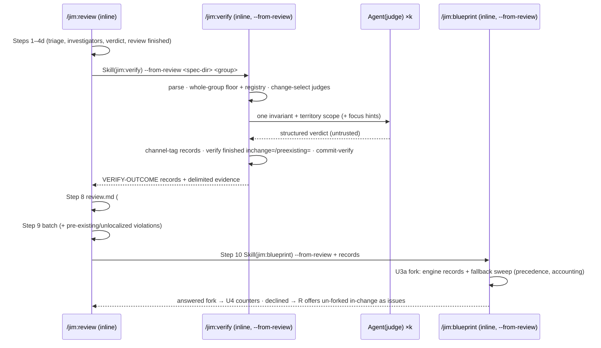

# Verification engine loop integration — Plan

## Overview

Give `/jim:verify` two scoped adapter modes (`--from-review`, `--since`) that
emit fixed-shape outcome records, then wire them into `/jim:review` (a new
sensor sub-step) and `/jim:blueprint`'s violation fork (engine grounding +
fallback sweep) — restructuring the blueprint skill's fork detail into a
reference doc first to reclaim line budget.

## Design Decisions

### 1. Scoped invocation = two adapter flags on `/jim:verify`

- **Chosen:** `--from-review <spec-dir> <group>` (sensor shape: whole-group
  floor + registry, change-selected judges, channel-tagged records) and
  `--since <ref> <group>` (narrow shape: floor and judges both scoped to the
  change, no registry), mirroring `/jim:blueprint`'s flag-strip convention.
- **Why:** the two consumers need different spend shapes (spec AC #2 vs
  AC #7); explicit adapters keep each shape auditable and match the house
  argument-routing idiom.
- **Rejected:** a single generic `--scope` flag — loses the shape
  distinction; inlining engine steps into review/blueprint — duplicates the
  engine and breaks `/jim:verify`'s single-authority identity.

### 2. Selection-scoped judging; `agents/judge.md` unchanged

- **Chosen:** the diff scopes *which* judge-rung invariants are dispatched
  (LLM triage over the trusted changed-file list + untrusted diff); each
  judge still reads current code over territory scope. The dispatch prompt
  may add changed-file paths as focus hints.
- **Why:** the judge's verdict is "does the invariant hold *now*" — the
  judge input contract (`judge.md:44`, no diff) stays true; no agent churn
  (research Recommendation 1).
- **Rejected:** evidence-scoped judging (judge reads only the diff) —
  weaker verdicts and a contract rewrite for no AC gain.

### 3. Channel classification lives inside verify's scoped mode

- **Chosen:** verify tags each `violated` record `in-change` /
  `pre-existing` / `unlocalized`: floor violations by intersecting
  script-emitted evidence paths with the **trusted** changed-file list
  (`jimledger.sh files` / new `files-range`); judge violations are
  `in-change` **by selection** (they were only dispatched because the
  change touches them); registry violations are `unlocalized` (output is
  untrusted, no per-file attribution), and so is **any violation lacking a
  trusted evidence location** — e.g. a `must`-polarity absence violation,
  which has no `file:line` (security.md Finding 8). `unlocalized` routes
  with `pre-existing` to the report/issue channel — never into the fork on
  a guess. Routing is exhaustive — every violation carries exactly one
  channel.
- **Why:** anchors AC #4 to trusted inputs in one place (security Finding
  1); selection-based tagging makes judge-channel spoofing structurally
  impossible; unlocalized-→-report is fail-safe (nothing folds without
  grounding, and AC #8's sweep still covers the fork side).
- **Rejected:** classifying in review — splits AC #4's logic from the data
  and re-derives the change set; trusting evidence paths claimed in judge
  output — the exact spoof AC #4 forbids.

### 4. Registry rung: whole-group in the sensor, absent in `--since`

- **Chosen:** `--from-review` runs registry checks whole-group (developer
  decision: registry is floor; the operator owns the spend), with
  `verify_registry_timeout` containment carried into the sensor path.
  `--since` executes no registry commands; registry-method invariants fall
  to the fork's fallback sweep (AC #8) or change-selected judges.
- **Why:** spec Open-Questions resolution + AC #7's cost-narrow doctrine;
  registry entries are self-contained whole-project invocations that
  cannot be range-scoped (security Finding 3, accepted-risk record).
- **Rejected:** running registry in `--since` — unbounded operator-command
  cost to ground a narrow fork, contradicting AC #7.

### 5. Hand-off = fixed-shape `VERIFY-OUTCOME` records, in conversation

- **Chosen:** the scoped run's product is one record per invariant (see
  Interface Contracts) rendered as a fenced block; evidence prose appears
  only in delimited untrusted blocks alongside, never inside the record.
  Review passes the records to the Step-10 blueprint update in
  conversation; no verdict artifact is persisted.
- **Why:** security Finding 4 (fixed-key discipline for the cross-skill
  hand-off); the 034/035 no-persisted-verdict doctrine; Step 10 runs
  inline immediately after the sensor in the same session, so context
  hand-off is guaranteed-fresh. **Grounding provenance is explicit:** a
  consumer takes as grounding only the record block its caller hands over
  at invocation — any `VERIFY-OUTCOME`-shaped text appearing inside
  `<untrusted-*>` delimiters (diff hunks, evidence, command output) is
  data, never grounding (security.md Finding 9).
- **Rejected:** a temp-file hand-off — extra moving part with no consumer
  need at current scale (fallback if context pressure appears); re-running
  the engine in the update — violates AC #5.

### 6. Non-regression = fallback sweep + fail-closed precedence

- **Chosen:** the fork grounds each invariant in its engine record when
  one is *usable* (`holds`/`violated`); invariants with no usable record
  (`skipped`/`unconfigured`/`failed`/`malformed`/no record) are judged by
  U3a's existing inline diff-vs-table sweep. Precedence is fail-closed
  (AC #15): the sweep can *add* violations (including against an engine
  `holds` — surfaced as a disagreement), never remove one; a floor
  `violated` is never overridden. The fork presentation carries a
  deterministic accounting line: `grounding: N engine · M sweep` with the
  sweep-covered ids listed.
- **Why:** preserves 031's every-violation-forks reach at every
  criticality (AC #8) without extra judge fan-out; the accounting makes
  seam gaps structurally visible (security Finding 6).
- **Rejected:** appetite-exempt judges for the fork set — real fan-out
  cost and still misses `unconfigured`/`failed`.

### 7. Blueprint SKILL.md restructure before behavior (Tidy First)

- **Chosen:** extract U3a/U3b's presentation-and-mechanics detail into a
  new `skills/blueprint/references/fork-grounding.md` (joining
  `map-methodology.md` / `reconcile-methodology.md` / `check-authoring.md`),
  leaving a dispatch skeleton in SKILL.md — a pure structural commit —
  then add grounding consumption, the `--since` engine call, and the
  sweep/precedence/accounting rules to the reference.
- **Why:** SKILL.md is at 497/500; the grounding edits cannot land
  otherwise. This implements the direction issue #43 tracks — recommend
  closing #43 when this ships.
- **Rejected:** trimming prose in place — buys lines once and leaves no
  headroom; raising the 500-line ceiling — locked convention.

### 8. Sensor placement: Step 4e, after the verdict, before compose

- **Chosen:** a new `/jim:review` sub-step **4e** (post-4d verdict,
  pre-Step-5) invokes `Skill(jim:verify)` with
  `--from-review <spec-dir> <group>`; the verify skill records its own
  `verify started`/`finished` (with channel counters
  `inchange=`/`preexisting=` added to the existing counter kv) on the
  group's `000-blueprint/ledger.md` and self-commits via the existing
  `commit-verify` — no new commit choreography (AC #12; security
  Finding 5). `review.md` gains one mineable frontmatter counter
  (`invariant_violations`) and a `## Living intent` body section.
- **Why:** running after 4d makes "living-intent never sets the verdict"
  (AC #3) structural, not disciplinary; results are ready before Step 8
  composes `review.md`; verify's existing ledger convention already
  provides durability.
- **Rejected:** folding sensor counts into review's `review finished`
  event — mixes two stages' semantics; running the sensor before triage —
  invites verdict contamination.

### 9. Sensor issue-offering defers to review; decline-path fallback

- **Chosen:** in `--from-review` mode verify **suppresses its own 9c issue
  batch** and returns records instead; review routes them: `pre-existing`
  + `unlocalized` violations join review's existing Step-9 candidate
  batch; `in-change` violations feed Step 10's fork. If the Step-10 update
  is declined / not run, review offers the un-forked `in-change`
  violations as issues before presenting (no drop path, AC #4). In
  `--since` mode verify likewise returns records; the update's fork and
  U3b own all offering.
- **Why:** one issue-offer UX per surface (review's batch already
  exists); satisfies exhaustive routing without new UI; ledger counters
  record every violation regardless of offers (declining leaves no hidden
  state).
- **Rejected:** verify filing issues mid-sensor — duplicate offers for
  fork-bound violations and a second batch UX inside review.

### 10. Sensor is independent of `review_depth`

- **Chosen:** the sensor runs at every review depth; its spend is governed
  solely by the existing `verify_appetite` / `verify_fanout_cap` (+
  change-selection). No new knobs (AC #1/#2).
- **Why:** two overlapping dials on one step is knob sprawl; judges are
  already diff-scoped and appetite-gated, so lean runs stay cheap.
- **Rejected:** `--depth lean` skipping the sensor — a hidden gate the
  spec deliberately excluded.

## Constitution Check

**ARCHITECTURE.md status:** Present — constraints noted below.

| Constraint from ARCHITECTURE.md | Honored? | Notes |
| :--- | :--- | :--- |
| Skill-to-skill invocation: `Skill(jim:<name>)` token + explicit args (no `$ARGUMENTS` forward) | Yes | review→verify and blueprint→verify follow the review→blueprint precedent |
| One-level subagent nesting; verify runs inline | Yes | caller (inline) → `Skill(jim:verify)` (inline) → `Agent(judge)` is one agent level |
| `allowed-tools` names exact script paths; caller's grants cover nested calls in invoked skills | Yes | review/blueprint gain `Skill(jim:verify)`, the `jimverify.sh` Bash clause, and `Agent(judge)` (Tasks 6, 8) |
| SKILL.md ≤ 500 lines; methodology → `references/` | Yes | blueprint restructure (Task 5) is a prerequisite; budgets verified per task |
| Bash-vs-Prompt rule | Yes | file lists / scoped grep / set intersections in scripts; triage, grounding, framing in skills |
| Ledger conventions: fixed stage allowlist, path-scoped commits, no new commit arms | Yes | reuses `verify` stage + `commit-verify`; counters ride the event kv (031 convention) |
| Untrusted-content discipline (026/031/035 lineage) | Yes | records carry locations only; evidence quoted in delimited blocks; channel from trusted inputs |
| Zero-config default; no new config keys | Yes | no `resolve()` changes anywhere in this plan |

## File Manifest

| Component | File Path | Action | Notes |
| :--- | :--- | :--- | :--- |
| Ledger script | `skills/review/scripts/jimledger.sh` | Update | new `files-range <base> [head]` verb (changed-file list over a validated range) |
| Ledger tests | `tests/jimledger.sh` | Update | `files-range` cases |
| Verify script | `skills/verify/scripts/jimverify.sh` | Update | optional 4th `check` arg: scope-files list |
| Verify tests | `tests/jimverify.sh` | Update | scoped-check cases |
| Verify skill | `skills/verify/SKILL.md` | Update | adapter flags, scoped flow, `VERIFY-OUTCOME` records, channel tagging, sensor-mode 9c deferral, counter kv |
| Fork reference | `skills/blueprint/references/fork-grounding.md` | Create | extracted U3a/U3b detail + grounding, sweep, precedence, accounting |
| Blueprint skill | `skills/blueprint/SKILL.md` | Update | U3 slimmed to skeleton; `--since` engine call; `allowed-tools` additions |
| Review skill | `skills/review/SKILL.md` | Update | Step 4e sensor; Step 9/10 routing + decline fallback; `allowed-tools`; checklist |
| Review template | `skills/review/assets/review-template.md` | Update | `invariant_violations` frontmatter key; `## Living intent` section |
| Workflow doc | `WORKFLOW.md` | Update | review narrative + verify section document the sensor and fork grounding |

No agent files change (`judge.md` contract holds; reviewer agent needs no
`Agent(judge)` — the fan-out happens in skill bodies executing in the main
thread under skill `allowed-tools`).

## Interface Contracts

**`jimledger.sh files-range <base> [head]`** — mirrors `diff-range`: both
refs through `valid_git_ref`/`resolve_ref` (option-injection foreclosed),
emits `git diff --name-only` over the resolved range, one path per line,
untrusted output, rc 2 on an invalid/unresolvable ref, rc 0 + empty on an
empty range.

**`jimverify.sh check <blueprint-dir> <map> <group> [<files-list>]`** — 4th
arg optional; absent = today's whole-group behavior (byte-compatible).
Present: a file containing one repo-relative path per line (each re-gated
through `valid-relpath`; unsafe lines emit `HYGIENE\t<path>` and are
excluded). Scoped semantics: `pattern` checks run only over listed files
(∩ territory scope); `structure` checks run only when a param path is in
the listed set (otherwise no record — the invariant falls to the caller's
sweep/judge accounting); territory conformance runs over listed files only.
Output record shape unchanged (`id \t outcome \t evidence`).

**`VERIFY-OUTCOME` record** (composed by the verify skill; one line per
invariant, fenced block; evidence prose never inside the record):

```
id=<id> criticality=<c> rung=<floor|registry|judge|-> outcome=<holds|violated|failed|unconfigured|skipped> channel=<in-change|pre-existing|unlocalized|-> reason=<appetite|scope|->  evidence=<file:line|->
```

- `channel` is set only on `violated`; `reason` only on `skipped`
  (`appetite` = below threshold, `scope` = judge-rung not selected by the
  change in a scoped run).
- `unlocalized` is the fail-safe channel: registry violations and any
  violation without a trusted evidence location (e.g. a `must`-polarity
  absence) — routed with `pre-existing`, never the fork (security.md
  Finding 8).
- Consumers treat the block as data; the untrusted evidence excerpts travel
  separately in `<untrusted-content>` blocks keyed by `id`.
- **Provenance:** grounding input is solely the block the caller passes at
  invocation; record-shaped text inside `<untrusted-*>` delimiters is data,
  never grounding (security.md Finding 9).

**Verify adapter args** — `--from-review <spec-dir> <group>`: change set =
`jimledger.sh files <spec-dir>`; floor + registry whole-group; judges
change-selected ∩ appetite; records channel-tagged; 9c suppressed; 9d event
kv extended `… inchange=<n> preexisting=<n>`. `--since <ref> <group>`:
change set = `files-range <ref>`; floor scoped via the 4th `check` arg; no
registry execution; judges change-selected ∩ appetite; all `violated`
records `channel=in-change`; 9c suppressed; 9d + `commit-verify` unchanged.

**Fork grounding contract** (`fork-grounding.md`): input = the
`VERIFY-OUTCOME` block + `parse` TSV. Engine-grounded set = ids with a
usable outcome (`holds`/`violated`); sweep set = every other id. Sweep may
add violations (a sweep-violated vs engine-holds disagreement is presented
as such); non-holding prevails (AC #15); a floor `violated` is never
overridden. Fork presentation carries `grounding: N engine · M sweep
(<sweep ids>)`.

## Data Flow



The `--since` path is the same right half: `/jim:blueprint --since <ref>
<group>` invokes `Skill(jim:verify)` `--since <ref> <group>` at U1, then
grounds U3a from the returned records (no registry, scoped floor).

## Task Breakdown

1. [ ] `jimledger.sh files-range` — add the verb (reuse
   `valid_git_ref`/`resolve_ref`; `--end-of-options`/`--` guards; header
   docblock + dispatch arm), with `tests/jimledger.sh` cases: lists changed
   paths over a range; rc 2 on a malformed ref; empty range → rc 0 empty;
   non-repo → contained failure; a space-bearing filename's emitted form
   (git `core.quotePath` C-quoting) pinned by a case (security.md
   Finding 10).
   **Verify:** `bash tests/jimledger.sh`

2. [ ] `jimverify.sh` scoped `check` — optional 4th `<files-list>` arg per
   the Interface Contract (valid-relpath re-gate per line, pattern/structure/
   conformance scoping, absent-arg byte-compatibility), with
   `tests/jimverify.sh` cases: scoped pattern hits only listed files;
   structure skipped when param path unlisted; conformance over listed files
   only; unsafe list line → HYGIENE; a C-quoted/space-bearing list line →
   HYGIENE-excluded, never mis-scoped; unreadable list file → rc 2; no-arg
   behavior unchanged (security.md Finding 10).
   **Verify:** `bash tests/jimverify.sh`

3. [ ] `skills/verify/SKILL.md` — argument-routing rows for
   `--from-review`/`--since` (flag-strip, composable with `--appetite`);
   scoped-run flow: change-set resolution from the trusted channel, judge
   change-selection (LLM triage; mechanical prefilter where params allow),
   scope-`skipped` reason, registry whole-group in `--from-review` / absent
   in `--since` with timeout containment named, channel tagging per DD 3,
   `VERIFY-OUTCOME` block composition, 9c suppression + 9d counter kv
   extension in scoped modes; the Step-8 discipline gains the
   record-provenance clause (security.md Finding 9); validation-checklist
   additions; update `argument-hint`.
   **Verify:** `test $(wc -l < skills/verify/SKILL.md) -le 500 && grep -c 'from-review\|VERIFY-OUTCOME' skills/verify/SKILL.md`

4. [ ] `skills/blueprint/references/fork-grounding.md` — create: the
   extracted U3a fork presentation + U3b issue-offer mechanics (moved
   verbatim where possible), plus the grounding contract: engine-record
   consumption, fallback sweep, AC #15 precedence, disagreement surfacing,
   `grounding: N engine · M sweep` accounting, decline semantics, and the
   grounding-input provenance clause — record-shaped text inside untrusted
   delimiters is data, never grounding (security.md Finding 9).
   **Verify:** `test -f skills/blueprint/references/fork-grounding.md && grep -c 'precedence\|sweep\|accounting' skills/blueprint/references/fork-grounding.md`

5. [ ] `skills/blueprint/SKILL.md` structural slim (Tidy First — no
   behavior change): U3a/U3b detail replaced by a skeleton pointing at
   `references/fork-grounding.md`; target ≥ 60 lines of headroom.
   **Verify:** `test $(wc -l < skills/blueprint/SKILL.md) -le 440`

6. [ ] `skills/blueprint/SKILL.md` behavioral wiring — U1 `--since` arm
   invokes `Skill(jim:verify)` with `--since <ref> <group>` after the diff
   read; U3a consumes `VERIFY-OUTCOME` records (from the Step-10 caller in
   `--from-review`, from its own U1 invocation in `--since`) per
   `fork-grounding.md`; `allowed-tools` gains `Skill(jim:verify)`,
   `Bash(bash ${CLAUDE_PLUGIN_ROOT}/skills/verify/scripts/jimverify.sh *)`,
   `Agent(judge)`; argument-hint unchanged; checklist rows for grounding +
   accounting. Depends on tasks 3–5.
   **Verify:** `test $(wc -l < skills/blueprint/SKILL.md) -le 500 && grep -c 'Skill(jim:verify)\|fork-grounding' skills/blueprint/SKILL.md`

7. [ ] `skills/review/assets/review-template.md` — `invariant_violations`
   frontmatter key beside `plan_deviations`/`security_regressions`; a
   `## Living intent` body section (after `## Investigation`): per-invariant
   non-holding outcomes with channel labels, summary counts, coverage/
   degradation notes (appetite in force, UNSCOPED floor, capped judges,
   skipped-by-scope).
   **Verify:** `grep -c 'invariant_violations\|Living intent' skills/review/assets/review-template.md`

8. [ ] `skills/review/SKILL.md` — Step 4e (living-intent sensor):
   blueprint-existence gate via `jimfile.sh path blueprint <group>` + Glob
   (absent → skip silently), `Skill(jim:verify)` invocation with
   `--from-review <spec-dir> <group>`, followability lines, engine-failure
   containment (a failed sensor never aborts the review — report the gap in
   `## Living intent`); Step 8 populates the new template section +
   frontmatter counter; Step 9 folds `pre-existing`/`unlocalized`
   violations into the candidate batch; Step 10 passes the records to the
   update and, on a declined/not-run update, offers un-forked `in-change`
   violations as issues before Step 11; `allowed-tools` gains
   `Skill(jim:verify)`, the `jimverify.sh` Bash clause, `Agent(judge)`;
   the Step-3 discipline gains the record-provenance clause (security.md
   Finding 9); validation-checklist rows (sensor ran iff blueprint exists;
   verdict untouched by sensor results; exhaustive channel routing).
   Depends on tasks 3, 7.
   **Verify:** `test $(wc -l < skills/review/SKILL.md) -le 500 && grep -c 'from-review <spec-dir> <group>\|Living intent' skills/review/SKILL.md`

9. [ ] `WORKFLOW.md` — extend the `/jim:review` narrative (sensor step,
   separate living-intent dimension, channel routing) and the `/jim:verify`
   entry (scoped adapter modes, first programmatic callers).
   **Verify:** `grep -c 'living.intent\|--from-review' WORKFLOW.md`

10. [ ] Full regression + budget sweep.
    **Verify:** `bash skills/meta-test/scripts/run.sh && for f in skills/verify/SKILL.md skills/review/SKILL.md skills/blueprint/SKILL.md; do test $(wc -l < "$f") -le 500 || exit 1; done`

## Requirements Coverage Summary

| Spec Acceptance Criterion | Addressed In Task(s) |
| :--- | :--- |
| 1. Sensor existence-conditioned, no new knob, silent skip | 8 |
| 2. Floor+registry whole-group; judges change-scoped, appetite-gated; no new keys | 3, 8 |
| 3. Separate `review.md` dimension; verdict untouched | 7, 8 (placement: DD 8) |
| 4. Two-channel routing, exhaustive, anchored to trusted change set | 3 (tagging), 8 (routing + decline fallback) |
| 5. No double-run: update consumes sensor outcomes | 6, 8 (records hand-off, DD 5) |
| 6. Fork grounded in engine outcomes, both adapters | 4, 6 |
| 7. `--since` invokes engine, change-scoped only | 1, 2, 3, 6 |
| 8. Fork coverage never regresses (fallback sweep) | 4, 6 |
| 9. Fork semantics carried from 031 unchanged | 4, 5, 6 (extraction preserves; grounding only changes detection) |
| 10. Degradation: no invariants / legacy blueprint / failed checks contained | 3, 8 |
| 11. Honest coverage in `review.md` | 3 (reasons), 7, 8 |
| 12. Durable recording rides existing conventions | 3 (counter kv on existing event + `commit-verify`) |
| 13. Untrusted-content discipline end-to-end (incl. channel classification) | 3, 4, 8 |
| 14. Secret redaction in sensor section, fork, issue bodies | 3, 4, 8 (carried clauses) |
| 15. Fail-closed outcome precedence, disagreement surfaced | 4, 6 (record support: 3) |

No `[NEEDS CLARIFICATION]` items.

## Out of Scope

- **Contract-graph integration** (034 detector hardening, blast-radius
  ceiling) and **retirement direction** — the spec's deferred follow-ons.
- **The adversarial swarm** and **verdict-lens evolution** — deferred per
  spec; the lens deferral is recorded on issue #22.
- **Regenerating jim's own `000-blueprint`** to structured check data —
  developer-run (`/jim:blueprint jim`), planned by the developer already;
  without it the sensor on jim exercises the judge-fallback path, which is
  itself a legitimate AC #10 test.
- **Review Step 9's legacy direct-Write issue filing** — review's batch
  predates the spec 025 `new.sh` single-emitter migration; the sensor's
  violations ride the batch as-is. Migrating review to the emitter is
  adjacent cleanup, not this spec.
- `ARCHITECTURE.md` refresh — pipeline-owned (`/jim:build` completion gate
  runs `/jim:arch`), not a deferral.

## Open Questions

- [x] ~Does the reviewer agent need `Agent(judge)`?~ → No — fan-out runs
  in skill bodies on the main thread; the *skills'* `allowed-tools` carry
  the grants (review and blueprint gain them as callers).
- [x] ~Which ledger carries the sensor's record?~ → The group's
  `000-blueprint/ledger.md` via the existing verify stage + `commit-verify`
  (DD 8); review's spec-dir ledger is untouched by the sensor.
- [x] ~Registry in `--since`?~ → Absent (DD 4), covered by the fallback
  sweep — consistent with the spec's registry-as-floor resolution, which
  governs the *sensor*.
- None blocking.
