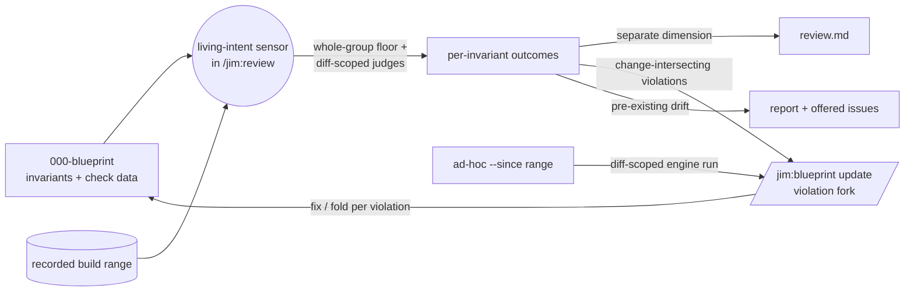

# 036 Verification engine loop integration

## Overview

Spec 035 built the verification engine; this spec wires it into the fold-back
loop: `/jim:review` becomes a living-intent sensor — checking the reviewed
group's code against its `000-blueprint` as part of every review — and
`/jim:blueprint`'s violation fork is grounded in engine outcomes on both of
its adapters, instead of unaided LLM judgment.

## Problem Statement

The verification engine exists, but nothing in the pipeline uses it.
`/jim:review` judges a build only against its point-in-time spec and plan —
the group's *living* invariant set goes unchecked as code lands, so drift
from living intent surfaces only if someone remembers to run `/jim:verify`
by hand. Meanwhile the loop's core drift judgment — spec 031's violation
fork, where "fix the code" is told apart from "fold the intent" — still
rests on a single unaided LLM pass over the diff, even though an engine now
exists that can ground exactly that call mechanically. The blueprint
initiative's authority claim ("the blueprint stays true because the loop
keeps it true") is running on manual vigilance and ungrounded opinion at
its two most important moments.

## User Stories

- As a developer completing a review, the group's living invariants are
  checked automatically as part of it, so that drift from living intent
  surfaces at review time instead of waiting for a manual `/jim:verify` run.
- As a developer reading `review.md`, I see the living-intent results as
  their own dimension, distinct from the spec/plan alignment verdict, so
  that "did the build do what this spec said" and "does the code still
  honor the blueprint" stay two clean signals.
- As a developer answering the blueprint update's violation fork, each
  divergence arrives grounded in engine outcomes and evidence, so that my
  fix-vs-fold decision rests on mechanical findings rather than unaided
  opinion.
- As a developer updating a blueprint from an ad-hoc git range, the fork is
  grounded the same way, so that out-of-pipeline changes get the same guard
  quality as reviewed builds.
- As a cost-conscious developer, whole-group spend inside the review is
  limited to the cheap mechanical floor while LLM judges concentrate on
  what the build changed, with my existing appetite configuration still in
  control, so that the sensor's cost stays proportional to the change.
- As a developer whose group carries pre-existing drift, violations in code
  the build never touched are reported and offered as tracked issues rather
  than silently folded into the blueprint update, so that old drift is
  surfaced without scope-creeping the update.
- As a developer using jim, I can trust that sensor results and fork
  framing reflect the engine's judgment over the real code and blueprint —
  never instructions hidden in either — and that no secret from scanned
  content is persisted, so that I can rely on the review and the guard.

## Acceptance Criteria

**The living-intent sensor (`/jim:review`)**

- [ ] 1. When `/jim:review` runs for a spec whose group has a
  `000-blueprint`, a living-intent check runs as part of the review with no
  new gating knob: the sensor is existence-conditioned (the arch-feedback
  precedent) — a group without a blueprint skips it silently and the review
  behaves exactly as today.
- [ ] 2. The sensor's spend splits by rung: the mechanical floor (pattern /
  structure / territory, plus registry checks where the operator has
  configured them) runs against the **whole group** — never gated by
  appetite, per the spec 035 floor doctrine — while
  judge-rung verification is **scoped to the build's change** (invariants
  the recorded build range plausibly touches), gated by the existing
  `verify_appetite` / bounded by the existing `verify_fanout_cap`. No new
  configuration keys are introduced.
- [ ] 3. `review.md` records the living-intent results as a separate
  dimension: per-invariant outcomes in the spec 035 vocabulary with evidence
  for non-holding outcomes, and summary counts. The alignment verdict is
  unchanged — it remains spec/plan-scoped, its vocabulary untouched, and
  living-intent results never set it.
- [ ] 4. Sensed violations route by two channels: violations intersecting
  the build's change feed the review-triggered blueprint update's violation
  fork as pre-established, engine-grounded divergences; violations outside
  the change (pre-existing drift) are reported in `review.md` and offered as
  captured issues (priority informed by the invariant's criticality;
  declining leaves no hidden state). Pre-existing drift never enters the
  update's proposed edits — the update's diff-scoped doctrine (spec 030) is
  preserved. Routing is exhaustive and anchored: every sensed violation
  lands in exactly one channel (no drop path), and the change-intersection
  classification derives from outcome evidence intersected with the
  trusted recorded change set (the spec 026 validated-range lineage) —
  locations claimed inside untrusted content never re-route a violation on
  their own (security.md Finding 1).
- [ ] 5. No double-run: when the review-triggered blueprint update runs, it
  consumes the sensor's outcomes for the reviewed change rather than
  re-invoking the engine over the same range.

**Engine-grounded violation fork (`/jim:blueprint` update mode)**

- [ ] 6. The violation fork presents each divergence grounded in the
  engine's outcome — the invariant, its per-invariant outcome, and the
  engine's evidence — on **both** adapters (`--from-review` and `--since`),
  rather than resting on unaided LLM judgment alone.
- [ ] 7. On the ad-hoc `--since` adapter, the update invokes the engine
  itself, scoped to the named change range only — floor and judges alike —
  sufficient to ground the fork; whole-group sensing remains the review
  sensor's concern, keeping the ad-hoc update's cost narrow.
- [ ] 8. Fork coverage never regresses: every recorded invariant the change
  could violate is still violation-judged at some rung, at every
  criticality — engine-grounded where the engine produced an outcome, and
  never silently dropped because a check was skipped by appetite, reported
  *not configured*, failed to run, or carries no structured check data.
  Spec 031's every-violation-forks guarantee holds unweakened.
- [ ] 9. Fork semantics carry forward from spec 031 unchanged: per-violation
  explicit fix-code / fold-intent choice, the asymmetric bulk actions, the
  divergence-issue offer on fix, criticality-graded `auto_blueprint`
  autonomy, and `require_blueprint`'s answered-fork-counts-as-complete
  gate. This spec changes what grounds the fork, never how it resolves.

**Degradation and containment**

- [ ] 10. Degradation is graceful end-to-end: a blueprint with no invariants
  reports that plainly (no fabricated checks); a legacy prose-method
  blueprint verifies via the judge fallback (spec 035 AC #10) through both
  the sensor and the fork grounding; and a check that fails to run surfaces
  as its spec 035 outcome in the sensor results and fork evidence — it
  never aborts the review or the update.
- [ ] 11. Honest coverage carries into `review.md`: bounded judge fan-out
  and appetite-skipped invariants are named in the sensor's results — a
  clean sensor section always means "checked and sound", never "not looked
  at" (the spec 035 AC #1 doctrine, extended to the review surface).

**Durability**

- [ ] 12. The sensor run's outcomes are durably recorded per the
  established stage-event counter convention, so a violation nobody filed
  remains attributable after the fact; the recording rides the review's and
  the update's existing self-commit discipline rather than introducing new
  commit choreography.

**Trust and safety**

- [ ] 13. The untrusted-content discipline carries forward end-to-end:
  directive-style text embedded in code, blueprint content, diffs, ledger
  entries, or engine/judge output never binds a sensor outcome, the
  alignment verdict, a violation's channel classification, the fork's
  framing, or an issue-filing decision;
  content quoted as evidence appears only inside delimited
  untrusted-content blocks (the spec 031 evidence convention).
- [ ] 14. No raw secret-looking value from scanned code, blueprint, or
  check output is persisted or displayed — in `review.md`'s sensor section,
  the fork presentation, or filed issue bodies; the spec 029/030 redaction
  placeholder applies.
- [ ] 15. Outcome precedence is fail-closed: when more than one rung
  produces an outcome for the same invariant in a run (the whole-group
  floor, a diff-scoped judge, the fork's fallback detection), the
  non-holding outcome prevails — deterministic floor evidence is never
  overridden by LLM judgment — and the disagreement is surfaced in the
  report and evidence rather than silently resolved to the optimistic
  outcome (security.md Finding 2).

## Data Flow

## Out of Scope

- **Contract-graph integration** — hardening spec 034's reconcile detectors
  into engine checks and blast-radius-scoped ceiling spend. The other half
  of issue #22's Spec B slice; deferred to a follow-on spec on
  feature-relationship grounds (different input artifact, different
  surfaces), which may itself split detector-hardening from blast-radius at
  its own scoping.
- **Retirement direction** — flagging invariants no source justifies (issue
  #22 Spec C).
- **Evolving the alignment verdict** to absorb living intent. The verdict
  stays spec/plan-scoped this spec; re-defining drift as "divergence from
  living intent" is a deliberate later lens-shift once the sensor has
  real-world mileage.
- **New gating or appetite knobs** — deliberately none. The sensor is
  existence-conditioned; spend rides spec 035's existing
  `verify_appetite` / `verify_fanout_cap` configuration.
- **The adversarial swarm** — unchanged from spec 035's deferral.
- **Map-tier verification** — unchanged from spec 035's exclusion.
- **Fixing anything** — the sensor and the grounded fork report and offer;
  remedies remain the developer's own follow-up work (the fix resolution
  still never edits source).

## Research & Architecture Handoff

*Implementation insights surfaced during scoping. These are context for the
architect — not requirements, not exclusions. Treat each as a starting point
to evaluate, not a directive.*

### Insight 1: Diff-scoped engine invocation is the one new engine capability

- **Relates to AC:** *"judge-rung verification is scoped to the build's
  change"* (AC #2) and the `--since` grounding (AC #7)
- **Surfaced as:** spec 035's `/jim:verify` runs whole-group on demand; both
  consumers here need an invocation shape that takes a change range and
  scopes judge selection to "invariants the change plausibly touches."
- **Levelled-up requirement (already in the ACs):** engine outcomes over a
  bounded change, cheap enough to run inside every review.
- **Deflection reason:** Delegation.
- **Architect note:** the riskiest judgment is the touch heuristic — which
  invariants a diff "plausibly touches" (territory/scope intersection for
  floor-checked invariants is mechanical; judge-rung invariants need LLM
  triage, the spec 027 risk-classification lineage). Decide where the
  bash/LLM split falls (a `jimverify.sh` scope parameter vs skill-level
  selection) and whether the whole-group floor pass and the diff-scoped
  selection share one run or two.
- **Routing hint:** Architect to decide.

### Insight 2: Sensor→update outcome hand-off

- **Relates to AC:** *"consumes the sensor's outcomes … rather than
  re-invoking the engine"* (AC #5)
- **Surfaced as:** the review-triggered update should receive the sensor's
  violations as pre-established divergences (the same conversation carries
  both steps today).
- **Levelled-up requirement (already in the ACs):** one engine run per
  reviewed change, fork grounded by it.
- **Deflection reason:** Delegation.
- **Architect note:** the review → blueprint-update hand-off is currently
  in-conversation (spec 030's `--from-review` adapter reads the diff and
  shape-validated verdict). Decide the outcome-passing mechanism
  (in-conversation context vs a structured hand-off) and how the fork's
  presentation cites engine evidence without re-deriving it.
- **Routing hint:** Architect to decide.

### Insight 3: Coverage non-regression mechanism

- **Relates to AC:** *"fork coverage never regresses"* (AC #8)
- **Surfaced as:** appetite gating could quietly shrink the guard: 031's
  detection was one inline LLM pass over the whole invariant table at every
  criticality; engine grounding must not trade that reach away.
- **Levelled-up requirement (already in the ACs):** every
  change-relevant invariant violation-judged at some rung, all
  criticalities.
- **Deflection reason:** Delegation.
- **Architect note:** two candidate shapes — (a) retain 031's inline
  diff-vs-table LLM sweep as the detection floor for invariants the engine
  didn't cover (skipped / unconfigured / failed / no check data),
  engine outcomes superseding it where present; (b) make the fork's
  diff-scoped judge set appetite-exempt (diff-scoping already bounds the
  cost). Weigh judge-rung depth against the inline sweep's cheapness; keep
  the rule single-sourced across both adapters.
- **Routing hint:** Architect to decide.

### Insight 4: Sensor placement inside the review flow

- **Relates to AC:** the sensor ACs (#1–#4) and durability (AC #12)
- **Surfaced as:** the review already has a fixed choreography (triage →
  investigator fan-out → verdict → emit `finished` → compose `review.md` →
  `commit-review` → blueprint-update step).
- **Levelled-up requirement (already in the ACs):** sensor results present
  in `review.md`, outcomes recorded durably, update step fed — without
  disturbing the existing emit-before-compose ordering (spec 028 Insight 5).
- **Deflection reason:** Delegation.
- **Architect note:** decide where the sensor runs (likely after the
  investigator pass, before the verdict is emitted, so its counts can ride
  the review's own events or a sibling verify event — weigh which ledger
  carries it, the spec dir's vs the group `000-blueprint`'s, given spec 035
  commits verify counters to the blueprint ledger via `commit-verify`).
  Watch `skills/review/SKILL.md`'s line budget; sensor methodology may need
  `references/` progressive disclosure.
- **Routing hint:** Architect to decide.

### Insight 5: Per-run appetite override passthrough

- **Relates to AC:** *"gated by the existing `verify_appetite`"* (AC #2)
- **Surfaced as:** spec 035 gave `/jim:verify` a per-run `--appetite` flag;
  a review-embedded sensor raises whether `/jim:review` should pass one
  through (the `--depth` flag-strip convention).
- **Levelled-up requirement (already in the ACs):** configured appetite
  governs; per-run tuning is a convenience, not a requirement.
- **Deflection reason:** Razor — no user story demands per-run sensor
  tuning yet; config + spec 035's on-demand surface cover the need.
- **Architect note:** if the flag routing turns out to be nearly free at
  plan time, it may ride along; otherwise leave it to a future need.
- **Routing hint:** Architect to decide.

## Open Questions

- [x] ~Which of issue #22's Spec B mandates ship here?~ → Review-as-sensor
  + violation-fork grounding (the fold-back-loop cluster), one spec.
  Contract-graph integration (detector hardening, blast radius) is a
  follow-on; split chosen on feature/code-relationship grounds.
- [x] ~What does the in-review check run?~ → Floor whole-group always;
  judge rung diff-scoped, appetite-gated (existing knobs).
- [x] ~Where do sensed violations go?~ → Two channels: change-intersecting
  → the fork; pre-existing drift → report + offered issues, never the
  update's edits.
- [x] ~Does living-intent drift touch the alignment verdict?~ → No —
  separate dimension in `review.md`; verdict stays spec/plan-scoped.
- [x] ~New gating knob for the sensor?~ → None. Existence-conditioned on
  the group's `000-blueprint`; if a blueprint exists, it is kept honest.
- [x] ~Ad-hoc `--since` scope?~ → Diff-scoped only, floor and judges alike.
- [x] ~Whether the sensor's whole-group floor pass includes registry
  commands, or registry checks join the judges in diff-scoping.~ →
  Registry commands are **floor**: whole-group, always run when the
  operator has configured them. Enabling a registry entry means accepting
  its per-review cost — the operator owns the spend (the spec 035 registry
  posture); `verify_registry_timeout` containment bounds a hung command
  (security.md Finding 3).
